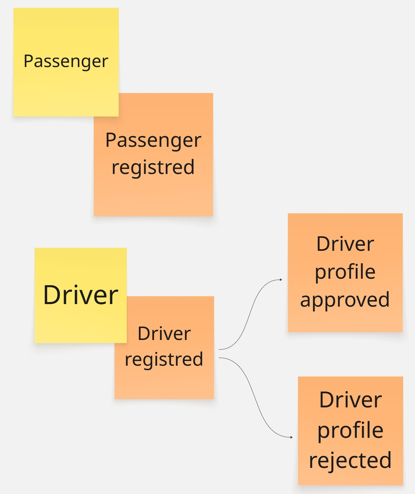
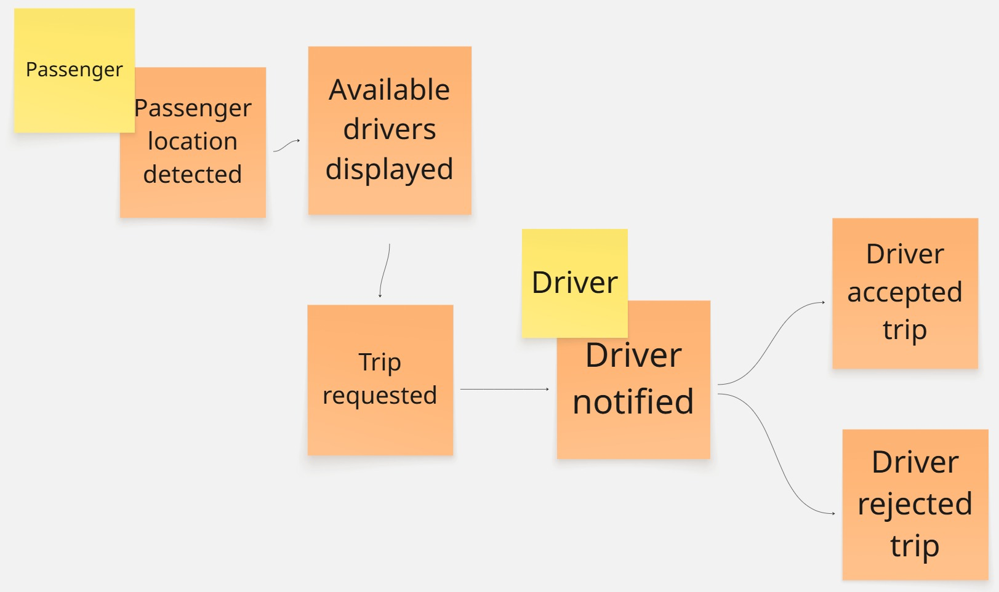
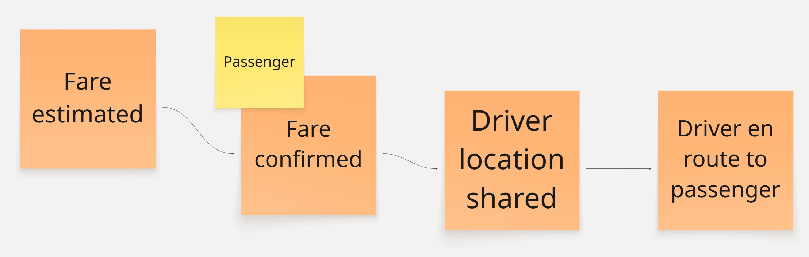
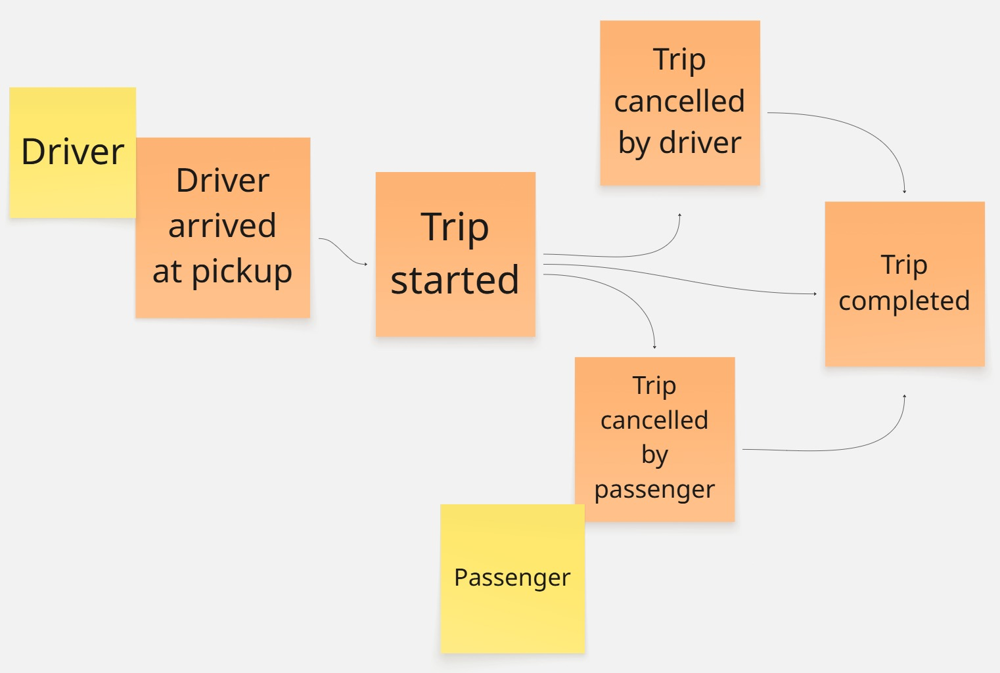
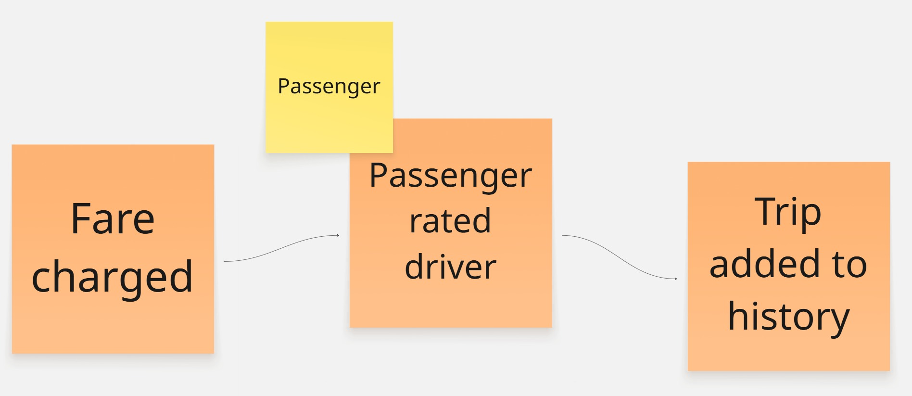

# Capítulo II: Introducción

## 2.1 Competidores

### 2.1.1. Análisis competitivo

### 2.1.2. Estrategias y tácticas frente a competidores

  La estrategia competitiva de ChapaTuRuta se orienta a aprovechar la oportunidad existente en el mercado de transporte en ciudades intermedias y zonas periféricas del Perú, donde las plataformas tradicionales presentan baja cobertura y el servicio informal continúa predominando. Frente a competidores como InDrive, Uber y el trasporte informal, nuestra propuesta busca diferenciarse mediante una solución especializada en mototaxis y motos lineales, adaptada a las necesidades reales de pasajeros y conductores en provincias.
  Como estrategia principal, se plantea el posicionamiento del producto a partir de sus fortalezas, especialmente el enfoque local, la accesibilidad tecnológica y la especialización del servicio. Esto permitirá responder a problemáticas identificadas como la falta de confianza, la informalidad del sector y la ausencia de herramientas digitales adaptadas a este tipo de transporte.
  En cuanto a las tácticas, se priorizará la formación de alianzas con asociaciones de mototaxistas y líderes locales, con el fin de facilitar la incorporación de conductores a la plataforma y reducir la resistencia al cambio frente al uso de herramientas digitales. Asimismo, se desarrollarán campañas de difusión en redes sociales y medios regionales, con el objetivo de reforzar la propuesta de valor centrada en seguridad, disponibilidad y rapidez del servicio.
  Finalmente, para enfrentar amenazas como el posicionamiento de marca de competidores consolidados y la preferencia habitual por el transporte informal, la plataforma incorporará funcionalidades orientadas a generar una experiencia del uso más segura, confiable y adaptada al contexto local. Entre ellas destacan la verificación de documentos del conductor, que incluyen licencia y SOAT vigente, lo cual permitirá brindar mayor respaldo al pasajero antes de confirmar el servicio. Del mismo modo, se implementará un sistema de calificaciones y comentarios mutuos entre pasajero y conductor, con el objetivo de fortalecer la confianza dentro del ecosistema y promover estándares de calidad en cada viaje.
  Adicionalmente, la geolocalización en tiempo real permitirá al usuario visualizar la ubicación del conductor cercano, estimar su tiempo de llegada y realizar un seguimiento básico del recorrido, lo cual reduce la incertidumbre propia del transporte informal. A ello se suma la visualización previa de la tarifa estimada o negociada antes de iniciar el viaje, funcionalidad clave para disminuir confictos por cobros arbitrarios y mejorar la transparencia del servicio. Estas características no solo representan una ventaja competitiva frente a las alternativas actuales, sino que también contribuyen a formalizar progresivamente la experiencia de movilidad en mototaxi dentro de las ciudades objetivo.

## 2.2 Entrevistas

### 2.2.1. Diseño de entrevistas

#### Objetivo

- Comprender las necesidades, comportamientos, problemas y expectativas
  que todo ciudadano fuera de Lima tiene respecto al uso de servicios
  de transporte en mototaxis y moto lineal

#### Publico Objetivo

##### Se entrevistarán dos tipos de usuarios:

- Pasajeros frecuentes de mototaxis en provincias
- Conductores de motos lineales y mototaxis

##### Características:

- Edad: 18 a 60 años
- Uso frecuente de transporte informal
- Acceso a un smarthphone

#### Tipo de entrevistas:

- Se utilizarán entrevistas previamente estructuradas por el equipo de este proyecto
  permitiendo obtener la información necesaria y detallada según cada respuesta del
  entrevistado

#### Metodología:

- Modalidad: Virtual
- Duración: 10 a 15 min por entrevista
- Registro: habrá un registro de entrevistas con notas escritas en nuestro proyecto

#### Preguntas para pasajeros:

1. ¿Con qué frecuencia utilizas mototaxis o motos lineales?
2. ¿Qué problemas has experimentado al usar estos servicios?
3. ¿Cómo sueles acordar el precio de un viaje?
4. ¿Qué factores consideras importantes al elegir un conductor?
5. ¿Te has sentido inseguro en algún viaje? ¿Por qué?
6. ¿Qué te haría confiar en una aplicación de transporte?
7. ¿Has utilizado aplicaciones como InDrive? ¿Cómo fue tu experiencia?
8. ¿Qué funcionalidades te gustaría que tenga una app de transporte?

#### Preguntas para conductores:

1. ¿Cuánto tiempo llevas trabajando como conductor?
2. ¿Cuáles son las principales dificultades que enfrentas en tu trabajo?
3. ¿Cómo consigues pasajeros actualmente?
4. ¿Qué opinas sobre el uso de aplicaciones para conseguir clientes?
5. ¿Te gustaría negociar precios desde una app? ¿Por qué?
6. ¿Qué funcionalidades te ayudarían a mejorar tus ingresos?
7. ¿Qué te motivaría a usar una aplicación como InMoto?

#### Consideraciones éticas:

- Se le solicitará al entrevistado el consentimiento de la grabación
  de las entrevistas asi como el trato de su información
- Se garantizará confidencialidad de información proporcionada
- Los datos solo serán utilizados con fines académicos

### 2.2.2. Registro de entrevistas

### 2.2.3. Análisis de entrevistas

## 2.3 Need finding

### 2.3.1. User Personas

### 2.3.2. User Task Matrix

La User Task Matrix nos permite descomponer las actividades y tareas que nuestros usuarios realizan al utilizar la solución propuesta. Estas tareas, al clasificarse por su frecuencia e importancia, nos ayudan a priorizar qué funcionalidades de ChapaTuRuta deben desarrollarse con mayor énfasis para optimizar la experiencia de cada segmento.

Los segmentos considerados para este análisis son:

- **Pasajero (Ana Flores)**
- **Mototaxista (Luis Gutiérrez)**

---

### Task Matrix

| **Tarea**                                               | **Ana Flores (Pasajero)** |                 | **Luis Gutiérrez (Mototaxista)** |                 |
| ------------------------------------------------------- | ------------------------- | --------------- | -------------------------------- | --------------- |
|                                                         | **Frecuencia**            | **Importancia** | **Frecuencia**                   | **Importancia** |
| Solicitar un viaje                                      | Always                    | High            | Never                            | —               |
| Aceptar o rechazar solicitudes de viaje                 | Never                     | —               | Always                           | High            |
| Consultar disponibilidad de mototaxistas cercanos       | Always                    | High            | Rarely                           | Low             |
| Activar/desactivar disponibilidad para recibir carreras | Never                     | —               | Always                           | High            |
| Revisar el perfil y calificación del conductor          | Often                     | High            | Rarely                           | Low             |
| Calificar al conductor al finalizar el viaje            | Often                     | High            | Often                            | High            |
| Calificar al pasajero al finalizar el viaje             | Never                     | —               | Often                            | Medium          |
| Consultar historial de viajes realizados                | Sometimes                 | Medium          | Sometimes                        | Medium          |
| Verificar el precio referencial del viaje               | Always                    | High            | Sometimes                        | Medium          |
| Gestionar datos del perfil personal                     | Sometimes                 | Medium          | Sometimes                        | Medium          |
| Verificar documentos del conductor (brevete, SOAT)      | Sometimes                 | High            | Rarely                           | Low             |
| Reportar incidencias o problemas en el viaje            | Rarely                    | High            | Rarely                           | High            |

---

### Análisis

El **pasajero** concentra sus acciones en encontrar transporte de forma rápida y confiable. Sus tareas de mayor frecuencia e importancia giran en torno a solicitar el viaje, verificar el precio referencial y revisar el perfil del conductor antes de aceptar. La calificación post-viaje también es relevante porque alimenta el sistema de confianza de la plataforma, que es precisamente el diferenciador de ChapaTuRuta frente al contacto informal por WhatsApp.

El **mototaxista** orienta su actividad a la gestión de su disponibilidad y la atención de carreras. Activarse en la plataforma y aceptar solicitudes son sus tareas más frecuentes e importantes, siendo estas el núcleo de su experiencia. La calificación que recibe de los pasajeros impacta directamente en su visibilidad dentro de la app, por lo que también tiene un peso significativo en su rutina.

Ambos perfiles coinciden en la importancia de **calificar al finalizar el viaje** y **reportar incidencias**, ya que estas acciones sostienen la confianza y seguridad del ecosistema. Cualquier problema no reportado deteriora la experiencia de ambos lados de la plataforma.

### 2.3.3. User Journey Mapping

### 2.3.4. Empathy Mapping

## 2.4 Big Picture Even Storming

### Registro

En esta fase se modela el proceso de incorporación de nuevos usuarios a la plataforma. El pasajero y el conductor se registran proporcionando sus datos básicos.

### Descubrimiento

Una vez registrado, el pasajero abre la aplicación y su ubicación es detectada automáticamente. El sistema muestra en un mapa los conductores disponibles cercanos.

### Pre-viaje

Una vez aceptada la solicitud, el sistema calcula automáticamente la tarifa estimada basándose en la distancia. El pasajero confirma la tarifa antes de iniciar el viaje.

### Ejecucion del viaje

El conductor llega al punto de recojo y confirma el inicio del viaje. Durante esta fase el trayecto queda registrado en el sistema. El viaje puede ser cancelado por cualquiera de las dos partes.

### Post-viaje

Al completarse el viaje, el sistema registra el cobro de la tarifa y solicita la calificacion del conductor.

## 2.5 Ubiquitous Language
