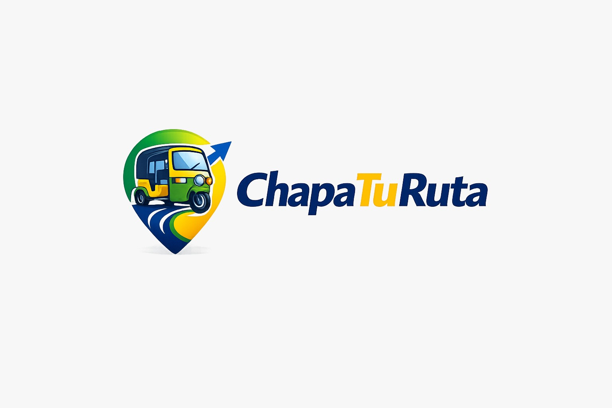
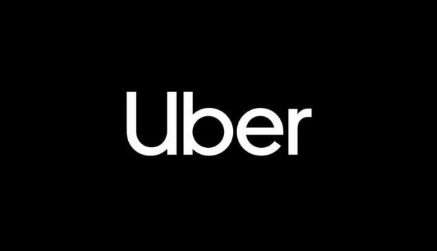
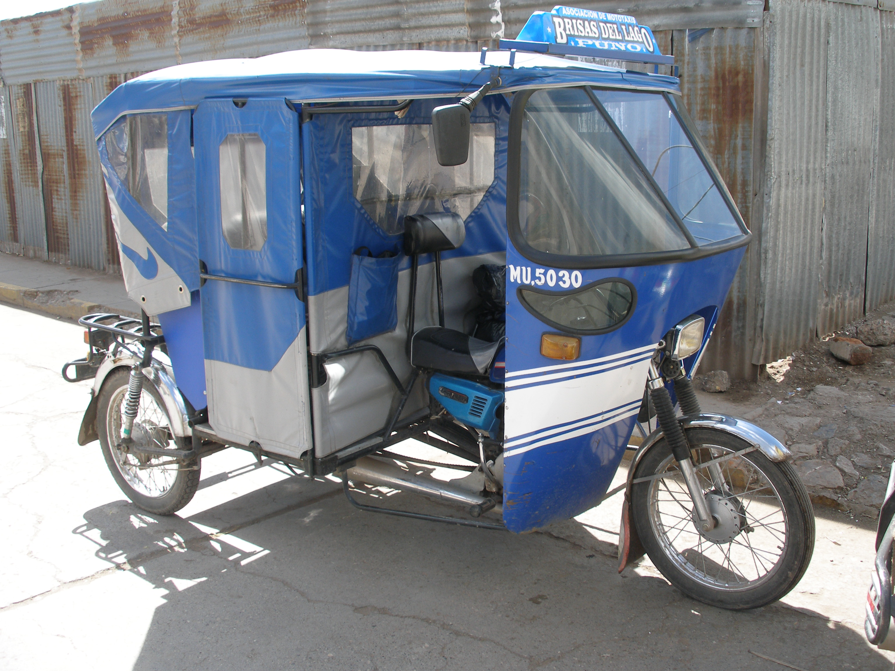
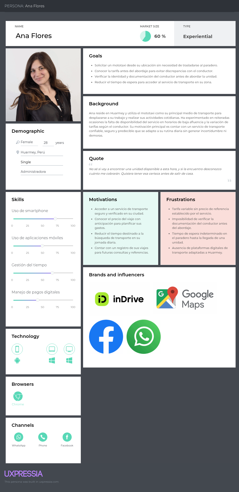
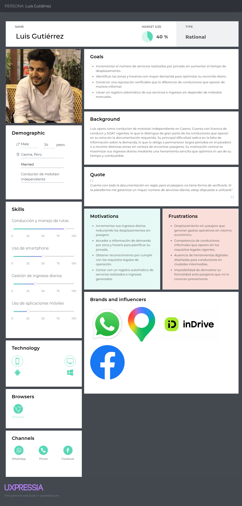
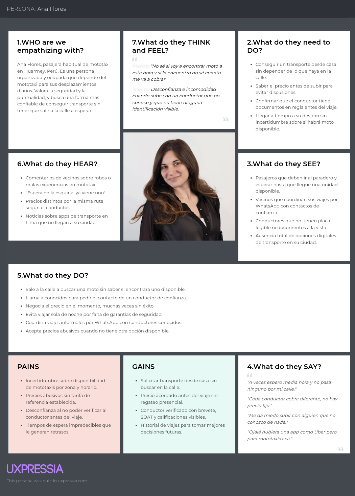
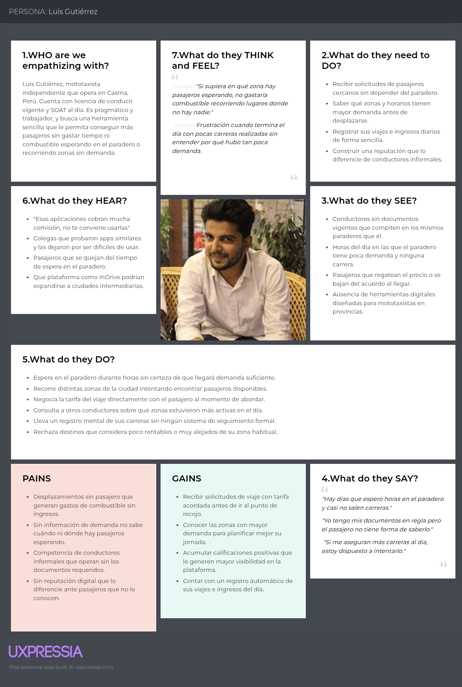

# Capítulo II: Requirements Elicitation & Analysis

## 2.1 Competidores

### 2.1.1. Análisis competitivo 
<table style="width:100%; border-collapse:collapse; table-layout:fixed;" border="1" align="center">
  <!-- Título principal -->
  <tr>
    <th colspan="6" align="center">Competitive Analysis Landscape</th>
  </tr>
  <!-- Justificación -->
  <tr>
    <td rowspan="2" align="center"><b>¿Por qué llevar a cabo este análisis?</b></td>
    <td colspan="5" align="center">
      Identificar fortalezas, debilidades y estrategias de los principales competidores directos (Uber, inDrive y transportes Informales) para posicionar nuestra aplicación web.
    </td>
  </tr>
  <tr>
    <td colspan="5">
      <b>Objetivo:</b> Determinar cómo diferenciar nuestro producto frente a competidores.   
    </td>
  </tr>
  <!-- Encabezados con logos -->
  <tr>
    <th colspan="2" style="width:20%">(En la cabecera colocar por cada competidor nombre y logo)</th>
    <th style="width:20%">
      
    </th>
    <th style="width:20%">
      
    </th>
    <th style="width:20%">
      
    </th>   
    <th style="width:20%">
      
    </th>
  </tr>
  <!-- PERFIL -->
  <tr>
    <td rowspan="2" align="center"><b>Perfil</b></td>
    <td><b>Overview</b></td>
    <td>Plataforma que conecta pasajeros con mototaxistas en zonas periféricas, permitiendo negociación previa de tarifas.  </td>
    <td>Plataforma de intermediación en servicios de movilidad que implementa un modelo de pricing descentralizado, en el cual la tarifa es definida mediante negociación directa entre pasajero y conductor.  </td>
    <td>Plataforma global con tarifas dinámicas automatizadas.</td>
    <td>Sistema tradicional informal basado en contacto directo en la vía pública.</td>
  </tr>
  <tr>
    <td><b>Ventaja competitiva: ¿Qué valor ofrece a los clientes?</b></td>
    <td> Adaptación del transporte informal mediante digitalización ligera, permitiendo negociación previa en entornos de baja conectividad. </td>
    <td> Plataforma que ofrece flexibilidad en la definición de precios mediante negociación directa entre usuario y conductor.</td>
    <td> Alta disponibilidad respaldada por infraestructura tecnológica avanzada y sistemas de seguridad en los viajes.</td>
    <td> Alta presencia local y rapidez en zonas de difícil acceso. </td>
  </tr>
  <!-- PERFIL DE MARKETING -->
  <tr>
    <td rowspan="2" align="center"><b>Perfil de Marketing</b></td>
    <td><b>Mercado objetivo</b></td>
    <td> Usuarios en zonas rurales o alejadas</td>
    <td> Usuarios sensibles al precio en ciudades </td>
    <td> Usuarios urbanos con acceso a smartphones y pagos digitales. </td>
    <td> Población local sin acceso a apps o transporte formal </td>
  </tr>
  <tr>
    <td><b>Estrategias de marketing</b></td>
    <td> Alianzas con asociaciones de mototaxistas, boca a boca, campañas locales además de promocionarse por redes sociales</td>
    <td> Uso de marketing digital con la premisa de “precio justo”. </td>
    <td> Promociones, descuentos, posicionamiento global. </td>
    <td> Paraderos físicos o recomendaciones locales </td>
  </tr>
  <!-- PERFIL DE PRODUCTO -->
  <tr>
    <td rowspan="3" align="center"><b>Perfil de Producto</b></td>
    <td><b>Productos & Servicios</b></td>
    <td>Facilidad de transporte mediante mototaxi y motos lineales.</td>
    <td>Transporte en vehículos particulares y servicios de entrega.</td>
    <td>Transporte urbano (UberX, Uber Moto), delivery (Uber Eats).</td>
    <td>Transporte en mototaxis y motos lineales mediante contacto directo.</td>
  </tr>
  <tr>
    <td><b>Precios & Costos</b></td>
    <td>Precio basado en negociación previa entre pasajero y conductor.</td>
    <td>Modelo de negociación directa donde el usuario propone la tarifa, complementado con comisión por viaje aplicado por la plataforma.</td>
    <td>Modelo de negociación basado en oferta y demanda, con comisión por transacción.</td>
    <td>Negociación presencial sin estandarización de tarifas o formalidad de costos.</td>
  </tr>
  <tr>
    <td><b>Canales de distribución (Web y/o Móvil)</b></td>
    <td>Aplicación web progresiva (PWA) accesible desde navegador móvil, complementada con difusión mediante redes sociales y alianzas con asociaciones locales </td>
    <td>Aplicación móvil (Android / iOS) distribuida mediante tiendas digitales y campañas de marketing digital </td>
    <td>Aplicación móvil (Android / iOS) distribuida globalmente a través de tiendas digitales y ecosistema digital integrado</td>
    <td>Canal presencial basado en paraderos informales, contacto directo en vía pública</td>
  </tr>
  <!-- SWOT -->
  <tr>
    <td rowspan="4" align="center"><b>Análisis SWOT</b></td>
    <td><b>Fortalezas</b></td>
    <td>Modelo híbrido que combina la flexibilidad del transporte informal con la coordinación digital.</td>
    <td>Implementación de un modelo donde se prioriza el control sobre los costos a los usuarios.</td>
    <td>Fuerte posicionamiento de la marca y gran percepción de seguridad.</td>
    <td>Costos operatvos bajos, además de una alta adaptabilidad en diferentes zonas.</td>
  </tr>
  <tr>
    <td><b>Debilidades</b></td>
    <td>Dependencia de adopción inicial en un entorno con baja confianza digital y limitada experiencia tecnológica de los conductores</td>
    <td>Variabilidad de costos entre el conductor y pasajero, generando inconsistencia en la experiencia.</td>
    <td>Baja eficiencia en zonas rurales o de baja densidad de usuarios.</td>
    <td>Ausencia de sistemas de información y coordinación.</td>
  </tr>
  <tr>
    <td><b>Oportunidades</b></td>
    <td>Alta demanda insatisfecha en zonas rurales y posibilidad de digitalizar un sistema de transporte ya existente.</td>
    <td>Usuarios con preferencias a precios accesibles.</td>
    <td>Expansión y adopción de nuevos servicios.</td>
    <td>Posibilidad de integración a plataformas digitales que mejoren la coordinación y seguridad.</td>
  </tr>
  <tr>
    <td><b>Amenazas</b></td>
    <td>Resistencia al cambio por parte de conductores informales.</td>
    <td>Regulaciones locales sobre transporte informal.</td>
    <td>Competidores locales adoptados culturalmente.</td>
    <td>Regulación por parte de las instituciones del estado.</td>
  </tr>
</table>

### 2.1.2. Estrategias y tácticas frente a competidores

  La estrategia competitiva de ChapaTuRuta se orienta a aprovechar la oportunidad existente en el mercado de transporte en ciudades intermedias y zonas periféricas del Perú, donde las plataformas tradicionales presentan baja cobertura y el servicio informal continúa predominando. Frente a competidores como InDrive, Uber y el transporte informal, nuestra propuesta busca diferenciarse mediante una solución especializada en mototaxis y motos lineales, adaptada a las necesidades reales de pasajeros y conductores en provincias.
  Como estrategia principal, se plantea el posicionamiento del producto a partir de sus fortalezas, especialmente el enfoque local, la accesibilidad tecnológica y la especialización del servicio. Esto permitirá responder a problemáticas identificadas como la falta de confianza, la informalidad del sector y la ausencia de herramientas digitales adaptadas a este tipo de transporte.
  En cuanto a las tácticas, se priorizará la formación de alianzas con asociaciones de mototaxistas y líderes locales, con el fin de facilitar la incorporación de conductores a la plataforma y reducir la resistencia al cambio frente al uso de herramientas digitales. Asimismo, se desarrollarán campañas de difusión en redes sociales y medios regionales, con el objetivo de reforzar la propuesta de valor centrada en seguridad, disponibilidad y rapidez del servicio.
  Finalmente, para enfrentar amenazas como el posicionamiento de marca de competidores consolidados y la preferencia habitual por el transporte informal, la plataforma incorporará funcionalidades orientadas a generar una experiencia de uso más segura, confiable y adaptada al contexto local. Entre ellas destacan la verificación de documentos del conductor, que incluyen licencia y SOAT vigente, lo cual permitirá brindar mayor respaldo al pasajero antes de confirmar el servicio. Del mismo modo, se implementará un sistema de calificaciones y comentarios mutuos entre pasajero y conductor, con el objetivo de fortalecer la confianza dentro del ecosistema y promover estándares de calidad en cada viaje.
  Adicionalmente, la geolocalización en tiempo real permitirá al usuario visualizar la ubicación del conductor cercano, estimar su tiempo de llegada y realizar un seguimiento básico del recorrido, lo cual reduce la incertidumbre propia del transporte informal. A ello se suma la visualización previa de la tarifa estimada o negociada antes de iniciar el viaje, funcionalidad clave para disminuir conflictos por cobros arbitrarios y mejorar la transparencia del servicio. Estas características no solo representan una ventaja competitiva frente a las alternativas actuales, sino que también contribuyen a formalizar progresivamente la experiencia de movilidad en mototaxi dentro de las ciudades objetivo.

## 2.2 Entrevistas

### 2.2.1. Diseño de entrevistas

#### Objetivo

- Comprender las necesidades, comportamientos, problemas y expectativas
  que todo ciudadano fuera de Lima tiene respecto al uso de servicios
  de transporte en mototaxis y moto lineal

#### Publico Objetivo

##### Se entrevistarán dos tipos de usuarios:

- Pasajeros frecuentes de mototaxis en provincias
- Conductores de motos lineales y mototaxis

##### Características:

- Edad: 18 a 60 años
- Uso frecuente de transporte informal
- Acceso a un smartphone

#### Tipo de entrevistas:

- Se utilizarán entrevistas previamente estructuradas por el equipo de este proyecto
  permitiendo obtener la información necesaria y detallada según cada respuesta del
  entrevistado

#### Metodología:

- Modalidad: Virtual
- Duración: 10 a 15 min por entrevista
- Registro: habrá un registro de entrevistas con notas escritas en nuestro proyecto

#### Preguntas para pasajeros:

1. ¿Con qué frecuencia utilizas mototaxis o motos lineales?
2. ¿Qué problemas has experimentado al usar estos servicios?
3. ¿Cómo sueles acordar el precio de un viaje?
4. ¿Qué factores consideras importantes al elegir un mototaxista?
5. ¿Te has sentido inseguro en algún viaje? ¿Por qué?
6. ¿Qué te haría confiar en una aplicación de transporte?
7. ¿Has utilizado aplicaciones como InDrive? ¿Cómo fue tu experiencia?
8. ¿Qué funcionalidades te gustaría que tenga una app de transporte?

#### Preguntas para conductores:

1. ¿Cuánto tiempo llevas trabajando como conductor?
2. ¿Cuáles son las principales dificultades que enfrentas en tu trabajo?
3. ¿Cómo consigues pasajeros actualmente?
4. ¿Qué opinas sobre el uso de aplicaciones para conseguir clientes?
5. ¿Te gustaría negociar precios desde una app? ¿Por qué?
6. ¿Qué funcionalidades te ayudarían a mejorar tus ingresos?
7. ¿Qué te motivaría a usar una aplicación como InMoto?

#### Consideraciones éticas:

- Se le solicitará al entrevistado el consentimiento de la grabación
  de las entrevistas asi como el trato de su información
- Se garantizará confidencialidad de información proporcionada
- Los datos solo serán utilizados con fines académicos

### 2.2.2. Registro de entrevistas

#### 1. Primer Segmento Objetivo: Pasajeros

<table style="width: 100%" align='center'>
  <tr>
    <th>Entrevistado 1</th>
    <th>Entrevistado 2</th>
    <th>Entrevistado 3</th>
  </tr>
  <tr>
    <td align='center'>
      
    </td>
    <td align='center'>
      
    </td>
    <td align='center'>
      
    </td>
  </tr>
  <tr>
    <td valign="top">
      <b>Entrevistador:</b> [Nombre Entrevistador]  
      <b>Entrevistado:</b> [Nombre Entrevistado]  
      <b>Edad:</b> [Edad] años  
      <b>Distrito:</b> [Distrito]  
      <b>Inicio de la entrevista:</b> [Minuto de Inicio]   
      <b>Resumen:</b> [Escribe el resumen de la entrevista aquí...]  
      <b>Perfil del entrevistado:</b> [Escribe el perfil del entrevistado aquí...]
    </td>
    <td valign="top">
      <b>Entrevistador:</b> [Nombre Entrevistador]  
      <b>Entrevistado:</b> [Nombre Entrevistado]  
      <b>Edad:</b> [Edad] años  
      <b>Distrito:</b> [Distrito]  
      <b>Inicio de la entrevista:</b> [Minuto de Inicio]   
      <b>Resumen:</b> [Escribe el resumen de la entrevista aquí...]  
      <b>Perfil del entrevistado:</b> [Escribe el perfil del entrevistado aquí...]
    </td>
    <td valign="top">
      <b>Entrevistador:</b> [Nombre Entrevistador]  
      <b>Entrevistado:</b> [Nombre Entrevistado]  
      <b>Edad:</b> [Edad] años  
      <b>Distrito:</b> [Distrito]  
      <b>Inicio de la entrevista:</b> [Minuto de Inicio]   
      <b>Resumen:</b> [Escribe el resumen de la entrevista aquí...]  
      <b>Perfil del entrevistado:</b> [Escribe el perfil del entrevistado aquí...]
    </td>
  </tr>
</table>

Link de entrevistas: <a href="[LINK_CARPETA_ENTREVISTAS]" target="_blank">Segmento 01- Pasajeros</a>

#### 2. Segundo Segmento Objetivo: Conductores

<table style="width: 100%" align='center'>
  <tr>
    <th>Entrevistado 1</th>
    <th>Entrevistado 2</th>
    <th>Entrevistado 3</th>
  </tr>
  <tr>
    <td align='center'>
      
    </td>
    <td align='center'>
      
    </td>
    <td align='center'>
      
    </td>
  </tr>
  <tr>
    <td valign="top">
      <b>Entrevistador:</b> [Nombre Entrevistador]  
      <b>Entrevistado:</b> [Nombre Entrevistado]  
      <b>Edad:</b> [Edad] años  
      <b>Distrito:</b> [Distrito]  
      <b>Inicio de la entrevista:</b> [Minuto de Inicio]   
      <b>Resumen:</b> [Escribe el resumen de la entrevista aquí...]  
      <b>Perfil del entrevistado:</b> [Escribe el perfil del entrevistado aquí...]
    </td>
    <td valign="top">
      <b>Entrevistador:</b> [Nombre Entrevistador]  
      <b>Entrevistado:</b> [Nombre Entrevistado]  
      <b>Edad:</b> [Edad] años  
      <b>Distrito:</b> [Distrito]  
      <b>Inicio de la entrevista:</b> [Minuto de Inicio]   
      <b>Resumen:</b> [Escribe el resumen de la entrevista aquí...]  
      <b>Perfil del entrevistado:</b> [Escribe el perfil del entrevistado aquí...]
    </td>
    <td valign="top">
      <b>Entrevistador:</b> [Nombre Entrevistador]  
      <b>Entrevistado:</b> [Nombre Entrevistado]  
      <b>Edad:</b> [Edad] años  
      <b>Distrito:</b> [Distrito]  
      <b>Inicio de la entrevista:</b> [Minuto de Inicio]   
      <b>Resumen:</b> [Escribe el resumen de la entrevista aquí...]  
      <b>Perfil del entrevistado:</b> [Escribe el perfil del entrevistado aquí...]
    </td>
  </tr>
</table>

Link de entrevistas: <a href="[LINK_CARPETA_ENTREVISTAS]" target="_blank">Segmento 02- Conductores</a>

Más informacion en Anexo A.

### 2.2.3. Análisis de entrevistas

## 2.3 Need finding

### 2.3.1. User Personas
Para comprender mejor las necesidades y comportamientos de los usuarios de ChapaTuRuta, se elaboraron dos User Personas basados en los segmentos objetivo identificados en el proyecto: pasajeros y conductores de mototaxi en ciudades intermedias del Perú.

Ana Flores representa a los pasajeros que utilizan el mototaxi como su principal medio de transporte diario. Reside en Huarmey y enfrenta de manera recurrente la incertidumbre sobre la disponibilidad del servicio, la variación de tarifas y la imposibilidad de verificar la identidad del conductor antes del abordaje.

 

Luis Gutierrez representa a los conductores formales de mototaxi. Opera en Casma con licencia y SOAT vigentes, y su principal problemática es la falta de información sobre la demanda, lo que genera desplazamientos sin pasajero y una reducción en sus ingresos diarios.

### 2.3.2. User Task Matrix

La User Task Matrix nos permite descomponer las actividades y tareas que nuestros usuarios realizan al utilizar la solución propuesta. Estas tareas, al clasificarse por su frecuencia e importancia, nos ayudan a priorizar qué funcionalidades de ChapaTuRuta deben desarrollarse con mayor énfasis para optimizar la experiencia de cada segmento.

Los segmentos considerados para este análisis son:

- **Pasajero (Ana Flores)**
- **Mototaxista (Luis Gutiérrez)**

---

### Task Matrix

| **Tarea**                                               | **Ana Flores (Pasajero)** |                 | **Luis Gutiérrez (Mototaxista)** |                 |
| ------------------------------------------------------- | ------------------------- | --------------- | -------------------------------- | --------------- |
|                                                         | **Frecuencia**            | **Importancia** | **Frecuencia**                   | **Importancia** |
| Solicitar un viaje                                      | Always                    | High            | Never                            | —               |
| Aceptar o rechazar solicitudes de viaje                 | Never                     | —               | Always                           | High            |
| Consultar disponibilidad de mototaxistas cercanos       | Always                    | High            | Rarely                           | Low             |
| Activar/desactivar disponibilidad para recibir carreras | Never                     | —               | Always                           | High            |
| Revisar el perfil y calificación del conductor          | Often                     | High            | Rarely                           | Low             |
| Calificar al conductor al finalizar el viaje            | Often                     | High            | Often                            | High            |
| Calificar al pasajero al finalizar el viaje             | Never                     | —               | Often                            | Medium          |
| Consultar historial de viajes realizados                | Sometimes                 | Medium          | Sometimes                        | Medium          |
| Verificar el precio referencial del viaje               | Always                    | High            | Sometimes                        | Medium          |
| Gestionar datos del perfil personal                     | Sometimes                 | Medium          | Sometimes                        | Medium          |
| Verificar documentos del conductor (brevete, SOAT)      | Sometimes                 | High            | Rarely                           | Low             |
| Reportar incidencias o problemas en el viaje            | Rarely                    | High            | Rarely                           | High            |

---

### Análisis

El **pasajero** concentra sus acciones en encontrar transporte de forma rápida y confiable. Sus tareas de mayor frecuencia e importancia giran en torno a solicitar el viaje, verificar el precio referencial y revisar el perfil del mototaxista antes de aceptar. La calificación post-viaje también es relevante porque alimenta el sistema de confianza de la plataforma, que es precisamente el diferenciador de ChapaTuRuta frente al contacto informal por WhatsApp.

El **mototaxista** orienta su actividad a la gestión de su disponibilidad y la atención de carreras. Activarse en la plataforma y aceptar solicitudes son sus tareas más frecuentes e importantes, siendo estas el núcleo de su experiencia. La calificación que recibe de los pasajeros impacta directamente en su visibilidad dentro de la app, por lo que también tiene un peso significativo en su rutina.

Ambos perfiles coinciden en la importancia de **calificar al finalizar el viaje** y **reportar incidencias**, ya que estas acciones sostienen la confianza y seguridad del ecosistema. Cualquier problema no reportado deteriora la experiencia de ambos lados de la plataforma.

### 2.3.3. User Journey Mapping

  

### 2.3.4. Empathy Mapping

**Ana Flores**

**Luis Gutiérrez**

## 2.4 Big Picture Event Storming

### Registro

En esta fase se modela el proceso de incorporación de nuevos usuarios a la plataforma. El pasajero y el conductor se registran proporcionando sus datos básicos.

### Descubrimiento

Una vez registrado, el pasajero abre la aplicación y su ubicación es detectada automáticamente. El sistema muestra en un mapa los conductores disponibles cercanos.

### Pre-viaje

Una vez aceptada la solicitud, el sistema calcula automáticamente la tarifa estimada basándose en la distancia. El pasajero confirma la tarifa antes de iniciar el viaje.

### Ejecución del viaje

El conductor llega al punto de recojo y confirma el inicio del viaje. Durante esta fase el trayecto queda registrado en el sistema. El viaje puede ser cancelado por cualquiera de las dos partes.

### Post-viaje

Al completarse el viaje, el sistema registra el cobro de la tarifa y solicita la calificacion del conductor.

## 2.5 Ubiquitous Language
| Term (EN)                                         | Definición (ES)                                                                                                                                                            |
| ------------------------------------------------- | ------------------------------------------------------------------------------------------------------------------------------------------------------------------------- |
| Passenger | Persona que solicita un servicio de transporte mediante la plataforma. |
| Driver                                      | Mototaxista o persona que ofrece el servicio de transporte.                                                            |
| Ride                                | Trayecto solicitado por el pasajero desde un punto de origen a un destino.                                                                      |
| Fare                                     | Monto acordado entre pasajero y conductor antes de iniciar el viaje.                                                                               |
| Negotiation                               | Proceso mediante el cual pasajero y conductor acuerdan la tarifa del viaje.                                                           |
| Ride Request                                  | Solicitud inicial del pasajero para encontrar un conductor disponible.                                                            |
| Acceptance                              | Acción del conductor al aceptar una solicitud de viaje.                                                                               |
| Counteroffer                   | Propuesta alternativa de tarifa realizada por el conductor.
| Peripheral Area                  | Zona geográfica con baja cobertura de transporte formal.
| Ride History                   | Registro de viajes realizados por el usuario dentro de la plataforma.
| Rating                   | Evaluación que realiza el pasajero o conductor después de un viaje.
