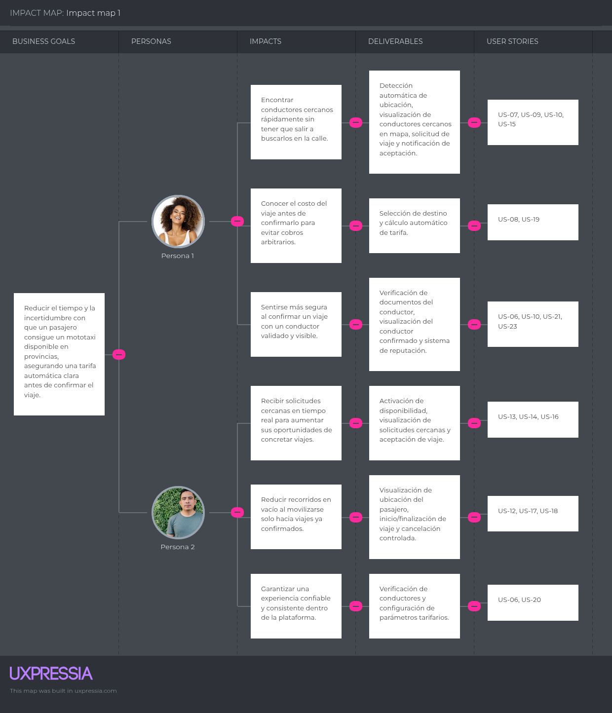

## Capítulo III: Requirements Specification

### 3.1. User Stories

| Epic ID | Título                           | Descripción                                                                                                                                                            |
| ------- | -------------------------------- | ---------------------------------------------------------------------------------------------------------------------------------------------------------------------- |
| EP-01   | Gestión de Identidad y Acceso    | Como equipo, necesitamos gestionar el registro, inicio de sesión y perfiles de pasajeros, conductores y administradores para garantizar acceso seguro a la plataforma. |
| EP-02   | Gestión de Viajes                | Como equipo, necesitamos gestionar la solicitud, aceptación, rechazo, inicio, finalización y cancelación de viajes para soportar el flujo principal del servicio.      |
| EP-03   | Geolocalización y Notificaciones | Como equipo, necesitamos proveer un mapa en tiempo real, proximidad de conductores y notificaciones en tiempo real vía Ably para mantener informados a los usuarios.   |
| EP-04   | Tarifas y Calificaciones         | Como equipo, necesitamos gestionar las tarifas calculadas por distancia y el sistema de calificaciones para garantizar transparencia y confianza en la plataforma.     |
| EP-05   | Historial y Administración       | Como equipo, necesitamos registrar viajes, gestionar cuentas y generar reportes para soportar la operación y administración de la plataforma.                          |
| EP-06   | Experiencia en Landing Page      | Como equipo, necesitamos un Landing Page informativo y persuasivo que comunique la propuesta de valor de ChapaTuRuta a los segmentos objetivo.                         |
| EP-07   | Wallet y Pagos                   | Como equipo, necesitamos gestionar la recarga del wallet del conductor mediante Stripe y el descuento automático de comisiones por viaje para monetizar la plataforma. |

---

| Epic / Story ID | Título                                                    | Descripción                                                                                                                                                                                         | Criterios de Aceptación                                                                                                                                                                                                                                                                                                                                                                                                                                                                                                                                                                                                                                                                                                                                                                                                                                                                                | Relacionado con (Epic ID) |
| --------------- | --------------------------------------------------------- | --------------------------------------------------------------------------------------------------------------------------------------------------------------------------------------------------- | ------------------------------------------------------------------------------------------------------------------------------------------------------------------------------------------------------------------------------------------------------------------------------------------------------------------------------------------------------------------------------------------------------------------------------------------------------------------------------------------------------------------------------------------------------------------------------------------------------------------------------------------------------------------------------------------------------------------------------------------------------------------------------------------------------------------------------------------------------------------------------------------------------ | ------------------------- |
| US-01           | Registro de pasajero                                      | **Como visitante**, quiero registrarme como pasajero ingresando mi correo y contraseña para poder solicitar viajes en la plataforma.                                                                | **Escenario 1: Registro exitoso** **Dado** que el visitante está en la página de registro **Cuando** ingresa un correo válido y una contraseña **Entonces** la cuenta es creada correctamente **Y** es redirigido a la vista principal del mapa  **Escenario 2: Correo ya registrado** **Dado** que el visitante está en la página de registro **Cuando** ingresa un correo que ya existe en el sistema **Entonces** el sistema muestra un mensaje indicando que el correo ya está en uso                                                                                                                                                                                                                                                                                                                                                                                   | EP-01                     |
| US-02           | Registro de conductor                                     | **Como visitante**, quiero registrarme como conductor ingresando mis datos personales y documentos de habilitación para ofrecer mis servicios en la plataforma.                                     | **Escenario 1: Registro exitoso con documentos** **Dado** que el visitante está en la página de registro de conductor **Cuando** ingresa correo, contraseña, número de brevete y número de SOAT vigente **Entonces** la cuenta es creada y queda en estado pendiente de verificación por el administrador  **Escenario 2: Datos incompletos** **Dado** que el visitante está completando el registro **Cuando** intenta enviar el formulario sin completar todos los campos obligatorios **Entonces** el sistema muestra mensajes de error en los campos faltantes                                                                                                                                                                                                                                                                                                             | EP-01                     |
| US-03           | Inicio de sesión                                          | **Como usuario registrado**, quiero iniciar sesión con mi correo y contraseña para acceder a mi cuenta.                                                                                             | **Escenario 1: Inicio de sesión exitoso** **Dado** que el usuario tiene una cuenta registrada **Cuando** ingresa su correo y contraseña correctos **Entonces** accede a la plataforma y es redirigido a su vista principal según su rol  **Escenario 2: Credenciales incorrectas** **Dado** que el usuario intenta iniciar sesión **Cuando** ingresa un correo o contraseña incorrectos **Entonces** el sistema muestra un mensaje de error genérico sin especificar cuál campo es incorrecto                                                                                                                                                                                                                                                                                                                                                                                  | EP-01                     |
| US-04           | Gestión de perfil                                         | **Como usuario**, quiero visualizar y editar mi información de perfil para mantener mis datos actualizados.                                                                                         | **Escenario 1: Visualización de perfil** **Dado** que el usuario ha iniciado sesión **Cuando** accede a la sección de perfil **Entonces** visualiza su nombre, correo, foto y en caso de conductor sus documentos registrados  **Escenario 2: Edición exitosa** **Dado** que el usuario está en su perfil **Cuando** modifica su nombre o foto y guarda los cambios **Entonces** la información se actualiza correctamente y se refleja en su perfil                                                                                                                                                                                                                                                                                                                                                                                                                           | EP-01                     |
| US-05           | Cierre de sesión                                          | **Como usuario**, quiero cerrar sesión para proteger el acceso a mi cuenta.                                                                                                                         | **Escenario 1: Cierre de sesión exitoso** **Dado** que el usuario ha iniciado sesión **Cuando** selecciona la opción de cerrar sesión **Entonces** su sesión finaliza correctamente **Y** es redirigido a la página de inicio de sesión                                                                                                                                                                                                                                                                                                                                                                                                                                                                                                                                                                                                                                                    | EP-01                     |
| US-06           | Verificación de documentos del conductor                  | **Como administrador**, quiero revisar y aprobar o rechazar los documentos de los conductores registrados para garantizar que solo conductores formales operen en la plataforma.                    | **Escenario 1: Aprobación de conductor** **Dado** que el administrador está en el panel de gestión de conductores **Cuando** revisa los datos de brevete y SOAT de un conductor pendiente y los aprueba **Entonces** el conductor queda habilitado para recibir solicitudes de viaje en la plataforma  **Escenario 2: Rechazo de conductor** **Dado** que el administrador revisa los documentos de un conductor **Cuando** detecta que los datos son incorrectos o están vencidos y rechaza el registro **Entonces** el conductor recibe una notificación indicando el motivo del rechazo y puede actualizar sus datos                                                                                                                                                                                                                                                        | EP-01                     |
| US-07           | Detección automática de ubicación del pasajero            | **Como pasajero**, quiero que el sistema detecte automáticamente mi ubicación al ingresar a la aplicación para poder solicitar un viaje sin ingresarla manualmente.                                 | **Escenario 1: Detección exitosa** **Dado** que el pasajero accede a la aplicación **Cuando** acepta los permisos de ubicación en su dispositivo **Entonces** el sistema detecta su ubicación actual y la muestra en el mapa como punto de origen  **Escenario 2: Permiso denegado** **Dado** que el pasajero no concede permisos de ubicación **Cuando** intenta solicitar un viaje **Entonces** el sistema le solicita ingresar manualmente el punto de origen en el mapa                                                                                                                                                                                                                                                                                                                                                                                                    | EP-03                     |
| US-08           | Selección de destino en el mapa                           | **Como pasajero**, quiero seleccionar mi destino en el mapa para que el sistema calcule la ruta y el precio estimado del viaje.                                                                     | **Escenario 1: Selección de destino exitosa** **Dado** que el pasajero tiene su origen detectado en el mapa **Cuando** selecciona un punto de destino en el mapa **Entonces** el sistema traza la ruta entre origen y destino **Y** muestra el precio estimado calculado por distancia  **Escenario 2: Destino fuera del área de cobertura** **Dado** que el pasajero selecciona un destino **Cuando** el punto seleccionado está fuera del área de operación configurada **Entonces** el sistema muestra un mensaje indicando que el destino no está dentro de la zona de cobertura                                                                                                                                                                                                                                                                                        | EP-03                     |
| US-09           | Visualización de conductores cercanos en el mapa          | **Como pasajero**, quiero visualizar en el mapa los conductores disponibles cerca de mi ubicación para identificar rápidamente opciones de transporte.                                              | **Escenario 1: Conductores disponibles** **Dado** que el pasajero ha ingresado a la vista principal del mapa **Cuando** existen conductores activos en su zona **Entonces** el sistema muestra los íconos de conductores en el mapa actualizados en tiempo real vía Ably  **Escenario 2: Sin conductores disponibles** **Dado** que el pasajero se encuentra en una zona sin conductores activos **Cuando** el mapa carga la información **Entonces** el sistema muestra un mensaje indicando que no hay conductores cercanos en este momento                                                                                                                                                                                                                                                                                                                                  | EP-03                     |
| US-10           | Notificación en tiempo real de aceptación de viaje        | **Como pasajero**, quiero recibir una notificación en tiempo real cuando un conductor acepte mi solicitud para saber que mi viaje ha sido confirmado.                                               | **Escenario 1: Aceptación exitosa** **Dado** que un conductor acepta la solicitud de viaje **Cuando** la acción se registra en el sistema **Entonces** el pasajero recibe una notificación instantánea vía Ably con el nombre, foto y calificación del conductor asignado  **Escenario 2: Expiración de la solicitud** **Dado** que ningún conductor acepta la solicitud en el tiempo límite configurado **Cuando** la solicitud expira **Entonces** el sistema notifica al pasajero que debe realizar una nueva solicitud                                                                                                                                                                                                                                                                                                                                                     | EP-03                     |
| US-11           | Notificación en tiempo real de rechazo de solicitud       | **Como pasajero**, quiero ser notificado en tiempo real cuando un conductor rechaza mi solicitud para tomar acciones alternativas.                                                                  | **Escenario 1: Rechazo de solicitud** **Dado** que un conductor rechaza una solicitud **Cuando** la acción se procesa en el sistema **Entonces** el pasajero recibe una notificación instantánea vía Ably indicando que el conductor no pudo atender su solicitud  **Escenario 2: Sin conductores disponibles tras múltiples rechazos** **Dado** que múltiples conductores han rechazado la solicitud **Cuando** se alcanza el límite de rechazos configurado **Entonces** el sistema sugiere al pasajero reintentar en unos minutos                                                                                                                                                                                                                                                                                                                                           | EP-03                     |
| US-12           | Visualización de ubicación del pasajero para el conductor | **Como conductor**, quiero visualizar en el mapa la ubicación del pasajero que solicita el viaje para dirigirme correctamente al punto de recojo.                                                   | **Escenario 1: Ubicación disponible** **Dado** que el conductor ha aceptado una solicitud de viaje **Cuando** accede a la vista del mapa **Entonces** el sistema muestra la ubicación del pasajero como punto de recojo y la ruta sugerida para llegar  **Escenario 2: Ubicación no disponible** **Dado** que el conductor ha aceptado la solicitud **Cuando** el sistema no puede obtener la ubicación del pasajero **Entonces** muestra un mensaje indicando que la ubicación no está disponible temporalmente                                                                                                                                                                                                                                                                                                                                                               | EP-03                     |
| US-13           | Activar y desactivar disponibilidad del conductor         | **Como conductor**, quiero activar o desactivar mi disponibilidad para recibir solicitudes de viaje según mi situación en cada momento.                                                             | **Escenario 1: Activación de disponibilidad** **Dado** que el conductor ha iniciado sesión y tiene saldo en su wallet **Cuando** activa su disponibilidad **Entonces** su ícono aparece en el mapa para los pasajeros cercanos en tiempo real vía Ably  **Escenario 2: Intento de activación sin saldo** **Dado** que el conductor intenta activar su disponibilidad **Cuando** su wallet tiene saldo en cero **Entonces** el sistema le impide activarse y le muestra un mensaje indicando que debe recargar su wallet para continuar operando                                                                                                                                                                                                                                                                                                                                | EP-02                     |
| US-14           | Visualización de solicitudes de viaje disponibles         | **Como conductor**, quiero ver las solicitudes de viaje cercanas en tiempo real para decidir cuál aceptar.                                                                                          | **Escenario 1: Solicitud recibida en tiempo real** **Dado** que el conductor está disponible en la plataforma **Cuando** un pasajero cercano genera una solicitud de viaje **Entonces** el conductor recibe la notificación vía Ably con el origen, destino y precio estimado del viaje  **Escenario 2: Sin solicitudes cercanas** **Dado** que el conductor está disponible **Cuando** no hay solicitudes activas en su zona **Entonces** el sistema muestra su estado como disponible en espera de solicitudes                                                                                                                                                                                                                                                                                                                                                               | EP-02                     |
| US-15           | Solicitud de viaje por parte del pasajero                 | **Como pasajero**, quiero confirmar mi solicitud de viaje luego de seleccionar origen, destino y revisar el precio estimado para que los conductores cercanos puedan verla.                         | **Escenario 1: Solicitud enviada exitosamente** **Dado** que el pasajero ha seleccionado origen y destino **Cuando** revisa el precio estimado y confirma la solicitud **Entonces** el sistema registra la solicitud y la distribuye en tiempo real vía Ably a los conductores disponibles cercanos  **Escenario 2: Sin conductores disponibles al momento de solicitar** **Dado** que el pasajero confirma su solicitud **Cuando** no hay conductores activos en su zona **Entonces** el sistema notifica al pasajero que no hay conductores disponibles en este momento y le sugiere reintentar                                                                                                                                                                                                                                                                              | EP-02                     |
| US-16           | Aceptación de solicitud de viaje por el conductor         | **Como conductor**, quiero aceptar una solicitud de viaje para confirmar que me dirijo al punto de recojo del pasajero.                                                                             | **Escenario 1: Aceptación exitosa** **Dado** que el conductor recibe una solicitud de viaje **Cuando** selecciona aceptar **Entonces** el sistema asigna el viaje al conductor **Y** notifica al pasajero vía Ably con los datos del conductor confirmado  **Escenario 2: Solicitud ya tomada por otro conductor** **Dado** que el conductor intenta aceptar una solicitud **Cuando** otro conductor ya la aceptó previamente **Entonces** el sistema informa que la solicitud ya no está disponible                                                                                                                                                                                                                                                                                                                                                                        | EP-02                     |
| US-17           | Inicio y finalización del viaje                           | **Como conductor**, quiero marcar el inicio y la finalización del viaje para que el sistema registre el estado correctamente y procese la comisión correspondiente.                                 | **Escenario 1: Inicio de viaje** **Dado** que el conductor ha llegado al punto de recojo **Cuando** marca el viaje como iniciado **Entonces** el sistema actualiza el estado del viaje a "en curso" **Y** notifica al pasajero vía Ably que el viaje ha comenzado  **Escenario 2: Finalización de viaje** **Dado** que el conductor ha llegado al destino **Cuando** marca el viaje como finalizado **Entonces** el sistema registra el viaje como completado **Y** descuenta automáticamente la comisión del 5% del wallet del conductor                                                                                                                                                                                                                                                                                                                                | EP-02                     |
| US-18           | Cancelación de viaje                                      | **Como pasajero o conductor**, quiero cancelar un viaje antes de que inicie para liberar la solicitud en el sistema.                                                                                | **Escenario 1: Cancelación por el pasajero** **Dado** que el pasajero tiene un viaje confirmado que aún no ha iniciado **Cuando** selecciona cancelar el viaje **Entonces** el sistema cancela el viaje y notifica al conductor vía Ably  **Escenario 2: Cancelación por el conductor** **Dado** que el conductor tiene un viaje aceptado que aún no ha iniciado **Cuando** selecciona cancelar el viaje **Entonces** el sistema cancela el viaje, notifica al pasajero vía Ably y la solicitud vuelve a estar disponible para otros conductores                                                                                                                                                                                                                                                                                                                               | EP-02                     |
| US-19           | Cálculo de tarifa por distancia                           | **Como pasajero**, quiero ver el precio estimado de mi viaje calculado automáticamente según la distancia entre mi origen y destino para conocer el costo antes de confirmar.                       | **Escenario 1: Cálculo exitoso** **Dado** que el pasajero ha seleccionado origen y destino en el mapa **Cuando** el sistema calcula la distancia usando la fórmula de Haversine **Entonces** muestra el precio estimado aplicando la fórmula: Tarifa base + (Precio por km × distancia), respetando el precio mínimo configurado  **Escenario 2: Distancia mínima no alcanzada** **Dado** que el origen y destino están muy cercanos **Cuando** el precio calculado es menor al precio mínimo configurado **Entonces** el sistema aplica automáticamente el precio mínimo como tarifa del viaje                                                                                                                                                                                                                                                                                | EP-04                     |
| US-20           | Configuración de tarifas por el administrador             | **Como administrador**, quiero configurar la tarifa base, el precio por kilómetro y el precio mínimo por viaje para que el sistema calcule automáticamente el costo de cada carrera.                | **Escenario 1: Configuración exitosa** **Dado** que el administrador está en el panel de configuración de tarifas **Cuando** ingresa valores válidos para tarifa base, precio por km y precio mínimo y guarda los cambios **Entonces** el sistema actualiza los parámetros y los aplica en los próximos cálculos de precio  **Escenario 2: Valores inválidos** **Dado** que el administrador intenta guardar la configuración **Cuando** ingresa valores negativos o en cero **Entonces** el sistema muestra un mensaje de error indicando que los valores deben ser mayores a cero                                                                                                                                                                                                                                                                                            | EP-04                     |
| US-21           | Calificación post-viaje al conductor                      | **Como pasajero**, quiero calificar al conductor al finalizar el viaje para contribuir a su reputación en la plataforma.                                                                            | **Escenario 1: Calificación registrada** **Dado** que el viaje ha sido marcado como finalizado **Cuando** el pasajero asigna una puntuación del 1 al 5 y confirma **Entonces** el sistema registra la calificación y actualiza el puntaje promedio del conductor  **Escenario 2: Calificación omitida** **Dado** que el viaje ha finalizado y el pasajero no califica **Cuando** transcurren 24 horas sin calificación **Entonces** el sistema omite la calificación sin afectar el historial del conductor                                                                                                                                                                                                                                                                                                                                                                    | EP-04                     |
| US-22           | Calificación post-viaje al pasajero                       | **Como conductor**, quiero calificar al pasajero al terminar el viaje para reportar comportamientos que afecten la seguridad o el servicio.                                                         | **Escenario 1: Calificación registrada** **Dado** que el viaje ha sido marcado como finalizado **Cuando** el conductor asigna una puntuación del 1 al 5 y confirma **Entonces** el sistema registra la calificación y actualiza el puntaje promedio del pasajero  **Escenario 2: Calificación baja con comentario** **Dado** que el conductor asigna una puntuación de 1 o 2 estrellas **Cuando** confirma la calificación **Entonces** el sistema habilita un campo opcional para que el conductor describa el motivo                                                                                                                                                                                                                                                                                                                                                         | EP-04                     |
| US-23           | Visualización del puntaje de reputación                   | **Como usuario**, quiero ver mi puntaje de reputación en mi perfil para conocer cómo me perciben otros usuarios en la plataforma.                                                                   | **Escenario 1: Puntaje disponible** **Dado** que el usuario ha completado al menos un viaje calificado **Cuando** accede a su perfil **Entonces** el sistema muestra el puntaje promedio en estrellas y el número total de calificaciones recibidas  **Escenario 2: Sin calificaciones aún** **Dado** que el usuario no ha recibido ninguna calificación **Cuando** accede a su perfil **Entonces** el sistema muestra un mensaje indicando que aún no cuenta con calificaciones registradas                                                                                                                                                                                                                                                                                                                                                                                   | EP-04                     |
| US-24           | Historial de viajes del pasajero                          | **Como pasajero**, quiero consultar el historial de mis viajes realizados para revisar mis desplazamientos anteriores y sus costos.                                                                 | **Escenario 1: Historial con registros** **Dado** que el pasajero ha realizado al menos un viaje **Cuando** accede a la sección de historial **Entonces** el sistema muestra la lista de viajes ordenados por fecha con origen, destino y precio pagado  **Escenario 2: Historial vacío** **Dado** que el pasajero no ha realizado ningún viaje aún **Cuando** accede a la sección de historial **Entonces** el sistema muestra un mensaje indicando que aún no tiene viajes registrados                                                                                                                                                                                                                                                                                                                                                                                       | EP-05                     |
| US-25           | Historial de viajes del conductor                         | **Como conductor**, quiero consultar el historial de mis carreras realizadas para revisar mis ganancias y las comisiones descontadas.                                                               | **Escenario 1: Historial con registros** **Dado** que el conductor ha completado al menos una carrera **Cuando** accede a la sección de historial **Entonces** el sistema muestra la lista de carreras con fecha, origen, destino, tarifa cobrada y comisión descontada  **Escenario 2: Historial vacío** **Dado** que el conductor no ha completado ninguna carrera **Cuando** accede a la sección de historial **Entonces** el sistema muestra un mensaje indicando que aún no tiene carreras registradas                                                                                                                                                                                                                                                                                                                                                                    | EP-05                     |
| US-26           | Panel de administración de conductores                    | **Como administrador**, quiero gestionar los conductores registrados en la plataforma para habilitar, deshabilitar o revisar su información.                                                        | **Escenario 1: Visualización de conductores** **Dado** que el administrador accede al panel de conductores **Cuando** la lista carga correctamente **Entonces** el sistema muestra todos los conductores con su nombre, estado, calificación y saldo de wallet  **Escenario 2: Deshabilitación de conductor** **Dado** que el administrador identifica un conductor con comportamiento inadecuado **Cuando** selecciona deshabilitar su cuenta **Entonces** el conductor queda bloqueado y no puede activarse en la plataforma hasta que el administrador lo reactive                                                                                                                                                                                                                                                                                                          | EP-05                     |
| US-27           | Recarga del wallet mediante Stripe                        | **Como conductor**, quiero recargar mi wallet usando Stripe para poder mantener saldo disponible y seguir operando en la plataforma.                                                                | **Escenario 1: Recarga exitosa** **Dado** que el conductor accede a la sección de wallet **Cuando** ingresa el monto a recargar y completa el pago en el formulario de Stripe **Entonces** el pago es procesado correctamente y el saldo se acredita en su wallet de forma inmediata  **Escenario 2: Pago rechazado** **Dado** que el conductor intenta recargar su wallet **Cuando** Stripe rechaza el pago por datos incorrectos o fondos insuficientes **Entonces** el sistema muestra un mensaje indicando que el pago no pudo procesarse y el saldo no se modifica                                                                                                                                                                                                                                                                                                        | EP-07                     |
| US-28           | Visualización del saldo del wallet                        | **Como conductor**, quiero ver mi saldo actual del wallet en todo momento para saber cuánto tengo disponible antes de activarme en la plataforma.                                                   | **Escenario 1: Saldo disponible** **Dado** que el conductor ha iniciado sesión **Cuando** accede a la sección de wallet o al panel principal **Entonces** el sistema muestra su saldo actual actualizado en tiempo real  **Escenario 2: Saldo en cero** **Dado** que el conductor accede a su wallet con saldo en cero **Cuando** visualiza el panel **Entonces** el sistema muestra un aviso indicando que debe recargar para poder activarse y recibir solicitudes                                                                                                                                                                                                                                                                                                                                                                                                           | EP-07                     |
| US-29           | Descuento automático de comisión por viaje                | **Como plataforma**, necesitamos descontar automáticamente el 5% de comisión del wallet del conductor al finalizar cada viaje para monetizar el servicio.                                           | **Escenario 1: Descuento exitoso** **Dado** que un viaje ha sido marcado como finalizado **Cuando** el sistema procesa el cierre del viaje **Entonces** descuenta automáticamente el 5% del valor de la tarifa del wallet del conductor y registra la transacción en su historial  **Escenario 2: Saldo insuficiente tras el descuento** **Dado** que el sistema aplica la comisión al finalizar el viaje **Cuando** el saldo resultante llega a cero **Entonces** el sistema bloquea automáticamente la disponibilidad del conductor hasta que recargue su wallet                                                                                                                                                                                                                                                                                                             | EP-07                     |
| US-30           | Historial de transacciones del wallet                     | **Como conductor**, quiero revisar el historial de recargas y descuentos de mi wallet para tener trazabilidad de mis movimientos en la plataforma.                                                  | **Escenario 1: Historial con movimientos** **Dado** que el conductor ha realizado al menos una recarga o completado una carrera **Cuando** accede al historial de su wallet **Entonces** el sistema muestra cada movimiento con fecha, tipo (recarga o comisión), monto y saldo resultante  **Escenario 2: Sin movimientos** **Dado** que el conductor no ha realizado ninguna recarga ni carrera **Cuando** accede al historial **Entonces** el sistema muestra un mensaje indicando que aún no hay movimientos registrados                                                                                                                                                                                                                                                                                                                                                   | EP-07                     |
| US-31           | Sección Hero con CTA diferenciado                         | **Como visitante**, quiero ver una sección principal clara con dos opciones de registro diferenciadas para entender rápidamente que la plataforma sirve tanto para pasajeros como para conductores. | **Escenario 1: Visualización del Hero** **Dado** que el visitante accede al Landing Page **Cuando** la página carga correctamente **Entonces** el sistema muestra un título, subtítulo descriptivo y dos botones de llamado a la acción: "Quiero viajar" y "Quiero manejar"  **Escenario 2: Redirección según perfil** **Dado** que el visitante visualiza el Hero **Cuando** selecciona cualquiera de los dos botones **Entonces** es redirigido al formulario de registro correspondiente a su perfil                                                                                                                                                                                                                                                                                                                                                                        | EP-06                     |
| US-32           | Sección ¿Cómo funciona?                                   | **Como visitante**, quiero entender el flujo del servicio en pasos simples para evaluar si ChapaTuRuta se adapta a lo que necesito antes de registrarme.                                            | **Escenario 1: Visualización del flujo para pasajero** **Dado** que el visitante navega hacia la sección ¿Cómo funciona? **Cuando** la sección carga correctamente **Entonces** el sistema muestra tres pasos ilustrados del flujo del pasajero: solicitar viaje, conductor acepta, viajar seguro  **Escenario 2: Visualización del flujo para conductor** **Dado** que el visitante navega por la misma sección **Cuando** visualiza el flujo del conductor **Entonces** el sistema muestra tres pasos: regístrate, actívate, recibe carreras                                                                                                                                                                                                                                                                                                                                 | EP-06                     |
| US-33           | Sección de beneficios por segmento                        | **Como visitante**, quiero ver los beneficios específicos para mi perfil para entender qué valor me ofrece ChapaTuRuta antes de registrarme.                                                        | **Escenario 1: Beneficios para pasajero** **Dado** que el visitante navega hacia la sección de beneficios **Cuando** visualiza el bloque de pasajeros **Entonces** el sistema muestra los beneficios clave: conductores verificados, precio estimado antes de viajar, calificaciones y disponibilidad constante  **Escenario 2: Beneficios para conductor** **Dado** que el visitante navega hacia la sección de beneficios **Cuando** visualiza el bloque de conductores **Entonces** el sistema muestra los beneficios clave: más carreras, sin recorridos en vacío, wallet transparente y comisión del 5%                                                                                                                                                                                                                                                                   | EP-06                     |
| US-34           | Sección de tarifas                                        | **Como visitante**, quiero ver cómo se calculan las tarifas con ejemplos reales para evaluar si el precio del servicio se ajusta a mi presupuesto antes de registrarme.                             | **Escenario 1: Explicación del modelo de precio** **Dado** que el visitante navega hacia la sección de tarifas **Cuando** la sección carga correctamente **Entonces** el sistema muestra la explicación del modelo por distancia con al menos dos ejemplos de precio referencial en soles según zonas típicas  **Escenario 2: CTA desde la sección de tarifas** **Dado** que el visitante ha revisado la información de tarifas **Cuando** selecciona el botón de llamado a la acción **Entonces** es redirigido a la vista de registro                                                                                                                                                                                                                                                                                                                                        | EP-06                     |
| US-35           | Sección de testimonios                                    | **Como visitante**, quiero ver testimonios de pasajeros y conductores activos para evaluar la reputación del servicio antes de registrarme.                                                         | **Escenario 1: Testimonios disponibles** **Dado** que el visitante navega hacia la sección de testimonios **Cuando** la sección carga correctamente **Entonces** el sistema muestra al menos tres testimonios con nombre, zona, perfil y puntuación de usuarios de la plataforma  **Escenario 2: Sin testimonios cargados** **Dado** que la sección no cuenta con registros disponibles **Cuando** el visitante accede a ella **Entonces** el sistema muestra un mensaje indicando que los testimonios estarán disponibles próximamente                                                                                                                                                                                                                                                                                                                                        | EP-06                     |
| US-36           | Sección About the Product                                 | **Como visitante**, quiero ver un video publicitario del producto para entender visualmente cómo funciona ChapaTuRuta antes de registrarme.                                                         | **Escenario 1: Reproducción del video** **Dado** que el visitante navega hacia la sección About the Product **Cuando** la sección carga correctamente **Entonces** el sistema muestra el video publicitario del producto con opción de reproducir, pausar y activar sonido  **Escenario 2: Error de carga del video** **Dado** que el visitante accede a la sección **Cuando** el video no puede cargarse correctamente **Entonces** el sistema muestra un mensaje de error e indica que el contenido no está disponible temporalmente                                                                                                                                                                                                                                                                                                                                         | EP-06                     |
| US-37           | Sección About the Team                                    | **Como visitante**, quiero conocer al equipo detrás de ChapaTuRuta para generar confianza en el producto antes de registrarme.                                                                      | **Escenario 1: Visualización del equipo** **Dado** que el visitante navega hacia la sección About the Team **Cuando** la sección carga correctamente **Entonces** el sistema muestra la foto, nombre y rol de cada integrante del equipo de CTR Technologies  **Escenario 2: Error de carga de imágenes** **Dado** que el visitante accede a la sección **Cuando** alguna imagen del equipo no puede cargarse **Entonces** el sistema muestra una imagen de reemplazo genérica sin afectar la visualización del resto de la sección                                                                                                                                                                                                                                                                                                                                            | EP-06                     |
| US-38           | Sección CTA final                                         | **Como visitante**, quiero ver un llamado a la acción final claro y diferenciado al final del Landing Page para registrarme según mi perfil sin tener que volver al inicio.                         | **Escenario 1: CTA visible al final** **Dado** que el visitante ha navegado por todo el Landing Page **Cuando** llega a la sección final **Entonces** el sistema muestra dos botones diferenciados: "Quiero viajar" y "Quiero manejar" con un mensaje motivador que refuerza la propuesta de valor  **Escenario 2: Redirección correcta** **Dado** que el visitante selecciona cualquiera de los dos botones del CTA final **Cuando** hace clic **Entonces** es redirigido al formulario de registro correspondiente a su perfil                                                                                                                                                                                                                                                                                                                                               | EP-06                     |
| TS-01           | Register Passenger                                        | Como desarrollador, quiero implementar el endpoint de registro de pasajero, para permitir la creación de cuentas de pasajero en la plataforma.                                                      | **Escenario 1: Registro exitoso** Dado que un cliente envía una petición con correo válido y contraseña Cuando el endpoint POST /api/auth/register/passenger procesa la solicitud Entonces el sistema crea un Passenger con isEnabled=true Y retorna 201 Created con el ID y correo del usuario  **Escenario 2: Correo duplicado** Dado que un cliente envía una petición con un correo ya registrado en el sistema Cuando el endpoint POST /api/auth/register/passenger procesa la solicitud Entonces el sistema retorna 409 Conflict Y no crea un nuevo registro  **Escenario 3: Datos inválidos** Dado que un cliente envía una petición con correo mal formado o contraseña vacía Cuando el endpoint POST /api/auth/register/passenger valida los datos Entonces el sistema retorna 400 Bad Request Y no crea un nuevo registro                    | EP-01                     |
| TS-02           | Register Driver                                           | Como desarrollador, quiero implementar el endpoint de registro de conductor con sus documentos, para permitir su incorporación sujeta a verificación.                                               | **Escenario 1: Registro exitoso con documentos** Dado que un cliente envía una petición con correo, contraseña, número de brevete y SOAT vigente Cuando el endpoint POST /api/auth/register/driver procesa la solicitud Entonces el sistema crea un Driver con estado PENDING_VERIFICATION Y retorna 201 Created con el ID del conductor  **Escenario 2: Campos faltantes** Dado que un cliente envía una petición sin brevete o sin SOAT Cuando el endpoint POST /api/auth/register/driver valida los datos Entonces el sistema retorna 400 Bad Request Y no crea un nuevo registro  **Escenario 3: Correo duplicado** Dado que un cliente envía una petición con un correo ya registrado en el sistema Cuando el endpoint POST /api/auth/register/driver procesa la solicitud Entonces el sistema retorna 409 Conflict                                  | EP-01                     |
| TS-03           | Login                                                     | Como desarrollador, quiero implementar el endpoint de autenticación que genere JWT, para permitir el inicio de sesión de usuarios registrados.                                                      | **Escenario 1: Login exitoso** Dado que un cliente envía una petición con credenciales válidas Cuando el endpoint POST /api/auth/login procesa la solicitud Entonces el sistema retorna 200 OK Y entrega un JWT firmado con expiración y rol del usuario  **Escenario 2: Credenciales inválidas** Dado que un cliente envía una petición con correo o contraseña incorrectos Cuando el endpoint POST /api/auth/login valida las credenciales Entonces el sistema retorna 401 Unauthorized Y no genera ningún token  **Escenario 3: Usuario deshabilitado** Dado que un cliente envía credenciales válidas de una cuenta con isEnabled=false Cuando el endpoint POST /api/auth/login procesa la solicitud Entonces el sistema retorna 403 Forbidden                                                                                                        | EP-01                     |
| TS-04           | Token Validation Filter                                   | Como desarrollador, quiero implementar un filtro de validación de JWT, para proteger los endpoints privados del backend.                                                                            | **Escenario 1: Token válido** Dado que un cliente incluye el header Authorization: Bearer {token} con un JWT válido Cuando el filtro intercepta una petición a un endpoint protegido Entonces el sistema permite el acceso Y el endpoint retorna 200 OK  **Escenario 2: Token ausente** Dado que un cliente envía una petición sin el header Authorization Cuando el filtro intercepta la petición a un endpoint protegido Entonces el sistema retorna 401 Unauthorized  **Escenario 3: Token expirado** Dado que un cliente incluye un JWT con fecha de expiración vencida Cuando el filtro valida el token Entonces el sistema retorna 401 Unauthorized Y entrega un mensaje descriptivo indicando que el token ha expirado                                                                                                                             | EP-01                     |
| TS-05           | Role-Based Access Control                                 | Como desarrollador, quiero implementar control de acceso por roles, para restringir endpoints según el perfil del usuario autenticado.                                                              | **Escenario 1: Acceso permitido** Dado que un usuario autenticado tiene el rol requerido por el endpoint Cuando el sistema evalúa los permisos de la petición Entonces el endpoint retorna 200 OK  **Escenario 2: Acceso denegado** Dado que un usuario autenticado tiene un rol distinto al requerido Cuando el sistema evalúa los permisos de la petición Entonces el endpoint retorna 403 Forbidden  **Escenario 3: Endpoints exclusivos de administrador** Dado que un cliente envía una petición a GET /api/admin/\*\* Cuando el sistema evalúa el rol del usuario autenticado Entonces el endpoint solo retorna 200 OK si el rol es ADMIN Y rechaza con 403 Forbidden cualquier otro rol                                                                                                                                                               | EP-01                     |
| TS-06           | Get & Update Profile                                      | Como desarrollador, quiero implementar los endpoints de perfil de usuario, para permitir la visualización y actualización de datos personales.                                                      | **Escenario 1: Consulta exitosa** Dado que un usuario autenticado envía una petición Cuando el endpoint GET /api/users/me procesa la solicitud Entonces el sistema retorna 200 OK con los datos del usuario autenticado  **Escenario 2: Actualización exitosa** Dado que un usuario autenticado envía una petición con un payload válido para nombre o foto Cuando el endpoint PUT /api/users/me procesa la solicitud Entonces el sistema actualiza los datos Y retorna 200 OK con la información actualizada  **Escenario 3: Datos inválidos** Dado que un usuario autenticado envía una petición con campos mal formados Cuando el endpoint PUT /api/users/me valida los datos Entonces el sistema retorna 400 Bad Request Y no aplica cambios                                                                                                          | EP-01                     |
| TS-07           | Verify Driver Documents                                   | Como desarrollador, quiero implementar los endpoints de aprobación y rechazo de conductores, para que el administrador habilite solo a conductores formales.                                        | **Escenario 1: Aprobación** Dado que un administrador autenticado envía una petición sobre un conductor pendiente Cuando el endpoint POST /api/admin/drivers/{id}/approve procesa la solicitud Entonces el sistema cambia el estado del conductor a APPROVED Y retorna 200 OK  **Escenario 2: Rechazo** Dado que un administrador autenticado envía una petición con un motivo de rechazo Cuando el endpoint POST /api/admin/drivers/{id}/reject procesa la solicitud Entonces el sistema cambia el estado del conductor a REJECTED Y retorna 200 OK  **Escenario 3: Conductor inexistente** Dado que un administrador envía una petición con un ID de conductor que no existe Cuando el endpoint POST /api/admin/drivers/{id}/approve procesa la solicitud Entonces el sistema retorna 404 Not Found                                                     | EP-01                     |
| TS-08           | Manage Drivers (Admin)                                    | Como desarrollador, quiero implementar los endpoints de gestión de conductores para el administrador, para habilitar, deshabilitar o consultar conductores registrados.                             | **Escenario 1: Listado** Dado que un administrador autenticado envía una petición Cuando el endpoint GET /api/admin/drivers procesa la solicitud Entonces el sistema retorna 200 OK con una lista paginada de conductores incluyendo nombre, estado, calificación y saldo  **Escenario 2: Deshabilitar conductor** Dado que un administrador autenticado envía una petición sobre un conductor existente Cuando el endpoint POST /api/admin/drivers/{id}/disable procesa la solicitud Entonces el sistema cambia isEnabled=false Y retorna 200 OK  **Escenario 3: Habilitar conductor** Dado que un administrador autenticado envía una petición sobre un conductor deshabilitado Cuando el endpoint POST /api/admin/drivers/{id}/enable procesa la solicitud Entonces el sistema cambia isEnabled=true Y retorna 200 OK                                  | EP-05                     |
| TS-09           | Calculate Fare                                            | Como desarrollador, quiero implementar el endpoint de cálculo de tarifa con fórmula de Haversine, para estimar el precio del viaje según distancia.                                                 | **Escenario 1: Cálculo exitoso** Dado que un cliente envía una petición con coordenadas válidas de origen y destino Cuando el endpoint POST /api/trips/fare procesa la solicitud Entonces el sistema calcula la distancia con la fórmula de Haversine Y retorna 200 OK con la distancia en km y el precio aplicando max(precioMin, tarifaBase + precioPorKm × distancia)  **Escenario 2: Precio mínimo aplicado** Dado que un cliente envía coordenadas cuyo cálculo resulta menor al precio mínimo configurado Cuando el endpoint POST /api/trips/fare aplica la fórmula Entonces el sistema retorna 200 OK con el precio mínimo como tarifa  **Escenario 3: Coordenadas inválidas** Dado que un cliente envía latitud o longitud fuera de rango Cuando el endpoint POST /api/trips/fare valida las coordenadas Entonces el sistema retorna 400 Bad Request | EP-04                     |
| TS-10           | Request Trip                                              | Como desarrollador, quiero implementar el endpoint de solicitud de viaje, para registrar una nueva solicitud del pasajero en el sistema.                                                            | **Escenario 1: Solicitud creada** Dado que un pasajero autenticado envía una petición con origen y destino válidos Cuando el endpoint POST /api/trips/request procesa la solicitud Entonces el sistema crea un Trip con estado REQUESTED Y retorna 201 Created con el ID del viaje  **Escenario 2: Pasajero con viaje activo** Dado que un pasajero autenticado tiene un viaje en curso Cuando el endpoint POST /api/trips/request procesa una nueva solicitud Entonces el sistema retorna 409 Conflict Y no crea un nuevo viaje  **Escenario 3: Datos inválidos** Dado que un pasajero autenticado envía una petición sin origen o sin destino Cuando el endpoint POST /api/trips/request valida los datos Entonces el sistema retorna 400 Bad Request                                                                                                   | EP-02                     |
| TS-11           | Accept & Reject Trip                                      | Como desarrollador, quiero implementar los endpoints de aceptación y rechazo de viaje, para que el conductor confirme o descarte solicitudes.                                                       | **Escenario 1: Aceptación** Dado que un conductor autenticado envía una petición sobre un viaje en estado REQUESTED Cuando el endpoint POST /api/trips/{id}/accept procesa la solicitud Entonces el sistema asigna el conductor al viaje Y cambia el estado del viaje a ACCEPTED Y retorna 200 OK  **Escenario 2: Solicitud ya tomada** Dado que un conductor envía una petición sobre un viaje ya asignado a otro conductor Cuando el endpoint POST /api/trips/{id}/accept procesa la solicitud Entonces el sistema retorna 409 Conflict  **Escenario 3: Rechazo** Dado que un conductor autenticado envía una petición sobre un viaje en estado REQUESTED Cuando el endpoint POST /api/trips/{id}/reject procesa la solicitud Entonces el sistema registra el rechazo del conductor Y retorna 200 OK                                                 | EP-02                     |
| TS-12           | Start & Complete Trip                                     | Como desarrollador, quiero implementar los endpoints de inicio y finalización de viaje, para registrar los cambios de estado del viaje.                                                             | **Escenario 1: Inicio de viaje** Dado que un conductor autenticado envía una petición sobre un viaje en estado ACCEPTED Cuando el endpoint POST /api/trips/{id}/start procesa la solicitud Entonces el sistema cambia el estado del viaje a IN_PROGRESS Y retorna 200 OK  **Escenario 2: Finalización de viaje** Dado que un conductor autenticado envía una petición sobre un viaje en estado IN_PROGRESS Cuando el endpoint POST /api/trips/{id}/complete procesa la solicitud Entonces el sistema cambia el estado del viaje a COMPLETED Y dispara el descuento de comisión Y retorna 200 OK  **Escenario 3: Transición inválida** Dado que un conductor envía una petición sobre un viaje que aún no fue aceptado Cuando el endpoint POST /api/trips/{id}/start procesa la solicitud Entonces el sistema retorna 409 Conflict                      | EP-02                     |
| TS-13           | Cancel Trip                                               | Como desarrollador, quiero implementar el endpoint de cancelación de viaje, para permitir que pasajero o conductor cancelen antes del inicio.                                                       | **Escenario 1: Cancelación por pasajero** Dado que un pasajero autenticado envía una petición sobre un viaje no iniciado Cuando el endpoint POST /api/trips/{id}/cancel procesa la solicitud Entonces el sistema cambia el estado del viaje a CANCELLED_BY_PASSENGER Y retorna 200 OK  **Escenario 2: Cancelación por conductor** Dado que un conductor autenticado envía una petición sobre un viaje no iniciado Cuando el endpoint POST /api/trips/{id}/cancel procesa la solicitud Entonces el sistema cambia el estado del viaje a CANCELLED_BY_DRIVER Y retorna 200 OK  **Escenario 3: Viaje ya iniciado** Dado que un cliente envía una petición sobre un viaje en estado IN_PROGRESS Cuando el endpoint POST /api/trips/{id}/cancel procesa la solicitud Entonces el sistema retorna 409 Conflict                                                  | EP-02                     |
| TS-14           | Trip History                                              | Como desarrollador, quiero implementar los endpoints de historial de viajes, para que pasajeros y conductores consulten sus viajes pasados.                                                         | **Escenario 1: Historial del pasajero** Dado que un pasajero autenticado envía una petición Cuando el endpoint GET /api/trips/history/passenger procesa la solicitud Entonces el sistema retorna 200 OK con una lista paginada de viajes del pasajero  **Escenario 2: Historial del conductor** Dado que un conductor autenticado envía una petición Cuando el endpoint GET /api/trips/history/driver procesa la solicitud Entonces el sistema retorna 200 OK con una lista paginada incluyendo tarifa cobrada y comisión descontada  **Escenario 3: Sin registros** Dado que un usuario autenticado no tiene viajes registrados Cuando el endpoint de historial procesa la solicitud Entonces el sistema retorna 200 OK con una lista vacía                                                                                                                    | EP-05                     |
| TS-15           | Driver Availability Toggle                                | Como desarrollador, quiero implementar el endpoint de activación y desactivación de disponibilidad del conductor, para reflejar su estado en el sistema.                                            | **Escenario 1: Activación** Dado que un conductor autenticado tiene saldo mayor a cero en su wallet Cuando el endpoint POST /api/drivers/availability/enable procesa la solicitud Entonces el sistema cambia isAvailable=true Y retorna 200 OK  **Escenario 2: Saldo insuficiente** Dado que un conductor autenticado tiene saldo igual a cero Cuando el endpoint POST /api/drivers/availability/enable procesa la solicitud Entonces el sistema retorna 403 Forbidden Y no cambia el estado de disponibilidad  **Escenario 3: Desactivación** Dado que un conductor autenticado está disponible Cuando el endpoint POST /api/drivers/availability/disable procesa la solicitud Entonces el sistema cambia isAvailable=false Y retorna 200 OK                                                                                                          | EP-03                     |
| TS-16           | Update Driver Location                                    | Como desarrollador, quiero implementar el endpoint de actualización de ubicación del conductor, para mantener su posición actualizada en tiempo real.                                               | **Escenario 1: Actualización exitosa** Dado que un conductor disponible envía una petición con latitud y longitud válidas Cuando el endpoint POST /api/drivers/location procesa la solicitud Entonces el sistema actualiza la ubicación del conductor Y retorna 200 OK  **Escenario 2: Coordenadas inválidas** Dado que un conductor envía valores fuera de rango para latitud o longitud Cuando el endpoint POST /api/drivers/location valida los datos Entonces el sistema retorna 400 Bad Request  **Escenario 3: Conductor no disponible** Dado que un conductor con isAvailable=false envía una petición Cuando el endpoint POST /api/drivers/location procesa la solicitud Entonces el sistema retorna 403 Forbidden                                                                                                                                   | EP-03                     |
| TS-17           | Get Nearby Drivers                                        | Como desarrollador, quiero implementar el endpoint de búsqueda de conductores cercanos, para que el pasajero visualice opciones disponibles.                                                        | **Escenario 1: Conductores encontrados** Dado que un pasajero autenticado envía una petición con lat, lng y radius válidos Cuando el endpoint GET /api/drivers/nearby procesa la solicitud Entonces el sistema retorna 200 OK con la lista de conductores activos dentro del radio  **Escenario 2: Sin conductores** Dado que el área indicada no tiene conductores activos Cuando el endpoint GET /api/drivers/nearby procesa la solicitud Entonces el sistema retorna 200 OK con una lista vacía  **Escenario 3: Parámetros faltantes** Dado que un cliente envía una petición sin lat o sin lng Cuando el endpoint GET /api/drivers/nearby valida los parámetros Entonces el sistema retorna 400 Bad Request                                                                                                                                                 | EP-03                     |
| TS-18           | Ably Token Request                                        | Como desarrollador, quiero implementar el endpoint de generación de tokens Ably, para que los clientes se conecten de forma segura a los canales de tiempo real.                                    | **Escenario 1: Token generado** Dado que un usuario autenticado envía una petición con JWT válido Cuando el endpoint POST /api/realtime/token procesa la solicitud Entonces el sistema retorna 200 OK con el token Ably y las capabilities del canal según el rol  **Escenario 2: Sin autenticación** Dado que un cliente envía una petición sin JWT Cuando el endpoint POST /api/realtime/token procesa la solicitud Entonces el sistema retorna 401 Unauthorized  **Escenario 3: Capabilities restringidas por rol** Dado que un usuario autenticado solicita un token Cuando el endpoint POST /api/realtime/token genera el token Entonces el sistema entrega capabilities limitadas al canal del usuario autenticado                                                                                                                                        | EP-03                     |
| TS-19           | Publish Trip Events                                       | Como desarrollador, quiero implementar la publicación de eventos de viaje a canales Ably, para notificar en tiempo real a pasajeros y conductores.                                                  | **Escenario 1: Evento de aceptación publicado** Dado que un viaje es aceptado por un conductor Cuando el backend dispara la publicación del evento Entonces el sistema publica trip.accepted en el canal passenger:{id} Y el endpoint disparador retorna 200 OK  **Escenario 2: Evento de rechazo publicado** Dado que un viaje es rechazado por un conductor Cuando el backend dispara la publicación del evento Entonces el sistema publica trip.rejected en el canal del pasajero  **Escenario 3: Fallo de publicación** Dado que el servicio Ably no está disponible Cuando el backend intenta publicar un evento Entonces el sistema registra el error Y la transacción principal continúa sin verse afectada                                                                                                                                        | EP-03                     |
| TS-20           | Submit Rating                                             | Como desarrollador, quiero implementar el endpoint de envío de calificaciones, para que pasajeros y conductores se califiquen mutuamente tras el viaje.                                             | **Escenario 1: Calificación exitosa** Dado que un usuario autenticado envía una petición con puntuación entre 1 y 5 sobre un viaje completado Cuando el endpoint POST /api/trips/{id}/rating procesa la solicitud Entonces el sistema crea un Rating Y actualiza el promedio del usuario evaluado Y retorna 201 Created  **Escenario 2: Viaje no finalizado** Dado que un usuario envía una petición sobre un viaje en estado distinto a COMPLETED Cuando el endpoint POST /api/trips/{id}/rating procesa la solicitud Entonces el sistema retorna 409 Conflict  **Escenario 3: Puntuación inválida** Dado que un usuario envía una petición con puntuación fuera del rango 1-5 Cuando el endpoint POST /api/trips/{id}/rating valida la puntuación Entonces el sistema retorna 400 Bad Request                                                           | EP-04                     |
| TS-21           | Get User Reputation                                       | Como desarrollador, quiero implementar el endpoint de consulta de reputación, para exponer el puntaje promedio del usuario.                                                                         | **Escenario 1: Reputación disponible** Dado que un usuario tiene calificaciones registradas Cuando el endpoint GET /api/users/{id}/reputation procesa la solicitud Entonces el sistema retorna 200 OK con el promedio en estrellas y el total de calificaciones  **Escenario 2: Sin calificaciones** Dado que un usuario no tiene calificaciones registradas Cuando el endpoint GET /api/users/{id}/reputation procesa la solicitud Entonces el sistema retorna 200 OK con promedio null y total en cero  **Escenario 3: Usuario inexistente** Dado que un cliente envía una petición con un ID que no existe Cuando el endpoint GET /api/users/{id}/reputation procesa la solicitud Entonces el sistema retorna 404 Not Found                                                                                                                                  | EP-04                     |
| TS-22           | Configure Fare Parameters                                 | Como desarrollador, quiero implementar los endpoints de configuración de tarifas, para que el administrador defina tarifa base, precio por km y precio mínimo.                                      | **Escenario 1: Consulta de configuración** Dado que un administrador autenticado envía una petición Cuando el endpoint GET /api/admin/fare-config procesa la solicitud Entonces el sistema retorna 200 OK con los parámetros actuales  **Escenario 2: Actualización exitosa** Dado que un administrador autenticado envía una petición con valores mayores a cero Cuando el endpoint PUT /api/admin/fare-config procesa la solicitud Entonces el sistema actualiza la configuración Y retorna 200 OK  **Escenario 3: Valores inválidos** Dado que un administrador envía una petición con valores negativos o iguales a cero Cuando el endpoint PUT /api/admin/fare-config valida los datos Entonces el sistema retorna 400 Bad Request                                                                                                                      | EP-04                     |
| TS-23           | Get Wallet Balance                                        | Como desarrollador, quiero implementar el endpoint de consulta de saldo del wallet, para que el conductor visualice su saldo disponible.                                                            | **Escenario 1: Saldo disponible** Dado que un conductor autenticado envía una petición Cuando el endpoint GET /api/wallet/balance procesa la solicitud Entonces el sistema retorna 200 OK con el saldo actual del conductor autenticado  **Escenario 2: Sin autenticación** Dado que un cliente envía una petición sin JWT Cuando el endpoint GET /api/wallet/balance procesa la solicitud Entonces el sistema retorna 401 Unauthorized  **Escenario 3: Rol distinto a conductor** Dado que un usuario autenticado tiene un rol distinto a DRIVER Cuando el endpoint GET /api/wallet/balance procesa la solicitud Entonces el sistema retorna 403 Forbidden                                                                                                                                                                                                     | EP-07                     |
| TS-24           | Create Stripe Checkout Session                            | Como desarrollador, quiero implementar el endpoint de creación de sesión de pago en Stripe, para que el conductor recargue su wallet.                                                               | **Escenario 1: Sesión creada** Dado que un conductor autenticado envía una petición con un monto válido Cuando el endpoint POST /api/wallet/recharge procesa la solicitud Entonces el sistema crea una sesión Stripe Checkout Y retorna 200 OK con la URL de pago  **Escenario 2: Monto inválido** Dado que un conductor envía una petición con un monto menor o igual a cero Cuando el endpoint POST /api/wallet/recharge valida los datos Entonces el sistema retorna 400 Bad Request  **Escenario 3: Error de Stripe** Dado que el servicio Stripe no logra crear la sesión Cuando el endpoint POST /api/wallet/recharge intenta procesar el pago Entonces el sistema retorna 502 Bad Gateway                                                                                                                                                             | EP-07                     |
| TS-25           | Stripe Webhook Handler                                    | Como desarrollador, quiero implementar el webhook de confirmación de Stripe, para acreditar el saldo tras un pago exitoso.                                                                          | **Escenario 1: Pago confirmado** Dado que Stripe envía un evento checkout.session.completed con firma válida Cuando el endpoint POST /api/wallet/webhook procesa el evento Entonces el sistema acredita el saldo en el wallet del conductor Y registra la transacción Y retorna 200 OK  **Escenario 2: Firma inválida** Dado que Stripe envía un evento con firma incorrecta Cuando el endpoint POST /api/wallet/webhook valida la firma Entonces el sistema retorna 400 Bad Request Y no modifica el saldo  **Escenario 3: Evento duplicado** Dado que Stripe envía un evento ya procesado anteriormente Cuando el endpoint POST /api/wallet/webhook detecta el duplicado Entonces el sistema retorna 200 OK Y no duplica el saldo                                                                                                                 | EP-07                     |
| TS-26           | Apply Commission on Trip Complete                         | Como desarrollador, quiero implementar la lógica transaccional de descuento de comisión, para aplicar automáticamente el 5% al finalizar un viaje.                                                  | **Escenario 1: Descuento exitoso** Dado que un viaje cambia a estado COMPLETED Cuando el sistema procesa el cierre del viaje Entonces el sistema descuenta el 5% del valor de la tarifa del wallet del conductor de forma atómica Y registra la transacción  **Escenario 2: Saldo en cero tras descuento** Dado que el descuento de comisión deja el saldo del conductor en cero Cuando el sistema completa la transacción Entonces cambia automáticamente isAvailable=false  **Escenario 3: Fallo de transacción** Dado que el descuento de comisión falla durante la transacción Cuando el sistema detecta el error Entonces el cambio de estado del viaje se revierte mediante rollback                                                                                                                                                                   | EP-07                     |
| TS-27           | Wallet Transaction History                                | Como desarrollador, quiero implementar el endpoint de historial de transacciones del wallet, para dar trazabilidad de recargas y comisiones.                                                        | **Escenario 1: Historial con movimientos** Dado que un conductor autenticado tiene transacciones registradas Cuando el endpoint GET /api/wallet/transactions procesa la solicitud Entonces el sistema retorna 200 OK con una lista paginada incluyendo fecha, tipo, monto y saldo resultante  **Escenario 2: Sin movimientos** Dado que un conductor autenticado no tiene transacciones registradas Cuando el endpoint GET /api/wallet/transactions procesa la solicitud Entonces el sistema retorna 200 OK con una lista vacía  **Escenario 3: Filtro por tipo** Dado que un conductor autenticado envía una petición con type=RECHARGE Cuando el endpoint GET /api/wallet/transactions procesa la solicitud Entonces el sistema retorna 200 OK con la lista paginada filtrada solo por recargas                                                               | EP-07                     |

## 3.2 Impact Mapping

## 3.3 Product Backlog

| # Orden | User Story Id   | Título                                                    | Descripción                                                                                                                                               | Story Points (1 / 2 / 3 / 5 / 8) |
| ------- | --------------- | --------------------------------------------------------- | --------------------------------------------------------------------------------------------------------------------------------------------------------- | -------------------------------- |
| 1       | US-31           | Sección Hero con CTA diferenciado                         | Como visitante, deseo ver una sección principal con dos CTA diferenciados, para identificar rápidamente si la plataforma es para pasajeros o conductores. | 3                                |
| 2       | US-32           | Sección ¿Cómo funciona?                                   | Como visitante, deseo entender el flujo del servicio en pasos simples, para evaluar si ChapaTuRuta se adapta a mis necesidades antes de registrarme.      | 2                                |
| 3       | US-33           | Sección de beneficios por segmento                        | Como visitante, deseo ver los beneficios específicos para mi perfil, para entender el valor diferencial de la plataforma antes de registrarme.            | 2                                |
| 4       | US-34           | Sección de tarifas                                        | Como visitante, deseo conocer cómo se calculan las tarifas con ejemplos, para evaluar si el precio se ajusta a mi presupuesto.                            | 2                                |
| 5       | US-36           | Sección About the Product                                 | Como visitante, deseo ver un video publicitario del producto, para entender visualmente cómo funciona antes de registrarme.                               | 2                                |
| 6       | US-37           | Sección About the Team                                    | Como visitante, deseo conocer al equipo detrás del producto, para generar confianza en la marca antes de registrarme.                                     | 2                                |
| 7       | US-35           | Sección de testimonios                                    | Como visitante, deseo leer testimonios de usuarios activos, para evaluar la reputación del servicio antes de registrarme.                                 | 2                                |
| 8       | US-38           | Sección CTA final                                         | Como visitante, deseo un llamado a la acción final diferenciado, para registrarme según mi perfil sin volver al inicio.                                   | 2                                |
| 9       | US-01           | Registro de pasajero                                      | Como visitante, deseo registrarme como pasajero con correo y contraseña, para poder solicitar viajes en la plataforma.                                    | 3                                |
| 10      | US-02           | Registro de conductor                                     | Como visitante, deseo registrarme como conductor con mis documentos, para ofrecer mis servicios en la plataforma.                                         | 3                                |
| 11      | US-03           | Inicio de sesión                                          | Como usuario registrado, deseo iniciar sesión con correo y contraseña, para acceder a mi cuenta según mi rol.                                             | 2                                |
| 12      | US-05           | Cierre de sesión                                          | Como usuario, deseo cerrar sesión, para proteger el acceso a mi cuenta en dispositivos compartidos.                                                       | 1                                |
| 13      | US-04           | Gestión de perfil                                         | Como usuario, deseo visualizar y editar mi perfil, para mantener mis datos actualizados en la plataforma.                                                 | 3                                |
| 14      | US-07           | Detección automática de ubicación del pasajero            | Como pasajero, deseo que el sistema detecte mi ubicación al ingresar, para solicitar un viaje sin ingresarla manualmente.                                 | 3                                |
| 15      | US-08           | Selección de destino en el mapa                           | Como pasajero, deseo seleccionar mi destino en el mapa, para que el sistema calcule la ruta y el precio estimado.                                         | 3                                |
| 16      | US-19           | Cálculo de tarifa por distancia                           | Como pasajero, deseo ver el precio estimado calculado por distancia, para conocer el costo antes de confirmar el viaje.                                   | 3                                |
| 17      | US-09           | Visualización de conductores cercanos en el mapa          | Como pasajero, deseo ver los conductores disponibles cerca de mí en el mapa, para identificar opciones de transporte.                                     | 3                                |
| 18      | US-15           | Solicitud de viaje por parte del pasajero                 | Como pasajero, deseo confirmar mi solicitud tras revisar origen, destino y precio, para que los conductores cercanos puedan atenderla.                    | 5                                |
| 19      | US-13           | Activar y desactivar disponibilidad del conductor         | Como conductor, deseo activar o desactivar mi disponibilidad, para recibir o dejar de recibir solicitudes.                                                | 3                                |
| 20      | US-14           | Visualización de solicitudes de viaje disponibles         | Como conductor, deseo ver en tiempo real las solicitudes cercanas, para decidir cuál aceptar.                                                             | 3                                |
| 21      | US-16           | Aceptación de solicitud de viaje por el conductor         | Como conductor, deseo aceptar una solicitud, para confirmar al pasajero que me dirijo al punto de recojo.                                                 | 3                                |
| 22      | US-10           | Notificación en tiempo real de aceptación de viaje        | Como pasajero, deseo recibir una notificación cuando un conductor acepte mi solicitud, para saber que el viaje fue confirmado.                            | 2                                |
| 23      | US-11           | Notificación en tiempo real de rechazo de solicitud       | Como pasajero, deseo ser notificado si mi solicitud es rechazada, para tomar acciones alternativas.                                                       | 2                                |
| 24      | US-12           | Visualización de ubicación del pasajero para el conductor | Como conductor, deseo ver la ubicación del pasajero en el mapa, para dirigirme correctamente al punto de recojo.                                          | 3                                |
| 25      | US-17           | Inicio y finalización del viaje                           | Como conductor, deseo marcar el inicio y el fin del viaje, para que el sistema registre el estado y procese la comisión.                                  | 3                                |
| 26      | US-18           | Cancelación de viaje                                      | Como pasajero o conductor, deseo cancelar un viaje antes de que inicie, para liberar la solicitud en el sistema.                                          | 3                                |
| 27      | US-21           | Calificación post-viaje al conductor                      | Como pasajero, deseo calificar al conductor al finalizar el viaje, para contribuir a su reputación.                                                       | 2                                |
| 28      | US-22           | Calificación post-viaje al pasajero                       | Como conductor, deseo calificar al pasajero al terminar el viaje, para reportar comportamientos que afecten el servicio.                                  | 2                                |
| 29      | US-23           | Visualización del puntaje de reputación                   | Como usuario, deseo ver mi puntaje de reputación en mi perfil, para conocer cómo me perciben otros usuarios.                                              | 2                                |
| 30      | US-28           | Visualización del saldo del wallet                        | Como conductor, deseo ver mi saldo del wallet en todo momento, para saber cuánto tengo disponible antes de activarme.                                     | 2                                |
| 31      | US-27           | Recarga del wallet mediante Stripe                        | Como conductor, deseo recargar mi wallet con Stripe, para mantener saldo disponible y seguir operando.                                                    | 5                                |
| 32      | US-29           | Descuento automático de comisión por viaje                | Como plataforma, necesitamos descontar el 5% del wallet al finalizar cada viaje, para monetizar el servicio automáticamente.                              | 3                                |
| 33      | US-30           | Historial de transacciones del wallet                     | Como conductor, deseo revisar el historial de recargas y descuentos, para tener trazabilidad de mis movimientos.                                          | 3                                |
| 34      | US-24           | Historial de viajes del pasajero                          | Como pasajero, deseo consultar el historial de mis viajes, para revisar mis desplazamientos anteriores y sus costos.                                      | 2                                |
| 35      | US-25           | Historial de viajes del conductor                         | Como conductor, deseo consultar el historial de mis carreras, para revisar mis ganancias y comisiones descontadas.                                        | 2                                |
| 36      | US-06           | Verificación de documentos del conductor                  | Como administrador, deseo aprobar o rechazar los documentos de los conductores, para garantizar que solo operen conductores formales.                     | 3                                |
| 37      | US-20           | Configuración de tarifas por el administrador             | Como administrador, deseo configurar tarifa base, precio por km y precio mínimo, para que el sistema calcule el costo de cada carrera.                    | 3                                |
| 38      | US-26           | Panel de administración de conductores                    | Como administrador, deseo gestionar a los conductores registrados, para habilitar, deshabilitar o revisar su información.                                 | 3                                |
| 39      | TS-AUTH-001     | Register Passenger                                        | Como desarrollador, quiero implementar el endpoint de registro de pasajero, para permitir la creación de cuentas de pasajero.                             | 2                                |
| 40      | TS-AUTH-002     | Register Driver                                           | Como desarrollador, quiero implementar el endpoint de registro de conductor con documentos, para permitir su incorporación sujeta a verificación.         | 3                                |
| 41      | TS-AUTH-003     | Login                                                     | Como desarrollador, quiero implementar el endpoint de autenticación con JWT, para permitir el inicio de sesión de usuarios registrados.                   | 3                                |
| 42      | TS-AUTH-004     | Token Validation Filter                                   | Como desarrollador, quiero implementar un filtro de validación de JWT, para proteger los endpoints privados del backend.                                  | 3                                |
| 43      | TS-AUTH-005     | Role-Based Access Control                                 | Como desarrollador, quiero implementar control de acceso por roles, para restringir endpoints según el perfil del usuario.                                | 3                                |
| 44      | TS-USER-001     | Get & Update Profile                                      | Como desarrollador, quiero implementar los endpoints de perfil de usuario, para permitir la visualización y actualización de datos.                       | 2                                |
| 45      | TS-USER-002     | Verify Driver Documents                                   | Como desarrollador, quiero implementar los endpoints de aprobación y rechazo de conductores, para que el admin habilite solo conductores formales.        | 2                                |
| 46      | TS-USER-003     | Manage Drivers (Admin)                                    | Como desarrollador, quiero implementar los endpoints de gestión de conductores, para habilitar, deshabilitar o consultar conductores.                     | 3                                |
| 47      | TS-TRIP-001     | Calculate Fare                                            | Como desarrollador, quiero implementar el endpoint de cálculo de tarifa con Haversine, para estimar el precio según distancia.                            | 3                                |
| 48      | TS-TRIP-002     | Request Trip                                              | Como desarrollador, quiero implementar el endpoint de solicitud de viaje, para registrar nuevas solicitudes del pasajero.                                 | 3                                |
| 49      | TS-TRIP-003     | Accept & Reject Trip                                      | Como desarrollador, quiero implementar los endpoints de aceptación y rechazo, para que el conductor confirme o descarte solicitudes.                      | 3                                |
| 50      | TS-TRIP-004     | Start & Complete Trip                                     | Como desarrollador, quiero implementar los endpoints de inicio y finalización de viaje, para registrar los cambios de estado.                             | 3                                |
| 51      | TS-TRIP-005     | Cancel Trip                                               | Como desarrollador, quiero implementar el endpoint de cancelación, para permitir que pasajero o conductor cancelen antes del inicio.                      | 2                                |
| 52      | TS-TRIP-006     | Trip History                                              | Como desarrollador, quiero implementar los endpoints de historial de viajes, para que pasajeros y conductores consulten viajes pasados.                   | 2                                |
| 53      | TS-GEO-001      | Driver Availability Toggle                                | Como desarrollador, quiero implementar el endpoint de activación/desactivación de disponibilidad, para reflejar el estado del conductor.                  | 2                                |
| 54      | TS-GEO-002      | Update Driver Location                                    | Como desarrollador, quiero implementar el endpoint de actualización de ubicación del conductor, para mantener su posición actualizada.                    | 2                                |
| 55      | TS-GEO-003      | Get Nearby Drivers                                        | Como desarrollador, quiero implementar el endpoint de búsqueda de conductores cercanos, para que el pasajero visualice opciones disponibles.              | 3                                |
| 56      | TS-REALTIME-001 | Ably Token Request                                        | Como desarrollador, quiero implementar el endpoint de generación de tokens Ably, para conexión segura a canales de tiempo real.                           | 3                                |
| 57      | TS-REALTIME-002 | Publish Trip Events                                       | Como desarrollador, quiero implementar la publicación de eventos de viaje a Ably, para notificar en tiempo real a pasajeros y conductores.                | 3                                |
| 58      | TS-RATING-001   | Submit Rating                                             | Como desarrollador, quiero implementar el endpoint de envío de calificaciones, para que pasajeros y conductores se califiquen mutuamente.                 | 2                                |
| 59      | TS-RATING-002   | Get User Reputation                                       | Como desarrollador, quiero implementar el endpoint de consulta de reputación, para exponer el puntaje promedio del usuario.                               | 2                                |
| 60      | TS-FARE-001     | Configure Fare Parameters                                 | Como desarrollador, quiero implementar los endpoints de configuración de tarifas, para que el administrador defina los parámetros de precio.              | 2                                |
| 61      | TS-WALLET-001   | Get Wallet Balance                                        | Como desarrollador, quiero implementar el endpoint de consulta de saldo del wallet, para que el conductor visualice su saldo.                             | 2                                |
| 62      | TS-WALLET-002   | Create Stripe Checkout Session                            | Como desarrollador, quiero implementar el endpoint de creación de sesión Stripe, para que el conductor recargue su wallet.                                | 3                                |
| 63      | TS-WALLET-003   | Stripe Webhook Handler                                    | Como desarrollador, quiero implementar el webhook de confirmación Stripe, para acreditar el saldo tras un pago exitoso.                                   | 3                                |
| 64      | TS-WALLET-004   | Apply Commission on Trip Complete                         | Como desarrollador, quiero implementar el descuento atómico del 5% de comisión, para monetizar automáticamente al finalizar el viaje.                     | 3                                |
| 65      | TS-WALLET-005   | Wallet Transaction History                                | Como desarrollador, quiero implementar el endpoint de historial de transacciones del wallet, para trazabilidad de recargas y comisiones.                  | 2                                |
| 66      | TS-INFRA-001    | CORS Configuration                                        | Como desarrollador, quiero configurar CORS en Spring Boot, para permitir peticiones autorizadas desde el frontend Angular.                                | 1                                |
| 67      | TS-INFRA-002    | Global Exception Handler                                  | Como desarrollador, quiero implementar un manejador global de excepciones, para estandarizar las respuestas de error del backend.                         | 2                                |
