## Capítulo IV: Product Design

### 4.1. Style Guidelines

En esta sección el equipo establece un repositorio central de decisiones
visuales y de comunicación, con el fin de mantener una presentación
consistente en todos los productos de _Chapa Tu Ruta_. Se incluyen
lineamientos generales de marca, tipografía, colores y espaciado, así
como los estándares visuales aplicados a la interfaz web.

#### 4.1.1. General Style Guidelines

En la siguiente sección detallaremos las diferentes decisiones de diseño
tomadas para establecer la identidad visual de _Chapa Tu Ruta_.

**Branding**

_Chapa Tu Ruta_ es una plataforma diseñada para conectar pasajeros con
conductores de mototaxi en zonas periféricas de Lima. El nombre de la aplicación apela directamente al lenguaje
coloquial limeño: "chapar" en el habla popular significa encontrar o tomar
algo en el momento preciso, lo que comunica inmediatez y familiaridad con
el usuario objetivo. La segunda parte, "Tu Ruta", refuerza la propuesta de
valor: el servicio es personalizado, cercano y pensado para el trayecto
específico de cada persona.

El logotipo combina dos elementos visuales principales. El primero es un
pin de ubicación de color verde con una carretera interna, que representa
la geolocalización como función central de la aplicación. El segundo es
una mototaxi estilizada en amarillo y azul que hace referencia directa al
vehículo característico del servicio. Debajo de ambos elementos aparece el
nombre "ChapaTuRuta" en tipografía sans-serif, donde la palabra "Tu"
resalta en amarillo para generar énfasis en la personalización del servicio.
El conjunto transmite dinamismo, proximidad y funcionalidad.

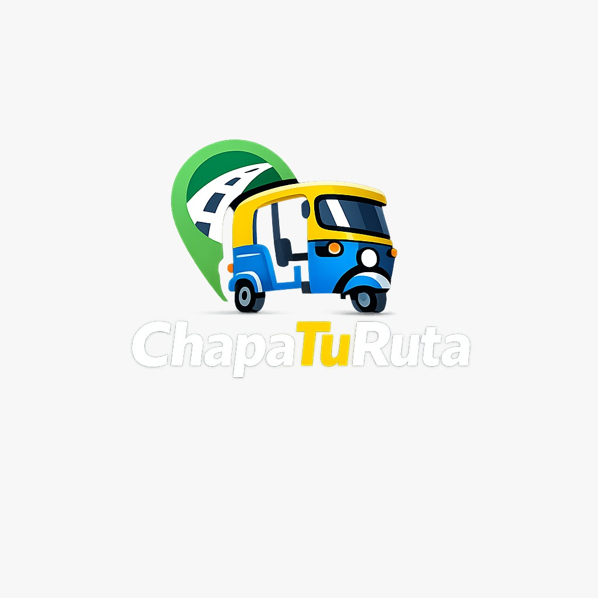

**Typography**

La tipografía elegida para _Chapa Tu Ruta_ es **Poppins**, disponible a
través de Google Fonts, en sus variantes Bold, SemiBold y Regular.

Esta tipografía fue seleccionada por su alta legibilidad en pantallas de
distintos tamaños, especialmente en condiciones de uso móvil como la luz
solar directa o el movimiento. Sus formas geométricas y sus terminaciones
redondeadas le otorgan un carácter moderno y accesible, coherente con el
perfil del usuario objetivo.

La variante Bold se utiliza en los títulos de pantalla y en el logotipo,
para atraer la atención del usuario en los puntos de mayor jerarquía
visual. La variante SemiBold se aplica en subtítulos, encabezados de
sección y etiquetas de acción, generando contraste con el cuerpo de texto
sin resultar agresiva. La variante Regular se reserva para párrafos,
descripciones y texto de apoyo.

El tamaño de las fuentes varía según el nivel jerárquico del contenido.
Para títulos principales se utilizan tamaños mayores con el fin de captar
la atención del usuario desde el primer vistazo. Para subtítulos se emplean
tamaños intermedios que permiten distinguir las secciones sin interrumpir
la lectura. Para el cuerpo de texto se elige un tamaño que equilibre
comodidad visual y densidad de información, considerando que la mayoría
de usuarios accederán desde dispositivos móviles de gama media.

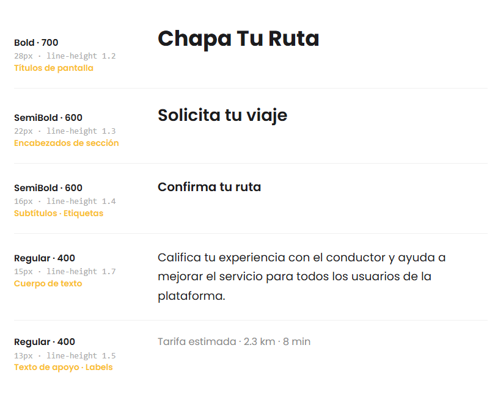

**Colors**

La paleta de colores de _Chapa Tu Ruta_ está compuesta por cuatro colores
principales extraídos directamente de la identidad visual del logotipo,
complementados por colores de apoyo para los estados del sistema.

El color primario es el amarillo mototaxi (`#F9C12E`), presente en el
techo de la mototaxi y en el texto destacado del logotipo. Este color
comunica energía, visibilidad y optimismo, y se utiliza en los llamados
a la acción principales de la interfaz. El azul ruta (`#2B7CC1`), tomado
de la carrocería de la mototaxi, representa confianza, tecnología y
movimiento, y se aplica en estados activos, secciones informativas y
elementos secundarios. El verde pin (`#3DAA4E`), proveniente del ícono
de ubicación del logotipo, está asociado a la geolocalización, la
disponibilidad y la confirmación de acciones positivas. El azul marino
(`#1A2A4A`), que corresponde a la estructura del vehículo y el
parabrisas, actúa como color de fondo profundo y neutro, utilizado en
la barra de navegación, el footer y los fondos de secciones oscuras.

Para textos sobre fondos claros se utiliza el gris carbón (`#1C1C1E`),
garantizando legibilidad sin el contraste agresivo del negro puro. Los
fondos generales de pantalla emplean el blanco suave (`#F5F5F5`) para
reducir la fatiga visual en sesiones prolongadas.

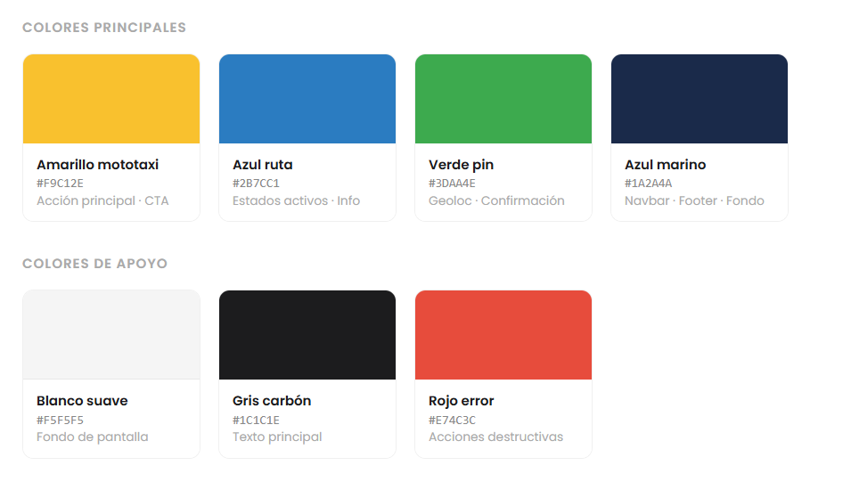

**Spacing**

El espaciado utilizado en los productos de _Chapa Tu Ruta_ sigue una
escala basada en múltiplos de 8 puntos. Este sistema permite mantener
proporciones consistentes entre componentes y facilita la implementación
tanto en interfaces móviles como web.

En general, es fundamental que el espaciado permita al usuario distinguir
con claridad los bloques de contenido sin generar una sensación de
saturación. Los márgenes laterales de pantalla, la separación entre
tarjetas y la distancia entre etiquetas e inputs respetan esta escala
para lograr una composición ordenada y legible.

**Tono de comunicación y lenguaje**

El tono de comunicación de _Chapa Tu Ruta_ ha sido definido considerando
el perfil del usuario objetivo: personas jóvenes y adultas de zonas
periféricas de Lima, familiarizadas con el uso de aplicaciones móviles
pero con distintos niveles de experiencia digital.

En cuanto a las dimensiones del tono, la plataforma adopta un lenguaje
más cercano que formal, evitando tecnicismos innecesarios y privilegiando
frases cortas y directas que no requieran interpretación. Es más casual
que serio, sin perder la claridad y la confiabilidad que el servicio de
transporte exige. Se mantiene respetuoso en todo momento, sin caer en un
registro corporativo distante que pueda generar frialdad con el usuario.
Finalmente, adopta un tono entusiasta pero sereno, que transmita seguridad
en cada interacción sin generar ansiedad.

Los mensajes de la interfaz privilegian verbos de acción en imperativo
amigable como "Solicita tu viaje", "Confirma tu ruta" o "Califica tu
experiencia", y evitan frases técnicas o en tercera persona que distancien
al usuario de la aplicación.

---

#### 4.1.2. Web Style Guidelines

En esta sección se explican e ilustran las decisiones sobre los estándares
visuales y de interacción para las interfaces web responsivas de
_Chapa Tu Ruta_. La versión web está orientada principalmente al panel
de administración del sistema y a la landing page informativa de la
plataforma. Como referencia base se adopta el sistema de diseño
**Material Design 3** de Google, sobre el cual se realizan adaptaciones
para alinearlo con la identidad visual propia de la marca.

**Paleta de colores**

La paleta de colores web replica los colores definidos en el General Style
Guidelines, organizados según su rol funcional dentro de la interfaz. El
amarillo `#F9C12E` se reserva para botones primarios y destacados de
conversión. El azul marino `#1A2A4A` se utiliza en la barra de navegación
superior, el sidebar del panel de administración y el footer. El azul ruta
`#2B7CC1` aparece en elementos informativos, estados activos y secciones
de datos. El verde pin `#3DAA4E` señaliza confirmaciones, disponibilidad
y acciones exitosas. Los fondos generales utilizan `#F5F5F5` para las
páginas y `#FFFFFF` para las tarjetas y modales.

**Tipografía web**

La tipografía web mantiene el uso de Poppins en sus tres variantes. Para
títulos de página se utiliza la variante Bold en tamaño 28px, para
encabezados de sección SemiBold en 22px, y para el cuerpo de texto
Regular en 14 a 16px. Esta escala garantiza la jerarquía visual necesaria
para guiar al usuario a través de las distintas secciones sin necesidad
de elementos decorativos adicionales.

**Botones**

Dependiendo del contexto se utilizan distintos tipos de botones. Para las
acciones principales de conversión como "Registrarse", "Solicitar viaje"
o "Confirmar", se utiliza el botón primario con fondo amarillo `#F9C12E`,
texto en azul marino `#1A2A4A` y bordes redondeados de 8px. Este botón
es el de mayor jerarquía visual en la pantalla y no debe compartir
protagonismo con otros elementos del mismo peso.

Para acciones secundarias como "Cancelar" o "Volver", se utiliza un botón
con borde en el color primario y fondo transparente, que comunica una
opción disponible sin competir visualmente con la acción principal. Para
acciones destructivas como "Eliminar cuenta" o "Bloquear conductor", se
utiliza el botón de peligro con fondo rojo `#E74C3C` y texto blanco,
reservado exclusivamente para operaciones irreversibles en el panel de
administración.

**Formularios**

Los campos de texto utilizan un borde de 1px en gris claro en su estado
neutro, que cambia al azul ruta `#2B7CC1` al recibir el foco, indicando
al usuario que el campo está activo. En caso de error de validación, el
borde cambia a rojo `#E74C3C` y se muestra un mensaje descriptivo debajo
del campo afectado. Todos los campos incluyen una etiqueta visible por
encima del input, evitando depender del placeholder como único indicador
del contenido esperado.

**Navegación y diseño responsivo**

La interfaz web adopta un enfoque mobile-first, escalando hacia
resoluciones mayores mediante una grilla de 12 columnas con ancho máximo
de contenido de 1200px centrado horizontalmente. En el panel de
administración, la navegación utiliza un sidebar fijo en pantallas de
escritorio que colapsa a un menú tipo drawer en tablets y dispositivos
móviles. La barra superior muestra el logo reducido, el nombre del usuario
autenticado y la opción de cierre de sesión.

**Accesibilidad**

Todos los elementos interactivos de la interfaz web cumplen con un
contraste mínimo de 4.5:1 entre texto y fondo, de acuerdo con el estándar
WCAG AA. Los componentes son navegables por teclado y los formularios
incluyen atributos ARIA para garantizar compatibilidad con lectores de
pantalla. El tamaño mínimo de fuente en web es de 14px para asegurar la
legibilidad en distintas condiciones de uso.

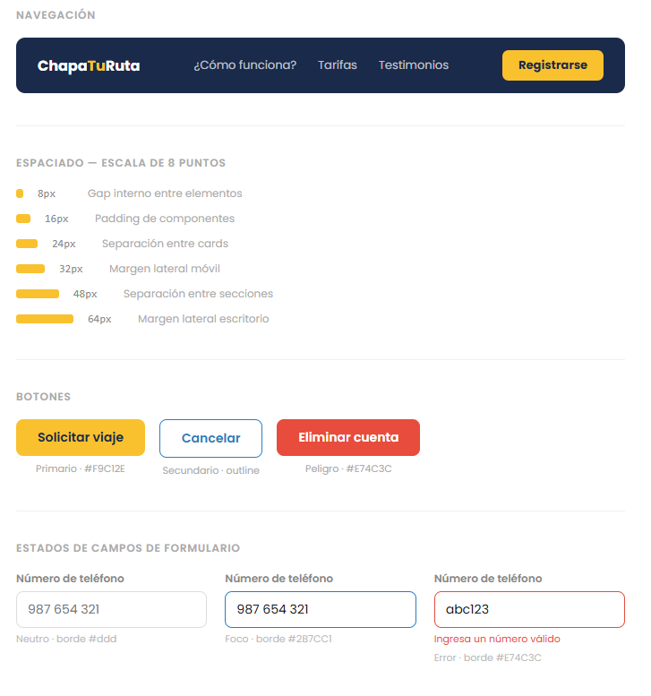

## 4.2 Information Architecture

### 4.2.1 Organization Systems

  <p align="justify">
    La arquitectura de información de ChapaTuRuta utiliza tres tipos de organización según el contexto de cada pantalla y flujo.<br><br>
    La organización jerárquica se aplica en las pantallas principales de ambos perfiles. Para el pasajero, el mapa con conductores disponibles ocupa el mayor peso visual, seguido del campo de destino y el botón de solicitud; el historial, el perfil y las calificaciones quedan en un nivel inferior porque no forman parte del flujo urgente. Para el conductor, la jerarquía coloca en primer plano su estado de disponibilidad y las solicitudes entrantes, relegando los ingresos del día y la gestión de documentos a secciones de consulta secundaria.<br><br>
    La organización secuencial rige todos los procesos que deben completarse sin omisiones. La solicitud de viaje avanza en el orden destino->tarifa estimada->confirmación, lo cual impide que el pasajero confirme sin conocer el costo. El registro del conductor sigue la secuencia datos personales->información del vehículo->carga de documentos (brevete y SOAT)->verificación. En ambos casos el usuario ve en todo momento en qué paso se encuentra y cuántos le restan.<br><br>
    La organización matricial se aplica en la pantalla de historial de viajes, donde el usuario puede cruzar dos variables simultáneamente: período de tiempo (semana, mes) y tipo de registro (viajes realizados, cancelados). Esto permite que tanto el pasajeros como conductores analicen su actividad desde más de una dimensión sin necesidad de navegar entre vistas separadas.<br><br>
    En cuanto a los esquemas de categorización, el historial se ordena cronológicamente del viaje más reciente al más antiguo, lo cual responde al patrón de consulta más habitual. Las solicitudes entrantes para el conductor se categorizan por tópico, agrupando primero las activas, luego las pendientes de respuesta y finalmente las activas, luego las pendientes de respuesta y finalmente las expiradas. El contenido general de la plataforma se segmenta según audiencia, diferenciando en todo momento las funcionalidades del pasajero con el conductor, ya que ambos perfiles acceden a secciones distintas con lógicas de uso completamente diferentes.
  </p>

### 4.2.2 Labeling Systems

  <p align="justify">
    El sistema de etiquetado de ChapaTuRuta se fundamenta en el principio de mínima carga cognitiva: cada etiqueta debe comunicar con precisión qué encontrará el usuario al interactuar con ese elemento, al emplear el menor número de palabras posible y un vocubalario coherente con el contexto del transporte informal en ciudades intermedias del Perú. Se evita deliberadamente el uso de anglicismos, tecnicismos propios de plataformas urbanas o términos abstractos que puedan generar confusión en usuarios con baja experiencia digital.
    Las etiquetas cumplen además una función asociativa: orientan al usuario hacia dónde encontrará información relacionada sin necesidad de que todo el contenido esté concentrado en un mismo lugar. Por ejemplo, la etiqueta "Mis documentos" en el perfil del conductor no solo indice que allí se visualizan el brevete y el SOAT registrados, sino que también asocia en el usuario que en esa sección encontrará alertas de vencimiento y opciones de actualización, lo que consolida toda la gestión documental en un únicio punto de acceso.
    A continuación se detallan las etiquetas definidas para cada sección de la plataforma:<br>
  </p>
    <span style="font-weight: bold;">Landing Page</span>
    <table>
      <thead>
        <tr>
          <th>Etiqueta</td>
          <th>Contenido asociado</td>
        </tr>
      <thead>
      <tbody>
        <tr>
          <td>Inicio</td>
          <td>Presentación del servicio, propuesta de valor y acceso a la plataforma</td>
        </tr>
        <tr>
          <td>¿Cómo funciona?</td>
          <td>Proceso paso a paso para pasajeros y conductores, desde el registro hasta la finalización del viaje</td>
        </tr>
        <tr>
          <td>Seguridad</td>
          <td>Mecanismos de verificación de documentos del conductor y sistema de calificaciones mutuas</td>  
        </tr>
        <tr>
          <td>Soy conductor</td>
          <td>Beneficios para mototaxistas, requisitos de registro y llamado a la acción</td>  
        </tr>
        <tr>
          <td>Testimonios</td>
          <td>Comentarios reales de pasajeros y conductores sobre cómo la plataforma ha transformado su experiencia en el servicio de mototaxis</td>  
        </tr>
        <tr>
          <td>Contáctanos</td>
          <td>Formulario de contacto, canal de soporte y redes sociales de la plataforma</td>  
        </tr>
      </tbody>
    </table><br>
    <span style="font-weight: bold;">Aplicación Web - Perfil Pasajero</span>
        <table>
      <thead>
        <tr>
          <th>Etiqueta</td>
          <th>Contenido asociado</td>
        </tr>
      <thead>
      <tbody>
        <tr>
          <td>Pedir moto</td>
          <td>Mapa principal con conductores disponibles y flujo de solicitud de viaje</td>
        </tr>
        <tr>
          <td>Mis viajes</td>
          <td>Historial cronológico de trayectos con detalle de ruta, tarifa y calificación otorgada</td>
        </tr>
        <tr>
          <td>Calificaciones</td>
          <td>Valoraciones recibidas de conductores tras cada viaje completado</td>  
        </tr>
        <tr>
          <td>Mi Perfil</td>
          <td>Gestión de datos personales, foto y contraseña de acceso</td>  
        </tr>
      </tbody>
    </table><br>
    <span style="font-weight: bold;">Aplicación Web - Perfil Conductor</span>
        <table>
      <thead>
        <tr>
          <th>Etiqueta</td>
          <th>Contenido asociado</td>
        </tr>
      <thead>
      <tbody>
        <tr>
          <td>Solicitudes</td>
          <td>Carreras disponibles geolocalizadas cercanas en tiempo real</td>
        </tr>
        <tr>
          <td>Mis carreras</td>
          <td>Registro de viajes completados, cancelados e ingresos estimados por jornada</td>
        </tr>
        <tr>
          <td>Mis documentos</td>
          <td>Brevete y SOAT registrados con estado de vigencia y alertas de vencimiento próximo</td>  
        </tr>
        <tr>
          <td>Calificaciones</td>
          <td>Valoraciones reibidas de pasajeros y promedio acumulado visible en el perfil público</td>  
        </tr>
        <tr>
          <td>Mi perfil</td>
          <td>Datos personales, foto de perfil y vehículo registrado en la plataforma</td>  
        </tr>
      </tbody>
    </table>

### 4.2.3 SEO Tags and Meta Tags

La definición de SEO Tags y Meta Tags para ChapaTuRuta responde a dos objetivos simultáneos: mejorar el posicionamiento orgánico en motores de búsqueda para consultas relacionadas con el transporte en mototaxi en provincias del Perú, y garantizar que la información que se muestra al compartir los enlaces de la plataforma represente con precisión la propuesta de valor del servicio. A continuación se detallan las etiquetas definidad para el Landing Page y la Aplicación Web.

**1. Landing Page**

```HTML
<meta charset = "utf-8">
```

Define la codificación de caracteres como UTF-8, lo cual garantiza la correcta visualización de tildes, la letra ñ y caracteres especiales propios del español en cualquier navegador o dispositivo.

```HTML
<meta name="viewport" content="width=device-width, initial-scale=1">
```

Establece que la landing page debe adaptarse de forma responsiva al ancho del dispositivo desde el que se accede. Resulta especialmente relevante para ChapaTuRuta dado que la mayoría de sus usuarios accede desde smartphones de gama media con pantallas de tamaño variable.

```HTML
<title>ChapaTuRuta | Mototaxi Seguro y Verificado en provincias del Perú</title>
```

Define el título que aparece en la pestaña del navegador y en los resultados de búsqueda. Incorpora las palabras clave de mayor relevancia para el mercado objetivo:mototaci, seguro, verificado y provincias del Perú, orientando el posicionamiento hacia búsquedas locales.

```HTML
<meta name="description" content="ChapaTuRuta conecta con pasajeros con mototaxistas verificados en ciudades intermedias del Perú. Solicita tu viaje, conoce la tarifa antes de salir y viaja con seguridad desde cualquier dispositivo con internet.">
```

Proporciona el texto descriptivo que aparece como fragmento en los resultados de Google. Está redactado para comunicar los tres diferenciadores principales del servicio: verificación del conductor, tarifa previa y accesibilidad desde cualquier dispositivo.

```HTML
<meta name="keywords" content="mototaxi provincias Peru, transporte mototaxi ciudades intermedias, app mototaxi verificado, mototaxi Casma, mototaxi Huarmey, mototaxi Talara, transporte seguro provincias">
```

Especifíca las palabras clave asociadas al contenido de la página, que incluye nombres de ciudades objetivo para reforzar el posicionamiento de búsquedas geográficamente específicas.

```HTML
<meta name="author" content="CTR Technologies">
```

Identifica a CTR Technologies como la organización responsable del contenido de la plataforma.

```HTML
<meta name="language" content="es">
```

Declara el español como idioma principal del contenido, orientando correctamente a los motores de búsqueda sobre el público al que se dirige la plataforma.

```HTML
<meta name="copyright" content="CTR Technologies 2026">
```

Establece la titularidad de los derechos de autor del contenido publicado en la landing page.

<br>**2. Aplicación Web**

```HTML
<meta charset="utf-8">
```

Garantiza la correcta reprentación de caracteres especiales del espa{ol en toda la interfaz de la aplicación.

```HTML
<meta name="viewport" content="width=device-width, initial-scale=1">
```

Asegura que la interfaz de la aplicación web se adapte correctamente a dispositivos móviles, tabletas y computadoras de escritorio, lo cual mantiene la usabilidad en todos los tamaños de pantalla.

```HTML
<title>ChapaTuRuta | Solicita tu mototaxi en provincias</title>
```

Define el titulo de la aplicación web orientado a la acción principal que el usuario realiza dentro de la plataforma.

```HTML
<meta name="description" content="ChapaTuRuta conecta con pasajeros con mototaxistas verificados en ciudades intermedias del Perú. Solicita tu viaje, conoce la tarifa antes de salir y viaja con seguridad desde cualquier dispositivo con internet.">
```

Describe el contenido de la aplicación enfocándose en las funcionalidades principales disponibles para ambos perfiles de usuario, optimizado para aparecer cuando se comparte el enlace de la app

```HTML
<meta name="keywords" content="solicitar mototaxi app, historial viajes mototaxi, conductor mototaxi verificado, panel conductor, ChapaTuRuta aplicacion web">
```

Palabras clave orientadas a las funcionalidades específicas de la aplicación y al perfil de usuario que la utiliza activamente.

```HTML
<meta name="author" content="CTR Technologies">
<meta name="language" content="es">
<meta name="copyright" content="CTR Technologies 2026">
```

### 4.2.4 Searching Systems

**Perfil Pasajero**<br>

  <p align="justify">
    La búsqueda principal del pasajero ocurre sobre el mapa: escribe su destino en la barra superior y el sistema ofrece autocompletado con referencias locales reconocibles como mercados, colegios, parques y avenidas principales de la ciudad. Si no recuerda el nombre exacto, puede arrastrar el pin directamente sobre el mapa para indicar el punto. No se busca entre listas de conductores; el sistema localiza automáticamente los disponibles en el radio cercano al confirmar el destino.
    Los filtros disponibles para el pasajero son: distancia máxima al conductor y calificación mínima del conductor (por ejemplo, solo conductores con 4 estrellas o más).
    Tras la búsqueda, los resultados se muestran como íconos sobre el mapa indicando la posición de cada conductor disponible. Al seleccionar uno, aparece una tarjeta con foto, nombre, calificación promedio, tipo de vehículo y tarifa estimada para el trayecto indicado. Si no hay conductores disponibles, el sistema muestra un mensaje que indica la situación y sugiere reintentar en unos minutos o ampliar el radio de búsqueda.
  </p>

**Conductor**

  <p align="justify">
    El conductor no realiza búsquedas activas: las solicitudes llegan a él ordenadas por proximidad. Sin embargo, en su historial de carreras puede buscar registros específicos mediante los siguientes filtros: rango de fechas, estado del viaje (completado o cancelado) e ingresos por rango de monto.<br>
    Los resultados del historial se presentan como tarjetas individuales que muestran fecha, hora, punto de origen, destino, monto cobrado y calificación recibida del pasajero. Cuando la búsqueda no arroja resultados, el sistema indica que no existen registros para los filtros aplicados y ofrece la opción de limpiarlos con un solo toque.
  </p>

### 4.2.5 Navigation Systems

El diseño del sistema de navegación de ChapaTuRuta tiene como objetivo que tanto pasajeros como conductores puedan cumplir sus metas dentro de la plataforma de forma fluida, sin necesidad de explorar ni memorizar rutas de acceso. Las decisiones de navegación están condicionadas por el perfil del usuario objetivo: personas con experiencia digital limitada que necesitan encontrar lo que buscan de forma inmediata o ser guiadas paso a paso cuando el proceso lo requiere.<br><br>
**Landing Page**<br>
La navegación de la landing page está diseñada para construir confianza de manera progresiva antes de solicitar el registro. La barra de navegación superior permanece fija durante todo el desplazamiento vertical, ofreciendo acceso directo a las secciones principales en todo momento. Los elementos de esta barra siguen una lógica argumentativa deliberada: primero se presenta la solución ("¿Cómo funciona?"), luego los mecanismos que generan confianza ("Seguridad"), y finalmente el llamado a la acción diferenciado para cada perfil ("Soy conductor"). Esta secuencia responde al recorrido mental típico de un visitante escéptico que llega por primera vez a la plataforma.<br>
El desplazamiento vertical funciona como mecanismo narrativo principal: el contenido está estructurado para responder de forma anticipada las preguntas y objeciones más comunes antes de que el visitante las formule. Los botones de registro aparecen estratégicamente al final de cada sección relevante, de modo que el usuario pueda actuar en el momento en que la información lo convenció, sin necesidad de volver al inicio o buscar el formulario.<br><br>
**Aplicación Web**<br>
Dentro de la aplicación, la navegación principal se resuelve mediante una barra inferior persistente en dispositivos móviles, con acceso directo a las secciones clave del perfil correspondiente. La posición inferior responde a criterios ergonómicos: facilita el uso con una sola mano, patrón frecuente en usuarios que consultan la app mientras caminan o esperan en la calle.<br>
Los flujos de acción crítica, como solicitar un viaje o aceptar una carrera, son lineales e interrumpibles únicamente mediante una cancelación explícita. Durante estos flujos no se muestra la barra de navegación principal para evitar que el usuario abandone el proceso por un toque accidental. Cada etapa del flujo ocupa la pantalla completa con un mensaje de estado claro y un color distintivo por fase: búsqueda de conductor, conductor en camino, viaje en curso y viaje completado. Esta técnica elimina la ambigüedad sobre el estado del sistema en todo momento.<br>
Para usuarios que acceden desde computadora de escritorio, la navegación migra a una barra lateral izquierda con las mismas etiquetas y jerarquía que la versión móvil, que garantiza coherencia en la experiencia independientemente del dispositivo utilizado. Las transiciones entre secciones emplean animaciones de duración mínima para no penalizar el rendimiento en dispositivos de gama media, priorizando la velocidad de respuesta sobre los efectos visuales elaborados.

## 4.3 Landing Page UI Design

### 4.3.1 Landing Page Wireframe

### 4.3.2 Landing Page Mock-up

## 4.4 Web Applications UX/UI Design

### 4.4.1 Web Applications Wireframes

### 4.4.2 Web Applications Wireflow Diagrams

### 4.4.3 Web Applications Mock-ups

### 4.4.4 Web Applications User Flow Diagrams

## 4.5 Web Applications Prototyping

## 4.6 Domain-Driven Software Architecture


### 4.6.1 Design-Level EventStorming

#### IAM

##### Brainstorming

#### Flows


#### DRIVER MANAGEMENT

##### Brainstorming


#### Flows


#### RIDE DISPATCH

##### Brainstorming


#### Flows


#### TRUST AND REPUTATION

##### Brainstorming


#### Flows


#### MONETIZATION

##### Brainstorming


#### Flows


### 4.6.2 Software Architecture Context Diagram

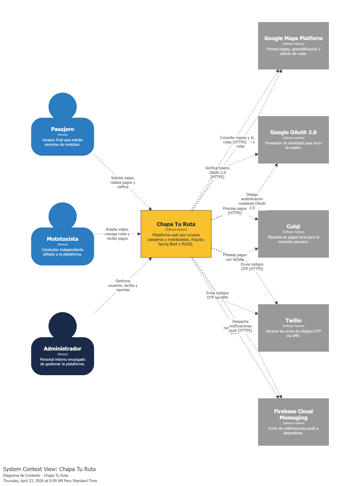


### Actores

| Actor             | Rol                                                                            | Interacción principal                                                                  |
| ----------------- | ------------------------------------------------------------------------------ | -------------------------------------------------------------------------------------- |
| **Pasajero**      | Usuario final que solicita servicios de mototaxi en zonas periféricas de Lima. | Solicita viajes desde la aplicación web, realiza pagos y califica al mototaxista.      |
| **Mototaxista**   | Conductor independiente afiliado a la plataforma.                              | Recibe solicitudes de viaje, navega la ruta, cobra el servicio y califica al pasajero. |
| **Administrador** | Personal interno del equipo operativo.                                         | Gestiona usuarios, configura tarifas, atiende incidencias y consulta reportes.         |

### Sistemas externos

| Sistema externo                    | Propósito de la integración                                                                                         |
| ---------------------------------- | ------------------------------------------------------------------------------------------------------------------- |
| **Google Maps Platform**           | Provee mapas, geocodificación (dirección ↔ coordenadas) y cálculo de rutas con tiempos estimados de viaje.          |
| **Google OAuth 2.0**               | Proveedor de identidad que permite el inicio de sesión federado, reduciendo la fricción en el registro de usuarios. |
| **Culqi**                          | Pasarela de pagos local que procesa transacciones con tarjeta de crédito y débito dentro del mercado peruano.       |
| **Twilio**                         | Envío de códigos OTP vía SMS para verificación de números telefónicos durante el registro y autenticación.          |
| **Firebase Cloud Messaging (FCM)** | Envío de notificaciones push en tiempo real a pasajeros y mototaxistas.                                             |

### 4.6.3 Software Architecture Container Diagrams

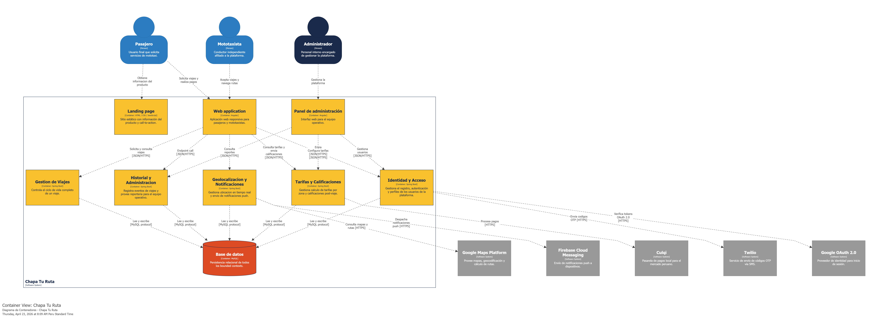

### Contenedores del sistema

| Contenedor                           | Tecnología              | Responsabilidad                                                                                                                                  |
| ------------------------------------ | ----------------------- | ------------------------------------------------------------------------------------------------------------------------------------------------ |
| **Landing page**                     | HTML / CSS / JavaScript | Sitio web estático con información del producto y call-to-action por segmento objetivo.                                                          |
| **Web application**                  | Angular                 | Aplicación web responsiva para pasajeros y mototaxistas. Permite solicitar viajes, visualizar el mapa, gestionar pagos y consultar el historial. |
| **Panel de administración**          | Angular                 | Interfaz web para el equipo operativo. Permite gestionar usuarios, configurar tarifas y consultar reportes.                                      |
| **Identidad y Acceso**               | Spring Boot · Java      | Gestiona el registro, autenticación y perfiles de los usuarios de la plataforma.                                                                 |
| **Gestión de Viajes**                | Spring Boot · Java      | Controla el ciclo de vida completo de un viaje: solicitud, aceptación, inicio y finalización.                                                    |
| **Geolocalización y Notificaciones** | Spring Boot · Java      | Gestiona la ubicación en tiempo real y el envío de notificaciones push.                                                                          |
| **Tarifas y Calificaciones**         | Spring Boot · Java      | Calcula tarifas por zona y distancia, y gestiona las calificaciones post-viaje.                                                                  |
| **Historial y Administración**       | Spring Boot · Java      | Registra eventos de viajes y provee reportería para el equipo operativo.                                                                         |
| **Base de datos**                    | MySQL                   | Almacena de forma persistente los datos de todos los bounded contexts del sistema.                                                               |

### Flujos de comunicación

Los clientes (Web Application y Panel de administración) se comunican con cada bounded context del backend exclusivamente mediante llamadas HTTPS con intercambio de datos en formato JSON. Cada bounded context del RESTful API accede a la Base de datos a través de Spring Data JPA / Hibernate. Los sistemas externos (Google Maps, Google OAuth, Culqi, Twilio y Firebase Cloud Messaging) son consumidos directamente por los bounded contexts que los necesitan según su responsabilidad funcional.Sonnet 4.6Adaptive

### 4.6.4 Software Architecture Components Diagrams

### Bounded Context 1: Gestión de Identidad y Acceso

Este bounded context gestiona el registro, autenticación y perfiles de todos los usuarios de la plataforma. `UserController` recibe las solicitudes desde la Web Application y el Panel de Administración, y las delega a `UserService`, que contiene la lógica de negocio. `UserService` se apoya en `JwtUtil` para generar y validar tokens JWT de autenticación stateless, en **Google OAuth 2.0** para validar identidades federadas, y en **Twilio** para el envío de códigos OTP de verificación telefónica. `UserRepository` persiste los datos en la tabla `users` de la base de datos.

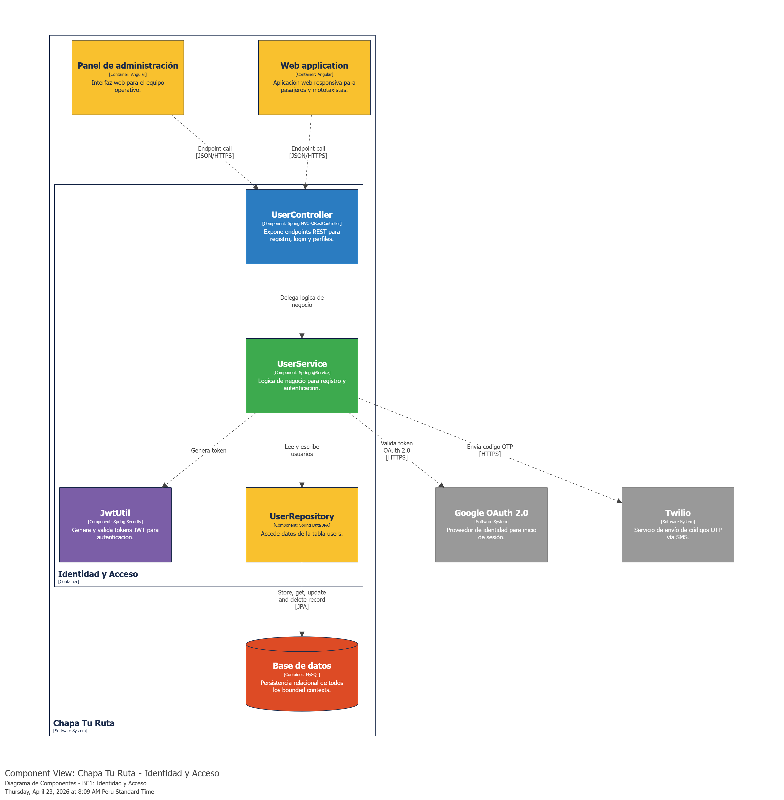

### Bounded Context 2: Gestión de Viajes

Este bounded context controla el ciclo de vida completo de un viaje. `TripController` recibe las solicitudes de la Web Application para crear, aceptar, iniciar, completar o cancelar viajes, y las delega a `TripService`. Este servicio orquesta las transiciones de estado del viaje coordinando con los bounded contexts de Tarifas, Geolocalización y Notificaciones a través de inyección de dependencias. `TripRepository` persiste los datos en las tablas `trips` y `trip_requests` de la base de datos.

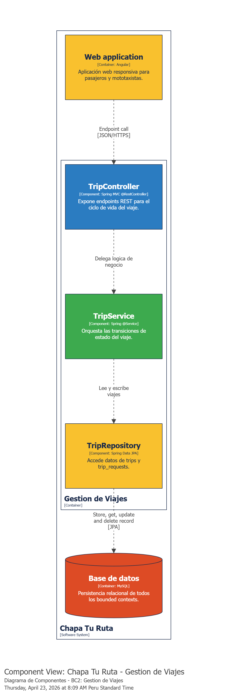

### Bounded Context 3: Geolocalización y Notificaciones

Este bounded context gestiona la ubicación en tiempo real de los usuarios y el despacho de notificaciones push. `LocationController` recibe actualizaciones de posición desde la Web Application y las delega a `LocationService`, que mantiene la posición activa de cada usuario. Cuando ocurre un evento relevante (solicitud de viaje, aceptación, llegada), `LocationService` delega en `NotificationService` el envío de alertas, el cual se comunica con **Firebase Cloud Messaging** para entregar la notificación al dispositivo del usuario. `GoogleMapsAdapter` encapsula las llamadas HTTP a la API de **Google Maps** para el cálculo de rutas y geocodificación. `LocationRepository` persiste los datos en la tabla `locations`.

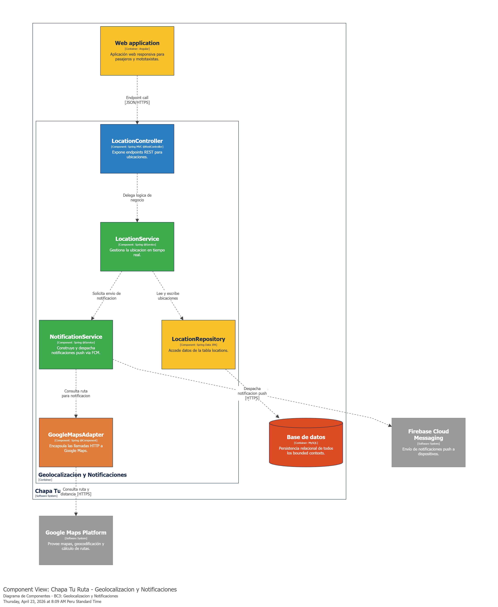

### Bounded Context 4: Tarifas y Calificaciones

Este bounded context es responsable del cálculo de tarifas por zona y distancia, y de la gestión de calificaciones post-viaje entre usuarios. `FareController` expone los endpoints para consultar y configurar tarifas, mientras que `RatingController` expone los endpoints para crear y consultar calificaciones. `FareService` aplica la fórmula `total = baseRate + (ratePerKm × distanceKm)` usando los datos de la zona geográfica e integra con **Culqi** para el procesamiento de pagos. `RatingService` gestiona la creación de calificaciones validando que el puntaje esté entre 1 y 5, y calcula el puntaje promedio por usuario. `FareRepository` y `RatingRepository` persisten los datos en las tablas `fares`, `fare_zones` y `ratings` de la base de datos.

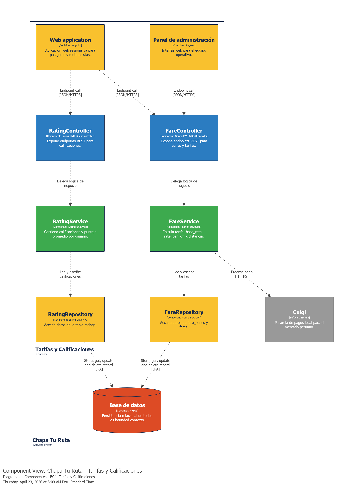

### Bounded Context 5: Historial y Administración

Este bounded context registra los eventos del ciclo de vida de cada viaje y provee capacidades de reportería para el equipo operativo. `HistoryController` expone los endpoints para consultar el historial de viajes y generar reportes administrativos. `TripHistoryService` persiste cada transición de estado de un viaje como un log inmutable en la tabla `trip_history`. `AdminReportService` genera reportes agregados de viajes diarios, ingresos y actividad de usuarios para el Panel de Administración, almacenándolos en la tabla `admin_reports`.

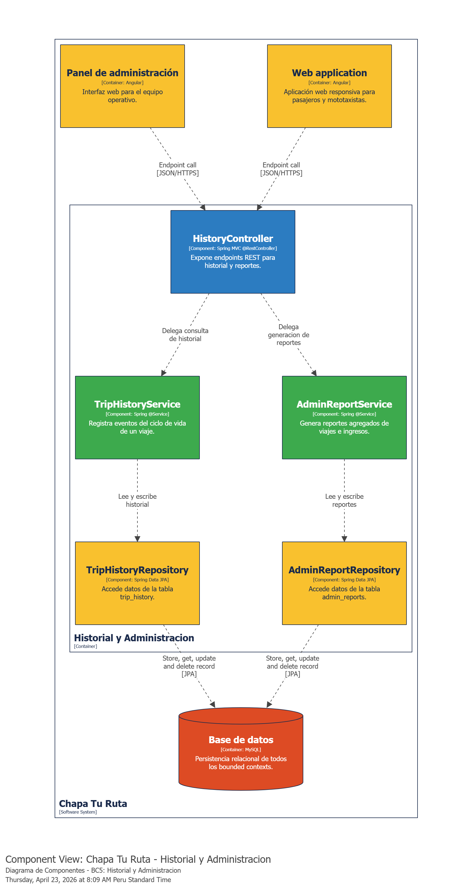

## 4.7 Software Object-Oriented Design

### 4.7.1 Class Diagrams

#### IAM

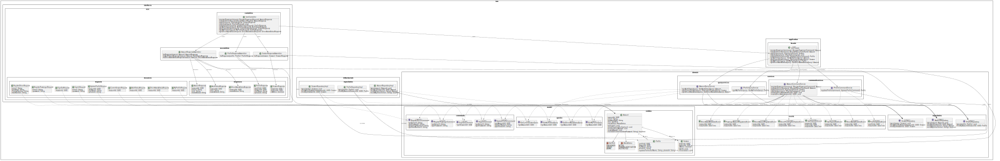

([Link to IAM class diagram](https://editor.plantuml.com/uml/xHhBRkCsy6x0_o3aqhHftFPgR8FrsifMGFnOoGdGKy78Z2Ei7guUsQRj_dj7eaIHr52YasowAEf379CpmvdXl3ZasomdQLv4uNYKVGpY0qb9P1s8_v7igPS_XjHAgP-JU1zI4S8FIPRDyZmDRekSEduIUy6VrFfnFBeFTjIYqI5_j28QtT8q6u_6evgYTHAGQ48EXp3mIHuayUIE-6H7Jwo_nYCBFXLToo7HPJLklNd3_hcuQ23ApnamjG-odAOR0AVndgQdVX959DvDBSTLv-PiwjkfDVFzf8XpZD8Y3HvGCcoYbqOMx6Cd5d2zQg35yMYMWRGgphh85IGOQR4Uac0deXI77Sdf9atkWf0AYDVYU8jU3uWKzZIV5VczbvEyo4v_BsZw2FZlnT4FvI0k9c3FYpIbSLxB8rAGPnegYE10PVdO224Gu8CDBiu_smxW3YXtvUZEel9y7ey-TynobqGaY2THigFX14G9ye1ct39fN4JMTKPJDm6d48nnC_CyU_NUTjkXXUlSYBzdYwMpuYiBz4H6HPgp-HOe26lOguMpUlyRK7KkdVbiwwnNxQnhUrlNcM_jXR86ywPQSf7-kKNOe0FsSttjBCGf2ce8OUl0kUEzE740Qf-ITFSBoUwn-HGqC-KwKbRZSaubgSNT9NuUF80bdoAs7v7quuR6ErZoXgR1NHq_C50QazkGYfQ0GQKq0m7yN0_nGCAWTAnvIdUbEP0mEqt9fqsjXKO3W7cRWBmaHhLVMx6i_GCRnBJVip5tHHYkI4JHlRbFykGwHVPDZHigbUyxk98k575gXvR5oTZWaU84sQpSSAheZ_5SfILiLuAusPTJbSy1bwu3PklIGGpX7H8GrUSCI43rVse6Wb1abuvISj5LESmsTg82S8KYoqkvvWkipG6k0f_66LqLPORMGda9oN4GJ0WfwRsIukISsRkernXfIRUrHOmgbb1xQSyQAvTfy_dBskVqCjSkYCWyODLbyXFpb216Dw-34DMtkGYOUl1i_sAqvKBWnSXgIeCdqTVk2Nq0hMHAESk3IasmyNQwiqjmu61HOLU_L3wq0VJCIdo_t8RTEfvQ2p3ORH1HD6XpqV_5rP7a_KhhbmL96IVepZ5PKflCNfeRY5lFOyTupTgVM5WpsNPjVV8KemC1xAeaUtLpXvNTkipxeejhmq5A3qaMv8akGdENhC7AQDJ-w9W2UQ2dDO_yG8EKI7T1l7lt265BaGS_rJ5ebfAbqXy7ftz0zCXq27WbB4XSc-8n4jV6o0-4MedRUDqLN3fCefK4yxDZ6AjTavzoDOonAhUVFUISp7THYG0gT9_zGQnvW4eluxLl_Rl75kiYnsEG_tTTiEDaT_zqfqjZj1vVwTkHvxI4Z0odwgqOc4rLGw4iVYKzfvVg6-bsgLS1JsXueRiJn7Sf0Sig_Bn8APvUfAPF6y6Sw13-HzA9LDGCIlW5quVK4Xbav2jE5zoSiqaPkI1Tn7cQX25DLRjoI3JdaqFP8QLWxXaOLoSvk6ocjGceqmv9d56CO9qaEjJOk16fEbTm4YnLjAXy3t7KCcL8k33G8lVtwJcU59DRR3xGNLeEdPnGEoR8BeoXX9Geoed9uqOQaG8Q9yI7J4L38Z8drfrhgM9puW965Wv_aY9bFol2gg7hJ5QsUKsl_8ptoZKjB7aDoP2VjG2R2yNk7WQGySPUBt-IbxoauB8B6HnurKCquah6Hpbz6_rCqqPNBrHK_pDOMY61UjtnP5IVEvw2rj7CI1tdQCnBjQKAcpRUHwq9idkexhXy2zMpmKhSCkwDl9RH7QceP-j3oGKlqI_JNFuOMEUHmlSAEMo-PVIFRf52IB7QMGCdCvOd3G1MQVSKB7dItN2KH6_UpnEz1Z5g1gcrnq-6TO3KucYDq6z_m-iWfJPQppGcy8tri-vJJhhsrMpkh5UsPoriQx5UEYjdFO3LtBgV_7HYdPzNNyrLyDHAFiMPTT45-d4o-Uw4tx42t87AWEVd5y85kpWgNweFYZHVBvUprSApVh0-NDkk0w8voysLlRHNszbYxLcRjGjomvotzGQeQKkboUJl2trdg4MKwnyPIse4ZKToIS90fRuF0n6AYnQcRVECHsW5mK2ntacfqMxQP_3TLiPuXETt3eyqBiQZJZBdu7AdO3pI9ssEecbe65d6Qkkkhwvi5spZSZQVBUm17FbCM1fZ-u1hQXNWZ1YCDe3gKRJnHe-Y3HqDog0-c0f05vxjtZXpUyWRMjahJU1jrQcreo7TWvrb7GoyxTU7WVNW35RGmmygfT45gAM99ETr71bI3wwGoQGdKW1pz_0LLg8OuClFA0oHvUSBHo09xmy4BC33DxB2GryOoDZOfbQuoBK-mYsAXrtRc-BgxizHcL4AoiM-X6XkRwwzMNlETlrqMnDzHhZluK6a1wjxIyInyDqM_Gt1qkZSaCCkpZ1_NPm-xWOBetelVXMgX_9nuj3EuErfbhqwS-CHtkjbu9qvg03GZcnT2AXpLMf7sH6o5AZa06U0ibUjuqP8K18qpeoGcoJeGPNRDw3ZPmJPeSSem4nn6mRP_K3ewtrJSXmHxTCGKpBT5nx7O_BN63AgFePZZogELfxwDk8f1DGd3XADGNigNoyltq6rnsAhjm7d7GoisjfDTXaMHKo0-R5-QlafPKL8Frwt7MAAsjDK44W8ReuHQJsT2Ma2Z2-ZhL3b4C6MCG76btaBJbP4uJy0))

### 4.7.2 Class Dictionary

## 4.8 Database Design

### 4.8.1 Database Diagrams

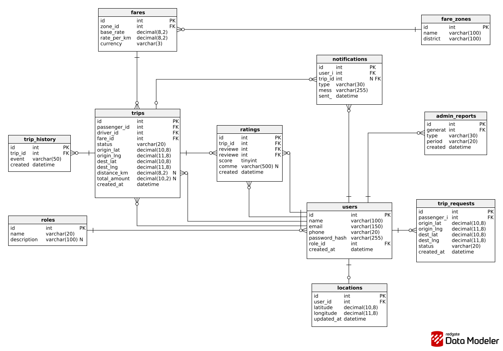

**Descripción por bounded context**

**Identidad y Acceso**. `roles` define los tres tipos de usuario (PASSENGER, DRIVER, ADMIN). `users` almacena los datos de todos los usuarios del sistema y referencia a roles mediante clave foránea.
**Gestión de Viajes**. `trip_requests` registra las solicitudes de viaje antes de que sean aceptadas por un conductor. `trips` almacena los viajes activos y completados, referenciando al pasajero, conductor y tarifa aplicada.
**Geolocalización y Notificaciones**. `locations` mantiene una fila por usuario activo con su última posición conocida (relación uno a uno con `users`). `notifications` registra todas las notificaciones enviadas, vinculadas a un usuario y opcionalmente a un viaje.
**Tarifas y Calificaciones**. `fare_zones` define las zonas geográficas de operación. `fares` almacena la estructura tarifaria por zona (tarifa base + tarifa por kilómetro). `ratings` registra las calificaciones post-viaje con claves foráneas al viaje, al calificador y al calificado.
**Historial y Administración**. `trip_history` registra cada evento del ciclo de vida de un viaje como un log inmutable. `admin_reports` almacena los reportes generados por el equipo operativo.
