# Capítulo V: Product Implementation, Validation & Deployment
## 5.1. Software Configuration Management
### 5.1.1 Software Development Environment Configuration
<table>
  <thead>
    <tr>
      <th>Actividad</th>
      <th>Herramienta/Guía</th>
      <th>Propósito</th>
      <th>Tipo de acceso/Ruta (links)</th>
    </tr>
  </thead>
  <tbody>
    <tr>
      <td>Gestión de proyecto</td>
      <td>Trello</td>
      <td>Organizar y dar seguimiento a tareas</td>
      <td><a href="https://trello.com" target="_blank">Trello</a></td>
    </tr>
    <tr>
      <td>Gestión de requerimientos</td>
      <td>Gherkin Conventions</td>
      <td>Definir criterios de aceptación claros</td>
      <td><a href="https://cucumber.io/docs/gherkin/" target="_blank">Guía Gherkin</a></td>
    </tr>
    <tr>
      <td>Producto UI/UX</td>
      <td>Figma</td>
      <td>Diseño de interfaces y prototipos</td>
      <td><a href="https://figma.com" target="_blank">Figma</a></td>
    </tr>
    <tr>
      <td>Landing Page desarrollo</td>
      <td>Visual Studio Code</td>
      <td>Edición y desarrollo de código</td>
      <td><a href="https://code.visualstudio.com/" target="_blank">VS Code</a></td>
    </tr>
    <tr>
      <td>Control de versiones</td>
      <td>Git</td>
      <td>Gestión de versiones del código</td>
      <td><a href="https://git-scm.com/" target="_blank">Git</a></td>
    </tr>
    <tr>
      <td>Despliegue</td>
      <td>GitHub Pages</td>
      <td>Publicar la aplicación web</td>
      <td><a href="https://pages.github.com/" target="_blank">GitHub Pages</a></td>
    </tr>
    <tr>
      <td>Event Storming</td>
      <td>Miro</td>
      <td>Colaboración y modelado de procesos</td>
      <td><a href="https://miro.com/" target="_blank">Miro</a></td>
    </tr>
    <tr>
      <td>Diagramas</td>
      <td>PlantUML</td>
      <td>Generación de diagramas UML</td>
      <td><a href="https://plantuml.com/" target="_blank">PlantUML</a></td>
    </tr>
  </tbody>
</table>

### 5.1.2 Source Code Management
Para la gestión del código fuente del proyecto, el equipo utiliza la plataforma GitHub como sistema de control de versiones. A continuación, se detallan los repositorios correspondientes a cada componente del sistema:

Landing Page: [Link Landing Page](https://startup-x-upc.github.io/landing-page/)
<!-- Web Services: [Link Web Services](https://github.com/tu-org/backend-services)
Frontend Web Application: [Link Frontend Web](https://github.com/tu-org/frontend-app) -->

En el repositorio de Web Services se incluyen tanto el código fuente como las pruebas unitarias y de aprobación y aceptación.

#### GitFlow Workflow
Nuestro equipo adopta el modelo de ramificación GitFlow, propuesto por Vincent Driessen, para organizar nuestro desarrollo del proyecto.

Las ramas principales son:

**main**: Contiene el código estable listo para producción y establecer como la version final de nuestro informe .
**develop**: Rama principal de desarrollo donde se integran las funcionalidades antes de su liberación.

Ramas de soporte:

- **feature/**: Para el desarrollo de nuevas funcionalidades.
Convención: `feature/<nombre-descriptivo>`
Ejemplo: `feature/Chapter5-SourceCode`
- **release/**: Para preparar nuevas versiones del sistema.
Convención: `release/<versión>`
Ejemplo: `release/1.0.0`
- **hotfix/**: Para correcciones urgentes en producción.
Convención: `hotfix/<descripción>`
Ejemplo: `hotfix/fix-login-error`

Flujo de trabajo:

- Las features se crean desde `develop` y se integran nuevamente en esta rama  mediante Pull Requests.
- Las ramas `release` se crean desde `develop` y luego se fusionan en `main` y `develop`.
- Los `hotfix` se crean desde `main` y se integran tanto en `main` como en `develop`.

#### Versionado Semántico

El proyecto utiliza el estándar Semantic Versioning 2.0.0 para el control de versiones:

- **MAJOR**: Cambios incompatibles
- **MINOR**: Nuevas funcionalidades compatibles
- **PATCH**: Correcciones menores

Formato: vX.Y.Z
Ejemplo: v1.2.3

#### Conventional Commits

Se emplea el estándar Conventional Commits para los mensajes de commit, con el fin de mantener un historial claro y facilitar la integración continua.

**Formato**:

`[type]: [description]`

Tipos más utilizados:

- **feat**: Nueva funcionalidad
- **fix**: Corrección de errores
- **chore**: Tareas de mantenimiento
- **docs**: Cambios en documentación

Ejemplos:

- feat: add user authentication
- fix: resolve API timeout issue
- chore: update dependencies


### 5.1.3 Source Code Style Guide & Conventions
#### Landing Page Style Guide & Conventions

##### Project Structure

```
/public        (images, favicon, manifest.json)
/src
    /css         (styles.css + partials/modules)
    /js            (main.js + modules)
    /components    (HTML fragments if needed)
    /index.html
```
##### General Conventions

- All identifiers (variables, functions, classes, files) must be written in **English**.
- File naming uses **kebab-case** (e.g., `user-profile.js`).
- Conventions are based on:
  - Google HTML/CSS Style Guide
  - Google JavaScript Style Guide
- These conventions ensure maintainability, scalability, and team consistency.

###### HTML

- **Semantics first**: use `header`, `nav`, `main`, `section`, `article`, `footer`.
- **Accessibility (a11y)**:
  - Add `alt` text to images.
  - Use `aria-*` attributes for dynamic components.
  - Maintain logical tab order in the DOM.
  - Always show a visible focus state.
- **SEO**:
  - Include `<title>` and `<meta name="description">`.
  - Add Open Graph / Twitter meta tags.
  - Set `lang="en"` (or appropriate language) on `<html>`.
- **Performance**:
  - Use `loading="lazy"` on ``.
  - Minimize inline CSS/JS.
- **Conventions**:
  - Use **kebab-case** for class names.
  - Use `id` only for JS hooks or anchors, not for styling.

###### CSS

- **Naming**: Follow **BEM methodology** → `.block__element--modifier`.
- **Variables**: Define tokens in `:root`:
  ```css
  :root {
    --color-primary: #0ea5e9;
    --color-secondary: #64748b;
    --font-base: 1rem;
  }
  ```
- **Architecture**:
  - Separate utilities (spacing, grid) and components (buttons, cards).
- **Responsive**:
  - Mobile-first approach with `min-width` breakpoints.
  - Common breakpoints: 480px, 768px, 1024px, 1280px.
- **Typography & spacing**:
  - Use `rem` for scalability.
  - Avoid hard-coded magic numbers.
- **States**:
  - Define consistent `:hover`, `:focus-visible`, and `:disabled`.
- **Property order**:
  - Group logically: Layout → Box Model → Typography → Visual → Misc.

###### JavaScript

- **Structure**:
  - Modular design; keep one `main.js` entry point.
  - Use ES Modules (`import/export`) when possible.
  - Split reusable logic into separate modules.
- **Conventions**:
  - Use **camelCase** for variables/functions.
  - Use **PascalCase** for classes/constructors.
  - Constants in `UPPER_CASE`.
- **Best Practices**:
  - Prefer `const` and `let` over `var`.
  - Add comments for non-trivial logic.
  - Keep DOM selectors cached.
  - Use `addEventListener` (avoid inline `onclick`).
  - Wrap code in IIFEs or modules to avoid global leaks.
  - Handle errors using try/catch when necessary.
### 5.1.4 Software Deployment Configuration
#### 1. Landing Page – HTML, CSS y JavaScript

**Repositorio de Código Fuente**
La Landing Page se implementa empleando HTML, CSS y JavaScript. El proyecto se almacena en GitHub, colocando el archivo `index.html` en la raíz del repositorio (/), lo cual permite su reconocimiento automático por GitHub Pages.

**Activación de GitHub Pages**
1. Acceder al repositorio en GitHub.
2. Ir a Settings.
3. Seleccionar Pages.
4. Configurar:
   - Rama: main
   - Carpeta: / (root)
5. Guardar cambios.

**Publicación**
GitHub genera automáticamente una URL pública:

`https://<usuario>.github.io/<repositorio>/`

**Actualizaciones**  
Cada commit en la rama `main` se despliega automáticamente.

---

#### 2. Frontend Web Application – Angular

**Production Build**
El frontend se construye usando Angular CLI:

`ng build --configuration production`

Esto genera archivos optimizados en la carpeta `/dist`.

**Despliegue**
- Se utiliza una plataforma como **Netlify** o **Vercel**.
- Se sube la carpeta /dist.
- Se configura soporte para SPA (Single Page Application).

---

#### 3. Backend – REST API (Spring Boot)

**Build Process**  
El backend se empaqueta en un archivo .jar:

`./mvnw clean package`

**Deployment Process**
- Se utiliza una plataforma cloud (Render, Railway, etc.).
- Se ejecuta con:

`java -jar app.jar`

- Se configuran variables de entorno (puerto, base de datos, API keys).

---

#### 4. Consideraciones Generales

- Se utilizan variables de entorno para datos sensibles.
- Cada componente se despliega de forma independiente.
- El sistema permite actualizaciones continuas mediante commits.


## 5.2. Landing Page, Services & Applications Implementation

### 5.2.1. Sprint 1

#### 5.2.1.1. Sprint Planning 1


<table>
  <tbody>
    <tr>
      <td><b>Sprint #</b></td>
      <td>Sprint 1</td>
    </tr>
    <tr>
      <td colspan="2"><b>Sprint Planning Background</b></td>
    </tr>
    <tr>
      <td><b>Date</b></td>
      <td>2026-06-04</td>
    </tr>
    <tr>
      <td><b>Time</b></td>
      <td>18:50 PM (GMT-5)</td>
    </tr>
    <tr>
      <td><b>Location</b></td>
      <td>Modalidad remota mediante la plataforma Discord</td>
    </tr>
    <tr>
      <td><b>Prepared By</b></td>
      <td>Aguirre Ramos, Eduardo Manuel</td>
    </tr>
    <tr>
      <td><b>Attendees (to planning meeting)</b></td>
      <td>Castillo Vidal, Jesus Ivan / Torres Sanchez, Dalila Victoria / Aguirre Ramos, Eduardo Manuel / Pillaca Gonzales, Andy Saúl / Delgado Perez, James Caleb / Aiquipa Poma, Sebastian Andres</td>
    </tr>
    <tr>
      <td><b>Sprint 0 Review Summary</b></td>
      <td>Dado que este es el sprint inicial, no se presenta un resumen del sprint anterior.</td>
    </tr>
    <tr>
      <td><b>Sprint 0 Retrospective Summary</b></td>
      <td>Dado que este es el sprint inicial, no se presenta una retroalimentación del sprint anterior.</td>
    </tr>
    <tr>
      <td colspan="2"><b>Sprint Goal & User Stories</b></td>
    </tr>
    <tr>
      <td><b>Sprint 1 Goal</b></td>
      <td><b>Nuestro propósito es</b> diseñar y entregar una primera versión de la landing page para nuestra plataforma de gestión de rutas, basada en entrevistas con administradores y transportistas de una empresa distribuidora. <b>Creemos que esto aportará</b> claridad y valor inicial a los usuarios potenciales, comunicando el propósito del producto y la visión del equipo. <b>Esto se confirmará cuando</b> los visitantes puedan comprender fácilmente los beneficios de la plataforma y muestren interés en conocer más o contactarnos a través de la landing page.</td>
    </tr>
    <tr>
      <td><b>Sprint 1 Velocity</b></td>
      <td>15 puntos</td>
    </tr>
    <tr>
      <td><b>Sum of Story Points</b></td>
      <td>15 puntos</td>
    </tr>
  </tbody>
</table>

#### 5.2.1.2. Aspect Leaders and Collaborators

En esta sección se presenta la **Leadership-and-Collaboration Matrix (LACX)** correspondiente al Sprint 1. Cada aspecto se relaciona con tareas clave del sprint, asignando un **líder (L)** responsable principal y **colaboradores (C)** que apoyan en su ejecución.

<table>
  <tbody>
    <tr>
      <th>Team Member (Last Name, First Name)</th>
      <th>GitHub Username</th>
      <th>Mockup (L/C)</th>
      <th>Entrevistas (L/C)</th>
      <th>Wireframes (L/C)</th>
      <th>Landing Page (L/C)</th>
    </tr>
    <tr>
      <td>Castillo Vidal, Jesus Ivan</td>
      <td>Jcdev04</td>
      <td>L</td>
      <td>C</td>
      <td>C</td>
      <td>C</td>
    </tr>
    <tr>
      <td>Torres Sanchez, Dalila Victoria</td>
      <td>DalilaTorres</td>
      <td>C</td>
      <td>L</td>
      <td>C</td>
      <td>C</td>
    </tr>
    <tr>
      <td>Aguirre Ramos, Eduardo Manuel</td>
      <td>TheEngineEdu</td>
      <td>C</td>
      <td>C</td>
      <td>L</td>
      <td>C</td>
    </tr>
    <tr>
      <td>Pillaca Gonzales, Andy Saúl</td>
      <td>apillacag</td>
      <td>C</td>
      <td>C</td>
      <td>C</td>
      <td>L</td>
    </tr>
    <tr>
      <td>Aiquipa Poma, Sebastian Andres</td>
      <td>S-aiquipa</td>
      <td>C</td>
      <td>L</td>
      <td>C</td>
      <td>C</td>
    </tr>
  </tbody>
</table>

#### 5.2.1.3. Sprint Backlog 1

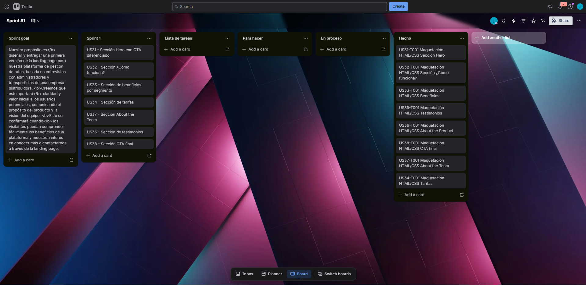

<a href="https://trello.com/b/uGr6OQCE/sprint-1">Sprint 1 Trello</a>

<table>
  <thead>
    <tr>
      <th>Sprint #</th>
      <th colspan="7">Sprint 1</th>
    </tr>
    <tr>
      <th colspan="2">User Story</th>
      <th colspan="6">Work-Item / Task</th>
    </tr>
    <tr>
      <th>Id</th>
      <th>Title</th>
      <th>Id</th>
      <th>Title</th>
      <th>Description</th>
      <th>Estimation (Hours)</th>
      <th>Assigned To</th>
      <th>Status (To-do / In-Process / To-Review / Done)</th>
    </tr>
  </thead>
  <tbody>
    <tr>
      <td>US-31</td>
      <td>Sección Hero con CTA diferenciado</td>
      <td>US31-T001</td>
      <td>Maquetación HTML/CSS Sección Hero</td>
      <td>Implementar la sección Hero utilizando HTML y CSS siguiendo fielmente los mockups de Figma.</td>
      <td>0.7</td>
      <td>Castillo Vidal, Jesus Ivan</td>
      <td>Done</td>
    </tr>
    <tr>
      <td>US-32</td>
      <td>Sección ¿Cómo funciona?</td>
      <td>US32-T001</td>
      <td>Maquetación HTML/CSS Sección ¿Cómo funciona?</td>
      <td>Implementar el flujo del servicio en HTML y CSS basado en los diseños de Figma.</td>
      <td>0.4</td>
      <td>Torres Sanchez, Dalila Victoria</td>
      <td>Done</td>
    </tr>
    <tr>
      <td>US-33</td>
      <td>Sección de beneficios por segmento</td>
      <td>US33-T001</td>
      <td>Maquetación HTML/CSS Beneficios</td>
      <td>Maquetar la sección de beneficios por perfil utilizando HTML y CSS.</td>
      <td>0.9</td>
      <td>Aguirre Ramos, Eduardo Manuel</td>
      <td>Done</td>
    </tr>
    <tr>
      <td>US-34</td>
      <td>Sección de tarifas</td>
      <td>US34-T001</td>
      <td>Maquetación HTML/CSS Tarifas</td>
      <td>Desarrollar la sección informativa de tarifas en HTML y CSS.</td>
      <td>0.3</td>
      <td>Pillaca Gonzales, Andy Saúl</td>
      <td>Done</td>
    </tr>
    <tr>
      <td>US-36</td>
      <td>Sección About the Product</td>
      <td>US36-T001</td>
      <td>Maquetación HTML/CSS About the Product</td>
      <td>Integrar video publicitario y estructurar la sección en HTML/CSS.</td>
      <td>0.5</td>
      <td>Aiquipa Poma, Sebastian Andres</td>
      <td>To-do</td>
    </tr>
    <tr>
      <td>US-37</td>
      <td>Sección About the Team</td>
      <td>US37-T001</td>
      <td>Maquetación HTML/CSS About the Team</td>
      <td>Maquetar la presentación de los miembros del equipo en HTML y CSS según Figma.</td>
      <td>0.5</td>
      <td>Castillo Vidal, Jesus Ivan</td>
      <td>Done</td>
    </tr>
    <tr>
      <td>US-35</td>
      <td>Sección de testimonios</td>
      <td>US35-T001</td>
      <td>Maquetación HTML/CSS Testimonios</td>
      <td>Estructurar la sección de opiniones de usuarios en HTML y CSS.</td>
      <td>0.5</td>
      <td>Torres Sanchez, Dalila Victoria</td>
      <td>Done</td>
    </tr>
    <tr>
      <td>US-38</td>
      <td>Sección CTA final</td>
      <td>US38-T001</td>
      <td>Maquetación HTML/CSS CTA final</td>
      <td>Crear el llamado a la acción al final de la landing page en HTML y CSS.</td>
      <td>0.5</td>
      <td>Aguirre Ramos, Eduardo Manuel</td>
      <td>Done</td>
    </tr>
  </tbody>
</table>

#### 5.2.1.4. Development Evidence for Sprint Review

A continuación, se presenta la tabla de evidencia de desarrollo correspondiente al Sprint 1. Este registro detalla el historial de commits en el repositorio de la Landing Page (`Startup-x-upc/landing-page`). A través de estas contribuciones, se observa el progreso secuencial del desarrollo: desde la configuración inicial y estructuración base en HTML/CSS, pasando por la implementación modular de cada sección (Hero, Beneficios, Testimonios, Sobre el Equipo, Tarifas, etc.), hasta la consolidación de estos cambios en la rama `main`.

| Repository | Branch | Commit Id | Commit Message | Commit Message Body | Commited on (Date) |
| --- | --- | --- | --- | --- | --- |
| Startup-x-upc/landing-page | main | 6c79239 | Merge pull request #4 from Startup-x-upc/develop | Se integraron los cambios de la rama: Merge pull request #4 from Startup-x-upc/develop | 23/04/2026 |
| Startup-x-upc/landing-page | main | cbf4003 | refactor: Making adjustment to some code and bad typing | Se refactorizó el código: refactor: Making adjustment to some code and bad typing | 23/04/2026 |
| Startup-x-upc/landing-page | main | cdb9910 | Merge origin/feature/pricing-LandingPage | Se integraron los cambios de la rama: Merge origin/feature/pricing-LandingPage | 23/04/2026 |
| Startup-x-upc/landing-page | main | c434cb0 | feat:merge dooter | Se implementó nueva funcionalidad: feat:merge dooter | 23/04/2026 |
| Startup-x-upc/landing-page | main | 8f4a71e | add testimonials section css | Se implementó nueva funcionalidad: add testimonials section css | 23/04/2026 |
| Startup-x-upc/landing-page | main | 27adc96 | add third testimonial card | Se implementó nueva funcionalidad: add third testimonial card | 23/04/2026 |
| Startup-x-upc/landing-page | main | a89967b | add second testimonial card | Se implementó nueva funcionalidad: add second testimonial card | 23/04/2026 |
| Startup-x-upc/landing-page | main | 9f2ec09 | add first testimonial card | Se implementó nueva funcionalidad: add first testimonial card | 23/04/2026 |
| Startup-x-upc/landing-page | main | ae13a3a | add testimonials section structure | Se implementó nueva funcionalidad: add testimonials section structure | 23/04/2026 |
| Startup-x-upc/landing-page | main | 4e70565 | add header css styles | Se implementó nueva funcionalidad: add header css styles | 23/04/2026 |
| Startup-x-upc/landing-page | main | 83c053a | add cta buttons and register link in nav | Se implementó nueva funcionalidad: add cta buttons and register link in nav | 23/04/2026 |
| Startup-x-upc/landing-page | main | f5f59c4 | add navigation links list | Se implementó nueva funcionalidad: add navigation links list | 23/04/2026 |
| Startup-x-upc/landing-page | main | cfce958 | add navigation skeleton with mobile header | Se implementó nueva funcionalidad: add navigation skeleton with mobile header | 23/04/2026 |
| Startup-x-upc/landing-page | main | 6369b06 | add hamburger menu toggle button | Se implementó nueva funcionalidad: add hamburger menu toggle button | 23/04/2026 |
| Startup-x-upc/landing-page | main | 10294ce | add header container and logo | Se implementó nueva funcionalidad: add header container and logo | 23/04/2026 |
| Startup-x-upc/landing-page | main | 88da902 | feat:Added footer to Index and Style | Se implementó nueva funcionalidad: feat:Added footer to Index and Style | 23/04/2026 |
| Startup-x-upc/landing-page | main | f6a6bb3 | Merge pull request #3 from Startup-x-upc/feature/about-team-section | Se integraron los cambios de la rama: Merge pull request #3 from Startup-x-upc/feature/about-team-section | 23/04/2026 |
| Startup-x-upc/landing-page | main | df6d57b | feat: add images about the team | Se implementó nueva funcionalidad: feat: add images about the team | 23/04/2026 |
| Startup-x-upc/landing-page | main | 7486a72 | feat: About team section CSS added | Se implementó nueva funcionalidad: feat: About team section CSS added | 23/04/2026 |
| Startup-x-upc/landing-page | main | 61a97fc | feat: About team section HTML added | Se implementó nueva funcionalidad: feat: About team section HTML added | 23/04/2026 |
| Startup-x-upc/landing-page | main | 198216d | Merge pull request #2 from Startup-x-upc/feature/how-it-works-section | Se integraron los cambios de la rama: Merge pull request #2 from Startup-x-upc/feature/how-it-works-section | 23/04/2026 |
| Startup-x-upc/landing-page | main | 67a4904 | feat: How it works section CSS added | Se implementó nueva funcionalidad: feat: How it works section CSS added | 23/04/2026 |
| Startup-x-upc/landing-page | main | 17f363b | feat: How it works section HTML added | Se implementó nueva funcionalidad: feat: How it works section HTML added | 23/04/2026 |
| Startup-x-upc/landing-page | main | 4e2cd95 | feat(landing): add benefits section with passenger and driver cards | Se implementó nueva funcionalidad: feat(landing): add benefits section with passenger and driver cards | 23/04/2026 |
| Startup-x-upc/landing-page | main | feeb217 | feat(landing): add benefits section with passenger and driver cards | Se implementó nueva funcionalidad: feat(landing): add benefits section with passenger and driver cards | 23/04/2026 |
| Startup-x-upc/landing-page | main | e7f4725 | feat:Added Pricing to index and style | Se implementó nueva funcionalidad: feat:Added Pricing to index and style | 23/04/2026 |
| Startup-x-upc/landing-page | main | a877a62 | feat: General style guidelines | Se implementó nueva funcionalidad: feat: General style guidelines | 23/04/2026 |
| Startup-x-upc/landing-page | main | 28faa73 | feat: Responsive General style added | Se implementó nueva funcionalidad: feat: Responsive General style added | 23/04/2026 |
| Startup-x-upc/landing-page | main | 3c63786 | feat: CTA section CSS added | Se implementó nueva funcionalidad: feat: CTA section CSS added | 23/04/2026 |
| Startup-x-upc/landing-page | main | ce6f48e | feat: CTA section HTML added | Se implementó nueva funcionalidad: feat: CTA section HTML added | 23/04/2026 |
| Startup-x-upc/landing-page | main | bd1c6b7 | feat: Hero section CSS added | Se implementó nueva funcionalidad: feat: Hero section CSS added | 23/04/2026 |
| Startup-x-upc/landing-page | main | fea63a5 | feat: Hero section HTML added | Se implementó nueva funcionalidad: feat: Hero section HTML added | 23/04/2026 |
| Startup-x-upc/landing-page | main | 7f4d8ae | feat: Base html and css structure, planificaton for the whole landing page structure | Se implementó nueva funcionalidad: feat: Base html and css structure, planificaton for the whole landing page structure | 23/04/2026 |
| Startup-x-upc/landing-page | main | ef29364 | chore: Initial setup | Se realizaron cambios relacionados con: chore: Initial setup | 23/04/2026 |
El análisis de este historial refleja un flujo de trabajo estructurado y colaborativo. Se destaca la adopción de buenas prácticas, como el uso de ramas para nuevas características (features), la integración mediante Pull Requests y el uso de convenciones en los mensajes de commit (feat, chore, refactor). Esto ha permitido una integración continua eficiente, garantizando que el entregable de la Landing Page cumpla con los objetivos y el alcance definidos en el Sprint Planning 1.

#### 5.2.1.5. Execution Evidence for Sprint Review
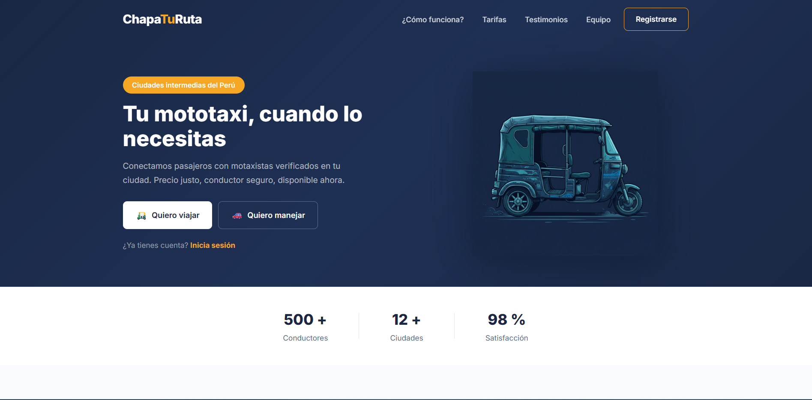
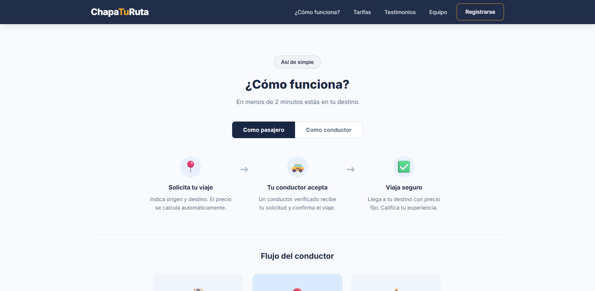
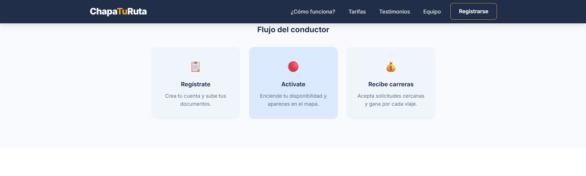
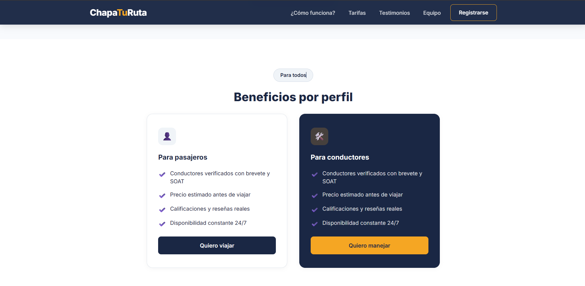
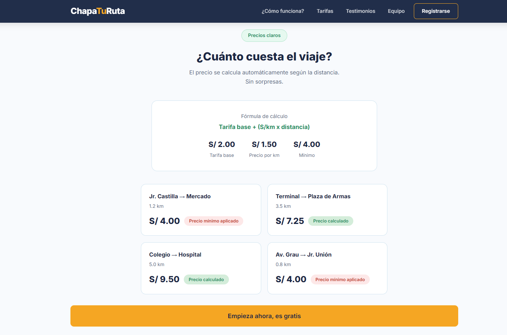
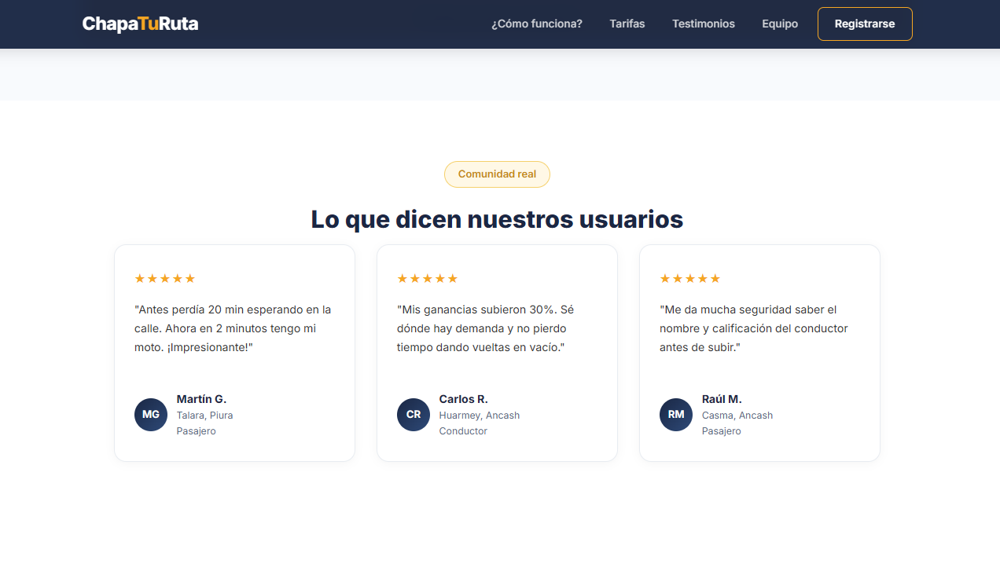
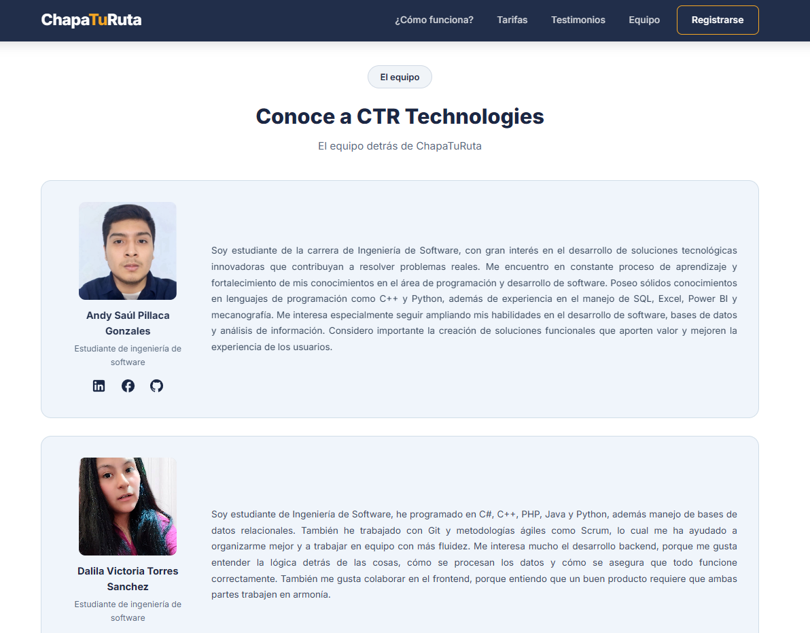
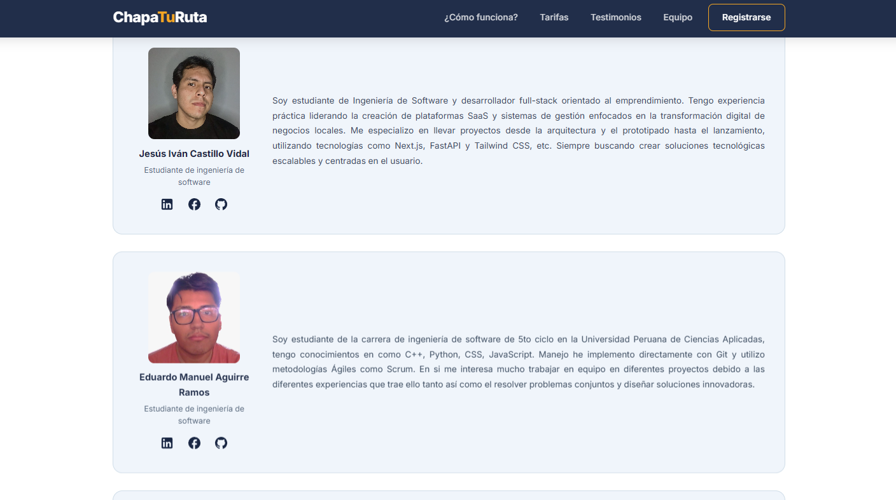
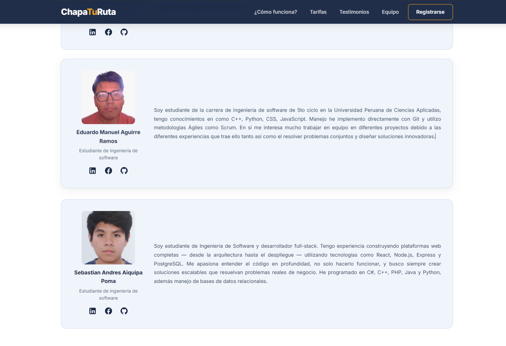


#### 5.2.1.6. Services Documentation Evidence for Sprint Review

Durante este sprint se completó el diseño e implementación de la Landing Page del sistema, el cual forma parte del acceso inicial al sistema. Aunque no se implementaron endpoints tradicionales de tipo REST en este sprint, se documenta a continuación la URL del recurso publicado, junto con evidencia de despliegue, interacción y commits relacionados.

**Descripción del Logro:**
- Implementación de la Landing Page estática.
- Deployment de la Landing Page.

**Recursos del Sprint:**

| Recurso | Acción implementada | Método HTTP | URL / Endpoint | Link de repositorio |
| --- | --- | --- | --- | --- |
| Landing Page | Visualización inicial | GET | [startup-x-upc.github.io/landing-page](https://startup-x-upc.github.io/landing-page/) | [Startup-x-upc/landing-page](https://github.com/Startup-x-upc/landing-page) |

#### 5.2.1.7. Software Deployment Evidence for Sprint Review

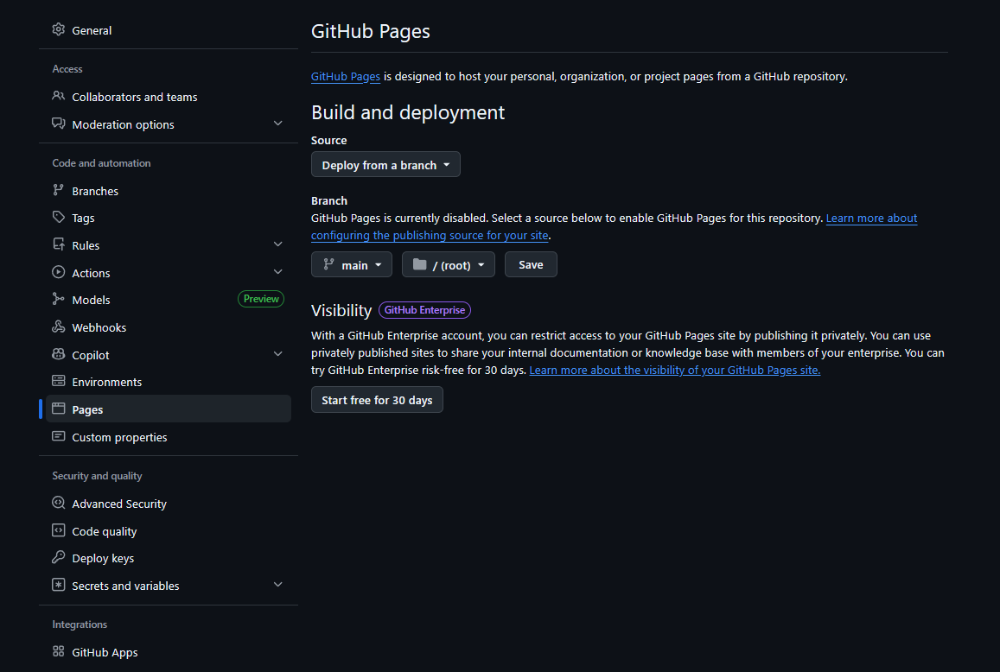
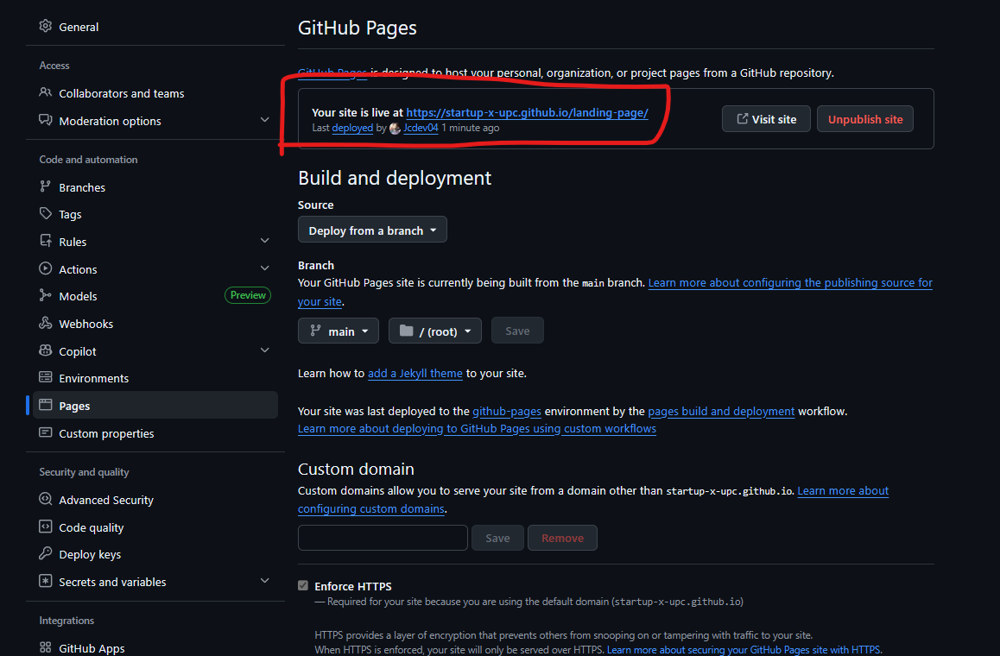

#### 5.2.1.8. Team Collaboration Insights during Sprint

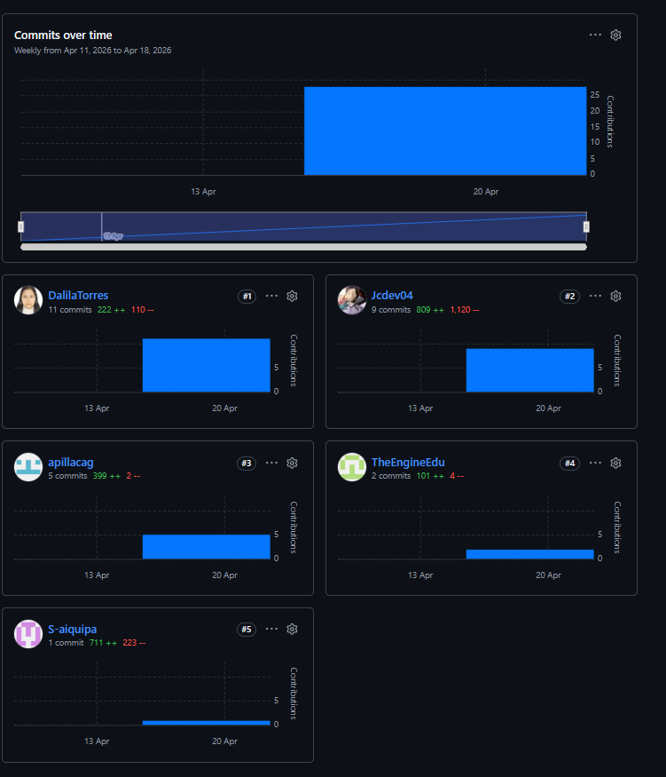