# Capítulo V: Product Implementation, Validation & Deployment

## 5.1. Software Configuration Management

### 5.1.1 Software Development Environment Configuration

<table>
  <thead>
    <tr>
      <th>Actividad</th>
      <th>Herramienta/Guía</th>
      <th>Propósito</th>
      <th>Tipo de acceso/Ruta (links)</th>
    </tr>
  </thead>
  <tbody>
    <tr>
      <td>Gestión de proyecto</td>
      <td>Trello</td>
      <td>Organizar y dar seguimiento a tareas</td>
      <td><a href="https://trello.com" target="_blank">Trello</a></td>
    </tr>
    <tr>
      <td>Gestión de requerimientos</td>
      <td>Gherkin Conventions</td>
      <td>Definir criterios de aceptación claros</td>
      <td><a href="https://cucumber.io/docs/gherkin/" target="_blank">Guía Gherkin</a></td>
    </tr>
    <tr>
      <td>Producto UI/UX</td>
      <td>Figma</td>
      <td>Diseño de interfaces y prototipos</td>
      <td><a href="https://figma.com" target="_blank">Figma</a></td>
    </tr>
    <tr>
      <td>Desarrollo Frontend</td>
      <td>WebStorm</td>
      <td>Desarrollo de la aplicación frontend con Angular</td>
      <td><a href="https://www.jetbrains.com/webstorm/" target="_blank">WebStorm</a></td>
    </tr>
    <tr>
      <td>Landing Page desarrollo</td>
      <td>Visual Studio Code</td>
      <td>Edición y desarrollo de código</td>
      <td><a href="https://code.visualstudio.com/" target="_blank">VS Code</a></td>
    </tr>
    <tr>
      <td>Base de datos</td>
      <td>MySQL</td>
      <td>Gestión y persistencia de datos de la aplicación</td>
      <td><a href="https://www.mysql.com/" target="_blank">MySQL</a></td>
    </tr>
    <tr>
      <td>Control de versiones</td>
      <td>Git</td>
      <td>Gestión de versiones del código</td>
      <td><a href="https://git-scm.com/" target="_blank">Git</a></td>
    </tr>
    <tr>
      <td>Despliegue</td>
      <td>GitHub Pages</td>
      <td>Publicar la aplicación web</td>
      <td><a href="https://pages.github.com/" target="_blank">GitHub Pages</a></td>
    </tr>
    <tr>
      <td>Event Storming</td>
      <td>Miro</td>
      <td>Colaboración y modelado de procesos</td>
      <td><a href="https://miro.com/" target="_blank">Miro</a></td>
    </tr>
    <tr>
      <td>Diagramas</td>
      <td>PlantUML</td>
      <td>Generación de diagramas UML</td>
      <td><a href="https://plantuml.com/" target="_blank">PlantUML</a></td>
    </tr>
  </tbody>
</table>

### 5.1.2 Source Code Management

Para la gestión del código fuente del proyecto, el equipo utiliza la plataforma GitHub como sistema de control de versiones. A continuación, se detallan los repositorios correspondientes a cada componente del sistema:

Landing Page: [Link Landing Page](https://startup-x-upc.github.io/landing-page/)

<!-- Web Services: [Link Web Services](https://github.com/tu-org/backend-services)
Frontend Web Application: [Link Frontend Web](https://github.com/tu-org/frontend-app) -->

En el repositorio de Web Services se incluyen tanto el código fuente como las pruebas unitarias y de aprobación y aceptación.

#### GitFlow Workflow

Nuestro equipo adopta el modelo de ramificación GitFlow, propuesto por Vincent Driessen, para organizar nuestro desarrollo del proyecto.

Las ramas principales son:

**main**: Contiene el código estable listo para producción y establecer como la version final de nuestro informe .
**develop**: Rama principal de desarrollo donde se integran las funcionalidades antes de su liberación.

Ramas de soporte:

- **feature/**: Para el desarrollo de nuevas funcionalidades.
  Convención: `feature/<nombre-descriptivo>`
  Ejemplo: `feature/Chapter5-SourceCode`
- **release/**: Para preparar nuevas versiones del sistema.
  Convención: `release/<versión>`
  Ejemplo: `release/1.0.0`
- **hotfix/**: Para correcciones urgentes en producción.
  Convención: `hotfix/<descripción>`
  Ejemplo: `hotfix/fix-login-error`

Flujo de trabajo:

- Las features se crean desde `develop` y se integran nuevamente en esta rama mediante Pull Requests.
- Las ramas `release` se crean desde `develop` y luego se fusionan en `main` y `develop`.
- Los `hotfix` se crean desde `main` y se integran tanto en `main` como en `develop`.

#### Versionado Semántico

El proyecto utiliza el estándar Semantic Versioning 2.0.0 para el control de versiones:

- **MAJOR**: Cambios incompatibles
- **MINOR**: Nuevas funcionalidades compatibles
- **PATCH**: Correcciones menores

Formato: vX.Y.Z
Ejemplo: v1.2.3

#### Conventional Commits

Se emplea el estándar Conventional Commits para los mensajes de commit, con el fin de mantener un historial claro y facilitar la integración continua.

**Formato**:

`[type]: [description]`

Tipos más utilizados:

- **feat**: Nueva funcionalidad
- **fix**: Corrección de errores
- **chore**: Tareas de mantenimiento
- **docs**: Cambios en documentación

Ejemplos:

- feat: add user authentication
- fix: resolve API timeout issue
- chore: update dependencies

### 5.1.3 Source Code Style Guide & Conventions

#### Landing Page Style Guide & Conventions

##### Project Structure

```
/public        (images, favicon, manifest.json)
/src
    /css         (styles.css + partials/modules)
    /js            (main.js + modules)
    /components    (HTML fragments if needed)
    /index.html
```

##### General Conventions

- All identifiers (variables, functions, classes, files) must be written in **English**.
- File naming uses **kebab-case** (e.g., `user-profile.js`).
- Conventions are based on:
  - Google HTML/CSS Style Guide
  - Google JavaScript Style Guide
- These conventions ensure maintainability, scalability, and team consistency.

###### HTML

- **Semantics first**: use `header`, `nav`, `main`, `section`, `article`, `footer`.
- **Accessibility (a11y)**:
  - Add `alt` text to images.
  - Use `aria-*` attributes for dynamic components.
  - Maintain logical tab order in the DOM.
  - Always show a visible focus state.
- **SEO**:
  - Include `<title>` and `<meta name="description">`.
  - Add Open Graph / Twitter meta tags.
  - Set `lang="en"` (or appropriate language) on `<html>`.
- **Performance**:
  - Use `loading="lazy"` on ``.
  - Minimize inline CSS/JS.
- **Conventions**:
  - Use **kebab-case** for class names.
  - Use `id` only for JS hooks or anchors, not for styling.

###### CSS

- **Naming**: Follow **BEM methodology** → `.block__element--modifier`.
- **Variables**: Define tokens in `:root`:
  ```css
  :root {
    --color-primary: #0ea5e9;
    --color-secondary: #64748b;
    --font-base: 1rem;
  }
  ```
- **Architecture**:
  - Separate utilities (spacing, grid) and components (buttons, cards).
- **Responsive**:
  - Mobile-first approach with `min-width` breakpoints.
  - Common breakpoints: 480px, 768px, 1024px, 1280px.
- **Typography & spacing**:
  - Use `rem` for scalability.
  - Avoid hard-coded magic numbers.
- **States**:
  - Define consistent `:hover`, `:focus-visible`, and `:disabled`.
- **Property order**:
  - Group logically: Layout → Box Model → Typography → Visual → Misc.

###### JavaScript

- **Structure**:
  - Modular design; keep one `main.js` entry point.
  - Use ES Modules (`import/export`) when possible.
  - Split reusable logic into separate modules.
- **Conventions**:
  - Use **camelCase** for variables/functions.
  - Use **PascalCase** for classes/constructors.
  - Constants in `UPPER_CASE`.
- **Best Practices**:
  - Prefer `const` and `let` over `var`.
  - Add comments for non-trivial logic.
  - Keep DOM selectors cached.
  - Use `addEventListener` (avoid inline `onclick`).
  - Wrap code in IIFEs or modules to avoid global leaks.
  - Handle errors using try/catch when necessary.

### 5.1.4 Software Deployment Configuration

#### 1. Landing Page – HTML, CSS y JavaScript

**Repositorio de Código Fuente**
La Landing Page se implementa empleando HTML, CSS y JavaScript. El proyecto se almacena en GitHub, colocando el archivo `index.html` en la raíz del repositorio (/), lo cual permite su reconocimiento automático por GitHub Pages.

**Activación de GitHub Pages**

1. Acceder al repositorio en GitHub.
2. Ir a Settings.
3. Seleccionar Pages.
4. Configurar:
   - Rama: main
   - Carpeta: / (root)
5. Guardar cambios.

**Publicación**
GitHub genera automáticamente una URL pública:

`https://<usuario>.github.io/<repositorio>/`

**Actualizaciones**  
Cada commit en la rama `main` se despliega automáticamente.

---

#### 2. Frontend Web Application – Angular

**Production Build**
El frontend se construye usando Angular CLI:

`ng build --configuration production`

Esto genera archivos optimizados en la carpeta `/dist`.

**Despliegue**

- Se utiliza una plataforma como **Netlify** o **Vercel**.
- Se sube la carpeta /dist.
- Se configura soporte para SPA (Single Page Application).

---

#### 3. Backend – REST API (Spring Boot)

**Build Process**  
El backend se empaqueta en un archivo .jar:

`./mvnw clean package`

**Deployment Process**

- Se utiliza una plataforma cloud (Render, Railway, etc.).
- Se ejecuta con:

`java -jar app.jar`

- Se configuran variables de entorno (puerto, base de datos, API keys).

---

#### 4. Consideraciones Generales

- Se utilizan variables de entorno para datos sensibles.
- Cada componente se despliega de forma independiente.
- El sistema permite actualizaciones continuas mediante commits.

## 5.2. Landing Page, Services & Applications Implementation

### 5.2.1. Sprint 1

#### 5.2.1.1. Sprint Planning 1

<table>
  <tbody>
    <tr>
      <td><b>Sprint #</b></td>
      <td>Sprint 1</td>
    </tr>
    <tr>
      <td colspan="2"><b>Sprint Planning Background</b></td>
    </tr>
    <tr>
      <td><b>Date</b></td>
      <td>2026-06-04</td>
    </tr>
    <tr>
      <td><b>Time</b></td>
      <td>18:50 PM (GMT-5)</td>
    </tr>
    <tr>
      <td><b>Location</b></td>
      <td>Modalidad remota mediante la plataforma Discord</td>
    </tr>
    <tr>
      <td><b>Prepared By</b></td>
      <td>Aguirre Ramos, Eduardo Manuel</td>
    </tr>
    <tr>
      <td><b>Attendees (to planning meeting)</b></td>
      <td>Castillo Vidal, Jesus Ivan / Torres Sanchez, Dalila Victoria / Aguirre Ramos, Eduardo Manuel / Pillaca Gonzales, Andy Saúl / Delgado Perez, James Caleb / Aiquipa Poma, Sebastian Andres</td>
    </tr>
    <tr>
      <td><b>Sprint 0 Review Summary</b></td>
      <td>Dado que este es el sprint inicial, no se presenta un resumen del sprint anterior.</td>
    </tr>
    <tr>
      <td><b>Sprint 0 Retrospective Summary</b></td>
      <td>Dado que este es el sprint inicial, no se presenta una retroalimentación del sprint anterior.</td>
    </tr>
    <tr>
      <td colspan="2"><b>Sprint Goal & User Stories</b></td>
    </tr>
    <tr>
      <td><b>Sprint 1 Goal</b></td>
      <td><b>Nuestro propósito es</b> diseñar y entregar una primera versión de la landing page para nuestra plataforma de gestión de rutas, basada en entrevistas con administradores y transportistas de una empresa distribuidora. <b>Creemos que esto aportará</b> claridad y valor inicial a los usuarios potenciales, comunicando el propósito del producto y la visión del equipo. <b>Esto se confirmará cuando</b> los visitantes puedan comprender fácilmente los beneficios de la plataforma y muestren interés en conocer más o contactarnos a través de la landing page.</td>
    </tr>
    <tr>
      <td><b>Sprint 1 Velocity</b></td>
      <td>15 puntos</td>
    </tr>
    <tr>
      <td><b>Sum of Story Points</b></td>
      <td>15 puntos</td>
    </tr>
  </tbody>
</table>

#### 5.2.1.2. Aspect Leaders and Collaborators

En esta sección se presenta la **Leadership-and-Collaboration Matrix (LACX)** correspondiente al Sprint 1. Cada aspecto se relaciona con tareas clave del sprint, asignando un **líder (L)** responsable principal y **colaboradores (C)** que apoyan en su ejecución.

<table>
  <tbody>
    <tr>
      <th>Team Member (Last Name, First Name)</th>
      <th>GitHub Username</th>
      <th>Mockup (L/C)</th>
      <th>Entrevistas (L/C)</th>
      <th>Wireframes (L/C)</th>
      <th>Landing Page (L/C)</th>
    </tr>
    <tr>
      <td>Castillo Vidal, Jesus Ivan</td>
      <td>Jcdev04</td>
      <td>L</td>
      <td>C</td>
      <td>C</td>
      <td>C</td>
    </tr>
    <tr>
      <td>Torres Sanchez, Dalila Victoria</td>
      <td>DalilaTorres</td>
      <td>C</td>
      <td>L</td>
      <td>C</td>
      <td>C</td>
    </tr>
    <tr>
      <td>Aguirre Ramos, Eduardo Manuel</td>
      <td>TheEngineEdu</td>
      <td>C</td>
      <td>C</td>
      <td>L</td>
      <td>C</td>
    </tr>
    <tr>
      <td>Pillaca Gonzales, Andy Saúl</td>
      <td>apillacag</td>
      <td>C</td>
      <td>C</td>
      <td>C</td>
      <td>L</td>
    </tr>
    <tr>
      <td>Aiquipa Poma, Sebastian Andres</td>
      <td>S-aiquipa</td>
      <td>C</td>
      <td>L</td>
      <td>C</td>
      <td>C</td>
    </tr>
  </tbody>
</table>

#### 5.2.1.3. Sprint Backlog 1


<a href="https://trello.com/b/uGr6OQCE/sprint-1">Sprint 1 Trello</a>

<table>
  <thead>
    <tr>
      <th>Sprint #</th>
      <th colspan="7">Sprint 1</th>
    </tr>
    <tr>
      <th colspan="2">User Story</th>
      <th colspan="6">Work-Item / Task</th>
    </tr>
    <tr>
      <th>Id</th>
      <th>Title</th>
      <th>Id</th>
      <th>Title</th>
      <th>Description</th>
      <th>Estimation (Hours)</th>
      <th>Assigned To</th>
      <th>Status (To-do / In-Process / To-Review / Done)</th>
    </tr>
  </thead>
  <tbody>
    <tr>
      <td>US-31</td>
      <td>Sección Hero con CTA diferenciado</td>
      <td>US31-T001</td>
      <td>Maquetación HTML/CSS Sección Hero</td>
      <td>Implementar la sección Hero utilizando HTML y CSS siguiendo fielmente los mockups de Figma.</td>
      <td>0.7</td>
      <td>Castillo Vidal, Jesus Ivan</td>
      <td>Done</td>
    </tr>
    <tr>
      <td>US-32</td>
      <td>Sección ¿Cómo funciona?</td>
      <td>US32-T001</td>
      <td>Maquetación HTML/CSS Sección ¿Cómo funciona?</td>
      <td>Implementar el flujo del servicio en HTML y CSS basado en los diseños de Figma.</td>
      <td>0.4</td>
      <td>Torres Sanchez, Dalila Victoria</td>
      <td>Done</td>
    </tr>
    <tr>
      <td>US-33</td>
      <td>Sección de beneficios por segmento</td>
      <td>US33-T001</td>
      <td>Maquetación HTML/CSS Beneficios</td>
      <td>Maquetar la sección de beneficios por perfil utilizando HTML y CSS.</td>
      <td>0.9</td>
      <td>Aguirre Ramos, Eduardo Manuel</td>
      <td>Done</td>
    </tr>
    <tr>
      <td>US-34</td>
      <td>Sección de tarifas</td>
      <td>US34-T001</td>
      <td>Maquetación HTML/CSS Tarifas</td>
      <td>Desarrollar la sección informativa de tarifas en HTML y CSS.</td>
      <td>0.3</td>
      <td>Pillaca Gonzales, Andy Saúl</td>
      <td>Done</td>
    </tr>
    <tr>
      <td>US-36</td>
      <td>Sección About the Product</td>
      <td>US36-T001</td>
      <td>Maquetación HTML/CSS About the Product</td>
      <td>Integrar video publicitario y estructurar la sección en HTML/CSS.</td>
      <td>0.5</td>
      <td>Aiquipa Poma, Sebastian Andres</td>
      <td>To-do</td>
    </tr>
    <tr>
      <td>US-37</td>
      <td>Sección About the Team</td>
      <td>US37-T001</td>
      <td>Maquetación HTML/CSS About the Team</td>
      <td>Maquetar la presentación de los miembros del equipo en HTML y CSS según Figma.</td>
      <td>0.5</td>
      <td>Castillo Vidal, Jesus Ivan</td>
      <td>Done</td>
    </tr>
    <tr>
      <td>US-35</td>
      <td>Sección de testimonios</td>
      <td>US35-T001</td>
      <td>Maquetación HTML/CSS Testimonios</td>
      <td>Estructurar la sección de opiniones de usuarios en HTML y CSS.</td>
      <td>0.5</td>
      <td>Torres Sanchez, Dalila Victoria</td>
      <td>Done</td>
    </tr>
    <tr>
      <td>US-38</td>
      <td>Sección CTA final</td>
      <td>US38-T001</td>
      <td>Maquetación HTML/CSS CTA final</td>
      <td>Crear el llamado a la acción al final de la landing page en HTML y CSS.</td>
      <td>0.5</td>
      <td>Aguirre Ramos, Eduardo Manuel</td>
      <td>Done</td>
    </tr>
  </tbody>
</table>

#### 5.2.1.4. Development Evidence for Sprint Review

A continuación, se presenta la tabla de evidencia de desarrollo correspondiente al Sprint 1. Este registro detalla el historial de commits en el repositorio de la Landing Page (`Startup-x-upc/landing-page`). A través de estas contribuciones, se observa el progreso secuencial del desarrollo: desde la configuración inicial y estructuración base en HTML/CSS, pasando por la implementación modular de cada sección (Hero, Beneficios, Testimonios, Sobre el Equipo, Tarifas, etc.), hasta la consolidación de estos cambios en la rama `main`.

| Repository                 | Branch | Commit Id | Commit Message                                                                       | Commit Message Body                                                                                                     | Commited on (Date) |
| -------------------------- | ------ | --------- | ------------------------------------------------------------------------------------ | ----------------------------------------------------------------------------------------------------------------------- | ------------------ |
| Startup-x-upc/landing-page | main   | 6c79239   | Merge pull request #4 from Startup-x-upc/develop                                     | Se integraron los cambios de la rama: Merge pull request #4 from Startup-x-upc/develop                                  | 23/04/2026         |
| Startup-x-upc/landing-page | main   | cbf4003   | refactor: Making adjustment to some code and bad typing                              | Se refactorizó el código: refactor: Making adjustment to some code and bad typing                                       | 23/04/2026         |
| Startup-x-upc/landing-page | main   | cdb9910   | Merge origin/feature/pricing-LandingPage                                             | Se integraron los cambios de la rama: Merge origin/feature/pricing-LandingPage                                          | 23/04/2026         |
| Startup-x-upc/landing-page | main   | c434cb0   | feat:merge dooter                                                                    | Se implementó nueva funcionalidad: feat:merge dooter                                                                    | 23/04/2026         |
| Startup-x-upc/landing-page | main   | 8f4a71e   | add testimonials section css                                                         | Se implementó nueva funcionalidad: add testimonials section css                                                         | 23/04/2026         |
| Startup-x-upc/landing-page | main   | 27adc96   | add third testimonial card                                                           | Se implementó nueva funcionalidad: add third testimonial card                                                           | 23/04/2026         |
| Startup-x-upc/landing-page | main   | a89967b   | add second testimonial card                                                          | Se implementó nueva funcionalidad: add second testimonial card                                                          | 23/04/2026         |
| Startup-x-upc/landing-page | main   | 9f2ec09   | add first testimonial card                                                           | Se implementó nueva funcionalidad: add first testimonial card                                                           | 23/04/2026         |
| Startup-x-upc/landing-page | main   | ae13a3a   | add testimonials section structure                                                   | Se implementó nueva funcionalidad: add testimonials section structure                                                   | 23/04/2026         |
| Startup-x-upc/landing-page | main   | 4e70565   | add header css styles                                                                | Se implementó nueva funcionalidad: add header css styles                                                                | 23/04/2026         |
| Startup-x-upc/landing-page | main   | 83c053a   | add cta buttons and register link in nav                                             | Se implementó nueva funcionalidad: add cta buttons and register link in nav                                             | 23/04/2026         |
| Startup-x-upc/landing-page | main   | f5f59c4   | add navigation links list                                                            | Se implementó nueva funcionalidad: add navigation links list                                                            | 23/04/2026         |
| Startup-x-upc/landing-page | main   | cfce958   | add navigation skeleton with mobile header                                           | Se implementó nueva funcionalidad: add navigation skeleton with mobile header                                           | 23/04/2026         |
| Startup-x-upc/landing-page | main   | 6369b06   | add hamburger menu toggle button                                                     | Se implementó nueva funcionalidad: add hamburger menu toggle button                                                     | 23/04/2026         |
| Startup-x-upc/landing-page | main   | 10294ce   | add header container and logo                                                        | Se implementó nueva funcionalidad: add header container and logo                                                        | 23/04/2026         |
| Startup-x-upc/landing-page | main   | 88da902   | feat:Added footer to Index and Style                                                 | Se implementó nueva funcionalidad: feat:Added footer to Index and Style                                                 | 23/04/2026         |
| Startup-x-upc/landing-page | main   | f6a6bb3   | Merge pull request #3 from Startup-x-upc/feature/about-team-section                  | Se integraron los cambios de la rama: Merge pull request #3 from Startup-x-upc/feature/about-team-section               | 23/04/2026         |
| Startup-x-upc/landing-page | main   | df6d57b   | feat: add images about the team                                                      | Se implementó nueva funcionalidad: feat: add images about the team                                                      | 23/04/2026         |
| Startup-x-upc/landing-page | main   | 7486a72   | feat: About team section CSS added                                                   | Se implementó nueva funcionalidad: feat: About team section CSS added                                                   | 23/04/2026         |
| Startup-x-upc/landing-page | main   | 61a97fc   | feat: About team section HTML added                                                  | Se implementó nueva funcionalidad: feat: About team section HTML added                                                  | 23/04/2026         |
| Startup-x-upc/landing-page | main   | 198216d   | Merge pull request #2 from Startup-x-upc/feature/how-it-works-section                | Se integraron los cambios de la rama: Merge pull request #2 from Startup-x-upc/feature/how-it-works-section             | 23/04/2026         |
| Startup-x-upc/landing-page | main   | 67a4904   | feat: How it works section CSS added                                                 | Se implementó nueva funcionalidad: feat: How it works section CSS added                                                 | 23/04/2026         |
| Startup-x-upc/landing-page | main   | 17f363b   | feat: How it works section HTML added                                                | Se implementó nueva funcionalidad: feat: How it works section HTML added                                                | 23/04/2026         |
| Startup-x-upc/landing-page | main   | 4e2cd95   | feat(landing): add benefits section with passenger and driver cards                  | Se implementó nueva funcionalidad: feat(landing): add benefits section with passenger and driver cards                  | 23/04/2026         |
| Startup-x-upc/landing-page | main   | feeb217   | feat(landing): add benefits section with passenger and driver cards                  | Se implementó nueva funcionalidad: feat(landing): add benefits section with passenger and driver cards                  | 23/04/2026         |
| Startup-x-upc/landing-page | main   | e7f4725   | feat:Added Pricing to index and style                                                | Se implementó nueva funcionalidad: feat:Added Pricing to index and style                                                | 23/04/2026         |
| Startup-x-upc/landing-page | main   | a877a62   | feat: General style guidelines                                                       | Se implementó nueva funcionalidad: feat: General style guidelines                                                       | 23/04/2026         |
| Startup-x-upc/landing-page | main   | 28faa73   | feat: Responsive General style added                                                 | Se implementó nueva funcionalidad: feat: Responsive General style added                                                 | 23/04/2026         |
| Startup-x-upc/landing-page | main   | 3c63786   | feat: CTA section CSS added                                                          | Se implementó nueva funcionalidad: feat: CTA section CSS added                                                          | 23/04/2026         |
| Startup-x-upc/landing-page | main   | ce6f48e   | feat: CTA section HTML added                                                         | Se implementó nueva funcionalidad: feat: CTA section HTML added                                                         | 23/04/2026         |
| Startup-x-upc/landing-page | main   | bd1c6b7   | feat: Hero section CSS added                                                         | Se implementó nueva funcionalidad: feat: Hero section CSS added                                                         | 23/04/2026         |
| Startup-x-upc/landing-page | main   | fea63a5   | feat: Hero section HTML added                                                        | Se implementó nueva funcionalidad: feat: Hero section HTML added                                                        | 23/04/2026         |
| Startup-x-upc/landing-page | main   | 7f4d8ae   | feat: Base html and css structure, planificaton for the whole landing page structure | Se implementó nueva funcionalidad: feat: Base html and css structure, planificaton for the whole landing page structure | 23/04/2026         |
| Startup-x-upc/landing-page | main   | ef29364   | chore: Initial setup                                                                 | Se realizaron cambios relacionados con: chore: Initial setup                                                            | 23/04/2026         |

El análisis de este historial refleja un flujo de trabajo estructurado y colaborativo. Se destaca la adopción de buenas prácticas, como el uso de ramas para nuevas características (features), la integración mediante Pull Requests y el uso de convenciones en los mensajes de commit (feat, chore, refactor). Esto ha permitido una integración continua eficiente, garantizando que el entregable de la Landing Page cumpla con los objetivos y el alcance definidos en el Sprint Planning 1.

#### 5.2.1.5. Execution Evidence for Sprint Review


#### 5.2.1.6. Services Documentation Evidence for Sprint Review

Durante este sprint se completó el diseño e implementación de la Landing Page del sistema, el cual forma parte del acceso inicial al sistema. Aunque no se implementaron endpoints tradicionales de tipo REST en este sprint, se documenta a continuación la URL del recurso publicado, junto con evidencia de despliegue, interacción y commits relacionados.

**Descripción del Logro:**

- Implementación de la Landing Page estática.
- Deployment de la Landing Page.

**Recursos del Sprint:**

| Recurso      | Acción implementada   | Método HTTP | URL / Endpoint                                                                        | Link de repositorio                                                         |
| ------------ | --------------------- | ----------- | ------------------------------------------------------------------------------------- | --------------------------------------------------------------------------- |
| Landing Page | Visualización inicial | GET         | [startup-x-upc.github.io/landing-page](https://startup-x-upc.github.io/landing-page/) | [Startup-x-upc/landing-page](https://github.com/Startup-x-upc/landing-page) |

#### 5.2.1.7. Software Deployment Evidence for Sprint Review


#### 5.2.1.8. Team Collaboration Insights during Sprint


### 5.2.2. Sprint 2

#### 5.2.2.1. Sprint Planning 2

<table>
  <tbody>
    <tr>
      <td><b>Sprint #</b></td>
      <td>Sprint 2</td>
    </tr>
    <tr>
      <td colspan="2"><b>Sprint Planning Background</b></td>
    </tr>
    <tr>
      <td><b>Date</b></td>
      <td>2026-05-11</td>
    </tr>
    <tr>
      <td><b>Time</b></td>
      <td>18:50 PM (GMT-5)</td>
    </tr>
    <tr>
      <td><b>Location</b></td>
      <td>Modalidad remota mediante la plataforma Discord</td>
    </tr>
    <tr>
      <td><b>Prepared By</b></td>
      <td>Aguirre Ramos, Eduardo Manuel</td>
    </tr>
    <tr>
      <td><b>Attendees (to planning meeting)</b></td>
      <td>Castillo Vidal, Jesus Ivan / Torres Sanchez, Dalila Victoria / Aguirre Ramos, Eduardo Manuel / Pillaca Gonzales, Andy Saúl / Delgado Perez, James Caleb / Aiquipa Poma, Sebastian Andres</td>
    </tr>
    <tr>
      <td><b>Sprint 1 Review Summary</b></td>
      <td>Durante el Sprint 1 se logró implementar casi en su totalidad la Landing Page del sistema ChapaTuRuta, desarrollando secciones principales como el header, hero section, features además de las reviews, el pricing y por último el footer, así como la integración inicial de estilos globales y tipografía mencionadas en el reporte.Quedó como mejora la adición del idioma ingles para la accesibilidad de las persona. El equipo cumplió con sus tareas establecidos, respetando el diseño de mockups y la guía de estilos. Se pudo identificaron oportunidades para mejorar en el siguiente sprint velocidad de desarrollo y la gestión de tiempos.</td>
    </tr>
    <tr>
      <td><b>Sprint 1 Retrospective Summary</b></td>
      <td>Durante el Sprint 1, el equipo logró avanzar de forma efectiva en el desarrollo de la landing page. Cada integrante cumplió con las secciones asignadas, lo que permitió avanzar según lo planificado. Como mejora para el siguiente sprint, se debería implementar un control de las task que hacemos normalmente con deadlines, para asi controlar el manejo de la puntualidad asi como la coordinación al momento de expresar dificultades asignadas.</td>
    </tr>
    <tr>
      <td colspan="2"><b>Sprint Goal & User Stories</b></td>
    </tr>
    <tr>
      <td><b>Sprint 2 Goal</b></td>
      <td><b>Nuestro propósito es</b> diseñar y entregar una primera versión del frontend pages para nuestra plataforma de gestión de rutas, implementando datos generados por nosotros haciendo que funcione comodamente. <b>Creemos que esto aportará</b> una mejor comprensión del alcance y la funcionalidad de lo que nuestro software puede llegar a ser . <b>Esto se confirmará cuando</b> los visitantes puedan comprender como son las funcionalidades de nuestra plataforma y coomo se manejara sus servicios a traves de nuestro frontend page.</td>
    </tr>
    <tr>
      <td><b>Sprint 2 Velocity</b></td>
      <td>34 puntos</td>
    </tr>
    <tr>
      <td><b>Sum of Story Points</b></td>
      <td>34 puntos</td>
    </tr>
  </tbody>
</table>

#### 5.2.2.2. Aspect Leaders and Collaborators

En esta sección se presenta la **Leadership-and-Collaboration Matrix (LACX)** correspondiente al Sprint 2. Cada aspecto se relaciona con tareas clave del sprint, asignando un **líder (L)** responsable principal y **colaboradores (C)** que apoyan en su ejecución.

<table>
  <tbody>
    <tr>
      <th>Team Member (Last Name, First Name)</th>
      <th>GitHub Username</th>
      <th> Real-Time & Geolocation Aspect (L/C)</th>
      <th> Transaction & Payment Aspect (L/C)</th>
      <th> Service Status & State Aspect (L/C)</th>
      <th> Route Logic & Map Aspect (L/C)</th>
      <th> User Experience & Flow Aspect (L/C)</th>
    </tr>
    <tr>
      <td>Castillo Vidal, Jesus Ivan</td>
      <td>Jcdev04</td>
      <td>L</td>
      <td>C</td>
      <td>C</td>
      <td>C</td>
      <td>L</td>
    </tr>
    <tr>
      <td>Torres Sanchez, Dalila Victoria</td>
      <td>DalilaTorres</td>
      <td>C</td>
      <td>C</td>
      <td>C</td>
      <td>C</td>
      <td>L</td>
    </tr>
    <tr>
      <td>Aguirre Ramos, Eduardo Manuel</td>
      <td>TheEngineEdu</td>
      <td>C</td>
      <td>C</td>
      <td>L</td>
      <td>C</td>
      <td>C</td>
    </tr>
    <tr>
      <td>Pillaca Gonzales, Andy Saúl</td>
      <td>apillacag</td>
      <td>C</td>
      <td>C</td>
      <td>C</td>
      <td>L</td>
      <td>C</td>
    </tr>
    <tr>
      <td>Aiquipa Poma, Sebastian Andres</td>
      <td>S-aiquipa</td>
      <td>C</td>
      <td>L</td>
      <td>C</td>
      <td>C</td>
      <td>L</td>
    </tr>
  </tbody>
</table>

#### 5.2.2.3. Sprint Backlog 2

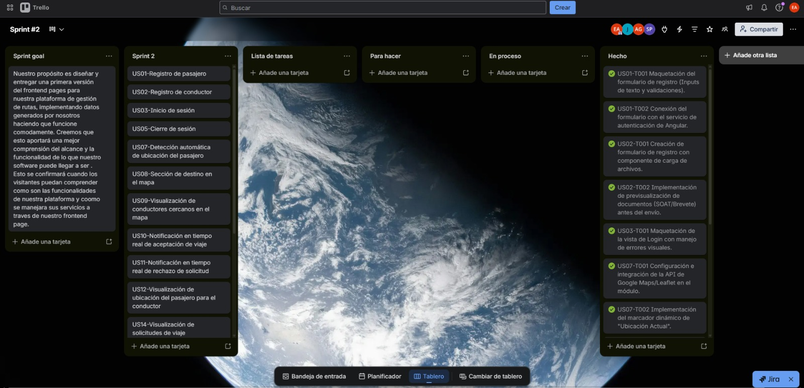

<a href="https://trello.com/invite/b/6a0279a4004abd9ca6e2f408/ATTI27127fd4bb859b71b8af6f3fe99f12fe562430EC/sprint-2">Sprint 2 Trello</a>

# Sprint 2 User Stories & Tasks Table

<table>
  <thead>
    <tr>
      <th>Sprint #</th>
      <th colspan="7">Sprint 2</th>
    </tr>
    <tr>
      <th colspan="2">User Story</th>
      <th colspan="6">Work-Item / Task</th>
    </tr>
    <tr>
      <th>Id</th>
      <th>Title</th>
      <th>Id</th>
      <th>Title</th>
      <th>Description</th>
      <th>Estimation (Hours)</th>
      <th>Assigned To</th>
      <th>Status (To-do / In-Process / To-Review / Done)</th>
    </tr>
  </thead>
  <tbody>
    <!-- US-03 -->
    <tr>
      <td rowspan="8">US-01</td>
      <td rowspan="8">Registro de pasajero</td>
      <td>TASK-US01-01</td>
      <td>Crear colección users en db.json</td>
      <td>Crear/validar colección `users` en `db.json` con cuentas seed por rol.</td>
      <td>0.5</td>
      <td>Castillo Vidal, Jesus Ivan</td>
      <td>Done</td>
    </tr>
    <tr>
      <td>TASK-US03-02</td>
      <td>Crear colección profiles en db.json</td>
      <td>Crear/validar colección `profiles` en `db.json` solo para lectura básica del usuario autenticado si la UI lo necesita.</td>
      <td>0.4</td>
      <td>Aguirre Ramos, Eduardo Manuel</td>
      <td>Done</td>
    </tr>
    <tr>
      <td>TASK-US03-03</td>
      <td>Implementar IamApiService para Login</td>
      <td>Implementar o validar `IamApiService` para `GET /users?email={email}&amp;password={password}`.</td>
      <td>0.6</td>
      <td>Castillo Vidal, Jesus Ivan</td>
      <td>Done</td>
    </tr>
    <tr>
      <td>TASK-US03-04</td>
      <td>Implementar IamApiService para Perfil</td>
      <td>Implementar o validar `IamApiService` para `GET /profiles?accountId={accountId}` solo para datos mínimos de sesión.</td>
      <td>0.5</td>
      <td>Pillaca Gonzales, Andy Saúl</td>
      <td>Done</td>
    </tr>
    <tr>
      <td>TASK-US03-05</td>
      <td>Ajustar iam.store.ts</td>
      <td>Implementar o ajustar `iam.store.ts` para autenticar usuario, guardar sesión mock y exponer rol actual.</td>
      <td>0.8</td>
      <td>Castillo Vidal, Jesus Ivan</td>
      <td>Done</td>
    </tr>
    <tr>
      <td>TASK-US03-06</td>
      <td>Configurar redirección post-login</td>
      <td>Ajustar redirección del pasajero a la nueva home transaccional (`/passenger/request-ride`).</td>
      <td>0.4</td>
      <td>Aiquipa Poma, Sebastian Andres</td>
      <td>Done</td>
    </tr>
    <tr>
      <td>TASK-US03-07</td>
      <td>Configurar mensajes de error en login</td>
      <td>Ajustar mensaje de error genérico para credenciales inválidas.</td>
      <td>0.3</td>
      <td>Castillo Vidal, Jesus Ivan</td>
      <td>Done</td>
    </tr>
    <tr>
      <td>TASK-US03-08</td>
      <td>Pruebas de integración Login</td>
      <td>Probar flujo completo de login con json-server.</td>
      <td>0.6</td>
      <td>Aguirre Ramos, Eduardo Manuel</td>
      <td>Done</td>
    </tr>
    <tr>
      <td rowspan="3">US-06</td>
      <td rowspan="3">Verificación de documentos del conductor</td>
      <td>TASK-US06-01</td>
      <td>Campos verificationStatus json</td>
      <td>Mantener en `db.json` los campos `verificationStatus` y `operationalStatus`.</td>
      <td>0.3</td>
      <td>Castillo Vidal, Jesus Ivan</td>
      <td>Done</td>
    </tr>
    <tr>
      <td>TASK-US06-02</td>
      <td>Soporte de datos para demo</td>
      <td>Usar estos estados solo como soporte de datos para la demo.</td>
      <td>0.4</td>
      <td>Aguirre Ramos, Eduardo Manuel</td>
      <td>Done</td>
    </tr>
    <tr>
      <td>TASK-US06-03</td>
      <td>Validar conductor de prueba</td>
      <td>Asegurar que el conductor de prueba esté en estado válido para operar.</td>
      <td>0.3</td>
      <td>Castillo Vidal, Jesus Ivan</td>
      <td>Done</td>
    </tr>
    <tr>
      <td rowspan="5">US-07</td>
      <td rowspan="5">Detección automática de ubicación del pasajero</td>
      <td>TASK-US07-01</td>
      <td>Integrar geolocalización</td>
      <td>Implementar integración con geolocalización del navegador.</td>
      <td>0.7</td>
      <td>Castillo Vidal, Jesus Ivan</td>
      <td>Done</td>
    </tr>
    <tr>
      <td>TASK-US07-02</td>
      <td>Lógica de fallback manual</td>
      <td>Crear lógica de fallback manual en caso de denegación de permisos.</td>
      <td>0.5</td>
      <td>Pillaca Gonzales, Andy Saúl</td>
      <td>Done</td>
    </tr>
    <tr>
      <td>TASK-US07-03</td>
      <td>Conectar origen al store</td>
      <td>Conectar el origen detectado al store de `ride-dispatch`.</td>
      <td>0.4</td>
      <td>Castillo Vidal, Jesus Ivan</td>
      <td>Done</td>
    </tr>
    <tr>
      <td>TASK-US07-04</td>
      <td>Visualizar origen en UI</td>
      <td>Mostrar el origen en la UI con texto legible y no solo coordenadas crudas.</td>
      <td>0.5</td>
      <td>Aiquipa Poma, Sebastian Andres</td>
      <td>Done</td>
    </tr>
    <tr>
      <td>TASK-US07-05</td>
      <td>Reflejar origen en Leaflet</td>
      <td>Reflejar el origen también en el mapa Leaflet.</td>
      <td>0.6</td>
      <td>Castillo Vidal, Jesus Ivan</td>
      <td>Done</td>
    </tr>
    <tr>
      <td rowspan="5">US-08</td>
      <td rowspan="5">Selección de destino</td>
      <td>TASK-US08-01</td>
      <td>Selector de destino UI</td>
      <td>Implementar selector de destino en la UI.</td>
      <td>0.8</td>
      <td>Castillo Vidal, Jesus Ivan</td>
      <td>Done</td>
    </tr>
    <tr>
      <td>TASK-US08-02</td>
      <td>Conectar destino al store</td>
      <td>Conectar el destino al store de `ride-dispatch`.</td>
      <td>0.4</td>
      <td>Aguirre Ramos, Eduardo Manuel</td>
      <td>Done</td>
    </tr>
    <tr>
      <td>TASK-US08-03</td>
      <td>Reflejar destino en mapa</td>
      <td>Reflejar el destino en el mapa.</td>
      <td>0.6</td>
      <td>Castillo Vidal, Jesus Ivan</td>
      <td>Done</td>
    </tr>
    <tr>
      <td>TASK-US08-04</td>
      <td>Validar flujo origen-destino</td>
      <td>Validar el flujo origen + destino antes de habilitar el siguiente paso.</td>
      <td>0.5</td>
      <td>Pillaca Gonzales, Andy Saúl</td>
      <td>Done</td>
    </tr>
    <tr>
      <td>TASK-US08-05</td>
      <td>Integrar destino con tarifas</td>
      <td>Integrar la selección de destino con el cálculo tarifario.</td>
      <td>0.7</td>
      <td>Aiquipa Poma, Sebastian Andres</td>
      <td>Done</td>
    </tr>
    <tr>
      <td rowspan="4">US-09</td>
      <td rowspan="4">Visualización de conductores cercanos</td>
      <td>TASK-US09-01</td>
      <td>Mostrar conductores en mapa</td>
      <td>Mostrar conductores disponibles de forma simple en el mapa.</td>
      <td>0.6</td>
      <td>Castillo Vidal, Jesus Ivan</td>
      <td>Done</td>
    </tr>
    <tr>
      <td>TASK-US09-02</td>
      <td>Simplificar visualización</td>
      <td>Evitar tabla comparativa estilo marketplace.</td>
      <td>0.3</td>
      <td>Aguirre Ramos, Eduardo Manuel</td>
      <td>Done</td>
    </tr>
    <tr>
      <td>TASK-US09-03</td>
      <td>Mensaje conductores en zona</td>
      <td>Mostrar mensaje resumido tipo “Conductores disponibles en la zona”.</td>
      <td>0.4</td>
      <td>Pillaca Gonzales, Andy Saúl</td>
      <td>Done</td>
    </tr>
    <tr>
      <td>TASK-US09-04</td>
      <td>Estado vacío conductores</td>
      <td>Preparar estado vacío cuando no haya conductores disponibles.</td>
      <td>0.5</td>
      <td>Castillo Vidal, Jesus Ivan</td>
      <td>Done</td>
    </tr>
    <tr>
      <td rowspan="3">US-10</td>
      <td rowspan="3">Actualización manual del estado de aceptación</td>
      <td>TASK-US10-01</td>
      <td>Botón de refresh manual</td>
      <td>Implementar botón o acción de refresh manual en la pantalla del pasajero.</td>
      <td>0.5</td>
      <td>Aiquipa Poma, Sebastian Andres</td>
      <td>Done</td>
    </tr>
    <tr>
      <td>TASK-US10-02</td>
      <td>Consultar estado actualizado</td>
      <td>Consultar el estado actualizado de `rideRequests` / `rides`.</td>
      <td>0.6</td>
      <td>Castillo Vidal, Jesus Ivan</td>
      <td>Done</td>
    </tr>
    <tr>
      <td>TASK-US10-03</td>
      <td>Transición visual DRIVER_ASSIGNED</td>
      <td>Mostrar transición visual hacia estado `DRIVER_ASSIGNED` cuando corresponda.</td>
      <td>0.4</td>
      <td>Aguirre Ramos, Eduardo Manuel</td>
      <td>Done</td>
    </tr>
    <tr>
      <td rowspan="3">US-11</td>
      <td rowspan="3">Actualización manual del estado de rechazo o espera</td>
      <td>TASK-US11-01</td>
      <td>Definir estados visuales</td>
      <td>Definir estados visuales: `SEARCHING_DRIVER`, `NO_DRIVERS`, `ERROR`.</td>
      <td>0.4</td>
      <td>Pillaca Gonzales, Andy Saúl</td>
      <td>Done</td>
    </tr>
    <tr>
      <td>TASK-US11-02</td>
      <td>Refrescar estado solicitud</td>
      <td>Refrescar manualmente el estado de la solicitud.</td>
      <td>0.5</td>
      <td>Castillo Vidal, Jesus Ivan</td>
      <td>Done</td>
    </tr>
    <tr>
      <td>TASK-US11-03</td>
      <td>Validar consistencia de mensajes</td>
      <td>Mostrar mensajes consistentes sin contradicciones.</td>
      <td>0.3</td>
      <td>Aiquipa Poma, Sebastian Andres</td>
      <td>Done</td>
    </tr>
    <tr>
      <td rowspan="5">US-13</td>
      <td rowspan="5">Activar y desactivar disponibilidad del conductor</td>
      <td>TASK-US13-01</td>
      <td>Validar driverAvailability json</td>
      <td>Crear o validar `driverAvailability` en `db.json`.</td>
      <td>0.3</td>
      <td>Castillo Vidal, Jesus Ivan</td>
      <td>Done</td>
    </tr>
    <tr>
      <td>TASK-US13-02</td>
      <td>Toggle disponibilidad UI</td>
      <td>Implementar toggle de disponibilidad en la UI del conductor.</td>
      <td>0.7</td>
      <td>Aguirre Ramos, Eduardo Manuel</td>
      <td>Done</td>
    </tr>
    <tr>
      <td>TASK-US13-03</td>
      <td>Conectar toggle al store</td>
      <td>Conectar el toggle con `ride-dispatch.store.ts`.</td>
      <td>0.6</td>
      <td>Pillaca Gonzales, Andy Saúl</td>
      <td>Done</td>
    </tr>
    <tr>
      <td>TASK-US13-04</td>
      <td>Validar saldo previo</td>
      <td>Validar el saldo desde `monetization.store.ts` antes de activar.</td>
      <td>0.5</td>
      <td>Aiquipa Poma, Sebastian Andres</td>
      <td>Done</td>
    </tr>
    <tr>
      <td>TASK-US13-05</td>
      <td>Reflejar estado conectado UI</td>
      <td>Reflejar visualmente si el conductor está conectado o desconectado.</td>
      <td>0.4</td>
      <td>Castillo Vidal, Jesus Ivan</td>
      <td>Done</td>
    </tr>
    <tr>
      <td rowspan="4">US-14</td>
      <td rowspan="4">Visualización de solicitudes para conductor</td>
      <td>TASK-US14-01</td>
      <td>Consumir rideRequests pending</td>
      <td>Consumir `GET /rideRequests?status=PENDING`.</td>
      <td>0.4</td>
      <td>Aguirre Ramos, Eduardo Manuel</td>
      <td>Done</td>
    </tr>
    <tr>
      <td>TASK-US14-02</td>
      <td>Lista de solicitudes UI</td>
      <td>Crear lista/tarjetas de solicitudes para el conductor.</td>
      <td>0.8</td>
      <td>Pillaca Gonzales, Andy Saúl</td>
      <td>Done</td>
    </tr>
    <tr>
      <td>TASK-US14-03</td>
      <td>Mostrar datos de viaje</td>
      <td>Mostrar origen, destino y tarifa estimada.</td>
      <td>0.5</td>
      <td>Aiquipa Poma, Sebastian Andres</td>
      <td>Done</td>
    </tr>
    <tr>
      <td>TASK-US14-04</td>
      <td>Acciones aceptar/rechazar</td>
      <td>Preparar acciones de aceptar/rechazar.</td>
      <td>0.6</td>
      <td>Castillo Vidal, Jesus Ivan</td>
      <td>Done</td>
    </tr>
    <tr>
      <td rowspan="5">US-15</td>
      <td rowspan="5">Solicitud de viaje por parte del pasajero</td>
      <td>TASK-US15-01</td>
      <td>Crear home transaccional</td>
      <td>Crear flujo principal de home transaccional del pasajero.</td>
      <td>0.9</td>
      <td>Castillo Vidal, Jesus Ivan</td>
      <td>Done</td>
    </tr>
    <tr>
      <td>TASK-US15-02</td>
      <td>Integrar flujo de datos</td>
      <td>Integrar origen, destino y tarifa estimada en un solo flujo.</td>
      <td>0.7</td>
      <td>Aguirre Ramos, Eduardo Manuel</td>
      <td>Done</td>
    </tr>
    <tr>
      <td>TASK-US15-03</td>
      <td>Implementar CTA confirmar</td>
      <td>Implementar CTA principal: `Confirmar solicitud`.</td>
      <td>0.5</td>
      <td>Castillo Vidal, Jesus Ivan</td>
      <td>Done</td>
    </tr>
    <tr>
      <td>TASK-US15-04</td>
      <td>Registrar POST rideRequests</td>
      <td>Crear request en fake API (`POST /rideRequests`).</td>
      <td>0.6</td>
      <td>Pillaca Gonzales, Andy Saúl</td>
      <td>Done</td>
    </tr>
    <tr>
      <td>TASK-US15-05</td>
      <td>Transición visual SEARCHING</td>
      <td>Mostrar transición visual a estado `SEARCHING_DRIVER`.</td>
      <td>0.4</td>
      <td>Aiquipa Poma, Sebastian Andres</td>
      <td>Done</td>
    </tr>
    <tr>
      <td rowspan="4">US-16</td>
      <td rowspan="4">Postulación de conductor y selección (inDrive flow)</td>
      <td>TASK-US16-01</td>
      <td>Colección rideCandidates json</td>
      <td>Implementar colección `rideCandidates` en `db.json`.</td>
      <td>0.4</td>
      <td>Castillo Vidal, Jesus Ivan</td>
      <td>Done</td>
    </tr>
    <tr>
      <td>TASK-US16-02</td>
      <td>Lista de candidatos UI</td>
      <td>Diseñar pantalla de selección de candidatos en la UI del pasajero (`app-ride-candidates-list`).</td>
      <td>0.8</td>
      <td>Aguirre Ramos, Eduardo Manuel</td>
      <td>Done</td>
    </tr>
    <tr>
      <td>TASK-US16-03</td>
      <td>Acción de postulación UI</td>
      <td>Crear acción de postulación para el conductor en el dashboard.</td>
      <td>0.6</td>
      <td>Pillaca Gonzales, Andy Saúl</td>
      <td>Done</td>
    </tr>
    <tr>
      <td>TASK-US16-04</td>
      <td>Flujo transaccional selección</td>
      <td>Implementar flujo transaccional de selección: confirmación de solicitud + aceptación de candidato + rechazo de competidores + creación de viaje.</td>
      <td>0.9</td>
      <td>Castillo Vidal, Jesus Ivan</td>
      <td>Done</td>
    </tr>
    <tr>
      <td rowspan="3">US-17</td>
      <td rowspan="3">Progresión y finalización del viaje</td>
      <td>TASK-US17-01</td>
      <td>Navegación a Google Maps</td>
      <td>Implementar botones de navegación a Google Maps para el conductor.</td>
      <td>0.6</td>
      <td>Castillo Vidal, Jesus Ivan</td>
      <td>Done</td>
    </tr>
    <tr>
      <td>TASK-US17-02</td>
      <td>Control de estados de viaje</td>
      <td>Controlar los estados intermedios del viaje: `DRIVER_ON_THE_WAY`, `DRIVER_ARRIVED`, `STARTED`, `COMPLETED`.</td>
      <td>0.7</td>
      <td>Aiquipa Poma, Sebastian Andres</td>
      <td>Done</td>
    </tr>
    <tr>
      <td>TASK-US17-03</td>
      <td>Liberación del conductor</td>
      <td>Asegurar la liberación del conductor (`isBusy = false`) tras la finalización.</td>
      <td>0.4</td>
      <td>Castillo Vidal, Jesus Ivan</td>
      <td>Done</td>
    </tr>
    <tr>
      <td rowspan="5">US-19</td>
      <td rowspan="5">Cálculo de tarifa por distancia</td>
      <td>TASK-US19-01</td>
      <td>Consumir fareConfig</td>
      <td>Consumir `GET /fareConfig`.</td>
      <td>0.3</td>
      <td>Aguirre Ramos, Eduardo Manuel</td>
      <td>Done</td>
    </tr>
    <tr>
      <td>TASK-US19-02</td>
      <td>Cálculo tarifa en store</td>
      <td>Implementar cálculo de tarifa en `monetization.store.ts`.</td>
      <td>0.7</td>
      <td>Pillaca Gonzales, Andy Saúl</td>
      <td>Done</td>
    </tr>
    <tr>
      <td>TASK-US19-03</td>
      <td>Mostrar tarifa en panel</td>
      <td>Mostrar la tarifa estimada en el panel derecho o resumen del viaje.</td>
      <td>0.5</td>
      <td>Aiquipa Poma, Sebastian Andres</td>
      <td>Done</td>
    </tr>
    <tr>
      <td>TASK-US19-04</td>
      <td>Recalcular con cambios origen-destino</td>
      <td>Integrar el cálculo con los cambios de origen/destino.</td>
      <td>0.6</td>
      <td>Castillo Vidal, Jesus Ivan</td>
      <td>Done</td>
    </tr>
    <tr>
      <td>TASK-US19-05</td>
      <td>Mostrar distancia en UI</td>
      <td>Mostrar también distancia estimada en la UI.</td>
      <td>0.4</td>
      <td>Castillo Vidal, Jesus Ivan</td>
      <td>Done</td>
    </tr>
    <tr>
      <td rowspan="3">US-23</td>
      <td rowspan="3">Visualización del puntaje de reputación</td>
      <td>TASK-US23-01</td>
      <td>Campos ratingAverage drivers</td>
      <td>Mantener `ratingAverage` y `ratingCount` en `drivers`.</td>
      <td>0.4</td>
      <td>Pillaca Gonzales, Andy Saúl</td>
      <td>Done</td>
    </tr>
    <tr>
      <td>TASK-US23-02</td>
      <td>Mostrar contexto reputación visual</td>
      <td>Mostrar reputación solo si aporta contexto visual mínimo.</td>
      <td>0.3</td>
      <td>Aiquipa Poma, Sebastian Andres</td>
      <td>Done</td>
    </tr>
    <tr>
      <td>TASK-US23-03</td>
      <td>Evitar flujo interactivo reputación</td>
      <td>No implementar flujo de calificación en este sprint.</td>
      <td>0.3</td>
      <td>Castillo Vidal, Jesus Ivan</td>
      <td>Done</td>
    </tr>
    <tr>
      <td rowspan="4">US-28</td>
      <td rowspan="4">Visualización del saldo del wallet</td>
      <td>TASK-US28-01</td>
      <td>Consumir saldo wallet</td>
      <td>Consumir `GET /wallets?driverId={driverId}`.</td>
      <td>0.4</td>
      <td>Castillo Vidal, Jesus Ivan</td>
      <td>Done</td>
    </tr>
    <tr>
      <td>TASK-US28-02</td>
      <td>Mostrar saldo en vista</td>
      <td>Mostrar saldo en la vista del conductor.</td>
      <td>0.5</td>
      <td>Aguirre Ramos, Eduardo Manuel</td>
      <td>Done</td>
    </tr>
    <tr>
      <td>TASK-US28-03</td>
      <td>Validar saldo en disponibilidad</td>
      <td>Integrar la validación de saldo con US-13.</td>
      <td>0.6</td>
      <td>Pillaca Gonzales, Andy Saúl</td>
      <td>Done</td>
    </tr>
    <tr>
      <td>TASK-US28-04</td>
      <td>Mensaje error por saldo</td>
      <td>Mostrar mensaje claro cuando no pueda activarse por saldo insuficiente.</td>
      <td>0.4</td>
      <td>Castillo Vidal, Jesus Ivan</td>
      <td>Done</td>
    </tr>
  </tbody>
</table>

#### 5.2.2.4. Development Evidence for Sprint Review

| Repository | Branch | Commit Id | Commit Message | Commit Message Body | Commited on (Date) |
| --- | --- | --- | --- | --- | --- |
| Startup-x-upc/FrontEnd-WebApplication | main | db96bf1 | Merge pull request #3 from Startup-x-upc/develop | Se integraron los cambios de la rama: Merge pull request #3 from Startup-x-upc/develop | 12/05/2026 |
| Startup-x-upc/FrontEnd-WebApplication | main | a75a260 | ci(firebase): solve dependency conflicts on github runner using legacy peer deps flag | Se realizaron cambios relacionados con: ci(firebase): solve dependency conflicts on github runner using legacy peer deps flag | 12/05/2026 |
| Startup-x-upc/FrontEnd-WebApplication | main | 667ece7 | Merge pull request #2 from Startup-x-upc/develop | Se integraron los cambios de la rama: Merge pull request #2 from Startup-x-upc/develop | 12/05/2026 |
| Startup-x-upc/FrontEnd-WebApplication | main | 8947874 | Merge branch 'develop' of https://github.com/Startup-x-upc/FrontEnd-WebApplication into develop | Se integraron los cambios de la rama: Merge branch 'develop' of https://github.com/Startup-x-upc/FrontEnd-WebApplication into develop | 12/05/2026 |
| Startup-x-upc/FrontEnd-WebApplication | main | 6c77e64 | feature:add IAM model account | Se implementó nueva funcionalidad: feature:add IAM model account | 12/05/2026 |
| Startup-x-upc/FrontEnd-WebApplication | main | 44c8505 | fix:delete images ui | Se corrigieron errores en: fix:delete images ui | 12/05/2026 |
| Startup-x-upc/FrontEnd-WebApplication | main | 3c397d1 | feature:add profile assembler | Se implementó nueva funcionalidad: feature:add profile assembler | 12/05/2026 |
| Startup-x-upc/FrontEnd-WebApplication | main | 99b0135 | feature:profile assembler to entity | Se implementó nueva funcionalidad: feature:profile assembler to entity | 12/05/2026 |
| Startup-x-upc/FrontEnd-WebApplication | main | e030d28 | ci(firebase): initialize firebase hosting and harden github actions workflows | Se realizaron cambios relacionados con: ci(firebase): initialize firebase hosting and harden github actions workflows | 12/05/2026 |
| Startup-x-upc/FrontEnd-WebApplication | main | eaa8f27 | feat: initialize mock database with user, ride, and fare configuration data | Se implementó nueva funcionalidad: feat: initialize mock database with user, ride, and fare configuration data | 12/05/2026 |
| Startup-x-upc/FrontEnd-WebApplication | main | 85c24d6 | chore: remove unused file configurations and associated references | Se realizaron cambios relacionados con: chore: remove unused file configurations and associated references | 12/05/2026 |
| Startup-x-upc/FrontEnd-WebApplication | main | 809cda5 | feat: initialize server mock data and add UI assets for motorizado and pasajero roles | Se implementó nueva funcionalidad: feat: initialize server mock data and add UI assets for motorizado and pasajero roles | 12/05/2026 |
| Startup-x-upc/FrontEnd-WebApplication | main | 7dea9df | refactor(driver-ui): redesign request detail layout and action hierarchy | Se refactorizó el código: refactor(driver-ui): redesign request detail layout and action hierarchy | 12/05/2026 |
| Startup-x-upc/FrontEnd-WebApplication | main | 702d046 | refactor(driver-ui): improve open request cards with passenger context | Se refactorizó el código: refactor(driver-ui): improve open request cards with passenger context | 12/05/2026 |
| Startup-x-upc/FrontEnd-WebApplication | main | 9bbc9dd | refactor(driver-api): enrich ride requests with passenger profiles | Se refactorizó el código: refactor(driver-api): enrich ride requests with passenger profiles | 12/05/2026 |
| Startup-x-upc/FrontEnd-WebApplication | main | 893ba5a | feat(driver-ui): integrate Leaflet previews and unify active ride layouts | Se implementó nueva funcionalidad: feat(driver-ui): integrate Leaflet previews and unify active ride layouts | 12/05/2026 |
| Startup-x-upc/FrontEnd-WebApplication | main | 94edec0 | fix(store): resolve race conditions and implement deep lookup fallback for driver active ride | Se corrigieron errores en: fix(store): resolve race conditions and implement deep lookup fallback for driver active ride | 12/05/2026 |
| Startup-x-upc/FrontEnd-WebApplication | main | 7776962 | feat(ui): implement competitive inDrive UI flow for passenger and driver | Se implementó nueva funcionalidad: feat(ui): implement competitive inDrive UI flow for passenger and driver | 12/05/2026 |
| Startup-x-upc/FrontEnd-WebApplication | main | f5a0950 | feat(driver-management): map extended driver profile fields to fixing store access | Se implementó nueva funcionalidad: feat(driver-management): map extended driver profile fields to fixing store access | 12/05/2026 |
| Startup-x-upc/FrontEnd-WebApplication | main | d4a0132 | chore(fake-api): add rideCandidates collection and update ride request flow schema | Se realizaron cambios relacionados con: chore(fake-api): add rideCandidates collection and update ride request flow schema | 12/05/2026 |
| Startup-x-upc/FrontEnd-WebApplication | main | d34a164 | chore(seed): reset db.json to clean demo state | Se realizaron cambios relacionados con: chore(seed): reset db.json to clean demo state | 12/05/2026 |
| Startup-x-upc/FrontEnd-WebApplication | main | 5bb2675 | fix(us-11): handle expired ride request state for passenger | Se corrigieron errores en: fix(us-11): handle expired ride request state for passenger | 12/05/2026 |
| Startup-x-upc/FrontEnd-WebApplication | main | 50c4182 | feat(us-07): add geolocation button to trip location form | Se implementó nueva funcionalidad: feat(us-07): add geolocation button to trip location form | 12/05/2026 |
| Startup-x-upc/FrontEnd-WebApplication | main | 536d771 | fix(passenger-ui): guard action buttons during loading and humanize coords | Se corrigieron errores en: fix(passenger-ui): guard action buttons during loading and humanize coords | 12/05/2026 |
| Startup-x-upc/FrontEnd-WebApplication | main | 3d394bb | fix(driver-availability): replace fire-and-forget subscribe with switchMap | Se corrigieron errores en: fix(driver-availability): replace fire-and-forget subscribe with switchMap | 12/05/2026 |
| Startup-x-upc/FrontEnd-WebApplication | main | 85582a0 | feat(driver-ui): add request detail view with accept/skip from driver dashboard | Se implementó nueva funcionalidad: feat(driver-ui): add request detail view with accept/skip from driver dashboard | 12/05/2026 |
| Startup-x-upc/FrontEnd-WebApplication | main | 410f551 | feat(driver-ui): replace accept button with ver-detalles CTA on request card | Se implementó nueva funcionalidad: feat(driver-ui): replace accept button with ver-detalles CTA on request card | 12/05/2026 |
| Startup-x-upc/FrontEnd-WebApplication | main | f3cd6fe | fix(passenger-ui): repair SEARCHING_DRIVER state and request status refresh | Se corrigieron errores en: fix(passenger-ui): repair SEARCHING_DRIVER state and request status refresh | 12/05/2026 |
| Startup-x-upc/FrontEnd-WebApplication | main | 64bbce8 | feat(driver-ui): implement driver dashboard page with full ride accept flow | Se implementó nueva funcionalidad: feat(driver-ui): implement driver dashboard page with full ride accept flow | 12/05/2026 |
| Startup-x-upc/FrontEnd-WebApplication | main | e832e93 | feat(ride-dispatch): add pending request card for driver | Se implementó nueva funcionalidad: feat(ride-dispatch): add pending request card for driver | 12/05/2026 |
| Startup-x-upc/FrontEnd-WebApplication | main | 582a5ea | feat(driver-ui): add wallet balance card with insufficient balance warning | Se implementó nueva funcionalidad: feat(driver-ui): add wallet balance card with insufficient balance warning | 12/05/2026 |
| Startup-x-upc/FrontEnd-WebApplication | main | 851725b | feat(driver-ui): create driver layout shell with amber sidebar | Se implementó nueva funcionalidad: feat(driver-ui): create driver layout shell with amber sidebar | 12/05/2026 |
| Startup-x-upc/FrontEnd-WebApplication | main | 5eefd10 | fix(ride-dispatch): repair acceptRide flow ÔÇö patch rideRequest + create ride with real data | Se corrigieron errores en: fix(ride-dispatch): repair acceptRide flow ÔÇö patch rideRequest + create ride with real data | 12/05/2026 |
| Startup-x-upc/FrontEnd-WebApplication | main | c7d3484 | docs(sprint-2): update wording related to driver availability if needed | Se actualizó la documentación: docs(sprint-2): update wording related to driver availability if needed | 12/05/2026 |
| Startup-x-upc/FrontEnd-WebApplication | main | 15e1f3d | refactor(passenger-ui): align availability messaging with referential availability | Se refactorizó el código: refactor(passenger-ui): align availability messaging with referential availability | 12/05/2026 |
| Startup-x-upc/FrontEnd-WebApplication | main | 6697475 | refactor(passenger-map): remove driver marker and popup from request map | Se refactorizó el código: refactor(passenger-map): remove driver marker and popup from request map | 12/05/2026 |
| Startup-x-upc/FrontEnd-WebApplication | main | 3b54d6e | docs(sprint-2): remove realtime proximity wording from contracts and optimize UI state | Se actualizó la documentación: docs(sprint-2): remove realtime proximity wording from contracts and optimize UI state | 12/05/2026 |
| Startup-x-upc/FrontEnd-WebApplication | main | 287af07 | refactor(passenger-ui): align availability messaging with manual refresh flow | Se refactorizó el código: refactor(passenger-ui): align availability messaging with manual refresh flow | 12/05/2026 |
| Startup-x-upc/FrontEnd-WebApplication | main | 9c4c089 | style(passenger-ui): refine sidebar and visual hierarchy | Se ajustaron los estilos en: style(passenger-ui): refine sidebar and visual hierarchy | 12/05/2026 |
| Startup-x-upc/FrontEnd-WebApplication | main | 3efa9a1 | refactor(passenger-ui): improve right panel state handling | Se refactorizó el código: refactor(passenger-ui): improve right panel state handling | 12/05/2026 |
| Startup-x-upc/FrontEnd-WebApplication | main | 02daad3 | fix(copy): correct passenger microcopy and availability messages | Se corrigieron errores en: fix(copy): correct passenger microcopy and availability messages | 12/05/2026 |
| Startup-x-upc/FrontEnd-WebApplication | main | 7a37280 | fix(map): clarify route and marker semantics in passenger map | Se corrigieron errores en: fix(map): clarify route and marker semantics in passenger map | 12/05/2026 |
| Startup-x-upc/FrontEnd-WebApplication | main | daaf326 | fix(passenger-ui): improve trip form labels and location display | Se corrigieron errores en: fix(passenger-ui): improve trip form labels and location display | 12/05/2026 |
| Startup-x-upc/FrontEnd-WebApplication | main | 9970e3e | fix(ride-dispatch): default map location to Casma coordinates | Se corrigieron errores en: fix(ride-dispatch): default map location to Casma coordinates | 11/05/2026 |
| Startup-x-upc/FrontEnd-WebApplication | main | 6bc6e54 | style(trip-map): use svg icons for map markers and remove polyline | Se ajustaron los estilos en: style(trip-map): use svg icons for map markers and remove polyline | 11/05/2026 |
| Startup-x-upc/FrontEnd-WebApplication | main | ff99f44 | feat(ride-dispatch): add map click interaction to set origin and destination | Se implementó nueva funcionalidad: feat(ride-dispatch): add map click interaction to set origin and destination | 11/05/2026 |
| Startup-x-upc/FrontEnd-WebApplication | main | 3f3ccd0 | feat(ride-dispatch): build passenger request ride components and ui states | Se implementó nueva funcionalidad: feat(ride-dispatch): build passenger request ride components and ui states | 11/05/2026 |
| Startup-x-upc/FrontEnd-WebApplication | main | 2af652d | feat(navigation): replace passenger home with request flow shell | Se implementó nueva funcionalidad: feat(navigation): replace passenger home with request flow shell | 11/05/2026 |
| Startup-x-upc/FrontEnd-WebApplication | main | 73d2e2f | refactor(driver-management): remove legacy document fields from driver entity | Se refactorizó el código: refactor(driver-management): remove legacy document fields from driver entity | 11/05/2026 |
| Startup-x-upc/FrontEnd-WebApplication | main | 9ffd55c | fix(typing): resolve typescript strict typing errors across stores and assemblers | Se corrigieron errores en: fix(typing): resolve typescript strict typing errors across stores and assemblers | 11/05/2026 |
| Startup-x-upc/FrontEnd-WebApplication | main | 3e85e8c | chore(presentation): add missing presentation layer scaffolding | Se realizaron cambios relacionados con: chore(presentation): add missing presentation layer scaffolding | 11/05/2026 |
| Startup-x-upc/FrontEnd-WebApplication | main | 760b376 | refactor(trust-reputation): connect rating to fake api minimally | Se refactorizó el código: refactor(trust-reputation): connect rating to fake api minimally | 11/05/2026 |
| Startup-x-upc/FrontEnd-WebApplication | main | 0d00da5 | refactor(driver-management): connect driver to fake api minimally | Se refactorizó el código: refactor(driver-management): connect driver to fake api minimally | 11/05/2026 |
| Startup-x-upc/FrontEnd-WebApplication | main | 8a5a4d4 | refactor(monetization): connect wallet and fare config to fake api | Se refactorizó el código: refactor(monetization): connect wallet and fare config to fake api | 11/05/2026 |
| Startup-x-upc/FrontEnd-WebApplication | main | b203808 | refactor(ride-dispatch): replace stub api with json-server integration | Se refactorizó el código: refactor(ride-dispatch): replace stub api with json-server integration | 11/05/2026 |
| Startup-x-upc/FrontEnd-WebApplication | main | 82d938d | fix(domain): standardize ID types, update entities, and add db seeds for sprint 2 | Se corrigieron errores en: fix(domain): standardize ID types, update entities, and add db seeds for sprint 2 | 11/05/2026 |
| Startup-x-upc/FrontEnd-WebApplication | main | 1a887eb | feat(application-layer): add stores for 4 bounded contexts | Se implementó nueva funcionalidad: feat(application-layer): add stores for 4 bounded contexts | 09/05/2026 |
| Startup-x-upc/FrontEnd-WebApplication | main | 2cbfb14 | feat(application-layer): add stores and infrastructure demo for 4 bounded contexts | Se implementó nueva funcionalidad: feat(application-layer): add stores and infrastructure demo for 4 bounded contexts | 09/05/2026 |
| Startup-x-upc/FrontEnd-WebApplication | main | a93e9bb | fix: correct merge conflict | Se corrigieron errores en: fix: correct merge conflict | 09/05/2026 |
| Startup-x-upc/FrontEnd-WebApplication | main | 16a2593 | chore: configure project analytics, establish architecture documentation, and define initial routing and sprint requirements. | Se realizaron cambios relacionados con: chore: configure project analytics, establish architecture documentation, and define initial routing and sprint requirements. | 09/05/2026 |
| Startup-x-upc/FrontEnd-WebApplication | main | 7c481eb | fix(iam): add provideAnimationsAsync required by Angular Material | Se corrigieron errores en: fix(iam): add provideAnimationsAsync required by Angular Material | 09/05/2026 |
| Startup-x-upc/FrontEnd-WebApplication | main | d7f9d6d | feat(iam): integrate login flow with role-based redirection | Se implementó nueva funcionalidad: feat(iam): integrate login flow with role-based redirection | 09/05/2026 |
| Startup-x-upc/FrontEnd-WebApplication | main | 743eb04 | feat(iam): build login form UI and dashboard stubs | Se implementó nueva funcionalidad: feat(iam): build login form UI and dashboard stubs | 09/05/2026 |
| Startup-x-upc/FrontEnd-WebApplication | main | bba2a45 | feat(iam): implement iam store with session persistence | Se implementó nueva funcionalidad: feat(iam): implement iam store with session persistence | 09/05/2026 |
| Startup-x-upc/FrontEnd-WebApplication | main | 6e1d6c7 | feat(iam): implement iam api service with sign in | Se implementó nueva funcionalidad: feat(iam): implement iam api service with sign in | 09/05/2026 |
| Startup-x-upc/FrontEnd-WebApplication | main | 018e49f | feat(iam): add account and profile assemblers | Se implementó nueva funcionalidad: feat(iam): add account and profile assemblers | 09/05/2026 |
| Startup-x-upc/FrontEnd-WebApplication | main | 766c0ae | feat(iam): add auth and profile DTO interfaces | Se implementó nueva funcionalidad: feat(iam): add auth and profile DTO interfaces | 09/05/2026 |
| Startup-x-upc/FrontEnd-WebApplication | main | ea03aad | feat(iam): add account and profile domain entities | Se implementó nueva funcionalidad: feat(iam): add account and profile domain entities | 09/05/2026 |
| Startup-x-upc/FrontEnd-WebApplication | main | ebf1602 | feat(iam): setup project infrastructure and fake api seed | Se implementó nueva funcionalidad: feat(iam): setup project infrastructure and fake api seed | 09/05/2026 |
| Startup-x-upc/FrontEnd-WebApplication | main | 83720d1 | docs: add documentation, configuration, and initial mock database for the project foundation | Se actualizó la documentación: docs: add documentation, configuration, and initial mock database for the project foundation | 09/05/2026 |
| Startup-x-upc/FrontEnd-WebApplication | main | a57e3ed | feat: implement trust-reputation domain model | Se implementó nueva funcionalidad: feat: implement trust-reputation domain model | 08/05/2026 |
| Startup-x-upc/FrontEnd-WebApplication | main | ee260ee | feat: implement ride-dispatch domain model | Se implementó nueva funcionalidad: feat: implement ride-dispatch domain model | 08/05/2026 |
| Startup-x-upc/FrontEnd-WebApplication | main | 8be70ea | feat: implement monetization domain model | Se implementó nueva funcionalidad: feat: implement monetization domain model | 08/05/2026 |
| Startup-x-upc/FrontEnd-WebApplication | main | a352ba4 | feat: implement iam domain model | Se implementó nueva funcionalidad: feat: implement iam domain model | 08/05/2026 |
| Startup-x-upc/FrontEnd-WebApplication | main | bfab8c2 | feat: implement driver-magement domain model | Se implementó nueva funcionalidad: feat: implement driver-magement domain model | 08/05/2026 |
| Startup-x-upc/FrontEnd-WebApplication | main | af555f1 | feat: add base entity interface | Se implementó nueva funcionalidad: feat: add base entity interface | 08/05/2026 |
| Startup-x-upc/FrontEnd-WebApplication | main | a5606c6 | chore: update project dependencies | Se realizaron cambios relacionados con: chore: update project dependencies | 08/05/2026 |
| Startup-x-upc/FrontEnd-WebApplication | main | 3602ccf | initial commit | Se realizaron cambios relacionados con: initial commit | 08/05/2026 |

#### 5.2.2.5. Execution Evidence for Sprint Review

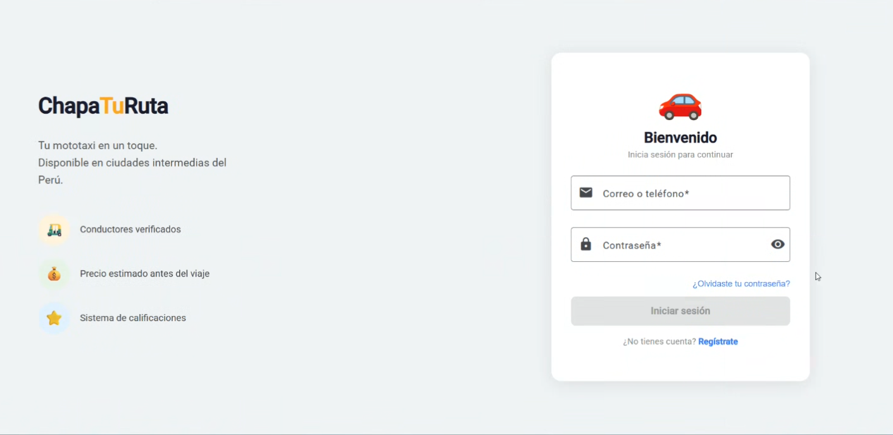
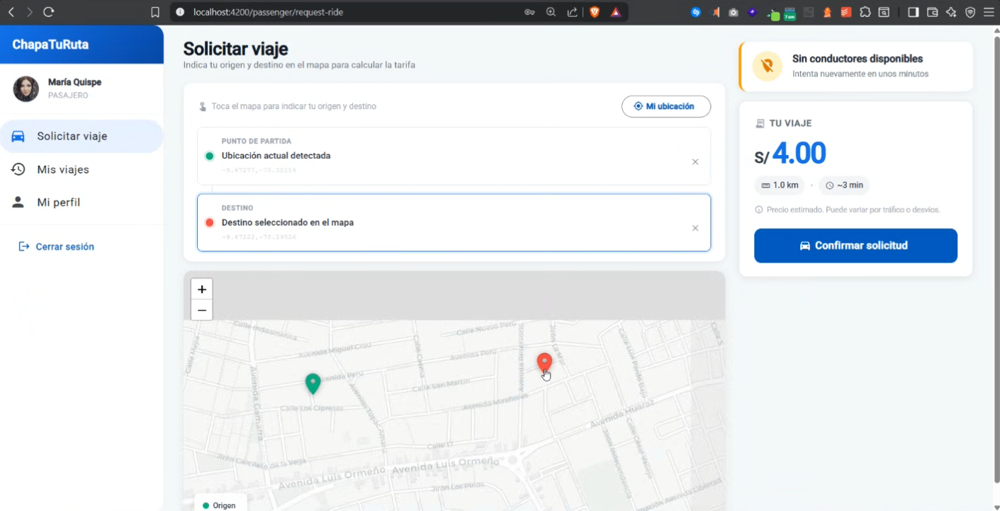
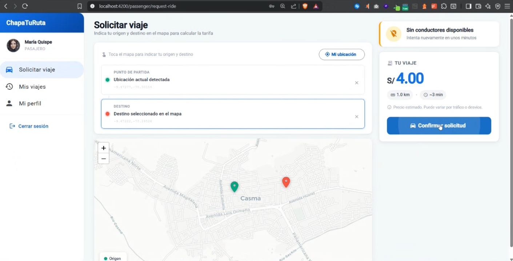
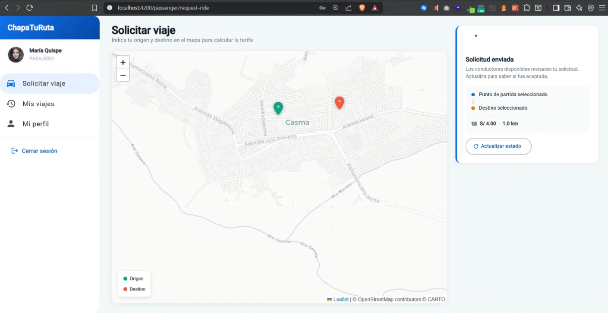
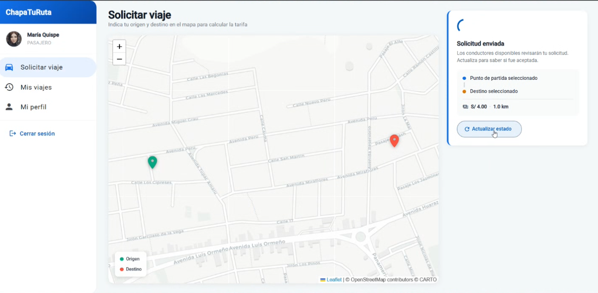

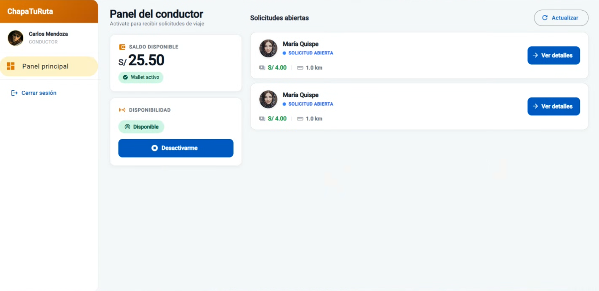
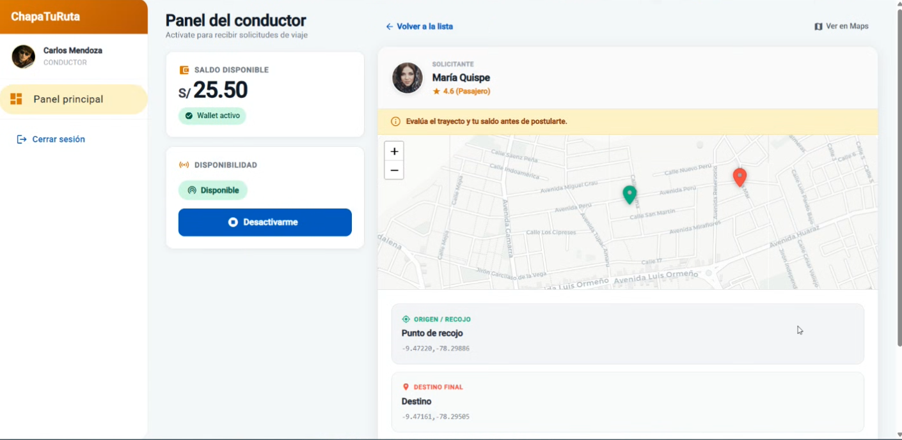

#### 5.2.2.6. Services Documentation Evidence for Sprint Review
Durante este sprint se completó el diseño e implementación del frontend Page del sistema.

**Descripción del Logro:**
- Implementación del frontend page.
- Deployment del frontend page.

**Recursos del Sprint:**

| Recurso | Acción implementada | Método HTTP | URL / Endpoint | Link de repositorio |
| --- | --- | --- | --- | --- |
| Frontend Page | Visualización inicial | GET | [startup-x-upc.github.io/frontendweb-page](https://chapaturuta-e7d2e.web.app/login) | [Startup-x-upc/frontendweb-page](https://github.com/Startup-x-upc/FrontEnd-WebApplication.git) |

#### 5.2.1.7. Software Deployment Evidence for Sprint Review

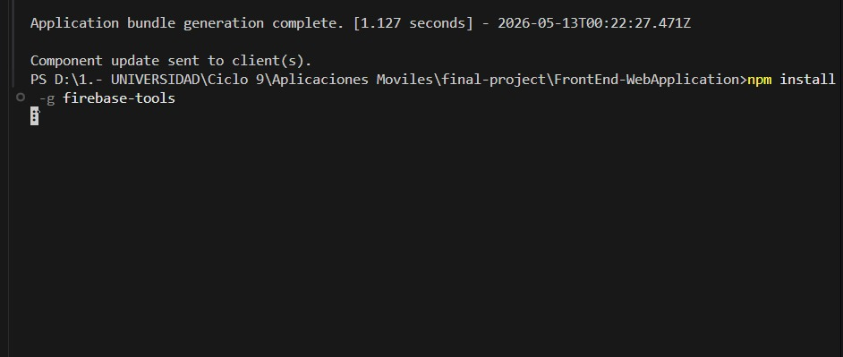
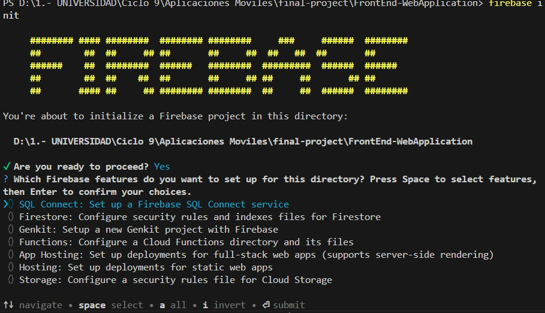
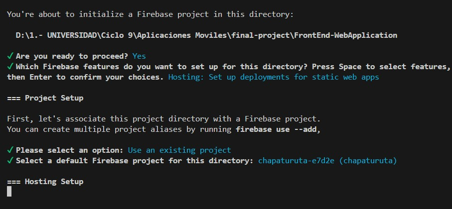
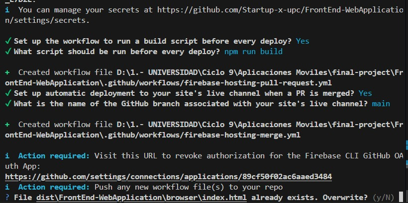
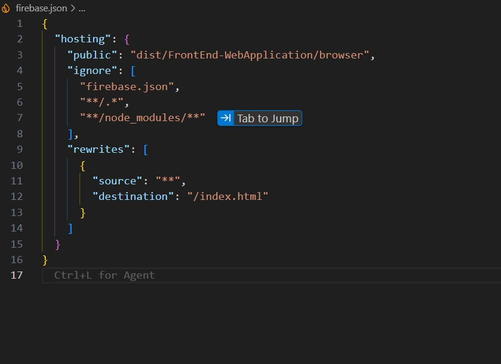

#### 5.2.1.8. Team Collaboration Insights during Sprint

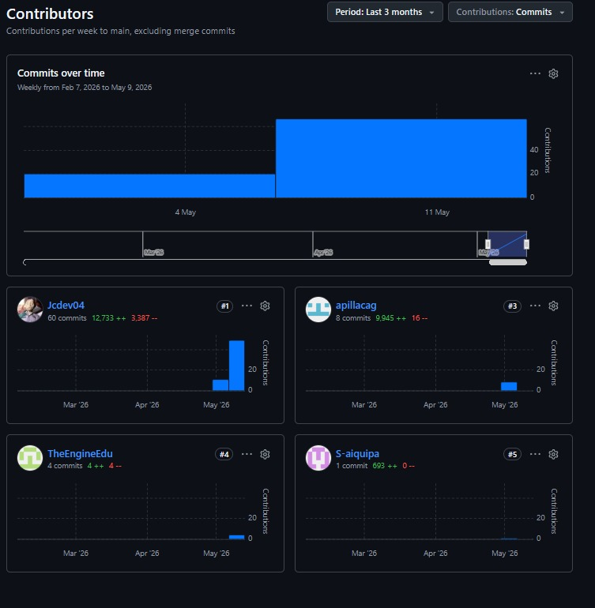

### 5.2.3. Sprint 3

#### 5.2.3.1. Sprint Planning 3

<table>
  <tbody>
    <tr>
      <td><b>Sprint #</b></td>
      <td>Sprint 3</td>
    </tr>
    <tr>
      <td colspan="2"><b>Sprint Planning Background</b></td>
    </tr>
    <tr>
      <td><b>Date</b></td>
      <td>2026-06-20</td>
    </tr>
    <tr>
      <td><b>Time</b></td>
      <td>18:50 PM (GMT-5)</td>
    </tr>
    <tr>
      <td><b>Location</b></td>
      <td>Modalidad remota mediante la plataforma Discord</td>
    </tr>
    <tr>
      <td><b>Prepared By</b></td>
      <td>Aguirre Ramos, Eduardo Manuel</td>
    </tr>
    <tr>
      <td><b>Attendees (to planning meeting)</b></td>
      <td>Castillo Vidal, Jesus Ivan / Torres Sanchez, Dalila Victoria / Aguirre Ramos, Eduardo Manuel / Pillaca Gonzales, Andy Saúl / Delgado Perez, James Caleb / Aiquipa Poma, Sebastian Andres</td>
    </tr>
    <tr>
      <td><b>Sprint 2 Review Summary</b></td>
      <td>Durante el Sprint 2 se logró implementar la mayoria de las funcionalidades del sistema ChapaTuRuta, desarrollando las secciones en la parte del frontend sobre el login, el viaje que realiza el conductor y opciones acerca .Quedó como mejora la implementacion del apartado de edición del perfil del usuario, la puntuación a la persona y el registro de nuevos conductores y pasajeros. El equipo cumplió con sus tareas establecidas, respetando el diseño de mockups y la guía de estilos, además de la  correcta implementación de la arquitectura DDD con respecto el nombre de las carpetas mencionadas en clase.</td>
    </tr>
    <tr>
      <td><b>Sprint 2 Retrospective Summary</b></td>
      <td>Durante el Sprint 2, el equipo logró avanzar de forma efectiva en el desarrollo de el frontend del negocio. Cada integrante ha cumplido con los resultados esperados para las secciones correspondientes, lo que permitió avanzar según lo planificado. Como mejora para el siguiente sprint, se debe implementar un metodo para supervisar cada task realizado por los integrantes, para asi manejar la eficiencia en el proyectoo y futuros trabajos colaborativos.</td>
    </tr>
    <tr>
      <td colspan="2"><b>Sprint Goal & User Stories</b></td>
    </tr>
    <tr>
      <td><b>Sprint 3 Goal</b></td>
      <td><b>Nuestro propósito es</b> tener el frontend del negocio hecho en su totalidad además de incluir el backend para que asi pueda procesar datos, manejarlos y almacenarlos en una base de datos. <b>Creemos que esto aportará</b> una mejor comprensión del alcance y la funcionalidad de lo que nuestro software puede llegar a ser. <b>Esto se confirmará cuando</b> entrevistemos nuevamente a personas y puedan probar nuestra pagina y a partir de ello genere un impacto positivo opinando y reseñando cómodamente con la pagina completa en su totalidad.</td>
    </tr>
    <tr>
      <td><b>Sprint 3 Velocity</b></td>
      <td> puntos</td>
    </tr>
    <tr>
      <td><b>Sum of Story Points</b></td>
      <td> puntos</td>
    </tr>
  </tbody>
</table>

#### 5.2.3.2. Aspect Leaders and Collaborators
En esta sección se presenta la Leadership-and-Collaboration Matrix (LACX) correspondiente al Sprint 3. Cada aspecto se relaciona con tareas clave del sprint, asignando un líder (L) responsable principal y colaboradores (C) que apoyan en su ejecución.
<table>
  <tbody>
    <tr>
      <th>Team Member (Last Name, First Name)</th>
      <th>GitHub Username</th>
      <th> Real-Time & Geolocation Aspect (L/C)</th>
      <th> Transaction & Payment Aspect (L/C)</th>
      <th> Service Status & State Aspect (L/C)</th>
      <th> Route Logic & Map Aspect (L/C)</th>
      <th> User Experience & Flow Aspect (L/C)</th>
    </tr>
    <tr>
      <td>Castillo Vidal, Jesus Ivan</td>
      <td>Jcdev04</td>
      <td>L</td>
      <td>C</td>
      <td>C</td>
      <td>C</td>
      <td>L</td>
    </tr>
    <tr>
      <td>Torres Sanchez, Dalila Victoria</td>
      <td>DalilaTorres</td>
      <td>C</td>
      <td>C</td>
      <td>C</td>
      <td>C</td>
      <td>L</td>
    </tr>
    <tr>
      <td>Aguirre Ramos, Eduardo Manuel</td>
      <td>TheEngineEdu</td>
      <td>C</td>
      <td>C</td>
      <td>L</td>
      <td>C</td>
      <td>L</td>
    </tr>
    <tr>
      <td>Pillaca Gonzales, Andy Saúl</td>
      <td>apillacag</td>
      <td>C</td>
      <td>C</td>
      <td>C</td>
      <td>L</td>
      <td>C</td>
    </tr>
    <tr>
      <td>Aiquipa Poma, Sebastian Andres</td>
      <td>S-aiquipa</td>
      <td>C</td>
      <td>L</td>
      <td>C</td>
      <td>C</td>
      <td>L</td>
    </tr>
  </tbody>
</table>

#### 5.2.3.3. Sprint Backlog 3

Este documento sintetiza el **Sprint Backlog para el Sprint 3** del proyecto **ChapaTuRuta**, enfocado en la completitud de la aplicación frontend. La estrategia de desarrollo se apoya en un backend simulado mediante **Fake API (json-server)** y **refresh manual / polling ligero** para la sincronización de estados.


##### 1. Resumen del Sprint Backlog

<table>
  <thead>
    <tr>
      <th>Sprint #</th>
      <th colspan="7">Sprint 3</th>
    </tr>
    <tr>
      <th colspan="2">User Story</th>
      <th colspan="6">Work-Item / Task</th>
    </tr>
    <tr>
      <th>Id</th>
      <th>Title</th>
      <th>Id</th>
      <th>Title</th>
      <th>Description</th>
      <th>Estimation (Hours)</th>
      <th>Assigned To</th>
      <th>Status (To-do / In-Process / To-Review / Done)</th>
    </tr>
  </thead>
  <tbody>
    <!-- US-01 -->
<tr>
  <td rowspan="6">US-01</td>
  <td rowspan="6">Registro de pasajero</td>
  <td>TASK-US01-01</td>
  <td>Validar existencia de colección users</td>
  <td>Validar existencia de colección `users` en `db.json`.</td>
  <td>0.4</td>
  <td>--</td>
  <td>To-do</td>
</tr>
<tr>
  <td>TASK-US01-02</td>
  <td>Diseñar componente register-passenger-form</td>
  <td>Diseñar componente `register-passenger-form` con validaciones de formulario.</td>
  <td>--</td>
  <td>--</td>
  <td>To-do</td>
</tr>
<tr>
  <td>TASK-US01-03</td>
  <td>Implementar endpoint POST /users</td>
  <td>Implementar endpoint `POST /users` en el servicio `IamApiService`.</td>
  <td>--</td>
  <td>--</td>
  <td>To-do</td>
</tr>
<tr>
  <td>TASK-US01-04</td>
  <td>Crear validación de email duplicado</td>
  <td>Crear validación de email duplicado vía `GET /users?email={email}` previa al registro.</td>
  <td>--</td>
  <td>--</td>
  <td>To-do</td>
</tr>
<tr>
  <td>TASK-US01-05</td>
  <td>Validar coincidencia de contraseña</td>
  <td>Validar coincidencia de contraseña y confirmación.</td>
  <td>0.4</td>
  <td>--</td>
  <td>To-do</td>
</tr>
<tr>
  <td>TASK-US01-06</td>
  <td>Redirigir al login</td>
  <td>Redirigir al login mostrando mensaje de éxito.</td>
  <td>--</td>
  <td>--</td>
  <td>To-do</td>
</tr>

<!-- US-02 -->
<tr>
  <td rowspan="5">US-02</td>
  <td rowspan="5">Registro de conductor (con brevete y SOAT)</td>
  <td>TASK-US02-01</td>
  <td>Diseñar formulario register-driver-form</td>
  <td>Diseñar formulario `register-driver-form` agregando inputs para brevete y SOAT.</td>
  <td>--</td>
  <td>--</td>
  <td>To-do</td>
</tr>
<tr>
  <td>TASK-US02-02</td>
  <td>Ajustar IamApiService</td>
  <td>Ajustar `IamApiService` para enviar payload de conductor con estado inicial pendiente.</td>
  <td>--</td>
  <td>--</td>
  <td>To-do</td>
</tr>
<tr>
  <td>TASK-US02-03</td>
  <td>Configurar campos de estado</td>
  <td>Configurar campos `verificationStatus` y `operationalStatus` en el esquema de conductores de `db.json`.</td>
  <td>--</td>
  <td>--</td>
  <td>To-do</td>
</tr>
<tr>
  <td>TASK-US02-04</td>
  <td>Validar campos obligatorios</td>
  <td>Validar campos obligatorios antes del envío.</td>
  <td>--</td>
  <td>--</td>
  <td>To-do</td>
</tr>
<tr>
  <td>TASK-US02-05</td>
  <td>Redirigir al login con aviso</td>
  <td>Redirigir al login con mensaje explicativo sobre el estado de verificación.</td>
  <td>--</td>
  <td>--</td>
  <td>To-do</td>
</tr>

<!-- US-04 -->
<tr>
  <td rowspan="6">US-04</td>
  <td rowspan="6">Gestión de perfil (editar nombre y foto)</td>
  <td>TASK-US04-01</td>
  <td>Crear componente profile-page</td>
  <td>Crear componente `profile-page` accesible para pasajero y conductor.</td>
  <td>--</td>
  <td>--</td>
  <td>To-do</td>
</tr>
<tr>
  <td>TASK-US04-02</td>
  <td>Diseñar formulario profile-edit-form</td>
  <td>Diseñar formulario `profile-edit-form` (nombre completo y foto).</td>
  <td>--</td>
  <td>--</td>
  <td>To-do</td>
</tr>
<tr>
  <td>TASK-US04-03</td>
  <td>Implementar PUT /profiles/{id}</td>
  <td>Implementar `PUT /profiles/{id}` en `IamApiService`.</td>
  <td>--</td>
  <td>--</td>
  <td>To-do</td>
</tr>
<tr>
  <td>TASK-US04-04</td>
  <td>Configurar rutas hijas</td>
  <td>Configurar rutas hijas en los layouts de pasajero y conductor.</td>
  <td>--</td>
  <td>--</td>
  <td>To-do</td>
</tr>
<tr>
  <td>TASK-US04-05</td>
  <td>Integrar acción updateProfile</td>
  <td>Integrar acción `updateProfile()` en `IamStore`.</td>
  <td>--</td>
  <td>--</td>
  <td>To-do</td>
</tr>
<tr>
  <td>TASK-US04-06</td>
  <td>Reflejar cambios en tiempo real</td>
  <td>Reflejar cambios en tiempo real en los sidebars o cabeceras de navegación.</td>
  <td>--</td>
  <td>--</td>
  <td>To-do</td>
</tr>

<!-- US-05 -->
<tr>
  <td rowspan="3">US-05</td>
  <td rowspan="3">Cierre de sesión (Sign-Out)</td>
  <td>TASK-US05-01</td>
  <td>Verificar botón de cerrar sesión</td>
  <td>Verificar botón de cerrar sesión en los headers/sidebars de ambos roles.</td>
  <td>--</td>
  <td>--</td>
  <td>To-do</td>
</tr>
<tr>
  <td>TASK-US05-02</td>
  <td>Confirmar purga de datos</td>
  <td>Confirmar que el store e historial de local storage quedan purgados tras el logout.</td>
  <td>--</td>
  <td>--</td>
  <td>To-do</td>
</tr>
<tr>
  <td>TASK-US05-03</td>
  <td>Validar redirección</td>
  <td>Validar redirección a `/login`.</td>
  <td>--</td>
  <td>--</td>
  <td>To-do</td>
</tr>

<!-- US-18 -->
<tr>
  <td rowspan="6">US-18</td>
  <td rowspan="6">Cancelación de viaje (pasajero/conductor)</td>
  <td>TASK-US18-01</td>
  <td>Crear acción cancelRide</td>
  <td>Crear acción `cancelRide(rideId, cancelledBy)` en `RideDispatchStore`.</td>
  <td>--</td>
  <td>--</td>
  <td>To-do</td>
</tr>
<tr>
  <td>TASK-US18-02</td>
  <td>Configurar petición PATCH /rides/{id}</td>
  <td>Configurar petición `PATCH /rides/{id}` para actualizar el estado del viaje.</td>
  <td>--</td>
  <td>--</td>
  <td>To-do</td>
</tr>
<tr>
  <td>TASK-US18-03</td>
  <td>Agregar botón Cancelar en Pasajero</td>
  <td>Agregar botón "Cancelar viaje" en la UI del pasajero al tener conductor asignado.</td>
  <td>--</td>
  <td>--</td>
  <td>To-do</td>
</tr>
<tr>
  <td>TASK-US18-04</td>
  <td>Agregar botón Cancelar en Conductor</td>
  <td>Agregar botón "Cancelar viaje" en el dashboard del conductor durante la etapa de asignación.</td>
  <td>--</td>
  <td>--</td>
  <td>To-do</td>
</tr>
<tr>
  <td>TASK-US18-05</td>
  <td>Implementar diálogo de confirmación</td>
  <td>Implementar diálogo de confirmación emergente.</td>
  <td>--</td>
  <td>--</td>
  <td>To-do</td>
</tr>
<tr>
  <td>TASK-US18-06</td>
  <td>Actualizar las vistas reactivamente</td>
  <td>Actualizar las vistas correspondientes reactivamente al cancelar.</td>
  <td>--</td>
  <td>--</td>
  <td>To-do</td>
</tr>

<!-- US-21 -->
<tr>
  <td rowspan="5">US-21</td>
  <td rowspan="5">Calificación post-viaje al conductor</td>
  <td>TASK-US21-01</td>
  <td>Configurar colección ratings</td>
  <td>Configurar la colección `ratings` en `db.json`.</td>
  <td>--</td>
  <td>--</td>
  <td>To-do</td>
</tr>
<tr>
  <td>TASK-US21-02</td>
  <td>Diseñar componente rating-form</td>
  <td>Diseñar componente interactivo `rating-form` (estrellas seleccionables).</td>
  <td>--</td>
  <td>--</td>
  <td>To-do</td>
</tr>
<tr>
  <td>TASK-US21-03</td>
  <td>Crear TrustReputationApiService</td>
  <td>Crear `TrustReputationApiService` con endpoint `POST /ratings`.</td>
  <td>--</td>
  <td>--</td>
  <td>To-do</td>
</tr>
<tr>
  <td>TASK-US21-04</td>
  <td>Integrar modal de calificación</td>
  <td>Integrar el modal de calificación al entrar en estado `RIDE_COMPLETED` del pasajero.</td>
  <td>--</td>
  <td>--</td>
  <td>To-do</td>
</tr>
<tr>
  <td>TASK-US21-05</td>
  <td>Implementar recálculo del promedio</td>
  <td>Implementar recálculo del promedio (`ratingAverage`) en el perfil del conductor.</td>
  <td>--</td>
  <td>--</td>
  <td>To-do</td>
</tr>

<!-- US-22 -->
<tr>
  <td rowspan="4">US-22</td>
  <td rowspan="4">Calificación post-viaje al pasajero</td>
  <td>TASK-US22-01</td>
  <td>Integrar rating-form en Conductor</td>
  <td>Integrar `rating-form` en la vista final del conductor.</td>
  <td>--</td>
  <td>--</td>
  <td>To-do</td>
</tr>
<tr>
  <td>TASK-US22-02</td>
  <td>Agregar campo de comentarios condicional</td>
  <td>Agregar campo de comentarios condicionado a bajas calificaciones (≤ 2★).</td>
  <td>--</td>
  <td>--</td>
  <td>To-do</td>
</tr>
<tr>
  <td>TASK-US22-03</td>
  <td>Registrar calificación en db.json</td>
  <td>Registrar calificación en `db.json` vía endpoint común de ratings.</td>
  <td>--</td>
  <td>--</td>
  <td>To-do</td>
</tr>
<tr>
  <td>TASK-US22-04</td>
  <td>Recalcular reputación del pasajero</td>
  <td>Recalcular reputación del pasajero en su respectivo perfil.</td>
  <td>--</td>
  <td>--</td>
  <td>To-do</td>
</tr>

<!-- US-23 -->
<tr>
  <td rowspan="4">US-23</td>
  <td rowspan="4">Visualización del puntaje de reputación en perfil</td>
  <td>TASK-US23-01</td>
  <td>Agregar sección visual de reputación</td>
  <td>Agregar sección de reputación visual en `profile-page`.</td>
  <td>--</td>
  <td>--</td>
  <td>To-do</td>
</tr>
<tr>
  <td>TASK-US23-02</td>
  <td>Consumir endpoint GET /ratings</td>
  <td>Consumir endpoint `GET /ratings?ratedUserId={id}` para computar los valores.</td>
  <td>--</td>
  <td>--</td>
  <td>To-do</td>
</tr>
<tr>
  <td>TASK-US23-03</td>
  <td>Mostrar estrellas de forma gráfica</td>
  <td>Mostrar estrellas de forma gráfica (ej. `★ ★ ★ ☆ ☆`).</td>
  <td>--</td>
  <td>--</td>
  <td>To-do</td>
</tr>
<tr>
  <td>TASK-US23-04</td>
  <td>Configurar mensaje para nuevos usuarios</td>
  <td>Configurar mensaje de estado para usuarios nuevos sin calificaciones.</td>
  <td>--</td>
  <td>--</td>
  <td>To-do</td>
</tr>

<!-- US-24 -->
<tr>
  <td rowspan="5">US-24</td>
  <td rowspan="5">Historial de viajes del pasajero</td>
  <td>TASK-US24-01</td>
  <td>Crear componente trip-history-page</td>
  <td>Crear componente `trip-history-page` para pasajero.</td>
  <td>--</td>
  <td>--</td>
  <td>To-do</td>
</tr>
<tr>
  <td>TASK-US24-02</td>
  <td>Consumir GET /rides de pasajero</td>
  <td>Consumir `GET /rides?passengerId={id}&amp;_sort=fecha&amp;_order=desc` en `RideDispatchApiService`.</td>
  <td>--</td>
  <td>--</td>
  <td>To-do</td>
</tr>
<tr>
  <td>TASK-US24-03</td>
  <td>Configurar ruta en sidebar</td>
  <td>Configurar la ruta `/passenger/trips` en la navegación del sidebar.</td>
  <td>--</td>
  <td>--</td>
  <td>To-do</td>
</tr>
<tr>
  <td>TASK-US24-04</td>
  <td>Crear tarjetas de viaje responsivas</td>
  <td>Crear tarjetas de viaje responsivas para listar el historial.</td>
  <td>--</td>
  <td>--</td>
  <td>To-do</td>
</tr>
<tr>
  <td>TASK-US24-05</td>
  <td>Implementar vista de historial vacío</td>
  <td>Implementar vista de historial vacío con botón para iniciar nueva solicitud.</td>
  <td>--</td>
  <td>--</td>
  <td>To-do</td>
</tr>

<!-- US-25 -->
<tr>
  <td rowspan="5">US-25</td>
  <td rowspan="5">Historial de viajes del conductor (con comisión)</td>
  <td>TASK-US25-01</td>
  <td>Crear componente trip-history-page</td>
  <td>Crear componente `trip-history-page` para conductor.</td>
  <td>--</td>
  <td>--</td>
  <td>To-do</td>
</tr>
<tr>
  <td>TASK-US25-02</td>
  <td>Consumir GET /rides de conductor</td>
  <td>Consumir `GET /rides?driverId={id}&amp;_sort=fecha&amp;_order=desc`.</td>
  <td>--</td>
  <td>--</td>
  <td>To-do</td>
</tr>
<tr>
  <td>TASK-US25-03</td>
  <td>Configurar ruta para conductor</td>
  <td>Configurar ruta `/driver/trips`.</td>
  <td>--</td>
  <td>--</td>
  <td>To-do</td>
</tr>
<tr>
  <td>TASK-US25-04</td>
  <td>Agregar enlace Historial</td>
  <td>Agregar enlace "Historial" en el panel lateral del conductor.</td>
  <td>--</td>
  <td>--</td>
  <td>To-do</td>
</tr>
<tr>
  <td>TASK-US25-05</td>
  <td>Diseñar desglose de ganancias y comisión</td>
  <td>Diseñar tarjetas mostrando el desglose: Tarifa Cobrada, Comisión (5%) y Ganancia Neta.</td>
  <td>--</td>
  <td>--</td>
  <td>To-do</td>
</tr>

<!-- US-06 -->
<tr>
  <td rowspan="5">US-06</td>
  <td rowspan="5">Verificación de documentos del conductor</td>
  <td>TASK-US06-01</td>
  <td>Crear vista admin-drivers-page</td>
  <td>Crear vista `admin-drivers-page` con tabla de conductores pendientes.</td>
  <td>--</td>
  <td>--</td>
  <td>To-do</td>
</tr>
<tr>
  <td>TASK-US06-02</td>
  <td>Aplicar filtro de búsqueda PENDING_VERIFICATION</td>
  <td>Aplicar filtro de búsqueda de conductores con `verificationStatus: PENDING_VERIFICATION`.</td>
  <td>--</td>
  <td>--</td>
  <td>To-do</td>
</tr>
<tr>
  <td>TASK-US06-03</td>
  <td>Agregar acciones de aprobación/rechazo</td>
  <td>Agregar acciones visuales `approveDriver(id)` y `rejectDriver(id, reason)`.</td>
  <td>--</td>
  <td>--</td>
  <td>To-do</td>
</tr>
<tr>
  <td>TASK-US06-04</td>
  <td>Implementar PATCH /drivers/{id}</td>
  <td>Implementar petición `PATCH /drivers/{id}` para actualizar estado de verificación.</td>
  <td>--</td>
  <td>--</td>
  <td>To-do</td>
</tr>
<tr>
  <td>TASK-US06-05</td>
  <td>Añadir ruta al dashboard de admin</td>
  <td>Añadir ruta `/admin/drivers` al dashboard de administrador.</td>
  <td>--</td>
  <td>--</td>
  <td>To-do</td>
</tr>

<!-- US-20 -->
<tr>
  <td rowspan="5">US-20</td>
  <td rowspan="5">Configuración de tarifas por el administrador</td>
  <td>TASK-US20-01</td>
  <td>Diseñar componente admin-fare-config-page</td>
  <td>Diseñar componente `admin-fare-config-page` con formularios reactivos de Angular.</td>
  <td>--</td>
  <td>--</td>
  <td>To-do</td>
</tr>
<tr>
  <td>TASK-US20-02</td>
  <td>Consumir y actualizar configuraciones</td>
  <td>Consumir y actualizar configuraciones vía `PUT /fareConfig/{id}` en `MonetizationApiService`.</td>
  <td>--</td>
  <td>--</td>
  <td>To-do</td>
</tr>
<tr>
  <td>TASK-US20-03</td>
  <td>Agregar validadores de números</td>
  <td>Agregar validadores para impedir números negativos o nulos.</td>
  <td>--</td>
  <td>--</td>
  <td>To-do</td>
</tr>
<tr>
  <td>TASK-US20-04</td>
  <td>Configurar la ruta de tarifas</td>
  <td>Configurar la ruta `/admin/fare-config`.</td>
  <td>--</td>
  <td>--</td>
  <td>To-do</td>
</tr>
<tr>
  <td>TASK-US20-05</td>
  <td>Mostrar confirmación de guardado</td>
  <td>Mostrar confirmación emergente de guardado exitoso.</td>
  <td>--</td>
  <td>--</td>
  <td>To-do</td>
</tr>

<!-- US-26 -->
<tr>
  <td rowspan="4">US-26</td>
  <td rowspan="4">Panel de administración de conductores</td>
  <td>TASK-US26-01</td>
  <td>Extender admin-drivers-page</td>
  <td>Extender `admin-drivers-page` para permitir visualizar a todos los conductores.</td>
  <td>--</td>
  <td>--</td>
  <td>To-do</td>
</tr>
<tr>
  <td>TASK-US26-02</td>
  <td>Implementar el control toggle isEnabled</td>
  <td>Implementar el control toggle `isEnabled` en la grilla de datos.</td>
  <td>--</td>
  <td>--</td>
  <td>To-do</td>
</tr>
<tr>
  <td>TASK-US26-03</td>
  <td>Configurar petición PATCH al cambiar toggle</td>
  <td>Configurar petición `PATCH /drivers/{id}` al cambiar el estado de habilitación.</td>
  <td>--</td>
  <td>--</td>
  <td>To-do</td>
</tr>
<tr>
  <td>TASK-US26-04</td>
  <td>Diseñar tags visuales de color</td>
  <td>Diseñar tags visuales de color (Verde: Activo, Amarillo: Pendiente, Rojo: Suspendido).</td>
  <td>--</td>
  <td>--</td>
  <td>To-do</td>
</tr>

<!-- US-30 -->
<tr>
  <td rowspan="6">US-30</td>
  <td rowspan="6">Historial de transacciones del wallet</td>
  <td>TASK-US30-01</td>
  <td>Declarar esquema walletTransactions</td>
  <td>Declarar esquema `walletTransactions` en `db.json`.</td>
  <td>--</td>
  <td>--</td>
  <td>To-do</td>
</tr>
<tr>
  <td>TASK-US30-02</td>
  <td>Consumir endpoint GET /walletTransactions</td>
  <td>Consumir endpoint `GET /walletTransactions?walletId={id}` en `MonetizationApiService`.</td>
  <td>--</td>
  <td>--</td>
  <td>To-do</td>
</tr>
<tr>
  <td>TASK-US30-03</td>
  <td>Crear componente transaction-history</td>
  <td>Crear componente de lista `transaction-history`.</td>
  <td>--</td>
  <td>--</td>
  <td>To-do</td>
</tr>
<tr>
  <td>TASK-US30-04</td>
  <td>Reemplazar mock visual por datos del store</td>
  <td>Reemplazar mock visual por datos reales del store en la página de Wallet.</td>
  <td>--</td>
  <td>--</td>
  <td>To-do</td>
</tr>
<tr>
  <td>TASK-US30-05</td>
  <td>Añadir filtros interactivos por tipo</td>
  <td>Añadir filtros interactivos por tipo de transacción (`TOP_UP`, `COMMISSION`).</td>
  <td>--</td>
  <td>--</td>
  <td>To-do</td>
</tr>
<tr>
  <td>TASK-US30-06</td>
  <td>Diseñar el estado de historial vacío</td>
  <td>Diseñar el estado de historial vacío.</td>
  <td>--</td>
  <td>--</td>
  <td>To-do</td>
</tr>

<!-- US-27 -->
<tr>
  <td rowspan="4">US-27</td>
  <td rowspan="4">Recarga del wallet (Mock con simulación de saldo)</td>
  <td>TASK-US27-01</td>
  <td>Crear componente recharge-form</td>
  <td>Crear componente `recharge-form` con validación de montos (mínimo S/ 5.00).</td>
  <td>--</td>
  <td>--</td>
  <td>To-do</td>
</tr>
<tr>
  <td>TASK-US27-02</td>
  <td>Implementar lógica mock de incremento</td>
  <td>Lógica mock: ejecutar `POST /walletTransactions` y `PATCH /wallets/{id}` para actualizar el saldo del conductor.</td>
  <td>--</td>
  <td>--</td>
  <td>To-do</td>
</tr>
<tr>
  <td>TASK-US27-03</td>
  <td>Renderizar el formulario en un modal</td>
  <td>Renderizar el formulario en un modal dentro de la sección de billetera.</td>
  <td>--</td>
  <td>--</td>
  <td>To-do</td>
</tr>
<tr>
  <td>TASK-US27-04</td>
  <td>Notificar la recarga correcta</td>
  <td>Notificar la recarga correcta actualizando el saldo visible inmediatamente.</td>
  <td>--</td>
  <td>--</td>
  <td>To-do</td>
</tr>

<!-- US-29 -->
<tr>
  <td rowspan="5">US-29</td>
  <td rowspan="5">Descuento automático de comisión (simulación 5%)</td>
  <td>TASK-US29-01</td>
  <td>Interceptar la confirmación del viaje</td>
  <td>Interceptar la confirmación del viaje completado en `RideDispatchStore.onCompleteRide()`.</td>
  <td>--</td>
  <td>--</td>
  <td>To-do</td>
</tr>
<tr>
  <td>TASK-US29-02</td>
  <td>Disparar petición PATCH /wallets</td>
  <td>Disparar petición `PATCH /wallets/{driverId}` aplicando el descuento matemático.</td>
  <td>--</td>
  <td>--</td>
  <td>To-do</td>
</tr>
<tr>
  <td>TASK-US29-03</td>
  <td>Registrar el movimiento en el historial</td>
  <td>Registrar el movimiento en el historial vía `POST /walletTransactions` con categoría `COMMISSION`.</td>
  <td>--</td>
  <td>--</td>
  <td>To-do</td>
</tr>
<tr>
  <td>TASK-US29-04</td>
  <td>Forzar sincronización de MonetizationStore</td>
  <td>Forzar sincronización de datos de `MonetizationStore` tras el cobro.</td>
  <td>--</td>
  <td>--</td>
  <td>To-do</td>
</tr>
<tr>
  <td>TASK-US29-05</td>
  <td>Mostrar mensaje emergente de cobro</td>
  <td>Mostrar mensaje emergente informando el descuento de comisión cobrado.</td>
  <td>--</td>
  <td>--</td>
  <td>To-do</td>
</tr>

<!-- US-10/11 -->
<tr>
  <td rowspan="4">US-10/11</td>
  <td rowspan="4">Polling ligero para aceptación/rechazo (Opcional)</td>
  <td>TASK-POLL-01</td>
  <td>Configurar bucle de consulta automática</td>
  <td>Configurar bucle de consulta automática en `passenger-request-page` cuando el estado sea `WAITING_CANDIDATES`.</td>
  <td>--</td>
  <td>--</td>
  <td>To-do</td>
</tr>
<tr>
  <td>TASK-POLL-02</td>
  <td>Detener el bucle según el estado</td>
  <td>Detener el bucle en cuanto cambie el estado de viaje a una etapa definitiva o error.</td>
  <td>--</td>
  <td>--</td>
  <td>To-do</td>
</tr>
<tr>
  <td>TASK-POLL-03</td>
  <td>Usar operador interval(5000) de RxJS</td>
  <td>Usar operador `interval(5000)` de RxJS para evitar fugas de memoria y garantizar la reactividad Angular.</td>
  <td>--</td>
  <td>--</td>
  <td>To-do</td>
</tr>
<tr>
  <td>TASK-POLL-04</td>
  <td>Diseñar y mostrar un loader</td>
  <td>Diseñar und mostrar un loader discreto tipo "Actualizando estado..." en la pantalla de espera.</td>
  <td>--</td>
  <td>--</td>
  <td>To-do</td>
</tr>
    </tbody>
</table>


#### 5.2.3.4. Development Evidence for Sprint Review

#### 5.2.3.5. Execution Evidence for Sprint Review

#### 5.2.3.6. Services Documentation Evidence for Sprint Review
Durante este sprint se completó el diseño e implementación completa del frontend además de agregar el backend y poder conectarlo .

**Descripción del Logro:**
- Completar en su totalidad el frontend page.
- Deployar el backend.

**Recursos del Sprint:**

| Recurso | Acción implementada | Método HTTP | URL / Endpoint | Link de repositorio |
| --- | --- | --- | --- | --- |
| Backend Page | Visualización inicial | GET | [startup-x-upc.github.io/frontendweb-page](https://chapaturuta-e7d2e.web.app/login) | [Startup-x-upc/frontendweb-page](https://github.com/Startup-x-upc/FrontEnd-WebApplication.git) |
#### 5.2.3.7. Software Deployment Evidence for Sprint Review

#### 5.2.3.8. Team Collaboration Insights during Sprint
