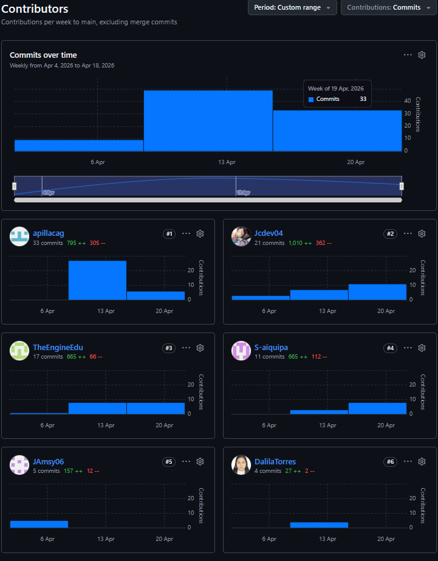

<h1 style="text-align: center;">Universidad Peruana de Ciencias Aplicada</h1> 

<h3 style="text-align: center; font-weight: normal; font-size: 22px; margin-top: 0;">
  Ingeniería de Software – 202610
</h3>  

<strong>Curso:</strong> Desarrollo de Aplicaciones Open Source

 
<strong>NRC:</strong> 10155

 
<strong>Profesor:</strong> Hugo Allan Mori Paiva

  
<strong>StartUp:</strong> CTR Technologies

  
<strong>Producto:</strong> Chapa Tu Ruta
  

<h2 style="text-align: center; font-size: 24px; margin-top: 30px;">
  <strong>Informe de Trabajo Final</strong>
</h2>

<table style="display: flex; justify-content: center;"> 
<tr>
<th>Código</th>
<th>Integrantes</th>
</tr> 
<tr>
<td>U202322952</td>
<td>Castillo Vidal, Jesus Ivan</td>
</tr>
<tr>
<td>U20221F734</td>
<td>Torres Sanchez, Dalila Victoria</td>
</tr>
<tr>
<td>U20241A911</td>
<td>Aguirre Ramos, Eduardo Manuel</td>
</tr>
<tr>
<td>U202418823</td>
<td>Pillaca Gonzales, Andy Saúl</td>
</tr>
<tr>
<td>u201916755</td>
<td>Aiquipa Poma, Sebastian Andres</td>
</tr>
</table>
  

 Abril 2026 

## **Registro de versiones del Informe**

<table style="width: 100%; table-layout: fixed;">
  <tr>
    <th style="width: 25%;">Version</th>
    <th style="width: 25%;">Fecha</th>
    <th style="width: 25%;">Autor</th>
    <th style="width: 25%;">Descripción de modificación </th>
  </tr>
   <tr>
    <td align="center"></td>
    <td align="center"></td>
    <td></td>
    <td></td>
  </tr>
</table>

## Project Report Collaboration Insights
Para el desarrollo del Project Report, se utilizó un repositorio dentro de la organización del equipo en GitHub. A continuación, se presenta la evidencia de colaboración correspondiente, en coherencia con el Registro de Versiones del Informe.

Repositorio del informe del proyecto: <a href="https://github.com/Startup-x-upc/landing-page">https://github.com/Startup-x-upc/landing-page</a>

## AV1

Durante esta fase, el equipo elaboró el informe base del proyecto, abarcando la definición del problema, justificación, objetivos, marco teórico y todas las secciones correspondientes al primer entregable.

Figura 1: Gráfico de contribuciones del repositorio del informe del proyecto para TB1, mostrando la actividad de colaboración de todos los miembros del equipo durante la elaboración del informe inicial.

**Resumen de Contribuciones:**
En base al historial del repositorio y la gráfica mostrada, se registran un total de **161 commits** para el informe del proyecto en esta etapa. El desglose de los aportes por cada integrante del equipo es el siguiente:

- **Andy Pillaca Gonzales:** 54 commits
- **Jesús Castillo Vidal:** 30 commits
- **Dalila Torres Sanchez:** 25 commits
- **Eduardo Aguirre Ramos:** 24 commits
- **Sebastian Aiquipa Poma:** 22 commits
- **James Delgado Perez:** 6 commits

Esta distribución evidencia un esfuerzo colaborativo y la participación activa de todos los integrantes en la elaboración y redacción de la documentación del proyecto.

# Tabla de contenidos

## [Capítulo I: Introducción](Capitulo_1.md)

- [1.1 Startup Profile](Capitulo_1.md#11-startup-profile)
  - [1.1.1 Descripción de la Startup](Capitulo_1.md#111-descripción-de-la-startup)
  - [1.1.2 Perfiles de integrantes del equipo](Capitulo_1.md#112-perfiles-de-integrantes-del-equipo)
- [1.2 Solution Profile](Capitulo_1.md#12-solution-profile)
  - [1.2.1 Antecedentes y problemática](Capitulo_1.md#121-antecedentes-y-problemática)
  - [1.2.2 Lean UX Process](Capitulo_1.md#122-lean-ux-process)
    - [1.2.2.1 Lean UX Problem Statements](Capitulo_1.md#1221-lean-ux-problem-statements)
    - [1.2.2.2 Lean UX Assumptions](Capitulo_1.md#1222-lean-ux-assumptions)
    - [1.2.2.3 Lean UX Hypothesis Statements](Capitulo_1.md#1223-lean-ux-hypothesis-statements)
    - [1.2.2.4 Lean UX Canvas](Capitulo_1.md#1224-lean-ux-canvas)
- [1.3 Segmentos Objetivos](Capitulo_1.md#13-segmentos-objetivo)

## [Capítulo II: Requirements Elicitation & Analysis](Capitulo_2.md)

- [2.1 Competidores](Capitulo_2.md#21-competidores)
  - [2.1.1 Análisis competitivo](Capitulo_2.md#211-análisis-competitivo)
  - [2.1.2 Estrategias y tácticas frente a competidores](Capitulo_2.md#212-estrategias-y-tácticas-frente-a-competidores)
- [2.2 Entrevistas](Capitulo_2.md#22-entrevistas)
  - [2.2.1 Diseño de entrevistas](Capitulo_2.md#221-diseño-de-entrevistas)
  - [2.2.2 Registro de entrevistas](Capitulo_2.md#222-registro-de-entrevistas)
  - [2.2.3 Análisis de entrevistas](Capitulo_2.md#223-análisis-de-entrevistas)
- [2.3 Needfinding](Capitulo_2.md#23-needfinding)
  - [2.3.1 User Personas](Capitulo_2.md#231-user-personas)
  - [2.3.2 User Task Matrix](Capitulo_2.md#232-user-task-matrix)
  - [2.3.3 User Journey Mapping](Capitulo_2.md#233-user-journey-mapping)
  - [2.3.4 Empathy Mapping](Capitulo_2.md#234-empathy-mapping)
- [2.4 Big Picture EventStorming](Capitulo_2.md#24-big-picture-eventstorming)
- [2.5 Ubiquitous Language](Capitulo_2.md#25-ubiquitous-language)

## [Capítulo III: Requirements Specification](Capitulo_3.md)

- [3.1 User Stories](Capitulo_3.md#31-user-stories)
- [3.2 Impact Mapping](Capitulo_3.md#32-impact-mapping)
- [3.3 Product Backlog](Capitulo_3.md#33-product-backlog)

## [Capítulo IV: Product Design](Capitulo_4.md)

- [4.1 Style Guidelines](Capitulo_4.md#41-style-guidelines)
  - [4.1.1 General Style Guidelines](Capitulo_4.md#411-general-style-guidelines)
  - [4.1.2 Web Style Guidelines](Capitulo_4.md#412-web-style-guidelines)
- [4.2 Information Architecture](Capitulo_4.md#42-information-architecture)
  - [4.2.1 Organization Systems](Capitulo_4.md#421-organization-systems)
  - [4.2.2 Labeling Systems](Capitulo_4.md#422-labeling-systems)
  - [4.2.3 SEO Tags and Meta Tags](Capitulo_4.md#423-seo-tags-and-meta-tags)
  - [4.2.4 Searching Systems](Capitulo_4.md#424-searching-systems)
  - [4.2.5 Navigation Systems](Capitulo_4.md#425-navigation-systems)
- [4.3 Landing Page UI Design](Capitulo_4.md#43-landing-page-ui-design)
  - [4.3.1 Landing Page Wireframe](Capitulo_4.md#431-landing-page-wireframe)
  - [4.3.2 Landing Page Mock-up](Capitulo_4.md#432-landing-page-mock-up)
- [4.4 Web Applications UX/UI Design](Capitulo_4.md#44-web-applications-uxui-design)
  - [4.4.1 Web Applications Wireframes](Capitulo_4.md#441-web-applications-wireframes)
  - [4.4.2 Web Applications Wireflow Diagrams](Capitulo_4.md#442-web-applications-wireflow-diagrams)
  - [4.4.3 Web Applications Mock-ups](Capitulo_4.md#443-web-applications-mock-ups)
  - [4.4.4 Web Applications User Flow Diagrams](Capitulo_4.md#444-web-applications-user-flow-diagrams)
- [4.5 Web Applications Prototyping](Capitulo_4.md#45-web-applications-prototyping)
- [4.6 Domain-Driven Software Architecture](Capitulo_4.md#46-domain-driven-software-architecture)
  - [4.6.1 Design-Level EventStorming](Capitulo_4.md#461-design-level-eventstorming)
  - [4.6.2 Software Architecture Context Diagram](Capitulo_4.md#462-software-architecture-context-diagram)
  - [4.6.3 Software Architecture Container Diagrams](Capitulo_4.md#463-software-architecture-container-diagrams)
  - [4.6.4 Software Architecture Components Diagrams](Capitulo_4.md#464-software-architecture-components-diagrams)
- [4.7 Software Object-Oriented Design](Capitulo_4.md#47-software-object-oriented-design)
  - [4.7.1 Class Diagrams](Capitulo_4.md#471-class-diagrams)
  - [4.7.2 Class Dictionary](Capitulo_4.md#472-class-dictionary)
- [4.8 Database Design](Capitulo_4.md#48-database-design)
  - [4.8.1 Database Diagrams](Capitulo_4.md#481-database-diagrams)
- [4.9 DDD Estratégico](Capitulo_4.md#49-ddd-estratégico)

## [Capítulo V: Product Implementation, Validation & Deployment](Capitulo_5.md)

- [5.1 Software Configuration Management](Capitulo_5.md#51-software-configuration-management)
  - [5.1.1 Software Development Environment Configuration](Capitulo_5.md#511-software-development-environment-configuration)
  - [5.1.2 Source Code Management](Capitulo_5.md#512-source-code-management)
  - [5.1.3 Source Code Style Guide & Conventions](Capitulo_5.md#513-source-code-style-guide--conventions)
  - [5.1.4 Software Deployment Configuration](Capitulo_5.md#514-software-deployment-configuration)
- [5.2 Landing Page, Services & Applications Implementation](Capitulo_5.md#52-landing-page-services--applications-implementation)
  - [5.2.1 Sprint 1](Capitulo_5.md#521-sprint-1)
    - [5.2.1.1 Sprint Planning 1](Capitulo_5.md#5211-sprint-planning-1)
    - [5.2.1.2 Aspect Leaders and Collaborators](Capitulo_5.md#5212-aspect-leaders-and-collaborators)
    - [5.2.1.3 Sprint Backlog 1](Capitulo_5.md#5213-sprint-backlog-1)
    - [5.2.1.4 Development Evidence for Sprint Review](Capitulo_5.md#5214-development-evidence-for-sprint-review)
    - [5.2.1.5 Execution Evidence for Sprint Review](Capitulo_5.md#5215-execution-evidence-for-sprint-review)
    - [5.2.1.6 Services Documentation Evidence for Sprint Review](Capitulo_5.md#5216-services-documentation-evidence-for-sprint-review)
    - [5.2.1.7 Software Deployment Evidence for Sprint Review](Capitulo_5.md#5217-software-deployment-evidence-for-sprint-review)
    - [5.2.1.8 Team Collaboration Insights during Sprint](Capitulo_5.md#5218-team-collaboration-insights-during-sprint)

## [Conclusiones](Conclusiones_bibliografica.md#conclusiones)

- [Conclusiones y recomendaciones](Conclusiones_bibliografica.md#conclusiones-y-recomendaciones)
- [Video About-the-Team](Conclusiones_bibliografica.md#video-about-the-team)

## [Bibliografía](Conclusiones_bibliografica.md#bibliografía)

## [Anexos](Conclusiones_bibliografica.md#anexos)

## Student Outcome

Criterio: Capacidad de comunicarse efectivamente con un rango de audiencias.
En el siguiente cuadro se describe las acciones realizadas y enunciados de conclusiones por parte del grupo, que permiten sustentar el haber alcanzado el logro del ABET – EAC - Student Outcome 3

| Criterio Específico                                                   | Acciones realizadas                                                                                                                                                                                                                                                                                                                                                                                                                                                                                                                                                                                                                                                                                                                                                                                                                                                                                                                                                                                | Conclusiones                                                                                                                                                                                                                                                                                                                                                                                                                                                                                                                                                                                                                                                                    |
| --------------------------------------------------------------------- | -------------------------------------------------------------------------------------------------------------------------------------------------------------------------------------------------------------------------------------------------------------------------------------------------------------------------------------------------------------------------------------------------------------------------------------------------------------------------------------------------------------------------------------------------------------------------------------------------------------------------------------------------------------------------------------------------------------------------------------------------------------------------------------------------------------------------------------------------------------------------------------------------------------------------------------------------------------------------------------------------- | ------------------------------------------------------------------------------------------------------------------------------------------------------------------------------------------------------------------------------------------------------------------------------------------------------------------------------------------------------------------------------------------------------------------------------------------------------------------------------------------------------------------------------------------------------------------------------------------------------------------------------------------------------------------------------- |
| Comunica oralmente con efectividad a diferentes rangos de audiencia.  | **Aguirre Ramos, Eduardo Manuel** **AV1:**Lider del grupo. Realizo los Lean Ux Problem Statements y Analisis Competitivo. Desarrollo los web applications wireframes and prototyping. Ademas de colaborar en las user stories. **Pillaca Gonzales, Andy Saúl** **AV1:**Definio las estrategias y tacticas frente a competidores. Definio los User persona. Desarrollo los web applications mock-ups  **Castillo Vidal, Jesus Ivan** **AV1:** Desarrollo los user stories, impact mapping, product mapping y product backlog. Definio y elaboro el design-level event storming. Finalmente el software object-oriented design **Torres Sanchez, Dalila Victoria**  **AV1:**Investigo los antecedentes y problematica. Definio el user journey mapping. Modelo el landing page wireframe y web applications wireframes  **Aiquipa Poma, Sebastian Andres** **AV1:** Analisis de entrevistas, style guidelines el Domain-Driven software Arquitecture y el Database Design | Durante la entrega AV1, el equipo expuso el perfil del startup y la problemática identificada en zonas periféricas de Lima ante el docente y compañeros de clase, adaptando el discurso a una audiencia técnica universitaria.  La presentación de los resultados del proceso Lean UX permitió al equipo ejercitar la comunicación oral de ideas abstractas de diseño de forma estructurada y comprensible.  El equipo demostró capacidad para comunicar oralmente los hallazgos de entrevistas con usuarios (mototaxistas y pasajeros), sintetizando información cualitativa ante una audiencia no familiarizada con el dominio del problema.                      |
| Comunica por escrito con efectividad a diferentes rangos de audiencia | **Aguirre Ramos, Eduardo Manuel** **AV1:**Lider del grupo. Realizo los Lean Ux Problem Statements y Analisis Competitivo. Desarrollo los web applications wireframes and prototyping. Ademas de colaborar en las user stories. **Pillaca Gonzales, Andy Saúl** **AV1:**Definio las estrategias y tacticas frente a competidores. Definio los User persona. Desarrollo los web applications mock-ups  **Castillo Vidal, Jesus Ivan** **AV1:**Desarrollo los user stories, impact mapping, product mapping y product backlog. Definio y elaboro el design-level event storming. Finalmente el software object-oriented design  **Torres Sanchez, Dalila Victoria**  **AV1:** Investigo los antecedentes y problematica. Definio el user journey mapping. Modelo el landing page wireframe y web applications wireframes **Aiquipa Poma, Sebastian Andres** **AV1:** Analisis de entrevistas, style guidelines el Domain-Driven software Arquitecture y el Database Design | En la entrega AV1, el equipo redactó el Capítulo 1 del informe, documentando antecedentes, problemática y el proceso Lean UX con un lenguaje técnico apropiado para lectores con formación en ingeniería de software.  La elaboración de User Personas, User Journey Maps y el Impact Map implicó comunicar por escrito necesidades y comportamientos de usuarios reales, dirigiéndose simultáneamente a una audiencia técnica y a partes interesadas no técnicas.  El uso de GitHub con commits convencionales y pull requests estructurados evidencia la capacidad del equipo de comunicar cambios y decisiones de desarrollo de forma escrita, clara y trazable. |

