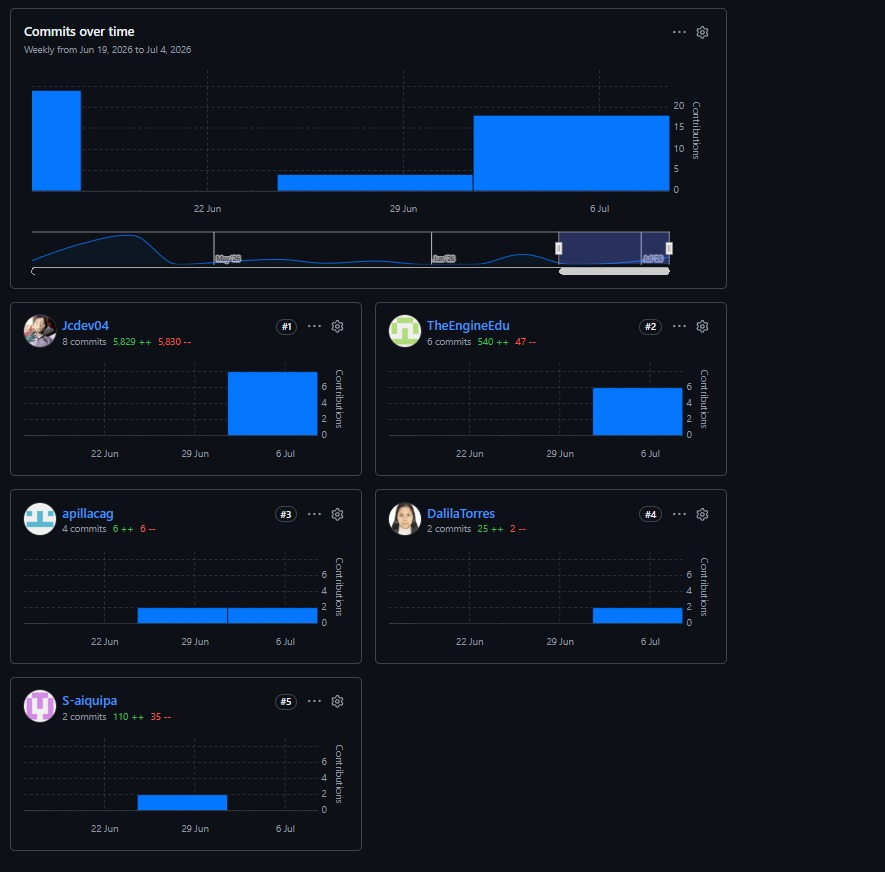

# Universidad Peruana de Ciencias Aplicadas

## Carrera de Ingeniería de Software

**1ASI0729**

**Desarrollo de Aplicaciones Open Source**

NRC

**10155**

**Informe del Trabajo Final**

Docente

**Mori Paiva, Hugo Allan**

Equipo

**CTR Technologies**

Proyecto

**Chapa Tu Ruta**

**Integrantes**

| **Código** | **Apellidos y Nombres**         |
| ---------- | ------------------------------- |
| U202322952 | Castillo Vidal, Jesús Ivan      |
| U20221F734 | Torres Sanchez, Dalila Victoria |
| U20241A911 | Aguirre Ramos, Eduardo Manuel   |
| U202418823 | Pillaca Gonzales, Andy Saúl     |
| U201916755 | Aiquipa Poma, Sebastian Andres  |

**Período 202610**

**Julio 2026**

## **Registro de versiones del Informe**

| Version | Fecha      | Autor                                                       | Descripción de modificación                                                               |
| ------- | ---------- | ----------------------------------------------------------- | ----------------------------------------------------------------------------------------- |
| 1.0     | 01/04/2026 | Aguirre Ramos, Eduardo Manuel                               | Agregó sección 1.1 Startup Profile y perfiles del equipo                                  |
| 1.1     | 03/04/2026 | Torres Sanchez, Dalila Victoria                             | Agregó sección 1.2 Antecedentes y Problemática (5W's y 2H's)                              |
| 1.2     | 05/04/2026 | Aiquipa Poma, Sebastian Andres                              | Agregó sección 1.3 Lean UX Process (Hypothesis Statements y Canvas)                       |
| 1.3     | 07/04/2026 | Pillaca Gonzales, Andy Saúl                                 | Agregó sección 2.1 Competidores y análisis competitivo                                    |
| 1.4     | 09/04/2026 | Castillo Vidal, Jesus Ivan                                  | Agregó sección 2.2 Registro de entrevistas por segmento objetivo                          |
| 1.5     | 11/04/2026 | Aguirre Ramos, Eduardo Manuel                               | Agregó sección 2.3 Needfinding: User Personas y User Journey Maps                         |
| 1.6     | 14/04/2026 | Torres Sanchez, Dalila Victoria                             | Agregó sección 3.1 To-Be Scenario Map e Impact Map                                        |
| 1.7     | 16/04/2026 | Aiquipa Poma, Sebastian Andres                              | Agregó sección 3.2 User Stories y Product Backlog                                         |
| 1.8     | 18/04/2026 | Pillaca Gonzales, Andy Saúl                                 | Agregó sección 4.1 Style Guidelines (General y Web)                                       |
| 1.9     | 20/04/2026 | Castillo Vidal, Jesus Ivan                                  | Agregó sección 4.2 Information Architecture y Navigation Systems                          |
| 1.10    | 21/04/2026 | Aguirre Ramos, Eduardo Manuel                               | Agregó sección 4.6 Domain-Driven Software Architecture (C4 Model)                         |
| 1.11    | 22/04/2026 | Aguirre Ramos, Eduardo Manuel / Pillaca Gonzales, Andy Saúl | Agregó sección 4.4 Wireframes de aplicación móvil                                         |
| 1.12    | 23/04/2026 | Castillo Vidal, Jesus Ivan / Aguirre Ramos, Eduardo Manuel  | Agregó sección 5.1 Software Configuration Management y Student Outcome                    |
| 1.13    | 23/04/2026 | Aiquipa Poma, Sebastian Andres                              | Agregó wireframes de aplicación web y registro de versiones a Capítulo 4                  |
| 1.14    | 23/04/2026 | Torres Sanchez, Dalila Victoria                             | Agregó conclusiones parciales del proyecto                                                |
| 1.15    | 23/04/2026 | Castillo Vidal, Jesus Ivan                                  | Agregó evidencia de desarrollo, mockups y assets del Sprint 1 a Capítulo 5                |
| 1.16    | 05/05/2026 | Aguirre Ramos, Eduardo Manuel                               | Agregó sección Sprint 2 y sus características a Capítulo 5                                |
| 1.17    | 06/05/2026 | Pillaca Gonzales, Andy Saúl                                 | Agregó Wireflow Diagrams y sección Mobile Web Browser a Capítulo 4                        |
| 1.18    | 07/05/2026 | Aiquipa Poma, Sebastian Andres                              | Refactorizó User Stories con criterios de aceptación en Gherkin en Capítulo 3             |
| 1.19    | 09/05/2026 | Aguirre Ramos, Eduardo Manuel                               | Agregó Application User Flow Diagrams a Capítulo 4                                        |
| 1.20    | 12/05/2026 | Aguirre Ramos, Eduardo Manuel                               | Agregó Sprint Planning 2, Sprint Backlog 2 y evidencias de ejecución a Capítulo 5         |
| 1.21    | 12/05/2026 | Aiquipa Poma, Sebastian Andres                              | Agregó Student Outcome TB1 y configuración de IDE y MySQL en sección 5.1.1                |
| 1.22    | 12/05/2026 | Pillaca Gonzales, Andy Saúl                                 | Agregó descripción de participación en TB1 al README                                      |
| 1.23    | 20/05/2026 | Aguirre Ramos, Eduardo Manuel                               | Agregó títulos y plantilla de Sprint Planning 3 a Capítulo 5                              |
| 1.24    | 24/05/2026 | Aguirre Ramos, Eduardo Manuel                               | Agregó Student Outcome de Eduardo Aguirre al README                                       |
| 1.25    | 25/05/2026 | Pillaca Gonzales, Andy Saúl                                 | Actualizó sección de conclusiones del informe                                             |
| 1.26    | 27/05/2026 | Castillo Vidal, Jesus Ivan                                  | Agregó diagramas de clases y mockups de UI de la aplicación web a Capítulo 4              |
| 1.27    | 27/05/2026 | Torres Sanchez, Dalila Victoria                             | Agregó Student Outcome TB1 al README                                                      |
| 1.28    | 15/06/2026 | Aiquipa Poma, Sebastian Andres                              | Agregó sección 5.3 Validation Interviews a Capítulo 5                                     |
| 1.29    | 16/06/2026 | Aguirre Ramos, Eduardo Manuel                               | Agregó Sprint Planning 3 a Capítulo 5                                                     |
| 1.30    | 17/06/2026 | Pillaca Gonzales, Andy Saúl                                 | Actualizó README para entrega AV2                                                         |
| 1.31    | 17/06/2026 | Aguirre Ramos, Eduardo Manuel                               | Agregó Sprint Backlog 3 y documentación de servicios del Sprint 3 a Capítulo 5            |
| 1.32    | 19/06/2026 | Pillaca Gonzales, Andy Saúl                                 | Agregó sección "About the Product" y registro de entrevista de validación conductor       |
| 1.33    | 19/06/2026 | Aiquipa Poma, Sebastian Andres                              | Agregó evaluación heurística (5.3.3) y segunda entrevista de validación a Capítulo 5      |
| 1.34    | 19/06/2026 | Aguirre Ramos, Eduardo Manuel                               | Agregó evidencia de desarrollo, despliegue y team collaboration del Sprint 3 a Capítulo 5 |
| 1.35    | 19/06/2026 | Castillo Vidal, Jesus Ivan                                  | Actualizó conclusiones, estructura del README y tabla de contenidos para entrega AV2      |
| 1.36    | 04/07/2026 | Pillaca Gonzales, Andy Saúl                                 | Actualizó Student Outcome versión final en README       
| 1.37    | 07/07/2026 | Aguirre Ramos, Eduardo Aguirre                                 | Se completo el sprint 4 en su totalidad                                   |

## Project Report Collaboration Insights

Para el desarrollo del Project Report, se utilizó un repositorio dentro de la organización del equipo en GitHub. A continuación, se presenta la evidencia de colaboración correspondiente, en coherencia con el Registro de Versiones del Informe.

Repositorio del informe del proyecto: <a href="https://github.com/Startup-x-upc/landing-page">https://github.com/Startup-x-upc/landing-page</a>

## AV1

Durante esta fase, el equipo elaboró el informe base del proyecto, abarcando la definición del problema, justificación, objetivos, marco teórico y todas las secciones correspondientes al primer entregable.

Figura 1: Gráfico de contribuciones del repositorio del informe del proyecto para TB1, mostrando la actividad de colaboración de todos los miembros del equipo durante la elaboración del informe inicial.

**Resumen de Contribuciones:**
En base al historial del repositorio y la gráfica mostrada, se registran un total de **161 commits** para el informe del proyecto en esta etapa. El desglose de los aportes por cada integrante del equipo es el siguiente:

- **Andy Pillaca Gonzales:** 54 commits
- **Jesús Castillo Vidal:** 30 commits
- **Dalila Torres Sanchez:** 25 commits
- **Eduardo Aguirre Ramos:** 24 commits
- **Sebastian Aiquipa Poma:** 22 commits
- **James Delgado Perez:** 6 commits

Esta distribución evidencia un esfuerzo colaborativo y la participación activa de todos los integrantes en la elaboración y redacción de la documentación del proyecto.

## TB1

Durante esta fase, el equipo incorporó los avances correspondientes al primer entregable parcial,
incluyendo diagramas, wireflows, sprint 2 y mejoras al informe base.

Figura 2: Gráfico de contribuciones del repositorio del informe del proyecto para TB1, mostrando
la actividad de colaboración de todos los miembros del equipo durante el periodo 24/04/2026 al 27/05/2026.

**Resumen de Contribuciones:**
En base al historial del repositorio y la gráfica mostrada, se registran un total de **30 commits**
para el informe del proyecto en esta etapa. El desglose de los aportes por cada integrante del equipo es el siguiente:

- **Eduardo Aguirre Ramos:** 18 commits
- **Andy Pillaca Gonzales:** 5 commits
- **Sebastian Aiquipa Poma:** 3 commits
- **Jesús Castillo Vidal:** 3 commits
- **Dalila Torres Sanchez:** 1 commit

Esta distribución evidencia la participación activa de todos los integrantes en la elaboración
y redacción de la documentación del proyecto durante esta etapa.

---

## AV2

Durante esta fase, el equipo consolidó la segunda entrega académica, incorporando el Sprint 3,
las entrevistas de validación, la evaluación heurística y la actualización del Student Outcome.

Figura 3: Gráfico de contribuciones del repositorio del informe del proyecto para AV2, mostrando
la actividad de colaboración de todos los miembros del equipo durante el periodo 18/06/2026 al 4/07/2026.

**Resumen de Contribuciones:**
En base al historial del repositorio y la gráfica mostrada, se registran un total de **24 commits**
para el informe del proyecto en esta etapa. El desguste de los aportes por cada integrante del equipo es el siguiente:

- **Eduardo Aguirre Ramos:** 11 commits
- **Jesús Castillo Vidal:** 5 commits
- **Sebastian Aiquipa Poma:** 4 commits
- **Andy Pillaca Gonzales:** 4 commits

Esta distribución evidencia el esfuerzo colaborativo del equipo en la elaboración de la documentación
correspondiente a la validación del producto y cierre de la segunda entrega académica.

## TB2

Durante esta fase, el equipo consolidó la entrega final del trabajo cumpliendo lo solicitado y la actualización del Student Outcome.

Figura 3: Gráfico de contribuciones del repositorio del informe del proyecto para AV2, mostrando
la actividad de colaboración de todos los miembros del equipo durante el periodo 28/05/2026 al 19/06/2026.

**Resumen de Contribuciones:**
En base al historial del repositorio y la gráfica mostrada, se registran un total de **38 commits**
para el informe del proyecto en esta etapa. El desguste de los aportes por cada integrante del equipo es el siguiente:

- **Jesús Castillo Vidal:** 8 commits
- **Eduardo Aguirre Ramos:** 6 commits
- **Andy Pillaca Gonzales:** 4 commits
- **Sebastian Aiquipa Poma:** 2 commits
- **Dalila Torres Sanchez:** 2 commit

Esta distribución evidencia el esfuerzo colaborativo del equipo en la elaboración de la documentación
correspondiente a la validación del producto y cierre de la segunda entrega académica.

# Tabla de contenidos

## [Capítulo I: Introducción](Capitulo_1.md)

- [1.1 Startup Profile](Capitulo_1.md#11-startup-profile)
  - [1.1.1 Descripción de la Startup](Capitulo_1.md#111-descripción-de-la-startup)
  - [1.1.2 Perfiles de integrantes del equipo](Capitulo_1.md#112-perfiles-de-integrantes-del-equipo)
- [1.2 Solution Profile](Capitulo_1.md#12-solution-profile)
  - [1.2.1 Antecedentes y problemática](Capitulo_1.md#121-antecedentes-y-problemática)
  - [1.2.2 Lean UX Process](Capitulo_1.md#122-lean-ux-process)
    - [1.2.2.1 Lean UX Problem Statements](Capitulo_1.md#1221-lean-ux-problem-statements)
    - [1.2.2.2 Lean UX Assumptions](Capitulo_1.md#1222-lean-ux-assumptions)
    - [1.2.2.3 Lean UX Hypothesis Statements](Capitulo_1.md#1223-lean-ux-hypothesis-statements)
    - [1.2.2.4 Lean UX Canvas](Capitulo_1.md#1224-lean-ux-canvas)
- [1.3 Segmentos Objetivos](Capitulo_1.md#13-segmentos-objetivo)

## [Capítulo II: Requirements Elicitation & Analysis](Capitulo_2.md)

- [2.1 Competidores](Capitulo_2.md#21-competidores)
  - [2.1.1 Análisis competitivo](Capitulo_2.md#211-análisis-competitivo)
  - [2.1.2 Estrategias y tácticas frente a competidores](Capitulo_2.md#212-estrategias-y-tácticas-frente-a-competidores)
- [2.2 Entrevistas](Capitulo_2.md#22-entrevistas)
  - [2.2.1 Diseño de entrevistas](Capitulo_2.md#221-diseño-de-entrevistas)
  - [2.2.2 Registro de entrevistas](Capitulo_2.md#222-registro-de-entrevistas)
  - [2.2.3 Análisis de entrevistas](Capitulo_2.md#223-análisis-de-entrevistas)
- [2.3 Needfinding](Capitulo_2.md#23-needfinding)
  - [2.3.1 User Personas](Capitulo_2.md#231-user-personas)
  - [2.3.2 User Task Matrix](Capitulo_2.md#232-user-task-matrix)
  - [2.3.3 User Journey Mapping](Capitulo_2.md#233-user-journey-mapping)
  - [2.3.4 Empathy Mapping](Capitulo_2.md#234-empathy-mapping)
- [2.4 Big Picture EventStorming](Capitulo_2.md#24-big-picture-eventstorming)
- [2.5 Ubiquitous Language](Capitulo_2.md#25-ubiquitous-language)

## [Capítulo III: Requirements Specification](Capitulo_3.md)

- [3.1 User Stories](Capitulo_3.md#31-user-stories)
- [3.2 Impact Mapping](Capitulo_3.md#32-impact-mapping)
- [3.3 Product Backlog](Capitulo_3.md#33-product-backlog)

## [Capítulo IV: Product Design](Capitulo_4.md)

- [4.1 Style Guidelines](Capitulo_4.md#41-style-guidelines)
  - [4.1.1 General Style Guidelines](Capitulo_4.md#411-general-style-guidelines)
  - [4.1.2 Web Style Guidelines](Capitulo_4.md#412-web-style-guidelines)
- [4.2 Information Architecture](Capitulo_4.md#42-information-architecture)
  - [4.2.1 Organization Systems](Capitulo_4.md#421-organization-systems)
  - [4.2.2 Labeling Systems](Capitulo_4.md#422-labeling-systems)
  - [4.2.3 SEO Tags and Meta Tags](Capitulo_4.md#423-seo-tags-and-meta-tags)
  - [4.2.4 Searching Systems](Capitulo_4.md#424-searching-systems)
  - [4.2.5 Navigation Systems](Capitulo_4.md#425-navigation-systems)
- [4.3 Landing Page UI Design](Capitulo_4.md#43-landing-page-ui-design)
  - [4.3.1 Landing Page Wireframe](Capitulo_4.md#431-landing-page-wireframe)
  - [4.3.2 Landing Page Mock-up](Capitulo_4.md#432-landing-page-mock-up)
- [4.4 Web Applications UX/UI Design](Capitulo_4.md#44-web-applications-uxui-design)
  - [4.4.1 Web Applications Wireframes](Capitulo_4.md#441-web-applications-wireframes)
  - [4.4.2 Web Applications Wireflow Diagrams](Capitulo_4.md#442-web-applications-wireflow-diagrams)
  - [4.4.3 Web Applications Mock-ups](Capitulo_4.md#443-web-applications-mock-ups)
  - [4.4.4 Web Applications User Flow Diagrams](Capitulo_4.md#444-web-applications-user-flow-diagrams)
- [4.5 Web Applications Prototyping](Capitulo_4.md#45-web-applications-prototyping)
- [4.6 Domain-Driven Software Architecture](Capitulo_4.md#46-domain-driven-software-architecture)
  - [4.6.1 Design-Level EventStorming](Capitulo_4.md#461-design-level-eventstorming)
  - [4.6.2 Software Architecture Context Diagram](Capitulo_4.md#462-software-architecture-context-diagram)
  - [4.6.3 Software Architecture Container Diagrams](Capitulo_4.md#463-software-architecture-container-diagrams)
  - [4.6.4 Software Architecture Components Diagrams](Capitulo_4.md#464-software-architecture-components-diagrams)
- [4.7 Software Object-Oriented Design](Capitulo_4.md#47-software-object-oriented-design)
  - [4.7.1 Class Diagrams](Capitulo_4.md#471-class-diagrams)
  - [4.7.2 Class Dictionary](Capitulo_4.md#472-class-dictionary)
- [4.8 Database Design](Capitulo_4.md#48-database-design)
  - [4.8.1 Database Diagrams](Capitulo_4.md#481-database-diagrams)
- [4.9 DDD Estratégico](Capitulo_4.md#49-ddd-estratégico)

## [Capítulo V: Product Implementation, Validation & Deployment](Capitulo_5.md)

- [5.1 Software Configuration Management](Capitulo_5.md#51-software-configuration-management)
  - [5.1.1 Software Development Environment Configuration](Capitulo_5.md#511-software-development-environment-configuration)
  - [5.1.2 Source Code Management](Capitulo_5.md#512-source-code-management)
  - [5.1.3 Source Code Style Guide & Conventions](Capitulo_5.md#513-source-code-style-guide--conventions)
  - [5.1.4 Software Deployment Configuration](Capitulo_5.md#514-software-deployment-configuration)
- [5.2 Landing Page, Services & Applications Implementation](Capitulo_5.md#52-landing-page-services--applications-implementation)
  - [5.2.1 Sprint 1](Capitulo_5.md#521-sprint-1)
    - [5.2.1.1 Sprint Planning 1](Capitulo_5.md#5211-sprint-planning-1)
    - [5.2.1.2 Aspect Leaders and Collaborators](Capitulo_5.md#5212-aspect-leaders-and-collaborators)
    - [5.2.1.3 Sprint Backlog 1](Capitulo_5.md#5213-sprint-backlog-1)
    - [5.2.1.4 Development Evidence for Sprint Review](Capitulo_5.md#5214-development-evidence-for-sprint-review)
    - [5.2.1.5 Execution Evidence for Sprint Review](Capitulo_5.md#5215-execution-evidence-for-sprint-review)
    - [5.2.1.6 Services Documentation Evidence for Sprint Review](Capitulo_5.md#5216-services-documentation-evidence-for-sprint-review)
    - [5.2.1.7 Software Deployment Evidence for Sprint Review](Capitulo_5.md#5217-software-deployment-evidence-for-sprint-review)
    - [5.2.1.8 Team Collaboration Insights during Sprint](Capitulo_5.md#5218-team-collaboration-insights-during-sprint)
  - [5.2.2 Sprint 2](Capitulo_5.md#522-sprint-2)
    - [5.2.2.1 Sprint Planning 2](Capitulo_5.md#5221-sprint-planning-2)
    - [5.2.2.2 Aspect Leaders and Collaborators](Capitulo_5.md#5222-aspect-leaders-and-collaborators)
    - [5.2.2.3 Sprint Backlog 2](Capitulo_5.md#5223-sprint-backlog-2)
    - [5.2.2.4 Development Evidence for Sprint Review](Capitulo_5.md#5224-development-evidence-for-sprint-review)
    - [5.2.2.5 Execution Evidence for Sprint Review](Capitulo_5.md#5225-execution-evidence-for-sprint-review)
    - [5.2.2.6 Services Documentation Evidence for Sprint Review](Capitulo_5.md#5226-services-documentation-evidence-for-sprint-review)
    - [5.2.2.7 Software Deployment Evidence for Sprint Review](Capitulo_5.md#5227-software-deployment-evidence-for-sprint-review)
    - [5.2.2.8 Team Collaboration Insights during Sprint](Capitulo_5.md#5228-team-collaboration-insights-during-sprint)
  - [5.2.3 Sprint 3](Capitulo_5.md#523-sprint-3)
    - [5.2.3.1 Sprint Planning 3](Capitulo_5.md#5231-sprint-planning-3)
    - [5.2.3.2 Aspect Leaders and Collaborators](Capitulo_5.md#5232-aspect-leaders-and-collaborators)
    - [5.2.3.3 Sprint Backlog 3](Capitulo_5.md#5233-sprint-backlog-3)
    - [5.2.3.4 Development Evidence for Sprint Review](Capitulo_5.md#5234-development-evidence-for-sprint-review)
    - [5.2.3.5 Execution Evidence for Sprint Review](Capitulo_5.md#5235-execution-evidence-for-sprint-review)
    - [5.2.3.6 Services Documentation Evidence for Sprint Review](Capitulo_5.md#5236-services-documentation-evidence-for-sprint-review)
    - [5.2.3.7 Software Deployment Evidence for Sprint Review](Capitulo_5.md#5237-software-deployment-evidence-for-sprint-review)
    - [5.2.3.8 Team Collaboration Insights during Sprint](Capitulo_5.md#5238-team-collaboration-insights-during-sprint)
- [5.3 Validation Interviews](Capitulo_5.md#53-validation-interviews)
  - [5.3.1 Diseño de Entrevistas](Capitulo_5.md#531-diseño-de-entrevistas)
  - [5.3.2 Registro de Entrevistas](Capitulo_5.md#532-registro-de-entrevistas)
  - [5.3.3 Evaluaciones según heurísticas](Capitulo_5.md#533-evaluaciones-según-heurísticas)
- [5.4 About-the-Product](Capitulo_5.md#54-about-the-product)

## [Conclusiones](Conclusiones_bibliografica.md#conclusiones)

- [Conclusiones y recomendaciones](Conclusiones_bibliografica.md#conclusiones-y-recomendaciones)
- [Video About-the-Team](Conclusiones_bibliografica.md#video-about-the-team)

## [Bibliografía](Conclusiones_bibliografica.md#bibliografía)

## [Anexos](Conclusiones_bibliografica.md#anexos)

## Student Outcome

Criterio: Capacidad de comunicarse efectivamente con un rango de audiencias.
En el siguiente cuadro se describe las acciones realizadas y enunciados de conclusiones por parte del grupo, que permiten sustentar el haber alcanzado el logro del ABET – EAC - Student Outcome 3

| Criterio Específico                                                   | Acciones realizadas                                                                                                                                                                                                                                                                                                                                                                                                                                                                                                                                                                                                                                                                                                                                                                                                                                                                                                                                                                                                                                                                                                                                                                                                                                                                                                                                                                                                                                                                                                                                                                                                                                                                                                                                                                                                                                                                                                                                                                                                                                                                                                                                                                                                                                                                                                                                                                                                                                                                                                                                                                                                                                                                                                                                                                                                                                                                                                                                                                                                                                                                                                                                                                                                                                                                                                                                                                                                                                                                                                                                                                                                                                                                                                                                                                                                                                                                                                                                                                                                                                                                                                                                                                                                                                                                                                                                                                                                                                                                                                                                                                                                                                                                                                                                                                                                                                                                                                                                                                                                                                                                                                                                                                                                                                                                                                                                                                                                                                                                                                                                                                                                                                                                                                                                                                                                                                                                                                                                                                                                                                                                                                                     | Conclusiones                                                                                                                                                                                                                                                                                                                                                                                                                                                                                                                                                                                                                                                                                                                                                                                                                                                                                                                                                                                                                                                                                                                                                                                                                                                                                                                                                                                                                                                                                                                                                                                                                                                                                                                                                                                                                                                                                                                                                                                                                                                                                                                             |
| --------------------------------------------------------------------- | --------------------------------------------------------------------------------------------------------------------------------------------------------------------------------------------------------------------------------------------------------------------------------------------------------------------------------------------------------------------------------------------------------------------------------------------------------------------------------------------------------------------------------------------------------------------------------------------------------------------------------------------------------------------------------------------------------------------------------------------------------------------------------------------------------------------------------------------------------------------------------------------------------------------------------------------------------------------------------------------------------------------------------------------------------------------------------------------------------------------------------------------------------------------------------------------------------------------------------------------------------------------------------------------------------------------------------------------------------------------------------------------------------------------------------------------------------------------------------------------------------------------------------------------------------------------------------------------------------------------------------------------------------------------------------------------------------------------------------------------------------------------------------------------------------------------------------------------------------------------------------------------------------------------------------------------------------------------------------------------------------------------------------------------------------------------------------------------------------------------------------------------------------------------------------------------------------------------------------------------------------------------------------------------------------------------------------------------------------------------------------------------------------------------------------------------------------------------------------------------------------------------------------------------------------------------------------------------------------------------------------------------------------------------------------------------------------------------------------------------------------------------------------------------------------------------------------------------------------------------------------------------------------------------------------------------------------------------------------------------------------------------------------------------------------------------------------------------------------------------------------------------------------------------------------------------------------------------------------------------------------------------------------------------------------------------------------------------------------------------------------------------------------------------------------------------------------------------------------------------------------------------------------------------------------------------------------------------------------------------------------------------------------------------------------------------------------------------------------------------------------------------------------------------------------------------------------------------------------------------------------------------------------------------------------------------------------------------------------------------------------------------------------------------------------------------------------------------------------------------------------------------------------------------------------------------------------------------------------------------------------------------------------------------------------------------------------------------------------------------------------------------------------------------------------------------------------------------------------------------------------------------------------------------------------------------------------------------------------------------------------------------------------------------------------------------------------------------------------------------------------------------------------------------------------------------------------------------------------------------------------------------------------------------------------------------------------------------------------------------------------------------------------------------------------------------------------------------------------------------------------------------------------------------------------------------------------------------------------------------------------------------------------------------------------------------------------------------------------------------------------------------------------------------------------------------------------------------------------------------------------------------------------------------------------------------------------------------------------------------------------------------------------------------------------------------------------------------------------------------------------------------------------------------------------------------------------------------------------------------------------------------------------------------------------------------------------------------------------------------------------------------------------------------------------------------------------------------------------------------------------------- | ---------------------------------------------------------------------------------------------------------------------------------------------------------------------------------------------------------------------------------------------------------------------------------------------------------------------------------------------------------------------------------------------------------------------------------------------------------------------------------------------------------------------------------------------------------------------------------------------------------------------------------------------------------------------------------------------------------------------------------------------------------------------------------------------------------------------------------------------------------------------------------------------------------------------------------------------------------------------------------------------------------------------------------------------------------------------------------------------------------------------------------------------------------------------------------------------------------------------------------------------------------------------------------------------------------------------------------------------------------------------------------------------------------------------------------------------------------------------------------------------------------------------------------------------------------------------------------------------------------------------------------------------------------------------------------------------------------------------------------------------------------------------------------------------------------------------------------------------------------------------------------------------------------------------------------------------------------------------------------------------------------------------------------------------------------------------------------------------------------------------------------------- |
| Comunica oralmente con efectividad a diferentes rangos de audiencia.  | **Aguirre Ramos, Eduardo Manuel**  **AV1:** Tome el papel de lider del grupo. Realize los Lean Ux Problem Statements y Analisis Competitivo. Desarrolle los web applications wireframes and prototyping. Ademas de colaborar en las user stories.Mediante el video de la elaboración del AV1 se pudo apreciar el primer avance del proyecto implementando todas las tecnologías y el landing page hecho hasta ese momento **TB1:** En la sustentación oral del TB1, comuniqué con precisión el progreso técnico del proyecto explicando las competencias, tecnologias y los problemas que tuvo nuestro proyecto hasta esta entrega. Mantuve una tono fluido y profesional de acuerdo al proyecto presentado, utilizando la terminología exacta de la arquitectura orientada a servicios, asegurando que la complejidad técnica del sistema fuera comprensible tanto para usted como para mis compañeros. **AV2:** Sustenté la planificación del Sprint 3 y la demo técnica de la integración de las interfaces de registro para pasajeros y conductores, explicando detalladamente los mecanismos de validación de formularios y la persistencia de estados de sesión ante el docente y compañeros. **TB2:** Me desarrolle de manera oral eficientemente cumpliendo con lo establecido en la rúbrica teniendo en cuenta las oportunidades de mejoras mencionadas en el anterior sprint. **Pillaca Gonzales, Andy Saúl**  **AV1:** Definio las estrategias y tacticas frente a competidores. Definio los User persona. Desarrollo los web applications mock-ups   **TB1:** Encargado de desarrollar el Domain y las Entities correspondientes a los cinco Bounded Contexts definidos en la arquitectura basada en Domain-Driven Design. Asimismo, elaboró los Wireflows del sistema en formato Markdown, representando la navegación y flujo de interacción entre las principales funcionalidades de la aplicación.  **AV2:** Participé en la actualización de las conclusiones del informe considerando la retroalimentación brindada por el docente durante la evaluación del TB1, sustentando las mejoras realizadas y la justificación de los cambios efectuados. Asimismo, apoyé en el desarrollo y explicación de los bounded contexts IAM (Identity and Access Management) y Shared, comunicando la estructura y responsabilidades de cada contexto dentro de la arquitectura basada en Domain-Driven Design. Adicionalmente, colaboré en el proceso de internacionalización de la Landing Page y en la elaboración del video "About the Product", contribuyendo a la presentación clara de las funcionalidades y propuesta de valor del sistema para diferentes audiencias. **TB2:** Sustentó la integración final de los recursos multimedia y videos de presentación del producto en la Landing Page, exponiendo con claridad el valor de negocio de la solución y respondiendo preguntas técnicas del docente y compañeros. **Castillo Vidal, Jesus Ivan** **AV1:** Desarrollo los user stories, impact mapping, product mapping y product backlog. Definio y elaboro el design-level event storming. Finalmente el software object-oriented design **TB1:** Sustenté oralmente la implementación del frontend de la aplicación web y su integración y conexión con la Fake API (json-server), explicando con claridad el flujo de datos y cómo se mapeaban los endpoints de la API con los servicios del frontend, asegurando que la demo interactiva fuera comprensible. **AV2:** Coordiné con el equipo para designar las tareas del desarrollo de frontend y backend, y sustenté oralmente la planificación y el estado del proyecto en este aspecto. **TB2:** Sustenté la demo final de la aplicación web, detallando la implementación y funcionamiento de los flujos de cancelación de viaje en tiempo real y la consulta del historial de viajes para pasajeros y conductores ante el docente y compañeros de clase. **Torres Sanchez, Dalila Victoria**  **AV1:** Investigo los antecedentes y problematica. Definio el user journey mapping. Modelo el landing page wireframe y web applications wireframes  **TB1:** Se enfocó en realizar las correcciones de los links en el project report y el avance de la capa presentación. y se aseguró de que su explicación oral fuera clara y comprensible **AV2:** Participé en la planificación del sprint 3, donde tuve la oportunidad de exponer mis ideas y propuestas frente a mis compañeros. **TB2:** Llevé a cabo una entrevista de validación de la aplicación final con un usuario real, con el objetivo de evaluar su experiencia, identificar posibles puntos de mejora y confirmar que el producto cumplía con sus expectativas. Al mismo tiempo, fui receptiva a sus comentarios, planteando preguntas abiertas para profundizar en sus impresiones y registrando sus sugerencias con precisión. Posteriormente, transmití estos hallazgos al equipo de desarrollo en una reunión interna, resumiendo los puntos clave y traduciendo las necesidades del usuario en acciones concretas para el cierre del proyecto. **Aiquipa Poma, Sebastian Andres** **AV1:** Analisis de entrevistas, style guidelines el Domain-Driven software Arquitecture y el Database Design **TB1:** Explico la estructura de la arquitectura basada en Domain-Driven Design aplicada al proyecto, presentando la organizacion de la capa Application en los cinco Bounded Contexts. Ademas, sustento las correcciones realizadas en las User Stories y Technical Stories. **AV2:** Sustentó el bounded context de Monetización desarrollado completamente bajo arquitectura Domain-Driven Design, explicando las decisiones técnicas tomadas en cada capa (domain, application, infrastructure e interfaces) ante el docente y compañeros. Asimismo, expuso el diseño de las entrevistas de validación definidas para la sección 5.3.1 del informe, comunicando de forma clara la metodología, los user flows y las preguntas estructuradas para cada segmento objetivo.                                                                                                                                                                                                                                                                                                                                                                                                                                                                              **TB2:** Sustentó oralmente el desarrollo de las historias de usuario de calificaciones y reputación en el frontend de la aplicación web, así como la arquitectura y lógica de negocio del bounded context de Monetización en el backend, demostrando el funcionamiento de las transacciones y comisiones ante el docente y compañeros. | **AV1** Durante la entrega AV1, el equipo expuso el perfil del startup y la problemática identificada en zonas periféricas de Lima ante el docente y compañeros de clase, adaptando el discurso a una audiencia técnica universitaria. La presentación de los resultados del proceso Lean UX permitió al equipo ejercitar la comunicación oral de ideas abstractas de diseño de forma estructurada y comprensible. El equipo demostró capacidad para comunicar oralmente los hallazgos de entrevistas con usuarios (mototaxistas y pasajeros), sintetizando información cualitativa ante una audiencia no familiarizada con el dominio del problema.   **TB1** Durante la entrega TB1, el equipo presentó el inicio del desarrollo frontend del proyecto y la planificación técnica correspondiente al Sprint 2 ante el docente y compañeros de clase, explicando la organización de bounded contexts y las User Stories priorizadas para la iteración. La exposición de la arquitectura basada en Domain-Driven Design permitió al equipo comunicar de forma estructurada la relación entre requerimientos funcionales, componentes del sistema y responsabilidades técnicas dentro del proyecto. Asimismo, la sustentación de las decisiones de diseño y organización del backlog permitió transmitir conceptos técnicos de desarrollo de software de manera clara y comprensible  **AV2** El equipo consolidó una comunicación oral efectiva al presentar de manera estructurada las demostraciones de integración del sistema y explicar las decisiones técnicas implementadas en el backend con Spring Boot. Además, adaptó sus exposiciones a audiencias con distintos niveles de conocimiento técnico, evidenciando dominio del proyecto y claridad durante las revisiones de cada sprint.  **TB2** El equipo comunicó el desarrollo y los resultados alcanzados de forma organizada y coherente, justificando las decisiones técnicas adoptadas y presentando el funcionamiento del sistema de manera comprensible tanto para una audiencia técnica como para personas sin conocimientos especializados. |
| Comunica por escrito con efectividad a diferentes rangos de audiencia | **Aguirre Ramos, Eduardo Manuel** **AV1:** Actue como lider del grupo para este proyecto. Realize y redacte explicitamente las herramientas de Lean Ux Problem Statements y Analisis Competitivo.Ademas de contribuir en la creación de los web applications wireframes and prototyping. **TB1:** Aseguré una comunicación escrita efectiva en el informe del TB1 mediante la documentación detallada del proceso de ingeniería seguido para el desarrollo de esta etapa desarrollando el Sprint Planning 2 y Sprint Backlog 2. Asimismo, redacté un análisis retrospectivo basado en los resultados del AV1, especificando las acciones correctivas aplicadas para subsanar errores previos y detallando las propuestas de mejora continua implementadas tanto en la estructura del informe técnico como en el funcionamiento y arquitectura de la aplicación web. **AV2:** Redacté la documentación correspondiente al Sprint Planning 3 y la actualización de los diagramas de componentes (C4 Model) del sistema. Además, documenté detalladamente la implementación técnica de los formularios de registro (pasajero y conductor) y la lógica de cierre de sesión, especificando las validaciones y el manejo de almacenamiento local. **TB2:** Se implemento correcciones al respectivo documento incluyendo todos los aspectos para lograr una mejoraria al momento de redactar un buen trabajo **Pillaca Gonzales, Andy Saúl** **AV1:** Definio las estrategias y tacticas frente a competidores. Definio los User persona. Desarrollo los web applications mock-ups  **TB1:** Documentó la estructura del Domain y las Entities dentro de la arquitectura del sistema aplicando principios de Domain-Driven Design. Asimismo, elaboró los Wireflows en formato Markdown, permitiendo representar de manera clara y organizada la navegación e interacción de los usuarios con las funcionalidades principales de la aplicación.  **AV2:** Actualizó las conclusiones del informe incorporando las observaciones y recomendaciones realizadas por el docente en la retroalimentación del TB1, mejorando la coherencia y calidad del documento. Asimismo, documentó aspectos relacionados con los bounded contexts IAM y Shared dentro de la arquitectura Domain-Driven Design, describiendo sus componentes y responsabilidades. También participó en la internacionalización de la Landing Page, adaptando los contenidos para distintos idiomas, y colaboró en la elaboración del guion y contenido del video "About the Product", asegurando una comunicación escrita clara y orientada tanto a audiencias técnicas como no técnicas. **TB2** Contribuí al cumplimiento de los objetivos del proyecto mediante la implementación e integración de los videos About the Team y About the Product en la Landing Page, dando solución a observaciones identificadas durante la revisión del proyecto y asegurando el cumplimiento de los requisitos establecidos para la entrega final. Asimismo, apoyé en la actualización de la documentación del informe, manteniendo la coherencia entre la implementación desarrollada y las evidencias presentadas. De igual manera, colaboré con el equipo de backend en actividades de integración y validación de funcionalidades, manteniendo una comunicación constante con los demás integrantes para resolver dependencias técnicas y garantizar una entrega organizada y de calidad. **Castillo Vidal, Jesus Ivan** **AV1:** Desarrollo los user stories, impact mapping, product mapping y product backlog. Definio y elaboro el design-level event storming. Finalmente el software object-oriented design  **TB1:** Documenté la integración y conexión del frontend de la aplicación web con la Fake API (json-server), detallando la configuración de los servicios mock, los endpoints consumidos y la simulación del almacenamiento de datos para las pruebas del sistema. **AV2:** Documenté la planificación, asignación y coordinación de tareas con el equipo para iniciar y realizar mejoras en el frontend y backend del producto. **TB2:** Documenté la implementación del frontend para las historias de usuario de cancelación de viajes (US-18) e historial de viajes (US-24, US-25). Asimismo, apoyé en la actualización de las conclusiones del informe final, la tabla de contenidos y el README.md para asegurar una entrega de calidad. **Torres Sanchez, Dalila Victoria**  **AV1:** Investigo los antecedentes y problematica. Definio el user journey mapping. Modelo el landing page wireframe y web applications wireframes **TB1:** En la corrección de la entrega anterior, orientó el reporte escrito a corregir los links para que quedara bien estructurado y comprensible. **AV2:** Revisé y actualicé la documentación del proyecto, asegurándome de que estuviera clara, completa y accesible. **TB2:** Participé en las tareas de desarrollo del backend, también me aseguré de documentar de manera clara y ordenada los avances realizados. **Aiquipa Poma, Sebastian Andres** **AV1:** Analisis de entrevistas, style guidelines el Domain-Driven software Arquitecture y el Database Design **TB1:** Se Corrigio la nomenclatura y estructura de las User Stories y Technical Stories del Product Backlog, alineandolas con el formato Gherkin y asegurando consistencia en criterios de aceptacion e identificadores. Asimismo, Se documento la capa Application de los cinco Bounded Contexts aplicando Domain-Driven Design, definiendo casos de uso, comandos, queries y servicios de aplicacion dentro de la arquitectura del sistema. **AV2:** Implementó y documentó el bounded context de Monetización en su totalidad, abarcando las cuatro capas de la arquitectura Domain-Driven Design: domain (agregados, entidades, comandos, queries y repositorios), application (command y query handlers), infrastructure (persistencia JPA y repositorios) e interfaces (REST controllers y recursos). Asimismo, redactó la sección 5.3.1 Diseño de Entrevistas de Validación en el informe del proyecto, definiendo objetivo, metodología, user flows y preguntas estructuradas para los segmentos de pasajeros y conductores. **TB2:** Documentó el diseño y los resultados de las entrevistas de validación (secciones 5.3.1 y 5.3.2) y la evaluación según heurísticas de usabilidad (sección 5.3.3) en el Capítulo 5. Asimismo, implementó en el frontend las vistas y lógica de calificaciones post-viaje (US-21, US-22) e integración del puntaje de reputación en el perfil (US-23), y reestructuró y formateó el README.md para la entrega final. | **AV1** En la entrega AV1, el equipo redactó el Capítulo 1 del informe, documentando antecedentes, problemática y el proceso Lean UX con un lenguaje técnico apropiado para lectores con formación en ingeniería de software. La elaboración de User Personas, User Journey Maps y el Impact Map implicó comunicar por escrito necesidades y comportamientos de usuarios reales, dirigiéndose simultáneamente a una audiencia técnica y a partes interesadas no técnicas. El uso de GitHub con commits convencionales y pull requests estructurados evidencia la capacidad del equipo de comunicar cambios y decisiones de desarrollo de forma escrita, clara y trazable.    **TB1** En la entrega TB1, el equipo documentó el inicio del desarrollo frontend, la definición de bounded contexts y la planificación de User Stories y Technical Stories correspondientes al Sprint 2, utilizando una estructura alineada con prácticas ágiles y Domain-Driven Design. La estandarización de User Stories bajo el formato Connextra y de criterios de aceptación mediante sintaxis Gherkin permitió mejorar la claridad y trazabilidad de los requerimientos funcionales del sistema. Asimismo, la documentación de la arquitectura y de los componentes de aplicación permitió comunicar de manera organizada las decisiones técnicas del proyecto hacia una audiencia académica y de ingeniería de software.   **AV2** El equipo elaboró un informe técnico claro y bien estructurado, documentando de manera detallada los contratos de la API mediante Swagger y describiendo la configuración del despliegue en la nube. Esta documentación facilitó la comprensión del flujo de información y de la arquitectura distribuida del sistema para usuarios con perfiles tanto técnicos como de negocio.  **TB2** El equipo preparó una documentación organizada y completa del proyecto, registrando el desarrollo realizado, las decisiones de carácter técnico y los resultados alcanzados. De esta manera, la información quedó presentada de forma comprensible para diferentes tipos de audiencia.         |

