<div align="center">


# Universidad Peruana de Ciencias Aplicadas

## Carrera de Ingeniería de Software

**1ASI0729**

**Desarrollo de Aplicaciones Open Source**

NRC

**10155**

**Informe del Trabajo Final**

Docente

**Mori Paiva, Hugo Allan**

Equipo

**CTR Technologies**

Proyecto

**Chapa Tu Ruta**

**Integrantes**

| **Código** | **Apellidos y Nombres**         |
| ---------- | ------------------------------- |
| U202322952 | Castillo Vidal, Jesús Ivan      |
| U20221F734 | Torres Sanchez, Dalila Victoria |
| U20241A911 | Aguirre Ramos, Eduardo Manuel   |
| U202418823 | Pillaca Gonzales, Andy Saúl     |
| U201916755 | Aiquipa Poma, Sebastian Andres  |

**Período 202610**

**Julio 2026**

</div>
<div style="page-break-after: always;"></div>

## **Registro de versiones del Informe**

| Version | Fecha      | Autor                                                       | Descripción de modificación                                                               |
| ------- | ---------- | ----------------------------------------------------------- | ----------------------------------------------------------------------------------------- |
| 1.0     | 01/04/2026 | Aguirre Ramos, Eduardo Manuel                               | Agregó sección 1.1 Startup Profile y perfiles del equipo                                  |
| 1.1     | 03/04/2026 | Torres Sanchez, Dalila Victoria                             | Agregó sección 1.2 Antecedentes y Problemática (5W's y 2H's)                              |
| 1.2     | 05/04/2026 | Aiquipa Poma, Sebastian Andres                              | Agregó sección 1.3 Lean UX Process (Hypothesis Statements y Canvas)                       |
| 1.3     | 07/04/2026 | Pillaca Gonzales, Andy Saúl                                 | Agregó sección 2.1 Competidores y análisis competitivo                                    |
| 1.4     | 09/04/2026 | Castillo Vidal, Jesus Ivan                                  | Agregó sección 2.2 Registro de entrevistas por segmento objetivo                          |
| 1.5     | 11/04/2026 | Aguirre Ramos, Eduardo Manuel                               | Agregó sección 2.3 Needfinding: User Personas y User Journey Maps                         |
| 1.6     | 14/04/2026 | Torres Sanchez, Dalila Victoria                             | Agregó sección 3.1 To-Be Scenario Map e Impact Map                                        |
| 1.7     | 16/04/2026 | Aiquipa Poma, Sebastian Andres                              | Agregó sección 3.2 User Stories y Product Backlog                                         |
| 1.8     | 18/04/2026 | Pillaca Gonzales, Andy Saúl                                 | Agregó sección 4.1 Style Guidelines (General y Web)                                       |
| 1.9     | 20/04/2026 | Castillo Vidal, Jesus Ivan                                  | Agregó sección 4.2 Information Architecture y Navigation Systems                          |
| 1.10    | 21/04/2026 | Aguirre Ramos, Eduardo Manuel                               | Agregó sección 4.6 Domain-Driven Software Architecture (C4 Model)                         |
| 1.11    | 22/04/2026 | Aguirre Ramos, Eduardo Manuel / Pillaca Gonzales, Andy Saúl | Agregó sección 4.4 Wireframes de aplicación móvil                                         |
| 1.12    | 23/04/2026 | Castillo Vidal, Jesus Ivan / Aguirre Ramos, Eduardo Manuel  | Agregó sección 5.1 Software Configuration Management y Student Outcome                    |
| 1.13    | 23/04/2026 | Aiquipa Poma, Sebastian Andres                              | Agregó wireframes de aplicación web y registro de versiones a Capítulo 4                  |
| 1.14    | 23/04/2026 | Torres Sanchez, Dalila Victoria                             | Agregó conclusiones parciales del proyecto                                                |
| 1.15    | 23/04/2026 | Castillo Vidal, Jesus Ivan                                  | Agregó evidencia de desarrollo, mockups y assets del Sprint 1 a Capítulo 5                |
| 1.16    | 05/05/2026 | Aguirre Ramos, Eduardo Manuel                               | Agregó sección Sprint 2 y sus características a Capítulo 5                                |
| 1.17    | 06/05/2026 | Pillaca Gonzales, Andy Saúl                                 | Agregó Wireflow Diagrams y sección Mobile Web Browser a Capítulo 4                        |
| 1.18    | 07/05/2026 | Aiquipa Poma, Sebastian Andres                              | Refactorizó User Stories con criterios de aceptación en Gherkin en Capítulo 3             |
| 1.19    | 09/05/2026 | Aguirre Ramos, Eduardo Manuel                               | Agregó Application User Flow Diagrams a Capítulo 4                                        |
| 1.20    | 12/05/2026 | Aguirre Ramos, Eduardo Manuel                               | Agregó Sprint Planning 2, Sprint Backlog 2 y evidencias de ejecución a Capítulo 5         |
| 1.21    | 12/05/2026 | Aiquipa Poma, Sebastian Andres                              | Agregó Student Outcome TB1 y configuración de IDE y MySQL en sección 5.1.1                |
| 1.22    | 12/05/2026 | Pillaca Gonzales, Andy Saúl                                 | Agregó descripción de participación en TB1 al README                                      |
| 1.23    | 20/05/2026 | Aguirre Ramos, Eduardo Manuel                               | Agregó títulos y plantilla de Sprint Planning 3 a Capítulo 5                              |
| 1.24    | 24/05/2026 | Aguirre Ramos, Eduardo Manuel                               | Agregó Student Outcome de Eduardo Aguirre al README                                       |
| 1.25    | 25/05/2026 | Pillaca Gonzales, Andy Saúl                                 | Actualizó sección de conclusiones del informe                                             |
| 1.26    | 27/05/2026 | Castillo Vidal, Jesus Ivan                                  | Agregó diagramas de clases y mockups de UI de la aplicación web a Capítulo 4              |
| 1.27    | 27/05/2026 | Torres Sanchez, Dalila Victoria                             | Agregó Student Outcome TB1 al README                                                      |
| 1.28    | 15/06/2026 | Aiquipa Poma, Sebastian Andres                              | Agregó sección 5.3 Validation Interviews a Capítulo 5                                     |
| 1.29    | 16/06/2026 | Aguirre Ramos, Eduardo Manuel                               | Agregó Sprint Planning 3 a Capítulo 5                                                     |
| 1.30    | 17/06/2026 | Pillaca Gonzales, Andy Saúl                                 | Actualizó README para entrega AV2                                                         |
| 1.31    | 17/06/2026 | Aguirre Ramos, Eduardo Manuel                               | Agregó Sprint Backlog 3 y documentación de servicios del Sprint 3 a Capítulo 5            |
| 1.32    | 19/06/2026 | Pillaca Gonzales, Andy Saúl                                 | Agregó sección "About the Product" y registro de entrevista de validación conductor       |
| 1.33    | 19/06/2026 | Aiquipa Poma, Sebastian Andres                              | Agregó evaluación heurística (5.3.3) y segunda entrevista de validación a Capítulo 5      |
| 1.34    | 19/06/2026 | Aguirre Ramos, Eduardo Manuel                               | Agregó evidencia de desarrollo, despliegue y team collaboration del Sprint 3 a Capítulo 5 |
| 1.35    | 19/06/2026 | Castillo Vidal, Jesus Ivan                                  | Actualizó conclusiones, estructura del README y tabla de contenidos para entrega AV2      |
| 1.36    | 04/07/2026 | Pillaca Gonzales, Andy Saúl                                 | Actualizó Student Outcome versión final en README                                         |

<div style="page-break-after: always;"></div>

## Project Report Collaboration Insights

Para el desarrollo del Project Report, se utilizó un repositorio dentro de la organización del equipo en GitHub. A continuación, se presenta la evidencia de colaboración correspondiente, en coherencia con el Registro de Versiones del Informe.

Repositorio del informe del proyecto: <a href="https://github.com/Startup-x-upc/landing-page">https://github.com/Startup-x-upc/landing-page</a>

## AV1

Durante esta fase, el equipo elaboró el informe base del proyecto, abarcando la definición del problema, justificación, objetivos, marco teórico y todas las secciones correspondientes al primer entregable.

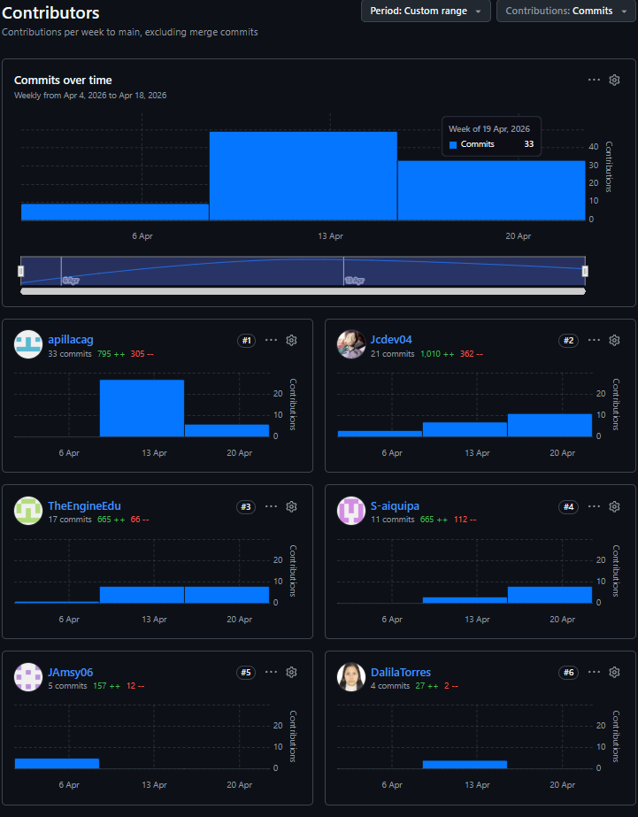

Figura 1: Gráfico de contribuciones del repositorio del informe del proyecto para TB1, mostrando la actividad de colaboración de todos los miembros del equipo durante la elaboración del informe inicial.

**Resumen de Contribuciones:**
En base al historial del repositorio y la gráfica mostrada, se registran un total de **161 commits** para el informe del proyecto en esta etapa. El desglose de los aportes por cada integrante del equipo es el siguiente:

- **Andy Pillaca Gonzales:** 54 commits
- **Jesús Castillo Vidal:** 30 commits
- **Dalila Torres Sanchez:** 25 commits
- **Eduardo Aguirre Ramos:** 24 commits
- **Sebastian Aiquipa Poma:** 22 commits
- **James Delgado Perez:** 6 commits

Esta distribución evidencia un esfuerzo colaborativo y la participación activa de todos los integrantes en la elaboración y redacción de la documentación del proyecto.

## TB1

Durante esta fase, el equipo incorporó los avances correspondientes al primer entregable parcial,
incluyendo diagramas, wireflows, sprint 2 y mejoras al informe base.
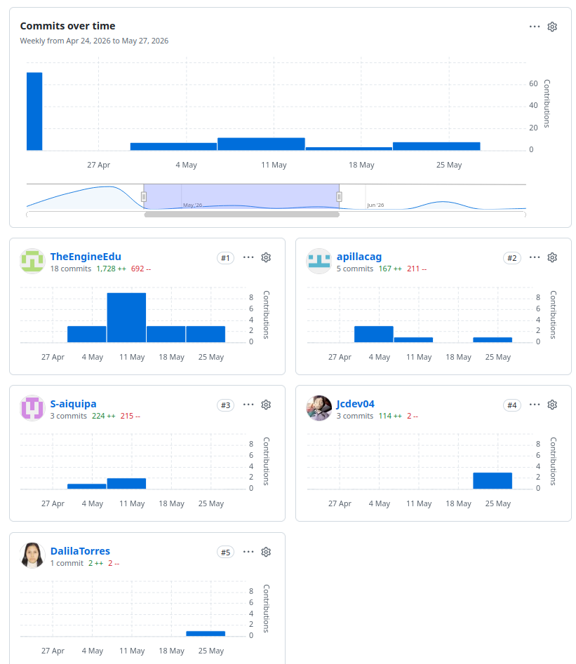
Figura 2: Gráfico de contribuciones del repositorio del informe del proyecto para TB1, mostrando
la actividad de colaboración de todos los miembros del equipo durante el periodo 24/04/2026 al 27/05/2026.

**Resumen de Contribuciones:**
En base al historial del repositorio y la gráfica mostrada, se registran un total de **30 commits**
para el informe del proyecto en esta etapa. El desglose de los aportes por cada integrante del equipo es el siguiente:

- **Eduardo Aguirre Ramos:** 18 commits
- **Andy Pillaca Gonzales:** 5 commits
- **Sebastian Aiquipa Poma:** 3 commits
- **Jesús Castillo Vidal:** 3 commits
- **Dalila Torres Sanchez:** 1 commit

Esta distribución evidencia la participación activa de todos los integrantes en la elaboración
y redacción de la documentación del proyecto durante esta etapa.

---

## AV2

Durante esta fase, el equipo consolidó la segunda entrega académica, incorporando el Sprint 3,
las entrevistas de validación, la evaluación heurística y la actualización del Student Outcome.
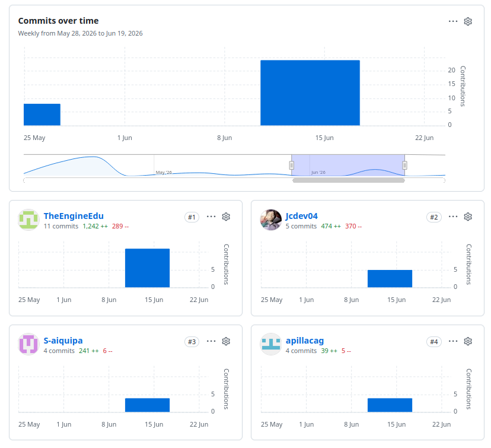
Figura 3: Gráfico de contribuciones del repositorio del informe del proyecto para AV2, mostrando
la actividad de colaboración de todos los miembros del equipo durante el periodo 28/05/2026 al 19/06/2026.

**Resumen de Contribuciones:**
En base al historial del repositorio y la gráfica mostrada, se registran un total de **24 commits**
para el informe del proyecto en esta etapa. El desguste de los aportes por cada integrante del equipo es el siguiente:

- **Eduardo Aguirre Ramos:** 11 commits
- **Jesús Castillo Vidal:** 5 commits
- **Sebastian Aiquipa Poma:** 4 commits
- **Andy Pillaca Gonzales:** 4 commits

Esta distribución evidencia el esfuerzo colaborativo del equipo en la elaboración de la documentación
correspondiente a la validación del producto y cierre de la segunda entrega académica.

<div style="page-break-after: always;"></div>

# Tabla de contenidos

## [Capítulo I: Introducción](#capítulo-i-introducción)

- [1.1 Startup Profile](#11-startup-profile)
  - [1.1.1 Descripción de la Startup](#111-descripción-de-la-startup)
  - [1.1.2 Perfiles de integrantes del equipo](#112-perfiles-de-integrantes-del-equipo)
- [1.2 Solution Profile](#12-solution-profile)
  - [1.2.1 Antecedentes y problemática](#121-antecedentes-y-problemática)
  - [1.2.2 Lean UX Process](#122-lean-ux-process)
    - [1.2.2.1 Lean UX Problem Statements](#1221-lean-ux-problem-statements)
    - [1.2.2.2 Lean UX Assumptions](#1222-lean-ux-assumptions)
    - [1.2.2.3 Lean UX Hypothesis Statements](#1223-lean-ux-hypothesis-statements)
    - [1.2.2.4 Lean UX Canvas](#1224-lean-ux-canvas)
- [1.3 Segmentos Objetivos](#13-segmentos-objetivo)

## [Capítulo II: Requirements Elicitation & Analysis](#capítulo-ii-requirements-elicitation-analysis)

- [2.1 Competidores](#21-competidores)
  - [2.1.1 Análisis competitivo](#211-análisis-competitivo)
  - [2.1.2 Estrategias y tácticas frente a competidores](#212-estrategias-y-tácticas-frente-a-competidores)
- [2.2 Entrevistas](#22-entrevistas)
  - [2.2.1 Diseño de entrevistas](#221-diseño-de-entrevistas)
  - [2.2.2 Registro de entrevistas](#222-registro-de-entrevistas)
  - [2.2.3 Análisis de entrevistas](#223-análisis-de-entrevistas)
- [2.3 Needfinding](#23-needfinding)
  - [2.3.1 User Personas](#231-user-personas)
  - [2.3.2 User Task Matrix](#232-user-task-matrix)
  - [2.3.3 User Journey Mapping](#233-user-journey-mapping)
  - [2.3.4 Empathy Mapping](#234-empathy-mapping)
- [2.4 Big Picture EventStorming](#24-big-picture-eventstorming)
- [2.5 Ubiquitous Language](#25-ubiquitous-language)

## [Capítulo III: Requirements Specification](#capítulo-iii-requirements-specification)

- [3.1 User Stories](#31-user-stories)
- [3.2 Impact Mapping](#32-impact-mapping)
- [3.3 Product Backlog](#33-product-backlog)

## [Capítulo IV: Product Design](#capítulo-iv-product-design)

- [4.1 Style Guidelines](#41-style-guidelines)
  - [4.1.1 General Style Guidelines](#411-general-style-guidelines)
  - [4.1.2 Web Style Guidelines](#412-web-style-guidelines)
- [4.2 Information Architecture](#42-information-architecture)
  - [4.2.1 Organization Systems](#421-organization-systems)
  - [4.2.2 Labeling Systems](#422-labeling-systems)
  - [4.2.3 SEO Tags and Meta Tags](#423-seo-tags-and-meta-tags)
  - [4.2.4 Searching Systems](#424-searching-systems)
  - [4.2.5 Navigation Systems](#425-navigation-systems)
- [4.3 Landing Page UI Design](#43-landing-page-ui-design)
  - [4.3.1 Landing Page Wireframe](#431-landing-page-wireframe)
  - [4.3.2 Landing Page Mock-up](#432-landing-page-mock-up)
- [4.4 Web Applications UX/UI Design](#44-web-applications-uxui-design)
  - [4.4.1 Web Applications Wireframes](#441-web-applications-wireframes)
  - [4.4.2 Web Applications Wireflow Diagrams](#442-web-applications-wireflow-diagrams)
  - [4.4.3 Web Applications Mock-ups](#443-web-applications-mock-ups)
  - [4.4.4 Web Applications User Flow Diagrams](#444-web-applications-user-flow-diagrams)
- [4.5 Web Applications Prototyping](#45-web-applications-prototyping)
- [4.6 Domain-Driven Software Architecture](#46-domain-driven-software-architecture)
  - [4.6.1 Design-Level EventStorming](#461-design-level-eventstorming)
  - [4.6.2 Software Architecture Context Diagram](#462-software-architecture-context-diagram)
  - [4.6.3 Software Architecture Container Diagrams](#463-software-architecture-container-diagrams)
  - [4.6.4 Software Architecture Components Diagrams](#464-software-architecture-components-diagrams)
- [4.7 Software Object-Oriented Design](#47-software-object-oriented-design)
  - [4.7.1 Class Diagrams](#471-class-diagrams)
  - [4.7.2 Class Dictionary](#472-class-dictionary)
- [4.8 Database Design](#48-database-design)
  - [4.8.1 Database Diagrams](#481-database-diagrams)
- [4.9 DDD Estratégico](#49-ddd-estratégico)

## [Capítulo V: Product Implementation, Validation & Deployment](#capítulo-v-product-implementation-validation-deployment)

- [5.1 Software Configuration Management](#51-software-configuration-management)
  - [5.1.1 Software Development Environment Configuration](#511-software-development-environment-configuration)
  - [5.1.2 Source Code Management](#512-source-code-management)
  - [5.1.3 Source Code Style Guide & Conventions](#513-source-code-style-guide--conventions)
  - [5.1.4 Software Deployment Configuration](#514-software-deployment-configuration)
- [5.2 Landing Page, Services & Applications Implementation](#52-landing-page-services--applications-implementation)
  - [5.2.1 Sprint 1](#521-sprint-1)
    - [5.2.1.1 Sprint Planning 1](#5211-sprint-planning-1)
    - [5.2.1.2 Aspect Leaders and Collaborators](#5212-aspect-leaders-and-collaborators)
    - [5.2.1.3 Sprint Backlog 1](#5213-sprint-backlog-1)
    - [5.2.1.4 Development Evidence for Sprint Review](#5214-development-evidence-for-sprint-review)
    - [5.2.1.5 Execution Evidence for Sprint Review](#5215-execution-evidence-for-sprint-review)
    - [5.2.1.6 Services Documentation Evidence for Sprint Review](#5216-services-documentation-evidence-for-sprint-review)
    - [5.2.1.7 Software Deployment Evidence for Sprint Review](#5217-software-deployment-evidence-for-sprint-review)
    - [5.2.1.8 Team Collaboration Insights during Sprint](#5218-team-collaboration-insights-during-sprint)
  - [5.2.2 Sprint 2](#522-sprint-2)
    - [5.2.2.1 Sprint Planning 2](#5221-sprint-planning-2)
    - [5.2.2.2 Aspect Leaders and Collaborators](#5222-aspect-leaders-and-collaborators)
    - [5.2.2.3 Sprint Backlog 2](#5223-sprint-backlog-2)
    - [5.2.2.4 Development Evidence for Sprint Review](#5224-development-evidence-for-sprint-review)
    - [5.2.2.5 Execution Evidence for Sprint Review](#5225-execution-evidence-for-sprint-review)
    - [5.2.2.6 Services Documentation Evidence for Sprint Review](#5226-services-documentation-evidence-for-sprint-review)
    - [5.2.2.7 Software Deployment Evidence for Sprint Review](#5227-software-deployment-evidence-for-sprint-review)
    - [5.2.2.8 Team Collaboration Insights during Sprint](#5228-team-collaboration-insights-during-sprint)
  - [5.2.3 Sprint 3](#523-sprint-3)
    - [5.2.3.1 Sprint Planning 3](#5231-sprint-planning-3)
    - [5.2.3.2 Aspect Leaders and Collaborators](#5232-aspect-leaders-and-collaborators)
    - [5.2.3.3 Sprint Backlog 3](#5233-sprint-backlog-3)
    - [5.2.3.4 Development Evidence for Sprint Review](#5234-development-evidence-for-sprint-review)
    - [5.2.3.5 Execution Evidence for Sprint Review](#5235-execution-evidence-for-sprint-review)
    - [5.2.3.6 Services Documentation Evidence for Sprint Review](#5236-services-documentation-evidence-for-sprint-review)
    - [5.2.3.7 Software Deployment Evidence for Sprint Review](#5237-software-deployment-evidence-for-sprint-review)
    - [5.2.3.8 Team Collaboration Insights during Sprint](#5238-team-collaboration-insights-during-sprint)
- [5.3 Validation Interviews](#53-validation-interviews)
  - [5.3.1 Diseño de Entrevistas](#531-diseño-de-entrevistas)
  - [5.3.2 Registro de Entrevistas](#532-registro-de-entrevistas)
  - [5.3.3 Evaluaciones según heurísticas](#533-evaluaciones-según-heurísticas)
- [5.4 About-the-Product](#54-about-the-product)

## [Conclusiones](#conclusiones)

- [Conclusiones y recomendaciones](#conclusiones-y-recomendaciones)
- [Video About-the-Team](#video-about-the-team)

## [Bibliografía](#bibliografía)

## [Anexos](#anexos)

<div style="page-break-after: always;"></div>

## Student Outcome

Criterio: Capacidad de comunicarse efectivamente con un rango de audiencias.
En el siguiente cuadro se describe las acciones realizadas y enunciados de conclusiones por parte del grupo, que permiten sustentar el haber alcanzado el logro del ABET – EAC - Student Outcome 3

| Criterio Específico                                                   | Acciones realizadas                                                                                                                                                                                                                                                                                                                                                                                                                                                                                                                                                                                                                                                                                                                                                                                                                                                                                                                                                                                                                                                                                                                                                                                                                                                                                                                                                                                                                                                                                                                                                                                                                                                                                                                                                                                                                                                                                                                                                                                                                                                                                                                                                                                                                                                                                                                                                                                                                                                                                                                                                                                                                                                                                                                                                                                                                                                                                                                                                                                                                                                                                                                                                                                                                                                                                                                                                                                                                                                                                                                                                                                                                                                                                                                                                                                                                                                                                                                                                                                                                                                                                                                                                                                                                                                                                                                                                                                                                                                                                                                                                                                                                                                                                                                                                                                                                                                                                                                                                                                                                                                                                                                                                                                                                                                                                                                                                                                                                                                                                                                                                                                                                                                                                                                                                                                                                                                                                                                                                                                                                                                                                                                     | Conclusiones                                                                                                                                                                                                                                                                                                                                                                                                                                                                                                                                                                                                                                                                                                                                                                                                                                                                                                                                                                                                                                                                                                                                                                                                                                                                                                                                                                                                                                                                                                                                                                                                                                                                                                                                                                                                                                                                                                                                                                                                                                                                                                                             |
| --------------------------------------------------------------------- | --------------------------------------------------------------------------------------------------------------------------------------------------------------------------------------------------------------------------------------------------------------------------------------------------------------------------------------------------------------------------------------------------------------------------------------------------------------------------------------------------------------------------------------------------------------------------------------------------------------------------------------------------------------------------------------------------------------------------------------------------------------------------------------------------------------------------------------------------------------------------------------------------------------------------------------------------------------------------------------------------------------------------------------------------------------------------------------------------------------------------------------------------------------------------------------------------------------------------------------------------------------------------------------------------------------------------------------------------------------------------------------------------------------------------------------------------------------------------------------------------------------------------------------------------------------------------------------------------------------------------------------------------------------------------------------------------------------------------------------------------------------------------------------------------------------------------------------------------------------------------------------------------------------------------------------------------------------------------------------------------------------------------------------------------------------------------------------------------------------------------------------------------------------------------------------------------------------------------------------------------------------------------------------------------------------------------------------------------------------------------------------------------------------------------------------------------------------------------------------------------------------------------------------------------------------------------------------------------------------------------------------------------------------------------------------------------------------------------------------------------------------------------------------------------------------------------------------------------------------------------------------------------------------------------------------------------------------------------------------------------------------------------------------------------------------------------------------------------------------------------------------------------------------------------------------------------------------------------------------------------------------------------------------------------------------------------------------------------------------------------------------------------------------------------------------------------------------------------------------------------------------------------------------------------------------------------------------------------------------------------------------------------------------------------------------------------------------------------------------------------------------------------------------------------------------------------------------------------------------------------------------------------------------------------------------------------------------------------------------------------------------------------------------------------------------------------------------------------------------------------------------------------------------------------------------------------------------------------------------------------------------------------------------------------------------------------------------------------------------------------------------------------------------------------------------------------------------------------------------------------------------------------------------------------------------------------------------------------------------------------------------------------------------------------------------------------------------------------------------------------------------------------------------------------------------------------------------------------------------------------------------------------------------------------------------------------------------------------------------------------------------------------------------------------------------------------------------------------------------------------------------------------------------------------------------------------------------------------------------------------------------------------------------------------------------------------------------------------------------------------------------------------------------------------------------------------------------------------------------------------------------------------------------------------------------------------------------------------------------------------------------------------------------------------------------------------------------------------------------------------------------------------------------------------------------------------------------------------------------------------------------------------------------------------------------------------------------------------------------------------------------------------------------------------------------------------------------------------------------------------------------- | ---------------------------------------------------------------------------------------------------------------------------------------------------------------------------------------------------------------------------------------------------------------------------------------------------------------------------------------------------------------------------------------------------------------------------------------------------------------------------------------------------------------------------------------------------------------------------------------------------------------------------------------------------------------------------------------------------------------------------------------------------------------------------------------------------------------------------------------------------------------------------------------------------------------------------------------------------------------------------------------------------------------------------------------------------------------------------------------------------------------------------------------------------------------------------------------------------------------------------------------------------------------------------------------------------------------------------------------------------------------------------------------------------------------------------------------------------------------------------------------------------------------------------------------------------------------------------------------------------------------------------------------------------------------------------------------------------------------------------------------------------------------------------------------------------------------------------------------------------------------------------------------------------------------------------------------------------------------------------------------------------------------------------------------------------------------------------------------------------------------------------------------- |
| Comunica oralmente con efectividad a diferentes rangos de audiencia.  | **Aguirre Ramos, Eduardo Manuel**<br> **AV1:** Tome el papel de lider del grupo. Realize los Lean Ux Problem Statements y Analisis Competitivo. Desarrolle los web applications wireframes and prototyping. Ademas de colaborar en las user stories.Mediante el video de la elaboración del AV1 se pudo apreciar el primer avance del proyecto implementando todas las tecnologías y el landing page hecho hasta ese momento<br>**TB1:** En la sustentación oral del TB1, comuniqué con precisión el progreso técnico del proyecto explicando las competencias, tecnologias y los problemas que tuvo nuestro proyecto hasta esta entrega. Mantuve una tono fluido y profesional de acuerdo al proyecto presentado, utilizando la terminología exacta de la arquitectura orientada a servicios, asegurando que la complejidad técnica del sistema fuera comprensible tanto para usted como para mis compañeros.<br>**AV2:** Sustenté la planificación del Sprint 3 y la demo técnica de la integración de las interfaces de registro para pasajeros y conductores, explicando detalladamente los mecanismos de validación de formularios y la persistencia de estados de sesión ante el docente y compañeros.<br>**Pillaca Gonzales, Andy Saúl**<br> **AV1:** Definio las estrategias y tacticas frente a competidores. Definio los User persona. Desarrollo los web applications mock-ups <br> **TB1:** Encargado de desarrollar el Domain y las Entities correspondientes a los cinco Bounded Contexts definidos en la arquitectura basada en Domain-Driven Design. Asimismo, elaboró los Wireflows del sistema en formato Markdown, representando la navegación y flujo de interacción entre las principales funcionalidades de la aplicación. <br>**AV2:** Participé en la actualización de las conclusiones del informe considerando la retroalimentación brindada por el docente durante la evaluación del TB1, sustentando las mejoras realizadas y la justificación de los cambios efectuados. Asimismo, apoyé en el desarrollo y explicación de los bounded contexts IAM (Identity and Access Management) y Shared, comunicando la estructura y responsabilidades de cada contexto dentro de la arquitectura basada en Domain-Driven Design. Adicionalmente, colaboré en el proceso de internacionalización de la Landing Page y en la elaboración del video "About the Product", contribuyendo a la presentación clara de las funcionalidades y propuesta de valor del sistema para diferentes audiencias.<br>**Castillo Vidal, Jesus Ivan**<br>**AV1:** Desarrollo los user stories, impact mapping, product mapping y product backlog. Definio y elaboro el design-level event storming. Finalmente el software object-oriented design<br>**TB1:** Sustenté oralmente la implementación del frontend de la aplicación web y su integración y conexión con la Fake API (json-server), explicando con claridad el flujo de datos y cómo se mapeaban los endpoints de la API con los servicios del frontend, asegurando que la demo interactiva fuera comprensible.<br>**AV2:** Coordiné con el equipo para designar las tareas del desarrollo de frontend y backend, y sustenté oralmente la planificación y el estado del proyecto en este aspecto.<br>**TB2:** Sustenté la demo final de la aplicación web, detallando la implementación y funcionamiento de los flujos de cancelación de viaje en tiempo real y la consulta del historial de viajes para pasajeros y conductores ante el docente y compañeros de clase.<br>**Torres Sanchez, Dalila Victoria** <br>**AV1:** Investigo los antecedentes y problematica. Definio el user journey mapping. Modelo el landing page wireframe y web applications wireframes <br>**TB1:** Se enfocó en realizar las correcciones de los links en el project report y el avance de la capa presentación. y se aseguró de que su explicación oral fuera clara y comprensible<br>**AV2:** Participé en la planificación del sprint 3, donde tuve la oportunidad de exponer mis ideas y propuestas frente a mis compañeros.<br>**TB2:** Llevé a cabo una entrevista de validación de la aplicación final con un usuario real, con el objetivo de evaluar su experiencia, identificar posibles puntos de mejora y confirmar que el producto cumplía con sus expectativas. Al mismo tiempo, fui receptiva a sus comentarios, planteando preguntas abiertas para profundizar en sus impresiones y registrando sus sugerencias con precisión. Posteriormente, transmití estos hallazgos al equipo de desarrollo en una reunión interna, resumiendo los puntos clave y traduciendo las necesidades del usuario en acciones concretas para el cierre del proyecto.<br>**Aiquipa Poma, Sebastian Andres**<br>**AV1:** Analisis de entrevistas, style guidelines el Domain-Driven software Arquitecture y el Database Design<br>**TB1:** Explico la estructura de la arquitectura basada en Domain-Driven Design aplicada al proyecto, presentando la organizacion de la capa Application en los cinco Bounded Contexts. Ademas, sustento las correcciones realizadas en las User Stories y Technical Stories.<br>**AV2:** Sustentó el bounded context de Monetización desarrollado completamente bajo arquitectura Domain-Driven Design, explicando las decisiones técnicas tomadas en cada capa (domain, application, infrastructure e interfaces) ante el docente y compañeros. Asimismo, expuso el diseño de las entrevistas de validación definidas para la sección 5.3.1 del informe, comunicando de forma clara la metodología, los user flows y las preguntas estructuradas para cada segmento objetivo.                                                                                                                                                                                                                                                                                                                                                                                                                                                                              | **AV1** Durante la entrega AV1, el equipo expuso el perfil del startup y la problemática identificada en zonas periféricas de Lima ante el docente y compañeros de clase, adaptando el discurso a una audiencia técnica universitaria.<br>La presentación de los resultados del proceso Lean UX permitió al equipo ejercitar la comunicación oral de ideas abstractas de diseño de forma estructurada y comprensible.<br>El equipo demostró capacidad para comunicar oralmente los hallazgos de entrevistas con usuarios (mototaxistas y pasajeros), sintetizando información cualitativa ante una audiencia no familiarizada con el dominio del problema. <br><br>**TB1** Durante la entrega TB1, el equipo presentó el inicio del desarrollo frontend del proyecto y la planificación técnica correspondiente al Sprint 2 ante el docente y compañeros de clase, explicando la organización de bounded contexts y las User Stories priorizadas para la iteración. La exposición de la arquitectura basada en Domain-Driven Design permitió al equipo comunicar de forma estructurada la relación entre requerimientos funcionales, componentes del sistema y responsabilidades técnicas dentro del proyecto. Asimismo, la sustentación de las decisiones de diseño y organización del backlog permitió transmitir conceptos técnicos de desarrollo de software de manera clara y comprensible<br><br>**AV2** El equipo consolidó una comunicación oral efectiva al presentar de manera estructurada las demostraciones de integración del sistema y explicar las decisiones técnicas implementadas en el backend con Spring Boot. Además, adaptó sus exposiciones a audiencias con distintos niveles de conocimiento técnico, evidenciando dominio del proyecto y claridad durante las revisiones de cada sprint.<br><br>**TB2** El equipo comunicó el desarrollo y los resultados alcanzados de forma organizada y coherente, justificando las decisiones técnicas adoptadas y presentando el funcionamiento del sistema de manera comprensible tanto para una audiencia técnica como para personas sin conocimientos especializados. |
| Comunica por escrito con efectividad a diferentes rangos de audiencia | **Aguirre Ramos, Eduardo Manuel**<br>**AV1:** Actue como lider del grupo para este proyecto. Realize y redacte explicitamente las herramientas de Lean Ux Problem Statements y Analisis Competitivo.Ademas de contribuir en la creación de los web applications wireframes and prototyping.<br>**TB1:** Aseguré una comunicación escrita efectiva en el informe del TB1 mediante la documentación detallada del proceso de ingeniería seguido para el desarrollo de esta etapa desarrollando el Sprint Planning 2 y Sprint Backlog 2. Asimismo, redacté un análisis retrospectivo basado en los resultados del AV1, especificando las acciones correctivas aplicadas para subsanar errores previos y detallando las propuestas de mejora continua implementadas tanto en la estructura del informe técnico como en el funcionamiento y arquitectura de la aplicación web.<br>**AV2:** Redacté la documentación correspondiente al Sprint Planning 3 y la actualización de los diagramas de componentes (C4 Model) del sistema. Además, documenté detalladamente la implementación técnica de los formularios de registro (pasajero y conductor) y la lógica de cierre de sesión, especificando las validaciones y el manejo de almacenamiento local.<br>**Pillaca Gonzales, Andy Saúl**<br>**AV1:** Definio las estrategias y tacticas frente a competidores. Definio los User persona. Desarrollo los web applications mock-ups <br>**TB1:** Documentó la estructura del Domain y las Entities dentro de la arquitectura del sistema aplicando principios de Domain-Driven Design. Asimismo, elaboró los Wireflows en formato Markdown, permitiendo representar de manera clara y organizada la navegación e interacción de los usuarios con las funcionalidades principales de la aplicación. <br>**AV2:** Actualizó las conclusiones del informe incorporando las observaciones y recomendaciones realizadas por el docente en la retroalimentación del TB1, mejorando la coherencia y calidad del documento. Asimismo, documentó aspectos relacionados con los bounded contexts IAM y Shared dentro de la arquitectura Domain-Driven Design, describiendo sus componentes y responsabilidades. También participó en la internacionalización de la Landing Page, adaptando los contenidos para distintos idiomas, y colaboró en la elaboración del guion y contenido del video "About the Product", asegurando una comunicación escrita clara y orientada tanto a audiencias técnicas como no técnicas.<br>**TB2** Contribuí al cumplimiento de los objetivos del proyecto mediante la implementación e integración de los videos About the Team y About the Product en la Landing Page, dando solución a observaciones identificadas durante la revisión del proyecto y asegurando el cumplimiento de los requisitos establecidos para la entrega final. Asimismo, apoyé en la actualización de la documentación del informe, manteniendo la coherencia entre la implementación desarrollada y las evidencias presentadas. De igual manera, colaboré con el equipo de backend en actividades de integración y validación de funcionalidades, manteniendo una comunicación constante con los demás integrantes para resolver dependencias técnicas y garantizar una entrega organizada y de calidad.<br>**Castillo Vidal, Jesus Ivan**<br>**AV1:** Desarrollo los user stories, impact mapping, product mapping y product backlog. Definio y elaboro el design-level event storming. Finalmente el software object-oriented design <br>**TB1:** Documenté la integración y conexión del frontend de la aplicación web con la Fake API (json-server), detallando la configuración de los servicios mock, los endpoints consumidos y la simulación del almacenamiento de datos para las pruebas del sistema.<br>**AV2:** Documenté la planificación, asignación y coordinación de tareas con el equipo para iniciar y realizar mejoras en el frontend y backend del producto.<br>**TB2:** Documenté la implementación del frontend para las historias de usuario de cancelación de viajes (US-18) e historial de viajes (US-24, US-25). Asimismo, apoyé en la actualización de las conclusiones del informe final, la tabla de contenidos y el README.md para asegurar una entrega de calidad.<br>**Torres Sanchez, Dalila Victoria** <br>**AV1:** Investigo los antecedentes y problematica. Definio el user journey mapping. Modelo el landing page wireframe y web applications wireframes<br>**TB1:** En la corrección de la entrega anterior, orientó el reporte escrito a corregir los links para que quedara bien estructurado y comprensible.<br>**AV2:** Revisé y actualicé la documentación del proyecto, asegurándome de que estuviera clara, completa y accesible.<br>**TB2:** Participé en las tareas de desarrollo del backend, también me aseguré de documentar de manera clara y ordenada los avances realizados.<br>**Aiquipa Poma, Sebastian Andres**<br>**AV1:** Analisis de entrevistas, style guidelines el Domain-Driven software Arquitecture y el Database Design<br>**TB1:** Se Corrigio la nomenclatura y estructura de las User Stories y Technical Stories del Product Backlog, alineandolas con el formato Gherkin y asegurando consistencia en criterios de aceptacion e identificadores. Asimismo, Se documento la capa Application de los cinco Bounded Contexts aplicando Domain-Driven Design, definiendo casos de uso, comandos, queries y servicios de aplicacion dentro de la arquitectura del sistema.<br>**AV2:** Implementó y documentó el bounded context de Monetización en su totalidad, abarcando las cuatro capas de la arquitectura Domain-Driven Design: domain (agregados, entidades, comandos, queries y repositorios), application (command y query handlers), infrastructure (persistencia JPA y repositorios) e interfaces (REST controllers y recursos). Asimismo, redactó la sección 5.3.1 Diseño de Entrevistas de Validación en el informe del proyecto, definiendo objetivo, metodología, user flows y preguntas estructuradas para los segmentos de pasajeros y conductores. | **AV1** En la entrega AV1, el equipo redactó el Capítulo 1 del informe, documentando antecedentes, problemática y el proceso Lean UX con un lenguaje técnico apropiado para lectores con formación en ingeniería de software.<br>La elaboración de User Personas, User Journey Maps y el Impact Map implicó comunicar por escrito necesidades y comportamientos de usuarios reales, dirigiéndose simultáneamente a una audiencia técnica y a partes interesadas no técnicas.<br>El uso de GitHub con commits convencionales y pull requests estructurados evidencia la capacidad del equipo de comunicar cambios y decisiones de desarrollo de forma escrita, clara y trazable. <br><br> **TB1** En la entrega TB1, el equipo documentó el inicio del desarrollo frontend, la definición de bounded contexts y la planificación de User Stories y Technical Stories correspondientes al Sprint 2, utilizando una estructura alineada con prácticas ágiles y Domain-Driven Design. La estandarización de User Stories bajo el formato Connextra y de criterios de aceptación mediante sintaxis Gherkin permitió mejorar la claridad y trazabilidad de los requerimientos funcionales del sistema. Asimismo, la documentación de la arquitectura y de los componentes de aplicación permitió comunicar de manera organizada las decisiones técnicas del proyecto hacia una audiencia académica y de ingeniería de software. <br><br>**AV2** El equipo elaboró un informe técnico claro y bien estructurado, documentando de manera detallada los contratos de la API mediante Swagger y describiendo la configuración del despliegue en la nube. Esta documentación facilitó la comprensión del flujo de información y de la arquitectura distribuida del sistema para usuarios con perfiles tanto técnicos como de negocio.<br><br>**TB2** El equipo preparó una documentación organizada y completa del proyecto, registrando el desarrollo realizado, las decisiones de carácter técnico y los resultados alcanzados. De esta manera, la información quedó presentada de forma comprensible para diferentes tipos de audiencia.         |

</div>


---

# Capítulo I: Introducción

## 1.1 Startup Profile

### 1.1.1 Descripción de la Startup

CTR Technologies nace con el propósito de digitalizar y optimizar el transporte en mototaxi en ciudades intermedias del Perú, respondiendo a una necesidad real y cotidiana que las grandes plataformas de movilidad han ignorado históricamente. En localidades como Talara, Huarmey, Casma, Coishco, Santa y Carhuaz, el mototaxi es el principal medio de transporte urbano; sin embargo, su informalidad y falta de organización generan inseguridad, tiempos de espera prolongados e incertidumbre tanto para pasajeros como para conductores.

Nuestra solución, ChapaTuRuta, es una plataforma web que conecta en tiempo real a pasajeros con mototaxistas verificados de su zona, permitiendo solicitar un viaje de forma rápida, segura y trazable desde cualquier dispositivo con acceso a internet. A diferencia de las alternativas informales como el contacto por WhatsApp, ChapaTuRuta ofrece un sistema de calificaciones bidireccional, verificación de documentos del conductor como brevete y SOAT, y disponibilidad permanente de conductores activos en la plataforma, garantizando que siempre haya una moto disponible cuando el pasajero la necesita.

CTR Technologies apunta a empoderar a los mototaxistas formales brindándoles una herramienta que optimiza su tiempo y reduce los recorridos en vacío, al mismo tiempo que ofrece a los pasajeros una experiencia de transporte más confiable, ordenada y segura. La plataforma opera bajo un modelo de comisión por viaje, sostenible tanto para el negocio como accesible para los conductores.

Creemos que la digitalización del transporte en ciudades intermedias es un paso necesario hacia la formalización y el desarrollo tecnológico local, y que ChapaTuRuta puede ser el punto de partida de una transformación real en la movilidad de estas comunidades.

Misión: Conectar a pasajeros y mototaxistas en ciudades intermedias del Perú mediante una plataforma web accesible, segura y eficiente, que digitalice y formalice el transporte en mototaxi mejorando la experiencia de ambos lados del viaje.

Visión: Convertirnos en la plataforma de referencia para el transporte en mototaxi en ciudades intermedias de Latinoamérica, liderando la transformación digital de un sector históricamente informal y contribuyendo al desarrollo tecnológico de las comunidades donde operamos.

### 1.1.2 Perfiles de integrantes del equipo

## Jesús Iván Castillo Vidal - U202322952


Soy estudiante de Ingeniería de Software y desarrollador full-stack orientado al emprendimiento. Tengo experiencia práctica liderando la creación de plataformas SaaS y sistemas de gestión enfocados en la transformación digital de negocios locales. Me especializo en llevar proyectos desde la arquitectura y el prototipado hasta el lanzamiento, utilizando tecnologías como Next.js, FastAPI y Tailwind CSS, etc. Siempre buscando crear soluciones tecnológicas escalables y centradas en el usuario.

## Andy Saúl Pillaca Gonzales - U202418823


Soy Andy Saúl Pillaca Gonzales, estudiante de la carrera de Ingeniería de Software, con gran interés en el desarrollo de soluciones tecnológicas innovadoras que contribuyan a resolver problemas reales. Me encuentro en constante proceso de aprendizaje y fortalecimiento de mis conocimientos en el área de programación y desarrollo de software.
Poseo sólidos conocimientos en lenguajes de programación como C++ y Python, además de experiencia en el manejo de SQL, Excel, Power BI y mecanografía, herramientas que me permiten desarrollar soluciones eficientes, analizar información y optimizar procesos mediante el uso de datos.
Me interesa especialmente seguir ampliando mis habilidades en el desarrollo de software, bases de datos y análisis de información, así como participar en proyectos que me permitan aplicar mis conocimientos en entornos prácticos y retadores. Considero importante la creación de soluciones funcionales que aporten valor y mejoren la experiencia de los usuarios.
Entre mis principales habilidades destacan el trabajo en equipo, la escucha activa, la responsabilidad y la capacidad de adaptación al aprendizaje continuo. Me considero una persona comprometida, organizada y con gran disposición para asumir nuevos retos que impulsen mi crecimiento profesional y personal.
Actualmente, estoy enfocado en seguir fortaleciendo mis competencias técnicas y humanas para desenvolverme de manera exitosa en el entorno laboral, aportando con dedicación, disciplina e innovación en cada proyecto en el que participe.

## Eduardo Manuel Aguirre Ramos - U20241A911


Soy estudiante de la carrera de ingenieria de software de 5to ciclo en la Universidad Peruana de Ciencias Aplicadas, tengo conocimientos en como C++, Python, CSS, JavaScript.Manejo he implemento directamente con Git y utilizo metodologias Agiles como Scrum.En si me interesa mucho trabajar en equipo en diferentes proyectos debido a las diferentes experiencias que trae elo tanto así como el resolver problemas conjuntos y diseñar soluciones innovadoras ademas de tener una mejor experiencia en el ambito de frontend y disfruto tener retos dificiles cada dia para poder progresar. Mi meta es nutrirme de experiencias para así poder en un futuro diseñar mi propia web y estar preparado para experiencias laborales.

## Sebastian Andres Aiquipa Poma - U201916755


Soy estudiante de Ingeniería de Software y desarrollador full-stack. Tengo experiencia construyendo plataformas
web completas — desde la arquitectura hasta el despliegue — utilizando tecnologías
como React, Node.js, Express y PostgreSQL. Me apasiona entender el código en
profundidad, no solo hacerlo funcionar, y busco siempre crear soluciones escalables
que resuelvan problemas reales de negocio.
Soy estudiante de Ingeniería de Software, he programado en C#, C++, PHP, Java y Python, además manejo de bases de datos relacionales. También he trabajado con Git y metodologías ágiles como Scrum, lo cual me ha ayudado a organizarme mejor y a trabajar en equipo con más fluidez. Me interesa mucho el desarrollo backend, porque me gusta entender la lógica detrás de las cosas, cómo se procesan los datos y cómo se asegura que todo funcione correctamente. También me gusta colaborar en el frontend, porque entiendo que un buen producto requiere que ambas partes trabajen en armonía. Disfruto ver cómo una idea se vuelve algo real, desde los primeros bocetos hasta la parte funcional donde las personas terminan usando. Actualmente, mi objetivo es seguir consolidando mis habilidades técnicas y blandas para desempeñarme con confianza en el entorno laboral. Me interesa participar en proyectos donde pueda aplicar lo que sé y aportar soluciones prácticas a problemas reales.

## Dalila Victoria Torres Sanchez - U20221F734


Soy estudiante de Ingeniería de Software, he programado en C#, C++, PHP, Java y Python, además manejo de bases de datos relacionales. También he trabajado con Git y metodologías ágiles como Scrum, lo cual me ha ayudado a organizarme mejor y a trabajar en equipo con más fluidez. Me interesa mucho el desarrollo backend, porque me gusta entender la lógica detrás de las cosas, cómo se procesan los datos y cómo se asegura que todo funcione correctamente. También me gusta colaborar en el frontend, porque entiendo que un buen producto requiere que ambas partes trabajen en armonía. Disfruto ver cómo una idea se vuelve algo real, desde los primeros bocetos hasta la parte funcional donde las personas terminan usando. Actualmente, mi objetivo es seguir consolidando mis habilidades técnicas y blandas para desempeñarme con confianza en el entorno laboral. Me interesa participar en proyectos donde pueda aplicar lo que sé y aportar soluciones prácticas a problemas reales.


## 1.2 Solution Profile

### 1.2.1 Antecedentes y problemática

#### Antecedentes

En el Perú, el transporte en mototaxi es uno de los medios más utilizados en zonas urbanas marginales, centros poblados rurales y ciudades intermedias como Huancayo, Cusco, Iquitos, Pucallpa y muchas zonas de la sierra y selva. Según el Ministerio de Transportes y Comunicaciones (MTC), más del 30% del transporte informal en regiones corresponde a mototaxis, debido a su bajo costo de adquisición, facilidad de maniobra en calles angostas y capacidad para llegar a zonas de difícil acceso.

Sin embargo, este servicio opera mayoritariamente de manera informal, sin rutas fijas ni tarifas reguladas. Esto genera una desconexión crónica entre oferta y demanda: los pasajeros no saben cuándo pasa un mototaxi, y los conductores recorren largas distancias sin encontrar pasajeros, desperdiciando combustible y tiempo.

#### Problemática

| Dimensión del problema | Descripción                                                                                                                                                                                                                                                                                                                                                                                                 |
| ---------------------- | ----------------------------------------------------------------------------------------------------------------------------------------------------------------------------------------------------------------------------------------------------------------------------------------------------------------------------------------------------------------------------------------------------------- |
| **Who**                | - Pasajeros locales de zonas rurales o periurbanas (campesinos, comerciantes, estudiantes, adultos mayores)<br>- Mototaxistas independientes que dependen del transporte diario para vivir.                                                                                                                                                                                                                 |
| **What**               | - Los pasajeros no encuentran unidades disponibles fácilmente.<br>- Los conductores gastan tiempo y combustible buscando pasajeros sin rumbo fijo.<br>- Las tarifas son arbitrarias, no hay transparencia ni estandarización.                                                                                                                                                                               |
| **Where**              | - Distritos alejados de ciudades capitales.<br>- Centros poblados sin cobertura de transporte público formal.<br>- Rutas entre caseríos y mercados locales.                                                                                                                                                                                                                                                 |
| **When**               | - Ocurre a diario, con mayor incidencia en horas de la mañana (5 a 8 a.m.) y tarde (4 a 7 p.m.), cuando hay mayor movilidad por trabajo y estudios.<br>- En temporadas de lluvias, donde los pasajeros no pueden esperar en la vía.                                                                                                                                                                         |
| **Why**                | - Falta de información en tiempo real sobre oferta y demanda.<br>- Escasez de mecanismos de negociación previa de precios para el sector de mototaxis.                                                                                                                                                                                                                                                      |
| **How**                | - Pasajeros: Esperan en esquinas fijas o caminan largos tramos buscando un mototaxi.<br>- Conductores: Hacen vueltas en vacío, preguntan en paraderos informales o compiten verbalmente por pasajeros.                                                                                                                                                                                                      |
| **How Much**           | - Los mototaxistas recorren diariamente una distancia considerable sin pasajeros, lo que representa la mayor parte de su gasto en combustible.<br>- Los pasajeros en zonas rurales enfrentan tiempos de espera prolongados para encontrar una unidad disponible.<br>- Los pasajeros pagan un monto significativamente superior a una tarifa justa debido a la falta de competencia en el momento del viaje. |

De lo anterior podemos concluir que en zonas rurales del Perú, el servicio de mototaxi es ineficiente porque no existe una herramienta digital accesible que conecte oferta y demanda en tiempo real. Los pasajeros (principalmente residentes de zonas alejadas) pierden tiempo esperando o caminando sin certeza de encontrar una unidad, mientras los conductores gastan recursos en recorridos improductivos. Esto genera precios arbitrarios y una desconexión estructural entre necesidad de transporte y disponibilidad real. La magnitud del problema afecta la economía de los conductores y la calidad de vida de los pasajeros.

### 1.2.2 Lean UX Process

#### 1.2.2.1 Lean UX Problem Statements

Creemos que los pasajeros en zonas rurales de la sierra y selva del Perú tienen el problema de dificultad para acceder a transporte organizado y confiable cuando necesitan movilizarse dentro o fuera de sus comunidades.

Esto ocurre porque los servicios de transporte disponibles, como motos y mototaxis, operan de manera informal y sin coordinación, lo que genera incertidumbre, tiempos de espera altos y baja disponibilidad en ciertas zonas.

#### 1.2.2.2 Lean UX Assumptions

#### A. Business Assumptions

- Creemos que pasajeros en zonas periféricas y rurales requieren una forma accesible y confiable de solicitar mototaxis sin depender de la disponibilidad física en la calle.
- Esta necesidad puede atenderse mediante una PWA ligera que conecte en tiempo real a pasajeros y conductores, lo cual permita negociar tarifas antes de confirmar el viaje.
- Nuestros primeros usuarios serán residentes de zonas periféricas con smartphones básicos y mototaxistas independientes que operan sin afiliación a ninguna empresa.
- El valor principal que entregamos es la capacidad de acordar una tarifa justa antes del viaje, lo que elimina la arbitrariedad del precio en el momento.
- Beneficios adicionales: reducción del tiempo en vacío para conductores, visibilidad de la demanda cercana, historial de viajes con detalle de precios y rutas, y calificaciones mutuas para generar confianza.
- Estrategia de adquisión: difusión boca a boca a comunidades, acuerdos con asociaciones de mototaxistas locales y campañas en redes sociales regionales.
- Modelo de ingresos: comisión porcentual por viaje completado; en etapa incial se operará sin cobro para incentivar la adopción masiva.
- Competencia indirecta: apps de taxi como InDrive y colectivos.
- Ventaja competitiva: especialización en mototaxistas y motos lineales en provincias, funcionamiento como PWA sin descarga, negociación de tarifas y operatividad con conectividad básica.
- Mayor riesgo: desconfianza inicial de conductores hacia plataformas digitales y resistencia al cambio de hábitos de operación informal.
- Mitigación: Incorporar líderes de confianza dentro de las asociaciones de mototaxistas como primeros adoptantes, ofrecer onboarding sencillo y demostrar beneficios tangibles desde el primer uso.
- Supuestos críticos: acceso a datos móviles básicos en las zonas objetivo, disposición de conductores a portar smartphone durante su jornada e interés real del pasajero en negociar tarifas desde casa.

#### B. User Assumptions

- **¿Quiénes son los usuarios?** Pasajeros locales de zonas periféricas y mototaxistas independientes que operan sin plataforma ni empresa que los gestione. Rango de edad: 18 a 60 años, con uso frecuente de transporte informal y acceso a smartphone.
- **¿Dónde encaja el producto?** En el momento previo al viaje: el pasajero solicita desde casa o cualquier punto, propone una tarifa y el conductor más cercano la acepta, rechaza o contraoferta antes de moverse.
- **Problema a resolver**<br>
  a. Pasajero: incertidumbre sobre disponibilidad de transporte, precios abusivos en ausencia de competencia y tiempos de espera impredecibles.<br>
  b. Conductor: recorridos en vacío sin saber hay demanda real, tarifas impuestas sin posibilidad de negoción y jornadas poco rentables.
- **Uso Típico**<br>
  a. El pasajero ingresa a la PWA, indica origen y destino, propone una tarifa y aguarda respuesta del conductor disponible más cercano. <br>
  b. El conductor recibe la notificación en tiempo real, visualiza foto, nombre y calificación del pasajero, evalúa la tarifa y acepta, rechaza o contraoferta.
- **Características importantes:** solicitud con propuesta de tarifa del pasajero, geolocalización en tiempo real, sistema de negociación directa, historial de viajes y calificación mutua.
- **Look & Feel:** interfaz minimalista, de carga rápida y operativa en pantallas pequeñas, mapa con ubicación del conductor, estado del viaje y chat de negociación accesible desde la pantalla principal.

#### C. User Outcome & Benefit Assumptions

- Los pasajeros acceden a transporte desde cualquier punto sin necesidad de buscar una unidad disponible en la vía pública, lo cual reduce tiempos de espera y elimina la arbitrariedad en la fijación de precios.
- Los conductores disminuyen los desplazamientos en vacío al recibir solicitudes geolocalizadas con tarifa previamente acordada, lo que se traduce en mayor eficiencia y rentabilidad por jornada.
- La visibilidad del perfil del conductor genera en el pasajero una mayor percepción de seguridad, lo cual reduce la desconfianza asociada al transporte informal.
- La notificaciones en tiempo real agilizan la interacción entre ambas partes, lo que acorta el tiempo transcurrido entre la solicitud y la confirmación del viaje.
- El historial de viajes permite a los usuarios consultar precios y rutas anteriores, lo que facilita una toma de decisiones más informada en futuras solicitudes.
- El sistema de calificaciones mutuas incentiva un comportamiento adecuado de ambas partes, lo que contribuye a elevar progresivamente la calidad del servicio.

#### D. Business Outcome Assumptions

- Se espera alcanzar 500 usuarios activos entre pasajeros y conductores durante los primeros tres meses de operación en la zona piloto.
- Al menos el 60% de los viajes solicitados deberá concretarse mediante negociación dentro de la plataforma, lo que validaría la aceptación del modelo de tarifas dinámicas por parte de ambos segmentos.
- Se proyecta una reducción del 30% en la tasa de abandono de la aplicación durante los dos primeros meses, lo cual indica que el diseño ligero responde adecuadamente a las condiciones de conectividad en provincias.
- Las valoraciones positivas deberán superar el 80% y el tiempo promedio de aceptación de viajes ser inferior a 30 segundos, lo cual refleja que el perfil visible del conductor y las notificaciones en tiempo real impactan favorablemente en la confianza y la rapidez de interacción.
- Se considerará exitosa la funcionalidad de historial cuando al menos el 50% de los usuarios activos la consulte de forma recurrente durante el primer mes de uso.
- Se buscará establecer alianzas formales con al menos dos asociaciones de mototaxistas locales durante el primer año, con el objetivo de acelerar la incorporación de conductores a la plataforma.

#### E. Feature Assumptions

- Se asume que permitir al pasajero proponer la tarifa del viaje incrementará la tasa de viajes completados por encima del 60% de las solicitudes iniciadas, al reducir la fricción generada por precios impuestos unilateralmente.
- Una interfaz de carga rápida y bajo consumo de datos contribuirá a reducir la tasa de abandono en un 30%, lo cual elimina las barreras de acceso propios de zonas con conectividad básica.
- Mostrar el perfil del conductor con foto, nombre y calificación, acompañado de notificaciones en tiempo real, permitirá superar el 80% de valoraciones positivas y reducir el tiempo de aceptación de viajes a menos de 30 segundos.
- El historial de viajes con detalle de precios y rutas se considerará una funcionalidad de impacto positivo cuando al menos el 50% de usuarios lo consulte de manera recurrente.
- Un panel de actividad para el conductor con datos de viajes realizados, ingresos estimados y solicitudes cercanas incrementará el tiempo de disponibilidad en línea y reducirá los periodos de inactividad durante la jornada.

#### 1.2.2.3 Lean UX Hypothesis Statements

Las siguientes hipótesis están orientadas a validar una aplicación de transporte tipo InDrive enfocada en mototaxis y motos lineales en provincias.

- Creemos que el permitir a nuestros futuros usuarios negociar el precio
  del viaje directamente con los conductores ayudará a mejorar la percepción
  y la accesibilidad a servicio de taxi en provincias.
  Notaremos que esta funcionalidad está teniendo un óptimo resultado cuando
  por lo menos el 60% de los viajes se concreten mediante esta negociación
  dentro de la aplicación

- Creemos que ofrecer una aplicación ligera y de bajo consumo de datos, además
  de una interfaz simple e intuitiva logrará mejorar el uso de tecnologías
  en provincias con conectividad limitada.
  Sabremos que esto es cierto cuando la tasa de abandono disminuya en un 30%.

- Por otra parte, el mostrar información del conductor (foto, nombre y calificación)
  generará mayor confianza en los usuarios, y no solo eso, sino que el implementar
  notificaciones en tiempo real sobre las diferentes solicitudes y respuestas de viaje
  mejorará la rapidez de interacción entre pasajeros y conductores.
  Sabremos que esto es cierto cuando las valoraciones positivas superen el 80% y
  de viajes se reduzca el tiempo promedio de aceptación de viajes sea menor al 30%.

- Sumando a todo lo anterior el incluir un historial de viajes con detalles de precios
  y rutas ayudará a los usuarios a tomar decisiones más acertadas en futuros viajes.
  Para ello cuando el 50% de los usuarios revisen su historial podremos saber que esta
  funcionalidad tiene un impacto positivo dentro de nuestro aplicativo.

#### 1.2.2.4 Lean UX Canvas

<table>
  <tr>
    <td valign="top"><strong>Business Problem</strong><br><br>
<strong>Falta de comunicación.</strong> Los pasajeros y conductores de mototaxi no tienen un método para contactarse entre sí. Esto genera desorden en las zonas de recojo, conductores esperando estáticamente de forma ineficiente y pasajeros incapaces de localizar transporte disponible.<br><br>
<strong>Uso ineficiente del tiempo y combustible.</strong> Sin datos de demanda, los conductores circulan o esperan a ciegas, aumentando los costos operativos de combustible y mantenimiento del vehículo, reduciendo sus ganancias diarias.<br><br>
<strong>Ausencia de sistema de tarifas.</strong> Las tarifas se negocian de forma informal, lo que genera desconfianza, inconsistencia y malas experiencias para los pasajeros, especialmente los nuevos.<br><br>
<strong>Falta de predicción de demanda.</strong> Los conductores no saben qué horas y zonas son más activas, por lo que no pueden planificar su jornada para maximizar sus ganancias.<br><br>
<strong>Problema de percepción.</strong> Los mototaxis tienen una reputación ligada al desorden e informalidad. Sin una plataforma que registre conductores y viajes, los pasajeros no tienen confianza ni respaldo en caso de algún problema.<br><br>
<strong>Exclusión digital de un sector informal.</strong> Los mototaxis operan predominantemente en zonas periféricas de Lima. Sin embargo, las plataformas de transporte existentes no atienden estas zonas y ninguna herramienta digital ha sido diseñada para la realidad específica de estos conductores y pasajeros.<br><br>
<strong>Informalidad como barrera de adopción.</strong> La mayoría de conductores de mototaxi en Lima operan fuera de la economía formal, sin licencias ni vehículos registrados. Cualquier solución que requiera documentación formal excluiría a la mayoría de los usuarios objetivo. El MVP debe priorizar un registro de baja barrera, tratando la formalización como un objetivo a largo plazo.
</td>
    <td rowspan="2" valign="top"><strong>Solutions</strong><br><br>
- Mapa en tiempo real que muestra los conductores disponibles cerca de la ubicación del pasajero.<br>
- Sistema de solicitud de viaje donde el pasajero envía una solicitud y un conductor cercano la acepta.<br>
- Notificaciones push para alertar a los conductores sobre solicitudes cercanas.<br>
- Estimación automática de tarifa basada en la distancia antes de confirmar el viaje.<br>
- Tarifa visible para conductor y pasajero antes de iniciar el viaje.<br>
- Perfil del conductor con foto, nombre e información del vehículo visible para el pasajero antes del viaje.<br>
- Sistema de calificaciones y reseñas para conductores y pasajeros después de cada viaje.<br>
- Historial de viajes accesible para ambos usuarios.<br>
- Mapa de calor de demanda que muestra las zonas con más pasajeros activos por hora del día.<br>
- Resumen de ganancias diarias y conteo de viajes visible en el panel del conductor.
</td>
    <td valign="top"><strong>Business Outcomes</strong><br><br>
<strong>Reducir el tiempo de espera del pasajero.</strong> Los pasajeros deben conectarse con un conductor más rápido que la búsqueda informal actual en la calle.<br><br>
<strong>Reducir el tiempo que un conductor pasa sin pasajero.</strong> Menos tiempo inactivo significa mejor eficiencia de combustible y mayores ganancias diarias.<br><br>
<strong>Generar confianza entre pasajeros y conductores.</strong> Medido a través de la adopción del sistema de calificaciones, la reiteración de uso y la reducción de cancelaciones de viajes.<br><br>
<strong>Establecer una referencia de precios transparente y consistente.</strong> Pasajeros y conductores acuerdan una tarifa antes del viaje, reduciendo los conflictos de negociación.<br><br>
<strong>Generar datos de movilidad desde zonas periféricas.</strong> La aplicación produce datos sobre patrones de demanda, horas pico y zonas activas que actualmente no existen.
</td>
  </tr>
  <tr>
    <td valign="top"><strong>Users</strong><br><br>
<strong>Conductor.</strong> Un conductor de mototaxi que opera en zonas periféricas de Lima. Necesita encontrar pasajeros de manera eficiente para maximizar sus viajes y reducir el desperdicio de combustible y tiempo durante su jornada laboral.<br><br>
<strong>Pasajero.</strong> Un residente de una zona periférica de Lima que utiliza mototaxis como su principal opción de transporte de corta distancia. Necesita encontrar transporte disponible de forma rápida, segura y a un precio justo y predecible.
</td>
    <td valign="top"><strong>User Outcomes & Benefits</strong><br><br>
<strong>Conductor.</strong><br>
- Encontrar pasajeros más rápido sin perder tiempo esperando en zonas desorganizadas.<br>
- Reducir el consumo diario de combustible al saber dónde está la demanda.<br>
- Tener un registro de viajes y ganancias para gestionar mejor sus finanzas.<br>
- Construir una reputación a través de calificaciones que le ayude a obtener más clientes y cambiar la percepción del sector.<br><br>
<strong>Pasajero.</strong><br>
- Encontrar un mototaxi disponible rápidamente sin buscar en la calle.<br>
- Conocer el precio antes del viaje para evitar conflictos de negociación.<br>
- Sentirse más seguro al conocer la identidad del conductor.<br>
- Tener una opción de transporte confiable cerca de su hogar en su zona.
</td>
  </tr>
  <tr>
    <td valign="top"><strong>Hypotheses</strong><br><br>
Creemos que un sistema de notificaciones de solicitud de viaje para los conductores reducirá el tiempo de espera inactivo. Sabremos que esto es verdad cuando los conductores reporten completar más viajes por día en comparación con antes de usar la aplicación.<br><br>
Creemos que un mapa de calor de demanda para los conductores reducirá el consumo diario de combustible. Sabremos que esto es verdad cuando los conductores reporten pasar menos tiempo circulando sin pasajeros.<br><br>
Creemos que un mapa en tiempo real que muestre conductores disponibles cercanos para los pasajeros reducirá el tiempo de búsqueda de transporte. Sabremos que esto es verdad cuando los pasajeros encuentren un conductor en menos de 5 minutos después de abrir la aplicación.<br><br>
Creemos que mostrar el perfil y la calificación del conductor a los pasajeros aumentará su sensación de seguridad. Sabremos que esto es verdad cuando al menos el 70% de los pasajeros califiquen su experiencia positivamente después del primer viaje.
</td>
    <td valign="top"><strong>¿Qué es lo más importante que necesitamos aprender primero?</strong><br><br>
¿Los conductores de mototaxi en Lima realmente usarán una aplicación para encontrar pasajeros, o preferirán seguir trabajando como siempre lo han hecho?<br><br>
¿Los pasajeros en zonas periféricas tienen smartphones con suficiente conectividad de datos para usar un mapa en tiempo real?<br><br>
¿Los pasajeros están dispuestos a solicitar un mototaxi a través de una aplicación en lugar de detener uno en la calle?<br><br>
¿Los conductores están dispuestos a dejar que una aplicación calcule la tarifa, o prefieren negociarla libremente con cada pasajero?
</td>
    <td valign="top"><strong>¿Cuál es la menor cantidad de trabajo que necesitamos hacer para aprender lo siguiente más importante?</strong><br><br>
<strong>Entrevistas.</strong> Entrevistar a conductores de mototaxi preguntando sobre su rutina diaria, problemas principales y disposición para usar una aplicación. Otro sector son los residentes, preguntando cómo encuentran actualmente un mototaxi, cuánto tiempo les toma y si han tenido malas experiencias con las tarifas o la seguridad.<br><br>
<strong>Prototipo.</strong> Mostrarles un prototipo simple o mockups de la interfaz del conductor para observar su reacción y nivel de comodidad con la UI. Esto ayuda a probar el flujo principal, como solicitar un viaje, ver al conductor y confirmar una tarifa.
</td>
  </tr>
</table>

## 1.3 Segmentos Objetivo

### Segmento Objetivo 1: Pasajeros en ciudades intermedias

- **Perfil:** Personas de entre 15 y 60 años residentes en ciudades intermedias del Perú (como Talara, Huarmey, Casma, Coishco, Santa, Carhuaz, etc).
- **Comportamiento:** Utilizan el mototaxi como su principal medio de transporte cotidiano para desplazarse entre zonas urbanas y periurbanas.
- **Problemática:** Enfrentan dificultades frecuentes para encontrar una moto disponible, especialmente en horarios de baja afluencia o en zonas alejadas de las avenidas principales. Actualmente recurren a contactos informales por llamada o a la espera en paraderos sin garantía de atención.
- **Expectativas:** Valoran la seguridad, la disponibilidad y la confianza en el conductor. La verificación de documentos del conductor y el sistema de calificaciones son factores decisivos para adoptar una solución digital.
- **Oportunidad de mercado:** Según el INEI, al 2024 el Perú cuenta con 34 millones 39 mil habitantes, de los cuales aproximadamente el 60% reside en ciudades con más de 100 mil habitantes, lo que evidencia que una porción significativa de la población urbana habita en ciudades intermedias donde el mototaxi es el medio de movilidad cotidiana por excelencia.

### Segmento Objetivo 2: Mototaxistas formales

- **Perfil:** Conductores de mototaxi con edades entre 20 y 50 años que operan en ciudades intermedias del Perú, cuentan con licencia clase B categoría II-c y SOAT vigente, conforme a lo establecido por la Ley N.° 31917.
- **Objetivo:** Buscan incrementar su cantidad de carreras diarias sin depender de paraderos fijos ni recorridos en vacío.
- **Problemática:** Enfrentan baja demanda en ciertos horarios, competencia de conductores informales y ausencia de herramientas digitales adaptadas a su realidad.
- **Solución (ChapaTuRuta):** Les ofrece una plataforma que los conecta directamente con pasajeros cercanos, optimizando su tiempo activo y aumentando sus ingresos.
- **Oportunidad de mercado:** Según datos del MTC, al año 2021 existían más de 1 millón 653 mil mototaxis registrados a nivel nacional, y la Federación Nacional de Mototaxistas del Perú estima que más de 3 millones de conductores operan en el país, reflejando la magnitud del sector y el impacto potencial de una plataforma de digitalización como ChapaTuRuta.


---

# Capítulo II: Requirements Elicitation & Analysis

## 2.1 Competidores

### 2.1.1. Análisis competitivo

<table style="width:100%; border-collapse:collapse; table-layout:fixed;" border="1" align="center">
  <!-- Título principal -->
  <tr>
    <th colspan="6" align="center">Competitive Analysis Landscape</th>
  </tr>
  <!-- Justificación -->
  <tr>
    <td rowspan="2" align="center"><b>¿Por qué llevar a cabo este análisis?</b></td>
    <td colspan="5" align="center">
      Identificar fortalezas, debilidades y estrategias de los principales competidores directos (Uber, inDrive y transportes Informales) para posicionar nuestra aplicación web.
    </td>
  </tr>
  <tr>
    <td colspan="5">
      <b>Objetivo:</b> Determinar cómo diferenciar nuestro producto frente a competidores. <br> 
    </td>
  </tr>
  <!-- Encabezados con logos -->
  <tr>
    <th colspan="2" style="width:20%">(En la cabecera colocar por cada competidor nombre y logo)</th>
    <th style="width:20%">
      
    </th>
    <th style="width:20%">
      
    </th>
    <th style="width:20%">
      
    </th>   
    <th style="width:20%">
      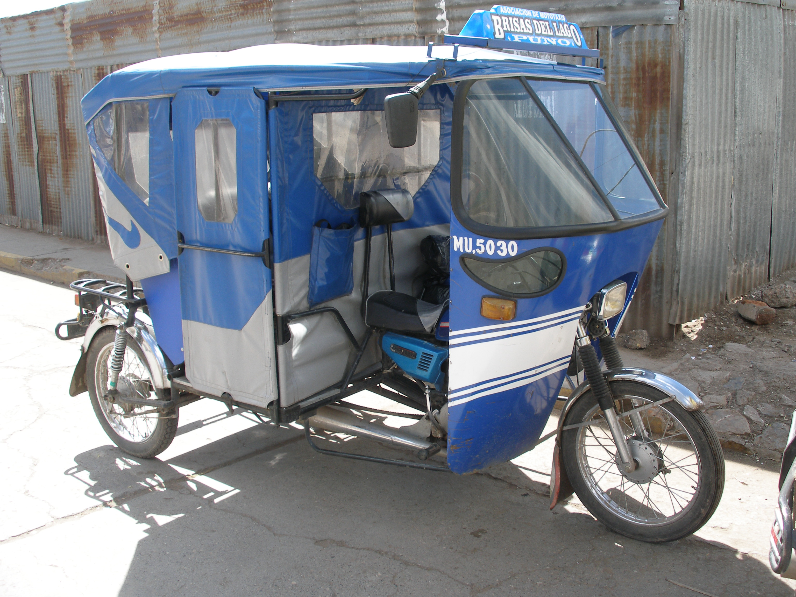
    </th>
  </tr>
  <!-- PERFIL -->
  <tr>
    <td rowspan="2" align="center"><b>Perfil</b></td>
    <td><b>Overview</b></td>
    <td>Plataforma que conecta pasajeros con mototaxistas en zonas periféricas, permitiendo negociación previa de tarifas.  </td>
    <td>Plataforma de intermediación en servicios de movilidad que implementa un modelo de pricing descentralizado, en el cual la tarifa es definida mediante negociación directa entre pasajero y conductor.  </td>
    <td>Plataforma global con tarifas dinámicas automatizadas.</td>
    <td>Sistema tradicional informal basado en contacto directo en la vía pública.</td>
  </tr>
  <tr>
    <td><b>Ventaja competitiva:<br>¿Qué valor ofrece a los clientes?</b></td>
    <td> Adaptación del transporte informal mediante digitalización ligera, permitiendo negociación previa en entornos de baja conectividad. </td>
    <td> Plataforma que ofrece flexibilidad en la definición de precios mediante negociación directa entre usuario y conductor.</td>
    <td> Alta disponibilidad respaldada por infraestructura tecnológica avanzada y sistemas de seguridad en los viajes.</td>
    <td> Alta presencia local y rapidez en zonas de difícil acceso. </td>
  </tr>
  <!-- PERFIL DE MARKETING -->
  <tr>
    <td rowspan="2" align="center"><b>Perfil de Marketing</b></td>
    <td><b>Mercado objetivo</b></td>
    <td> Usuarios en zonas rurales o alejadas</td>
    <td> Usuarios sensibles al precio en ciudades </td>
    <td> Usuarios urbanos con acceso a smartphones y pagos digitales. </td>
    <td> Población local sin acceso a apps o transporte formal </td>
  </tr>
  <tr>
    <td><b>Estrategias de marketing</b></td>
    <td> Alianzas con asociaciones de mototaxistas, boca a boca, campañas locales además de promocionarse por redes sociales</td>
    <td> Uso de marketing digital con la premisa de “precio justo”. </td>
    <td> Promociones, descuentos, posicionamiento global. </td>
    <td> Paraderos físicos o recomendaciones locales </td>
  </tr>
  <!-- PERFIL DE PRODUCTO -->
  <tr>
    <td rowspan="3" align="center"><b>Perfil de Producto</b></td>
    <td><b>Productos & Servicios</b></td>
    <td>Facilidad de transporte mediante mototaxi y motos lineales.</td>
    <td>Transporte en vehículos particulares y servicios de entrega.</td>
    <td>Transporte urbano (UberX, Uber Moto), delivery (Uber Eats).</td>
    <td>Transporte en mototaxis y motos lineales mediante contacto directo.</td>
  </tr>
  <tr>
    <td><b>Precios & Costos</b></td>
    <td>Precio basado en negociación previa entre pasajero y conductor.</td>
    <td>Modelo de negociación directa donde el usuario propone la tarifa, complementado con comisión por viaje aplicado por la plataforma.</td>
    <td>Modelo de negociación basado en oferta y demanda, con comisión por transacción.</td>
    <td>Negociación presencial sin estandarización de tarifas o formalidad de costos.</td>
  </tr>
  <tr>
    <td><b>Canales de distribución<br>(Web y/o Móvil)</b></td>
    <td>Aplicación web progresiva (PWA) accesible desde navegador móvil, complementada con difusión mediante redes sociales y alianzas con asociaciones locales </td>
    <td>Aplicación móvil (Android / iOS) distribuida mediante tiendas digitales y campañas de marketing digital </td>
    <td>Aplicación móvil (Android / iOS) distribuida globalmente a través de tiendas digitales y ecosistema digital integrado</td>
    <td>Canal presencial basado en paraderos informales, contacto directo en vía pública</td>
  </tr>
  <!-- SWOT -->
  <tr>
    <td rowspan="4" align="center"><b>Análisis SWOT</b></td>
    <td><b>Fortalezas</b></td>
    <td>Modelo híbrido que combina la flexibilidad del transporte informal con la coordinación digital.</td>
    <td>Implementación de un modelo donde se prioriza el control sobre los costos a los usuarios.</td>
    <td>Fuerte posicionamiento de la marca y gran percepción de seguridad.</td>
    <td>Costos operatvos bajos, además de una alta adaptabilidad en diferentes zonas.</td>
  </tr>
  <tr>
    <td><b>Debilidades</b></td>
    <td>Dependencia de adopción inicial en un entorno con baja confianza digital y limitada experiencia tecnológica de los conductores</td>
    <td>Variabilidad de costos entre el conductor y pasajero, generando inconsistencia en la experiencia.</td>
    <td>Baja eficiencia en zonas rurales o de baja densidad de usuarios.</td>
    <td>Ausencia de sistemas de información y coordinación.</td>
  </tr>
  <tr>
    <td><b>Oportunidades</b></td>
    <td>Alta demanda insatisfecha en zonas rurales y posibilidad de digitalizar un sistema de transporte ya existente.</td>
    <td>Usuarios con preferencias a precios accesibles.</td>
    <td>Expansión y adopción de nuevos servicios.</td>
    <td>Posibilidad de integración a plataformas digitales que mejoren la coordinación y seguridad.</td>
  </tr>
  <tr>
    <td><b>Amenazas</b></td>
    <td>Resistencia al cambio por parte de conductores informales.</td>
    <td>Regulaciones locales sobre transporte informal.</td>
    <td>Competidores locales adoptados culturalmente.</td>
    <td>Regulación por parte de las instituciones del estado.</td>
  </tr>
</table>

### 2.1.2. Estrategias y tácticas frente a competidores

<p align="justify">
  La estrategia competitiva de ChapaTuRuta se orienta a aprovechar la oportunidad existente en el mercado de transporte en ciudades intermedias y zonas periféricas del Perú, donde las plataformas tradicionales presentan baja cobertura y el servicio informal continúa predominando. Frente a competidores como InDrive, Uber y el transporte informal, nuestra propuesta busca diferenciarse mediante una solución especializada en mototaxis y motos lineales, adaptada a las necesidades reales de pasajeros y conductores en provincias.
  Como estrategia principal, se plantea el posicionamiento del producto a partir de sus fortalezas, especialmente el enfoque local, la accesibilidad tecnológica y la especialización del servicio. Esto permitirá responder a problemáticas identificadas como la falta de confianza, la informalidad del sector y la ausencia de herramientas digitales adaptadas a este tipo de transporte.
  En cuanto a las tácticas, se priorizará la formación de alianzas con asociaciones de mototaxistas y líderes locales, con el fin de facilitar la incorporación de conductores a la plataforma y reducir la resistencia al cambio frente al uso de herramientas digitales. Asimismo, se desarrollarán campañas de difusión en redes sociales y medios regionales, con el objetivo de reforzar la propuesta de valor centrada en seguridad, disponibilidad y rapidez del servicio.
  Finalmente, para enfrentar amenazas como el posicionamiento de marca de competidores consolidados y la preferencia habitual por el transporte informal, la plataforma incorporará funcionalidades orientadas a generar una experiencia de uso más segura, confiable y adaptada al contexto local. Entre ellas destacan la verificación de documentos del conductor, que incluyen licencia y SOAT vigente, lo cual permitirá brindar mayor respaldo al pasajero antes de confirmar el servicio. Del mismo modo, se implementará un sistema de calificaciones y comentarios mutuos entre pasajero y conductor, con el objetivo de fortalecer la confianza dentro del ecosistema y promover estándares de calidad en cada viaje.
  Adicionalmente, la geolocalización en tiempo real permitirá al usuario visualizar la ubicación del conductor cercano, estimar su tiempo de llegada y realizar un seguimiento básico del recorrido, lo cual reduce la incertidumbre propia del transporte informal. A ello se suma la visualización previa de la tarifa estimada o negociada antes de iniciar el viaje, funcionalidad clave para disminuir conflictos por cobros arbitrarios y mejorar la transparencia del servicio. Estas características no solo representan una ventaja competitiva frente a las alternativas actuales, sino que también contribuyen a formalizar progresivamente la experiencia de movilidad en mototaxi dentro de las ciudades objetivo.
</p>

## 2.2 Entrevistas

### 2.2.1. Diseño de entrevistas

#### Objetivo

- Comprender las necesidades, comportamientos, problemas y expectativas
  que todo ciudadano fuera de Lima tiene respecto al uso de servicios
  de transporte en mototaxis y moto lineal

#### Publico Objetivo

##### Se entrevistarán dos tipos de usuarios:

- Pasajeros frecuentes de mototaxis en provincias
- Conductores de motos lineales y mototaxis

##### Características:

- Edad: 18 a 60 años
- Uso frecuente de transporte informal
- Acceso a un smartphone

#### Tipo de entrevistas:

- Se utilizarán entrevistas previamente estructuradas por el equipo de este proyecto
  permitiendo obtener la información necesaria y detallada según cada respuesta del
  entrevistado

#### Metodología:

- Modalidad: Virtual
- Duración: 10 a 15 min por entrevista
- Registro: habrá un registro de entrevistas con notas escritas en nuestro proyecto

#### Preguntas para pasajeros:

1. ¿Con qué frecuencia utilizas mototaxis o motos lineales?
2. ¿Qué problemas has experimentado al usar estos servicios?
3. ¿Cómo sueles acordar el precio de un viaje?
4. ¿Qué factores consideras importantes al elegir un mototaxista?
5. ¿Te has sentido inseguro en algún viaje? ¿Por qué?
6. ¿Qué te haría confiar en una aplicación de transporte?
7. ¿Has utilizado aplicaciones como InDrive? ¿Cómo fue tu experiencia?
8. ¿Qué funcionalidades te gustaría que tenga una app de transporte?

#### Preguntas para conductores:

1. ¿Cuánto tiempo llevas trabajando como conductor?
2. ¿Cuáles son las principales dificultades que enfrentas en tu trabajo?
3. ¿Cómo consigues pasajeros actualmente?
4. ¿Qué opinas sobre el uso de aplicaciones para conseguir clientes?
5. ¿Te gustaría negociar precios desde una app? ¿Por qué?
6. ¿Qué funcionalidades te ayudarían a mejorar tus ingresos?
7. ¿Qué te motivaría a usar una aplicación como InMoto?

#### Consideraciones éticas:

- Se le solicitará al entrevistado el consentimiento de la grabación
  de las entrevistas asi como el trato de su información
- Se garantizará confidencialidad de información proporcionada
- Los datos solo serán utilizados con fines académicos

### 2.2.2. Registro de entrevistas

#### 1. Primer Segmento Objetivo: Pasajeros

<table style="width: 100%" align='center'>
  <tr>
    <th>Entrevistado 1</th>
    <th>Entrevistado 2</th>
    <th>Entrevistado 3</th>
  </tr>
  <tr>
    <td align='center'>
      <a href="https://upcedupe-my.sharepoint.com/:v:/g/personal/u202322952_upc_edu_pe/IQCmXEuLne2lTZsZnWYzY_9gAUFseCBoR-M_F5l_kv8R3z0?nav=eyJyZWZlcnJhbEluZm8iOnsicmVmZXJyYWxBcHAiOiJPbmVEcml2ZUZvckJ1c2luZXNzIiwicmVmZXJyYWxBcHBQbGF0Zm9ybSI6IldlYiIsInJlZmVycmFsTW9kZSI6InZpZXciLCJyZWZlcnJhbFZpZXciOiJNeUZpbGVzTGlua0NvcHkifX0&e=PqFbEC" target="_blank">
        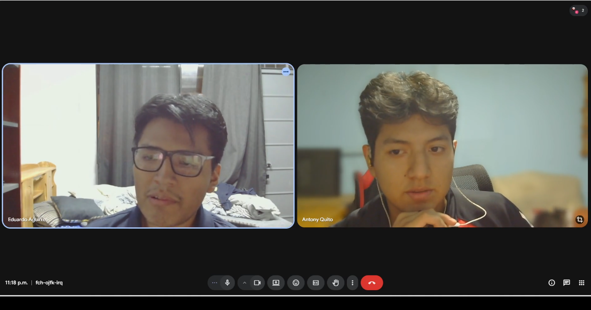
      </a>
    </td>
    <td align='center'>
      <a href="https://upcedupe-my.sharepoint.com/:v:/g/personal/u202322952_upc_edu_pe/IQAJRzJWsrYgQqENPUqhEN0RAXHT1EyZJLQRC1_SWpPcmrM?nav=eyJyZWZlcnJhbEluZm8iOnsicmVmZXJyYWxBcHAiOiJPbmVEcml2ZUZvckJ1c2luZXNzIiwicmVmZXJyYWxBcHBQbGF0Zm9ybSI6IldlYiIsInJlZmVycmFsTW9kZSI6InZpZXciLCJyZWZlcnJhbFZpZXciOiJNeUZpbGVzTGlua0NvcHkifX0&e=aW3d7L" target="_blank">
        
      </a>
    </td>
    <td align='center'>
      <a href="https://upcedupe-my.sharepoint.com/personal/u202322952_upc_edu_pe/_layouts/15/stream.aspx?id=%2Fpersonal%2Fu202322952%5Fupc%5Fedu%5Fpe%2FDocuments%2FChapa%20Tu%20Ruta%2FU20221F734%5FPasajero%5FArio%2Emp4&referrer=StreamWebApp%2EWeb&referrerScenario=AddressBarCopied%2Eview%2E8b926e8c%2D061d%2D495c%2Dac2c%2D1fe27cbfc8b2" target="_blank">
        
      </a>
    </td>
  </tr>
  <tr>
    <td valign="top">
      <b>Entrevistador:</b> Eduardo Manuel Aguirre Ramos <br>
      <b>Entrevistado:</b> Antony Rodrigo Quito Ancasy<br>
      <b>Edad:</b> 20 años <br>
      <b>Distrito:</b> Chorrillos <br>
      <b>Inicio de la entrevista:</b> 1:18 <br><br>
      <b>Resumen:</b> El entrevistado, joven de 20 años relató su experiencia sobre las mototaxis en la zona de Chorrillos,en el cual compartio sus dificultades tanto por el lado del precio como tambien el de no saber si el conductor pueda tener precaución al conducir además de ello aclaro que lo que priorizaria en una app de transporte seria ver el perfil del conductor para no tomar riesgos al pedir un viaje.
      <br><br>
      <b>Perfil del entrevistado:</b>Hombre de 20 años que reside en Lima por el distrito de Chorrillos, ha vivido toda su vida alli y menciona que mayormente para transportarse a diferentes zonas pide mototaxi regularmente, además menciona problemas que le sucede dia a dia como el tener que "regatear" precios ademas de miedo por tener que subirse a una mototaxi la cual el conductor para ahorrar tiempo se metio en contra de la ruta y puso en peligro al pasajero.
    </td>
    <td valign="top">
      <b>Entrevistador:</b> Jesús Iván Castillo Vidal <br>
      <b>Entrevistado:</b> Hairo Antony Cadillo Leon <br>
      <b>Edad:</b> 22 años <br>
      <b>Distrito:</b> Carhuaz <br>
      <b>Inicio de la entrevista:</b> 00:25 <br><br>
      <b>Resumen:</b> Hombre de 22 años que reside en el distrito de Carhuaz, donde ha vivido toda su vida. Menciona que utiliza mototaxis con regularidad para desplazarse a diferentes zonas y resalta los problemas diarios a los que se enfrenta, como la necesidad de "regatear" las tarifas. Asimismo, expresa el temor que le genera subir a este tipo de transporte, recordando ocasiones en las que el conductor, por intentar ahorrar tiempo, manejó en sentido contrario a la ruta permitida, poniendo en riesgo su seguridad como pasajero.
      <br><br>
      <b>Perfil del entrevistado:</b>Es un hombre de 22 años que reside en el distrito de Carhuaz, donde ha vivido toda su vida. Menciona que utiliza mototaxis con regularidad para desplazarse a diferentes zonas y resalta los problemas diarios a los que se enfrenta, como la necesidad de "regatear" las tarifas. Asimismo, expresa el temor que le genera subir a este tipo de transporte, recordando ocasiones en las que el conductor, por intentar ahorrar tiempo, manejó en sentido contrario a la ruta permitida, poniendo en riesgo su seguridad como pasajero.
    </td>
    <td valign="top">
      <b>Entrevistador:</b> Dalila Torres <br>
      <b>Entrevistado:</b> Ario Chavez <br>
      <b>Edad:</b> 22 años <br>
      <b>Distrito:</b> Huaraz <br>
      <b>Inicio de la entrevista:</b> 1:49 <br><br>
      <b>Resumen:</b> El entrevista Ario indica que en Huaraz si hay muchas mototaxis y que la mayoría de personas las utilizan para transporte público, que existen grupos de WhatsApp donde se coordinan los viajes y que los conductores son independientes. <br>
      <br>
      <b>Perfil del entrevistado:</b> Es un hombre de 22 años que reside en el distrito de Huaraz, donde menciona que es una ciudad turística y que hay mucha afluencia de personas, además menciona que las mototaxis son el principal medio de transporte público y que la mayoría de personas las utilizan para desplazarse a diferentes zonas y resalta los problemas diarios a los que se enfrenta, como la necesidad de "regatear" las tarifas. Asimismo, expresa el temor que le genera subir a este tipo de transporte, recordando ocasiones en las que el conductor, por intentar ahorrar tiempo, manejó en sentido contrario a la ruta permitida, poniendo en riesgo su seguridad como pasajero.
    </td>
  </tr>
</table>

Link de entrevistas: <a href="https://upcedupe-my.sharepoint.com/personal/u202322952_upc_edu_pe/_layouts/15/onedrive.aspx?id=%2Fpersonal%2Fu202322952%5Fupc%5Fedu%5Fpe%2FDocuments%2FChapa%20Tu%20Ruta&ga=1" target="_blank">Segmento 01- Pasajeros</a>

#### 2. Segundo Segmento Objetivo: Conductores

<table style="width: 100%" align='center'>
  <tr>
    <th>Entrevistado 1</th>
    <th>Entrevistado 2</th>
    <th>Entrevistado 3</th>
  </tr>
  <tr>
    <td align='center'>
      <a href="https://upcedupe-my.sharepoint.com/:v:/g/personal/u202322952_upc_edu_pe/IQBKFPAfIzczTo3_8oPqYhwCAUel6q27FjKYxx35O2p8ug8?nav=eyJyZWZlcnJhbEluZm8iOnsicmVmZXJyYWxBcHAiOiJPbmVEcml2ZUZvckJ1c2luZXNzIiwicmVmZXJyYWxBcHBQbGF0Zm9ybSI6IldlYiIsInJlZmVycmFsTW9kZSI6InZpZXciLCJyZWZlcnJhbFZpZXciOiJNeUZpbGVzTGlua0NvcHkifX0&e=H4pljz" target="_blank">
        
      </a>
    </td>
    <td align='center'>
      <a href="https://upcedupe-my.sharepoint.com/personal/u202322952_upc_edu_pe/_layouts/15/stream.aspx?id=%2Fpersonal%2Fu202322952%5Fupc%5Fedu%5Fpe%2FDocuments%2FChapa%20Tu%20Ruta%2FU202418823%5FMototaxista%5FArturo%2Emp4&referrer=StreamWebApp%2EWeb&referrerScenario=AddressBarCopied%2Eview%2Ea22c3202%2Db3fd%2D4b03%2D8315%2De50cb9756816" target="_blank">
        
      </a>
    </td>
    <td align='center'>
      <a href="https://upcedupe-my.sharepoint.com/personal/u202322952_upc_edu_pe/_layouts/15/stream.aspx?id=%2Fpersonal%2Fu202322952%5Fupc%5Fedu%5Fpe%2FDocuments%2FChapa%20Tu%20Ruta%2Fu201916755%5FMototaxi%5FCarlos%2Emp4&referrer=StreamWebApp%2EWeb&referrerScenario=AddressBarCopied%2Eview%2E999c3f21%2Df161%2D4548%2D9b24%2Ddd7866993c05" target="_blank">
        
      </a>
    </td>
  </tr>
  <tr>
    <td valign="top">
      <b>Entrevistador:</b> Eduardo Manuel Aguirre Ramos <br>
      <b>Entrevistado:</b> Jhonny Jesus Ramos Sandoval <br>
      <b>Edad:</b> 43 años <br>
      <b>Distrito:</b> Villa María del Triunfo<br>
      <b>Inicio de la entrevista:</b> 0:16 <br><br>
      <b>Resumen:</b> En la entrevista se presenta a un adulto de 43 años que tiene aproximadamente 20 años de experiencia en ese sector, indicó que tiene dificultades a encontrar personas, además del tráfico congestionado que se genera en Lima y los posibles peligros que generan otros vehiculos que circulan vayan a grandes velocidades, mencionoó el deseo de incluir en ChapaTuRuta puntos estratégico donde se concentre un gran número de persona, además refuerza la idea de no estar rondando o dando vueltas a esperar a un pasajero que tenga interes en ir sino ir directamente al punto y recoger al que pidio el servicio.<br><br>
      <b>Perfil del entrevistado:</b> Hombre de 43 años que reside en Lima por Villa Maria del Triunfo y cuenta con 20 años de experiencia en ese sector, busca la ayuda para facilitar el trabajo que hace dia a dia, cuenta con mototaxi y cuenta con un móbil,además de ello siente temor al hacer su labor diaria y encontrarse con conductores impurendentes y no poder sostener a su familia.
    </td>
    <td valign="top">
      <b>Entrevistador:</b> Andy Saúl Pillaca Gonzalles <br>
      <b>Entrevistado:</b> Arturo Nuñez <br>
      <b>Edad:</b> 23 años <br>
      <b>Distrito:</b> Lima <br>
      <b>Inicio de la entrevista:</b> 00:00 <br><br>
      <b>Resumen:</b> El entrevistado, joven de 23 años con experiencia de aproximadamente un año y medio como conductor de mototaxi en chincha, describió su trabajo como una actividad común entre personas de sus edad y una fuente importante de independiencia económica. Señaló que las principales dificultades incluye la alta compentencia entre conductores, la irregularidad de los ingresos, el mal estado de las vías y la inseguridad, especialmente en horarios nocturnos. Explicó que conseguía pasajeros principalmente en zonas de alta afluencia como mercados, colegios y avenidas, además de contar con algunos clientes recurrentes. Respecto al uso de aplicaciones, mostró una actitud positiva, destacando beneficios como la optimización del tiempo, mayor seguridad y posibilidad de recibir solicitudes directamente. También manifestó interés en funciones como negociación de tarifas dentro de la app, visualización de zonas de alta demanda en tiempo resal, integración de pagos digitales y sistemas de calificación. Finalmente, indicó que usaría una aplicación como Chapa Tu Ruta siempre que sea fácil de usar, tenga suficiente demanda, garantice seguridad y mantenga comisiones accesibles.<br><br>
      <b>Perfil del entrevistado:</b> Hombre joven de 23 años, actualmente residente en Lima y originario de Chincha. Cuenta con experiencia previa como conductor de mototaxi durante aproximadamente un año y medio, actividad que desempeñó como principal fuente de ingresos. Vive con su padre y posee conocimientos básicos en el uso de tecnología móvil. Representa a un segmento de conductores que buscan independencia económica y están abiertos a adoptar soluciones digitales que optimicen su tiempo, mejoren su seguridad y aumenten sus oportunidades de ingreso.
    </td>
    <td valign="top">
      <b>Entrevistador:</b> Sebastian Aiquipa Poma <br>
      <b>Entrevistado:</b> Carlos <br>
      <b>Edad:</b> 48 años <br>
      <b>Distrito:</b> Villa el Salvador <br>
      <b>Inicio de la entrevista:</b> 0:14 <br><br>
      <b>Resumen:</b>
El entrevistado, conductor de mototaxi con 8 años de experiencia en Villa El Salvador, compartió las principales dificultades de su trabajo como la inseguridad y la competencia excesiva en los paraderos. Explicó que actualmente consigue pasajeros de forma pasiva y mediante WhatsApp, y expresó interés en una aplicación que le permita negociar tarifas, visualizar zonas de demanda y construir reputación a través de calificaciones. Indicó que adoptaría una app como Chapa Tu Ruta si es fácil de usar, tiene comisiones bajas y le ofrece mayor seguridad al identificar a los pasajeros.<br><br>
      <b>Perfil del entrevistado:</b> Hombre de 48 años, residente de Villa El Salvador, conductor de mototaxi a tiempo completo desde hace 8 años. Cuenta con vehículo propio y un smartphone con manejo básico. Representa al segmento de conductores informales que buscan mejorar sus ingresos y seguridad laboral mediante herramientas digitales accesibles.
    </td>
  </tr>
</table>

Link de entrevistas: <a href="https://upcedupe-my.sharepoint.com/personal/u202322952_upc_edu_pe/_layouts/15/onedrive.aspx?id=%2Fpersonal%2Fu202322952%5Fupc%5Fedu%5Fpe%2FDocuments%2FChapa%20Tu%20Ruta&ga=1" target="_blank">Segmento 02- Conductores</a>

Más informacion en Anexo A.

### 2.2.3. Análisis de entrevistas

**Pasajeros**
Los tres pasajeros entrevistados coinciden en que el uso de mototaxis es habitual en sus zonas de residencia, ya sea en Lima o en ciudades como Carhuaz y Huaraz. Entre las principales problemáticas identificadas destacan la inseguridad durante el viaje, la imprevisibilidad en las tarifas y la falta de información sobre el conductor. Dos de los entrevistados mencionaron experiencias negativas relacionadas con conductores que priorizaban la velocidad sobre la seguridad, lo que generó desconfianza hacia el servicio. En cuanto a las expectativas frente a una aplicación, los pasajeros priorizaron la visibilidad del perfil del conductor como mecanismo para reducir el riesgo percibido. Adicionalmente, se identificó que en algunas zonas como Huaraz ya existen mecanismos informales de coordinación de viajes mediante grupos de WhatsApp, lo que sugiere una disposición latente hacia herramientas digitales de transporte.

**Conductores**
Los tres conductores entrevistados, con experiencias que van desde un año y medio hasta veinte años en el sector, comparten dificultades estructurales similares: la búsqueda ineficiente de pasajeros, la alta competencia en paraderos, la inseguridad en horarios nocturnos y la irregularidad de los ingresos. Los conductores con más experiencia, tanto en Lima como en Villa El Salvador, destacaron el tiempo perdido circulando sin pasajeros como uno de sus principales problemas operativos, y manifestaron interés en contar con puntos estratégicos de recogida o mapas de demanda en tiempo real. Los tres mostraron una actitud positiva frente al uso de una aplicación, valorando especialmente funciones como la negociación de tarifas dentro de la plataforma, la visualización de zonas de alta demanda, los sistemas de calificación y la identificación de pasajeros como medida de seguridad. Coincidieron en que adoptarían Chapa Tu Ruta siempre que sea intuitiva, tenga comisiones accesibles y cuente con suficiente base de usuarios.

## 2.3 Need finding

### 2.3.1. User Personas

Para comprender mejor las necesidades y comportamientos de los usuarios de ChapaTuRuta, se elaboraron dos User Personas basados en los segmentos objetivo identificados en el proyecto: pasajeros y conductores de mototaxi en ciudades intermedias del Perú.

Ana Flores representa a los pasajeros que utilizan el mototaxi como su principal medio de transporte diario. Reside en Huarmey y enfrenta de manera recurrente la incertidumbre sobre la disponibilidad del servicio, la variación de tarifas y la imposibilidad de verificar la identidad del conductor antes del abordaje.

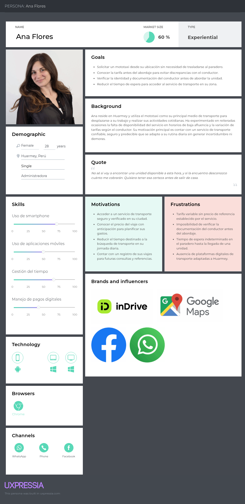<br>

<p>Luis Gutierrez representa a los conductores formales de mototaxi. Opera en Casma con licencia y SOAT vigentes, y su principal problemática es la falta de información sobre la demanda, lo que genera desplazamientos sin pasajero y una reducción en sus ingresos diarios.
</p>

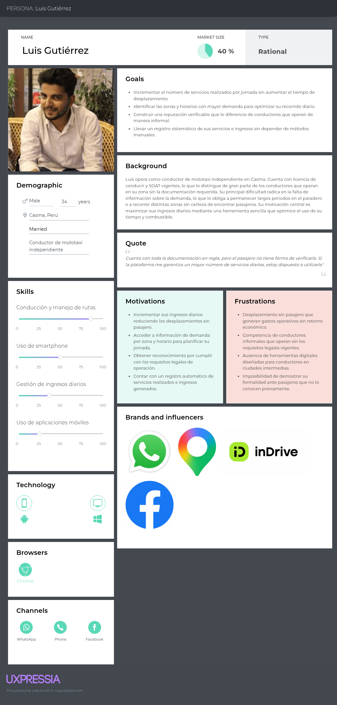

### 2.3.2. User Task Matrix

La User Task Matrix nos permite descomponer las actividades y tareas que nuestros usuarios realizan al utilizar la solución propuesta. Estas tareas, al clasificarse por su frecuencia e importancia, nos ayudan a priorizar qué funcionalidades de ChapaTuRuta deben desarrollarse con mayor énfasis para optimizar la experiencia de cada segmento.

Los segmentos considerados para este análisis son:

- **Pasajero (Ana Flores)**
- **Mototaxista (Luis Gutiérrez)**

---

### Task Matrix

| **Tarea**                                               | **Ana Flores (Pasajero)** |                 | **Luis Gutiérrez (Mototaxista)** |                 |
| ------------------------------------------------------- | ------------------------- | --------------- | -------------------------------- | --------------- |
|                                                         | **Frecuencia**            | **Importancia** | **Frecuencia**                   | **Importancia** |
| Solicitar un viaje                                      | Always                    | High            | Never                            | —               |
| Aceptar o rechazar solicitudes de viaje                 | Never                     | —               | Always                           | High            |
| Consultar disponibilidad de mototaxistas cercanos       | Always                    | High            | Rarely                           | Low             |
| Activar/desactivar disponibilidad para recibir carreras | Never                     | —               | Always                           | High            |
| Revisar el perfil y calificación del conductor          | Often                     | High            | Rarely                           | Low             |
| Calificar al conductor al finalizar el viaje            | Often                     | High            | Often                            | High            |
| Calificar al pasajero al finalizar el viaje             | Never                     | —               | Often                            | Medium          |
| Consultar historial de viajes realizados                | Sometimes                 | Medium          | Sometimes                        | Medium          |
| Verificar el precio referencial del viaje               | Always                    | High            | Sometimes                        | Medium          |
| Gestionar datos del perfil personal                     | Sometimes                 | Medium          | Sometimes                        | Medium          |
| Verificar documentos del conductor (brevete, SOAT)      | Sometimes                 | High            | Rarely                           | Low             |
| Reportar incidencias o problemas en el viaje            | Rarely                    | High            | Rarely                           | High            |

---

### Análisis

El **pasajero** concentra sus acciones en encontrar transporte de forma rápida y confiable. Sus tareas de mayor frecuencia e importancia giran en torno a solicitar el viaje, verificar el precio referencial y revisar el perfil del mototaxista antes de aceptar. La calificación post-viaje también es relevante porque alimenta el sistema de confianza de la plataforma, que es precisamente el diferenciador de ChapaTuRuta frente al contacto informal por WhatsApp.

El **mototaxista** orienta su actividad a la gestión de su disponibilidad y la atención de carreras. Activarse en la plataforma y aceptar solicitudes son sus tareas más frecuentes e importantes, siendo estas el núcleo de su experiencia. La calificación que recibe de los pasajeros impacta directamente en su visibilidad dentro de la app, por lo que también tiene un peso significativo en su rutina.

Ambos perfiles coinciden en la importancia de **calificar al finalizar el viaje** y **reportar incidencias**, ya que estas acciones sostienen la confianza y seguridad del ecosistema. Cualquier problema no reportado deteriora la experiencia de ambos lados de la plataforma.

### 2.3.3. User Journey Mapping


<br><br>


### 2.3.4. Empathy Mapping

**Ana Flores**
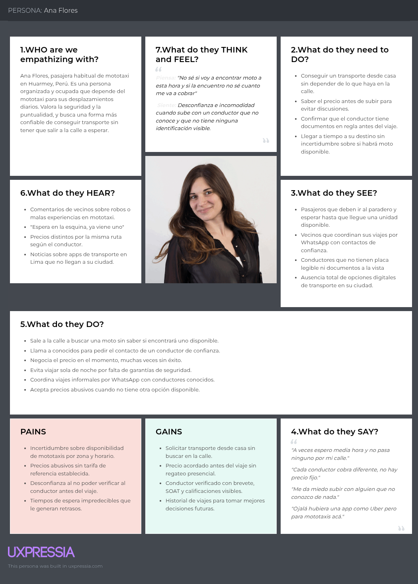

**Luis Gutiérrez**
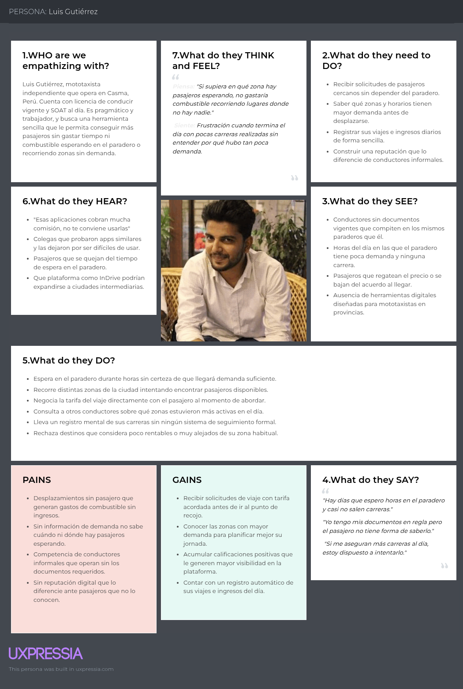

## 2.4 Big Picture Event Storming

### Registro

En esta fase se modela el proceso de incorporación de nuevos usuarios a la plataforma. El pasajero y el conductor se registran proporcionando sus datos básicos.

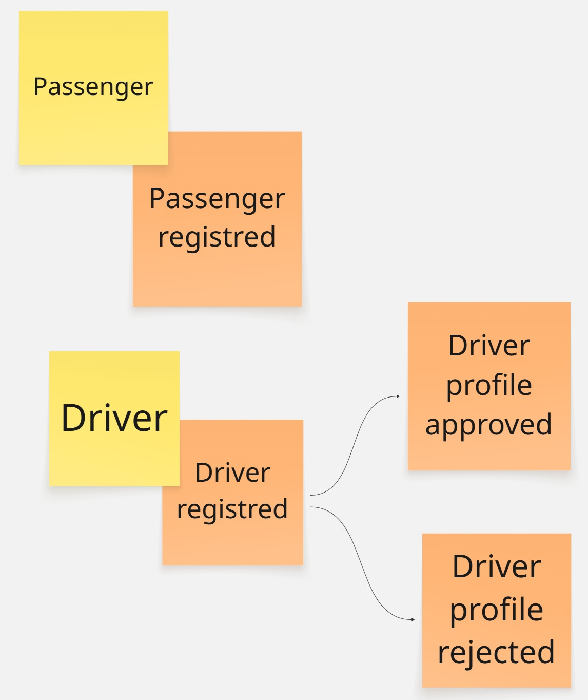

### Descubrimiento

Una vez registrado, el pasajero abre la aplicación y su ubicación es detectada automáticamente. El sistema muestra en un mapa los conductores disponibles cercanos.

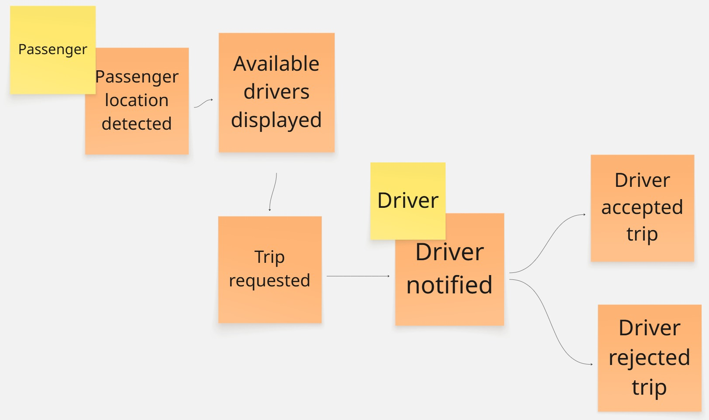

### Pre-viaje

Una vez aceptada la solicitud, el sistema calcula automáticamente la tarifa estimada basándose en la distancia. El pasajero confirma la tarifa antes de iniciar el viaje.

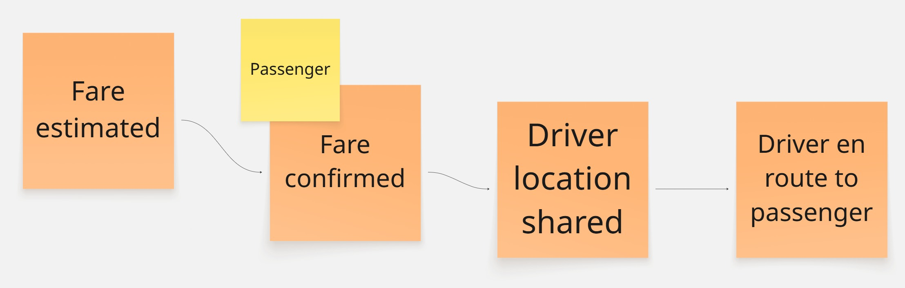

### Ejecución del viaje

El conductor llega al punto de recojo y confirma el inicio del viaje. Durante esta fase el trayecto queda registrado en el sistema. El viaje puede ser cancelado por cualquiera de las dos partes.

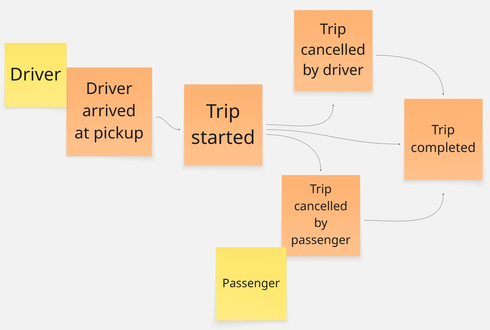

### Post-viaje

Al completarse el viaje, el sistema registra el cobro de la tarifa y solicita la calificacion del conductor.

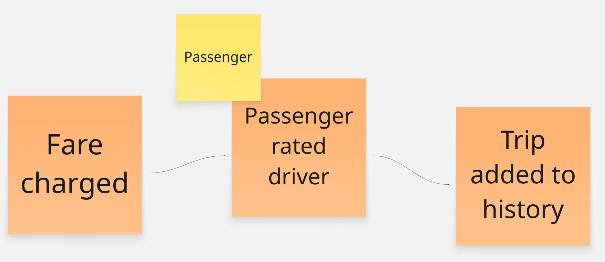

## 2.5 Ubiquitous Language

| Term (EN)       | Definición (ES)                                                             |
| --------------- | --------------------------------------------------------------------------- |
| Passenger       | Persona que solicita un servicio de transporte mediante la plataforma.      |
| Driver          | Mototaxista o persona que ofrece el servicio de transporte.                 |
| Ride            | Trayecto solicitado por el pasajero desde un punto de origen a un destino.  |
| Fare            | Monto acordado entre pasajero y conductor antes de iniciar el viaje.        |
| Negotiation     | Proceso mediante el cual pasajero y conductor acuerdan la tarifa del viaje. |
| Ride Request    | Solicitud inicial del pasajero para encontrar un conductor disponible.      |
| Acceptance      | Acción del conductor al aceptar una solicitud de viaje.                     |
| Counteroffer    | Propuesta alternativa de tarifa realizada por el conductor.                 |
| Peripheral Area | Zona geográfica con baja cobertura de transporte formal.                    |
| Ride History    | Registro de viajes realizados por el usuario dentro de la plataforma.       |
| Rating          | Evaluación que realiza el pasajero o conductor después de un viaje.         |


---

## Capítulo III: Requirements Specification

### 3.1. User Stories

| Epic ID | Título                           | Descripción                                                                                                                                                            |
| ------- | -------------------------------- | ---------------------------------------------------------------------------------------------------------------------------------------------------------------------- |
| EP-01   | Gestión de Identidad y Acceso    | Como equipo, necesitamos gestionar el registro, inicio de sesión y perfiles de pasajeros, conductores y administradores para garantizar acceso seguro a la plataforma. |
| EP-02   | Gestión de Viajes                | Como equipo, necesitamos gestionar la solicitud, aceptación, rechazo, inicio, finalización y cancelación de viajes para soportar el flujo principal del servicio.      |
| EP-03   | Geolocalización y Notificaciones | Como equipo, necesitamos proveer un mapa en tiempo real, proximidad de conductores y notificaciones en tiempo real vía Ably para mantener informados a los usuarios.   |
| EP-04   | Tarifas y Calificaciones         | Como equipo, necesitamos gestionar las tarifas calculadas por distancia y el sistema de calificaciones para garantizar transparencia y confianza en la plataforma.     |
| EP-05   | Historial y Administración       | Como equipo, necesitamos registrar viajes, gestionar cuentas y generar reportes para soportar la operación y administración de la plataforma.                          |
| EP-06   | Experiencia en Landing Page      | Como equipo, necesitamos un Landing Page informativo y persuasivo que comunique la propuesta de valor de ChapaTuRuta a los segmentos objetivo.                         |
| EP-07   | Wallet y Pagos                   | Como equipo, necesitamos gestionar la recarga del wallet del conductor mediante Stripe y el descuento automático de comisiones por viaje para monetizar la plataforma. |

---

| Epic / Story ID | Título                                                    | Descripción                                                                                                                                                                                         | Criterios de Aceptación                                                                                                                                                                                                                                                                                                                                                                                                                                                                                                                                                                                                                                                                                                                                                                                                                                                                                | Relacionado con (Epic ID) |
| --------------- | --------------------------------------------------------- | --------------------------------------------------------------------------------------------------------------------------------------------------------------------------------------------------- | ------------------------------------------------------------------------------------------------------------------------------------------------------------------------------------------------------------------------------------------------------------------------------------------------------------------------------------------------------------------------------------------------------------------------------------------------------------------------------------------------------------------------------------------------------------------------------------------------------------------------------------------------------------------------------------------------------------------------------------------------------------------------------------------------------------------------------------------------------------------------------------------------------ | ------------------------- |
| US-01           | Registro de pasajero                                      | **Como visitante**, quiero registrarme como pasajero ingresando mi correo y contraseña para poder solicitar viajes en la plataforma.                                                                | **Escenario 1: Registro exitoso**<br>**Dado** que el visitante está en la página de registro<br>**Cuando** ingresa un correo válido y una contraseña<br>**Entonces** la cuenta es creada correctamente<br>**Y** es redirigido a la vista principal del mapa<br><br>**Escenario 2: Correo ya registrado**<br>**Dado** que el visitante está en la página de registro<br>**Cuando** ingresa un correo que ya existe en el sistema<br>**Entonces** el sistema muestra un mensaje indicando que el correo ya está en uso                                                                                                                                                                                                                                                                                                                                                                                   | EP-01                     |
| US-02           | Registro de conductor                                     | **Como visitante**, quiero registrarme como conductor ingresando mis datos personales y documentos de habilitación para ofrecer mis servicios en la plataforma.                                     | **Escenario 1: Registro exitoso con documentos**<br>**Dado** que el visitante está en la página de registro de conductor<br>**Cuando** ingresa correo, contraseña, número de brevete y número de SOAT vigente<br>**Entonces** la cuenta es creada y queda en estado pendiente de verificación por el administrador<br><br>**Escenario 2: Datos incompletos**<br>**Dado** que el visitante está completando el registro<br>**Cuando** intenta enviar el formulario sin completar todos los campos obligatorios<br>**Entonces** el sistema muestra mensajes de error en los campos faltantes                                                                                                                                                                                                                                                                                                             | EP-01                     |
| US-03           | Inicio de sesión                                          | **Como usuario registrado**, quiero iniciar sesión con mi correo y contraseña para acceder a mi cuenta.                                                                                             | **Escenario 1: Inicio de sesión exitoso**<br>**Dado** que el usuario tiene una cuenta registrada<br>**Cuando** ingresa su correo y contraseña correctos<br>**Entonces** accede a la plataforma y es redirigido a su vista principal según su rol<br><br>**Escenario 2: Credenciales incorrectas**<br>**Dado** que el usuario intenta iniciar sesión<br>**Cuando** ingresa un correo o contraseña incorrectos<br>**Entonces** el sistema muestra un mensaje de error genérico sin especificar cuál campo es incorrecto                                                                                                                                                                                                                                                                                                                                                                                  | EP-01                     |
| US-04           | Gestión de perfil                                         | **Como usuario**, quiero visualizar y editar mi información de perfil para mantener mis datos actualizados.                                                                                         | **Escenario 1: Visualización de perfil**<br>**Dado** que el usuario ha iniciado sesión<br>**Cuando** accede a la sección de perfil<br>**Entonces** visualiza su nombre, correo, foto y en caso de conductor sus documentos registrados<br><br>**Escenario 2: Edición exitosa**<br>**Dado** que el usuario está en su perfil<br>**Cuando** modifica su nombre o foto y guarda los cambios<br>**Entonces** la información se actualiza correctamente y se refleja en su perfil                                                                                                                                                                                                                                                                                                                                                                                                                           | EP-01                     |
| US-05           | Cierre de sesión                                          | **Como usuario**, quiero cerrar sesión para proteger el acceso a mi cuenta.                                                                                                                         | **Escenario 1: Cierre de sesión exitoso**<br>**Dado** que el usuario ha iniciado sesión<br>**Cuando** selecciona la opción de cerrar sesión<br>**Entonces** su sesión finaliza correctamente<br>**Y** es redirigido a la página de inicio de sesión                                                                                                                                                                                                                                                                                                                                                                                                                                                                                                                                                                                                                                                    | EP-01                     |
| US-06           | Verificación de documentos del conductor                  | **Como administrador**, quiero revisar y aprobar o rechazar los documentos de los conductores registrados para garantizar que solo conductores formales operen en la plataforma.                    | **Escenario 1: Aprobación de conductor**<br>**Dado** que el administrador está en el panel de gestión de conductores<br>**Cuando** revisa los datos de brevete y SOAT de un conductor pendiente y los aprueba<br>**Entonces** el conductor queda habilitado para recibir solicitudes de viaje en la plataforma<br><br>**Escenario 2: Rechazo de conductor**<br>**Dado** que el administrador revisa los documentos de un conductor<br>**Cuando** detecta que los datos son incorrectos o están vencidos y rechaza el registro<br>**Entonces** el conductor recibe una notificación indicando el motivo del rechazo y puede actualizar sus datos                                                                                                                                                                                                                                                        | EP-01                     |
| US-07           | Detección automática de ubicación del pasajero            | **Como pasajero**, quiero que el sistema detecte automáticamente mi ubicación al ingresar a la aplicación para poder solicitar un viaje sin ingresarla manualmente.                                 | **Escenario 1: Detección exitosa**<br>**Dado** que el pasajero accede a la aplicación<br>**Cuando** acepta los permisos de ubicación en su dispositivo<br>**Entonces** el sistema detecta su ubicación actual y la muestra en el mapa como punto de origen<br><br>**Escenario 2: Permiso denegado**<br>**Dado** que el pasajero no concede permisos de ubicación<br>**Cuando** intenta solicitar un viaje<br>**Entonces** el sistema le solicita ingresar manualmente el punto de origen en el mapa                                                                                                                                                                                                                                                                                                                                                                                                    | EP-03                     |
| US-08           | Selección de destino en el mapa                           | **Como pasajero**, quiero seleccionar mi destino en el mapa para que el sistema calcule la ruta y el precio estimado del viaje.                                                                     | **Escenario 1: Selección de destino exitosa**<br>**Dado** que el pasajero tiene su origen detectado en el mapa<br>**Cuando** selecciona un punto de destino en el mapa<br>**Entonces** el sistema traza la ruta entre origen y destino<br>**Y** muestra el precio estimado calculado por distancia<br><br>**Escenario 2: Destino fuera del área de cobertura**<br>**Dado** que el pasajero selecciona un destino<br>**Cuando** el punto seleccionado está fuera del área de operación configurada<br>**Entonces** el sistema muestra un mensaje indicando que el destino no está dentro de la zona de cobertura                                                                                                                                                                                                                                                                                        | EP-03                     |
| US-09           | Visualización de conductores cercanos en el mapa          | **Como pasajero**, quiero visualizar en el mapa los conductores disponibles cerca de mi ubicación para identificar rápidamente opciones de transporte.                                              | **Escenario 1: Conductores disponibles**<br>**Dado** que el pasajero ha ingresado a la vista principal del mapa<br>**Cuando** existen conductores activos en su zona<br>**Entonces** el sistema muestra los íconos de conductores en el mapa actualizados en tiempo real vía Ably<br><br>**Escenario 2: Sin conductores disponibles**<br>**Dado** que el pasajero se encuentra en una zona sin conductores activos<br>**Cuando** el mapa carga la información<br>**Entonces** el sistema muestra un mensaje indicando que no hay conductores cercanos en este momento                                                                                                                                                                                                                                                                                                                                  | EP-03                     |
| US-10           | Notificación en tiempo real de aceptación de viaje        | **Como pasajero**, quiero recibir una notificación en tiempo real cuando un conductor acepte mi solicitud para saber que mi viaje ha sido confirmado.                                               | **Escenario 1: Aceptación exitosa**<br>**Dado** que un conductor acepta la solicitud de viaje<br>**Cuando** la acción se registra en el sistema<br>**Entonces** el pasajero recibe una notificación instantánea vía Ably con el nombre, foto y calificación del conductor asignado<br><br>**Escenario 2: Expiración de la solicitud**<br>**Dado** que ningún conductor acepta la solicitud en el tiempo límite configurado<br>**Cuando** la solicitud expira<br>**Entonces** el sistema notifica al pasajero que debe realizar una nueva solicitud                                                                                                                                                                                                                                                                                                                                                     | EP-03                     |
| US-11           | Notificación en tiempo real de rechazo de solicitud       | **Como pasajero**, quiero ser notificado en tiempo real cuando un conductor rechaza mi solicitud para tomar acciones alternativas.                                                                  | **Escenario 1: Rechazo de solicitud**<br>**Dado** que un conductor rechaza una solicitud<br>**Cuando** la acción se procesa en el sistema<br>**Entonces** el pasajero recibe una notificación instantánea vía Ably indicando que el conductor no pudo atender su solicitud<br><br>**Escenario 2: Sin conductores disponibles tras múltiples rechazos**<br>**Dado** que múltiples conductores han rechazado la solicitud<br>**Cuando** se alcanza el límite de rechazos configurado<br>**Entonces** el sistema sugiere al pasajero reintentar en unos minutos                                                                                                                                                                                                                                                                                                                                           | EP-03                     |
| US-12           | Visualización de ubicación del pasajero para el conductor | **Como conductor**, quiero visualizar en el mapa la ubicación del pasajero que solicita el viaje para dirigirme correctamente al punto de recojo.                                                   | **Escenario 1: Ubicación disponible**<br>**Dado** que el conductor ha aceptado una solicitud de viaje<br>**Cuando** accede a la vista del mapa<br>**Entonces** el sistema muestra la ubicación del pasajero como punto de recojo y la ruta sugerida para llegar<br><br>**Escenario 2: Ubicación no disponible**<br>**Dado** que el conductor ha aceptado la solicitud<br>**Cuando** el sistema no puede obtener la ubicación del pasajero<br>**Entonces** muestra un mensaje indicando que la ubicación no está disponible temporalmente                                                                                                                                                                                                                                                                                                                                                               | EP-03                     |
| US-13           | Activar y desactivar disponibilidad del conductor         | **Como conductor**, quiero activar o desactivar mi disponibilidad para recibir solicitudes de viaje según mi situación en cada momento.                                                             | **Escenario 1: Activación de disponibilidad**<br>**Dado** que el conductor ha iniciado sesión y tiene saldo en su wallet<br>**Cuando** activa su disponibilidad<br>**Entonces** su ícono aparece en el mapa para los pasajeros cercanos en tiempo real vía Ably<br><br>**Escenario 2: Intento de activación sin saldo**<br>**Dado** que el conductor intenta activar su disponibilidad<br>**Cuando** su wallet tiene saldo en cero<br>**Entonces** el sistema le impide activarse y le muestra un mensaje indicando que debe recargar su wallet para continuar operando                                                                                                                                                                                                                                                                                                                                | EP-02                     |
| US-14           | Visualización de solicitudes de viaje disponibles         | **Como conductor**, quiero ver las solicitudes de viaje cercanas en tiempo real para decidir cuál aceptar.                                                                                          | **Escenario 1: Solicitud recibida en tiempo real**<br>**Dado** que el conductor está disponible en la plataforma<br>**Cuando** un pasajero cercano genera una solicitud de viaje<br>**Entonces** el conductor recibe la notificación vía Ably con el origen, destino y precio estimado del viaje<br><br>**Escenario 2: Sin solicitudes cercanas**<br>**Dado** que el conductor está disponible<br>**Cuando** no hay solicitudes activas en su zona<br>**Entonces** el sistema muestra su estado como disponible en espera de solicitudes                                                                                                                                                                                                                                                                                                                                                               | EP-02                     |
| US-15           | Solicitud de viaje por parte del pasajero                 | **Como pasajero**, quiero confirmar mi solicitud de viaje luego de seleccionar origen, destino y revisar el precio estimado para que los conductores cercanos puedan verla.                         | **Escenario 1: Solicitud enviada exitosamente**<br>**Dado** que el pasajero ha seleccionado origen y destino<br>**Cuando** revisa el precio estimado y confirma la solicitud<br>**Entonces** el sistema registra la solicitud y la distribuye en tiempo real vía Ably a los conductores disponibles cercanos<br><br>**Escenario 2: Sin conductores disponibles al momento de solicitar**<br>**Dado** que el pasajero confirma su solicitud<br>**Cuando** no hay conductores activos en su zona<br>**Entonces** el sistema notifica al pasajero que no hay conductores disponibles en este momento y le sugiere reintentar                                                                                                                                                                                                                                                                              | EP-02                     |
| US-16           | Aceptación de solicitud de viaje por el conductor         | **Como conductor**, quiero aceptar una solicitud de viaje para confirmar que me dirijo al punto de recojo del pasajero.                                                                             | **Escenario 1: Aceptación exitosa**<br>**Dado** que el conductor recibe una solicitud de viaje<br>**Cuando** selecciona aceptar<br>**Entonces** el sistema asigna el viaje al conductor<br>**Y** notifica al pasajero vía Ably con los datos del conductor confirmado<br><br>**Escenario 2: Solicitud ya tomada por otro conductor**<br>**Dado** que el conductor intenta aceptar una solicitud<br>**Cuando** otro conductor ya la aceptó previamente<br>**Entonces** el sistema informa que la solicitud ya no está disponible                                                                                                                                                                                                                                                                                                                                                                        | EP-02                     |
| US-17           | Inicio y finalización del viaje                           | **Como conductor**, quiero marcar el inicio y la finalización del viaje para que el sistema registre el estado correctamente y procese la comisión correspondiente.                                 | **Escenario 1: Inicio de viaje**<br>**Dado** que el conductor ha llegado al punto de recojo<br>**Cuando** marca el viaje como iniciado<br>**Entonces** el sistema actualiza el estado del viaje a "en curso"<br>**Y** notifica al pasajero vía Ably que el viaje ha comenzado<br><br>**Escenario 2: Finalización de viaje**<br>**Dado** que el conductor ha llegado al destino<br>**Cuando** marca el viaje como finalizado<br>**Entonces** el sistema registra el viaje como completado<br>**Y** descuenta automáticamente la comisión del 5% del wallet del conductor                                                                                                                                                                                                                                                                                                                                | EP-02                     |
| US-18           | Cancelación de viaje                                      | **Como pasajero o conductor**, quiero cancelar un viaje antes de que inicie para liberar la solicitud en el sistema.                                                                                | **Escenario 1: Cancelación por el pasajero**<br>**Dado** que el pasajero tiene un viaje confirmado que aún no ha iniciado<br>**Cuando** selecciona cancelar el viaje<br>**Entonces** el sistema cancela el viaje y notifica al conductor vía Ably<br><br>**Escenario 2: Cancelación por el conductor**<br>**Dado** que el conductor tiene un viaje aceptado que aún no ha iniciado<br>**Cuando** selecciona cancelar el viaje<br>**Entonces** el sistema cancela el viaje, notifica al pasajero vía Ably y la solicitud vuelve a estar disponible para otros conductores                                                                                                                                                                                                                                                                                                                               | EP-02                     |
| US-19           | Cálculo de tarifa por distancia                           | **Como pasajero**, quiero ver el precio estimado de mi viaje calculado automáticamente según la distancia entre mi origen y destino para conocer el costo antes de confirmar.                       | **Escenario 1: Cálculo exitoso**<br>**Dado** que el pasajero ha seleccionado origen y destino en el mapa<br>**Cuando** el sistema calcula la distancia usando la fórmula de Haversine<br>**Entonces** muestra el precio estimado aplicando la fórmula: Tarifa base + (Precio por km × distancia), respetando el precio mínimo configurado<br><br>**Escenario 2: Distancia mínima no alcanzada**<br>**Dado** que el origen y destino están muy cercanos<br>**Cuando** el precio calculado es menor al precio mínimo configurado<br>**Entonces** el sistema aplica automáticamente el precio mínimo como tarifa del viaje                                                                                                                                                                                                                                                                                | EP-04                     |
| US-20           | Configuración de tarifas por el administrador             | **Como administrador**, quiero configurar la tarifa base, el precio por kilómetro y el precio mínimo por viaje para que el sistema calcule automáticamente el costo de cada carrera.                | **Escenario 1: Configuración exitosa**<br>**Dado** que el administrador está en el panel de configuración de tarifas<br>**Cuando** ingresa valores válidos para tarifa base, precio por km y precio mínimo y guarda los cambios<br>**Entonces** el sistema actualiza los parámetros y los aplica en los próximos cálculos de precio<br><br>**Escenario 2: Valores inválidos**<br>**Dado** que el administrador intenta guardar la configuración<br>**Cuando** ingresa valores negativos o en cero<br>**Entonces** el sistema muestra un mensaje de error indicando que los valores deben ser mayores a cero                                                                                                                                                                                                                                                                                            | EP-04                     |
| US-21           | Calificación post-viaje al conductor                      | **Como pasajero**, quiero calificar al conductor al finalizar el viaje para contribuir a su reputación en la plataforma.                                                                            | **Escenario 1: Calificación registrada**<br>**Dado** que el viaje ha sido marcado como finalizado<br>**Cuando** el pasajero asigna una puntuación del 1 al 5 y confirma<br>**Entonces** el sistema registra la calificación y actualiza el puntaje promedio del conductor<br><br>**Escenario 2: Calificación omitida**<br>**Dado** que el viaje ha finalizado y el pasajero no califica<br>**Cuando** transcurren 24 horas sin calificación<br>**Entonces** el sistema omite la calificación sin afectar el historial del conductor                                                                                                                                                                                                                                                                                                                                                                    | EP-04                     |
| US-22           | Calificación post-viaje al pasajero                       | **Como conductor**, quiero calificar al pasajero al terminar el viaje para reportar comportamientos que afecten la seguridad o el servicio.                                                         | **Escenario 1: Calificación registrada**<br>**Dado** que el viaje ha sido marcado como finalizado<br>**Cuando** el conductor asigna una puntuación del 1 al 5 y confirma<br>**Entonces** el sistema registra la calificación y actualiza el puntaje promedio del pasajero<br><br>**Escenario 2: Calificación baja con comentario**<br>**Dado** que el conductor asigna una puntuación de 1 o 2 estrellas<br>**Cuando** confirma la calificación<br>**Entonces** el sistema habilita un campo opcional para que el conductor describa el motivo                                                                                                                                                                                                                                                                                                                                                         | EP-04                     |
| US-23           | Visualización del puntaje de reputación                   | **Como usuario**, quiero ver mi puntaje de reputación en mi perfil para conocer cómo me perciben otros usuarios en la plataforma.                                                                   | **Escenario 1: Puntaje disponible**<br>**Dado** que el usuario ha completado al menos un viaje calificado<br>**Cuando** accede a su perfil<br>**Entonces** el sistema muestra el puntaje promedio en estrellas y el número total de calificaciones recibidas<br><br>**Escenario 2: Sin calificaciones aún**<br>**Dado** que el usuario no ha recibido ninguna calificación<br>**Cuando** accede a su perfil<br>**Entonces** el sistema muestra un mensaje indicando que aún no cuenta con calificaciones registradas                                                                                                                                                                                                                                                                                                                                                                                   | EP-04                     |
| US-24           | Historial de viajes del pasajero                          | **Como pasajero**, quiero consultar el historial de mis viajes realizados para revisar mis desplazamientos anteriores y sus costos.                                                                 | **Escenario 1: Historial con registros**<br>**Dado** que el pasajero ha realizado al menos un viaje<br>**Cuando** accede a la sección de historial<br>**Entonces** el sistema muestra la lista de viajes ordenados por fecha con origen, destino y precio pagado<br><br>**Escenario 2: Historial vacío**<br>**Dado** que el pasajero no ha realizado ningún viaje aún<br>**Cuando** accede a la sección de historial<br>**Entonces** el sistema muestra un mensaje indicando que aún no tiene viajes registrados                                                                                                                                                                                                                                                                                                                                                                                       | EP-05                     |
| US-25           | Historial de viajes del conductor                         | **Como conductor**, quiero consultar el historial de mis carreras realizadas para revisar mis ganancias y las comisiones descontadas.                                                               | **Escenario 1: Historial con registros**<br>**Dado** que el conductor ha completado al menos una carrera<br>**Cuando** accede a la sección de historial<br>**Entonces** el sistema muestra la lista de carreras con fecha, origen, destino, tarifa cobrada y comisión descontada<br><br>**Escenario 2: Historial vacío**<br>**Dado** que el conductor no ha completado ninguna carrera<br>**Cuando** accede a la sección de historial<br>**Entonces** el sistema muestra un mensaje indicando que aún no tiene carreras registradas                                                                                                                                                                                                                                                                                                                                                                    | EP-05                     |
| US-26           | Panel de administración de conductores                    | **Como administrador**, quiero gestionar los conductores registrados en la plataforma para habilitar, deshabilitar o revisar su información.                                                        | **Escenario 1: Visualización de conductores**<br>**Dado** que el administrador accede al panel de conductores<br>**Cuando** la lista carga correctamente<br>**Entonces** el sistema muestra todos los conductores con su nombre, estado, calificación y saldo de wallet<br><br>**Escenario 2: Deshabilitación de conductor**<br>**Dado** que el administrador identifica un conductor con comportamiento inadecuado<br>**Cuando** selecciona deshabilitar su cuenta<br>**Entonces** el conductor queda bloqueado y no puede activarse en la plataforma hasta que el administrador lo reactive                                                                                                                                                                                                                                                                                                          | EP-05                     |
| US-27           | Recarga del wallet mediante Stripe                        | **Como conductor**, quiero recargar mi wallet usando Stripe para poder mantener saldo disponible y seguir operando en la plataforma.                                                                | **Escenario 1: Recarga exitosa**<br>**Dado** que el conductor accede a la sección de wallet<br>**Cuando** ingresa el monto a recargar y completa el pago en el formulario de Stripe<br>**Entonces** el pago es procesado correctamente y el saldo se acredita en su wallet de forma inmediata<br><br>**Escenario 2: Pago rechazado**<br>**Dado** que el conductor intenta recargar su wallet<br>**Cuando** Stripe rechaza el pago por datos incorrectos o fondos insuficientes<br>**Entonces** el sistema muestra un mensaje indicando que el pago no pudo procesarse y el saldo no se modifica                                                                                                                                                                                                                                                                                                        | EP-07                     |
| US-28           | Visualización del saldo del wallet                        | **Como conductor**, quiero ver mi saldo actual del wallet en todo momento para saber cuánto tengo disponible antes de activarme en la plataforma.                                                   | **Escenario 1: Saldo disponible**<br>**Dado** que el conductor ha iniciado sesión<br>**Cuando** accede a la sección de wallet o al panel principal<br>**Entonces** el sistema muestra su saldo actual actualizado en tiempo real<br><br>**Escenario 2: Saldo en cero**<br>**Dado** que el conductor accede a su wallet con saldo en cero<br>**Cuando** visualiza el panel<br>**Entonces** el sistema muestra un aviso indicando que debe recargar para poder activarse y recibir solicitudes                                                                                                                                                                                                                                                                                                                                                                                                           | EP-07                     |
| US-29           | Descuento automático de comisión por viaje                | **Como plataforma**, necesitamos descontar automáticamente el 5% de comisión del wallet del conductor al finalizar cada viaje para monetizar el servicio.                                           | **Escenario 1: Descuento exitoso**<br>**Dado** que un viaje ha sido marcado como finalizado<br>**Cuando** el sistema procesa el cierre del viaje<br>**Entonces** descuenta automáticamente el 5% del valor de la tarifa del wallet del conductor y registra la transacción en su historial<br><br>**Escenario 2: Saldo insuficiente tras el descuento**<br>**Dado** que el sistema aplica la comisión al finalizar el viaje<br>**Cuando** el saldo resultante llega a cero<br>**Entonces** el sistema bloquea automáticamente la disponibilidad del conductor hasta que recargue su wallet                                                                                                                                                                                                                                                                                                             | EP-07                     |
| US-30           | Historial de transacciones del wallet                     | **Como conductor**, quiero revisar el historial de recargas y descuentos de mi wallet para tener trazabilidad de mis movimientos en la plataforma.                                                  | **Escenario 1: Historial con movimientos**<br>**Dado** que el conductor ha realizado al menos una recarga o completado una carrera<br>**Cuando** accede al historial de su wallet<br>**Entonces** el sistema muestra cada movimiento con fecha, tipo (recarga o comisión), monto y saldo resultante<br><br>**Escenario 2: Sin movimientos**<br>**Dado** que el conductor no ha realizado ninguna recarga ni carrera<br>**Cuando** accede al historial<br>**Entonces** el sistema muestra un mensaje indicando que aún no hay movimientos registrados                                                                                                                                                                                                                                                                                                                                                   | EP-07                     |
| US-31           | Sección Hero con CTA diferenciado                         | **Como visitante**, quiero ver una sección principal clara con dos opciones de registro diferenciadas para entender rápidamente que la plataforma sirve tanto para pasajeros como para conductores. | **Escenario 1: Visualización del Hero**<br>**Dado** que el visitante accede al Landing Page<br>**Cuando** la página carga correctamente<br>**Entonces** el sistema muestra un título, subtítulo descriptivo y dos botones de llamado a la acción: "Quiero viajar" y "Quiero manejar"<br><br>**Escenario 2: Redirección según perfil**<br>**Dado** que el visitante visualiza el Hero<br>**Cuando** selecciona cualquiera de los dos botones<br>**Entonces** es redirigido al formulario de registro correspondiente a su perfil                                                                                                                                                                                                                                                                                                                                                                        | EP-06                     |
| US-32           | Sección ¿Cómo funciona?                                   | **Como visitante**, quiero entender el flujo del servicio en pasos simples para evaluar si ChapaTuRuta se adapta a lo que necesito antes de registrarme.                                            | **Escenario 1: Visualización del flujo para pasajero**<br>**Dado** que el visitante navega hacia la sección ¿Cómo funciona?<br>**Cuando** la sección carga correctamente<br>**Entonces** el sistema muestra tres pasos ilustrados del flujo del pasajero: solicitar viaje, conductor acepta, viajar seguro<br><br>**Escenario 2: Visualización del flujo para conductor**<br>**Dado** que el visitante navega por la misma sección<br>**Cuando** visualiza el flujo del conductor<br>**Entonces** el sistema muestra tres pasos: regístrate, actívate, recibe carreras                                                                                                                                                                                                                                                                                                                                 | EP-06                     |
| US-33           | Sección de beneficios por segmento                        | **Como visitante**, quiero ver los beneficios específicos para mi perfil para entender qué valor me ofrece ChapaTuRuta antes de registrarme.                                                        | **Escenario 1: Beneficios para pasajero**<br>**Dado** que el visitante navega hacia la sección de beneficios<br>**Cuando** visualiza el bloque de pasajeros<br>**Entonces** el sistema muestra los beneficios clave: conductores verificados, precio estimado antes de viajar, calificaciones y disponibilidad constante<br><br>**Escenario 2: Beneficios para conductor**<br>**Dado** que el visitante navega hacia la sección de beneficios<br>**Cuando** visualiza el bloque de conductores<br>**Entonces** el sistema muestra los beneficios clave: más carreras, sin recorridos en vacío, wallet transparente y comisión del 5%                                                                                                                                                                                                                                                                   | EP-06                     |
| US-34           | Sección de tarifas                                        | **Como visitante**, quiero ver cómo se calculan las tarifas con ejemplos reales para evaluar si el precio del servicio se ajusta a mi presupuesto antes de registrarme.                             | **Escenario 1: Explicación del modelo de precio**<br>**Dado** que el visitante navega hacia la sección de tarifas<br>**Cuando** la sección carga correctamente<br>**Entonces** el sistema muestra la explicación del modelo por distancia con al menos dos ejemplos de precio referencial en soles según zonas típicas<br><br>**Escenario 2: CTA desde la sección de tarifas**<br>**Dado** que el visitante ha revisado la información de tarifas<br>**Cuando** selecciona el botón de llamado a la acción<br>**Entonces** es redirigido a la vista de registro                                                                                                                                                                                                                                                                                                                                        | EP-06                     |
| US-35           | Sección de testimonios                                    | **Como visitante**, quiero ver testimonios de pasajeros y conductores activos para evaluar la reputación del servicio antes de registrarme.                                                         | **Escenario 1: Testimonios disponibles**<br>**Dado** que el visitante navega hacia la sección de testimonios<br>**Cuando** la sección carga correctamente<br>**Entonces** el sistema muestra al menos tres testimonios con nombre, zona, perfil y puntuación de usuarios de la plataforma<br><br>**Escenario 2: Sin testimonios cargados**<br>**Dado** que la sección no cuenta con registros disponibles<br>**Cuando** el visitante accede a ella<br>**Entonces** el sistema muestra un mensaje indicando que los testimonios estarán disponibles próximamente                                                                                                                                                                                                                                                                                                                                        | EP-06                     |
| US-36           | Sección About the Product                                 | **Como visitante**, quiero ver un video publicitario del producto para entender visualmente cómo funciona ChapaTuRuta antes de registrarme.                                                         | **Escenario 1: Reproducción del video**<br>**Dado** que el visitante navega hacia la sección About the Product<br>**Cuando** la sección carga correctamente<br>**Entonces** el sistema muestra el video publicitario del producto con opción de reproducir, pausar y activar sonido<br><br>**Escenario 2: Error de carga del video**<br>**Dado** que el visitante accede a la sección<br>**Cuando** el video no puede cargarse correctamente<br>**Entonces** el sistema muestra un mensaje de error e indica que el contenido no está disponible temporalmente                                                                                                                                                                                                                                                                                                                                         | EP-06                     |
| US-37           | Sección About the Team                                    | **Como visitante**, quiero conocer al equipo detrás de ChapaTuRuta para generar confianza en el producto antes de registrarme.                                                                      | **Escenario 1: Visualización del equipo**<br>**Dado** que el visitante navega hacia la sección About the Team<br>**Cuando** la sección carga correctamente<br>**Entonces** el sistema muestra la foto, nombre y rol de cada integrante del equipo de CTR Technologies<br><br>**Escenario 2: Error de carga de imágenes**<br>**Dado** que el visitante accede a la sección<br>**Cuando** alguna imagen del equipo no puede cargarse<br>**Entonces** el sistema muestra una imagen de reemplazo genérica sin afectar la visualización del resto de la sección                                                                                                                                                                                                                                                                                                                                            | EP-06                     |
| US-38           | Sección CTA final                                         | **Como visitante**, quiero ver un llamado a la acción final claro y diferenciado al final del Landing Page para registrarme según mi perfil sin tener que volver al inicio.                         | **Escenario 1: CTA visible al final**<br>**Dado** que el visitante ha navegado por todo el Landing Page<br>**Cuando** llega a la sección final<br>**Entonces** el sistema muestra dos botones diferenciados: "Quiero viajar" y "Quiero manejar" con un mensaje motivador que refuerza la propuesta de valor<br><br>**Escenario 2: Redirección correcta**<br>**Dado** que el visitante selecciona cualquiera de los dos botones del CTA final<br>**Cuando** hace clic<br>**Entonces** es redirigido al formulario de registro correspondiente a su perfil                                                                                                                                                                                                                                                                                                                                               | EP-06                     |
| TS-01           | Register Passenger                                        | Como desarrollador, quiero implementar el endpoint de registro de pasajero, para permitir la creación de cuentas de pasajero en la plataforma.                                                      | **Escenario 1: Registro exitoso**<br>Dado que un cliente envía una petición con correo válido y contraseña<br>Cuando el endpoint POST /api/auth/register/passenger procesa la solicitud<br>Entonces el sistema crea un Passenger con isEnabled=true<br>Y retorna 201 Created con el ID y correo del usuario<br><br>**Escenario 2: Correo duplicado**<br>Dado que un cliente envía una petición con un correo ya registrado en el sistema<br>Cuando el endpoint POST /api/auth/register/passenger procesa la solicitud<br>Entonces el sistema retorna 409 Conflict<br>Y no crea un nuevo registro<br><br>**Escenario 3: Datos inválidos**<br>Dado que un cliente envía una petición con correo mal formado o contraseña vacía<br>Cuando el endpoint POST /api/auth/register/passenger valida los datos<br>Entonces el sistema retorna 400 Bad Request<br>Y no crea un nuevo registro                    | EP-01                     |
| TS-02           | Register Driver                                           | Como desarrollador, quiero implementar el endpoint de registro de conductor con sus documentos, para permitir su incorporación sujeta a verificación.                                               | **Escenario 1: Registro exitoso con documentos**<br>Dado que un cliente envía una petición con correo, contraseña, número de brevete y SOAT vigente<br>Cuando el endpoint POST /api/auth/register/driver procesa la solicitud<br>Entonces el sistema crea un Driver con estado PENDING_VERIFICATION<br>Y retorna 201 Created con el ID del conductor<br><br>**Escenario 2: Campos faltantes**<br>Dado que un cliente envía una petición sin brevete o sin SOAT<br>Cuando el endpoint POST /api/auth/register/driver valida los datos<br>Entonces el sistema retorna 400 Bad Request<br>Y no crea un nuevo registro<br><br>**Escenario 3: Correo duplicado**<br>Dado que un cliente envía una petición con un correo ya registrado en el sistema<br>Cuando el endpoint POST /api/auth/register/driver procesa la solicitud<br>Entonces el sistema retorna 409 Conflict                                  | EP-01                     |
| TS-03           | Login                                                     | Como desarrollador, quiero implementar el endpoint de autenticación que genere JWT, para permitir el inicio de sesión de usuarios registrados.                                                      | **Escenario 1: Login exitoso**<br>Dado que un cliente envía una petición con credenciales válidas<br>Cuando el endpoint POST /api/auth/login procesa la solicitud<br>Entonces el sistema retorna 200 OK<br>Y entrega un JWT firmado con expiración y rol del usuario<br><br>**Escenario 2: Credenciales inválidas**<br>Dado que un cliente envía una petición con correo o contraseña incorrectos<br>Cuando el endpoint POST /api/auth/login valida las credenciales<br>Entonces el sistema retorna 401 Unauthorized<br>Y no genera ningún token<br><br>**Escenario 3: Usuario deshabilitado**<br>Dado que un cliente envía credenciales válidas de una cuenta con isEnabled=false<br>Cuando el endpoint POST /api/auth/login procesa la solicitud<br>Entonces el sistema retorna 403 Forbidden                                                                                                        | EP-01                     |
| TS-04           | Token Validation Filter                                   | Como desarrollador, quiero implementar un filtro de validación de JWT, para proteger los endpoints privados del backend.                                                                            | **Escenario 1: Token válido**<br>Dado que un cliente incluye el header Authorization: Bearer {token} con un JWT válido<br>Cuando el filtro intercepta una petición a un endpoint protegido<br>Entonces el sistema permite el acceso<br>Y el endpoint retorna 200 OK<br><br>**Escenario 2: Token ausente**<br>Dado que un cliente envía una petición sin el header Authorization<br>Cuando el filtro intercepta la petición a un endpoint protegido<br>Entonces el sistema retorna 401 Unauthorized<br><br>**Escenario 3: Token expirado**<br>Dado que un cliente incluye un JWT con fecha de expiración vencida<br>Cuando el filtro valida el token<br>Entonces el sistema retorna 401 Unauthorized<br>Y entrega un mensaje descriptivo indicando que el token ha expirado                                                                                                                             | EP-01                     |
| TS-05           | Role-Based Access Control                                 | Como desarrollador, quiero implementar control de acceso por roles, para restringir endpoints según el perfil del usuario autenticado.                                                              | **Escenario 1: Acceso permitido**<br>Dado que un usuario autenticado tiene el rol requerido por el endpoint<br>Cuando el sistema evalúa los permisos de la petición<br>Entonces el endpoint retorna 200 OK<br><br>**Escenario 2: Acceso denegado**<br>Dado que un usuario autenticado tiene un rol distinto al requerido<br>Cuando el sistema evalúa los permisos de la petición<br>Entonces el endpoint retorna 403 Forbidden<br><br>**Escenario 3: Endpoints exclusivos de administrador**<br>Dado que un cliente envía una petición a GET /api/admin/\*\*<br>Cuando el sistema evalúa el rol del usuario autenticado<br>Entonces el endpoint solo retorna 200 OK si el rol es ADMIN<br>Y rechaza con 403 Forbidden cualquier otro rol                                                                                                                                                               | EP-01                     |
| TS-06           | Get & Update Profile                                      | Como desarrollador, quiero implementar los endpoints de perfil de usuario, para permitir la visualización y actualización de datos personales.                                                      | **Escenario 1: Consulta exitosa**<br>Dado que un usuario autenticado envía una petición<br>Cuando el endpoint GET /api/users/me procesa la solicitud<br>Entonces el sistema retorna 200 OK con los datos del usuario autenticado<br><br>**Escenario 2: Actualización exitosa**<br>Dado que un usuario autenticado envía una petición con un payload válido para nombre o foto<br>Cuando el endpoint PUT /api/users/me procesa la solicitud<br>Entonces el sistema actualiza los datos<br>Y retorna 200 OK con la información actualizada<br><br>**Escenario 3: Datos inválidos**<br>Dado que un usuario autenticado envía una petición con campos mal formados<br>Cuando el endpoint PUT /api/users/me valida los datos<br>Entonces el sistema retorna 400 Bad Request<br>Y no aplica cambios                                                                                                          | EP-01                     |
| TS-07           | Verify Driver Documents                                   | Como desarrollador, quiero implementar los endpoints de aprobación y rechazo de conductores, para que el administrador habilite solo a conductores formales.                                        | **Escenario 1: Aprobación**<br>Dado que un administrador autenticado envía una petición sobre un conductor pendiente<br>Cuando el endpoint POST /api/admin/drivers/{id}/approve procesa la solicitud<br>Entonces el sistema cambia el estado del conductor a APPROVED<br>Y retorna 200 OK<br><br>**Escenario 2: Rechazo**<br>Dado que un administrador autenticado envía una petición con un motivo de rechazo<br>Cuando el endpoint POST /api/admin/drivers/{id}/reject procesa la solicitud<br>Entonces el sistema cambia el estado del conductor a REJECTED<br>Y retorna 200 OK<br><br>**Escenario 3: Conductor inexistente**<br>Dado que un administrador envía una petición con un ID de conductor que no existe<br>Cuando el endpoint POST /api/admin/drivers/{id}/approve procesa la solicitud<br>Entonces el sistema retorna 404 Not Found                                                     | EP-01                     |
| TS-08           | Manage Drivers (Admin)                                    | Como desarrollador, quiero implementar los endpoints de gestión de conductores para el administrador, para habilitar, deshabilitar o consultar conductores registrados.                             | **Escenario 1: Listado**<br>Dado que un administrador autenticado envía una petición<br>Cuando el endpoint GET /api/admin/drivers procesa la solicitud<br>Entonces el sistema retorna 200 OK con una lista paginada de conductores incluyendo nombre, estado, calificación y saldo<br><br>**Escenario 2: Deshabilitar conductor**<br>Dado que un administrador autenticado envía una petición sobre un conductor existente<br>Cuando el endpoint POST /api/admin/drivers/{id}/disable procesa la solicitud<br>Entonces el sistema cambia isEnabled=false<br>Y retorna 200 OK<br><br>**Escenario 3: Habilitar conductor**<br>Dado que un administrador autenticado envía una petición sobre un conductor deshabilitado<br>Cuando el endpoint POST /api/admin/drivers/{id}/enable procesa la solicitud<br>Entonces el sistema cambia isEnabled=true<br>Y retorna 200 OK                                  | EP-05                     |
| TS-09           | Calculate Fare                                            | Como desarrollador, quiero implementar el endpoint de cálculo de tarifa con fórmula de Haversine, para estimar el precio del viaje según distancia.                                                 | **Escenario 1: Cálculo exitoso**<br>Dado que un cliente envía una petición con coordenadas válidas de origen y destino<br>Cuando el endpoint POST /api/trips/fare procesa la solicitud<br>Entonces el sistema calcula la distancia con la fórmula de Haversine<br>Y retorna 200 OK con la distancia en km y el precio aplicando max(precioMin, tarifaBase + precioPorKm × distancia)<br><br>**Escenario 2: Precio mínimo aplicado**<br>Dado que un cliente envía coordenadas cuyo cálculo resulta menor al precio mínimo configurado<br>Cuando el endpoint POST /api/trips/fare aplica la fórmula<br>Entonces el sistema retorna 200 OK con el precio mínimo como tarifa<br><br>**Escenario 3: Coordenadas inválidas**<br>Dado que un cliente envía latitud o longitud fuera de rango<br>Cuando el endpoint POST /api/trips/fare valida las coordenadas<br>Entonces el sistema retorna 400 Bad Request | EP-04                     |
| TS-10           | Request Trip                                              | Como desarrollador, quiero implementar el endpoint de solicitud de viaje, para registrar una nueva solicitud del pasajero en el sistema.                                                            | **Escenario 1: Solicitud creada**<br>Dado que un pasajero autenticado envía una petición con origen y destino válidos<br>Cuando el endpoint POST /api/trips/request procesa la solicitud<br>Entonces el sistema crea un Trip con estado REQUESTED<br>Y retorna 201 Created con el ID del viaje<br><br>**Escenario 2: Pasajero con viaje activo**<br>Dado que un pasajero autenticado tiene un viaje en curso<br>Cuando el endpoint POST /api/trips/request procesa una nueva solicitud<br>Entonces el sistema retorna 409 Conflict<br>Y no crea un nuevo viaje<br><br>**Escenario 3: Datos inválidos**<br>Dado que un pasajero autenticado envía una petición sin origen o sin destino<br>Cuando el endpoint POST /api/trips/request valida los datos<br>Entonces el sistema retorna 400 Bad Request                                                                                                   | EP-02                     |
| TS-11           | Accept & Reject Trip                                      | Como desarrollador, quiero implementar los endpoints de aceptación y rechazo de viaje, para que el conductor confirme o descarte solicitudes.                                                       | **Escenario 1: Aceptación**<br>Dado que un conductor autenticado envía una petición sobre un viaje en estado REQUESTED<br>Cuando el endpoint POST /api/trips/{id}/accept procesa la solicitud<br>Entonces el sistema asigna el conductor al viaje<br>Y cambia el estado del viaje a ACCEPTED<br>Y retorna 200 OK<br><br>**Escenario 2: Solicitud ya tomada**<br>Dado que un conductor envía una petición sobre un viaje ya asignado a otro conductor<br>Cuando el endpoint POST /api/trips/{id}/accept procesa la solicitud<br>Entonces el sistema retorna 409 Conflict<br><br>**Escenario 3: Rechazo**<br>Dado que un conductor autenticado envía una petición sobre un viaje en estado REQUESTED<br>Cuando el endpoint POST /api/trips/{id}/reject procesa la solicitud<br>Entonces el sistema registra el rechazo del conductor<br>Y retorna 200 OK                                                 | EP-02                     |
| TS-12           | Start & Complete Trip                                     | Como desarrollador, quiero implementar los endpoints de inicio y finalización de viaje, para registrar los cambios de estado del viaje.                                                             | **Escenario 1: Inicio de viaje**<br>Dado que un conductor autenticado envía una petición sobre un viaje en estado ACCEPTED<br>Cuando el endpoint POST /api/trips/{id}/start procesa la solicitud<br>Entonces el sistema cambia el estado del viaje a IN_PROGRESS<br>Y retorna 200 OK<br><br>**Escenario 2: Finalización de viaje**<br>Dado que un conductor autenticado envía una petición sobre un viaje en estado IN_PROGRESS<br>Cuando el endpoint POST /api/trips/{id}/complete procesa la solicitud<br>Entonces el sistema cambia el estado del viaje a COMPLETED<br>Y dispara el descuento de comisión<br>Y retorna 200 OK<br><br>**Escenario 3: Transición inválida**<br>Dado que un conductor envía una petición sobre un viaje que aún no fue aceptado<br>Cuando el endpoint POST /api/trips/{id}/start procesa la solicitud<br>Entonces el sistema retorna 409 Conflict                      | EP-02                     |
| TS-13           | Cancel Trip                                               | Como desarrollador, quiero implementar el endpoint de cancelación de viaje, para permitir que pasajero o conductor cancelen antes del inicio.                                                       | **Escenario 1: Cancelación por pasajero**<br>Dado que un pasajero autenticado envía una petición sobre un viaje no iniciado<br>Cuando el endpoint POST /api/trips/{id}/cancel procesa la solicitud<br>Entonces el sistema cambia el estado del viaje a CANCELLED_BY_PASSENGER<br>Y retorna 200 OK<br><br>**Escenario 2: Cancelación por conductor**<br>Dado que un conductor autenticado envía una petición sobre un viaje no iniciado<br>Cuando el endpoint POST /api/trips/{id}/cancel procesa la solicitud<br>Entonces el sistema cambia el estado del viaje a CANCELLED_BY_DRIVER<br>Y retorna 200 OK<br><br>**Escenario 3: Viaje ya iniciado**<br>Dado que un cliente envía una petición sobre un viaje en estado IN_PROGRESS<br>Cuando el endpoint POST /api/trips/{id}/cancel procesa la solicitud<br>Entonces el sistema retorna 409 Conflict                                                  | EP-02                     |
| TS-14           | Trip History                                              | Como desarrollador, quiero implementar los endpoints de historial de viajes, para que pasajeros y conductores consulten sus viajes pasados.                                                         | **Escenario 1: Historial del pasajero**<br>Dado que un pasajero autenticado envía una petición<br>Cuando el endpoint GET /api/trips/history/passenger procesa la solicitud<br>Entonces el sistema retorna 200 OK con una lista paginada de viajes del pasajero<br><br>**Escenario 2: Historial del conductor**<br>Dado que un conductor autenticado envía una petición<br>Cuando el endpoint GET /api/trips/history/driver procesa la solicitud<br>Entonces el sistema retorna 200 OK con una lista paginada incluyendo tarifa cobrada y comisión descontada<br><br>**Escenario 3: Sin registros**<br>Dado que un usuario autenticado no tiene viajes registrados<br>Cuando el endpoint de historial procesa la solicitud<br>Entonces el sistema retorna 200 OK con una lista vacía                                                                                                                    | EP-05                     |
| TS-15           | Driver Availability Toggle                                | Como desarrollador, quiero implementar el endpoint de activación y desactivación de disponibilidad del conductor, para reflejar su estado en el sistema.                                            | **Escenario 1: Activación**<br>Dado que un conductor autenticado tiene saldo mayor a cero en su wallet<br>Cuando el endpoint POST /api/drivers/availability/enable procesa la solicitud<br>Entonces el sistema cambia isAvailable=true<br>Y retorna 200 OK<br><br>**Escenario 2: Saldo insuficiente**<br>Dado que un conductor autenticado tiene saldo igual a cero<br>Cuando el endpoint POST /api/drivers/availability/enable procesa la solicitud<br>Entonces el sistema retorna 403 Forbidden<br>Y no cambia el estado de disponibilidad<br><br>**Escenario 3: Desactivación**<br>Dado que un conductor autenticado está disponible<br>Cuando el endpoint POST /api/drivers/availability/disable procesa la solicitud<br>Entonces el sistema cambia isAvailable=false<br>Y retorna 200 OK                                                                                                          | EP-03                     |
| TS-16           | Update Driver Location                                    | Como desarrollador, quiero implementar el endpoint de actualización de ubicación del conductor, para mantener su posición actualizada en tiempo real.                                               | **Escenario 1: Actualización exitosa**<br>Dado que un conductor disponible envía una petición con latitud y longitud válidas<br>Cuando el endpoint POST /api/drivers/location procesa la solicitud<br>Entonces el sistema actualiza la ubicación del conductor<br>Y retorna 200 OK<br><br>**Escenario 2: Coordenadas inválidas**<br>Dado que un conductor envía valores fuera de rango para latitud o longitud<br>Cuando el endpoint POST /api/drivers/location valida los datos<br>Entonces el sistema retorna 400 Bad Request<br><br>**Escenario 3: Conductor no disponible**<br>Dado que un conductor con isAvailable=false envía una petición<br>Cuando el endpoint POST /api/drivers/location procesa la solicitud<br>Entonces el sistema retorna 403 Forbidden                                                                                                                                   | EP-03                     |
| TS-17           | Get Nearby Drivers                                        | Como desarrollador, quiero implementar el endpoint de búsqueda de conductores cercanos, para que el pasajero visualice opciones disponibles.                                                        | **Escenario 1: Conductores encontrados**<br>Dado que un pasajero autenticado envía una petición con lat, lng y radius válidos<br>Cuando el endpoint GET /api/drivers/nearby procesa la solicitud<br>Entonces el sistema retorna 200 OK con la lista de conductores activos dentro del radio<br><br>**Escenario 2: Sin conductores**<br>Dado que el área indicada no tiene conductores activos<br>Cuando el endpoint GET /api/drivers/nearby procesa la solicitud<br>Entonces el sistema retorna 200 OK con una lista vacía<br><br>**Escenario 3: Parámetros faltantes**<br>Dado que un cliente envía una petición sin lat o sin lng<br>Cuando el endpoint GET /api/drivers/nearby valida los parámetros<br>Entonces el sistema retorna 400 Bad Request                                                                                                                                                 | EP-03                     |
| TS-18           | Ably Token Request                                        | Como desarrollador, quiero implementar el endpoint de generación de tokens Ably, para que los clientes se conecten de forma segura a los canales de tiempo real.                                    | **Escenario 1: Token generado**<br>Dado que un usuario autenticado envía una petición con JWT válido<br>Cuando el endpoint POST /api/realtime/token procesa la solicitud<br>Entonces el sistema retorna 200 OK con el token Ably y las capabilities del canal según el rol<br><br>**Escenario 2: Sin autenticación**<br>Dado que un cliente envía una petición sin JWT<br>Cuando el endpoint POST /api/realtime/token procesa la solicitud<br>Entonces el sistema retorna 401 Unauthorized<br><br>**Escenario 3: Capabilities restringidas por rol**<br>Dado que un usuario autenticado solicita un token<br>Cuando el endpoint POST /api/realtime/token genera el token<br>Entonces el sistema entrega capabilities limitadas al canal del usuario autenticado                                                                                                                                        | EP-03                     |
| TS-19           | Publish Trip Events                                       | Como desarrollador, quiero implementar la publicación de eventos de viaje a canales Ably, para notificar en tiempo real a pasajeros y conductores.                                                  | **Escenario 1: Evento de aceptación publicado**<br>Dado que un viaje es aceptado por un conductor<br>Cuando el backend dispara la publicación del evento<br>Entonces el sistema publica trip.accepted en el canal passenger:{id}<br>Y el endpoint disparador retorna 200 OK<br><br>**Escenario 2: Evento de rechazo publicado**<br>Dado que un viaje es rechazado por un conductor<br>Cuando el backend dispara la publicación del evento<br>Entonces el sistema publica trip.rejected en el canal del pasajero<br><br>**Escenario 3: Fallo de publicación**<br>Dado que el servicio Ably no está disponible<br>Cuando el backend intenta publicar un evento<br>Entonces el sistema registra el error<br>Y la transacción principal continúa sin verse afectada                                                                                                                                        | EP-03                     |
| TS-20           | Submit Rating                                             | Como desarrollador, quiero implementar el endpoint de envío de calificaciones, para que pasajeros y conductores se califiquen mutuamente tras el viaje.                                             | **Escenario 1: Calificación exitosa**<br>Dado que un usuario autenticado envía una petición con puntuación entre 1 y 5 sobre un viaje completado<br>Cuando el endpoint POST /api/trips/{id}/rating procesa la solicitud<br>Entonces el sistema crea un Rating<br>Y actualiza el promedio del usuario evaluado<br>Y retorna 201 Created<br><br>**Escenario 2: Viaje no finalizado**<br>Dado que un usuario envía una petición sobre un viaje en estado distinto a COMPLETED<br>Cuando el endpoint POST /api/trips/{id}/rating procesa la solicitud<br>Entonces el sistema retorna 409 Conflict<br><br>**Escenario 3: Puntuación inválida**<br>Dado que un usuario envía una petición con puntuación fuera del rango 1-5<br>Cuando el endpoint POST /api/trips/{id}/rating valida la puntuación<br>Entonces el sistema retorna 400 Bad Request                                                           | EP-04                     |
| TS-21           | Get User Reputation                                       | Como desarrollador, quiero implementar el endpoint de consulta de reputación, para exponer el puntaje promedio del usuario.                                                                         | **Escenario 1: Reputación disponible**<br>Dado que un usuario tiene calificaciones registradas<br>Cuando el endpoint GET /api/users/{id}/reputation procesa la solicitud<br>Entonces el sistema retorna 200 OK con el promedio en estrellas y el total de calificaciones<br><br>**Escenario 2: Sin calificaciones**<br>Dado que un usuario no tiene calificaciones registradas<br>Cuando el endpoint GET /api/users/{id}/reputation procesa la solicitud<br>Entonces el sistema retorna 200 OK con promedio null y total en cero<br><br>**Escenario 3: Usuario inexistente**<br>Dado que un cliente envía una petición con un ID que no existe<br>Cuando el endpoint GET /api/users/{id}/reputation procesa la solicitud<br>Entonces el sistema retorna 404 Not Found                                                                                                                                  | EP-04                     |
| TS-22           | Configure Fare Parameters                                 | Como desarrollador, quiero implementar los endpoints de configuración de tarifas, para que el administrador defina tarifa base, precio por km y precio mínimo.                                      | **Escenario 1: Consulta de configuración**<br>Dado que un administrador autenticado envía una petición<br>Cuando el endpoint GET /api/admin/fare-config procesa la solicitud<br>Entonces el sistema retorna 200 OK con los parámetros actuales<br><br>**Escenario 2: Actualización exitosa**<br>Dado que un administrador autenticado envía una petición con valores mayores a cero<br>Cuando el endpoint PUT /api/admin/fare-config procesa la solicitud<br>Entonces el sistema actualiza la configuración<br>Y retorna 200 OK<br><br>**Escenario 3: Valores inválidos**<br>Dado que un administrador envía una petición con valores negativos o iguales a cero<br>Cuando el endpoint PUT /api/admin/fare-config valida los datos<br>Entonces el sistema retorna 400 Bad Request                                                                                                                      | EP-04                     |
| TS-23           | Get Wallet Balance                                        | Como desarrollador, quiero implementar el endpoint de consulta de saldo del wallet, para que el conductor visualice su saldo disponible.                                                            | **Escenario 1: Saldo disponible**<br>Dado que un conductor autenticado envía una petición<br>Cuando el endpoint GET /api/wallet/balance procesa la solicitud<br>Entonces el sistema retorna 200 OK con el saldo actual del conductor autenticado<br><br>**Escenario 2: Sin autenticación**<br>Dado que un cliente envía una petición sin JWT<br>Cuando el endpoint GET /api/wallet/balance procesa la solicitud<br>Entonces el sistema retorna 401 Unauthorized<br><br>**Escenario 3: Rol distinto a conductor**<br>Dado que un usuario autenticado tiene un rol distinto a DRIVER<br>Cuando el endpoint GET /api/wallet/balance procesa la solicitud<br>Entonces el sistema retorna 403 Forbidden                                                                                                                                                                                                     | EP-07                     |
| TS-24           | Create Stripe Checkout Session                            | Como desarrollador, quiero implementar el endpoint de creación de sesión de pago en Stripe, para que el conductor recargue su wallet.                                                               | **Escenario 1: Sesión creada**<br>Dado que un conductor autenticado envía una petición con un monto válido<br>Cuando el endpoint POST /api/wallet/recharge procesa la solicitud<br>Entonces el sistema crea una sesión Stripe Checkout<br>Y retorna 200 OK con la URL de pago<br><br>**Escenario 2: Monto inválido**<br>Dado que un conductor envía una petición con un monto menor o igual a cero<br>Cuando el endpoint POST /api/wallet/recharge valida los datos<br>Entonces el sistema retorna 400 Bad Request<br><br>**Escenario 3: Error de Stripe**<br>Dado que el servicio Stripe no logra crear la sesión<br>Cuando el endpoint POST /api/wallet/recharge intenta procesar el pago<br>Entonces el sistema retorna 502 Bad Gateway                                                                                                                                                             | EP-07                     |
| TS-25           | Stripe Webhook Handler                                    | Como desarrollador, quiero implementar el webhook de confirmación de Stripe, para acreditar el saldo tras un pago exitoso.                                                                          | **Escenario 1: Pago confirmado**<br>Dado que Stripe envía un evento checkout.session.completed con firma válida<br>Cuando el endpoint POST /api/wallet/webhook procesa el evento<br>Entonces el sistema acredita el saldo en el wallet del conductor<br>Y registra la transacción<br>Y retorna 200 OK<br><br>**Escenario 2: Firma inválida**<br>Dado que Stripe envía un evento con firma incorrecta<br>Cuando el endpoint POST /api/wallet/webhook valida la firma<br>Entonces el sistema retorna 400 Bad Request<br>Y no modifica el saldo<br><br>**Escenario 3: Evento duplicado**<br>Dado que Stripe envía un evento ya procesado anteriormente<br>Cuando el endpoint POST /api/wallet/webhook detecta el duplicado<br>Entonces el sistema retorna 200 OK<br>Y no duplica el saldo                                                                                                                 | EP-07                     |
| TS-26           | Apply Commission on Trip Complete                         | Como desarrollador, quiero implementar la lógica transaccional de descuento de comisión, para aplicar automáticamente el 5% al finalizar un viaje.                                                  | **Escenario 1: Descuento exitoso**<br>Dado que un viaje cambia a estado COMPLETED<br>Cuando el sistema procesa el cierre del viaje<br>Entonces el sistema descuenta el 5% del valor de la tarifa del wallet del conductor de forma atómica<br>Y registra la transacción<br><br>**Escenario 2: Saldo en cero tras descuento**<br>Dado que el descuento de comisión deja el saldo del conductor en cero<br>Cuando el sistema completa la transacción<br>Entonces cambia automáticamente isAvailable=false<br><br>**Escenario 3: Fallo de transacción**<br>Dado que el descuento de comisión falla durante la transacción<br>Cuando el sistema detecta el error<br>Entonces el cambio de estado del viaje se revierte mediante rollback                                                                                                                                                                   | EP-07                     |
| TS-27           | Wallet Transaction History                                | Como desarrollador, quiero implementar el endpoint de historial de transacciones del wallet, para dar trazabilidad de recargas y comisiones.                                                        | **Escenario 1: Historial con movimientos**<br>Dado que un conductor autenticado tiene transacciones registradas<br>Cuando el endpoint GET /api/wallet/transactions procesa la solicitud<br>Entonces el sistema retorna 200 OK con una lista paginada incluyendo fecha, tipo, monto y saldo resultante<br><br>**Escenario 2: Sin movimientos**<br>Dado que un conductor autenticado no tiene transacciones registradas<br>Cuando el endpoint GET /api/wallet/transactions procesa la solicitud<br>Entonces el sistema retorna 200 OK con una lista vacía<br><br>**Escenario 3: Filtro por tipo**<br>Dado que un conductor autenticado envía una petición con type=RECHARGE<br>Cuando el endpoint GET /api/wallet/transactions procesa la solicitud<br>Entonces el sistema retorna 200 OK con la lista paginada filtrada solo por recargas                                                               | EP-07                     |

## 3.2 Impact Mapping

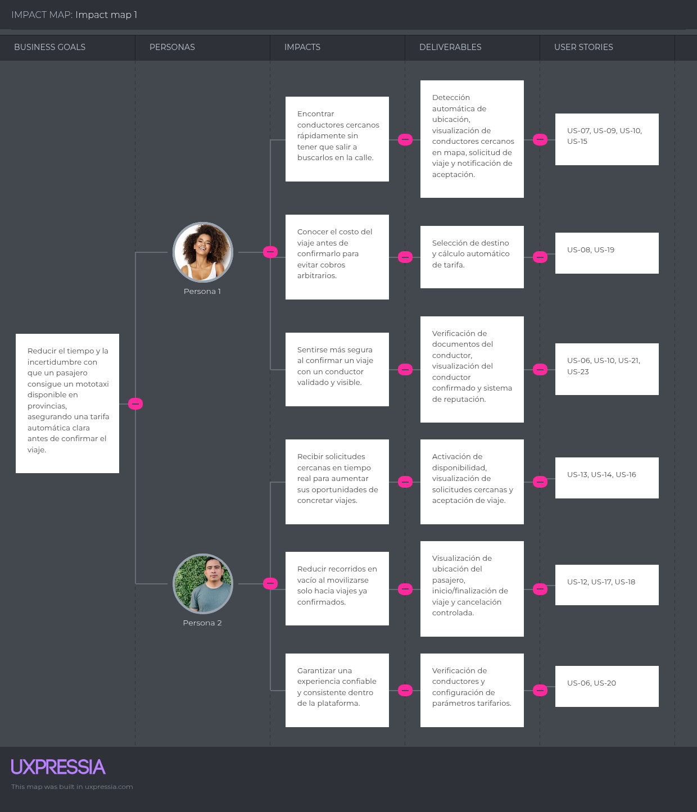

## 3.3 Product Backlog

| # Orden | User Story Id   | Título                                                    | Descripción                                                                                                                                               | Story Points (1 / 2 / 3 / 5 / 8) |
| ------- | --------------- | --------------------------------------------------------- | --------------------------------------------------------------------------------------------------------------------------------------------------------- | -------------------------------- |
| 1       | US-31           | Sección Hero con CTA diferenciado                         | Como visitante, deseo ver una sección principal con dos CTA diferenciados, para identificar rápidamente si la plataforma es para pasajeros o conductores. | 3                                |
| 2       | US-32           | Sección ¿Cómo funciona?                                   | Como visitante, deseo entender el flujo del servicio en pasos simples, para evaluar si ChapaTuRuta se adapta a mis necesidades antes de registrarme.      | 2                                |
| 3       | US-33           | Sección de beneficios por segmento                        | Como visitante, deseo ver los beneficios específicos para mi perfil, para entender el valor diferencial de la plataforma antes de registrarme.            | 2                                |
| 4       | US-34           | Sección de tarifas                                        | Como visitante, deseo conocer cómo se calculan las tarifas con ejemplos, para evaluar si el precio se ajusta a mi presupuesto.                            | 2                                |
| 5       | US-36           | Sección About the Product                                 | Como visitante, deseo ver un video publicitario del producto, para entender visualmente cómo funciona antes de registrarme.                               | 2                                |
| 6       | US-37           | Sección About the Team                                    | Como visitante, deseo conocer al equipo detrás del producto, para generar confianza en la marca antes de registrarme.                                     | 2                                |
| 7       | US-35           | Sección de testimonios                                    | Como visitante, deseo leer testimonios de usuarios activos, para evaluar la reputación del servicio antes de registrarme.                                 | 2                                |
| 8       | US-38           | Sección CTA final                                         | Como visitante, deseo un llamado a la acción final diferenciado, para registrarme según mi perfil sin volver al inicio.                                   | 2                                |
| 9       | US-01           | Registro de pasajero                                      | Como visitante, deseo registrarme como pasajero con correo y contraseña, para poder solicitar viajes en la plataforma.                                    | 3                                |
| 10      | US-02           | Registro de conductor                                     | Como visitante, deseo registrarme como conductor con mis documentos, para ofrecer mis servicios en la plataforma.                                         | 3                                |
| 11      | US-03           | Inicio de sesión                                          | Como usuario registrado, deseo iniciar sesión con correo y contraseña, para acceder a mi cuenta según mi rol.                                             | 2                                |
| 12      | US-05           | Cierre de sesión                                          | Como usuario, deseo cerrar sesión, para proteger el acceso a mi cuenta en dispositivos compartidos.                                                       | 1                                |
| 13      | US-04           | Gestión de perfil                                         | Como usuario, deseo visualizar y editar mi perfil, para mantener mis datos actualizados en la plataforma.                                                 | 3                                |
| 14      | US-07           | Detección automática de ubicación del pasajero            | Como pasajero, deseo que el sistema detecte mi ubicación al ingresar, para solicitar un viaje sin ingresarla manualmente.                                 | 3                                |
| 15      | US-08           | Selección de destino en el mapa                           | Como pasajero, deseo seleccionar mi destino en el mapa, para que el sistema calcule la ruta y el precio estimado.                                         | 3                                |
| 16      | US-19           | Cálculo de tarifa por distancia                           | Como pasajero, deseo ver el precio estimado calculado por distancia, para conocer el costo antes de confirmar el viaje.                                   | 3                                |
| 17      | US-09           | Visualización de conductores cercanos en el mapa          | Como pasajero, deseo ver los conductores disponibles cerca de mí en el mapa, para identificar opciones de transporte.                                     | 3                                |
| 18      | US-15           | Solicitud de viaje por parte del pasajero                 | Como pasajero, deseo confirmar mi solicitud tras revisar origen, destino y precio, para que los conductores cercanos puedan atenderla.                    | 5                                |
| 19      | US-13           | Activar y desactivar disponibilidad del conductor         | Como conductor, deseo activar o desactivar mi disponibilidad, para recibir o dejar de recibir solicitudes.                                                | 3                                |
| 20      | US-14           | Visualización de solicitudes de viaje disponibles         | Como conductor, deseo ver en tiempo real las solicitudes cercanas, para decidir cuál aceptar.                                                             | 3                                |
| 21      | US-16           | Aceptación de solicitud de viaje por el conductor         | Como conductor, deseo aceptar una solicitud, para confirmar al pasajero que me dirijo al punto de recojo.                                                 | 3                                |
| 22      | US-10           | Notificación en tiempo real de aceptación de viaje        | Como pasajero, deseo recibir una notificación cuando un conductor acepte mi solicitud, para saber que el viaje fue confirmado.                            | 2                                |
| 23      | US-11           | Notificación en tiempo real de rechazo de solicitud       | Como pasajero, deseo ser notificado si mi solicitud es rechazada, para tomar acciones alternativas.                                                       | 2                                |
| 24      | US-12           | Visualización de ubicación del pasajero para el conductor | Como conductor, deseo ver la ubicación del pasajero en el mapa, para dirigirme correctamente al punto de recojo.                                          | 3                                |
| 25      | US-17           | Inicio y finalización del viaje                           | Como conductor, deseo marcar el inicio y el fin del viaje, para que el sistema registre el estado y procese la comisión.                                  | 3                                |
| 26      | US-18           | Cancelación de viaje                                      | Como pasajero o conductor, deseo cancelar un viaje antes de que inicie, para liberar la solicitud en el sistema.                                          | 3                                |
| 27      | US-21           | Calificación post-viaje al conductor                      | Como pasajero, deseo calificar al conductor al finalizar el viaje, para contribuir a su reputación.                                                       | 2                                |
| 28      | US-22           | Calificación post-viaje al pasajero                       | Como conductor, deseo calificar al pasajero al terminar el viaje, para reportar comportamientos que afecten el servicio.                                  | 2                                |
| 29      | US-23           | Visualización del puntaje de reputación                   | Como usuario, deseo ver mi puntaje de reputación en mi perfil, para conocer cómo me perciben otros usuarios.                                              | 2                                |
| 30      | US-28           | Visualización del saldo del wallet                        | Como conductor, deseo ver mi saldo del wallet en todo momento, para saber cuánto tengo disponible antes de activarme.                                     | 2                                |
| 31      | US-27           | Recarga del wallet mediante Stripe                        | Como conductor, deseo recargar mi wallet con Stripe, para mantener saldo disponible y seguir operando.                                                    | 5                                |
| 32      | US-29           | Descuento automático de comisión por viaje                | Como plataforma, necesitamos descontar el 5% del wallet al finalizar cada viaje, para monetizar el servicio automáticamente.                              | 3                                |
| 33      | US-30           | Historial de transacciones del wallet                     | Como conductor, deseo revisar el historial de recargas y descuentos, para tener trazabilidad de mis movimientos.                                          | 3                                |
| 34      | US-24           | Historial de viajes del pasajero                          | Como pasajero, deseo consultar el historial de mis viajes, para revisar mis desplazamientos anteriores y sus costos.                                      | 2                                |
| 35      | US-25           | Historial de viajes del conductor                         | Como conductor, deseo consultar el historial de mis carreras, para revisar mis ganancias y comisiones descontadas.                                        | 2                                |
| 36      | US-06           | Verificación de documentos del conductor                  | Como administrador, deseo aprobar o rechazar los documentos de los conductores, para garantizar que solo operen conductores formales.                     | 3                                |
| 37      | US-20           | Configuración de tarifas por el administrador             | Como administrador, deseo configurar tarifa base, precio por km y precio mínimo, para que el sistema calcule el costo de cada carrera.                    | 3                                |
| 38      | US-26           | Panel de administración de conductores                    | Como administrador, deseo gestionar a los conductores registrados, para habilitar, deshabilitar o revisar su información.                                 | 3                                |
| 39      | TS-AUTH-001     | Register Passenger                                        | Como desarrollador, quiero implementar el endpoint de registro de pasajero, para permitir la creación de cuentas de pasajero.                             | 2                                |
| 40      | TS-AUTH-002     | Register Driver                                           | Como desarrollador, quiero implementar el endpoint de registro de conductor con documentos, para permitir su incorporación sujeta a verificación.         | 3                                |
| 41      | TS-AUTH-003     | Login                                                     | Como desarrollador, quiero implementar el endpoint de autenticación con JWT, para permitir el inicio de sesión de usuarios registrados.                   | 3                                |
| 42      | TS-AUTH-004     | Token Validation Filter                                   | Como desarrollador, quiero implementar un filtro de validación de JWT, para proteger los endpoints privados del backend.                                  | 3                                |
| 43      | TS-AUTH-005     | Role-Based Access Control                                 | Como desarrollador, quiero implementar control de acceso por roles, para restringir endpoints según el perfil del usuario.                                | 3                                |
| 44      | TS-USER-001     | Get & Update Profile                                      | Como desarrollador, quiero implementar los endpoints de perfil de usuario, para permitir la visualización y actualización de datos.                       | 2                                |
| 45      | TS-USER-002     | Verify Driver Documents                                   | Como desarrollador, quiero implementar los endpoints de aprobación y rechazo de conductores, para que el admin habilite solo conductores formales.        | 2                                |
| 46      | TS-USER-003     | Manage Drivers (Admin)                                    | Como desarrollador, quiero implementar los endpoints de gestión de conductores, para habilitar, deshabilitar o consultar conductores.                     | 3                                |
| 47      | TS-TRIP-001     | Calculate Fare                                            | Como desarrollador, quiero implementar el endpoint de cálculo de tarifa con Haversine, para estimar el precio según distancia.                            | 3                                |
| 48      | TS-TRIP-002     | Request Trip                                              | Como desarrollador, quiero implementar el endpoint de solicitud de viaje, para registrar nuevas solicitudes del pasajero.                                 | 3                                |
| 49      | TS-TRIP-003     | Accept & Reject Trip                                      | Como desarrollador, quiero implementar los endpoints de aceptación y rechazo, para que el conductor confirme o descarte solicitudes.                      | 3                                |
| 50      | TS-TRIP-004     | Start & Complete Trip                                     | Como desarrollador, quiero implementar los endpoints de inicio y finalización de viaje, para registrar los cambios de estado.                             | 3                                |
| 51      | TS-TRIP-005     | Cancel Trip                                               | Como desarrollador, quiero implementar el endpoint de cancelación, para permitir que pasajero o conductor cancelen antes del inicio.                      | 2                                |
| 52      | TS-TRIP-006     | Trip History                                              | Como desarrollador, quiero implementar los endpoints de historial de viajes, para que pasajeros y conductores consulten viajes pasados.                   | 2                                |
| 53      | TS-GEO-001      | Driver Availability Toggle                                | Como desarrollador, quiero implementar el endpoint de activación/desactivación de disponibilidad, para reflejar el estado del conductor.                  | 2                                |
| 54      | TS-GEO-002      | Update Driver Location                                    | Como desarrollador, quiero implementar el endpoint de actualización de ubicación del conductor, para mantener su posición actualizada.                    | 2                                |
| 55      | TS-GEO-003      | Get Nearby Drivers                                        | Como desarrollador, quiero implementar el endpoint de búsqueda de conductores cercanos, para que el pasajero visualice opciones disponibles.              | 3                                |
| 56      | TS-REALTIME-001 | Ably Token Request                                        | Como desarrollador, quiero implementar el endpoint de generación de tokens Ably, para conexión segura a canales de tiempo real.                           | 3                                |
| 57      | TS-REALTIME-002 | Publish Trip Events                                       | Como desarrollador, quiero implementar la publicación de eventos de viaje a Ably, para notificar en tiempo real a pasajeros y conductores.                | 3                                |
| 58      | TS-RATING-001   | Submit Rating                                             | Como desarrollador, quiero implementar el endpoint de envío de calificaciones, para que pasajeros y conductores se califiquen mutuamente.                 | 2                                |
| 59      | TS-RATING-002   | Get User Reputation                                       | Como desarrollador, quiero implementar el endpoint de consulta de reputación, para exponer el puntaje promedio del usuario.                               | 2                                |
| 60      | TS-FARE-001     | Configure Fare Parameters                                 | Como desarrollador, quiero implementar los endpoints de configuración de tarifas, para que el administrador defina los parámetros de precio.              | 2                                |
| 61      | TS-WALLET-001   | Get Wallet Balance                                        | Como desarrollador, quiero implementar el endpoint de consulta de saldo del wallet, para que el conductor visualice su saldo.                             | 2                                |
| 62      | TS-WALLET-002   | Create Stripe Checkout Session                            | Como desarrollador, quiero implementar el endpoint de creación de sesión Stripe, para que el conductor recargue su wallet.                                | 3                                |
| 63      | TS-WALLET-003   | Stripe Webhook Handler                                    | Como desarrollador, quiero implementar el webhook de confirmación Stripe, para acreditar el saldo tras un pago exitoso.                                   | 3                                |
| 64      | TS-WALLET-004   | Apply Commission on Trip Complete                         | Como desarrollador, quiero implementar el descuento atómico del 5% de comisión, para monetizar automáticamente al finalizar el viaje.                     | 3                                |
| 65      | TS-WALLET-005   | Wallet Transaction History                                | Como desarrollador, quiero implementar el endpoint de historial de transacciones del wallet, para trazabilidad de recargas y comisiones.                  | 2                                |
| 66      | TS-INFRA-001    | CORS Configuration                                        | Como desarrollador, quiero configurar CORS en Spring Boot, para permitir peticiones autorizadas desde el frontend Angular.                                | 1                                |
| 67      | TS-INFRA-002    | Global Exception Handler                                  | Como desarrollador, quiero implementar un manejador global de excepciones, para estandarizar las respuestas de error del backend.                         | 2                                |


---

## Capítulo IV: Product Design

### 4.1. Style Guidelines

En esta sección el equipo establece un repositorio central de decisiones
visuales y de comunicación, con el fin de mantener una presentación
consistente en todos los productos de _Chapa Tu Ruta_. Se incluyen
lineamientos generales de marca, tipografía, colores y espaciado, así
como los estándares visuales aplicados a la interfaz web.

#### 4.1.1. General Style Guidelines

En la siguiente sección detallaremos las diferentes decisiones de diseño
tomadas para establecer la identidad visual de _Chapa Tu Ruta_.

**Branding**

_Chapa Tu Ruta_ es una plataforma diseñada para conectar pasajeros con
conductores de mototaxi en zonas periféricas de Lima. El nombre de la aplicación apela directamente al lenguaje
coloquial limeño: "chapar" en el habla popular significa encontrar o tomar
algo en el momento preciso, lo que comunica inmediatez y familiaridad con
el usuario objetivo. La segunda parte, "Tu Ruta", refuerza la propuesta de
valor: el servicio es personalizado, cercano y pensado para el trayecto
específico de cada persona.

El logotipo combina dos elementos visuales principales. El primero es un
pin de ubicación de color verde con una carretera interna, que representa
la geolocalización como función central de la aplicación. El segundo es
una mototaxi estilizada en amarillo y azul que hace referencia directa al
vehículo característico del servicio. Debajo de ambos elementos aparece el
nombre "ChapaTuRuta" en tipografía sans-serif, donde la palabra "Tu"
resalta en amarillo para generar énfasis en la personalización del servicio.
El conjunto transmite dinamismo, proximidad y funcionalidad.


**Typography**

La tipografía elegida para _Chapa Tu Ruta_ es **Poppins**, disponible a
través de Google Fonts, en sus variantes Bold, SemiBold y Regular.

Esta tipografía fue seleccionada por su alta legibilidad en pantallas de
distintos tamaños, especialmente en condiciones de uso móvil como la luz
solar directa o el movimiento. Sus formas geométricas y sus terminaciones
redondeadas le otorgan un carácter moderno y accesible, coherente con el
perfil del usuario objetivo.

La variante Bold se utiliza en los títulos de pantalla y en el logotipo,
para atraer la atención del usuario en los puntos de mayor jerarquía
visual. La variante SemiBold se aplica en subtítulos, encabezados de
sección y etiquetas de acción, generando contraste con el cuerpo de texto
sin resultar agresiva. La variante Regular se reserva para párrafos,
descripciones y texto de apoyo.

El tamaño de las fuentes varía según el nivel jerárquico del contenido.
Para títulos principales se utilizan tamaños mayores con el fin de captar
la atención del usuario desde el primer vistazo. Para subtítulos se emplean
tamaños intermedios que permiten distinguir las secciones sin interrumpir
la lectura. Para el cuerpo de texto se elige un tamaño que equilibre
comodidad visual y densidad de información, considerando que la mayoría
de usuarios accederán desde dispositivos móviles de gama media.

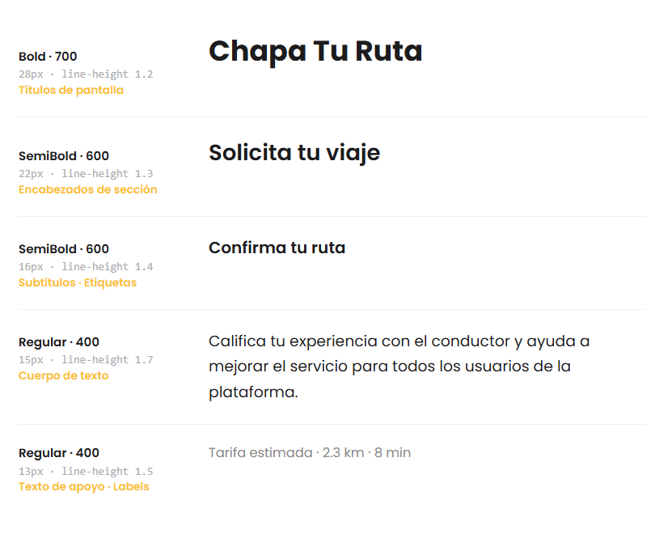

**Colors**

La paleta de colores de _Chapa Tu Ruta_ está compuesta por cuatro colores
principales extraídos directamente de la identidad visual del logotipo,
complementados por colores de apoyo para los estados del sistema.

El color primario es el amarillo mototaxi (`#F9C12E`), presente en el
techo de la mototaxi y en el texto destacado del logotipo. Este color
comunica energía, visibilidad y optimismo, y se utiliza en los llamados
a la acción principales de la interfaz. El azul ruta (`#2B7CC1`), tomado
de la carrocería de la mototaxi, representa confianza, tecnología y
movimiento, y se aplica en estados activos, secciones informativas y
elementos secundarios. El verde pin (`#3DAA4E`), proveniente del ícono
de ubicación del logotipo, está asociado a la geolocalización, la
disponibilidad y la confirmación de acciones positivas. El azul marino
(`#1A2A4A`), que corresponde a la estructura del vehículo y el
parabrisas, actúa como color de fondo profundo y neutro, utilizado en
la barra de navegación, el footer y los fondos de secciones oscuras.

Para textos sobre fondos claros se utiliza el gris carbón (`#1C1C1E`),
garantizando legibilidad sin el contraste agresivo del negro puro. Los
fondos generales de pantalla emplean el blanco suave (`#F5F5F5`) para
reducir la fatiga visual en sesiones prolongadas.

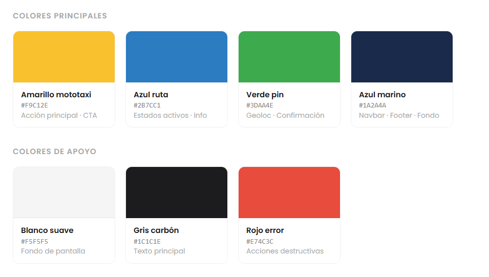

**Spacing**

El espaciado utilizado en los productos de _Chapa Tu Ruta_ sigue una
escala basada en múltiplos de 8 puntos. Este sistema permite mantener
proporciones consistentes entre componentes y facilita la implementación
tanto en interfaces móviles como web.

En general, es fundamental que el espaciado permita al usuario distinguir
con claridad los bloques de contenido sin generar una sensación de
saturación. Los márgenes laterales de pantalla, la separación entre
tarjetas y la distancia entre etiquetas e inputs respetan esta escala
para lograr una composición ordenada y legible.

**Tono de comunicación y lenguaje**

El tono de comunicación de _Chapa Tu Ruta_ ha sido definido considerando
el perfil del usuario objetivo: personas jóvenes y adultas de zonas
periféricas de Lima, familiarizadas con el uso de aplicaciones móviles
pero con distintos niveles de experiencia digital.

En cuanto a las dimensiones del tono, la plataforma adopta un lenguaje
más cercano que formal, evitando tecnicismos innecesarios y privilegiando
frases cortas y directas que no requieran interpretación. Es más casual
que serio, sin perder la claridad y la confiabilidad que el servicio de
transporte exige. Se mantiene respetuoso en todo momento, sin caer en un
registro corporativo distante que pueda generar frialdad con el usuario.
Finalmente, adopta un tono entusiasta pero sereno, que transmita seguridad
en cada interacción sin generar ansiedad.

Los mensajes de la interfaz privilegian verbos de acción en imperativo
amigable como "Solicita tu viaje", "Confirma tu ruta" o "Califica tu
experiencia", y evitan frases técnicas o en tercera persona que distancien
al usuario de la aplicación.

---

#### 4.1.2. Web Style Guidelines

En esta sección se explican e ilustran las decisiones sobre los estándares
visuales y de interacción para las interfaces web responsivas de
_Chapa Tu Ruta_. La versión web está orientada principalmente al panel
de administración del sistema y a la landing page informativa de la
plataforma. Como referencia base se adopta el sistema de diseño
**Material Design 3** de Google, sobre el cual se realizan adaptaciones
para alinearlo con la identidad visual propia de la marca.

**Paleta de colores**

La paleta de colores web replica los colores definidos en el General Style
Guidelines, organizados según su rol funcional dentro de la interfaz. El
amarillo `#F9C12E` se reserva para botones primarios y destacados de
conversión. El azul marino `#1A2A4A` se utiliza en la barra de navegación
superior, el sidebar del panel de administración y el footer. El azul ruta
`#2B7CC1` aparece en elementos informativos, estados activos y secciones
de datos. El verde pin `#3DAA4E` señaliza confirmaciones, disponibilidad
y acciones exitosas. Los fondos generales utilizan `#F5F5F5` para las
páginas y `#FFFFFF` para las tarjetas y modales.

**Tipografía web**

La tipografía web mantiene el uso de Poppins en sus tres variantes. Para
títulos de página se utiliza la variante Bold en tamaño 28px, para
encabezados de sección SemiBold en 22px, y para el cuerpo de texto
Regular en 14 a 16px. Esta escala garantiza la jerarquía visual necesaria
para guiar al usuario a través de las distintas secciones sin necesidad
de elementos decorativos adicionales.

**Botones**

Dependiendo del contexto se utilizan distintos tipos de botones. Para las
acciones principales de conversión como "Registrarse", "Solicitar viaje"
o "Confirmar", se utiliza el botón primario con fondo amarillo `#F9C12E`,
texto en azul marino `#1A2A4A` y bordes redondeados de 8px. Este botón
es el de mayor jerarquía visual en la pantalla y no debe compartir
protagonismo con otros elementos del mismo peso.

Para acciones secundarias como "Cancelar" o "Volver", se utiliza un botón
con borde en el color primario y fondo transparente, que comunica una
opción disponible sin competir visualmente con la acción principal. Para
acciones destructivas como "Eliminar cuenta" o "Bloquear conductor", se
utiliza el botón de peligro con fondo rojo `#E74C3C` y texto blanco,
reservado exclusivamente para operaciones irreversibles en el panel de
administración.

**Formularios**

Los campos de texto utilizan un borde de 1px en gris claro en su estado
neutro, que cambia al azul ruta `#2B7CC1` al recibir el foco, indicando
al usuario que el campo está activo. En caso de error de validación, el
borde cambia a rojo `#E74C3C` y se muestra un mensaje descriptivo debajo
del campo afectado. Todos los campos incluyen una etiqueta visible por
encima del input, evitando depender del placeholder como único indicador
del contenido esperado.

**Navegación y diseño responsivo**

La interfaz web adopta un enfoque mobile-first, escalando hacia
resoluciones mayores mediante una grilla de 12 columnas con ancho máximo
de contenido de 1200px centrado horizontalmente. En el panel de
administración, la navegación utiliza un sidebar fijo en pantallas de
escritorio que colapsa a un menú tipo drawer en tablets y dispositivos
móviles. La barra superior muestra el logo reducido, el nombre del usuario
autenticado y la opción de cierre de sesión.

**Accesibilidad**

Todos los elementos interactivos de la interfaz web cumplen con un
contraste mínimo de 4.5:1 entre texto y fondo, de acuerdo con el estándar
WCAG AA. Los componentes son navegables por teclado y los formularios
incluyen atributos ARIA para garantizar compatibilidad con lectores de
pantalla. El tamaño mínimo de fuente en web es de 14px para asegurar la
legibilidad en distintas condiciones de uso.

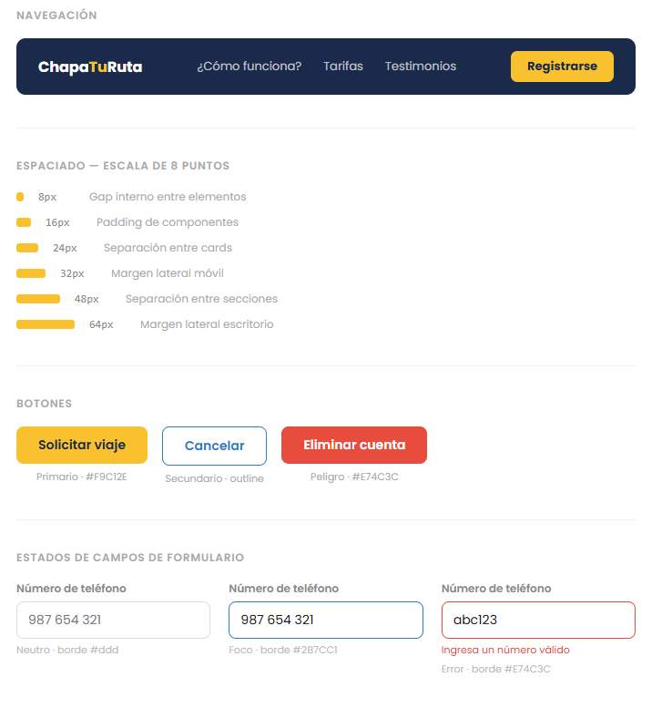

## 4.2 Information Architecture

### 4.2.1 Organization Systems

  <p align="justify">
    La arquitectura de información de ChapaTuRuta utiliza tres tipos de organización según el contexto de cada pantalla y flujo.<br><br>
    La organización jerárquica se aplica en las pantallas principales de ambos perfiles. Para el pasajero, el mapa con conductores disponibles ocupa el mayor peso visual, seguido del campo de destino y el botón de solicitud; el historial, el perfil y las calificaciones quedan en un nivel inferior porque no forman parte del flujo urgente. Para el conductor, la jerarquía coloca en primer plano su estado de disponibilidad y las solicitudes entrantes, relegando los ingresos del día y la gestión de documentos a secciones de consulta secundaria.<br><br>
    La organización secuencial rige todos los procesos que deben completarse sin omisiones. La solicitud de viaje avanza en el orden destino->tarifa estimada->confirmación, lo cual impide que el pasajero confirme sin conocer el costo. El registro del conductor sigue la secuencia datos personales->información del vehículo->carga de documentos (brevete y SOAT)->verificación. En ambos casos el usuario ve en todo momento en qué paso se encuentra y cuántos le restan.<br><br>
    La organización matricial se aplica en la pantalla de historial de viajes, donde el usuario puede cruzar dos variables simultáneamente: período de tiempo (semana, mes) y tipo de registro (viajes realizados, cancelados). Esto permite que tanto el pasajeros como conductores analicen su actividad desde más de una dimensión sin necesidad de navegar entre vistas separadas.<br><br>
    En cuanto a los esquemas de categorización, el historial se ordena cronológicamente del viaje más reciente al más antiguo, lo cual responde al patrón de consulta más habitual. Las solicitudes entrantes para el conductor se categorizan por tópico, agrupando primero las activas, luego las pendientes de respuesta y finalmente las activas, luego las pendientes de respuesta y finalmente las expiradas. El contenido general de la plataforma se segmenta según audiencia, diferenciando en todo momento las funcionalidades del pasajero con el conductor, ya que ambos perfiles acceden a secciones distintas con lógicas de uso completamente diferentes.
  </p>

### 4.2.2 Labeling Systems

  <p align="justify">
    El sistema de etiquetado de ChapaTuRuta se fundamenta en el principio de mínima carga cognitiva: cada etiqueta debe comunicar con precisión qué encontrará el usuario al interactuar con ese elemento, al emplear el menor número de palabras posible y un vocubalario coherente con el contexto del transporte informal en ciudades intermedias del Perú. Se evita deliberadamente el uso de anglicismos, tecnicismos propios de plataformas urbanas o términos abstractos que puedan generar confusión en usuarios con baja experiencia digital.
    Las etiquetas cumplen además una función asociativa: orientan al usuario hacia dónde encontrará información relacionada sin necesidad de que todo el contenido esté concentrado en un mismo lugar. Por ejemplo, la etiqueta "Mis documentos" en el perfil del conductor no solo indice que allí se visualizan el brevete y el SOAT registrados, sino que también asocia en el usuario que en esa sección encontrará alertas de vencimiento y opciones de actualización, lo que consolida toda la gestión documental en un únicio punto de acceso.
    A continuación se detallan las etiquetas definidas para cada sección de la plataforma:<br>
  </p>
    <span style="font-weight: bold;">Landing Page</span>
    <table>
      <thead>
        <tr>
          <th>Etiqueta</td>
          <th>Contenido asociado</td>
        </tr>
      <thead>
      <tbody>
        <tr>
          <td>Inicio</td>
          <td>Presentación del servicio, propuesta de valor y acceso a la plataforma</td>
        </tr>
        <tr>
          <td>¿Cómo funciona?</td>
          <td>Proceso paso a paso para pasajeros y conductores, desde el registro hasta la finalización del viaje</td>
        </tr>
        <tr>
          <td>Seguridad</td>
          <td>Mecanismos de verificación de documentos del conductor y sistema de calificaciones mutuas</td>  
        </tr>
        <tr>
          <td>Soy conductor</td>
          <td>Beneficios para mototaxistas, requisitos de registro y llamado a la acción</td>  
        </tr>
        <tr>
          <td>Testimonios</td>
          <td>Comentarios reales de pasajeros y conductores sobre cómo la plataforma ha transformado su experiencia en el servicio de mototaxis</td>  
        </tr>
        <tr>
          <td>Contáctanos</td>
          <td>Formulario de contacto, canal de soporte y redes sociales de la plataforma</td>  
        </tr>
      </tbody>
    </table><br>
    <span style="font-weight: bold;">Aplicación Web - Perfil Pasajero</span>
        <table>
      <thead>
        <tr>
          <th>Etiqueta</td>
          <th>Contenido asociado</td>
        </tr>
      <thead>
      <tbody>
        <tr>
          <td>Pedir moto</td>
          <td>Mapa principal con conductores disponibles y flujo de solicitud de viaje</td>
        </tr>
        <tr>
          <td>Mis viajes</td>
          <td>Historial cronológico de trayectos con detalle de ruta, tarifa y calificación otorgada</td>
        </tr>
        <tr>
          <td>Calificaciones</td>
          <td>Valoraciones recibidas de conductores tras cada viaje completado</td>  
        </tr>
        <tr>
          <td>Mi Perfil</td>
          <td>Gestión de datos personales, foto y contraseña de acceso</td>  
        </tr>
      </tbody>
    </table><br>
    <span style="font-weight: bold;">Aplicación Web - Perfil Conductor</span>
        <table>
      <thead>
        <tr>
          <th>Etiqueta</td>
          <th>Contenido asociado</td>
        </tr>
      <thead>
      <tbody>
        <tr>
          <td>Solicitudes</td>
          <td>Carreras disponibles geolocalizadas cercanas en tiempo real</td>
        </tr>
        <tr>
          <td>Mis carreras</td>
          <td>Registro de viajes completados, cancelados e ingresos estimados por jornada</td>
        </tr>
        <tr>
          <td>Mis documentos</td>
          <td>Brevete y SOAT registrados con estado de vigencia y alertas de vencimiento próximo</td>  
        </tr>
        <tr>
          <td>Calificaciones</td>
          <td>Valoraciones reibidas de pasajeros y promedio acumulado visible en el perfil público</td>  
        </tr>
        <tr>
          <td>Mi perfil</td>
          <td>Datos personales, foto de perfil y vehículo registrado en la plataforma</td>  
        </tr>
      </tbody>
    </table>

### 4.2.3 SEO Tags and Meta Tags

La definición de SEO Tags y Meta Tags para ChapaTuRuta responde a dos objetivos simultáneos: mejorar el posicionamiento orgánico en motores de búsqueda para consultas relacionadas con el transporte en mototaxi en provincias del Perú, y garantizar que la información que se muestra al compartir los enlaces de la plataforma represente con precisión la propuesta de valor del servicio. A continuación se detallan las etiquetas definidad para el Landing Page y la Aplicación Web.

**1. Landing Page**

```HTML
<meta charset = "utf-8">
```

Define la codificación de caracteres como UTF-8, lo cual garantiza la correcta visualización de tildes, la letra ñ y caracteres especiales propios del español en cualquier navegador o dispositivo.

```HTML
<meta name="viewport" content="width=device-width, initial-scale=1">
```

Establece que la landing page debe adaptarse de forma responsiva al ancho del dispositivo desde el que se accede. Resulta especialmente relevante para ChapaTuRuta dado que la mayoría de sus usuarios accede desde smartphones de gama media con pantallas de tamaño variable.

```HTML
<title>ChapaTuRuta | Mototaxi Seguro y Verificado en provincias del Perú</title>
```

Define el título que aparece en la pestaña del navegador y en los resultados de búsqueda. Incorpora las palabras clave de mayor relevancia para el mercado objetivo:mototaci, seguro, verificado y provincias del Perú, orientando el posicionamiento hacia búsquedas locales.

```HTML
<meta name="description" content="ChapaTuRuta conecta con pasajeros con mototaxistas verificados en ciudades intermedias del Perú. Solicita tu viaje, conoce la tarifa antes de salir y viaja con seguridad desde cualquier dispositivo con internet.">
```

Proporciona el texto descriptivo que aparece como fragmento en los resultados de Google. Está redactado para comunicar los tres diferenciadores principales del servicio: verificación del conductor, tarifa previa y accesibilidad desde cualquier dispositivo.

```HTML
<meta name="keywords" content="mototaxi provincias Peru, transporte mototaxi ciudades intermedias, app mototaxi verificado, mototaxi Casma, mototaxi Huarmey, mototaxi Talara, transporte seguro provincias">
```

Especifíca las palabras clave asociadas al contenido de la página, que incluye nombres de ciudades objetivo para reforzar el posicionamiento de búsquedas geográficamente específicas.

```HTML
<meta name="author" content="CTR Technologies">
```

Identifica a CTR Technologies como la organización responsable del contenido de la plataforma.

```HTML
<meta name="language" content="es">
```

Declara el español como idioma principal del contenido, orientando correctamente a los motores de búsqueda sobre el público al que se dirige la plataforma.

```HTML
<meta name="copyright" content="CTR Technologies 2026">
```

Establece la titularidad de los derechos de autor del contenido publicado en la landing page.

<br>**2. Aplicación Web**

```HTML
<meta charset="utf-8">
```

Garantiza la correcta reprentación de caracteres especiales del espa{ol en toda la interfaz de la aplicación.

```HTML
<meta name="viewport" content="width=device-width, initial-scale=1">
```

Asegura que la interfaz de la aplicación web se adapte correctamente a dispositivos móviles, tabletas y computadoras de escritorio, lo cual mantiene la usabilidad en todos los tamaños de pantalla.

```HTML
<title>ChapaTuRuta | Solicita tu mototaxi en provincias</title>
```

Define el titulo de la aplicación web orientado a la acción principal que el usuario realiza dentro de la plataforma.

```HTML
<meta name="description" content="ChapaTuRuta conecta con pasajeros con mototaxistas verificados en ciudades intermedias del Perú. Solicita tu viaje, conoce la tarifa antes de salir y viaja con seguridad desde cualquier dispositivo con internet.">
```

Describe el contenido de la aplicación enfocándose en las funcionalidades principales disponibles para ambos perfiles de usuario, optimizado para aparecer cuando se comparte el enlace de la app

```HTML
<meta name="keywords" content="solicitar mototaxi app, historial viajes mototaxi, conductor mototaxi verificado, panel conductor, ChapaTuRuta aplicacion web">
```

Palabras clave orientadas a las funcionalidades específicas de la aplicación y al perfil de usuario que la utiliza activamente.

```HTML
<meta name="author" content="CTR Technologies">
<meta name="language" content="es">
<meta name="copyright" content="CTR Technologies 2026">
```

### 4.2.4 Searching Systems

**Perfil Pasajero**<br>

  <p align="justify">
    La búsqueda principal del pasajero ocurre sobre el mapa: escribe su destino en la barra superior y el sistema ofrece autocompletado con referencias locales reconocibles como mercados, colegios, parques y avenidas principales de la ciudad. Si no recuerda el nombre exacto, puede arrastrar el pin directamente sobre el mapa para indicar el punto. No se busca entre listas de conductores; el sistema localiza automáticamente los disponibles en el radio cercano al confirmar el destino.
    Los filtros disponibles para el pasajero son: distancia máxima al conductor y calificación mínima del conductor (por ejemplo, solo conductores con 4 estrellas o más).
    Tras la búsqueda, los resultados se muestran como íconos sobre el mapa indicando la posición de cada conductor disponible. Al seleccionar uno, aparece una tarjeta con foto, nombre, calificación promedio, tipo de vehículo y tarifa estimada para el trayecto indicado. Si no hay conductores disponibles, el sistema muestra un mensaje que indica la situación y sugiere reintentar en unos minutos o ampliar el radio de búsqueda.
  </p>

**Conductor**

  <p align="justify">
    El conductor no realiza búsquedas activas: las solicitudes llegan a él ordenadas por proximidad. Sin embargo, en su historial de carreras puede buscar registros específicos mediante los siguientes filtros: rango de fechas, estado del viaje (completado o cancelado) e ingresos por rango de monto.<br>
    Los resultados del historial se presentan como tarjetas individuales que muestran fecha, hora, punto de origen, destino, monto cobrado y calificación recibida del pasajero. Cuando la búsqueda no arroja resultados, el sistema indica que no existen registros para los filtros aplicados y ofrece la opción de limpiarlos con un solo toque.
  </p>

### 4.2.5 Navigation Systems

El diseño del sistema de navegación de ChapaTuRuta tiene como objetivo que tanto pasajeros como conductores puedan cumplir sus metas dentro de la plataforma de forma fluida, sin necesidad de explorar ni memorizar rutas de acceso. Las decisiones de navegación están condicionadas por el perfil del usuario objetivo: personas con experiencia digital limitada que necesitan encontrar lo que buscan de forma inmediata o ser guiadas paso a paso cuando el proceso lo requiere.<br><br>
**Landing Page**<br>
La navegación de la landing page está diseñada para construir confianza de manera progresiva antes de solicitar el registro. La barra de navegación superior permanece fija durante todo el desplazamiento vertical, ofreciendo acceso directo a las secciones principales en todo momento. Los elementos de esta barra siguen una lógica argumentativa deliberada: primero se presenta la solución ("¿Cómo funciona?"), luego los mecanismos que generan confianza ("Seguridad"), y finalmente el llamado a la acción diferenciado para cada perfil ("Soy conductor"). Esta secuencia responde al recorrido mental típico de un visitante escéptico que llega por primera vez a la plataforma.<br>
El desplazamiento vertical funciona como mecanismo narrativo principal: el contenido está estructurado para responder de forma anticipada las preguntas y objeciones más comunes antes de que el visitante las formule. Los botones de registro aparecen estratégicamente al final de cada sección relevante, de modo que el usuario pueda actuar en el momento en que la información lo convenció, sin necesidad de volver al inicio o buscar el formulario.<br><br>
**Aplicación Web**<br>
Dentro de la aplicación, la navegación principal se resuelve mediante una barra inferior persistente en dispositivos móviles, con acceso directo a las secciones clave del perfil correspondiente. La posición inferior responde a criterios ergonómicos: facilita el uso con una sola mano, patrón frecuente en usuarios que consultan la app mientras caminan o esperan en la calle.<br>
Los flujos de acción crítica, como solicitar un viaje o aceptar una carrera, son lineales e interrumpibles únicamente mediante una cancelación explícita. Durante estos flujos no se muestra la barra de navegación principal para evitar que el usuario abandone el proceso por un toque accidental. Cada etapa del flujo ocupa la pantalla completa con un mensaje de estado claro y un color distintivo por fase: búsqueda de conductor, conductor en camino, viaje en curso y viaje completado. Esta técnica elimina la ambigüedad sobre el estado del sistema en todo momento.<br>
Para usuarios que acceden desde computadora de escritorio, la navegación migra a una barra lateral izquierda con las mismas etiquetas y jerarquía que la versión móvil, que garantiza coherencia en la experiencia independientemente del dispositivo utilizado. Las transiciones entre secciones emplean animaciones de duración mínima para no penalizar el rendimiento en dispositivos de gama media, priorizando la velocidad de respuesta sobre los efectos visuales elaborados.

## 4.3 Landing Page UI Design

### 4.3.1 Landing Page Wireframe
**-Landing Page**
<br>
**1. Header / Navbar section**
<br>


**2. Hero + CTA section**
<br>

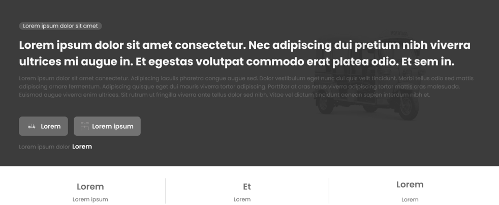

**3. How it works section**
<br>

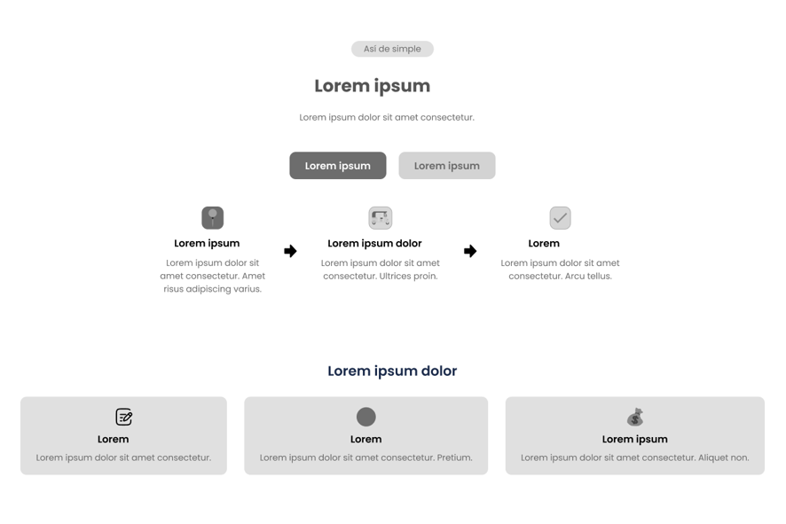

**4. Benefits section**
<br>

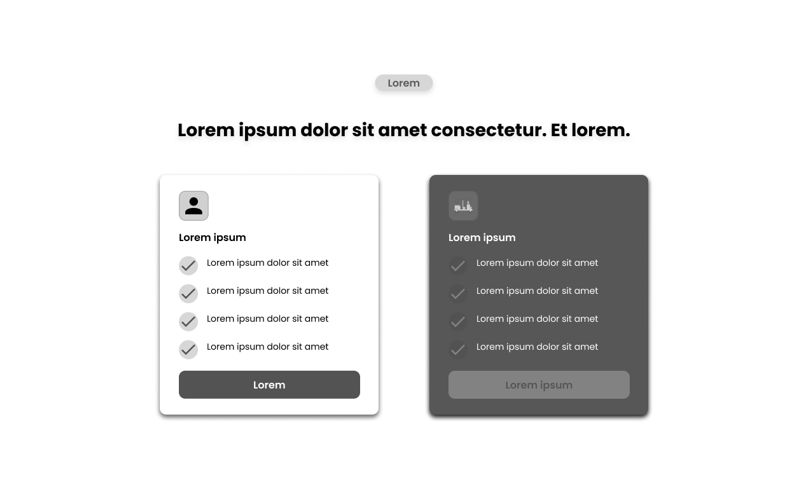

**5. Pricing section**
<br>

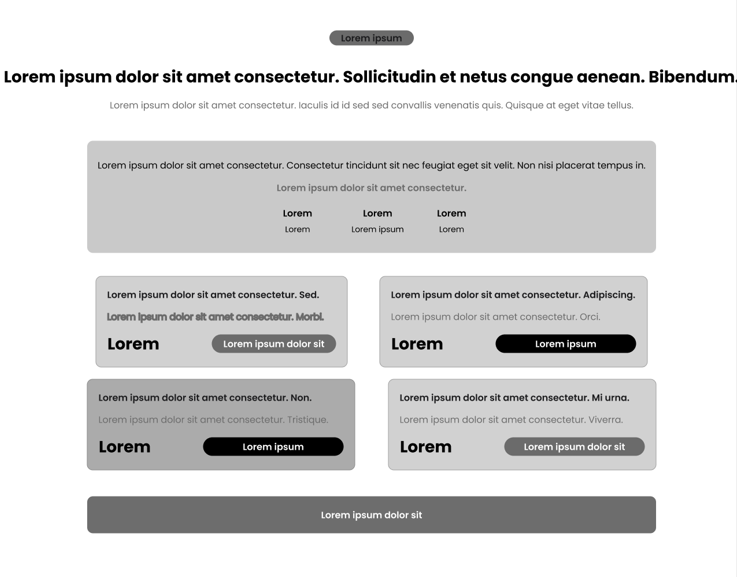

**6. Testimonials section**
<br>

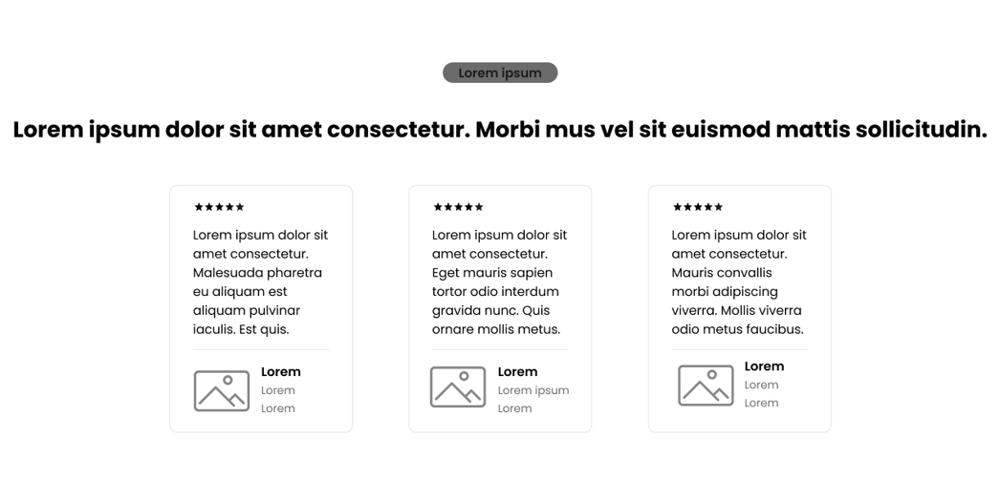

**7. About team section**
<br>

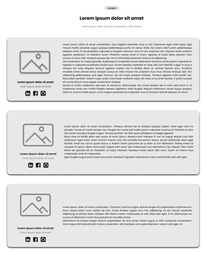

**8. About product section**
<br>


**9. CTA final section**
<br>


**10. Footer section**
<br>


**-Mobile Web Browser**
<br><br>
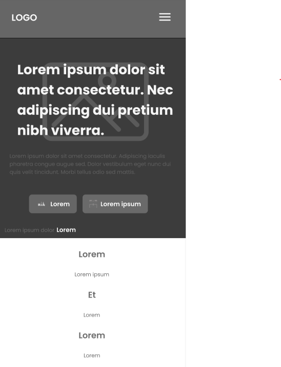
<br><br>
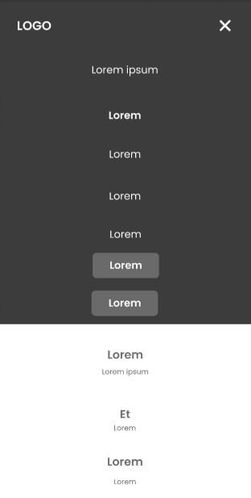
<br><br>
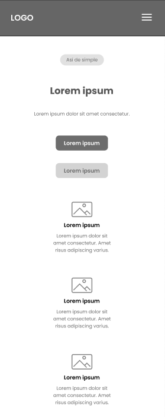
<br><br>
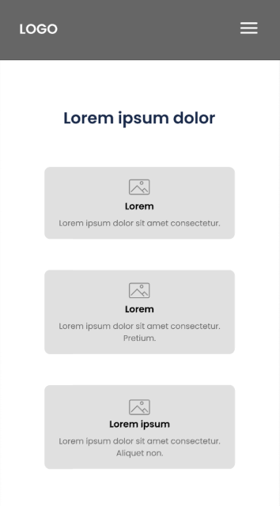
<br><br>
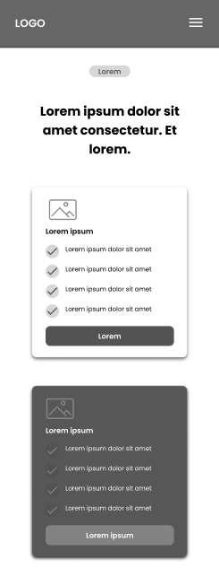
<br><br>
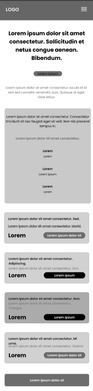
<br><br>
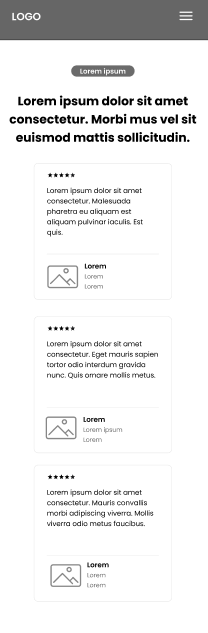
<br><br>
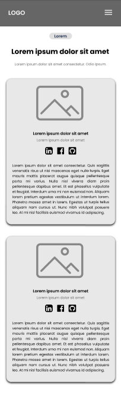
<br><br>

<br><br>

<br><br>
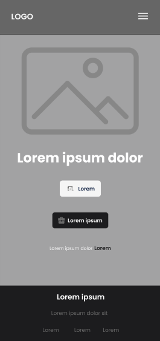

### 4.3.2 Landing Page Mock-up
**-Landing Page**
<br>
**1. Header / Navbar section**
<br>


**2. Hero + CTA section**
<br>


**3. How it works section**
<br>

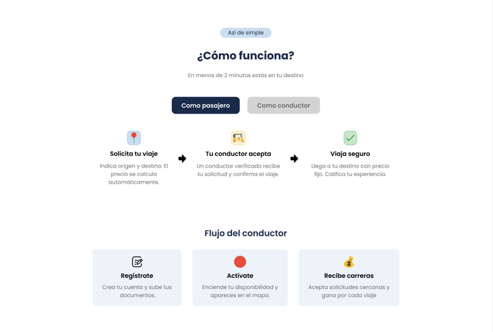

**4. Benefits section**
<br>

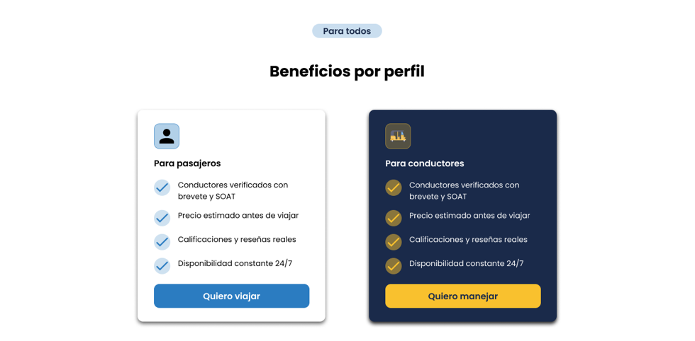

**5. Pricing section**
<br>

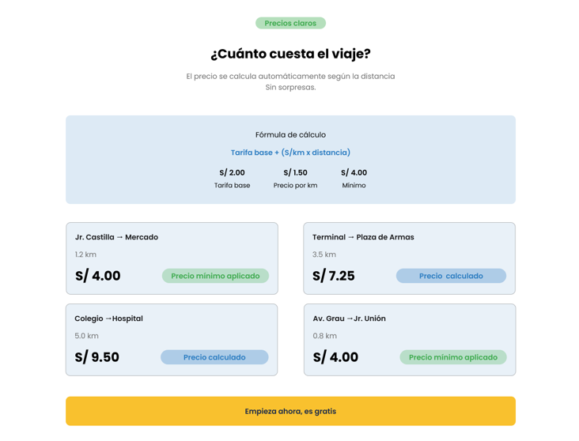

**6. Testimonials section**
<br>

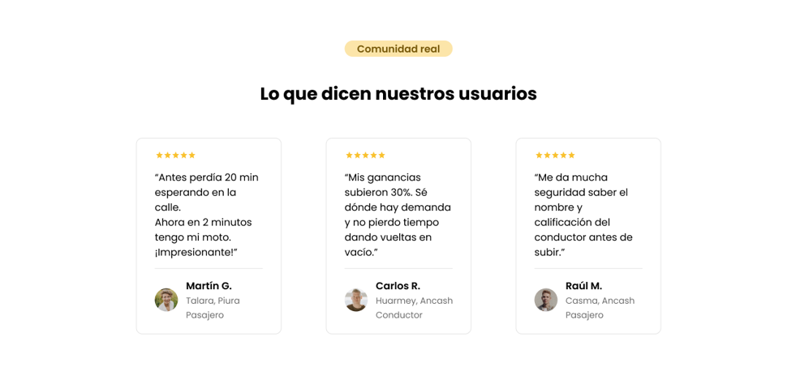

**7. About team section**
<br>


**8. About product section**
<br>


**9. CTA final section**
<br>


**10. Footer section**
<br>


**-Mobile Web Browser**

<br><br>

<br><br>
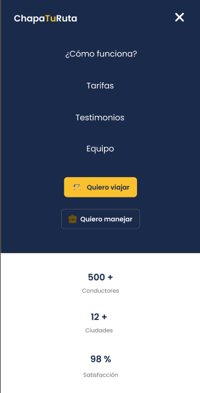
<br><br>
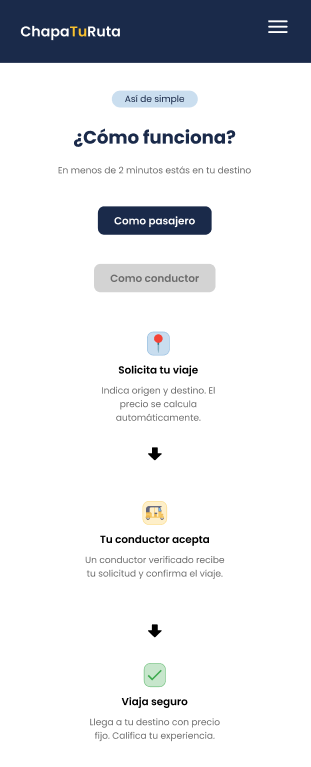
<br><br>
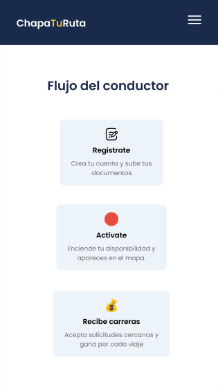
<br><br>
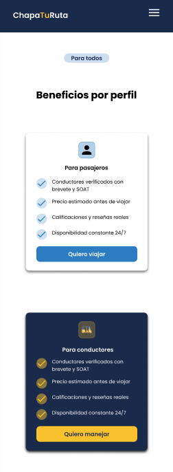
<br><br>
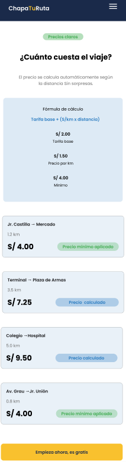
<br><br>

<br><br>
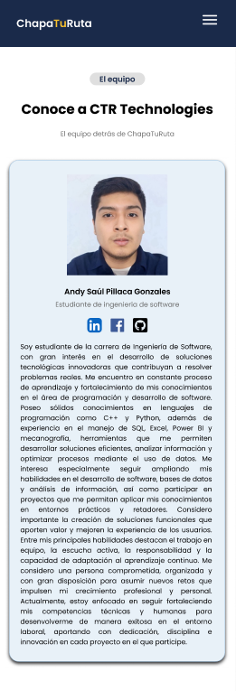
<br><br>
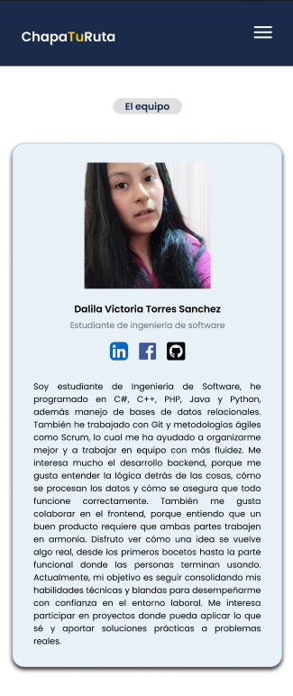
<br><br>
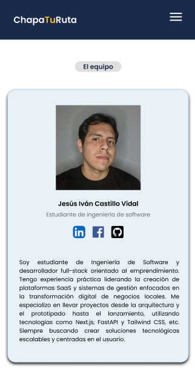
<br><br>

<br><br>
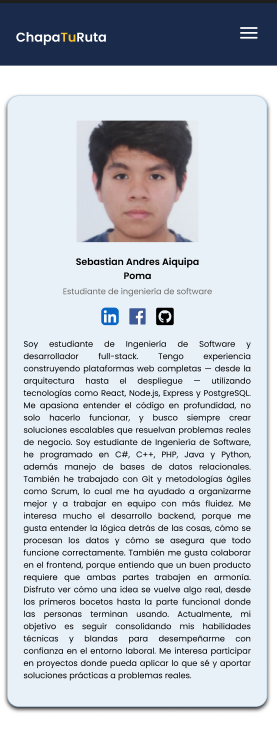
<br><br>

<br><br>


## 4.4 Web Applications UX/UI Design

### 4.4.1 Web Applications Wireframes

**Login usuario**

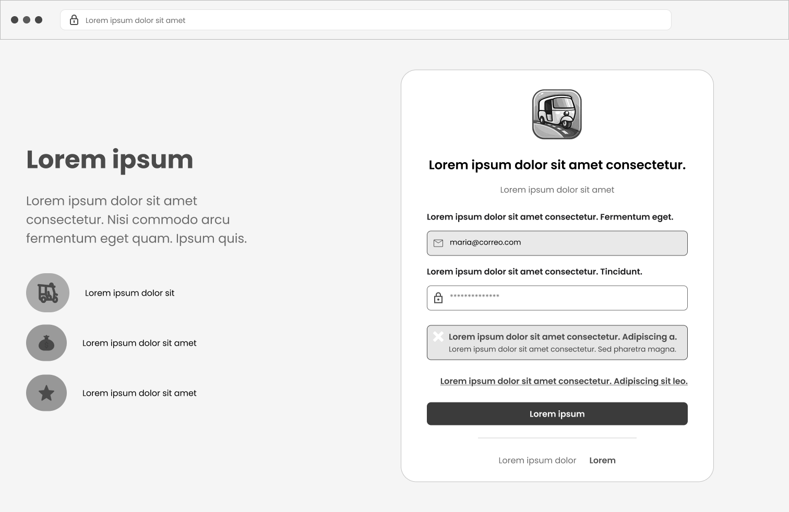

**Registro usuario**

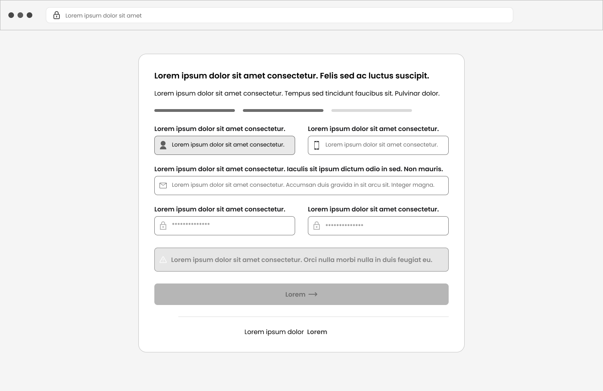

**Panel pasajero**


**Solicitud de viaje**


**Viaje de usuario**


**Clasificacion de usuario**


### 4.4.2 Web Applications Wireflow Diagrams
En esta sección se presenta la propuesta de Wireflows, elaborada a partir de los User Goals y los User Persona definidos para las aplicaciones incluidas en el alcance del proyecto ChapaTuRuta.

### Task Flow 1: Registro en la plataforma
**Objetivo del usuario:** Permite que un usuario nuevo se registre como pasajero o conductor para acceder a los servicios de la plataforma.<br><br>
**Pasos del Task Flow:**
1. Acceder a la pantalla de Login de la aplicación.
2. Seleccionar la opción de "Registrarse".
3. Elegir el tipo de cuenta: Psajero o conductor.
4. Completar el formulario de datos personales.
5. Para conductor: ingresar datos del vehículo y subir documentos requeridos.
6. Confirmar el registro y acceder al Home correspondiente.

#### User Goal 1: Como pasajero nuevo, quiero registrarme en la plataforma para poder solicitar viajes
**User Persona:** Pasajero<br>
El usuario accede al Login y selecciona "Registrarse". Elige el tipo "Pasajero", completa el formulario de datos personales y confirma. El sistema crea la cuenta y redirige al Home del pasajero.
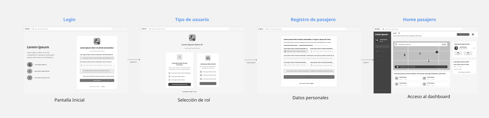

#### User Goal 2: Como conductor nuevo, quiero registrarme con mis datos personales y vehiculares para poder aceptar viajes
**User Persona:** Conductor<br>
El conductor selecciona "Registrarse" -> "Conductor". El proceso es multi-paso: datos personales, datos del vehículo, carga de documentos y confirmación de registro exitoso.
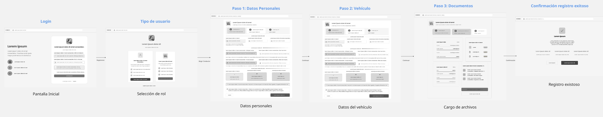

### Task Flow 2: Recuperación de acceso
**Objetivo del usuario:** Permitir al usuario recuperar el acceso a su cuenta cuando ha olvidado su contraseña.<br><br>
**Pasos del Task Flow:**
1. Acceder a la pantalla de Login.
2. Seleccionar la opción "¿Olvidaste tu contraseña?".
3. Ingresar el correo electrónico asociado a la cuenta.
4. Recibir el enlace de recuperación en el correo.
5. Completar el proceso de cambio de contraseña.
6. Volver al Login con el nuevo acceso.

#### User Goal 3: Como usuario registrado, quiero recuperar mi contraseña cuando la olvido para poder seguir accediendo a la plataforma
**User Persona:** Pasajero / Conductor<br>
El usuario en Login hace clic en "¿Olvidaste tu contraseña?". Ingresa su correo en la pantalla de Recuperar cuenta. El sistema envía las instrucciones. Al completar el proceso regresa al Login con acceso restaurado.
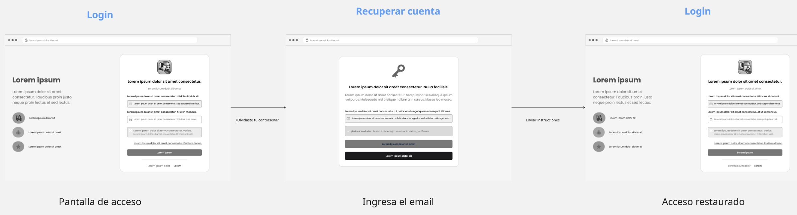

### Task Flow 3: Solicitar y gestionar un viaje
**Objetivo del usuario:** Permitir al pasajero solicitar un viaje, hacer seguimiento en tiempo real y calificarlo al finalizar.<br><br>
**Pasos del Task Flow:**
1. Acceder al Home del pasajero e ingresar el destino.
2. Confirmar la solicitud de viaje en el sistema.
3. Esperar la asignación de un conductor disponible (Viaje activo).
4. Monitorear el estado: conductor en camino -> viaje en curso.
5. Completar el viaje y ver el resumen (Finalizado).
6. Calificar al conductor con estrellas y comentarios.

#### User Goal 4: Como pasajero, quiero solicitar un viaje ingresando mi destino para que un conductor me recoja.
**User Persona:** Pasajero<br>
El pasajero desde su Home ingresa el destino y solicita el viaje. El sistema muestra el estado de Viaje Activo mientras busca conductor. Una vez asignado, el conductor aparece En Camino, luego En Curso hasta llegar al destino, mostrando finalmente la pantalla de Finalizado.
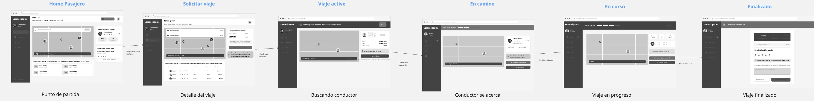

#### User Goal 5: Como pasajero, quiero ser notificado si mi solicitud es rechazada para poder intentarlo nuevamente.
**User Persona:** Pasajero<br>
El pasajero solicita el viaje y queda en espera en la pantalla de Viaje Activo. Si no hay conductores disponibles o la solicitud es rechazada, el sistema muestra Solicitud rechazada con el motivo. El pasajero puede volver al Home para intentarlo nuevamente.
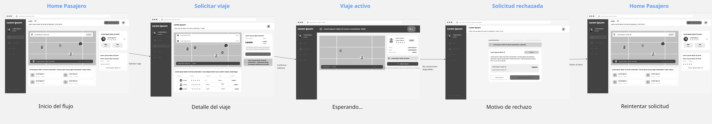

#### User Goal 6: Como pasajero, quiero calificar al conductor al finalizar el viaje para contribuir con la reputación del sistema.
**User Persona:** Pasajero<br>
Al completarse el viaje, la pantalla de Finalizado muestra el resumen del trayecto. Desde allí el pasajero accede a la pantalla de Calificación del viaje donde asigna estrellas y escribe un comentario. Al enviar la calificación regresa al Home del pasajero.
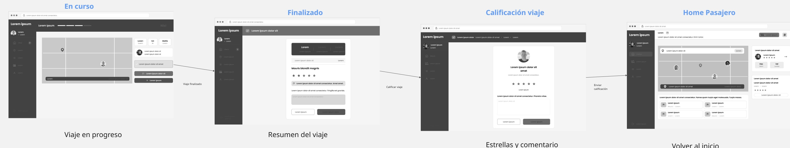

### Task Flow 4: Consultar historial y gestionar wallet 
**Objetivo del usuario:** Permitir al pasajero revisar sus viajes anteriores y gestionar su billetera virtual para recargar saldo.<br><br>
**Pasos del Task Flow:**
1. Acceder al Home del pasajero.
2. Navegar a la sección "Historial" para ver viajes pasados.
3. Revisar fecha, destino y costo de cada viaje.
4. Acceder a la sección "Wallet" para ver el saldo actual.
5. Seleccionar "Recargar" e ingresar el monto y método de pago.
6. Confirmar la recarga y verificar el nuevo saldo.

#### User Goal 7: Como pasajero, quiero consultar el historial de mis viajes anteriores para revisar mis gastos y trayectos.
**User Persona:** Pasajero<br>
El pasajero desde su Home navega a la sección Historial. La pantalla muestra todos los viajes realizados ordenados por fecha, con información de origen, destino, duración y costo de cada trayecto.
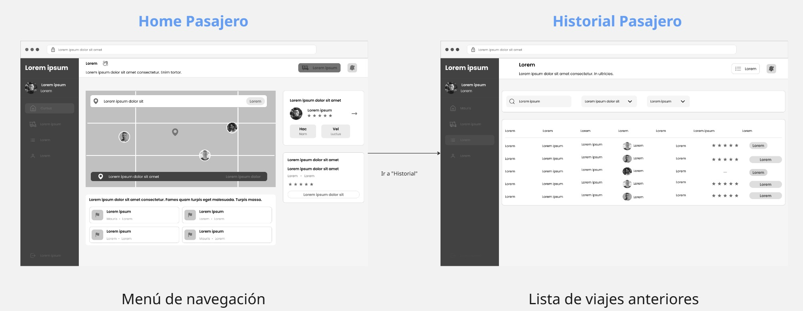

#### User Goal 8: Como pasajero, quiero consultar el historial de mis viajes anteriores para revisar mis gastos y trayectos.
**User Persona:** Pasajero<br>
Desde el Home el pasajero accede a su Wallet donde ve el saldo actual y el historial de movimientos. Al seleccionar "Recargar" elige el monto y método de pago. Tras confirmar el pago, el sistema muestra la confirmación de recarga exitosa con el nuevo saldo actualizado.
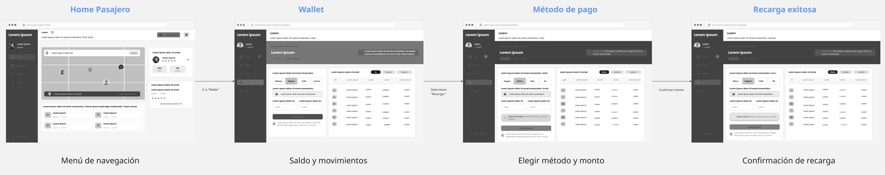

### Task Flow 5: Gestionar viajes como conductor 
**Objetivo del usuario:** Permitir al conductor recibir, aceptar y gestionar solicitudes de viaje para trasladar pasajeros y registrar sus carreras.<br><br>
**Pasos del Task Flow:**
1. Iniciar sesión y acceder al Home del conductor.
2. Activar la disponibilidad para recibir solicitudes.
3. Recibir una solicitud de viaje en la pantalla de Estado.
4. Revisar el detalle de la solicitud y aceptar el viaje.
5. Dirigirse al pasajero (En camino) y recogerlo.
6. Completar el viaje (En curso -> Finalizado) registrando la ganancia.

#### User Goal 9: Como conductor quiero recibir y aceptar solicitudes de viaje para trasladar pasajeros y generar ingresos.
**User Persona:** Conductor<br>
El conductor activa su disponibilidad desde el Home. Al recibir una solicitud, la pantalla de Estado muestra la alerta. El conductor revisa la Solicitud completa y decide aceptar. El sistema lo guía a través de En camino (dirigirse al pasajero), En curso (viaje en progreso) hasta Finalizado donde se registra la ganancia.
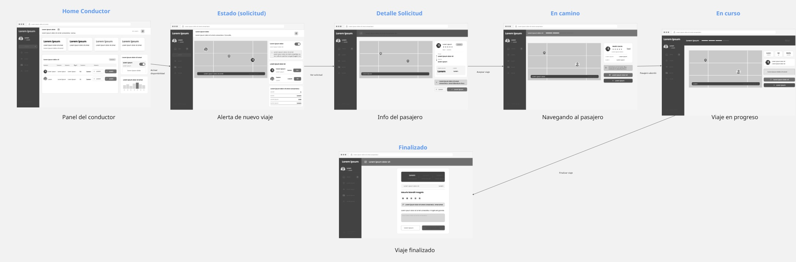

### Task Flow 6: Historial de carreras y perfil
**Objetivo del usuario:** Permitir al conductor consultar sus carreras realizadas, gestionar su perfil y cerrar sesión de forma segura.<br><br>
**Pasos del Task Flow:**
1. Acceder al Home del conductor.
2. Navegar a "Mis carreras" para ver el historial de viajes.
3. Revisar fecha, destino, duración y ganancia de cada carrera.
4. Acceder a "Mi Perfil" para ver y editar información personal.
5. Guardar cambios en el perfil o cerrar sesión.

#### User Goal 10: Como conductor, quiero consultar el historial de mis carreras realizadas para controlar mis ingresos y rendimiento
**User Persona:** Conductor<br>
Desde el Home del conductor, el usuario navega a "Mis Carreras". La pantalla presenta el listado completo de viajes realizados con fecha, trayecto, duración y ganancia por carrera, permitiendo llevar un control de su productividad y ganancias acumuladas.
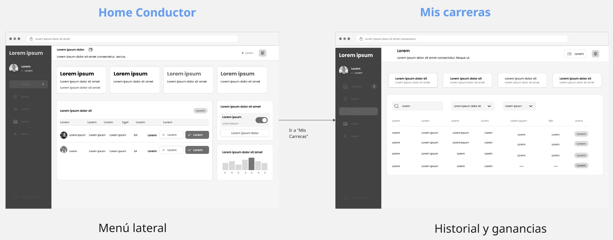

#### User Goal 11: Como usuario, quiero ver y editar mi perfil personal y cerrar sesión de forma segura
**User Persona:** Pasajero / Conductor<br>
Desde el Home, el usuario accede a Perfil o Mi Perfil. Puede ver y editar sus datos personales, foto y calificación. Desde esta misma puede iniciar el cierre de sesión, que solicita confirmación antes de redirigir al Login.
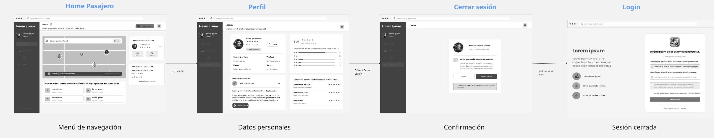

### 4.4.3 Web Applications Mock-ups

**Autenticación y Registro**<br><br>
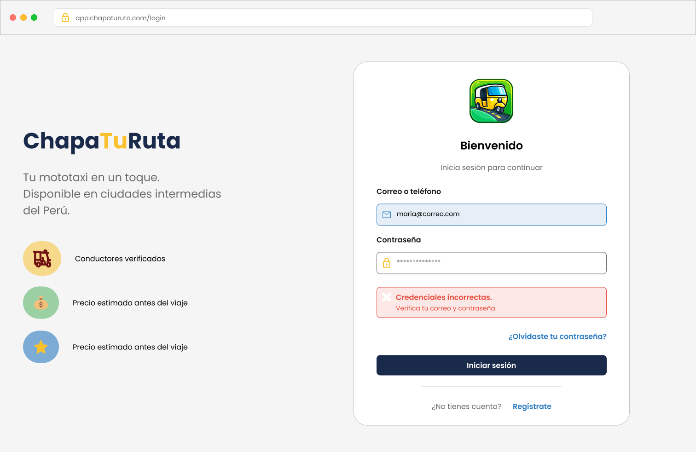
<br><br>
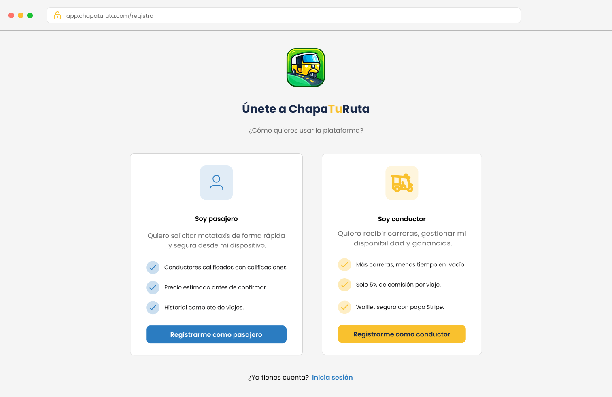
<br><br>

<br><br>

<br><br>

<br><br>

<br><br>

<br><br>

<br><br>


**Vistas Principales (Home)**<br><br>

<br><br>

<br><br>


**Flujo de Solicitud de Viaje**<br><br>

<br><br>
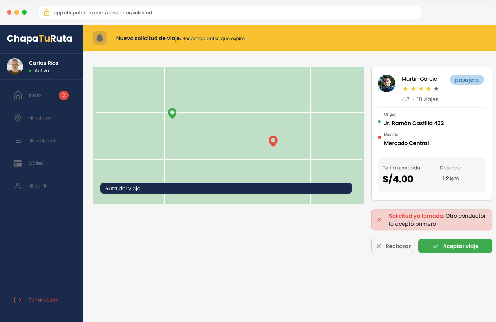
<br><br>

<br><br>
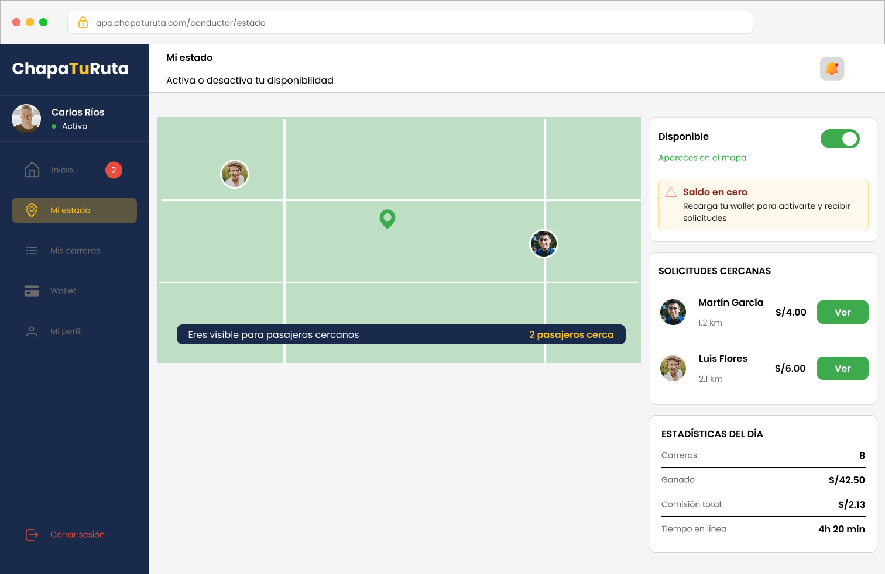
<br><br>


**Desarrollo del Viaje**<br><br>

<br><br>

<br><br>

<br><br>
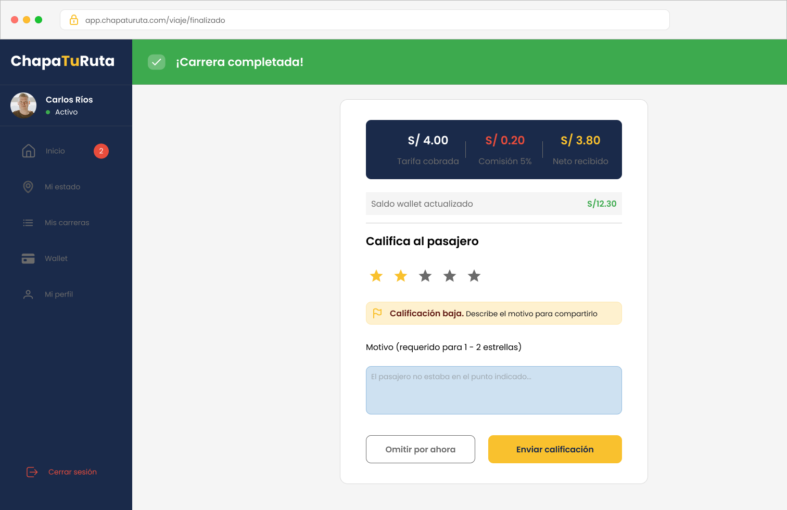
<br><br>

<br><br>


**Historial y Finanzas**<br><br>

<br><br>

<br><br>
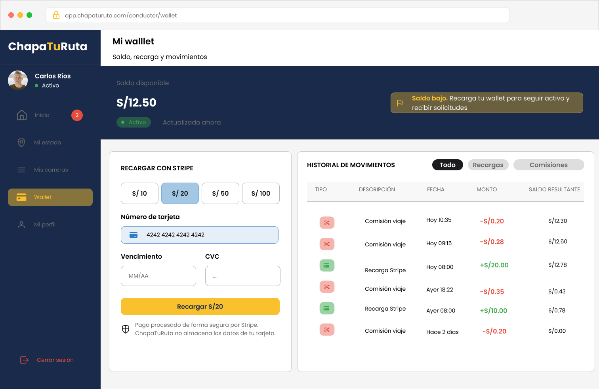
<br><br>
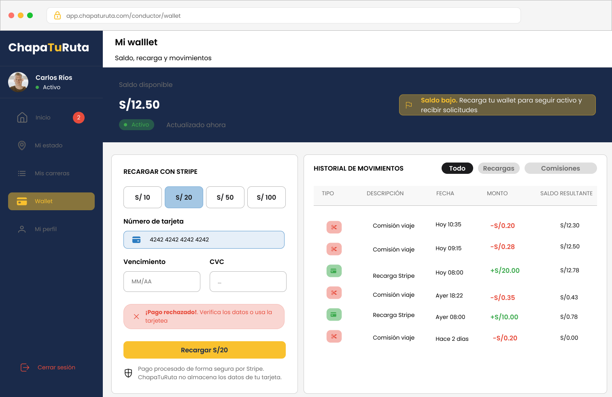
<br><br>
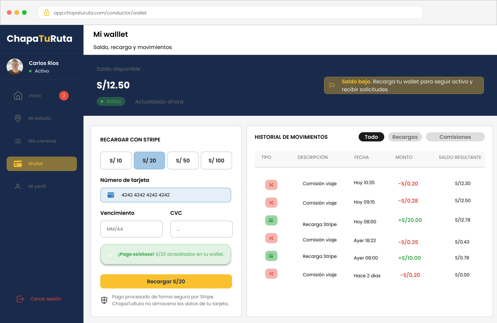
<br><br>


**Perfil de Usuario**<br><br>
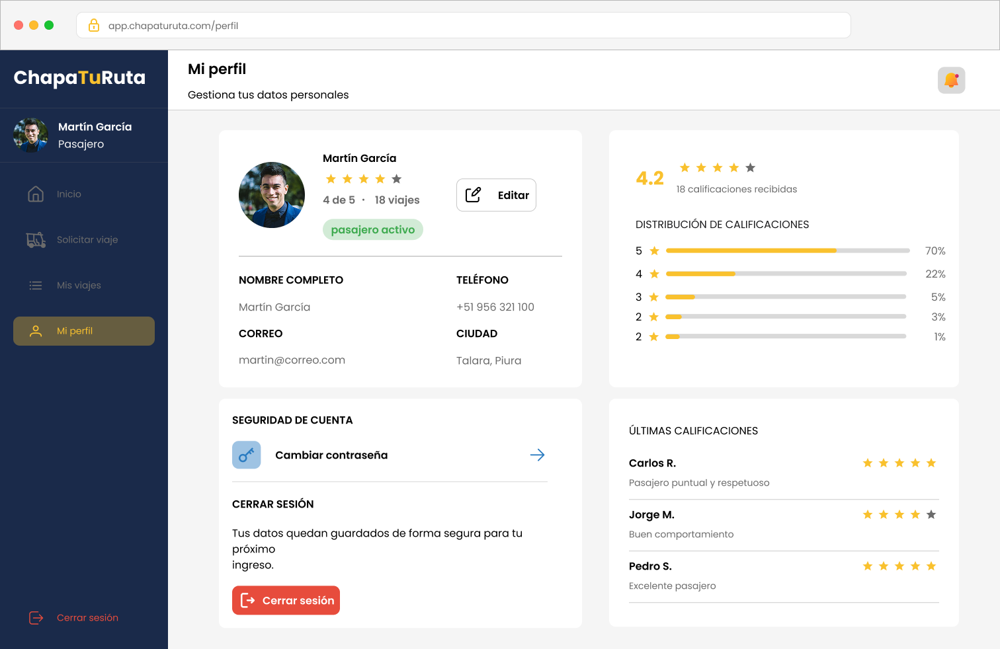
<br><br>

<br><br>


**Cierre de Sesión**<br><br>

<br><br>

<br><br>


**Otros**<br><br>

<br><br>


### 4.4.4 Web Applications User Flow Diagrams

### User Flow 1

#### Relacionado al User Goal 1: Como pasajero nuevo, quiero registrarme en la plataforma para poder solicitar viajes

El usuario accede al Login y selecciona "Registrarse". Elige el tipo "Pasajero", completa el formulario de datos personales y confirma. El sistema crea la cuenta y redirige al Home del pasajero.
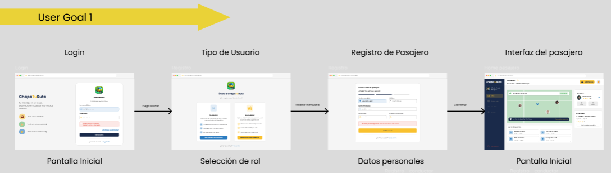

#### Relacionado al User Goal 2: Como conductor nuevo, quiero registrarme con mis datos personales y vehiculares para poder aceptar viajes

El conductor selecciona "Registrarse" -> "Conductor". El proceso es multi-paso: datos personales, datos del vehículo, carga de documentos y confirmación de registro exitoso.
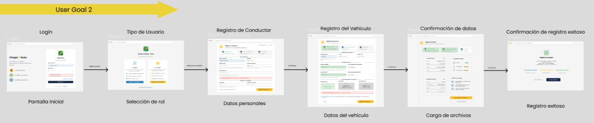

### User Flow 2: Recuperación de acceso

#### Relacionado al User Goal 3: Como usuario registrado, quiero recuperar mi contraseña cuando la olvido para poder seguir accediendo a la plataforma

El usuario en Login hace clic en "¿Olvidaste tu contraseña?". Ingresa su correo en la pantalla de Recuperar cuenta. El sistema envía las instrucciones. Al completar el proceso regresa al Login con acceso restaurado.
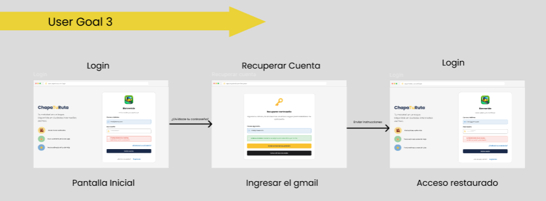

### User Flow 3: Solicitar y gestionar un viaje


#### Relacionado al User Goal 4: Como pasajero, quiero solicitar un viaje ingresando mi destino para que un conductor me recoja.

El pasajero desde su Home ingresa el destino y solicita el viaje. El sistema muestra el estado de Viaje Activo mientras busca conductor. Una vez asignado, el conductor aparece En Camino, luego En Curso hasta llegar al destino, mostrando finalmente la pantalla de Finalizado.
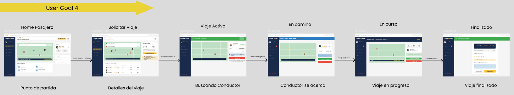

#### Relacionado al User Goal 5: Como pasajero, quiero ser notificado si mi solicitud es rechazada para poder intentarlo nuevamente.

El pasajero solicita el viaje y queda en espera en la pantalla de Viaje Activo. Si no hay conductores disponibles o la solicitud es rechazada, el sistema muestra Solicitud rechazada con el motivo. El pasajero puede volver al Home para intentarlo nuevamente.
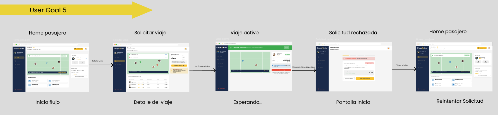

#### Relacionado al User Goal 6: Como pasajero, quiero calificar al conductor al finalizar el viaje para contribuir con la reputación del sistema.

Al completarse el viaje, la pantalla de Finalizado muestra el resumen del trayecto. Desde allí el pasajero accede a la pantalla de Calificación del viaje donde asigna estrellas y escribe un comentario. Al enviar la calificación regresa al Home del pasajero.
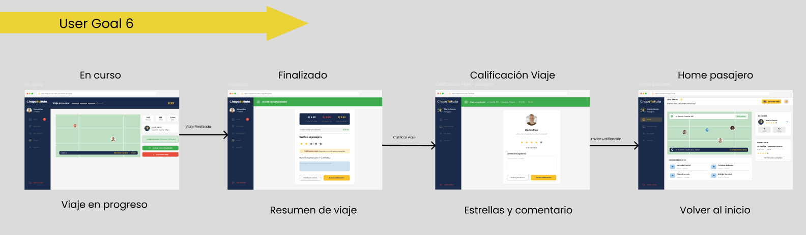

### User Flow 4: Consultar historial y gestionar wallet 

#### Relacionado al User Goal 7: Como pasajero, quiero consultar el historial de mis viajes anteriores para revisar mis gastos y trayectos.

El pasajero desde su Home navega a la sección Historial. La pantalla muestra todos los viajes realizados ordenados por fecha, con información de origen, destino, duración y costo de cada trayecto.


#### Relacionado al User Goal 8: Como pasajero, quiero consultar el historial de mis viajes anteriores para revisar mis gastos y trayectos.

Desde el Home el pasajero accede a su Wallet donde ve el saldo actual y el historial de movimientos. Al seleccionar "Recargar" elige el monto y método de pago. Tras confirmar el pago, el sistema muestra la confirmación de recarga exitosa con el nuevo saldo actualizado.


### User Flow 5: Gestionar viajes como conductor 

#### Relacionado al User Goal 9: Como conductor quiero recibir y aceptar solicitudes de viaje para trasladar pasajeros y generar ingresos.

El conductor activa su disponibilidad desde el Home. Al recibir una solicitud, la pantalla de Estado muestra la alerta. El conductor revisa la Solicitud completa y decide aceptar. El sistema lo guía a través de En camino (dirigirse al pasajero), En curso (viaje en progreso) hasta Finalizado donde se registra la ganancia.


### Task Flow 6: Historial de carreras y perfil

#### Relacionado al User Goal 10: Como conductor, quiero consultar el historial de mis carreras realizadas para controlar mis ingresos y rendimiento

Desde el Home del conductor, el usuario navega a "Mis Carreras". La pantalla presenta el listado completo de viajes realizados con fecha, trayecto, duración y ganancia por carrera, permitiendo llevar un control de su productividad y ganancias acumuladas.


#### Relacionado al User Goal 11: Como usuario, quiero ver y editar mi perfil personal y cerrar sesión de forma segura

Desde el Home, el usuario accede a Perfil o Mi Perfil. Puede ver y editar sus datos personales, foto y calificación. Desde esta misma puede iniciar el cierre de sesión, que solicita confirmación antes de redirigir al Login.


## 4.5 Web Applications Prototyping

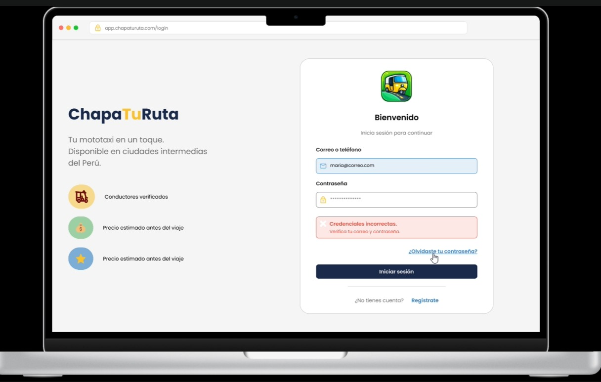

Video de Prototyping: [Ver video](https://upcedupe-my.sharepoint.com/personal/u202322952_upc_edu_pe/_layouts/15/stream.aspx?id=%2Fpersonal%2Fu202322952%5Fupc%5Fedu%5Fpe%2FDocuments%2FChapa%20Tu%20Ruta%2FPrototyping%2Emp4&referrer=StreamWebApp%2EWeb&referrerScenario=AddressBarCopied%2Eview%2E4478439f%2D6b7f%2D42f0%2D9388%2De69468351534)

## 4.6 Domain-Driven Software Architecture

### 4.6.1 Design-Level EventStorming

#### IAM

##### Brainstorming


#### Flows


#### DRIVER MANAGEMENT

##### Brainstorming


#### Flows


#### RIDE DISPATCH

##### Brainstorming


#### Flows


#### TRUST AND REPUTATION

##### Brainstorming


#### Flows


#### MONETIZATION

##### Brainstorming


#### Flows


### 4.6.2 Software Architecture Context Diagram

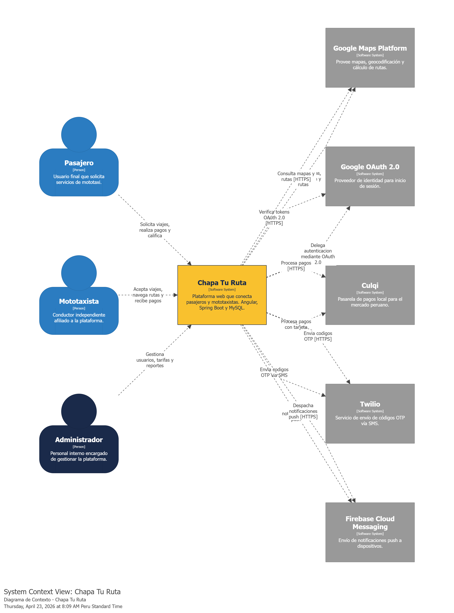

### Actores

| Actor             | Rol                                                                            | Interacción principal                                                                  |
| ----------------- | ------------------------------------------------------------------------------ | -------------------------------------------------------------------------------------- |
| **Pasajero**      | Usuario final que solicita servicios de mototaxi en zonas periféricas de Lima. | Solicita viajes desde la aplicación web, realiza pagos y califica al mototaxista.      |
| **Mototaxista**   | Conductor independiente afiliado a la plataforma.                              | Recibe solicitudes de viaje, navega la ruta, cobra el servicio y califica al pasajero. |
| **Administrador** | Personal interno del equipo operativo.                                         | Gestiona usuarios, configura tarifas, atiende incidencias y consulta reportes.         |

### Sistemas externos

| Sistema externo                    | Propósito de la integración                                                                                         |
| ---------------------------------- | ------------------------------------------------------------------------------------------------------------------- |
| **Google Maps Platform**           | Provee mapas, geocodificación (dirección ↔ coordenadas) y cálculo de rutas con tiempos estimados de viaje.          |
| **Google OAuth 2.0**               | Proveedor de identidad que permite el inicio de sesión federado, reduciendo la fricción en el registro de usuarios. |
| **Culqi**                          | Pasarela de pagos local que procesa transacciones con tarjeta de crédito y débito dentro del mercado peruano.       |
| **Twilio**                         | Envío de códigos OTP vía SMS para verificación de números telefónicos durante el registro y autenticación.          |
| **Firebase Cloud Messaging (FCM)** | Envío de notificaciones push en tiempo real a pasajeros y mototaxistas.                                             |

### 4.6.3 Software Architecture Container Diagrams

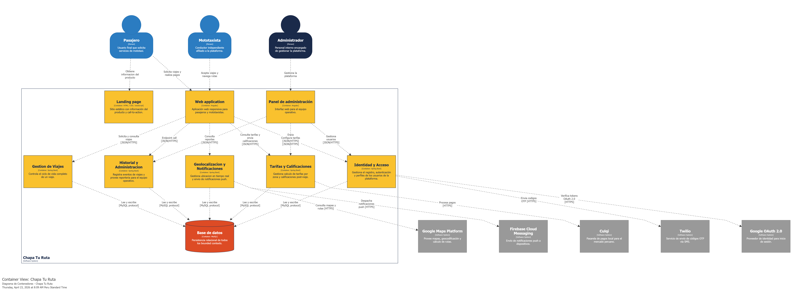

### Contenedores del sistema

| Contenedor                           | Tecnología              | Responsabilidad                                                                                                                                  |
| ------------------------------------ | ----------------------- | ------------------------------------------------------------------------------------------------------------------------------------------------ |
| **Landing page**                     | HTML / CSS / JavaScript | Sitio web estático con información del producto y call-to-action por segmento objetivo.                                                          |
| **Web application**                  | Angular                 | Aplicación web responsiva para pasajeros y mototaxistas. Permite solicitar viajes, visualizar el mapa, gestionar pagos y consultar el historial. |
| **Panel de administración**          | Angular                 | Interfaz web para el equipo operativo. Permite gestionar usuarios, configurar tarifas y consultar reportes.                                      |
| **Identidad y Acceso**               | Spring Boot · Java      | Gestiona el registro, autenticación y perfiles de los usuarios de la plataforma.                                                                 |
| **Gestión de Viajes**                | Spring Boot · Java      | Controla el ciclo de vida completo de un viaje: solicitud, aceptación, inicio y finalización.                                                    |
| **Geolocalización y Notificaciones** | Spring Boot · Java      | Gestiona la ubicación en tiempo real y el envío de notificaciones push.                                                                          |
| **Tarifas y Calificaciones**         | Spring Boot · Java      | Calcula tarifas por zona y distancia, y gestiona las calificaciones post-viaje.                                                                  |
| **Historial y Administración**       | Spring Boot · Java      | Registra eventos de viajes y provee reportería para el equipo operativo.                                                                         |
| **Base de datos**                    | MySQL                   | Almacena de forma persistente los datos de todos los bounded contexts del sistema.                                                               |

### Flujos de comunicación

Los clientes (Web Application y Panel de administración) se comunican con cada bounded context del backend exclusivamente mediante llamadas HTTPS con intercambio de datos en formato JSON. Cada bounded context del RESTful API accede a la Base de datos a través de Spring Data JPA / Hibernate. Los sistemas externos (Google Maps, Google OAuth, Culqi, Twilio y Firebase Cloud Messaging) son consumidos directamente por los bounded contexts que los necesitan según su responsabilidad funcional.Sonnet 4.6Adaptive

### 4.6.4 Software Architecture Components Diagrams

### Bounded Context 1: Gestión de Identidad y Acceso

Este bounded context gestiona el registro, autenticación y perfiles de todos los usuarios de la plataforma. `UserController` recibe las solicitudes desde la Web Application y el Panel de Administración, y las delega a `UserService`, que contiene la lógica de negocio. `UserService` se apoya en `JwtUtil` para generar y validar tokens JWT de autenticación stateless, en **Google OAuth 2.0** para validar identidades federadas, y en **Twilio** para el envío de códigos OTP de verificación telefónica. `UserRepository` persiste los datos en la tabla `users` de la base de datos.

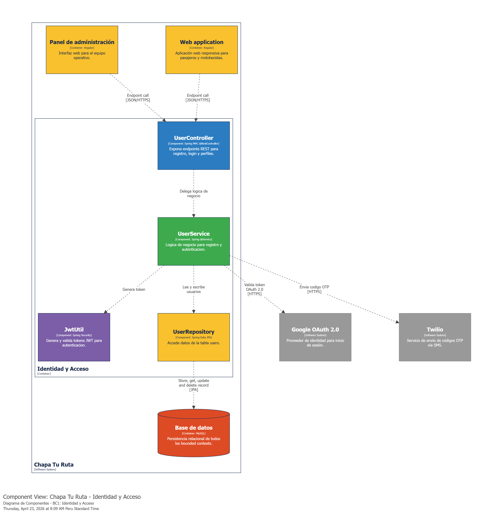

### Bounded Context 2: Gestión de Viajes

Este bounded context controla el ciclo de vida completo de un viaje. `TripController` recibe las solicitudes de la Web Application para crear, aceptar, iniciar, completar o cancelar viajes, y las delega a `TripService`. Este servicio orquesta las transiciones de estado del viaje coordinando con los bounded contexts de Tarifas, Geolocalización y Notificaciones a través de inyección de dependencias. `TripRepository` persiste los datos en las tablas `trips` y `trip_requests` de la base de datos.

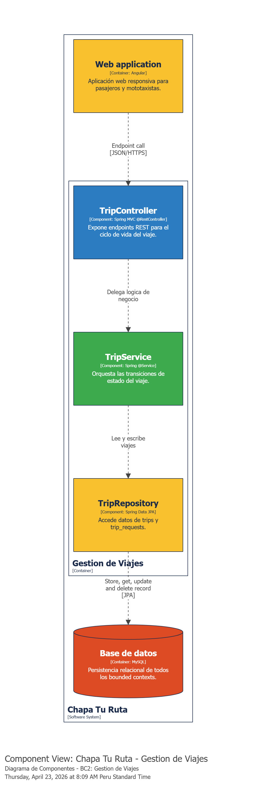

### Bounded Context 3: Geolocalización y Notificaciones

Este bounded context gestiona la ubicación en tiempo real de los usuarios y el despacho de notificaciones push. `LocationController` recibe actualizaciones de posición desde la Web Application y las delega a `LocationService`, que mantiene la posición activa de cada usuario. Cuando ocurre un evento relevante (solicitud de viaje, aceptación, llegada), `LocationService` delega en `NotificationService` el envío de alertas, el cual se comunica con **Firebase Cloud Messaging** para entregar la notificación al dispositivo del usuario. `GoogleMapsAdapter` encapsula las llamadas HTTP a la API de **Google Maps** para el cálculo de rutas y geocodificación. `LocationRepository` persiste los datos en la tabla `locations`.

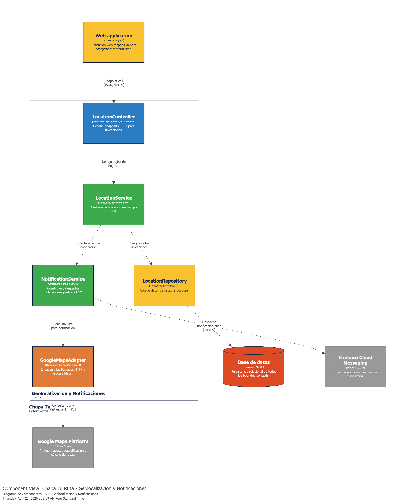

### Bounded Context 4: Tarifas y Calificaciones

Este bounded context es responsable del cálculo de tarifas por zona y distancia, y de la gestión de calificaciones post-viaje entre usuarios. `FareController` expone los endpoints para consultar y configurar tarifas, mientras que `RatingController` expone los endpoints para crear y consultar calificaciones. `FareService` aplica la fórmula `total = baseRate + (ratePerKm × distanceKm)` usando los datos de la zona geográfica e integra con **Culqi** para el procesamiento de pagos. `RatingService` gestiona la creación de calificaciones validando que el puntaje esté entre 1 y 5, y calcula el puntaje promedio por usuario. `FareRepository` y `RatingRepository` persisten los datos en las tablas `fares`, `fare_zones` y `ratings` de la base de datos.

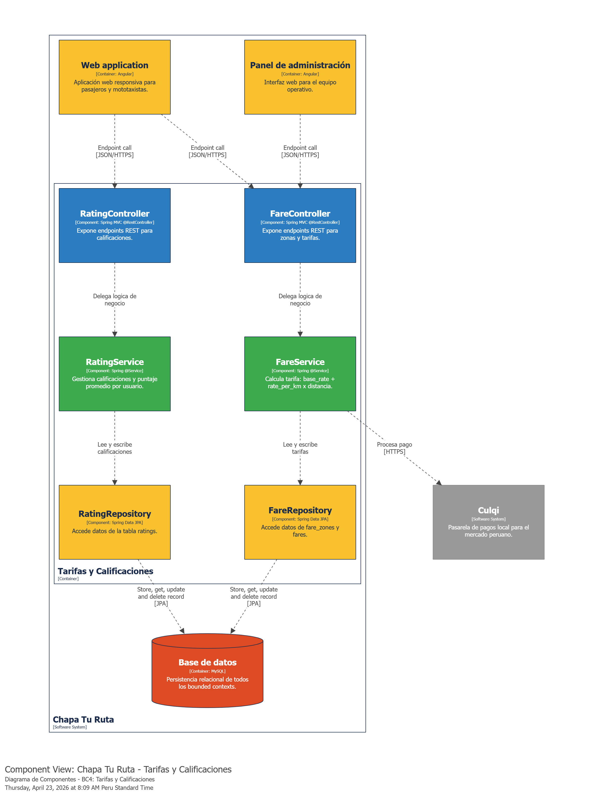

### Bounded Context 5: Historial y Administración

Este bounded context registra los eventos del ciclo de vida de cada viaje y provee capacidades de reportería para el equipo operativo. `HistoryController` expone los endpoints para consultar el historial de viajes y generar reportes administrativos. `TripHistoryService` persiste cada transición de estado de un viaje como un log inmutable en la tabla `trip_history`. `AdminReportService` genera reportes agregados de viajes diarios, ingresos y actividad de usuarios para el Panel de Administración, almacenándolos en la tabla `admin_reports`.

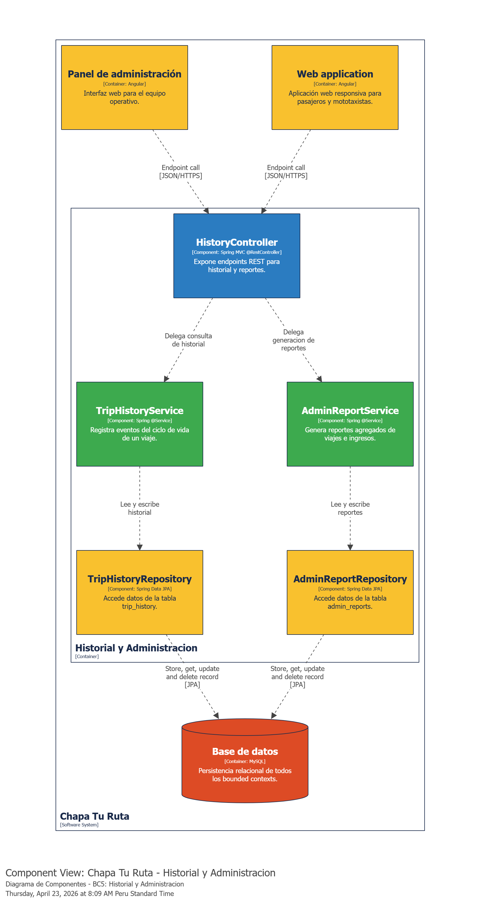

## 4.7 Software Object-Oriented Design

### 4.7.1 Class Diagrams

#### IAM

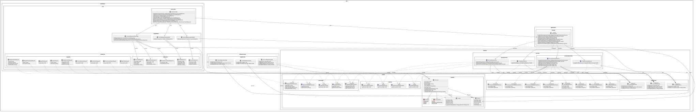

([Link to IAM class diagram](https://editor.plantuml.com/uml/xHhBRkCsy6x0_o3aqhHftFPgR8FrsifMGFnOoGdGKy78Z2Ei7guUsQRj_dj7eaIHr52YasowAEf379CpmvdXl3ZasomdQLv4uNYKVGpY0qb9P1s8_v7igPS_XjHAgP-JU1zI4S8FIPRDyZmDRekSEduIUy6VrFfnFBeFTjIYqI5_j28QtT8q6u_6evgYTHAGQ48EXp3mIHuayUIE-6H7Jwo_nYCBFXLToo7HPJLklNd3_hcuQ23ApnamjG-odAOR0AVndgQdVX959DvDBSTLv-PiwjkfDVFzf8XpZD8Y3HvGCcoYbqOMx6Cd5d2zQg35yMYMWRGgphh85IGOQR4Uac0deXI77Sdf9atkWf0AYDVYU8jU3uWKzZIV5VczbvEyo4v_BsZw2FZlnT4FvI0k9c3FYpIbSLxB8rAGPnegYE10PVdO224Gu8CDBiu_smxW3YXtvUZEel9y7ey-TynobqGaY2THigFX14G9ye1ct39fN4JMTKPJDm6d48nnC_CyU_NUTjkXXUlSYBzdYwMpuYiBz4H6HPgp-HOe26lOguMpUlyRK7KkdVbiwwnNxQnhUrlNcM_jXR86ywPQSf7-kKNOe0FsSttjBCGf2ce8OUl0kUEzE740Qf-ITFSBoUwn-HGqC-KwKbRZSaubgSNT9NuUF80bdoAs7v7quuR6ErZoXgR1NHq_C50QazkGYfQ0GQKq0m7yN0_nGCAWTAnvIdUbEP0mEqt9fqsjXKO3W7cRWBmaHhLVMx6i_GCRnBJVip5tHHYkI4JHlRbFykGwHVPDZHigbUyxk98k575gXvR5oTZWaU84sQpSSAheZ_5SfILiLuAusPTJbSy1bwu3PklIGGpX7H8GrUSCI43rVse6Wb1abuvISj5LESmsTg82S8KYoqkvvWkipG6k0f_66LqLPORMGda9oN4GJ0WfwRsIukISsRkernXfIRUrHOmgbb1xQSyQAvTfy_dBskVqCjSkYCWyODLbyXFpb216Dw-34DMtkGYOUl1i_sAqvKBWnSXgIeCdqTVk2Nq0hMHAESk3IasmyNQwiqjmu61HOLU_L3wq0VJCIdo_t8RTEfvQ2p3ORH1HD6XpqV_5rP7a_KhhbmL96IVepZ5PKflCNfeRY5lFOyTupTgVM5WpsNPjVV8KemC1xAeaUtLpXvNTkipxeejhmq5A3qaMv8akGdENhC7AQDJ-w9W2UQ2dDO_yG8EKI7T1l7lt265BaGS_rJ5ebfAbqXy7ftz0zCXq27WbB4XSc-8n4jV6o0-4MedRUDqLN3fCefK4yxDZ6AjTavzoDOonAhUVFUISp7THYG0gT9_zGQnvW4eluxLl_Rl75kiYnsEG_tTTiEDaT_zqfqjZj1vVwTkHvxI4Z0odwgqOc4rLGw4iVYKzfvVg6-bsgLS1JsXueRiJn7Sf0Sig_Bn8APvUfAPF6y6Sw13-HzA9LDGCIlW5quVK4Xbav2jE5zoSiqaPkI1Tn7cQX25DLRjoI3JdaqFP8QLWxXaOLoSvk6ocjGceqmv9d56CO9qaEjJOk16fEbTm4YnLjAXy3t7KCcL8k33G8lVtwJcU59DRR3xGNLeEdPnGEoR8BeoXX9Geoed9uqOQaG8Q9yI7J4L38Z8drfrhgM9puW965Wv_aY9bFol2gg7hJ5QsUKsl_8ptoZKjB7aDoP2VjG2R2yNk7WQGySPUBt-IbxoauB8B6HnurKCquah6Hpbz6_rCqqPNBrHK_DOMY61UjtnP5IVEvw2rj7CI1tdQCnBjQKAcpRUHwq9idkexhXy2zMpmKhSCkwDl9RH7QceP-j3oGKlqI_JNFuOMEUHmlSAEMo-PVIFRf52IB7QMGCdCvOd3G1MQVSKB7dItN2KH6_UpnEz1Z5g1gcrnq-6TO3KucYDq6z_m-iWfJPQppGcy8tri-vJJhhsrMpkh5UsPoriQx5UEYjdFO3LtBgV_7HYdPzNNyrLyDHAFiMPTT45-d4o-Uw4tx42t87AWEVd5y85kpWgNweFYZHVBvUprSApVh0-NDkk0w8voysLlRHNszbYxLcRjGjomvotzGQeQKkboUJl2trdg4MKwnyPIse4ZKToIS90fRuF0n6AYnQcRVECHsW5mK2ntacfqMxQP_3TLiPuXETt3eyqBiQZJZBdu7AdO3pI9ssEecbe65d6Qkkkhwvi5spZSZQVBUm17FbCM1fZ-u1hQXNWZ1YCDe3gKRJnHe-Y3HqDog0-c0f05vxjtZXpUyWRMjahJU1jrQcreo7TWvrb7GoyxTU7WVNW35RGmmygfT45gAM99ETr71bI3wwGoQGdKW1pz_0LLg8OuClFA0oHvUSBHo09xmy4BC33DxB2GryOoDZOfbQuoBK-mYsAXrtRc-BgxizHcL4AoiM-X6XkRwwzMNlETlrqMnDzHhZluK6a1wjxIyInyDqM_Gt1qkZSaCCkpZ1_NPm-xWOBetelVXMgX_9nuj3EuErfbhqwS-CHtkjbu9qvg03GZcnT2AXpLMf7sH6o5AZa06U0ibUjuqP8K18qpeoGcoJeGPNRDw3ZPmJPeSSem4nn6mRP_K3ewtrJSXmHxTCGKpBT5nx7O_BN63AgFePZZogELfxwDk8f1DGd3XADGNigNoyltq6rnsAhjm7d7GoisjfDTXaMHKo0-R5-QlafPKL8Frwt7MAAsjDK44W8ReuHQJsT2Ma2Z2-ZhL3b4C6MCG76btaBJbP4uJy0))

#### DRIVER MANAGEMENT

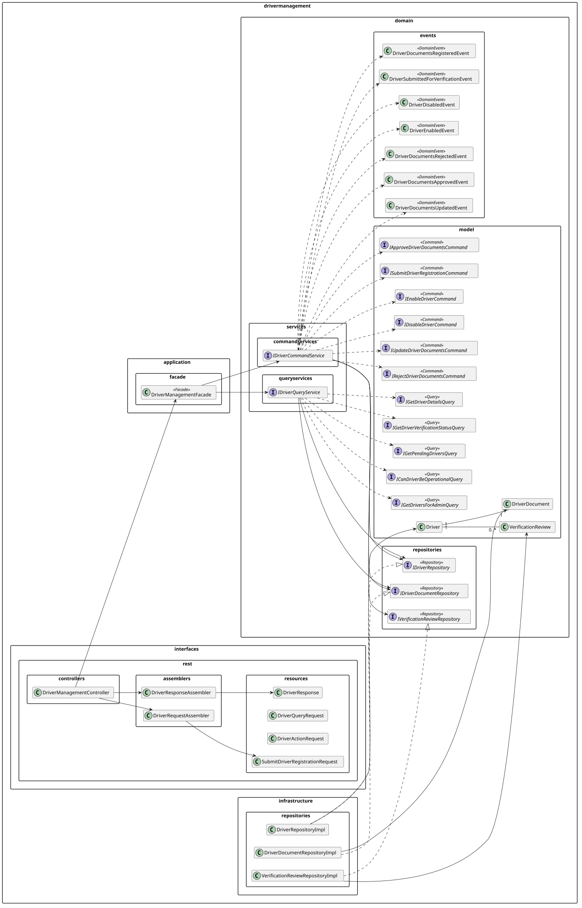

([Link to Driver Management class diagram](https://editor.plantuml.com/uml/xHhBRkCsy6x0_o3aqhHftFPgR8FrsifMGFnOoGdGKy78Z2Ei7guUsQRj_dj7eaIHr52YasowAEf379CpmvdXl3ZasomdQLv4uNYKVGpY0qb9P1s8_v7igPS_XjHAgP-JU1zI4S8FIPRDyZmDRekSEduIUy6VrFfnFBeFTjIYqI5_j28QtT8q6u_6evgYTHAGQ48EXp3mIHuayUIE-6H7Jwo_nYCBFXLToo7HPJLklNd3_hcuQ23ApnamjG-odAOR0AVndgQdVX959DvDBSTLv-PiwjkfDVFzf8XpZD8Y3HvGCcoYbqOMx6Cd5d2zQg35yMYMWRGgphh85IGOQR4Uac0deXI77Sdf9atkWf0AYDVYU8jU3uWKzZIV5VczbvEyo4v_BsZw2FZlnT4FvI0k9c3FYpIbSLxB8rAGPnegYE10PVdO224Gu8CDBiu_smxW3YXtvUZEel9y7ey-TynobqGaY2THigFX14G9ye1ct39fN4JMTKPJDm6d48nnC_CyU_NUTjkXXUlSYBzdYwMpuYiBz4H6HPgp-HOe26lOguMpUlyRK7KkdVbiwwnNxQnhUrlNcM_jXR86ywPQSf7-kKNOe0FsSttjBCGf2ce8OUl0kUEzE740Qf-ITFSBoUwn-HGqC-KwKbRZSaubgSNT9NuUF80bdoAs7v7quuR6ErZoXgR1NHq_C50QazkGYfQ0GQKq0m7yN0_nGCAWTAnvIdUbEP0mEqt9fqsjXKO3W7cRWBmaHhLVMx6i_GCRnBJVip5tHHYkI4JHlRbFykGwHVPDZHigbUyxk98k575gXvR5oTZWaU84sQpSSAheZ_5SfILiLuAusPTJbSy1bwu3PklIGGpX7H8GrUSCI43rVse6Wb1abuvISj5LESmsTg82S8KYoqkvvWkipG6k0f_66LqLPORMGda9oN4GJ0WfwRsIukISsRkernXfIRUrHOmgbb1xQSyQAvTfy_dBskVqCjSkYCWyODLbyXFpb216Dw-34DMtkGYOUl1i_sAqvKBWnSXgIeCdqTVk2Nq0hMHAESk3IasmyNQwiqjmu61HOLU_L3wq0VJCIdo_t8RTEfvQ2p3ORH1HD6XpqV_5rP7a_KhhbmL96IVepZ5PKflCNfeRY5lFOyTupTgVM5WpsNPjVV8KemC1xAeaUtLpXvNTkipxeejhmq5A3qaMv8akGdENhC7AQDJ-w9W2UQ2dDO_yG8EKI7T1l7lt265BaGS_rJ5ebfAbqXy7ftz0zCXq27WbB4XSc-8n4jV6o0-4MedRUDqLN3fCefK4yxDZ6AjTavzoDOonAhUVFUISp7THYG0gT9_zGQnvW4eluxLl_Rl75kiYnsEG_tTTiEDaT_zqfqjZj1vVwTkHvxI4Z0odwgqOc4rLGw4iVYKzfvVg6-bsgLS1JsXueRiJn7Sf0Sig_Bn8APvUfAPF6y6Sw13-HzA9LDGCIlW5quVK4Xbav2jE5zoSiqaPkI1Tn7cQX25DLRjoI3JdaqFP8QLWxXaOLoSvk6ocjGceqmv9d56CO9qaEjJOk16fEbTm4YnLjAXy3t7KCcL8k33G8lVtwJcU59DRR3xGNLeEdPnGEoR8BeoXX9Geoed9uqOQaG8Q9yI7J4L38Z8drfrhgM9puW965Wv_aY9bFol2gg7hJ5QsUKsl_8ptoZKjB7aDoP2VjG2R2yNk7WQGySPUBt-IbxoauB8B6HnurKCquah6Hpbz6_rCqqPNBrHK_DOMY61UjtnP5IVEvw2rj7CI1tdQCnBjQKAcpRUHwq9idkexhXy2zMpmKhSCkwDl9RH7QceP-j3oGKlqI_JNFuOMEUHmlSAEMo-PVIFRf52IB7QMGCdCvOd3G1MQVSKB7dItN2KH6_UpnEz1Z5g1gcrnq-6TO3KucYDq6z_m-iWfJPQppGcy8tri-vJJhhsrMpkh5UsPoriQx5UEYjdFO3LtBgV_7HYdPzNNyrLyDHAFiMPTT45-d4o-Uw4tx42t87AWEVd5y85kpWgNweFYZHVBvUprSApVh0-NDkk0w8voysLlRHNszbYxLcRjGjomvotzGQeQKkboUJl2trdg4MKwnyPIse4ZKToIS90fRuF0n6AYnQcRVECHsW5mK2ntacfqMxQP_3TLiPuXETt3eyqBiQZJZBdu7AdO3pI9ssEecbe65d6Qkkkhwvi5spZSZQVBUm17FbCM1fZ-u1hQXNWZ1YCDe3gKRJnHe-Y3HqDog0-c0f05vxjtZXpUyWRMjahJU1jrQcreo7TWvrb7GoyxTU7WVNW35RGmmygfT45gAM99ETr71bI3wwGoQGdKW1pz_0LLg8OuClFA0oHvUSBHo09xmy4BC33DxB2GryOoDZOfbQuoBK-mYsAXrtRc-BgxizHcL4AoiM-X6XkRwwzMNlETlrqMnDzHhZluK6a1wjxIyInyDqM_Gt1qkZSaCCkpZ1_NPm-xWOBetelVXMgX_9nuj3EuErfbhqwS-CHtkjbu9qvg03GZcnT2AXpLMf7sH6o5AZa06U0ibUjuqP8K18qpeoGcoJeGPNRDw3ZPmJPeSSem4nn6mRP_K3ewtrJSXmHxTCGKpBT5nx7O_BN63AgFePZZogELfxwDk8f1DGd3XADGNigNoyltq6rnsAhjm7d7GoisjfDTXaMHKo0-R5-QlafPKL8Frwt7MAAsjDK44W8ReuHQJsT2Ma2Z2-ZhL3b4C6MCG76btaBJbP4uJy0))

#### RIDE DISPATCH

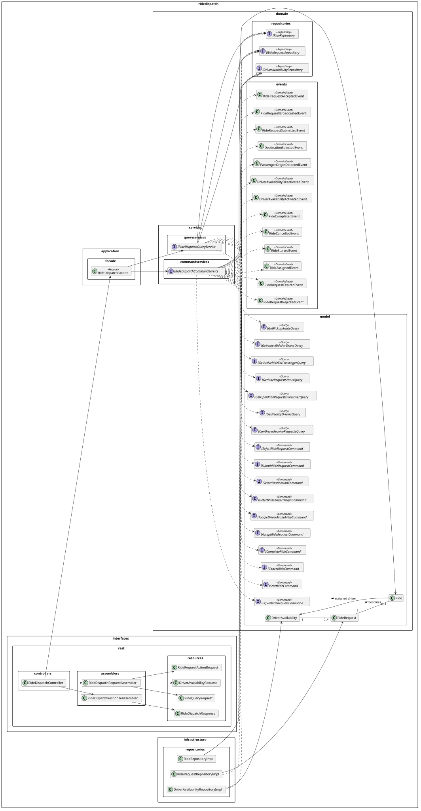

([Link to Ride Dispatch class diagram](https://editor.plantuml.com/uml/dPZRZjCm48Rl8-KThDuW8L71BOAAiYse4jfTKbx0TMQxPXCds4v5ERmxZfDkSt8yfXUxJVr_ux4zddZyGMagTPLdSPJ1WoQw898V7pL9kGIcUI7YI3rnKL99Sr9IzaIFiDVd34ZTJiKnWww2PLIfjTQI7oeDErQ8FVy5v7KSFV8K2EIbFfCSyWD85KTnr5ea2scQKwvAgjdZafPbnXcjkry-K4PJM93VSKJCntP04gFUjEfFLa3UlMk-h5PnzDTjEYrooiKoBrB81aOtafz0ha-KP_J0CwxFmouJ-561qiEVwzxgNxZG88s_G7RVYgEPcR75coBFgKYDj-stsjq1km5jflRUM0Tn17bd5eGB3BY7p80Ruo4NTl9GK7N8kUwC3WEj6OCo54hWkt4l4Dh-B4qa1aBxEgXh1YE-eO91XbONUPcP1NBgHyHdqBT0vU7SH8FwMe4y6yR-d-Z1wEzA49qXgq-5R604s-7CDEWAqz_QxFIJ7PBfwJdmGa6qY_USFLLbKfWCuLERnMdC9i2WxggTaH7dt_9m0g6LTy_R8L4DwRRMcous5hTF5mTTx0OecXxixsRJOtgzRkzcloEORapOxHu8VPG5JHbLWLYJ9SAO9ac4CKsEm25hfVXH8CKsZo2rJHh9iEesZRZK_d2MK1QAwq9ok0PrzoqoYixaGjGRv_embQcxwn46ETN-4IcG9yv0BLcJJI_FKwFh7W3QvBjlv44z_QZJ1xOVcsimlN3n8CrcaHNJbOJfbNAbaEkaxKo4E3V9lAZVEkjfEr9bl5JQpBpGiZ1HB8UUzYVyeWeoRluKbMIeIPWyPpsdbJhvEJHsaHnj5_yJK6KXb6yH-zxNwJe_U6Rcuk55w_EW8xIkl23lNP-wCTb-MT_ixcwtUtAVx6vlTlVhBzkz1ukZyGIJnPi5UVMAB5ulboyN_RDjvw4hUzF8o5jo0BD1GP5LepM2rSGQ6Y5jSor9RIknfwFfGB96ngTwj7myyMXmj19zTcZPCTpUzCsoxaX6eVq0dnsASx33CRObL2sVpQmOffybusZ685akLzvI2M5Xhc12uAwo2OCwYYS4wYgX4AYha4AWhd8ACzP1KOL0HgKLXXaNMACmwiPOGqqMMHXgljJ2M9Wkk33aJDaLZ0SwFIp1lCni8URRvpP9p9rr4FZayGVDNO6vaORwEOOnNhgehe--Ww5Pb3zUNvqdnfPsE3i-G_RqGMvElopdN1ky8YVTkMWmxnTVXVy_5ePrlj_6NBMFyC1Hy_j9P-KVX0xh_o2uTmiGHFRk0eB8xeq03kpT2-2Gxkq0ZkZV4I2Ptar17V4VGAHLdlq3))

#### TRUST AND REPUTATION

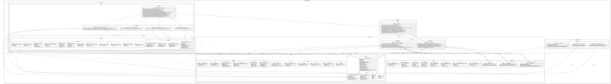

([Link to Trust and Reputation class diagram](https://editor.plantuml.com/uml/xLjBRnit4BuBq7zOv587hjsUZTI8Ocs2HMr9qSf1UrplClOs--e-4gXj_dkvRpvcIAuimoaQ7so977wS6GvdXkJuTL5wULd5qNnMV0gJpCkzsCey_vDtJzno7n4h9txf9VSHOIdyo2kAHLdcuLrL4iTF4pVyYrW_psSFOK0i4cVbtef9V4VoOZwRppf4wqMPLqMPawmglJ9CatClowBGRpz_z7ml82-il-SpY_uqSrYxUi1s6F2seR5UlMe_N5xsrFNFgPLx9LdcuMUId_Xf77j9S64vsw7ngcrxUK5XmuosXyczE7n3PoN9lOGmjEj0g9QoThgsZy5nXIuJg65U44terGf8_3GFhjClm3YIbAp8QahTH6b6ahhdRIhplHRxT63tfEoqDjZ1oPyLoVSKx9tSzxxkec1Ykm0v2WQY0jqzCD0bODS6uzr5f1Dpj2bc0eocdmNLXJ2mitSSkINGmcwgExeLEVFqye1J2KXXgEwRFQndjhs7Mj_zGRrE2_1rFlkgT2516djXSXwd0OdEgMc6PKYAmOkGf8gjbbcN3gWArc5ixDNIMRqR6xQBdRqSlxg_EfiDss3_jd6sVKF35Zi72JRKcUvt-uomiootpWTxoyowS5rxzQvl6c1wXzUl3ujnPfL3kqCtqUsjinHxeVQWMHIe9-lj3H_6gks2Ko88P4RUGhlKkn1g04b9w4WGpe2aSqONbalbPmtwh77bzHwufGOHKUEaNtTXJ4GVDVedQdQVqp10ead1COFGZjjSIou52OH6zFxGp8sd7WYfovPzEgCa024iNAgag7SR9qdwPTGOfRzBquXu2MYkugxdZHOtFu-srpb6gwWbySFOYpYBJailQYKf02jevFOYlueedtfzFtX5XtMY4GXmxhnCoetpJOarmMzsqNdqco6TCwSP6S7ZDSt2kazY6aRT_QvnI3LNl8gOQ8vsRqOD8nHRTdVNDFp-7fQKaKBA0f-H_SOywZvk_J6knSppFy4uakeUpZlA73Oxd1eVMtdWeXdbpa-sZBtZVyd7nMaEeSxGs3oA4GzBkQb0pLz077FTAJ9l1Vuauz3btefvZcUXoZJzK0wcgHdFve-rab9khm1U-7vQ9QNIvO_vTKt4jqmpSlAPxf12kci8ipSq_CQaNngx9gDCBvjHpJUHTJZpFaLJdrDL0a6JKj-lyfm4wmGDQbpYLUlWIRWiaFHx0eki-tiKbqgD7O5HTXFKeIDxEcuFKjvHsCANsfWdDAIr4U-vsHEZqcqM61hU4IO7efRv_8URZ96teorf4POf5j77EuTjJrcxwl6Bo6z1ppaduuq4Uwi4d58-XadmPjz5BdRzqUkeUWHwXyOY_2YhRWfeTxhd4NbZ0E2WQ2VQtXH51i9O-IuDLUeGZYMcuUiuY7N0SgTmdyd3mIjIL0OsRu9M4xrkDJN_WkIVGvyKmoct-mvl1UwzeSlGtNO4B_rHxxY_lrmy-yl5P7DgRh4d65EJ-eAczFs5GmN-Vt_X29EFkKTRAh-iSW97S_7nO7JQJfn5twCt4BtXf56hkEU8rcYAgUNs6uxEWwCig4aN9OtEIPcdKKHosQo5eDmJwW9oJkW-B4gwtyIkRTl3sSUM55cQ50I9omFO69Qde8nRW0DYz6U69KNf0KuCqbCGnM3DWGgTnb9hOlOmX-9SQJOJ53y7T7c7zw1o3mWDnT417ToK_GHW9pW7wYyvOu4e9kW8zf_O3DDC78-lewh0_idBmSNP0Pnj7I77DhUYUL--vp4d-oZwAwtozcipX-YgC4Vpf9U6oiTk8OX8pkj9EOCkvm26H6D-RfuGJ_ge-pzW2jYl7Ywy-NNTKRGiL1OOfbV0r0Qou6xMw2ODi3c5BptcEgkSwj5MMkbP9-iQSAKyXjU_rS2kQ7oKcVW2gVAshTjM7NXQYYTr7L1Tb5XxT8fLHCc4wbgeKtqjrAcc5agx6I6TuRhHLBUSggfRJFOpn8roFOx849ef7CNqZyBkjCrJwos-0qzJufvPzAJ2vabx0los04iA3IrFFxFHSLkTEPgRdfwT2UTfRV9lQe4eLwtO7VM9O9hzLOX6TPeCkPzg40QTRO9c3BFo7wnVi9-wSsjVBwwSzSfshQLjBTStpifPQqOnrRLdPvT2aQhSoTKN2DrIvUE5LJKFVeLrAH53LOKSlO6qxszjT-TQpitcshwnLxl5ohfQtzmiLalN-icYlLl7TZKuwF7a_FoVI_pPOZwJZmtj2Ec9eYMLCggHMdoEcC-mRBiTWpmzjCEG37eS2Jypp6VQtBXZsEWneLu-BD5jSR1B_FbCaTWEGx6R-bRNgaHsW53UnKiuq4ehhzsf7CeKT1G5ls6Vpw34SnWfNQCRR9ghzMgtNLzVsrkwGzukhXPBM-iWiAl6UXl3_ur4DpBDJFLZyR1hXg0FecOuHW7G3CeWPlL0siLgruSkb6jlFpXNMby6BqRDbUOLzy8AI4JkQzSx1OLxlkCmjABr4b7XUfTzPkQmDQASdokyDcNoWVw9QXPDS2HVVWY0LAqy4GCh73u01ga0dYgKMJKlWohZSgRJeA95j0hkG1IqMdOga392F1QDBMwTBA6YK7KgbboHogsR-JRUsfkrw-pMZz_2dQi1Ah1wpsa2eAW_cWAZhWKQNRbIsTCbaeSV88yCOYgDDlNkrlft9ldUqPE7Fa8Xp_5jKWDrGuaaC1GdGZ9A04D9Lwi5PPzFPwWYCv8NOL4MMkwHWzCuNiyyVfmQKRHBQd-WQtY4s8kLZ5DcQgzLF1X66QcQUoe0L6jzC1DYlV5Zc7aibc7DyO6o3YHShUxXyXhWQMsp_lVWcpVqpDB66NT37Or1CeoVBgJjscVsfaE6gz0Boyz9d_FgZoFODKap_M73OLQCJZIAUvY6eSU0m6mPd8wKAZ8ShnBA40A__UO4UasIe8gZVm40))

#### MONETIZATION

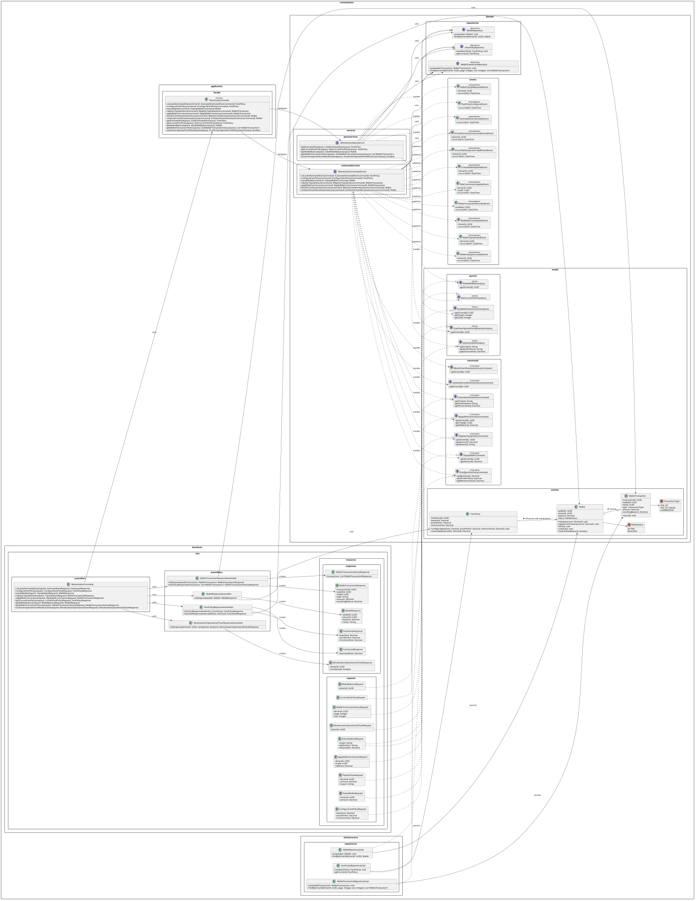

([Link to Monetization class diagram](https://editor.plantuml.com/uml/xLfRRzl64duNeFz0-ANgIQAshqAEKLcIMw6sfOXo3lfKqEHQ9iABoYLTA6t_-ndUzp9xeToaBH0_s2PtvvlPtRdjSBwdkPVbHHoDHn5vp9qyTRBmy9GxGPWHFm_JP3oY7yBaw6LUx1mz_uDt86v-YeXJZdl98IBi33_oA9tdUHO-53bP-sdYXX-9y-ruz1G6n27nCJyvCOaVI4R7e_6eGNGkuZGXUVZHArbElUCn2ltw_qVFzm9ouVm-7ZdmKp5mRfdPrzK4v-tR-f_BotPg-VFAyRt8Bo8l9okQXp7y3QwzZ4pyD8wz99WvwmKwOL6FVprpogTj2lASEDWqUGmFHKRwOHPJ7ZK1vkdn_lW_Buf8pW3j-xSzGFtC4cVa4DASPDNqQo-C2cw9EsHOXDjdNaAzviXxvF8eJZiukt9-I2aCCy1pUTGIzo5A_G_BB7mc6NkOSzydb38ShdJpT5jI9BOixlKpTKmE9EVLwjU2P2V0_44OU5U-Lvuzm2oAB2D9pcWJ0oKD6k5gKQ-yo4jyJYfke8L15oOTtu-WGsbsaj7aEItm3Jo-bIPTylQPr3k_EP8CjkiwIsFs43fs2yF4bkT3caR4QvJjp_7eJxMV2TBO2vDfd0Oaci86Xtb8QETgI5B4pTQukPSNb7KiyyL-_NxLFr_TR1O_hPOTLmQ2MVd-T2Giodwp_UL-Apx_SZrVtxHOvSzYStkxTjtrvax0hxrXhmKizXldiNk_1Zs_lrylsT47ZrRkQUOiYG-Q6h63nopqoPPaFyNeS1mcOLp42dB6EquaBgynxDSe8XpcSne6g3UV1A1QfGupA5yBiWZRL1yblqM_LU-mxGagNSCthZ8UT6DefIWpJcqaBp_nuhH8SjqwAxVBk5mpHUN39iX0umYneIUFRbCAMlzCMbU1692yXun6yzkPzmFOpgbt6nA68_eU36OcMX0xGTWOTYWZj8ZoC3bSAG-iZ9n-cWNyvWnm6aqKwPr6c42SXPo5618Bo5UQ_yI41Lpl1dAmC2c5Sc5ZaeCml2G0cDJUKJcdCu-9qYnOMPK9YrRGgyQw9HxTZ6rdxEevjxtjMmah9qLQ8PUD9PVOl7vLm_DAWwmOQ_AeJo11DxuZ7fMF6XDGdO-zHBvzPPoAmPARzSdPP7DdI8gniilgpcDcwntAr8NDA1Znq0GHfAd-_YDSWZBlbALKaCkvfcQ1zYThoZi7C-c6jt2UvT0Qc1r89eoMDrbf57McDfdgELjXrZlo3ET5XTio7t_Qg1IiohaWnh8YhPv4OLBVBrKWs2IWC42p3sDYI46xIFANuZS7NlhT7G6pedRogvAuypYx1RWE4lmDdCjOytdPDbPxVmmiLUMlMt1lrRigERDYhqej1x3dusOPIiCNhXpFQWU8L7k2Ub-Mv0Y_FzTPi9nhDmPx0a-dAeH_NYdawBqZfRl_b5AONMr6ZkNTALL5-DubxjgPfTFl7qH9gVTC9lsTdQtk87UtlcOqGGf1M5Yg3tE8CBLHjRTPH8Z7C0ckJbsyulTQA2ofHU8iVgXq335ISXmgysld20VUnVZN3eMWtpsQAbfMUaD9zWnt8jhT7PjdJ8TOpM_oLBUU_gN8_QN8_ScBtCFqkIhKscfpbVkYklobflwlhgc7oMFcqJmh_1mC48-IufsXT_Jh-1XzXgZ8vfj6vfyc2YfJNYjf_ZrHhxD_2hf0SuXwIPwbW9I9-i07ktQMLQ3BwZlXZB_gDZV5HX7U5MaEh-WnJIWnHRaE40boF6pxJiPbWrs7nyIw7gTzbZ7GcCU3DMz5D4wdP60iv7MuICGR28zwttvJnI7RBPMyS0V9lRRPMPqt5b3b6PhTw6OWYcPoonrVzYrp-rey4Vz3pri_Y-K_p4JXLrfazMF5IrjGQkGH2ZjLkH8hH0PzfH8TbZ_heOvJRPUy89gldA_qNpbVQRvo2iB8Hcrx1qK_Ns7el9M_2BxrBEL71SKdXPgnsWsyj02IDHyD36UiS1DIsHafN5aBQWh8lCNRBfoBfrmCPoChAe65xLkjwao3hzq6bgjn0PGNWR0EGN-eieF_6moM3mksbKJrSQjR0bvrBG4QGrE6L5uoxTTrdU0gCwo_hijEMEisj1_LhQt9i3wgoZbRoiipR0VZgJvJYDPDd1vu_-5j2yGYyGEIxig6C6-d2jkIyjFKjo5JFifPy0GtMdMshBKXfUmTE-aQXULcjePXoyvuJxBAPlDKqDk9ZQfUMgU7PsYnUGF4AnwYpsVba5yv_rNzb8ExrSryiTxShLndkNAMczlrtNfZe6ewizwykHGQf-HsetAEr0xKq5zyTm7ZpiMtq-b_Bf1MfLdJxKCTy1vCqrpF5wQ4oMDK4F1ijCfI7DQuIpgB3NXtltBthhE-tTwiRbTt-_bTrS4tlrkwpZSEZExMAzU0WwROq-aVbuPQhfOIhQ2DHvfSkk6ehFIEHqZkMnF9LTrcif3ArhCrrTlnI9E8rjJg4YsiJfL5Tdk2bm9RjH8IoevAhleX-YfaZmAneiWt7jdaWAqoM5JmBBHsiRdRxpOtDwiTgEZrV35VhWmqYd9DQKn8U_xCAI2hr5Bf0g85kIeUMPDgmum5oZ2ttG8QJwO-33WLTxLxlruOFGUo-QLqkcz9CxYLH-G0waFjwBdgFKTjN4wx2bXGwnJVsBb4tGgcKvDZ136Vu4zK2cb6KhT33e516XM7aElQ3OVWQBe2Xy1ODUyD0RHiqMCW1L1E3Ij8lArE9HHAhsXw6uI1TBwTGQ_gRxE7ikj4upROtdntg-t6NUytBpJTohcWpHAjYpHIIvqD0odn1eJUGwjtUQ3mCgsTw2ewa-36LBKvmP-PP7KFoRlfF9MVxkga11jkaoEKG1n2CYaD7JghNBvIJ3xTW0q3yw1WObGX9NT34EUgXKHp2mx1U4Ihzt0cBusCsWPG4ATuY4BwPEEprNsUWs3KxPpdmWYzcUV2i8sMPs1WNPFdYA9gWHo4fUbd78IZRa8y6qRTKNW6fAaza8Cq6jpSTLUtLt0FgaESkmLlQ8nlkgkBv6jgvsnFqXKkPuwVaJhDjg7cw_KCSU_aCDBEpzLocgVgM6ZlL2hto38U3e29SowMMAxcLZZilcTxG-HvV4-Ie8YZ_mC0))

### 4.7.2 Class Dictionary

## 4.8 Database Design

### 4.8.1 Database Diagrams

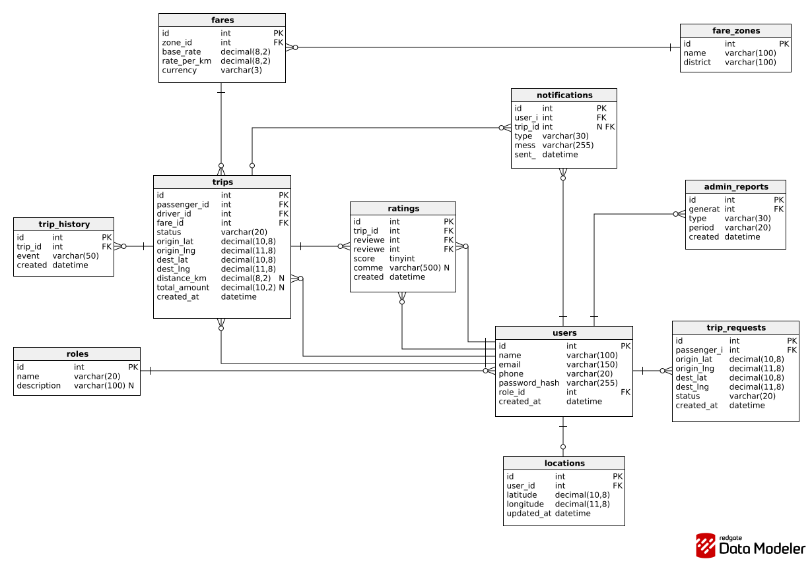

**Descripción por bounded context**

**Identidad y Acceso**. `roles` define los tres tipos de usuario (PASSENGER, DRIVER, ADMIN). `users` almacena los datos de todos los usuarios del sistema y referencia a roles mediante clave foránea.
**Gestión de Viajes**. `trip_requests` registra las solicitudes de viaje antes de que sean aceptadas por un conductor. `trips` almacena los viajes activos y completados, referenciando al pasajero, conductor y tarifa aplicada.
**Geolocalización y Notificaciones**. `locations` mantiene una fila por usuario activo con su última posición conocida (relación uno a uno con `users`). `notifications` registra todas las notificaciones enviadas, vinculadas a un usuario y opcionalmente a un viaje.
**Tarifas y Calificaciones**. `fare_zones` define las zonas geográficas de operación. `fares` almacena la estructura tarifaria por zona (tarifa base + tarifa por kilómetro). `ratings` registra las calificaciones post-viaje con claves foráneas al viaje, al calificador y al calificado.
**Historial y Administración**. `trip_history` registra cada evento del ciclo de vida de un viaje como un log inmutable. `admin_reports` almacena los reportes generados por el equipo operativo.


---

# Capítulo V: Product Implementation, Validation & Deployment

## 5.1. Software Configuration Management

### 5.1.1 Software Development Environment Configuration

<table>
  <thead>
    <tr>
      <th>Actividad</th>
      <th>Herramienta/Guía</th>
      <th>Propósito</th>
      <th>Tipo de acceso/Ruta (links)</th>
    </tr>
  </thead>
  <tbody>
    <tr>
      <td>Gestión de proyecto</td>
      <td>Trello</td>
      <td>Organizar y dar seguimiento a tareas</td>
      <td><a href="https://trello.com" target="_blank">Trello</a></td>
    </tr>
    <tr>
      <td>Gestión de requerimientos</td>
      <td>Gherkin Conventions</td>
      <td>Definir criterios de aceptación claros</td>
      <td><a href="https://cucumber.io/docs/gherkin/" target="_blank">Guía Gherkin</a></td>
    </tr>
    <tr>
      <td>Producto UI/UX</td>
      <td>Figma</td>
      <td>Diseño de interfaces y prototipos</td>
      <td><a href="https://figma.com" target="_blank">Figma</a></td>
    </tr>
    <tr>
      <td>Desarrollo Frontend</td>
      <td>WebStorm</td>
      <td>Desarrollo de la aplicación frontend con Angular</td>
      <td><a href="https://www.jetbrains.com/webstorm/" target="_blank">WebStorm</a></td>
    </tr>
    <tr>
      <td>Landing Page desarrollo</td>
      <td>Visual Studio Code</td>
      <td>Edición y desarrollo de código</td>
      <td><a href="https://code.visualstudio.com/" target="_blank">VS Code</a></td>
    </tr>
    <tr>
      <td>Base de datos</td>
      <td>MySQL</td>
      <td>Gestión y persistencia de datos de la aplicación</td>
      <td><a href="https://www.mysql.com/" target="_blank">MySQL</a></td>
    </tr>
    <tr>
      <td>Control de versiones</td>
      <td>Git</td>
      <td>Gestión de versiones del código</td>
      <td><a href="https://git-scm.com/" target="_blank">Git</a></td>
    </tr>
    <tr>
      <td>Despliegue</td>
      <td>GitHub Pages</td>
      <td>Publicar la aplicación web</td>
      <td><a href="https://pages.github.com/" target="_blank">GitHub Pages</a></td>
    </tr>
    <tr>
      <td>Event Storming</td>
      <td>Miro</td>
      <td>Colaboración y modelado de procesos</td>
      <td><a href="https://miro.com/" target="_blank">Miro</a></td>
    </tr>
    <tr>
      <td>Diagramas</td>
      <td>PlantUML</td>
      <td>Generación de diagramas UML</td>
      <td><a href="https://plantuml.com/" target="_blank">PlantUML</a></td>
    </tr>
  </tbody>
</table>

### 5.1.2 Source Code Management

Para la gestión del código fuente del proyecto, el equipo utiliza la plataforma GitHub como sistema de control de versiones. A continuación, se detallan los repositorios correspondientes a cada componente del sistema:

Landing Page: [https://startup-x-upc.github.io/landing-page/](https://startup-x-upc.github.io/landing-page/)

<!-- Web Services: [Link Web Services](https://github.com/tu-org/backend-services)
Frontend Web Application: [Link Frontend Web](https://github.com/tu-org/frontend-app) -->

En el repositorio de Web Services se incluyen tanto el código fuente como las pruebas unitarias y de aprobación y aceptación.

#### GitFlow Workflow

Nuestro equipo adopta el modelo de ramificación GitFlow, propuesto por Vincent Driessen, para organizar nuestro desarrollo del proyecto.

Las ramas principales son:

**main**: Contiene el código estable listo para producción y establecer como la version final de nuestro informe .
**develop**: Rama principal de desarrollo donde se integran las funcionalidades antes de su liberación.

Ramas de soporte:

- **feature/**: Para el desarrollo de nuevas funcionalidades.
  Convención: `feature/<nombre-descriptivo>`
  Ejemplo: `feature/Chapter5-SourceCode`
- **release/**: Para preparar nuevas versiones del sistema.
  Convención: `release/<versión>`
  Ejemplo: `release/1.0.0`
- **hotfix/**: Para correcciones urgentes en producción.
  Convención: `hotfix/<descripción>`
  Ejemplo: `hotfix/fix-login-error`

Flujo de trabajo:

- Las features se crean desde `develop` y se integran nuevamente en esta rama mediante Pull Requests.
- Las ramas `release` se crean desde `develop` y luego se fusionan en `main` y `develop`.
- Los `hotfix` se crean desde `main` y se integran tanto en `main` como en `develop`.

#### Versionado Semántico

El proyecto utiliza el estándar Semantic Versioning 2.0.0 para el control de versiones:

- **MAJOR**: Cambios incompatibles
- **MINOR**: Nuevas funcionalidades compatibles
- **PATCH**: Correcciones menores

Formato: vX.Y.Z
Ejemplo: v1.2.3

#### Conventional Commits

Se emplea el estándar Conventional Commits para los mensajes de commit, con el fin de mantener un historial claro y facilitar la integración continua.

**Formato**:

`[type]: [description]`

Tipos más utilizados:

- **feat**: Nueva funcionalidad
- **fix**: Corrección de errores
- **chore**: Tareas de mantenimiento
- **docs**: Cambios en documentación

Ejemplos:

- feat: add user authentication
- fix: resolve API timeout issue
- chore: update dependencies

### 5.1.3 Source Code Style Guide & Conventions

#### Landing Page Style Guide & Conventions

##### Project Structure

```
/public        (images, favicon, manifest.json)
/src
    /css         (styles.css + partials/modules)
    /js            (main.js + modules)
    /components    (HTML fragments if needed)
    /index.html
```

##### General Conventions

- All identifiers (variables, functions, classes, files) must be written in **English**.
- File naming uses **kebab-case** (e.g., `user-profile.js`).
- Conventions are based on:
  - Google HTML/CSS Style Guide
  - Google JavaScript Style Guide
- These conventions ensure maintainability, scalability, and team consistency.

###### HTML

- **Semantics first**: use `header`, `nav`, `main`, `section`, `article`, `footer`.
- **Accessibility (a11y)**:
  - Add `alt` text to images.
  - Use `aria-*` attributes for dynamic components.
  - Maintain logical tab order in the DOM.
  - Always show a visible focus state.
- **SEO**:
  - Include `<title>` and `<meta name="description">`.
  - Add Open Graph / Twitter meta tags.
  - Set `lang="en"` (or appropriate language) on `<html>`.
- **Performance**:
  - Use `loading="lazy"` on ``.
  - Minimize inline CSS/JS.
- **Conventions**:
  - Use **kebab-case** for class names.
  - Use `id` only for JS hooks or anchors, not for styling.

###### CSS

- **Naming**: Follow **BEM methodology** → `.block__element--modifier`.
- **Variables**: Define tokens in `:root`:
  ```css
  :root {
    --color-primary: #0ea5e9;
    --color-secondary: #64748b;
    --font-base: 1rem;
  }
  ```
- **Architecture**:
  - Separate utilities (spacing, grid) and components (buttons, cards).
- **Responsive**:
  - Mobile-first approach with `min-width` breakpoints.
  - Common breakpoints: 480px, 768px, 1024px, 1280px.
- **Typography & spacing**:
  - Use `rem` for scalability.
  - Avoid hard-coded magic numbers.
- **States**:
  - Define consistent `:hover`, `:focus-visible`, and `:disabled`.
- **Property order**:
  - Group logically: Layout → Box Model → Typography → Visual → Misc.

###### JavaScript

- **Structure**:
  - Modular design; keep one `main.js` entry point.
  - Use ES Modules (`import/export`) when possible.
  - Split reusable logic into separate modules.
- **Conventions**:
  - Use **camelCase** for variables/functions.
  - Use **PascalCase** for classes/constructors.
  - Constants in `UPPER_CASE`.
- **Best Practices**:
  - Prefer `const` and `let` over `var`.
  - Add comments for non-trivial logic.
  - Keep DOM selectors cached.
  - Use `addEventListener` (avoid inline `onclick`).
  - Wrap code in IIFEs or modules to avoid global leaks.
  - Handle errors using try/catch when necessary.

### 5.1.4 Software Deployment Configuration

#### 1. Landing Page – HTML, CSS y JavaScript

**Repositorio de Código Fuente**
La Landing Page se implementa empleando HTML, CSS y JavaScript. El proyecto se almacena en GitHub, colocando el archivo `index.html` en la raíz del repositorio (/), lo cual permite su reconocimiento automático por GitHub Pages.

**Activación de GitHub Pages**

1. Acceder al repositorio en GitHub.
2. Ir a Settings.
3. Seleccionar Pages.
4. Configurar:
   - Rama: main
   - Carpeta: / (root)
5. Guardar cambios.

**Publicación**
GitHub genera automáticamente una URL pública:

`https://startup-x-upc.github.io/landing-page/`

**Actualizaciones**  
Cada commit en la rama `main` se despliega automáticamente.

---

#### 2. Frontend Web Application – Angular

**Production Build**
El frontend se construye usando Angular CLI:

`ng build --configuration production`

Esto genera archivos optimizados en la carpeta `/dist`.

**Despliegue**

- Se utiliza una plataforma como **Netlify** , **Vercel** o **Firebase**.
- Se sube la carpeta /dist.
- Se configura soporte para SPA (Single Page Application).

**Publicación:**
Mediante Firebase se hizo público el despliegue:
`https://chapaturuta-e7d2e.web.app/login`

---

#### 3. Backend – REST API (Spring Boot)

**Build Process**  
El backend se empaqueta en un archivo .jar:

`./mvnw clean package`

**Deployment Process**

- Se utiliza una plataforma cloud (Render, Railway, etc.).
- Se ejecuta con:

`java -jar app.jar`

- Se configuran variables de entorno (puerto, base de datos, API keys).

**Publicación:**
Mediante Railway se hizo público el despliegue:
`https://startup-x-upc.github.io/landing-page/`

---

#### 4. Consideraciones Generales

- Se utilizan variables de entorno para datos sensibles.
- Cada componente se despliega de forma independiente.
- El sistema permite actualizaciones continuas mediante commits.

## 5.2. Landing Page, Services & Applications Implementation

### 5.2.1. Sprint 1

#### 5.2.1.1. Sprint Planning 1

<table>
  <tbody>
    <tr>
      <td><b>Sprint #</b></td>
      <td>Sprint 1</td>
    </tr>
    <tr>
      <td colspan="2"><b>Sprint Planning Background</b></td>
    </tr>
    <tr>
      <td><b>Date</b></td>
      <td>2026-06-04</td>
    </tr>
    <tr>
      <td><b>Time</b></td>
      <td>18:50 PM (GMT-5)</td>
    </tr>
    <tr>
      <td><b>Location</b></td>
      <td>Modalidad remota mediante la plataforma Discord</td>
    </tr>
    <tr>
      <td><b>Prepared By</b></td>
      <td>Aguirre Ramos, Eduardo Manuel</td>
    </tr>
    <tr>
      <td><b>Attendees (to planning meeting)</b></td>
      <td>Castillo Vidal, Jesus Ivan / Torres Sanchez, Dalila Victoria / Aguirre Ramos, Eduardo Manuel / Pillaca Gonzales, Andy Saúl / Delgado Perez, James Caleb / Aiquipa Poma, Sebastian Andres</td>
    </tr>
    <tr>
      <td><b>Sprint 0 Review Summary</b></td>
      <td>Dado que este es el sprint inicial, no se presenta un resumen del sprint anterior.</td>
    </tr>
    <tr>
      <td><b>Sprint 0 Retrospective Summary</b></td>
      <td>Dado que este es el sprint inicial, no se presenta una retroalimentación del sprint anterior.</td>
    </tr>
    <tr>
      <td colspan="2"><b>Sprint Goal & User Stories</b></td>
    </tr>
    <tr>
      <td><b>Sprint 1 Goal</b></td>
      <td><b>Nuestro propósito es</b> diseñar y entregar una primera versión de la landing page para nuestra plataforma de gestión de rutas, basada en entrevistas con administradores y transportistas de una empresa distribuidora. <b>Creemos que esto aportará</b> claridad y valor inicial a los usuarios potenciales, comunicando el propósito del producto y la visión del equipo. <b>Esto se confirmará cuando</b> los visitantes puedan comprender fácilmente los beneficios de la plataforma y muestren interés en conocer más o contactarnos a través de la landing page.</td>
    </tr>
    <tr>
      <td><b>Sprint 1 Velocity</b></td>
      <td>15 puntos</td>
    </tr>
    <tr>
      <td><b>Sum of Story Points</b></td>
      <td>15 puntos</td>
    </tr>
  </tbody>
</table>

#### 5.2.1.2. Aspect Leaders and Collaborators

En esta sección se presenta la **Leadership-and-Collaboration Matrix (LACX)** correspondiente al Sprint 1. Cada aspecto se relaciona con tareas clave del sprint, asignando un **líder (L)** responsable principal y **colaboradores (C)** que apoyan en su ejecución.

<table>
  <tbody>
    <tr>
      <th>Team Member (Last Name, First Name)</th>
      <th>GitHub Username</th>
      <th>Mockup (L/C)</th>
      <th>Entrevistas (L/C)</th>
      <th>Wireframes (L/C)</th>
      <th>Landing Page (L/C)</th>
    </tr>
    <tr>
      <td>Castillo Vidal, Jesus Ivan</td>
      <td>Jcdev04</td>
      <td>L</td>
      <td>C</td>
      <td>C</td>
      <td>C</td>
    </tr>
    <tr>
      <td>Torres Sanchez, Dalila Victoria</td>
      <td>DalilaTorres</td>
      <td>C</td>
      <td>L</td>
      <td>C</td>
      <td>C</td>
    </tr>
    <tr>
      <td>Aguirre Ramos, Eduardo Manuel</td>
      <td>TheEngineEdu</td>
      <td>C</td>
      <td>C</td>
      <td>L</td>
      <td>C</td>
    </tr>
    <tr>
      <td>Pillaca Gonzales, Andy Saúl</td>
      <td>apillacag</td>
      <td>C</td>
      <td>C</td>
      <td>C</td>
      <td>L</td>
    </tr>
    <tr>
      <td>Aiquipa Poma, Sebastian Andres</td>
      <td>S-aiquipa</td>
      <td>C</td>
      <td>L</td>
      <td>C</td>
      <td>C</td>
    </tr>
  </tbody>
</table>

#### 5.2.1.3. Sprint Backlog 4

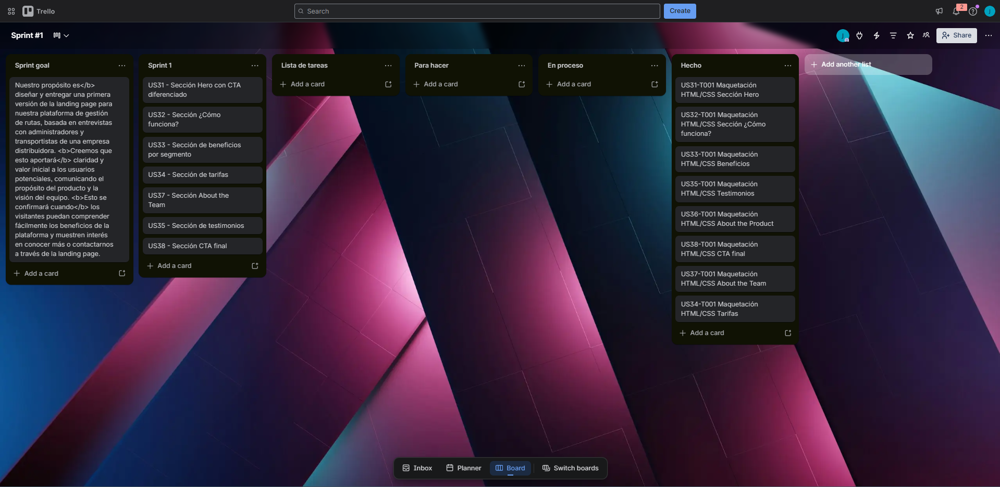

Sprint 1 Trello: [https://trello.com/b/uGr6OQCE/sprint-1](https://trello.com/b/uGr6OQCE/sprint-1)

<table>
  <thead>
    <tr>
      <th>Sprint #</th>
      <th colspan="7">Sprint 1</th>
    </tr>
    <tr>
      <th colspan="2">User Story</th>
      <th colspan="6">Work-Item / Task</th>
    </tr>
    <tr>
      <th>Id</th>
      <th>Title</th>
      <th>Id</th>
      <th>Title</th>
      <th>Description</th>
      <th>Estimation (Hours)</th>
      <th>Assigned To</th>
      <th>Status (To-do / In-Process / To-Review / Done)</th>
    </tr>
  </thead>
  <tbody>
    <tr>
      <td>US-31</td>
      <td>Sección Hero con CTA diferenciado</td>
      <td>US31-T001</td>
      <td>Maquetación HTML/CSS Sección Hero</td>
      <td>Implementar la sección Hero utilizando HTML y CSS siguiendo fielmente los mockups de Figma.</td>
      <td>0.7</td>
      <td>Castillo Vidal, Jesus Ivan</td>
      <td>Done</td>
    </tr>
    <tr>
      <td>US-32</td>
      <td>Sección ¿Cómo funciona?</td>
      <td>US32-T001</td>
      <td>Maquetación HTML/CSS Sección ¿Cómo funciona?</td>
      <td>Implementar el flujo del servicio en HTML y CSS basado en los diseños de Figma.</td>
      <td>0.4</td>
      <td>Torres Sanchez, Dalila Victoria</td>
      <td>Done</td>
    </tr>
    <tr>
      <td>US-33</td>
      <td>Sección de beneficios por segmento</td>
      <td>US33-T001</td>
      <td>Maquetación HTML/CSS Beneficios</td>
      <td>Maquetar la sección de beneficios por perfil utilizando HTML y CSS.</td>
      <td>0.9</td>
      <td>Aguirre Ramos, Eduardo Manuel</td>
      <td>Done</td>
    </tr>
    <tr>
      <td>US-34</td>
      <td>Sección de tarifas</td>
      <td>US34-T001</td>
      <td>Maquetación HTML/CSS Tarifas</td>
      <td>Desarrollar la sección informativa de tarifas en HTML y CSS.</td>
      <td>0.3</td>
      <td>Pillaca Gonzales, Andy Saúl</td>
      <td>Done</td>
    </tr>
    <tr>
      <td>US-36</td>
      <td>Sección About the Product</td>
      <td>US36-T001</td>
      <td>Maquetación HTML/CSS About the Product</td>
      <td>Integrar video publicitario y estructurar la sección en HTML/CSS.</td>
      <td>0.5</td>
      <td>Aiquipa Poma, Sebastian Andres</td>
      <td>To-do</td>
    </tr>
    <tr>
      <td>US-37</td>
      <td>Sección About the Team</td>
      <td>US37-T001</td>
      <td>Maquetación HTML/CSS About the Team</td>
      <td>Maquetar la presentación de los miembros del equipo en HTML y CSS según Figma.</td>
      <td>0.5</td>
      <td>Castillo Vidal, Jesus Ivan</td>
      <td>Done</td>
    </tr>
    <tr>
      <td>US-35</td>
      <td>Sección de testimonios</td>
      <td>US35-T001</td>
      <td>Maquetación HTML/CSS Testimonios</td>
      <td>Estructurar la sección de opiniones de usuarios en HTML y CSS.</td>
      <td>0.5</td>
      <td>Torres Sanchez, Dalila Victoria</td>
      <td>Done</td>
    </tr>
    <tr>
      <td>US-38</td>
      <td>Sección CTA final</td>
      <td>US38-T001</td>
      <td>Maquetación HTML/CSS CTA final</td>
      <td>Crear el llamado a la acción al final de la landing page en HTML y CSS.</td>
      <td>0.5</td>
      <td>Aguirre Ramos, Eduardo Manuel</td>
      <td>Done</td>
    </tr>
  </tbody>
</table>

#### 5.2.1.4. Development Evidence for Sprint Review

A continuación, se presenta la tabla de evidencia de desarrollo correspondiente al Sprint 1. Este registro detalla el historial de commits en el repositorio de la Landing Page (`Startup-x-upc/landing-page`). A través de estas contribuciones, se observa el progreso secuencial del desarrollo: desde la configuración inicial y estructuración base en HTML/CSS, pasando por la implementación modular de cada sección (Hero, Beneficios, Testimonios, Sobre el Equipo, Tarifas, etc.), hasta la consolidación de estos cambios en la rama `main`.

| Repository                 | Branch | Commit Id | Commit Message                                                                       | Commit Message Body                                                                                                     | Commited on (Date) |
| -------------------------- | ------ | --------- | ------------------------------------------------------------------------------------ | ----------------------------------------------------------------------------------------------------------------------- | ------------------ |
| Startup-x-upc/landing-page | main   | 6c79239   | Merge pull request #4 from Startup-x-upc/develop                                     | Se integraron los cambios de la rama: Merge pull request #4 from Startup-x-upc/develop                                  | 23/04/2026         |
| Startup-x-upc/landing-page | main   | cbf4003   | refactor: Making adjustment to some code and bad typing                              | Se refactorizó el código: refactor: Making adjustment to some code and bad typing                                       | 23/04/2026         |
| Startup-x-upc/landing-page | main   | cdb9910   | Merge origin/feature/pricing-LandingPage                                             | Se integraron los cambios de la rama: Merge origin/feature/pricing-LandingPage                                          | 23/04/2026         |
| Startup-x-upc/landing-page | main   | c434cb0   | feat:merge dooter                                                                    | Se implementó nueva funcionalidad: feat:merge dooter                                                                    | 23/04/2026         |
| Startup-x-upc/landing-page | main   | 8f4a71e   | add testimonials section css                                                         | Se implementó nueva funcionalidad: add testimonials section css                                                         | 23/04/2026         |
| Startup-x-upc/landing-page | main   | 27adc96   | add third testimonial card                                                           | Se implementó nueva funcionalidad: add third testimonial card                                                           | 23/04/2026         |
| Startup-x-upc/landing-page | main   | a89967b   | add second testimonial card                                                          | Se implementó nueva funcionalidad: add second testimonial card                                                          | 23/04/2026         |
| Startup-x-upc/landing-page | main   | 9f2ec09   | add first testimonial card                                                           | Se implementó nueva funcionalidad: add first testimonial card                                                           | 23/04/2026         |
| Startup-x-upc/landing-page | main   | ae13a3a   | add testimonials section structure                                                   | Se implementó nueva funcionalidad: add testimonials section structure                                                   | 23/04/2026         |
| Startup-x-upc/landing-page | main   | 4e70565   | add header css styles                                                                | Se implementó nueva funcionalidad: add header css styles                                                                | 23/04/2026         |
| Startup-x-upc/landing-page | main   | 83c053a   | add cta buttons and register link in nav                                             | Se implementó nueva funcionalidad: add cta buttons and register link in nav                                             | 23/04/2026         |
| Startup-x-upc/landing-page | main   | f5f59c4   | add navigation links list                                                            | Se implementó nueva funcionalidad: add navigation links list                                                            | 23/04/2026         |
| Startup-x-upc/landing-page | main   | cfce958   | add navigation skeleton with mobile header                                           | Se implementó nueva funcionalidad: add navigation skeleton with mobile header                                           | 23/04/2026         |
| Startup-x-upc/landing-page | main   | 6369b06   | add hamburger menu toggle button                                                     | Se implementó nueva funcionalidad: add hamburger menu toggle button                                                     | 23/04/2026         |
| Startup-x-upc/landing-page | main   | 10294ce   | add header container and logo                                                        | Se implementó nueva funcionalidad: add header container and logo                                                        | 23/04/2026         |
| Startup-x-upc/landing-page | main   | 88da902   | feat:Added footer to Index and Style                                                 | Se implementó nueva funcionalidad: feat:Added footer to Index and Style                                                 | 23/04/2026         |
| Startup-x-upc/landing-page | main   | f6a6bb3   | Merge pull request #3 from Startup-x-upc/feature/about-team-section                  | Se integraron los cambios de la rama: Merge pull request #3 from Startup-x-upc/feature/about-team-section               | 23/04/2026         |
| Startup-x-upc/landing-page | main   | df6d57b   | feat: add images about the team                                                      | Se implementó nueva funcionalidad: feat: add images about the team                                                      | 23/04/2026         |
| Startup-x-upc/landing-page | main   | 7486a72   | feat: About team section CSS added                                                   | Se implementó nueva funcionalidad: feat: About team section CSS added                                                   | 23/04/2026         |
| Startup-x-upc/landing-page | main   | 61a97fc   | feat: About team section HTML added                                                  | Se implementó nueva funcionalidad: feat: About team section HTML added                                                  | 23/04/2026         |
| Startup-x-upc/landing-page | main   | 198216d   | Merge pull request #2 from Startup-x-upc/feature/how-it-works-section                | Se integraron los cambios de la rama: Merge pull request #2 from Startup-x-upc/feature/how-it-works-section             | 23/04/2026         |
| Startup-x-upc/landing-page | main   | 67a4904   | feat: How it works section CSS added                                                 | Se implementó nueva funcionalidad: feat: How it works section CSS added                                                 | 23/04/2026         |
| Startup-x-upc/landing-page | main   | 17f363b   | feat: How it works section HTML added                                                | Se implementó nueva funcionalidad: feat: How it works section HTML added                                                | 23/04/2026         |
| Startup-x-upc/landing-page | main   | 4e2cd95   | feat(landing): add benefits section with passenger and driver cards                  | Se implementó nueva funcionalidad: feat(landing): add benefits section with passenger and driver cards                  | 23/04/2026         |
| Startup-x-upc/landing-page | main   | feeb217   | feat(landing): add benefits section with passenger and driver cards                  | Se implementó nueva funcionalidad: feat(landing): add benefits section with passenger and driver cards                  | 23/04/2026         |
| Startup-x-upc/landing-page | main   | e7f4725   | feat:Added Pricing to index and style                                                | Se implementó nueva funcionalidad: feat:Added Pricing to index and style                                                | 23/04/2026         |
| Startup-x-upc/landing-page | main   | a877a62   | feat: General style guidelines                                                       | Se implementó nueva funcionalidad: feat: General style guidelines                                                       | 23/04/2026         |
| Startup-x-upc/landing-page | main   | 28faa73   | feat: Responsive General style added                                                 | Se implementó nueva funcionalidad: feat: Responsive General style added                                                 | 23/04/2026         |
| Startup-x-upc/landing-page | main   | 3c63786   | feat: CTA section CSS added                                                          | Se implementó nueva funcionalidad: feat: CTA section CSS added                                                          | 23/04/2026         |
| Startup-x-upc/landing-page | main   | ce6f48e   | feat: CTA section HTML added                                                         | Se implementó nueva funcionalidad: feat: CTA section HTML added                                                         | 23/04/2026         |
| Startup-x-upc/landing-page | main   | bd1c6b7   | feat: Hero section CSS added                                                         | Se implementó nueva funcionalidad: feat: Hero section CSS added                                                         | 23/04/2026         |
| Startup-x-upc/landing-page | main   | fea63a5   | feat: Hero section HTML added                                                        | Se implementó nueva funcionalidad: feat: Hero section HTML added                                                        | 23/04/2026         |
| Startup-x-upc/landing-page | main   | 7f4d8ae   | feat: Base html and css structure, planificaton for the whole landing page structure | Se implementó nueva funcionalidad: feat: Base html and css structure, planificaton for the whole landing page structure | 23/04/2026         |
| Startup-x-upc/landing-page | main   | ef29364   | chore: Initial setup                                                                 | Se realizaron cambios relacionados con: chore: Initial setup                                                            | 23/04/2026         |

El análisis de este historial refleja un flujo de trabajo estructurado y colaborativo. Se destaca la adopción de buenas prácticas, como el uso de ramas para nuevas características (features), la integración mediante Pull Requests y el uso de convenciones en los mensajes de commit (feat, chore, refactor). Esto ha permitido una integración continua eficiente, garantizando que el entregable de la Landing Page cumpla con los objetivos y el alcance definidos en el Sprint Planning 1.

#### 5.2.1.5. Execution Evidence for Sprint Review

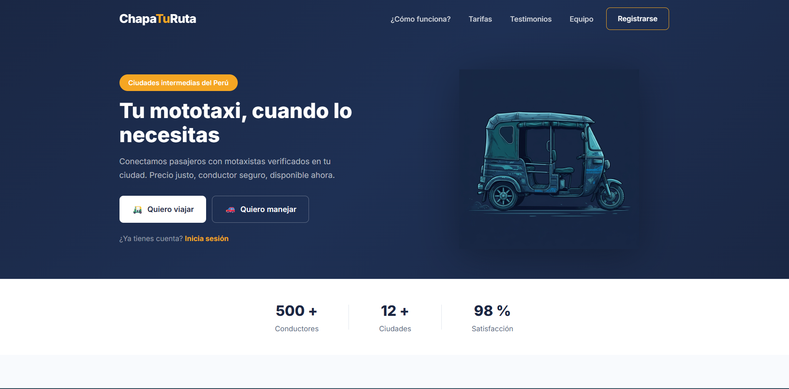
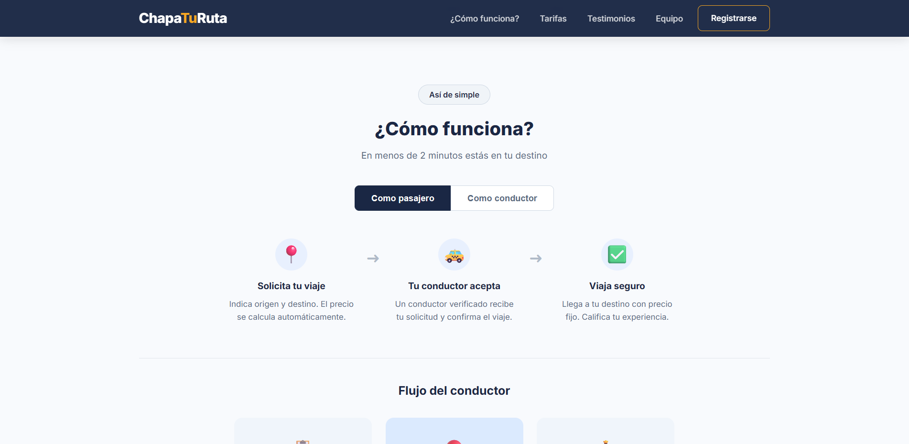
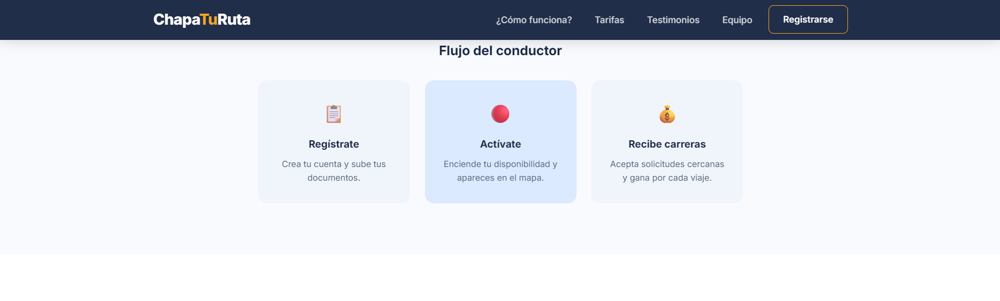
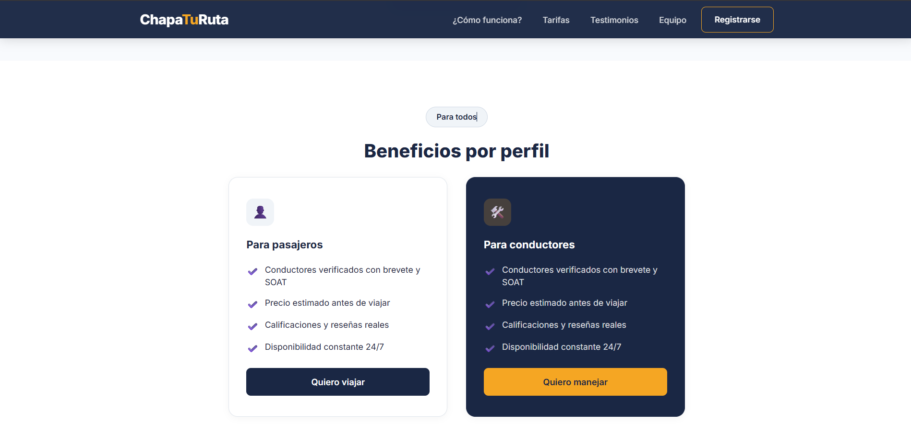
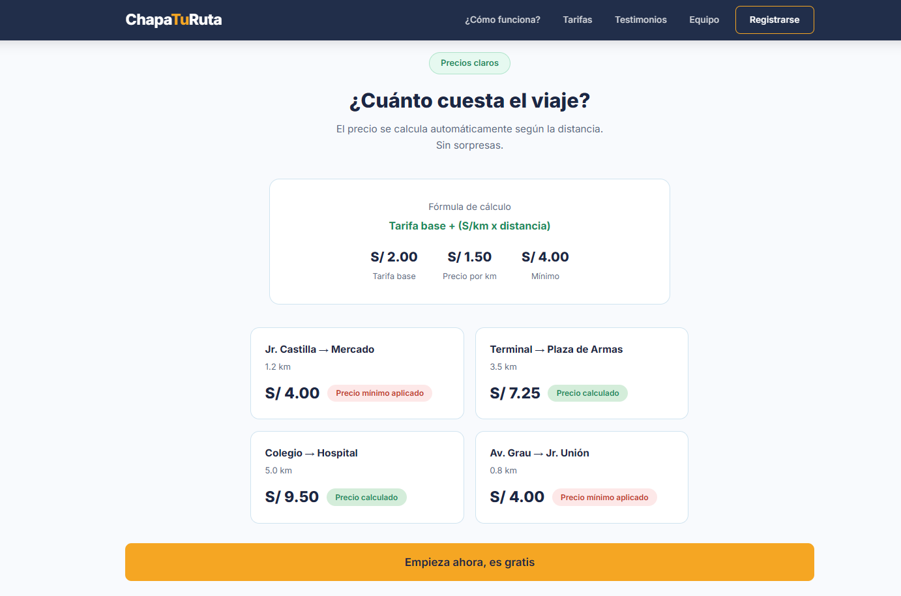
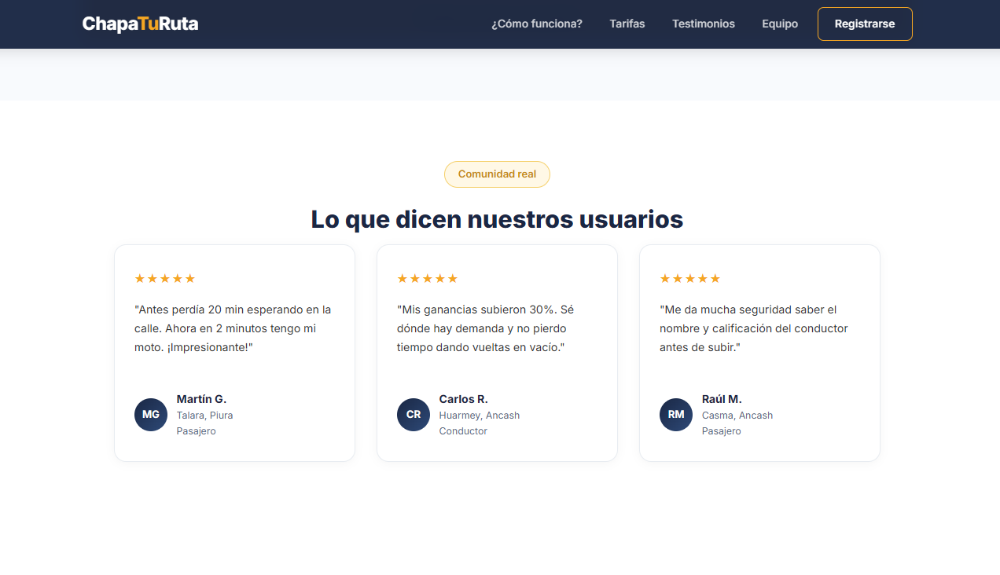
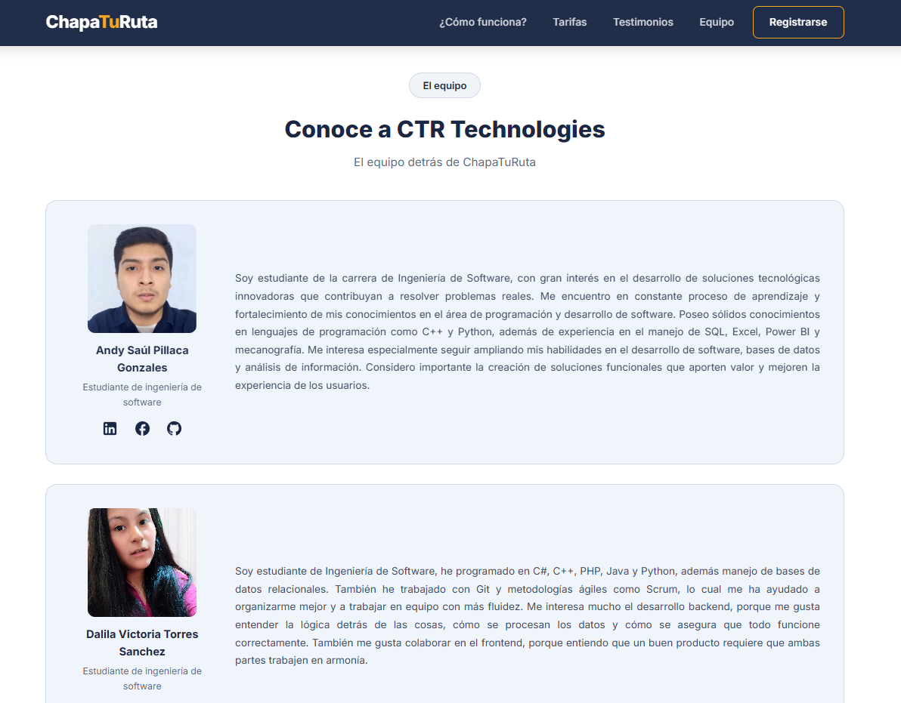
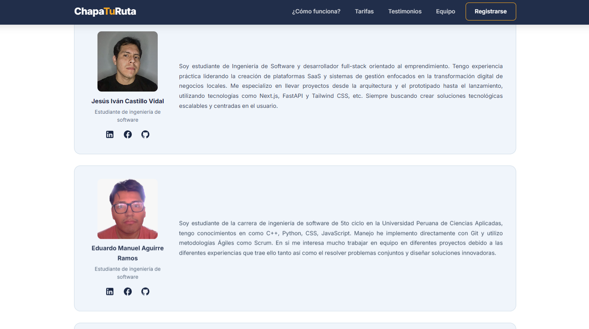
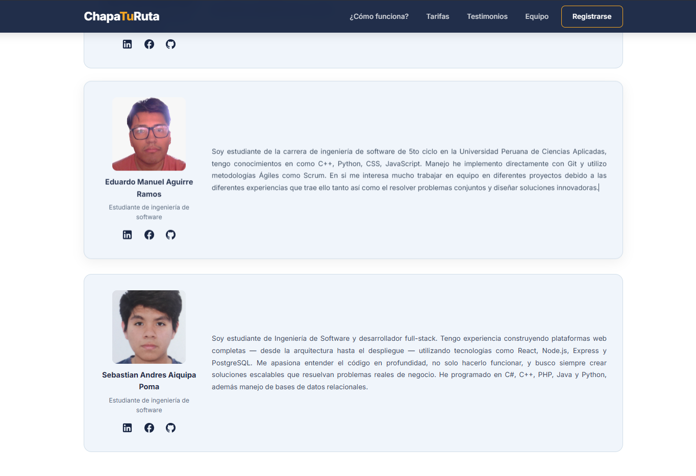


#### 5.2.1.6. Services Documentation Evidence for Sprint Review

Durante este sprint se completó el diseño e implementación de la Landing Page del sistema, el cual forma parte del acceso inicial al sistema. Aunque no se implementaron endpoints tradicionales de tipo REST en este sprint, se documenta a continuación la URL del recurso publicado, junto con evidencia de despliegue, interacción y commits relacionados.

**Descripción del Logro:**

- Implementación de la Landing Page estática.
- Deployment de la Landing Page.

**Recursos del Sprint:**

| Recurso      | Acción implementada   | Método HTTP | URL / Endpoint                                                                        | Link de repositorio                                                         |
| ------------ | --------------------- | ----------- | ------------------------------------------------------------------------------------- | --------------------------------------------------------------------------- |
| Landing Page | Visualización inicial | GET         | [startup-x-upc.github.io/landing-page](https://startup-x-upc.github.io/landing-page/) | [Startup-x-upc/landing-page](https://github.com/Startup-x-upc/landing-page) |

#### 5.2.1.7. Software Deployment Evidence for Sprint Review

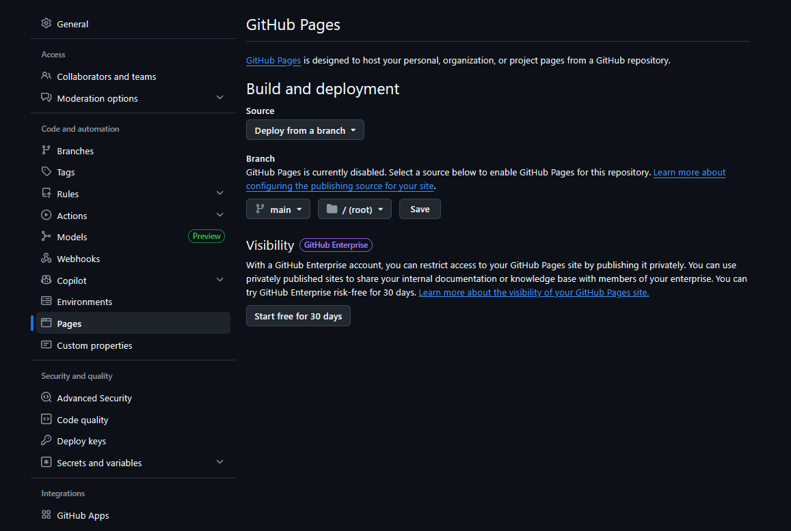
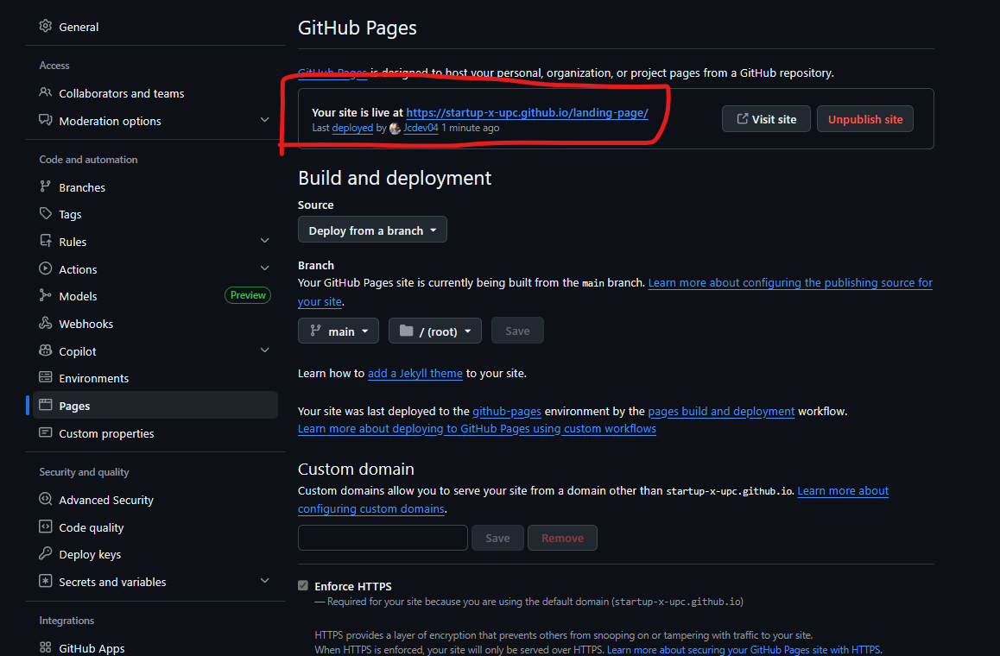

#### 5.2.1.8. Team Collaboration Insights during Sprint

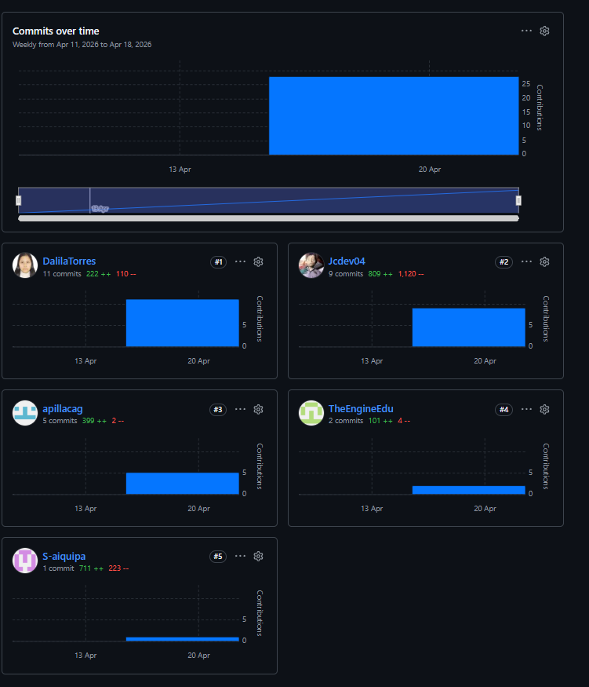

### 5.2.2. Sprint 2

#### 5.2.2.1. Sprint Planning 2

<table>
  <tbody>
    <tr>
      <td><b>Sprint #</b></td>
      <td>Sprint 2</td>
    </tr>
    <tr>
      <td colspan="2"><b>Sprint Planning Background</b></td>
    </tr>
    <tr>
      <td><b>Date</b></td>
      <td>2026-05-11</td>
    </tr>
    <tr>
      <td><b>Time</b></td>
      <td>18:50 PM (GMT-5)</td>
    </tr>
    <tr>
      <td><b>Location</b></td>
      <td>Modalidad remota mediante la plataforma Discord</td>
    </tr>
    <tr>
      <td><b>Prepared By</b></td>
      <td>Aguirre Ramos, Eduardo Manuel</td>
    </tr>
    <tr>
      <td><b>Attendees (to planning meeting)</b></td>
      <td>Castillo Vidal, Jesus Ivan / Torres Sanchez, Dalila Victoria / Aguirre Ramos, Eduardo Manuel / Pillaca Gonzales, Andy Saúl / Delgado Perez, James Caleb / Aiquipa Poma, Sebastian Andres</td>
    </tr>
    <tr>
      <td><b>Sprint 1 Review Summary</b></td>
      <td>Durante el Sprint 1 se logró implementar casi en su totalidad la Landing Page del sistema ChapaTuRuta, desarrollando secciones principales como el header, hero section, features además de las reviews, el pricing y por último el footer, así como la integración inicial de estilos globales y tipografía mencionadas en el reporte.Quedó como mejora la adición del idioma ingles para la accesibilidad de las persona. El equipo cumplió con sus tareas establecidos, respetando el diseño de mockups y la guía de estilos. Se pudo identificaron oportunidades para mejorar en el siguiente sprint velocidad de desarrollo y la gestión de tiempos.</td>
    </tr>
    <tr>
      <td><b>Sprint 1 Retrospective Summary</b></td>
      <td>Durante el Sprint 1, el equipo logró avanzar de forma efectiva en el desarrollo de la landing page. Cada integrante cumplió con las secciones asignadas, lo que permitió avanzar según lo planificado. Como mejora para el siguiente sprint, se debería implementar un control de las task que hacemos normalmente con deadlines, para asi controlar el manejo de la puntualidad asi como la coordinación al momento de expresar dificultades asignadas.</td>
    </tr>
    <tr>
      <td colspan="2"><b>Sprint Goal & User Stories</b></td>
    </tr>
    <tr>
      <td><b>Sprint 2 Goal</b></td>
      <td><b>Nuestro propósito es</b> diseñar y entregar una primera versión del frontend pages para nuestra plataforma de gestión de rutas, implementando datos generados por nosotros haciendo que funcione comodamente. <b>Creemos que esto aportará</b> una mejor comprensión del alcance y la funcionalidad de lo que nuestro software puede llegar a ser . <b>Esto se confirmará cuando</b> los visitantes puedan comprender como son las funcionalidades de nuestra plataforma y coomo se manejara sus servicios a traves de nuestro frontend page.</td>
    </tr>
    <tr>
      <td><b>Sprint 2 Velocity</b></td>
      <td>34 puntos</td>
    </tr>
    <tr>
      <td><b>Sum of Story Points</b></td>
      <td>34 puntos</td>
    </tr>
  </tbody>
</table>

#### 5.2.2.2. Aspect Leaders and Collaborators

En esta sección se presenta la **Leadership-and-Collaboration Matrix (LACX)** correspondiente al Sprint 2. Cada aspecto se relaciona con tareas clave del sprint, asignando un **líder (L)** responsable principal y **colaboradores (C)** que apoyan en su ejecución.

<table>
  <tbody>
    <tr>
      <th>Team Member (Last Name, First Name)</th>
      <th>GitHub Username</th>
      <th> Real-Time & Geolocation Aspect (L/C)</th>
      <th> Transaction & Payment Aspect (L/C)</th>
      <th> Service Status & State Aspect (L/C)</th>
      <th> Route Logic & Map Aspect (L/C)</th>
      <th> User Experience & Flow Aspect (L/C)</th>
    </tr>
    <tr>
      <td>Castillo Vidal, Jesus Ivan</td>
      <td>Jcdev04</td>
      <td>L</td>
      <td>C</td>
      <td>C</td>
      <td>C</td>
      <td>L</td>
    </tr>
    <tr>
      <td>Torres Sanchez, Dalila Victoria</td>
      <td>DalilaTorres</td>
      <td>C</td>
      <td>C</td>
      <td>C</td>
      <td>C</td>
      <td>L</td>
    </tr>
    <tr>
      <td>Aguirre Ramos, Eduardo Manuel</td>
      <td>TheEngineEdu</td>
      <td>C</td>
      <td>C</td>
      <td>L</td>
      <td>C</td>
      <td>C</td>
    </tr>
    <tr>
      <td>Pillaca Gonzales, Andy Saúl</td>
      <td>apillacag</td>
      <td>C</td>
      <td>C</td>
      <td>C</td>
      <td>L</td>
      <td>C</td>
    </tr>
    <tr>
      <td>Aiquipa Poma, Sebastian Andres</td>
      <td>S-aiquipa</td>
      <td>C</td>
      <td>L</td>
      <td>C</td>
      <td>C</td>
      <td>L</td>
    </tr>
  </tbody>
</table>

#### 5.2.2.3. Sprint Backlog 2

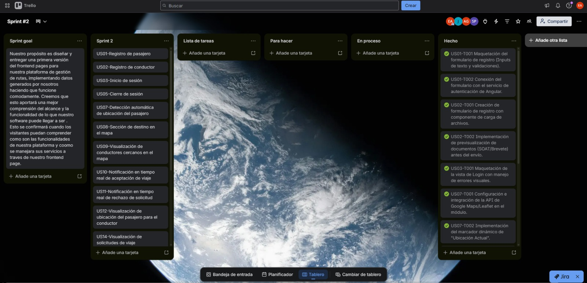

Sprint 2 Trello:[https://trello.com/invite/b/6a0279a4004abd9ca6e2f408/ATTI27127fd4bb859b71b8af6f3fe99f12fe562430EC/sprint-2](https://trello.com/invite/b/6a0279a4004abd9ca6e2f408/ATTI27127fd4bb859b71b8af6f3fe99f12fe562430EC/sprint-2)


<table>
  <thead>
    <tr>
      <th>Sprint #</th>
      <th colspan="7">Sprint 2</th>
    </tr>
    <tr>
      <th colspan="2">User Story</th>
      <th colspan="6">Work-Item / Task</th>
    </tr>
    <tr>
      <th>Id</th>
      <th>Title</th>
      <th>Id</th>
      <th>Title</th>
      <th>Description</th>
      <th>Estimation (Hours)</th>
      <th>Assigned To</th>
      <th>Status (To-do / In-Process / To-Review / Done)</th>
    </tr>
  </thead>
  <tbody>
    <!-- US-03 -->
    <tr>
      <td rowspan="8">US-01</td>
      <td rowspan="8">Registro de pasajero</td>
      <td>TASK-US01-01</td>
      <td>Crear colección users en db.json</td>
      <td>Crear/validar colección `users` en `db.json` con cuentas seed por rol.</td>
      <td>0.5</td>
      <td>Castillo Vidal, Jesus Ivan</td>
      <td>Done</td>
    </tr>
    <tr>
      <td>TASK-US03-02</td>
      <td>Crear colección profiles en db.json</td>
      <td>Crear/validar colección `profiles` en `db.json` solo para lectura básica del usuario autenticado si la UI lo necesita.</td>
      <td>0.4</td>
      <td>Aguirre Ramos, Eduardo Manuel</td>
      <td>Done</td>
    </tr>
    <tr>
      <td>TASK-US03-03</td>
      <td>Implementar IamApiService para Login</td>
      <td>Implementar o validar `IamApiService` para `GET /users?email={email}&amp;password={password}`.</td>
      <td>0.6</td>
      <td>Castillo Vidal, Jesus Ivan</td>
      <td>Done</td>
    </tr>
    <tr>
      <td>TASK-US03-04</td>
      <td>Implementar IamApiService para Perfil</td>
      <td>Implementar o validar `IamApiService` para `GET /profiles?accountId={accountId}` solo para datos mínimos de sesión.</td>
      <td>0.5</td>
      <td>Pillaca Gonzales, Andy Saúl</td>
      <td>Done</td>
    </tr>
    <tr>
      <td>TASK-US03-05</td>
      <td>Ajustar iam.store.ts</td>
      <td>Implementar o ajustar `iam.store.ts` para autenticar usuario, guardar sesión mock y exponer rol actual.</td>
      <td>0.8</td>
      <td>Castillo Vidal, Jesus Ivan</td>
      <td>Done</td>
    </tr>
    <tr>
      <td>TASK-US03-06</td>
      <td>Configurar redirección post-login</td>
      <td>Ajustar redirección del pasajero a la nueva home transaccional (`/passenger/request-ride`).</td>
      <td>0.4</td>
      <td>Aiquipa Poma, Sebastian Andres</td>
      <td>Done</td>
    </tr>
    <tr>
      <td>TASK-US03-07</td>
      <td>Configurar mensajes de error en login</td>
      <td>Ajustar mensaje de error genérico para credenciales inválidas.</td>
      <td>0.3</td>
      <td>Castillo Vidal, Jesus Ivan</td>
      <td>Done</td>
    </tr>
    <tr>
      <td>TASK-US03-08</td>
      <td>Pruebas de integración Login</td>
      <td>Probar flujo completo de login con json-server.</td>
      <td>0.6</td>
      <td>Aguirre Ramos, Eduardo Manuel</td>
      <td>Done</td>
    </tr>
    <tr>
      <td rowspan="3">US-06</td>
      <td rowspan="3">Verificación de documentos del conductor</td>
      <td>TASK-US06-01</td>
      <td>Campos verificationStatus json</td>
      <td>Mantener en `db.json` los campos `verificationStatus` y `operationalStatus`.</td>
      <td>0.3</td>
      <td>Castillo Vidal, Jesus Ivan</td>
      <td>Done</td>
    </tr>
    <tr>
      <td>TASK-US06-02</td>
      <td>Soporte de datos para demo</td>
      <td>Usar estos estados solo como soporte de datos para la demo.</td>
      <td>0.4</td>
      <td>Aguirre Ramos, Eduardo Manuel</td>
      <td>Done</td>
    </tr>
    <tr>
      <td>TASK-US06-03</td>
      <td>Validar conductor de prueba</td>
      <td>Asegurar que el conductor de prueba esté en estado válido para operar.</td>
      <td>0.3</td>
      <td>Castillo Vidal, Jesus Ivan</td>
      <td>Done</td>
    </tr>
    <tr>
      <td rowspan="5">US-07</td>
      <td rowspan="5">Detección automática de ubicación del pasajero</td>
      <td>TASK-US07-01</td>
      <td>Integrar geolocalización</td>
      <td>Implementar integración con geolocalización del navegador.</td>
      <td>0.7</td>
      <td>Castillo Vidal, Jesus Ivan</td>
      <td>Done</td>
    </tr>
    <tr>
      <td>TASK-US07-02</td>
      <td>Lógica de fallback manual</td>
      <td>Crear lógica de fallback manual en caso de denegación de permisos.</td>
      <td>0.5</td>
      <td>Pillaca Gonzales, Andy Saúl</td>
      <td>Done</td>
    </tr>
    <tr>
      <td>TASK-US07-03</td>
      <td>Conectar origen al store</td>
      <td>Conectar el origen detectado al store de `ride-dispatch`.</td>
      <td>0.4</td>
      <td>Castillo Vidal, Jesus Ivan</td>
      <td>Done</td>
    </tr>
    <tr>
      <td>TASK-US07-04</td>
      <td>Visualizar origen en UI</td>
      <td>Mostrar el origen en la UI con texto legible y no solo coordenadas crudas.</td>
      <td>0.5</td>
      <td>Aiquipa Poma, Sebastian Andres</td>
      <td>Done</td>
    </tr>
    <tr>
      <td>TASK-US07-05</td>
      <td>Reflejar origen en Leaflet</td>
      <td>Reflejar el origen también en el mapa Leaflet.</td>
      <td>0.6</td>
      <td>Castillo Vidal, Jesus Ivan</td>
      <td>Done</td>
    </tr>
    <tr>
      <td rowspan="5">US-08</td>
      <td rowspan="5">Selección de destino</td>
      <td>TASK-US08-01</td>
      <td>Selector de destino UI</td>
      <td>Implementar selector de destino en la UI.</td>
      <td>0.8</td>
      <td>Castillo Vidal, Jesus Ivan</td>
      <td>Done</td>
    </tr>
    <tr>
      <td>TASK-US08-02</td>
      <td>Conectar destino al store</td>
      <td>Conectar el destino al store de `ride-dispatch`.</td>
      <td>0.4</td>
      <td>Aguirre Ramos, Eduardo Manuel</td>
      <td>Done</td>
    </tr>
    <tr>
      <td>TASK-US08-03</td>
      <td>Reflejar destino en mapa</td>
      <td>Reflejar el destino en el mapa.</td>
      <td>0.6</td>
      <td>Castillo Vidal, Jesus Ivan</td>
      <td>Done</td>
    </tr>
    <tr>
      <td>TASK-US08-04</td>
      <td>Validar flujo origen-destino</td>
      <td>Validar el flujo origen + destino antes de habilitar el siguiente paso.</td>
      <td>0.5</td>
      <td>Pillaca Gonzales, Andy Saúl</td>
      <td>Done</td>
    </tr>
    <tr>
      <td>TASK-US08-05</td>
      <td>Integrar destino con tarifas</td>
      <td>Integrar la selección de destino con el cálculo tarifario.</td>
      <td>0.7</td>
      <td>Aiquipa Poma, Sebastian Andres</td>
      <td>Done</td>
    </tr>
    <tr>
      <td rowspan="4">US-09</td>
      <td rowspan="4">Visualización de conductores cercanos</td>
      <td>TASK-US09-01</td>
      <td>Mostrar conductores en mapa</td>
      <td>Mostrar conductores disponibles de forma simple en el mapa.</td>
      <td>0.6</td>
      <td>Castillo Vidal, Jesus Ivan</td>
      <td>Done</td>
    </tr>
    <tr>
      <td>TASK-US09-02</td>
      <td>Simplificar visualización</td>
      <td>Evitar tabla comparativa estilo marketplace.</td>
      <td>0.3</td>
      <td>Aguirre Ramos, Eduardo Manuel</td>
      <td>Done</td>
    </tr>
    <tr>
      <td>TASK-US09-03</td>
      <td>Mensaje conductores en zona</td>
      <td>Mostrar mensaje resumido tipo “Conductores disponibles en la zona”.</td>
      <td>0.4</td>
      <td>Pillaca Gonzales, Andy Saúl</td>
      <td>Done</td>
    </tr>
    <tr>
      <td>TASK-US09-04</td>
      <td>Estado vacío conductores</td>
      <td>Preparar estado vacío cuando no haya conductores disponibles.</td>
      <td>0.5</td>
      <td>Castillo Vidal, Jesus Ivan</td>
      <td>Done</td>
    </tr>
    <tr>
      <td rowspan="3">US-10</td>
      <td rowspan="3">Actualización manual del estado de aceptación</td>
      <td>TASK-US10-01</td>
      <td>Botón de refresh manual</td>
      <td>Implementar botón o acción de refresh manual en la pantalla del pasajero.</td>
      <td>0.5</td>
      <td>Aiquipa Poma, Sebastian Andres</td>
      <td>Done</td>
    </tr>
    <tr>
      <td>TASK-US10-02</td>
      <td>Consultar estado actualizado</td>
      <td>Consultar el estado actualizado de `rideRequests` / `rides`.</td>
      <td>0.6</td>
      <td>Castillo Vidal, Jesus Ivan</td>
      <td>Done</td>
    </tr>
    <tr>
      <td>TASK-US10-03</td>
      <td>Transición visual DRIVER_ASSIGNED</td>
      <td>Mostrar transición visual hacia estado `DRIVER_ASSIGNED` cuando corresponda.</td>
      <td>0.4</td>
      <td>Aguirre Ramos, Eduardo Manuel</td>
      <td>Done</td>
    </tr>
    <tr>
      <td rowspan="3">US-11</td>
      <td rowspan="3">Actualización manual del estado de rechazo o espera</td>
      <td>TASK-US11-01</td>
      <td>Definir estados visuales</td>
      <td>Definir estados visuales: `SEARCHING_DRIVER`, `NO_DRIVERS`, `ERROR`.</td>
      <td>0.4</td>
      <td>Pillaca Gonzales, Andy Saúl</td>
      <td>Done</td>
    </tr>
    <tr>
      <td>TASK-US11-02</td>
      <td>Refrescar estado solicitud</td>
      <td>Refrescar manualmente el estado de la solicitud.</td>
      <td>0.5</td>
      <td>Castillo Vidal, Jesus Ivan</td>
      <td>Done</td>
    </tr>
    <tr>
      <td>TASK-US11-03</td>
      <td>Validar consistencia de mensajes</td>
      <td>Mostrar mensajes consistentes sin contradicciones.</td>
      <td>0.3</td>
      <td>Aiquipa Poma, Sebastian Andres</td>
      <td>Done</td>
    </tr>
    <tr>
      <td rowspan="5">US-13</td>
      <td rowspan="5">Activar y desactivar disponibilidad del conductor</td>
      <td>TASK-US13-01</td>
      <td>Validar driverAvailability json</td>
      <td>Crear o validar `driverAvailability` en `db.json`.</td>
      <td>0.3</td>
      <td>Castillo Vidal, Jesus Ivan</td>
      <td>Done</td>
    </tr>
    <tr>
      <td>TASK-US13-02</td>
      <td>Toggle disponibilidad UI</td>
      <td>Implementar toggle de disponibilidad en la UI del conductor.</td>
      <td>0.7</td>
      <td>Aguirre Ramos, Eduardo Manuel</td>
      <td>Done</td>
    </tr>
    <tr>
      <td>TASK-US13-03</td>
      <td>Conectar toggle al store</td>
      <td>Conectar el toggle con `ride-dispatch.store.ts`.</td>
      <td>0.6</td>
      <td>Pillaca Gonzales, Andy Saúl</td>
      <td>Done</td>
    </tr>
    <tr>
      <td>TASK-US13-04</td>
      <td>Validar saldo previo</td>
      <td>Validar el saldo desde `monetization.store.ts` antes de activar.</td>
      <td>0.5</td>
      <td>Aiquipa Poma, Sebastian Andres</td>
      <td>Done</td>
    </tr>
    <tr>
      <td>TASK-US13-05</td>
      <td>Reflejar estado conectado UI</td>
      <td>Reflejar visualmente si el conductor está conectado o desconectado.</td>
      <td>0.4</td>
      <td>Castillo Vidal, Jesus Ivan</td>
      <td>Done</td>
    </tr>
    <tr>
      <td rowspan="4">US-14</td>
      <td rowspan="4">Visualización de solicitudes para conductor</td>
      <td>TASK-US14-01</td>
      <td>Consumir rideRequests pending</td>
      <td>Consumir `GET /rideRequests?status=PENDING`.</td>
      <td>0.4</td>
      <td>Aguirre Ramos, Eduardo Manuel</td>
      <td>Done</td>
    </tr>
    <tr>
      <td>TASK-US14-02</td>
      <td>Lista de solicitudes UI</td>
      <td>Crear lista/tarjetas de solicitudes para el conductor.</td>
      <td>0.8</td>
      <td>Pillaca Gonzales, Andy Saúl</td>
      <td>Done</td>
    </tr>
    <tr>
      <td>TASK-US14-03</td>
      <td>Mostrar datos de viaje</td>
      <td>Mostrar origen, destino y tarifa estimada.</td>
      <td>0.5</td>
      <td>Aiquipa Poma, Sebastian Andres</td>
      <td>Done</td>
    </tr>
    <tr>
      <td>TASK-US14-04</td>
      <td>Acciones aceptar/rechazar</td>
      <td>Preparar acciones de aceptar/rechazar.</td>
      <td>0.6</td>
      <td>Castillo Vidal, Jesus Ivan</td>
      <td>Done</td>
    </tr>
    <tr>
      <td rowspan="5">US-15</td>
      <td rowspan="5">Solicitud de viaje por parte del pasajero</td>
      <td>TASK-US15-01</td>
      <td>Crear home transaccional</td>
      <td>Crear flujo principal de home transaccional del pasajero.</td>
      <td>0.9</td>
      <td>Castillo Vidal, Jesus Ivan</td>
      <td>Done</td>
    </tr>
    <tr>
      <td>TASK-US15-02</td>
      <td>Integrar flujo de datos</td>
      <td>Integrar origen, destino y tarifa estimada en un solo flujo.</td>
      <td>0.7</td>
      <td>Aguirre Ramos, Eduardo Manuel</td>
      <td>Done</td>
    </tr>
    <tr>
      <td>TASK-US15-03</td>
      <td>Implementar CTA confirmar</td>
      <td>Implementar CTA principal: `Confirmar solicitud`.</td>
      <td>0.5</td>
      <td>Castillo Vidal, Jesus Ivan</td>
      <td>Done</td>
    </tr>
    <tr>
      <td>TASK-US15-04</td>
      <td>Registrar POST rideRequests</td>
      <td>Crear request en fake API (`POST /rideRequests`).</td>
      <td>0.6</td>
      <td>Pillaca Gonzales, Andy Saúl</td>
      <td>Done</td>
    </tr>
    <tr>
      <td>TASK-US15-05</td>
      <td>Transición visual SEARCHING</td>
      <td>Mostrar transición visual a estado `SEARCHING_DRIVER`.</td>
      <td>0.4</td>
      <td>Aiquipa Poma, Sebastian Andres</td>
      <td>Done</td>
    </tr>
    <tr>
      <td rowspan="4">US-16</td>
      <td rowspan="4">Postulación de conductor y selección (inDrive flow)</td>
      <td>TASK-US16-01</td>
      <td>Colección rideCandidates json</td>
      <td>Implementar colección `rideCandidates` en `db.json`.</td>
      <td>0.4</td>
      <td>Castillo Vidal, Jesus Ivan</td>
      <td>Done</td>
    </tr>
    <tr>
      <td>TASK-US16-02</td>
      <td>Lista de candidatos UI</td>
      <td>Diseñar pantalla de selección de candidatos en la UI del pasajero (`app-ride-candidates-list`).</td>
      <td>0.8</td>
      <td>Aguirre Ramos, Eduardo Manuel</td>
      <td>Done</td>
    </tr>
    <tr>
      <td>TASK-US16-03</td>
      <td>Acción de postulación UI</td>
      <td>Crear acción de postulación para el conductor en el dashboard.</td>
      <td>0.6</td>
      <td>Pillaca Gonzales, Andy Saúl</td>
      <td>Done</td>
    </tr>
    <tr>
      <td>TASK-US16-04</td>
      <td>Flujo transaccional selección</td>
      <td>Implementar flujo transaccional de selección: confirmación de solicitud + aceptación de candidato + rechazo de competidores + creación de viaje.</td>
      <td>0.9</td>
      <td>Castillo Vidal, Jesus Ivan</td>
      <td>Done</td>
    </tr>
    <tr>
      <td rowspan="3">US-17</td>
      <td rowspan="3">Progresión y finalización del viaje</td>
      <td>TASK-US17-01</td>
      <td>Navegación a Google Maps</td>
      <td>Implementar botones de navegación a Google Maps para el conductor.</td>
      <td>0.6</td>
      <td>Castillo Vidal, Jesus Ivan</td>
      <td>Done</td>
    </tr>
    <tr>
      <td>TASK-US17-02</td>
      <td>Control de estados de viaje</td>
      <td>Controlar los estados intermedios del viaje: `DRIVER_ON_THE_WAY`, `DRIVER_ARRIVED`, `STARTED`, `COMPLETED`.</td>
      <td>0.7</td>
      <td>Aiquipa Poma, Sebastian Andres</td>
      <td>Done</td>
    </tr>
    <tr>
      <td>TASK-US17-03</td>
      <td>Liberación del conductor</td>
      <td>Asegurar la liberación del conductor (`isBusy = false`) tras la finalización.</td>
      <td>0.4</td>
      <td>Castillo Vidal, Jesus Ivan</td>
      <td>Done</td>
    </tr>
    <tr>
      <td rowspan="5">US-19</td>
      <td rowspan="5">Cálculo de tarifa por distancia</td>
      <td>TASK-US19-01</td>
      <td>Consumir fareConfig</td>
      <td>Consumir `GET /fareConfig`.</td>
      <td>0.3</td>
      <td>Aguirre Ramos, Eduardo Manuel</td>
      <td>Done</td>
    </tr>
    <tr>
      <td>TASK-US19-02</td>
      <td>Cálculo tarifa en store</td>
      <td>Implementar cálculo de tarifa en `monetization.store.ts`.</td>
      <td>0.7</td>
      <td>Pillaca Gonzales, Andy Saúl</td>
      <td>Done</td>
    </tr>
    <tr>
      <td>TASK-US19-03</td>
      <td>Mostrar tarifa en panel</td>
      <td>Mostrar la tarifa estimada en el panel derecho o resumen del viaje.</td>
      <td>0.5</td>
      <td>Aiquipa Poma, Sebastian Andres</td>
      <td>Done</td>
    </tr>
    <tr>
      <td>TASK-US19-04</td>
      <td>Recalcular con cambios origen-destino</td>
      <td>Integrar el cálculo con los cambios de origen/destino.</td>
      <td>0.6</td>
      <td>Castillo Vidal, Jesus Ivan</td>
      <td>Done</td>
    </tr>
    <tr>
      <td>TASK-US19-05</td>
      <td>Mostrar distancia en UI</td>
      <td>Mostrar también distancia estimada en la UI.</td>
      <td>0.4</td>
      <td>Castillo Vidal, Jesus Ivan</td>
      <td>Done</td>
    </tr>
    <tr>
      <td rowspan="3">US-23</td>
      <td rowspan="3">Visualización del puntaje de reputación</td>
      <td>TASK-US23-01</td>
      <td>Campos ratingAverage drivers</td>
      <td>Mantener `ratingAverage` y `ratingCount` en `drivers`.</td>
      <td>0.4</td>
      <td>Pillaca Gonzales, Andy Saúl</td>
      <td>Done</td>
    </tr>
    <tr>
      <td>TASK-US23-02</td>
      <td>Mostrar contexto reputación visual</td>
      <td>Mostrar reputación solo si aporta contexto visual mínimo.</td>
      <td>0.3</td>
      <td>Aiquipa Poma, Sebastian Andres</td>
      <td>Done</td>
    </tr>
    <tr>
      <td>TASK-US23-03</td>
      <td>Evitar flujo interactivo reputación</td>
      <td>No implementar flujo de calificación en este sprint.</td>
      <td>0.3</td>
      <td>Castillo Vidal, Jesus Ivan</td>
      <td>Done</td>
    </tr>
    <tr>
      <td rowspan="4">US-28</td>
      <td rowspan="4">Visualización del saldo del wallet</td>
      <td>TASK-US28-01</td>
      <td>Consumir saldo wallet</td>
      <td>Consumir `GET /wallets?driverId={driverId}`.</td>
      <td>0.4</td>
      <td>Castillo Vidal, Jesus Ivan</td>
      <td>Done</td>
    </tr>
    <tr>
      <td>TASK-US28-02</td>
      <td>Mostrar saldo en vista</td>
      <td>Mostrar saldo en la vista del conductor.</td>
      <td>0.5</td>
      <td>Aguirre Ramos, Eduardo Manuel</td>
      <td>Done</td>
    </tr>
    <tr>
      <td>TASK-US28-03</td>
      <td>Validar saldo en disponibilidad</td>
      <td>Integrar la validación de saldo con US-13.</td>
      <td>0.6</td>
      <td>Pillaca Gonzales, Andy Saúl</td>
      <td>Done</td>
    </tr>
    <tr>
      <td>TASK-US28-04</td>
      <td>Mensaje error por saldo</td>
      <td>Mostrar mensaje claro cuando no pueda activarse por saldo insuficiente.</td>
      <td>0.4</td>
      <td>Castillo Vidal, Jesus Ivan</td>
      <td>Done</td>
    </tr>
  </tbody>
</table>

#### 5.2.2.4. Development Evidence for Sprint Review

| Repository                            | Branch | Commit Id | Commit Message                                                                                                                | Commit Message Body                                                                                                                                                   | Commited on (Date) |
| ------------------------------------- | ------ | --------- | ----------------------------------------------------------------------------------------------------------------------------- | --------------------------------------------------------------------------------------------------------------------------------------------------------------------- | ------------------ |
| Startup-x-upc/FrontEnd-WebApplication | main   | db96bf1   | Merge pull request #3 from Startup-x-upc/develop                                                                              | Se integraron los cambios de la rama: Merge pull request #3 from Startup-x-upc/develop                                                                                | 12/05/2026         |
| Startup-x-upc/FrontEnd-WebApplication | main   | a75a260   | ci(firebase): solve dependency conflicts on github runner using legacy peer deps flag                                         | Se realizaron cambios relacionados con: ci(firebase): solve dependency conflicts on github runner using legacy peer deps flag                                         | 12/05/2026         |
| Startup-x-upc/FrontEnd-WebApplication | main   | 667ece7   | Merge pull request #2 from Startup-x-upc/develop                                                                              | Se integraron los cambios de la rama: Merge pull request #2 from Startup-x-upc/develop                                                                                | 12/05/2026         |
| Startup-x-upc/FrontEnd-WebApplication | main   | 8947874   | Merge branch 'develop' of https://github.com/Startup-x-upc/FrontEnd-WebApplication into develop                               | Se integraron los cambios de la rama: Merge branch 'develop' of https://github.com/Startup-x-upc/FrontEnd-WebApplication into develop                                 | 12/05/2026         |
| Startup-x-upc/FrontEnd-WebApplication | main   | 6c77e64   | feature:add IAM model account                                                                                                 | Se implementó nueva funcionalidad: feature:add IAM model account                                                                                                      | 12/05/2026         |
| Startup-x-upc/FrontEnd-WebApplication | main   | 44c8505   | fix:delete images ui                                                                                                          | Se corrigieron errores en: fix:delete images ui                                                                                                                       | 12/05/2026         |
| Startup-x-upc/FrontEnd-WebApplication | main   | 3c397d1   | feature:add profile assembler                                                                                                 | Se implementó nueva funcionalidad: feature:add profile assembler                                                                                                      | 12/05/2026         |
| Startup-x-upc/FrontEnd-WebApplication | main   | 99b0135   | feature:profile assembler to entity                                                                                           | Se implementó nueva funcionalidad: feature:profile assembler to entity                                                                                                | 12/05/2026         |
| Startup-x-upc/FrontEnd-WebApplication | main   | e030d28   | ci(firebase): initialize firebase hosting and harden github actions workflows                                                 | Se realizaron cambios relacionados con: ci(firebase): initialize firebase hosting and harden github actions workflows                                                 | 12/05/2026         |
| Startup-x-upc/FrontEnd-WebApplication | main   | eaa8f27   | feat: initialize mock database with user, ride, and fare configuration data                                                   | Se implementó nueva funcionalidad: feat: initialize mock database with user, ride, and fare configuration data                                                        | 12/05/2026         |
| Startup-x-upc/FrontEnd-WebApplication | main   | 85c24d6   | chore: remove unused file configurations and associated references                                                            | Se realizaron cambios relacionados con: chore: remove unused file configurations and associated references                                                            | 12/05/2026         |
| Startup-x-upc/FrontEnd-WebApplication | main   | 809cda5   | feat: initialize server mock data and add UI assets for motorizado and pasajero roles                                         | Se implementó nueva funcionalidad: feat: initialize server mock data and add UI assets for motorizado and pasajero roles                                              | 12/05/2026         |
| Startup-x-upc/FrontEnd-WebApplication | main   | 7dea9df   | refactor(driver-ui): redesign request detail layout and action hierarchy                                                      | Se refactorizó el código: refactor(driver-ui): redesign request detail layout and action hierarchy                                                                    | 12/05/2026         |
| Startup-x-upc/FrontEnd-WebApplication | main   | 702d046   | refactor(driver-ui): improve open request cards with passenger context                                                        | Se refactorizó el código: refactor(driver-ui): improve open request cards with passenger context                                                                      | 12/05/2026         |
| Startup-x-upc/FrontEnd-WebApplication | main   | 9bbc9dd   | refactor(driver-api): enrich ride requests with passenger profiles                                                            | Se refactorizó el código: refactor(driver-api): enrich ride requests with passenger profiles                                                                          | 12/05/2026         |
| Startup-x-upc/FrontEnd-WebApplication | main   | 893ba5a   | feat(driver-ui): integrate Leaflet previews and unify active ride layouts                                                     | Se implementó nueva funcionalidad: feat(driver-ui): integrate Leaflet previews and unify active ride layouts                                                          | 12/05/2026         |
| Startup-x-upc/FrontEnd-WebApplication | main   | 94edec0   | fix(store): resolve race conditions and implement deep lookup fallback for driver active ride                                 | Se corrigieron errores en: fix(store): resolve race conditions and implement deep lookup fallback for driver active ride                                              | 12/05/2026         |
| Startup-x-upc/FrontEnd-WebApplication | main   | 7776962   | feat(ui): implement competitive inDrive UI flow for passenger and driver                                                      | Se implementó nueva funcionalidad: feat(ui): implement competitive inDrive UI flow for passenger and driver                                                           | 12/05/2026         |
| Startup-x-upc/FrontEnd-WebApplication | main   | f5a0950   | feat(driver-management): map extended driver profile fields to fixing store access                                            | Se implementó nueva funcionalidad: feat(driver-management): map extended driver profile fields to fixing store access                                                 | 12/05/2026         |
| Startup-x-upc/FrontEnd-WebApplication | main   | d4a0132   | chore(fake-api): add rideCandidates collection and update ride request flow schema                                            | Se realizaron cambios relacionados con: chore(fake-api): add rideCandidates collection and update ride request flow schema                                            | 12/05/2026         |
| Startup-x-upc/FrontEnd-WebApplication | main   | d34a164   | chore(seed): reset db.json to clean demo state                                                                                | Se realizaron cambios relacionados con: chore(seed): reset db.json to clean demo state                                                                                | 12/05/2026         |
| Startup-x-upc/FrontEnd-WebApplication | main   | 5bb2675   | fix(us-11): handle expired ride request state for passenger                                                                   | Se corrigieron errores en: fix(us-11): handle expired ride request state for passenger                                                                                | 12/05/2026         |
| Startup-x-upc/FrontEnd-WebApplication | main   | 50c4182   | feat(us-07): add geolocation button to trip location form                                                                     | Se implementó nueva funcionalidad: feat(us-07): add geolocation button to trip location form                                                                          | 12/05/2026         |
| Startup-x-upc/FrontEnd-WebApplication | main   | 536d771   | fix(passenger-ui): guard action buttons during loading and humanize coords                                                    | Se corrigieron errores en: fix(passenger-ui): guard action buttons during loading and humanize coords                                                                 | 12/05/2026         |
| Startup-x-upc/FrontEnd-WebApplication | main   | 3d394bb   | fix(driver-availability): replace fire-and-forget subscribe with switchMap                                                    | Se corrigieron errores en: fix(driver-availability): replace fire-and-forget subscribe with switchMap                                                                 | 12/05/2026         |
| Startup-x-upc/FrontEnd-WebApplication | main   | 85582a0   | feat(driver-ui): add request detail view with accept/skip from driver dashboard                                               | Se implementó nueva funcionalidad: feat(driver-ui): add request detail view with accept/skip from driver dashboard                                                    | 12/05/2026         |
| Startup-x-upc/FrontEnd-WebApplication | main   | 410f551   | feat(driver-ui): replace accept button with ver-detalles CTA on request card                                                  | Se implementó nueva funcionalidad: feat(driver-ui): replace accept button with ver-detalles CTA on request card                                                       | 12/05/2026         |
| Startup-x-upc/FrontEnd-WebApplication | main   | f3cd6fe   | fix(passenger-ui): repair SEARCHING_DRIVER state and request status refresh                                                   | Se corrigieron errores en: fix(passenger-ui): repair SEARCHING_DRIVER state and request status refresh                                                                | 12/05/2026         |
| Startup-x-upc/FrontEnd-WebApplication | main   | 64bbce8   | feat(driver-ui): implement driver dashboard page with full ride accept flow                                                   | Se implementó nueva funcionalidad: feat(driver-ui): implement driver dashboard page with full ride accept flow                                                        | 12/05/2026         |
| Startup-x-upc/FrontEnd-WebApplication | main   | e832e93   | feat(ride-dispatch): add pending request card for driver                                                                      | Se implementó nueva funcionalidad: feat(ride-dispatch): add pending request card for driver                                                                           | 12/05/2026         |
| Startup-x-upc/FrontEnd-WebApplication | main   | 582a5ea   | feat(driver-ui): add wallet balance card with insufficient balance warning                                                    | Se implementó nueva funcionalidad: feat(driver-ui): add wallet balance card with insufficient balance warning                                                         | 12/05/2026         |
| Startup-x-upc/FrontEnd-WebApplication | main   | 851725b   | feat(driver-ui): create driver layout shell with amber sidebar                                                                | Se implementó nueva funcionalidad: feat(driver-ui): create driver layout shell with amber sidebar                                                                     | 12/05/2026         |
| Startup-x-upc/FrontEnd-WebApplication | main   | 5eefd10   | fix(ride-dispatch): repair acceptRide flow ÔÇö patch rideRequest + create ride with real data                                 | Se corrigieron errores en: fix(ride-dispatch): repair acceptRide flow ÔÇö patch rideRequest + create ride with real data                                              | 12/05/2026         |
| Startup-x-upc/FrontEnd-WebApplication | main   | c7d3484   | docs(sprint-2): update wording related to driver availability if needed                                                       | Se actualizó la documentación: docs(sprint-2): update wording related to driver availability if needed                                                                | 12/05/2026         |
| Startup-x-upc/FrontEnd-WebApplication | main   | 15e1f3d   | refactor(passenger-ui): align availability messaging with referential availability                                            | Se refactorizó el código: refactor(passenger-ui): align availability messaging with referential availability                                                          | 12/05/2026         |
| Startup-x-upc/FrontEnd-WebApplication | main   | 6697475   | refactor(passenger-map): remove driver marker and popup from request map                                                      | Se refactorizó el código: refactor(passenger-map): remove driver marker and popup from request map                                                                    | 12/05/2026         |
| Startup-x-upc/FrontEnd-WebApplication | main   | 3b54d6e   | docs(sprint-2): remove realtime proximity wording from contracts and optimize UI state                                        | Se actualizó la documentación: docs(sprint-2): remove realtime proximity wording from contracts and optimize UI state                                                 | 12/05/2026         |
| Startup-x-upc/FrontEnd-WebApplication | main   | 287af07   | refactor(passenger-ui): align availability messaging with manual refresh flow                                                 | Se refactorizó el código: refactor(passenger-ui): align availability messaging with manual refresh flow                                                               | 12/05/2026         |
| Startup-x-upc/FrontEnd-WebApplication | main   | 9c4c089   | style(passenger-ui): refine sidebar and visual hierarchy                                                                      | Se ajustaron los estilos en: style(passenger-ui): refine sidebar and visual hierarchy                                                                                 | 12/05/2026         |
| Startup-x-upc/FrontEnd-WebApplication | main   | 3efa9a1   | refactor(passenger-ui): improve right panel state handling                                                                    | Se refactorizó el código: refactor(passenger-ui): improve right panel state handling                                                                                  | 12/05/2026         |
| Startup-x-upc/FrontEnd-WebApplication | main   | 02daad3   | fix(copy): correct passenger microcopy and availability messages                                                              | Se corrigieron errores en: fix(copy): correct passenger microcopy and availability messages                                                                           | 12/05/2026         |
| Startup-x-upc/FrontEnd-WebApplication | main   | 7a37280   | fix(map): clarify route and marker semantics in passenger map                                                                 | Se corrigieron errores en: fix(map): clarify route and marker semantics in passenger map                                                                              | 12/05/2026         |
| Startup-x-upc/FrontEnd-WebApplication | main   | daaf326   | fix(passenger-ui): improve trip form labels and location display                                                              | Se corrigieron errores en: fix(passenger-ui): improve trip form labels and location display                                                                           | 12/05/2026         |
| Startup-x-upc/FrontEnd-WebApplication | main   | 9970e3e   | fix(ride-dispatch): default map location to Casma coordinates                                                                 | Se corrigieron errores en: fix(ride-dispatch): default map location to Casma coordinates                                                                              | 11/05/2026         |
| Startup-x-upc/FrontEnd-WebApplication | main   | 6bc6e54   | style(trip-map): use svg icons for map markers and remove polyline                                                            | Se ajustaron los estilos en: style(trip-map): use svg icons for map markers and remove polyline                                                                       | 11/05/2026         |
| Startup-x-upc/FrontEnd-WebApplication | main   | ff99f44   | feat(ride-dispatch): add map click interaction to set origin and destination                                                  | Se implementó nueva funcionalidad: feat(ride-dispatch): add map click interaction to set origin and destination                                                       | 11/05/2026         |
| Startup-x-upc/FrontEnd-WebApplication | main   | 3f3ccd0   | feat(ride-dispatch): build passenger request ride components and ui states                                                    | Se implementó nueva funcionalidad: feat(ride-dispatch): build passenger request ride components and ui states                                                         | 11/05/2026         |
| Startup-x-upc/FrontEnd-WebApplication | main   | 2af652d   | feat(navigation): replace passenger home with request flow shell                                                              | Se implementó nueva funcionalidad: feat(navigation): replace passenger home with request flow shell                                                                   | 11/05/2026         |
| Startup-x-upc/FrontEnd-WebApplication | main   | 73d2e2f   | refactor(driver-management): remove legacy document fields from driver entity                                                 | Se refactorizó el código: refactor(driver-management): remove legacy document fields from driver entity                                                               | 11/05/2026         |
| Startup-x-upc/FrontEnd-WebApplication | main   | 9ffd55c   | fix(typing): resolve typescript strict typing errors across stores and assemblers                                             | Se corrigieron errores en: fix(typing): resolve typescript strict typing errors across stores and assemblers                                                          | 11/05/2026         |
| Startup-x-upc/FrontEnd-WebApplication | main   | 3e85e8c   | chore(presentation): add missing presentation layer scaffolding                                                               | Se realizaron cambios relacionados con: chore(presentation): add missing presentation layer scaffolding                                                               | 11/05/2026         |
| Startup-x-upc/FrontEnd-WebApplication | main   | 760b376   | refactor(trust-reputation): connect rating to fake api minimally                                                              | Se refactorizó el código: refactor(trust-reputation): connect rating to fake api minimally                                                                            | 11/05/2026         |
| Startup-x-upc/FrontEnd-WebApplication | main   | 0d00da5   | refactor(driver-management): connect driver to fake api minimally                                                             | Se refactorizó el código: refactor(driver-management): connect driver to fake api minimally                                                                           | 11/05/2026         |
| Startup-x-upc/FrontEnd-WebApplication | main   | 8a5a4d4   | refactor(monetization): connect wallet and fare config to fake api                                                            | Se refactorizó el código: refactor(monetization): connect wallet and fare config to fake api                                                                          | 11/05/2026         |
| Startup-x-upc/FrontEnd-WebApplication | main   | b203808   | refactor(ride-dispatch): replace stub api with json-server integration                                                        | Se refactorizó el código: refactor(ride-dispatch): replace stub api with json-server integration                                                                      | 11/05/2026         |
| Startup-x-upc/FrontEnd-WebApplication | main   | 82d938d   | fix(domain): standardize ID types, update entities, and add db seeds for sprint 2                                             | Se corrigieron errores en: fix(domain): standardize ID types, update entities, and add db seeds for sprint 2                                                          | 11/05/2026         |
| Startup-x-upc/FrontEnd-WebApplication | main   | 1a887eb   | feat(application-layer): add stores for 4 bounded contexts                                                                    | Se implementó nueva funcionalidad: feat(application-layer): add stores for 4 bounded contexts                                                                         | 09/05/2026         |
| Startup-x-upc/FrontEnd-WebApplication | main   | 2cbfb14   | feat(application-layer): add stores and infrastructure demo for 4 bounded contexts                                            | Se implementó nueva funcionalidad: feat(application-layer): add stores and infrastructure demo for 4 bounded contexts                                                 | 09/05/2026         |
| Startup-x-upc/FrontEnd-WebApplication | main   | a93e9bb   | fix: correct merge conflict                                                                                                   | Se corrigieron errores en: fix: correct merge conflict                                                                                                                | 09/05/2026         |
| Startup-x-upc/FrontEnd-WebApplication | main   | 16a2593   | chore: configure project analytics, establish architecture documentation, and define initial routing and sprint requirements. | Se realizaron cambios relacionados con: chore: configure project analytics, establish architecture documentation, and define initial routing and sprint requirements. | 09/05/2026         |
| Startup-x-upc/FrontEnd-WebApplication | main   | 7c481eb   | fix(iam): add provideAnimationsAsync required by Angular Material                                                             | Se corrigieron errores en: fix(iam): add provideAnimationsAsync required by Angular Material                                                                          | 09/05/2026         |
| Startup-x-upc/FrontEnd-WebApplication | main   | d7f9d6d   | feat(iam): integrate login flow with role-based redirection                                                                   | Se implementó nueva funcionalidad: feat(iam): integrate login flow with role-based redirection                                                                        | 09/05/2026         |
| Startup-x-upc/FrontEnd-WebApplication | main   | 743eb04   | feat(iam): build login form UI and dashboard stubs                                                                            | Se implementó nueva funcionalidad: feat(iam): build login form UI and dashboard stubs                                                                                 | 09/05/2026         |
| Startup-x-upc/FrontEnd-WebApplication | main   | bba2a45   | feat(iam): implement iam store with session persistence                                                                       | Se implementó nueva funcionalidad: feat(iam): implement iam store with session persistence                                                                            | 09/05/2026         |
| Startup-x-upc/FrontEnd-WebApplication | main   | 6e1d6c7   | feat(iam): implement iam api service with sign in                                                                             | Se implementó nueva funcionalidad: feat(iam): implement iam api service with sign in                                                                                  | 09/05/2026         |
| Startup-x-upc/FrontEnd-WebApplication | main   | 018e49f   | feat(iam): add account and profile assemblers                                                                                 | Se implementó nueva funcionalidad: feat(iam): add account and profile assemblers                                                                                      | 09/05/2026         |
| Startup-x-upc/FrontEnd-WebApplication | main   | 766c0ae   | feat(iam): add auth and profile DTO interfaces                                                                                | Se implementó nueva funcionalidad: feat(iam): add auth and profile DTO interfaces                                                                                     | 09/05/2026         |
| Startup-x-upc/FrontEnd-WebApplication | main   | ea03aad   | feat(iam): add account and profile domain entities                                                                            | Se implementó nueva funcionalidad: feat(iam): add account and profile domain entities                                                                                 | 09/05/2026         |
| Startup-x-upc/FrontEnd-WebApplication | main   | ebf1602   | feat(iam): setup project infrastructure and fake api seed                                                                     | Se implementó nueva funcionalidad: feat(iam): setup project infrastructure and fake api seed                                                                          | 09/05/2026         |
| Startup-x-upc/FrontEnd-WebApplication | main   | 83720d1   | docs: add documentation, configuration, and initial mock database for the project foundation                                  | Se actualizó la documentación: docs: add documentation, configuration, and initial mock database for the project foundation                                           | 09/05/2026         |
| Startup-x-upc/FrontEnd-WebApplication | main   | a57e3ed   | feat: implement trust-reputation domain model                                                                                 | Se implementó nueva funcionalidad: feat: implement trust-reputation domain model                                                                                      | 08/05/2026         |
| Startup-x-upc/FrontEnd-WebApplication | main   | ee260ee   | feat: implement ride-dispatch domain model                                                                                    | Se implementó nueva funcionalidad: feat: implement ride-dispatch domain model                                                                                         | 08/05/2026         |
| Startup-x-upc/FrontEnd-WebApplication | main   | 8be70ea   | feat: implement monetization domain model                                                                                     | Se implementó nueva funcionalidad: feat: implement monetization domain model                                                                                          | 08/05/2026         |
| Startup-x-upc/FrontEnd-WebApplication | main   | a352ba4   | feat: implement iam domain model                                                                                              | Se implementó nueva funcionalidad: feat: implement iam domain model                                                                                                   | 08/05/2026         |
| Startup-x-upc/FrontEnd-WebApplication | main   | bfab8c2   | feat: implement driver-magement domain model                                                                                  | Se implementó nueva funcionalidad: feat: implement driver-magement domain model                                                                                       | 08/05/2026         |
| Startup-x-upc/FrontEnd-WebApplication | main   | af555f1   | feat: add base entity interface                                                                                               | Se implementó nueva funcionalidad: feat: add base entity interface                                                                                                    | 08/05/2026         |
| Startup-x-upc/FrontEnd-WebApplication | main   | a5606c6   | chore: update project dependencies                                                                                            | Se realizaron cambios relacionados con: chore: update project dependencies                                                                                            | 08/05/2026         |
| Startup-x-upc/FrontEnd-WebApplication | main   | 3602ccf   | initial commit                                                                                                                | Se realizaron cambios relacionados con: initial commit                                                                                                                | 08/05/2026         |

#### 5.2.2.5. Execution Evidence for Sprint Review

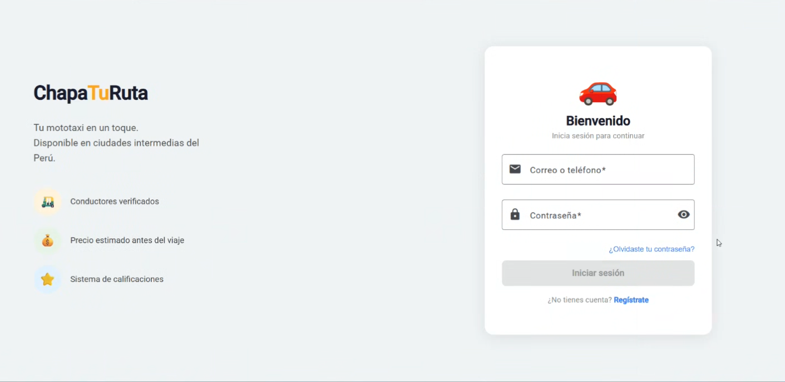
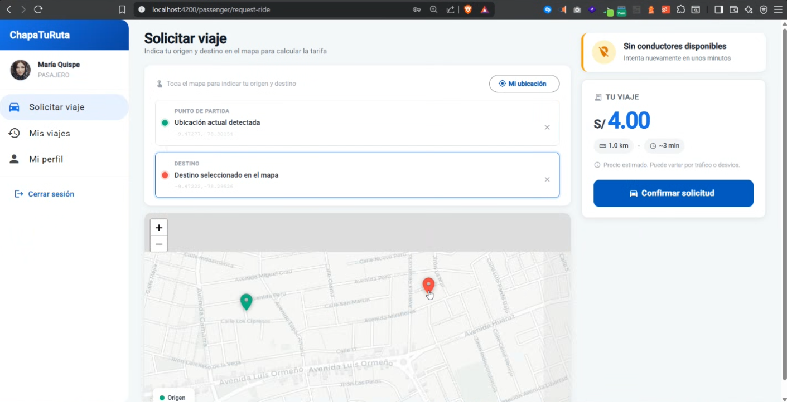
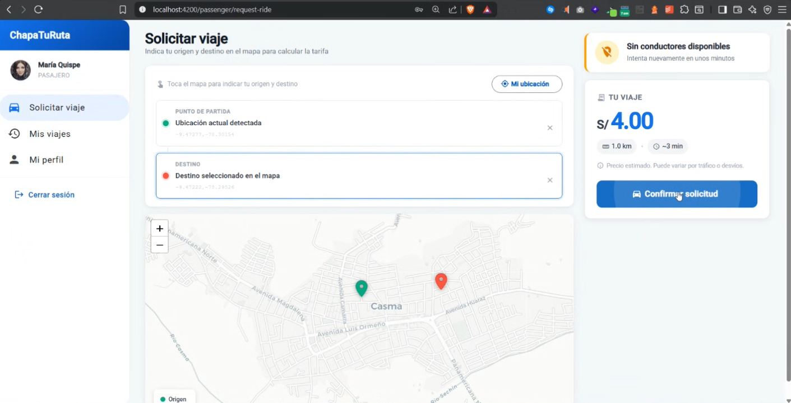
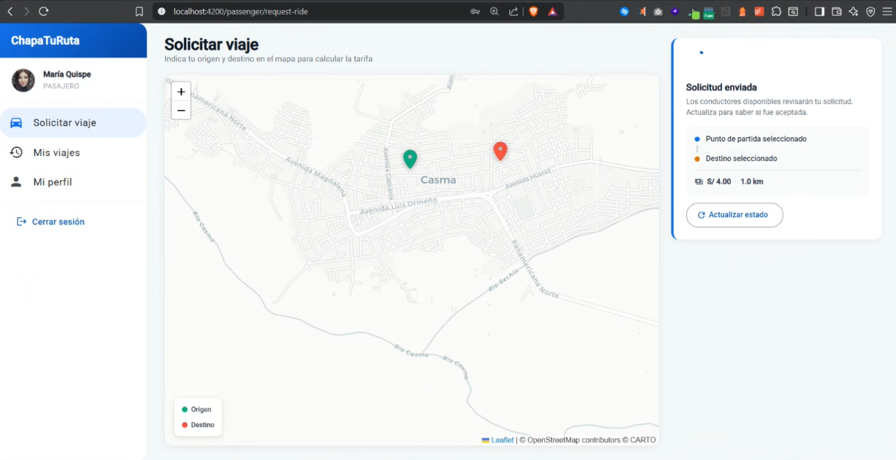
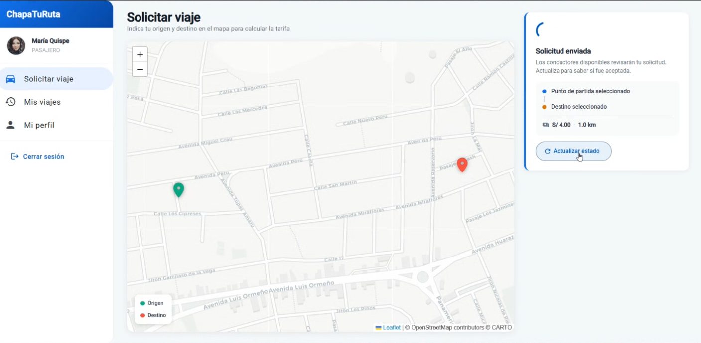

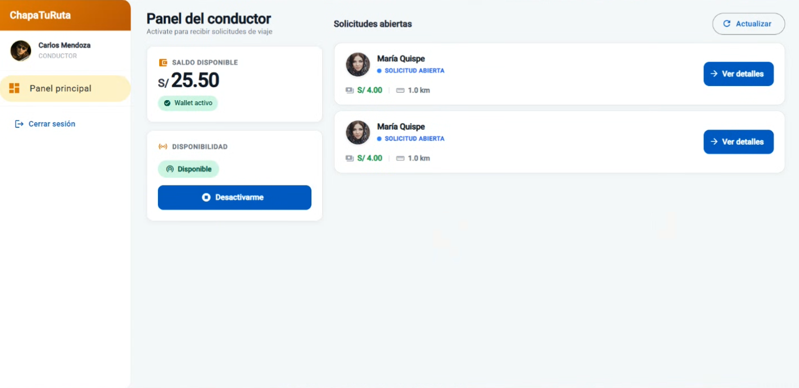
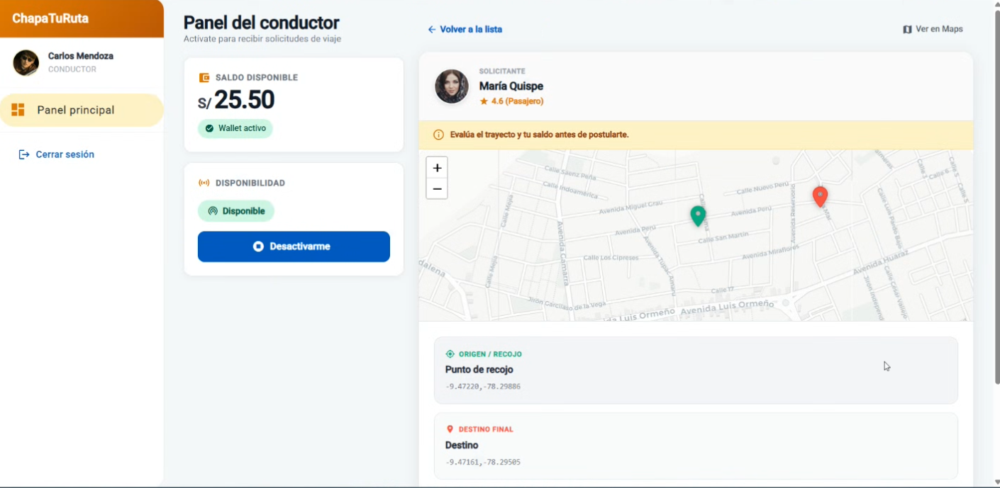

#### 5.2.2.6. Services Documentation Evidence for Sprint Review

Durante este sprint se completó el diseño e implementación del frontend Page del sistema.

**Descripción del Logro:**

- Implementación del frontend page.
- Deployment del frontend page.

**Recursos del Sprint:**

| Recurso       | Acción implementada   | Método HTTP | URL / Endpoint                                                                      | Link de repositorio                                                                            |
| ------------- | --------------------- | ----------- | ----------------------------------------------------------------------------------- | ---------------------------------------------------------------------------------------------- |
| Frontend Page | Visualización inicial | GET         | [startup-x-upc.github.io/frontendweb-page](https://chapaturuta-e7d2e.web.app/login) | [Startup-x-upc/frontendweb-page](https://github.com/Startup-x-upc/FrontEnd-WebApplication.git) |

#### 5.2.2.7. Software Deployment Evidence for Sprint Review

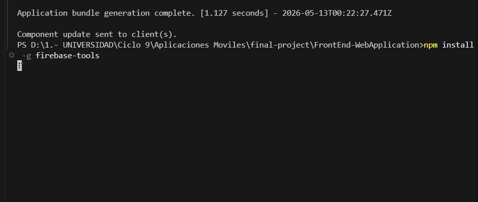
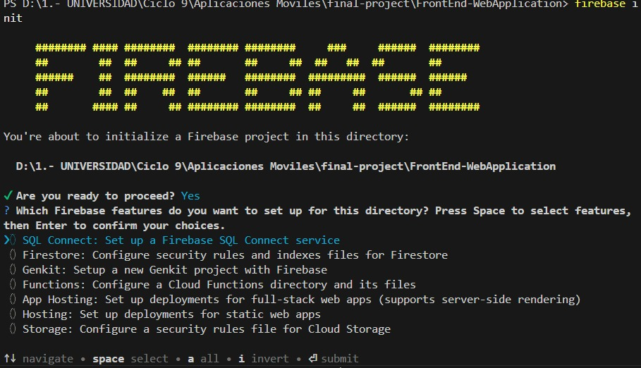
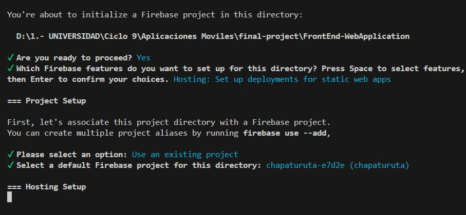
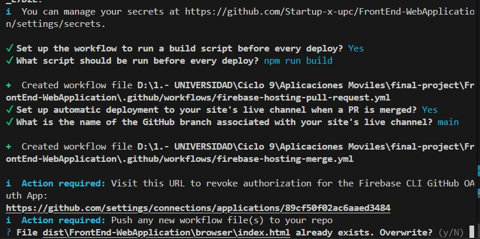
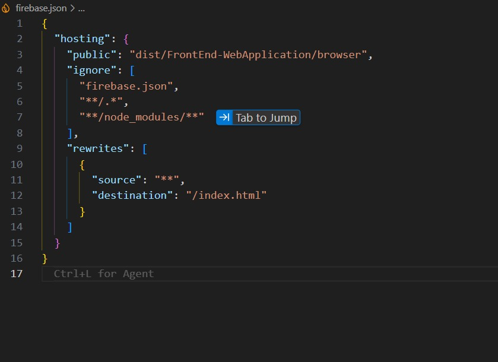

#### 5.2.2.8. Team Collaboration Insights during Sprint

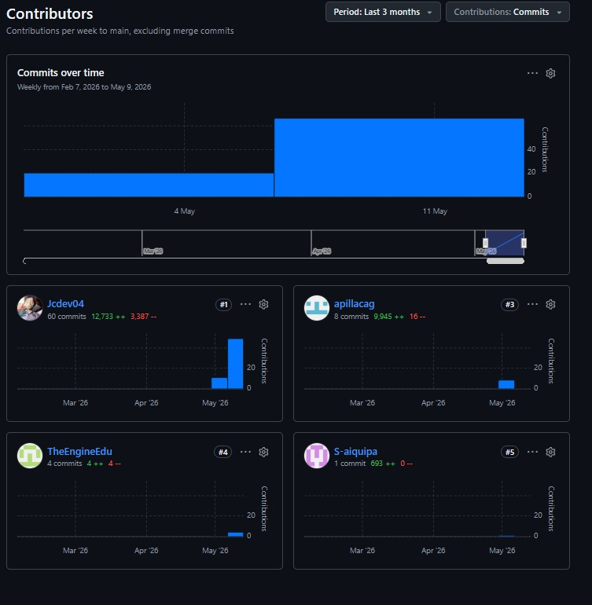

### 5.2.3. Sprint 3

#### 5.2.3.1. Sprint Planning 3

<table>
  <tbody>
    <tr>
      <td><b>Sprint #</b></td>
      <td>Sprint 3</td>
    </tr>
    <tr>
      <td colspan="2"><b>Sprint Planning Background</b></td>
    </tr>
    <tr>
      <td><b>Date</b></td>
      <td>2026-06-20</td>
    </tr>
    <tr>
      <td><b>Time</b></td>
      <td>18:50 PM (GMT-5)</td>
    </tr>
    <tr>
      <td><b>Location</b></td>
      <td>Modalidad remota mediante la plataforma Discord</td>
    </tr>
    <tr>
      <td><b>Prepared By</b></td>
      <td>Aguirre Ramos, Eduardo Manuel</td>
    </tr>
    <tr>
      <td><b>Attendees (to planning meeting)</b></td>
      <td>Castillo Vidal, Jesus Ivan / Torres Sanchez, Dalila Victoria / Aguirre Ramos, Eduardo Manuel / Pillaca Gonzales, Andy Saúl / Delgado Perez, James Caleb / Aiquipa Poma, Sebastian Andres</td>
    </tr>
    <tr>
      <td><b>Sprint 2 Review Summary</b></td>
      <td>Durante el Sprint 2 se logró implementar la mayoria de las funcionalidades del sistema ChapaTuRuta, desarrollando las secciones en la parte del frontend sobre el login, el viaje que realiza el conductor y opciones acerca .Quedó como mejora la implementacion del apartado de edición del perfil del usuario, la puntuación a la persona y el registro de nuevos conductores y pasajeros. El equipo cumplió con sus tareas establecidas, respetando el diseño de mockups y la guía de estilos, además de la  correcta implementación de la arquitectura DDD con respecto el nombre de las carpetas mencionadas en clase.</td>
    </tr>
    <tr>
      <td><b>Sprint 2 Retrospective Summary</b></td>
      <td>Durante el Sprint 2, el equipo logró avanzar de forma efectiva en el desarrollo de el frontend del negocio. Cada integrante ha cumplido con los resultados esperados para las secciones correspondientes, lo que permitió avanzar según lo planificado. Como mejora para el siguiente sprint, se debe implementar un metodo para supervisar cada task realizado por los integrantes, para asi manejar la eficiencia en el proyectoo y futuros trabajos colaborativos.</td>
    </tr>
    <tr>
      <td colspan="2"><b>Sprint Goal & User Stories</b></td>
    </tr>
    <tr>
      <td><b>Sprint 3 Goal</b></td>
      <td><b>Nuestro propósito es</b> tener el frontend del negocio hecho en su totalidad además de incluir el backend para que asi pueda procesar datos, manejarlos y almacenarlos en una base de datos. <b>Creemos que esto aportará</b> una mejor comprensión del alcance y la funcionalidad de lo que nuestro software puede llegar a ser. <b>Esto se confirmará cuando</b> entrevistemos nuevamente a personas y puedan probar nuestra pagina y a partir de ello genere un impacto positivo opinando y reseñando cómodamente con la pagina completa en su totalidad.</td>
    </tr>
    <tr>
      <td><b>Sprint 3 Velocity</b></td>
      <td> 35 puntos</td>
    </tr>
    <tr>
      <td><b>Sum of Story Points</b></td>
      <td> 35 puntos</td>
    </tr>
  </tbody>
</table>

#### 5.2.3.2. Aspect Leaders and Collaborators

En esta sección se presenta la Leadership-and-Collaboration Matrix (LACX) correspondiente al Sprint 3. Cada aspecto se relaciona con tareas clave del sprint, asignando un líder (L) responsable principal y colaboradores (C) que apoyan en su ejecución.

<table>
  <tbody>
    <tr>
      <th>Team Member (Last Name, First Name)</th>
      <th>GitHub Username</th>
      <th> Real-Time & Geolocation Aspect (L/C)</th>
      <th> Transaction & Payment Aspect (L/C)</th>
      <th> Service Status & State Aspect (L/C)</th>
      <th> Route Logic & Map Aspect (L/C)</th>
      <th> User Experience & Flow Aspect (L/C)</th>
    </tr>
    <tr>
      <td>Castillo Vidal, Jesus Ivan</td>
      <td>Jcdev04</td>
      <td>L</td>
      <td>C</td>
      <td>C</td>
      <td>C</td>
      <td>L</td>
    </tr>
    <tr>
      <td>Torres Sanchez, Dalila Victoria</td>
      <td>DalilaTorres</td>
      <td>C</td>
      <td>C</td>
      <td>C</td>
      <td>C</td>
      <td>L</td>
    </tr>
    <tr>
      <td>Aguirre Ramos, Eduardo Manuel</td>
      <td>TheEngineEdu</td>
      <td>C</td>
      <td>C</td>
      <td>L</td>
      <td>C</td>
      <td>L</td>
    </tr>
    <tr>
      <td>Pillaca Gonzales, Andy Saúl</td>
      <td>apillacag</td>
      <td>C</td>
      <td>C</td>
      <td>C</td>
      <td>L</td>
      <td>C</td>
    </tr>
    <tr>
      <td>Aiquipa Poma, Sebastian Andres</td>
      <td>S-aiquipa</td>
      <td>C</td>
      <td>L</td>
      <td>C</td>
      <td>C</td>
      <td>L</td>
    </tr>
  </tbody>
</table>

#### 5.2.3.3. Sprint Backlog 3

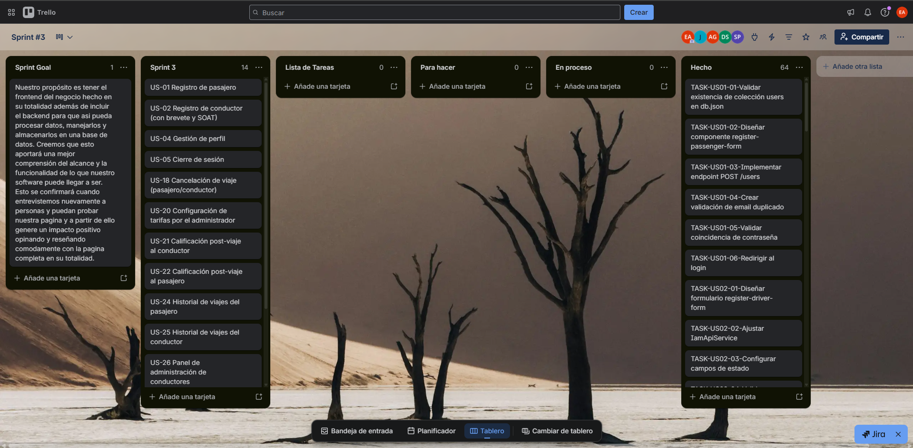

Sprint 3 Trello: [`https://trello.com/invite/b/6a1394868b238f4d46b9bbaa/ATTI9b87a0125c0203efb3aa3b62dd69e404FD2DF64E/sprint-3`](https://trello.com/invite/b/6a1394868b238f4d46b9bbaa/ATTI9b87a0125c0203efb3aa3b62dd69e404FD2DF64E/sprint-3)

##### 1. Resumen del Sprint Backlog

<table>
  <thead>
    <tr>
      <th>Sprint #</th>
      <th colspan="7">Sprint 3</th>
    </tr>
    <tr>
      <th colspan="2">User Story</th>
      <th colspan="6">Work-Item / Task</th>
    </tr>
    <tr>
      <th>Id</th>
      <th>Title</th>
      <th>Id</th>
      <th>Title</th>
      <th>Description</th>
      <th>Estimation (Hours)</th>
      <th>Assigned To</th>
      <th>Status (To-do / In-Process / To-Review / Done)</th>
    </tr>
  </thead>
  <tbody>
    <!-- US-01 -->
<tr>
  <td rowspan="6">US-01</td>
  <td rowspan="6">Registro de pasajero</td>
  <td>TASK-US01-01</td>
  <td>Validar existencia de colección users</td>
  <td>Validar existencia de colección `users` en `db.json`.</td>
  <td>0.3</td>
  <td>Aguirre Ramos, Eduardo Manuel</td>
  <td>Done</td>
</tr>
<tr>
  <td>TASK-US01-02</td>
  <td>Diseñar componente register-passenger-form</td>
  <td>Diseñar componente `register-passenger-form` con validaciones de formulario.</td>
  <td>0.8</td>
  <td>Aguirre Ramos, Eduardo Manuel</td>
  <td>Done</td>
</tr>
<tr>
  <td>TASK-US01-03</td>
  <td>Implementar endpoint POST /users</td>
  <td>Implementar endpoint `POST /users` en el servicio `IamApiService`.</td>
  <td>0.6</td>
  <td>Aguirre Ramos, Eduardo Manuel</td>
  <td>Done</td>
</tr>
<tr>
  <td>TASK-US01-04</td>
  <td>Crear validación de email duplicado</td>
  <td>Crear validación de email duplicado vía `GET /users?email={email}` previa al registro.</td>
  <td>0.5</td>
  <td>Aguirre Ramos, Eduardo Manuel</td>
  <td>Done</td>
</tr>
<tr>
  <td>TASK-US01-05</td>
  <td>Validar coincidencia de contraseña</td>
  <td>Validar coincidencia de contraseña y confirmación.</td>
  <td>0.4</td>
  <td>Aguirre Ramos, Eduardo Manuel</td>
  <td>Done</td>
</tr>
<tr>
  <td>TASK-US01-06</td>
  <td>Redirigir al login</td>
  <td>Redirigir al login mostrando mensaje de éxito.</td>
  <td>0.3</td>
  <td>Aguirre Ramos, Eduardo Manuel</td>
  <td>Done</td>
</tr>

<!-- US-02 -->
<tr>
  <td rowspan="5">US-02</td>
  <td rowspan="5">Registro de conductor (con brevete y SOAT)</td>
  <td>TASK-US02-01</td>
  <td>Diseñar formulario register-driver-form</td>
  <td>Diseñar formulario `register-driver-form` agregando inputs para brevete y SOAT.</td>
  <td>0.9</td>
  <td>Aguirre Ramos, Eduardo Manuel</td>
  <td>Done</td>
</tr>
<tr>
  <td>TASK-US02-02</td>
  <td>Ajustar IamApiService</td>
  <td>Ajustar `IamApiService` para enviar payload de conductor con estado inicial pendiente.</td>
  <td>0.7</td>
  <td>Aguirre Ramos, Eduardo Manuel</td>
  <td>Done</td>
</tr>
<tr>
  <td>TASK-US02-03</td>
  <td>Configurar campos de estado</td>
  <td>Configurar campos `verificationStatus` y `operationalStatus` en el esquema de conductores de `db.json`.</td>
  <td>0.4</td>
  <td>Aguirre Ramos, Eduardo Manuel</td>
  <td>Done</td>
</tr>
<tr>
  <td>TASK-US02-04</td>
  <td>Validar campos obligatorios</td>
  <td>Validar campos obligatorios antes del envío.</td>
  <td>0.5</td>
  <td>Aguirre Ramos, Eduardo Manuel</td>
  <td>Done</td>
</tr>
<tr>
  <td>TASK-US02-05</td>
  <td>Redirigir al login con aviso</td>
  <td>Redirigir al login con mensaje explicativo sobre el estado de verificación.</td>
  <td>0.3</td>
  <td>Aguirre Ramos, Eduardo Manuel</td>
  <td>Done</td>
</tr>

<!-- US-04 -->
<tr>
  <td rowspan="6">US-04</td>
  <td rowspan="6">Gestión de perfil (editar nombre y foto)</td>
  <td>TASK-US04-01</td>
  <td>Crear componente profile-page</td>
  <td>Crear componente `profile-page` accesible para pasajero y conductor.</td>
  <td>0.7</td>
  <td>Torres Sanchez, Dalila Victoria</td>
  <td>Done</td>
</tr>
<tr>
  <td>TASK-US04-02</td>
  <td>Diseñar formulario profile-edit-form</td>
  <td>Diseñar formulario `profile-edit-form` (nombre completo y foto).</td>
  <td>0.6</td>
  <td>Torres Sanchez, Dalila Victoria</td>
  <td>Done</td>
</tr>
<tr>
  <td>TASK-US04-03</td>
  <td>Implementar PUT /profiles/{id}</td>
  <td>Implementar `PUT /profiles/{id}` en `IamApiService`.</td>
  <td>0.5</td>
  <td>Torres Sanchez, Dalila Victoria</td>
  <td>Done</td>
</tr>
<tr>
  <td>TASK-US04-04</td>
  <td>Configurar rutas hijas</td>
  <td>Configurar rutas hijas en los layouts de pasajero y conductor.</td>
  <td>0.4</td>
  <td>Torres Sanchez, Dalila Victoria</td>
  <td>Done</td>
</tr>
<tr>
  <td>TASK-US04-05</td>
  <td>Integrar acción updateProfile</td>
  <td>Integrar acción `updateProfile()` en `IamStore`.</td>
  <td>0.5</td>
  <td>Torres Sanchez, Dalila Victoria</td>
  <td>Done</td>
</tr>
<tr>
  <td>TASK-US04-06</td>
  <td>Reflejar cambios en tiempo real</td>
  <td>Reflejar cambios en tiempo real en los sidebars o cabeceras de navegación.</td>
  <td>0.3</td>
  <td>Torres Sanchez, Dalila Victoria</td>
  <td>Done</td>
</tr>

<!-- US-05 -->
<tr>
  <td rowspan="3">US-05</td>
  <td rowspan="3">Cierre de sesión (Sign-Out)</td>
  <td>TASK-US05-01</td>
  <td>Verificar botón de cerrar sesión</td>
  <td>Verificar botón de cerrar sesión en los headers/sidebars de ambos roles.</td>
  <td>0.2</td>
  <td>Aguirre Ramos, Eduardo Manuel</td>
  <td>Done</td>
</tr>
<tr>
  <td>TASK-US05-02</td>
  <td>Confirmar purga de datos</td>
  <td>Confirmar que el store e historial de local storage quedan purgados tras el logout.</td>
  <td>0.3</td>
  <td>Aguirre Ramos, Eduardo Manuel</td>
  <td>Done</td>
</tr>
<tr>
  <td>TASK-US05-03</td>
  <td>Validar redirección</td>
  <td>Validar redirección a `/login`.</td>
  <td>0.2</td>
  <td>Aguirre Ramos, Eduardo Manuel</td>
  <td>Done</td>
</tr>

<!-- US-18 -->
<tr>
  <td rowspan="6">US-18</td>
  <td rowspan="6">Cancelación de viaje (pasajero/conductor)</td>
  <td>TASK-US18-01</td>
  <td>Crear acción cancelRide</td>
  <td>Crear acción `cancelRide(rideId, cancelledBy)` en `RideDispatchStore`.</td>
  <td>0.6</td>
  <td>Castillo Vidal, Jesus Ivan</td>
  <td>Done</td>
</tr>
<tr>
  <td>TASK-US18-02</td>
  <td>Configurar petición PATCH /rides/{id}</td>
  <td>Configurar petición `PATCH /rides/{id}` para actualizar el estado del viaje.</td>
  <td>0.5</td>
  <td>Castillo Vidal, Jesus Ivan</td>
  <td>Done</td>
</tr>
<tr>
  <td>TASK-US18-03</td>
  <td>Agregar botón Cancelar en Pasajero</td>
  <td>Agregar botón "Cancelar viaje" en la UI del pasajero al tener conductor asignado.</td>
  <td>0.4</td>
  <td>Castillo Vidal, Jesus Ivan</td>
  <td>Done</td>
</tr>
<tr>
  <td>TASK-US18-04</td>
  <td>Agregar botón Cancelar en Conductor</td>
  <td>Agregar botón "Cancelar viaje" en el dashboard del conductor durante la etapa de asignación.</td>
  <td>0.5</td>
  <td>Castillo Vidal, Jesus Ivan</td>
  <td>Done</td>
</tr>
<tr>
  <td>TASK-US18-05</td>
  <td>Implementar diálogo de confirmación</td>
  <td>Implementar diálogo de confirmación emergente.</td>
  <td>0.5</td>
  <td>Castillo Vidal, Jesus Ivan</td>
  <td>Done</td>
</tr>
<tr>
  <td>TASK-US18-06</td>
  <td>Actualizar las vistas reactivamente</td>
  <td>Actualizar las vistas correspondientes reactivamente al cancelar.</td>
  <td>0.4</td>
  <td>Castillo Vidal, Jesus Ivan</td>
  <td>Done</td>
</tr>

<!-- US-21 -->
<tr>
  <td rowspan="5">US-21</td>
  <td rowspan="5">Calificación post-viaje al conductor</td>
  <td>TASK-US21-01</td>
  <td>Configurar colección ratings</td>
  <td>Configurar la colección `ratings` en `db.json`.</td>
  <td>0.4</td>
  <td>Aiquipa Poma, Sebastian Andres</td>
  <td>Done</td>
</tr>
<tr>
  <td>TASK-US21-02</td>
  <td>Diseñar componente rating-form</td>
  <td>Diseñar componente interactivo `rating-form` (estrellas seleccionables).</td>
  <td>0.8</td>
  <td>Aiquipa Poma, Sebastian Andres</td>
  <td>Done</td>
</tr>
<tr>
  <td>TASK-US21-03</td>
  <td>Crear TrustReputationApiService</td>
  <td>Crear `TrustReputationApiService` con endpoint `POST /ratings`.</td>
  <td>0.6</td>
  <td>Aiquipa Poma, Sebastian Andres</td>
  <td>Done</td>
</tr>
<tr>
  <td>TASK-US21-04</td>
  <td>Integrar modal de calificación</td>
  <td>Integrar el modal de calificación al entrar en estado `RIDE_COMPLETED` del pasajero.</td>
  <td>0.5</td>
  <td>Aiquipa Poma, Sebastian Andres</td>
  <td>Done</td>
</tr>
<tr>
  <td>TASK-US21-05</td>
  <td>Implementar recálculo del promedio</td>
  <td>Implementar recálculo del promedio (`ratingAverage`) en el perfil del conductor.</td>
  <td>0.6</td>
  <td>Aiquipa Poma, Sebastian Andres</td>
  <td>To-do</td>
</tr>

<!-- US-22 -->
<tr>
  <td rowspan="4">US-22</td>
  <td rowspan="4">Calificación post-viaje al pasajero</td>
  <td>TASK-US22-01</td>
  <td>Integrar rating-form en Conductor</td>
  <td>Integrar `rating-form` en la vista final del conductor.</td>
  <td>0.5</td>
  <td>Aiquipa Poma, Sebastian Andres</td>
  <td>Done</td>
</tr>
<tr>
  <td>TASK-US22-02</td>
  <td>Agregar campo de comentarios condicional</td>
  <td>Agregar campo de comentarios condicionado a bajas calificaciones (≤ 2★).</td>
  <td>0.4</td>
  <td>Aiquipa Poma, Sebastian Andres</td>
  <td>Done</td>
</tr>
<tr>
  <td>TASK-US22-03</td>
  <td>Registrar calificación en db.json</td>
  <td>Registrar calificación en `db.json` vía endpoint común de ratings.</td>
  <td>0.5</td>
  <td>Aiquipa Poma, Sebastian Andres</td>
  <td>Done</td>
</tr>
<tr>
  <td>TASK-US22-04</td>
  <td>Recalcular reputación del pasajero</td>
  <td>Recalcular reputación del pasajero en su respectivo perfil.</td>
  <td>0.6</td>
  <td>Aiquipa Poma, Sebastian Andres</td>
  <td>Done</td>
</tr>

<!-- US-23 -->
<tr>
  <td rowspan="4">US-23</td>
  <td rowspan="4">Visualización del puntaje de reputación en perfil</td>
  <td>TASK-US23-01</td>
  <td>Agregar sección visual de reputación</td>
  <td>Agregar sección de reputación visual en `profile-page`.</td>
  <td>0.5</td>
  <td>Aiquipa Poma, Sebastian Andres</td>
  <td>Done</td>
</tr>
<tr>
  <td>TASK-US23-02</td>
  <td>Consumir endpoint GET /ratings</td>
  <td>Consumir endpoint `GET /ratings?ratedUserId={id}` para computar los valores.</td>
  <td>0.4</td>
  <td>Aiquipa Poma, Sebastian Andres</td>
  <td>Done</td>
</tr>
<tr>
  <td>TASK-US23-03</td>
  <td>Mostrar estrellas de forma gráfica</td>
  <td>Mostrar estrellas de forma gráfica (ej. `★ ★ ★ ☆ ☆`).</td>
  <td>0.4</td>
  <td>Aiquipa Poma, Sebastian Andres</td>
  <td>Done</td>
</tr>
<tr>
  <td>TASK-US23-04</td>
  <td>Configurar mensaje para nuevos usuarios</td>
  <td>Configurar mensaje de estado para usuarios nuevos sin calificaciones.</td>
  <td>0.2</td>
  <td>Aiquipa Poma, Sebastian Andres</td>
  <td>Done</td>
</tr>

<!-- US-24 -->
<tr>
  <td rowspan="5">US-24</td>
  <td rowspan="5">Historial de viajes del pasajero</td>
  <td>TASK-US24-01</td>
  <td>Crear componente trip-history-page</td>
  <td>Crear componente `trip-history-page` para pasajero.</td>
  <td>0.7</td>
  <td>Castillo Vidal, Jesus Ivan</td>
  <td>Done</td>
</tr>
<tr>
  <td>TASK-US24-02</td>
  <td>Consumir GET /rides de pasajero</td>
  <td>Consumir `GET /rides?passengerId={id}&amp;_sort=fecha&amp;_order=desc` en `RideDispatchApiService`.</td>
  <td>0.5</td>
  <td>Castillo Vidal, Jesus Ivan</td>
  <td>Done</td>
</tr>
<tr>
  <td>TASK-US24-03</td>
  <td>Configurar ruta en sidebar</td>
  <td>Configurar la ruta `/passenger/trips` en la navegación del sidebar.</td>
  <td>0.3</td>
  <td>Castillo Vidal, Jesus Ivan</td>
  <td>Done</td>
</tr>
<tr>
  <td>TASK-US24-04</td>
  <td>Crear tarjetas de viaje responsivas</td>
  <td>Crear tarjetas de viaje responsivas para listar el historial.</td>
  <td>0.6</td>
  <td>Castillo Vidal, Jesus Ivan</td>
  <td>Done</td>
</tr>
<tr>
  <td>TASK-US24-05</td>
  <td>Implementar vista de historial vacío</td>
  <td>Implementar vista de historial vacío con botón para iniciar nueva solicitud.</td>
  <td>0.3</td>
  <td>Castillo Vidal, Jesus Ivan</td>
  <td>Done</td>
</tr>

<!-- US-25 -->
<tr>
  <td rowspan="5">US-25</td>
  <td rowspan="5">Historial de viajes del conductor (con comisión)</td>
  <td>TASK-US25-01</td>
  <td>Crear componente trip-history-page</td>
  <td>Crear componente `trip-history-page` para conductor.</td>
  <td>0.7</td>
  <td>Castillo Vidal, Jesus Ivan</td>
  <td>Done</td>
</tr>
<tr>
  <td>TASK-US25-02</td>
  <td>Consumir GET /rides de conductor</td>
  <td>Consumir `GET /rides?driverId={id}&amp;_sort=fecha&amp;_order=desc`.</td>
  <td>0.5</td>
  <td>Castillo Vidal, Jesus Ivan</td>
  <td>Done</td>
</tr>
<tr>
  <td>TASK-US25-03-Configurar ruta para conductor</td>
  <td>Configurar ruta para conductor</td>
  <td>Configurar ruta `/driver/trips`.</td>
  <td>0.2</td>
  <td>Castillo Vidal, Jesus Ivan</td>
  <td>To-do</td>
</tr>
<tr>
  <td>TASK-US25-04-Agregar enlace Historial</td>
  <td>Agregar enlace Historial</td>
  <td>Agregar enlace "Historial" en el panel lateral del conductor.</td>
  <td>0.3</td>
  <td>Castillo Vidal, Jesus Ivan</td>
  <td>To-do</td>
</tr>
<tr>
  <td>TASK-US25-05-Diseñar desglose de ganancias y comisión</td>
  <td>Diseñar desglose de ganancias y comisión</td>
  <td>Diseñar tarjetas mostrando el desglose: Tarifa Cobrada, Comisión (5%) y Ganancia Neta.</td>
  <td>0.6</td>
  <td>Castillo Vidal, Jesus Ivan</td>
  <td>To-do</td>
</tr>

<tr>
  <td rowspan="5">US-06</td>
  <td rowspan="5">Verificación de documentos del conductor</td>
  <td>TASK-US06-01-Crear vista admin-drivers-page</td>
  <td>Crear vista admin-drivers-page</td>
  <td>Crear vista `admin-drivers-page` con tabla de conductores pendientes.</td>
  <td>0.8</td>
  <td>Pillaca Gonzales, Andy Saúl</td>
  <td>To-do</td>
</tr>
<tr>
  <td>TASK-US06-02-Aplicar filtro de búsqueda PENDING_VERIFICATION</td>
  <td>Aplicar filtro de búsqueda PENDING_VERIFICATION</td>
  <td>Aplicar filtro de búsqueda de conductores con `verificationStatus: PENDING_VERIFICATION`.</td>
  <td>0.5</td>
  <td>Pillaca Gonzales, Andy Saúl</td>
  <td>To-do</td>
</tr>
<tr>
  <td>TASK-US06-03-Agregar acciones de aprobación/rechazo</td>
  <td>Agregar acciones de aprobación/rechazo</td>
  <td>Agregar acciones visuales `approveDriver(id)` y `rejectDriver(id, reason)`.</td>
  <td>0.6</td>
  <td>Pillaca Gonzales, Andy Saúl</td>
  <td>To-do</td>
</tr>
<tr>
  <td>TASK-US06-04-Implementar PATCH /drivers/{id}</td>
  <td>Implementar PATCH /drivers/{id}</td>
  <td>Implementar petición `PATCH /drivers/{id}` para actualizar estado de verificación.</td>
  <td>0.5</td>
  <td>Pillaca Gonzales, Andy Saúl</td>
  <td>To-do</td>
</tr>
<tr>
  <td>TASK-US06-05-Añadir ruta al dashboard de admin</td>
  <td>Añadir ruta al dashboard de admin</td>
  <td>Añadir ruta `/admin/drivers` al dashboard de administrador.</td>
  <td>0.3</td>
  <td>Pillaca Gonzales, Andy Saúl</td>
  <td>To-do</td>
</tr>

<tr>
  <td rowspan="5">US-20</td>
  <td rowspan="5">Configuración de tarifas por el administrador</td>
  <td>TASK-US20-01-Diseñar componente admin-fare-config-page</td>
  <td>Diseñar componente admin-fare-config-page</td>
  <td>Diseñar componente `admin-fare-config-page` con formularios reactivos de Angular.</td>
  <td>0.7</td>
  <td>Pillaca Gonzales, Andy Saúl</td>
  <td>To-do</td>
</tr>
<tr>
  <td>TASK-US20-02-Consumir y actualizar configuraciones</td>
  <td>Consumir y actualizar configuraciones</td>
  <td>Consumir y actualizar configuraciones vía `PUT /fareConfig/{id}` en `MonetizationApiService`.</td>
  <td>0.6</td>
  <td>Pillaca Gonzales, Andy Saúl</td>
  <td>To-do</td>
</tr>
<tr>
  <td>TASK-US20-03-Agregar validadores de números</td>
  <td>Agregar validadores de números</td>
  <td>Agregar validadores para impedir números negativos o nulos.</td>
  <td>0.4</td>
  <td>Pillaca Gonzales, Andy Saúl</td>
  <td>To-do</td>
</tr>
<tr>
  <td>TASK-US20-04-Configurar la ruta de tarifas</td>
  <td>Configurar la ruta de tarifas</td>
  <td>Configurar la ruta `/admin/fare-config`.</td>
  <td>0.3</td>
  <td>Pillaca Gonzales, Andy Saúl</td>
  <td>To-do</td>
</tr>
<tr>
  <td>TASK-US20-05-Mostrar confirmation de guardado</td>
  <td>Mostrar confirmación de guardado</td>
  <td>Mostrar confirmación emergente de guardado exitoso.</td>
  <td>0.2</td>
  <td>Pillaca Gonzales, Andy Saúl</td>
  <td>To-do</td>
</tr>

<tr>
  <td rowspan="4">US-26</td>
  <td rowspan="4">Panel de administración de conductores</td>
  <td>TASK-US26-01-Extender admin-drivers-page</td>
  <td>Extender admin-drivers-page</td>
  <td>Extender `admin-drivers-page` para permitir visualizar a todos los conductores.</td>
  <td>0.6</td>
  <td>Pillaca Gonzales, Andy Saúl</td>
  <td>To-do</td>
</tr>
<tr>
  <td>TASK-US26-02-Implementar el control toggle isEnabled</td>
  <td>Implementar el control toggle isEnabled</td>
  <td>Implementar el control toggle `isEnabled` en la grilla de datos.</td>
  <td>0.4</td>
  <td>Pillaca Gonzales, Andy Saúl</td>
  <td>To-do</td>
</tr>
<tr>
  <td>TASK-US26-03-Configurar petición PATCH al cambiar toggle</td>
  <td>Configurar petición PATCH al cambiar toggle</td>
  <td>Configurar petición `PATCH /drivers/{id}` al cambiar el estado de habilitación.</td>
  <td>0.4</td>
  <td>Pillaca Gonzales, Andy Saúl</td>
  <td>To-do</td>
</tr>
<tr>
  <td>TASK-US26-04-Diseñar tags visuales de color</td>
  <td>Diseñar tags visuales de color</td>
  <td>Diseñar tags visuales de color (Verde: Activo, Amarillo: Pendiente, Rojo: Suspendido).</td>
  <td>0.4</td>
  <td>Pillaca Gonzales, Andy Saúl</td>
  <td>To-do</td>
</tr>

<tr>
  <td rowspan="6">US-30</td>
  <td rowspan="6">Historial de transacciones del wallet</td>
  <td>TASK-US30-01-Declarar esquema walletTransactions</td>
  <td>Declarar esquema walletTransactions</td>
  <td>Declarar esquema `walletTransactions` en `db.json`.</td>
  <td>0.3</td>
  <td>Pillaca Gonzales, Andy Saúl</td>
  <td>To-do</td>
</tr>
<tr>
  <td>TASK-US30-02-Consumir endpoint GET /walletTransactions</td>
  <td>Consumir endpoint GET /walletTransactions</td>
  <td>Consumir endpoint `GET /walletTransactions?walletId={id}` en `MonetizationApiService`.</td>
  <td>0.5</td>
  <td>Pillaca Gonzales, Andy Saúl</td>
  <td>To-do</td>
</tr>
<tr>
  <td>TASK-US30-03-Crear componente transaction-history</td>
  <td>Crear componente transaction-history</td>
  <td>Crear componente de lista `transaction-history`.</td>
  <td>0.6</td>
  <td>Pillaca Gonzales, Andy Saúl</td>
  <td>To-do</td>
</tr>
<tr>
  <td>TASK-US30-04-Reemplazar mock visual por datos del store</td>
  <td>Reemplazar mock visual por datos del store</td>
  <td>Reemplazar mock visual por datos reales del store en la página de Wallet.</td>
  <td>0.4</td>
  <td>Pillaca Gonzales, Andy Saúl</td>
  <td>To-do</td>
</tr>
<tr>
  <td>TASK-US30-05-Añadir filtros interactivos por tipo</td>
  <td>Añadir filtros interactivos por tipo</td>
  <td>Añadir filtros interactivos por tipo de transacción (`TOP_UP`, `COMMISSION`).</td>
  <td>0.4</td>
  <td>Pillaca Gonzales, Andy Saúl</td>
  <td>To-do</td>
</tr>
<tr>
  <td>TASK-US30-06-Diseñar el estado de historial vacío</td>
  <td>Diseñar el estado de historial vacío</td>
  <td>Diseñar el estado de historial vacío.</td>
  <td>0.3</td>
  <td>Pillaca Gonzales, Andy Saúl</td>
  <td>To-do</td>
</tr>

<tr>
  <td rowspan="4">US-27</td>
  <td rowspan="4">Recarga del wallet (Mock con simulación de saldo)</td>
  <td>TASK-US27-01-Crear componente recharge-form</td>
  <td>Crear componente recharge-form</td>
  <td>Crear componente `recharge-form` con validación de montos (mínimo S/ 5.00).</td>
  <td>0.6</td>
  <td>Pillaca Gonzales, Andy Saúl</td>
  <td>To-do</td>
</tr>
<tr>
  <td>TASK-US27-02-Implementar lógica mock de incremento</td>
  <td>Implementar lógica mock de incremento</td>
  <td>Lógica mock: ejecutar `POST /walletTransactions` y `PATCH /wallets/{id}` para actualizar el saldo del conductor.</td>
  <td>0.5</td>
  <td>Pillaca Gonzales, Andy Saúl</td>
  <td>To-do</td>
</tr>
<tr>
  <td>TASK-US27-03-Renderizar el formulario en un modal</td>
  <td>Renderizar el formulario en un modal</td>
  <td>Renderizar el formulario en un modal dentro de la sección de billetera.</td>
  <td>0.4</td>
  <td>Pillaca Gonzales, Andy Saúl</td>
  <td>To-do</td>
</tr>
<tr>
  <td>TASK-US27-04-Notificar la recarga correcta</td>
  <td>Notificar la recarga correcta</td>
  <td>Notificar la recarga correcta actualizando el saldo visible inmediatamente.</td>
  <td>0.2</td>
  <td>Pillaca Gonzales, Andy Saúl</td>
  <td>To-do</td>
</tr>

<tr>
  <td rowspan="5">US-29</td>
  <td rowspan="5">Descuento automático de comisión (simulación 5%)</td>
  <td>TASK-US29-01-Interceptar la confirmación del viaje</td>
  <td>Interceptar la confirmación del viaje</td>
  <td>Interceptar la confirmación del viaje completado en `RideDispatchStore.onCompleteRide()`.</td>
  <td>0.4</td>
  <td>Pillaca Gonzales, Andy Saúl</td>
  <td>To-do</td>
</tr>
<tr>
  <td>TASK-US29-02-Disparar petición PATCH /wallets</td>
  <td>Disparar petición PATCH /wallets</td>
  <td>Disparar petición `PATCH /wallets/{driverId}` aplicando el descuento matemático.</td>
  <td>0.5</td>
  <td>Pillaca Gonzales, Andy Saúl</td>
  <td>To-do</td>
</tr>
<tr>
  <td>TASK-US29-03-Registrar el movimiento en el historial</td>
  <td>Registrar el movimiento en el historial</td>
  <td>Registrar el movimiento en el historial vía `POST /walletTransactions` con categoría `COMMISSION`.</td>
  <td>0.4</td>
  <td>Pillaca Gonzales, Andy Saúl</td>
  <td>To-do</td>
</tr>
<tr>
  <td>TASK-US29-04-Forzar sincronización de MonetizationStore</td>
  <td>Forzar sincronización de MonetizationStore</td>
  <td>Forzar sincronización de datos de `MonetizationStore` tras el cobro.</td>
  <td>0.3</td>
  <td>Pillaca Gonzales, Andy Saúl</td>
  <td>To-do</td>
</tr>
<tr>
  <td>TASK-US29-05-Mostrar mensaje emergente de cobro</td>
  <td>Mostrar mensaje emergente de cobro</td>
  <td>Mostrar mensaje emergente informando el descuento de comisión cobrado.</td>
  <td>0.2</td>
  <td>Pillaca Gonzales, Andy Saúl</td>
  <td>To-do</td>
</tr>
    </tbody>
</table>

#### 5.2.3.4. Development Evidence for Sprint Review

| Repository                           | Branch  | Commit Id | Commit Message                                                                                                                                                                                                                                                                                                                                                                                                                                                                                                                                                                                                   | Commit Message Body                                                                                                                                                                                                                                                                                                                                                                                                                                                                                                                                                                                                                    | Author                | Commited on (Date) |
| ------------------------------------ | ------- | --------- | ---------------------------------------------------------------------------------------------------------------------------------------------------------------------------------------------------------------------------------------------------------------------------------------------------------------------------------------------------------------------------------------------------------------------------------------------------------------------------------------------------------------------------------------------------------------------------------------------------------------- | -------------------------------------------------------------------------------------------------------------------------------------------------------------------------------------------------------------------------------------------------------------------------------------------------------------------------------------------------------------------------------------------------------------------------------------------------------------------------------------------------------------------------------------------------------------------------------------------------------------------------------------- | --------------------- | ------------------ |
| Startup-x-upc/Backend-WebApplication | develop | 90efdc4   | hotfix:Change the userQueryService                                                                                                                                                                                                                                                                                                                                                                                                                                                                                                                                                                               | Se actualizó el repositorio: hotfix:Change the userQueryService                                                                                                                                                                                                                                                                                                                                                                                                                                                                                                                                                                        | TheEngineEdu          | 19/06/2026         |
| Startup-x-upc/Backend-WebApplication | develop | 972ab56   | feat:Added UserCommandService                                                                                                                                                                                                                                                                                                                                                                                                                                                                                                                                                                                    | Se implementó la funcionalidad: feat:Added UserCommandService                                                                                                                                                                                                                                                                                                                                                                                                                                                                                                                                                                          | TheEngineEdu          | 19/06/2026         |
| Startup-x-upc/Backend-WebApplication | develop | 344969b   | feat:Added IAMContextFacade                                                                                                                                                                                                                                                                                                                                                                                                                                                                                                                                                                                      | Se implementó la funcionalidad: feat:Added IAMContextFacade                                                                                                                                                                                                                                                                                                                                                                                                                                                                                                                                                                            | TheEngineEdu          | 19/06/2026         |
| Startup-x-upc/Backend-WebApplication | develop | 3b30889   | feat:Added domainAggregate                                                                                                                                                                                                                                                                                                                                                                                                                                                                                                                                                                                       | Se implementó la funcionalidad: feat:Added domainAggregate                                                                                                                                                                                                                                                                                                                                                                                                                                                                                                                                                                             | TheEngineEdu          | 19/06/2026         |
| Startup-x-upc/Backend-WebApplication | develop | 4176e1b   | feat: add resolvemessagedeafult in globalexceptionhandler                                                                                                                                                                                                                                                                                                                                                                                                                                                                                                                                                        | Se implementó la funcionalidad: feat: add resolvemessagedeafult in globalexceptionhandler                                                                                                                                                                                                                                                                                                                                                                                                                                                                                                                                              | apillacag             | 19/06/2026         |
| Startup-x-upc/Backend-WebApplication | develop | 69160f3   | fix: correct a thing in GlobalExceptionHandler                                                                                                                                                                                                                                                                                                                                                                                                                                                                                                                                                                   | Se corrigió el error: fix: correct a thing in GlobalExceptionHandler                                                                                                                                                                                                                                                                                                                                                                                                                                                                                                                                                                   | apillacag             | 19/06/2026         |
| Startup-x-upc/Backend-WebApplication | develop | 58a32a5   | feat: add validationError. Important                                                                                                                                                                                                                                                                                                                                                                                                                                                                                                                                                                             | Se implementó la funcionalidad: feat: add validationError. Important                                                                                                                                                                                                                                                                                                                                                                                                                                                                                                                                                                   | apillacag             | 19/06/2026         |
| Startup-x-upc/Backend-WebApplication | develop | eab31f0   | fix: fix fatal error in shared                                                                                                                                                                                                                                                                                                                                                                                                                                                                                                                                                                                   | Se corrigió el error: fix: fix fatal error in shared                                                                                                                                                                                                                                                                                                                                                                                                                                                                                                                                                                                   | apillacag             | 19/06/2026         |
| Startup-x-upc/Backend-WebApplication | develop | 12edec2   | feat: add unexpected in shared                                                                                                                                                                                                                                                                                                                                                                                                                                                                                                                                                                                   | Se implementó la funcionalidad: feat: add unexpected in shared                                                                                                                                                                                                                                                                                                                                                                                                                                                                                                                                                                         | apillacag             | 19/06/2026         |
| Startup-x-upc/Backend-WebApplication | develop | cc7ab56   | fix: eliminate a method in shared                                                                                                                                                                                                                                                                                                                                                                                                                                                                                                                                                                                | Se corrigió el error: fix: eliminate a method in shared                                                                                                                                                                                                                                                                                                                                                                                                                                                                                                                                                                                | apillacag             | 19/06/2026         |
| Startup-x-upc/Backend-WebApplication | develop | ffd2c14   | feat: implement conflict error in shared                                                                                                                                                                                                                                                                                                                                                                                                                                                                                                                                                                         | Se implementó la funcionalidad: feat: implement conflict error in shared                                                                                                                                                                                                                                                                                                                                                                                                                                                                                                                                                               | apillacag             | 18/06/2026         |
| Startup-x-upc/Backend-WebApplication | develop | b52f273   | fix: improve ApplicationError                                                                                                                                                                                                                                                                                                                                                                                                                                                                                                                                                                                    | Se corrigió el error: fix: improve ApplicationError                                                                                                                                                                                                                                                                                                                                                                                                                                                                                                                                                                                    | apillacag             | 18/06/2026         |
| Startup-x-upc/Backend-WebApplication | develop | 9f4458c   | feat: add getfullnamebyuserid                                                                                                                                                                                                                                                                                                                                                                                                                                                                                                                                                                                    | Se implementó la funcionalidad: feat: add getfullnamebyuserid                                                                                                                                                                                                                                                                                                                                                                                                                                                                                                                                                                          | apillacag             | 18/06/2026         |
| Startup-x-upc/Backend-WebApplication | develop | eb30618   | fix: erase a litle problem in IAM                                                                                                                                                                                                                                                                                                                                                                                                                                                                                                                                                                                | Se corrigió el error: fix: erase a litle problem in IAM                                                                                                                                                                                                                                                                                                                                                                                                                                                                                                                                                                                | apillacag             | 18/06/2026         |
| Startup-x-upc/Backend-WebApplication | develop | a0c0f82   | feat: add more funtionalities to IAM                                                                                                                                                                                                                                                                                                                                                                                                                                                                                                                                                                             | Se implementó la funcionalidad: feat: add more funtionalities to IAM                                                                                                                                                                                                                                                                                                                                                                                                                                                                                                                                                                   | apillacag             | 18/06/2026         |
| Startup-x-upc/Backend-WebApplication | develop | 1433ef1   | fix: correct fatal error in iam                                                                                                                                                                                                                                                                                                                                                                                                                                                                                                                                                                                  | Se corrigió el error: fix: correct fatal error in iam                                                                                                                                                                                                                                                                                                                                                                                                                                                                                                                                                                                  | apillacag             | 18/06/2026         |
| Startup-x-upc/Backend-WebApplication | develop | f6410eb   | feat: add Dockerfile and externalized database configuration properties for backend service                                                                                                                                                                                                                                                                                                                                                                                                                                                                                                                      | Se implementó la funcionalidad: feat: add Dockerfile and externalized database configuration properties for backend service                                                                                                                                                                                                                                                                                                                                                                                                                                                                                                            | Jesús Castillo Vidal | 18/06/2026         |
| Startup-x-upc/Backend-WebApplication | develop | 20b0762   | refactor(drivermanagement): remove currentLocation and simplify availability toggle response                                                                                                                                                                                                                                                                                                                                                                                                                                                                                                                     | Se refactorizó el código: refactor(drivermanagement): remove currentLocation and simplify availability toggle response                                                                                                                                                                                                                                                                                                                                                                                                                                                                                                                 | Jesús Castillo Vidal | 18/06/2026         |
| Startup-x-upc/Backend-WebApplication | develop | 3ad5339   | feat(shared): map new drivermanagement error codes to corresponding HTTP statuses                                                                                                                                                                                                                                                                                                                                                                                                                                                                                                                                | Se implementó la funcionalidad: feat(shared): map new drivermanagement error codes to corresponding HTTP statuses                                                                                                                                                                                                                                                                                                                                                                                                                                                                                                                      | Jesús Castillo Vidal | 18/06/2026         |
| Startup-x-upc/Backend-WebApplication | develop | 2b9b330   | feat(drivermanagement): implement drivermanagement bounded context and availability checks                                                                                                                                                                                                                                                                                                                                                                                                                                                                                                                       | Se implementó la funcionalidad: feat(drivermanagement): implement drivermanagement bounded context and availability checks                                                                                                                                                                                                                                                                                                                                                                                                                                                                                                             | Jesús Castillo Vidal | 18/06/2026         |
| Startup-x-upc/Backend-WebApplication | develop | f70fc19   | refactor(monetization): cleanup block/unblock endpoints, move event generation to domain                                                                                                                                                                                                                                                                                                                                                                                                                                                                                                                         | Se refactorizó el código: refactor(monetization): cleanup block/unblock endpoints, move event generation to domain                                                                                                                                                                                                                                                                                                                                                                                                                                                                                                                     | Jesús Castillo Vidal | 18/06/2026         |
| Startup-x-upc/Backend-WebApplication | develop | dc4e5de   | fix(monetization): query wallet by walletId instead of driverId in transaction history query                                                                                                                                                                                                                                                                                                                                                                                                                                                                                                                     | Se corrigió el error: fix(monetization): query wallet by walletId instead of driverId in transaction history query                                                                                                                                                                                                                                                                                                                                                                                                                                                                                                                     | Jesús Castillo Vidal | 18/06/2026         |
| Startup-x-upc/Backend-WebApplication | develop | 54dcd3c   | refactor(iam): prefix auth and profile REST endpoints with /api/v1 and update security path matchers                                                                                                                                                                                                                                                                                                                                                                                                                                                                                                             | Se refactorizó el código: refactor(iam): prefix auth and profile REST endpoints with /api/v1 and update security path matchers                                                                                                                                                                                                                                                                                                                                                                                                                                                                                                         | Jesús Castillo Vidal | 18/06/2026         |
| Startup-x-upc/Backend-WebApplication | develop | 2229d89   | fix(monetization): retrieve existing entity ID before saving to prevent duplicate key constraint on update                                                                                                                                                                                                                                                                                                                                                                                                                                                                                                       | Se corrigió el error: fix(monetization): retrieve existing entity ID before saving to prevent duplicate key constraint on update                                                                                                                                                                                                                                                                                                                                                                                                                                                                                                       | Jesús Castillo Vidal | 18/06/2026         |
| Startup-x-upc/Backend-WebApplication | develop | d9f4c4a   | refactor(monetization): make persistence assemblers null-safe for legacy database records                                                                                                                                                                                                                                                                                                                                                                                                                                                                                                                        | Se refactorizó el código: refactor(monetization): make persistence assemblers null-safe for legacy database records                                                                                                                                                                                                                                                                                                                                                                                                                                                                                                                    | Jesús Castillo Vidal | 18/06/2026         |
| Startup-x-upc/Backend-WebApplication | develop | 9541998   | refactor(monetization): split application services into interfaces and internal implementations                                                                                                                                                                                                                                                                                                                                                                                                                                                                                                                  | Se refactorizó el código: refactor(monetization): split application services into interfaces and internal implementations                                                                                                                                                                                                                                                                                                                                                                                                                                                                                                              | Jesús Castillo Vidal | 18/06/2026         |
| Startup-x-upc/Backend-WebApplication | develop | 7461ff0   | refactor(monetization): move JPA repository implementations to adapters package                                                                                                                                                                                                                                                                                                                                                                                                                                                                                                                                  | Se refactorizó el código: refactor(monetization): move JPA repository implementations to adapters package                                                                                                                                                                                                                                                                                                                                                                                                                                                                                                                              | Jesús Castillo Vidal | 18/06/2026         |
| Startup-x-upc/Backend-WebApplication | develop | f06cf56   | refactor(monetization): rename and move REST response assemblers to transform package                                                                                                                                                                                                                                                                                                                                                                                                                                                                                                                            | Se refactorizó el código: refactor(monetization): rename and move REST response assemblers to transform package                                                                                                                                                                                                                                                                                                                                                                                                                                                                                                                        | Jesús Castillo Vidal | 18/06/2026         |
| Startup-x-upc/Backend-WebApplication | develop | 42ad1e6   | feat(monetization): update controller endpoints to align with frontend resource models and estimated fare check                                                                                                                                                                                                                                                                                                                                                                                                                                                                                                  | Se implementó la funcionalidad: feat(monetization): update controller endpoints to align with frontend resource models and estimated fare check                                                                                                                                                                                                                                                                                                                                                                                                                                                                                        | Jesús Castillo Vidal | 18/06/2026         |
| Startup-x-upc/Backend-WebApplication | develop | 6590eed   | feat(monetization): implement ACL integration for driver registration                                                                                                                                                                                                                                                                                                                                                                                                                                                                                                                                            | Se implementó la funcionalidad: feat(monetization): implement ACL integration for driver registration                                                                                                                                                                                                                                                                                                                                                                                                                                                                                                                                  | Jesús Castillo Vidal | 18/06/2026         |
| Startup-x-upc/Backend-WebApplication | develop | f00b0a7   | feat: implement monetization domain services, entities, and persistence layer for fare policies and wallet transactions                                                                                                                                                                                                                                                                                                                                                                                                                                                                                          | Se implementó la funcionalidad: feat: implement monetization domain services, entities, and persistence layer for fare policies and wallet transactions                                                                                                                                                                                                                                                                                                                                                                                                                                                                                | Jesús Castillo Vidal | 18/06/2026         |
| Startup-x-upc/Backend-WebApplication | develop | c8ef2c6   | refactor: Updating monetization's name                                                                                                                                                                                                                                                                                                                                                                                                                                                                                                                                                                           | Se refactorizó el código: refactor: Updating monetization's name                                                                                                                                                                                                                                                                                                                                                                                                                                                                                                                                                                       | Jesús Castillo Vidal | 18/06/2026         |
| Startup-x-upc/Backend-WebApplication | develop | 86b178a   | fix(iam): migrate UUID columns to VARCHAR(36), fix UPDATE vs INSERT, and polish Swagger docs Persistence: - Change all UUID columns to VARCHAR(36) across IAM and Monetization entities to prevent BINARY(16) padding issues in MySQL - Update JPA repositories, assemblers, and adapters with String conversion - Fix save() in UserRepositoryImpl and ProfileRepositoryImpl to preserve the internal Long id from existing entities so JPA issues UPDATE instead of INSERT on subsequent saves - Publish domain events explicitly via ApplicationEventPublisher in UserRepositoryImpl and WalletRepositoryImpl | Se corrigió el error: fix(iam): migrate UUID columns to VARCHAR(36), fix UPDATE vs INSERT, and polish Swagger docs Persistence: - Change all UUID columns to VARCHAR(36) across IAM and Monetization entities to prevent BINARY(16) padding issues in MySQL - Update JPA repositories, assemblers, and adapters with String conversion - Fix save() in UserRepositoryImpl and ProfileRepositoryImpl to preserve the internal Long id from existing entities so JPA issues UPDATE instead of INSERT on subsequent saves - Publish domain events explicitly via ApplicationEventPublisher in UserRepositoryImpl and WalletRepositoryImpl | Jesús Castillo Vidal | 16/06/2026         |
| Startup-x-upc/Backend-WebApplication | develop | e996159   | fix(iam): resolving inconsistency with UUID from JPA to MYSQL                                                                                                                                                                                                                                                                                                                                                                                                                                                                                                                                                    | Se corrigió el error: fix(iam): resolving inconsistency with UUID from JPA to MYSQL                                                                                                                                                                                                                                                                                                                                                                                                                                                                                                                                                    | Jesús Castillo Vidal | 16/06/2026         |
| Startup-x-upc/Backend-WebApplication | develop | 32b46ab   | fix(iam): add Swagger JWT auth scheme and remove redundant check-email endpoint                                                                                                                                                                                                                                                                                                                                                                                                                                                                                                                                  | Se corrigió el error: fix(iam): add Swagger JWT auth scheme and remove redundant check-email endpoint                                                                                                                                                                                                                                                                                                                                                                                                                                                                                                                                  | Jesús Castillo Vidal | 16/06/2026         |
| Startup-x-upc/Backend-WebApplication | develop | 67a930e   | feat(iam): implement Anti-Corruption Layer facade for IAM bounded context access                                                                                                                                                                                                                                                                                                                                                                                                                                                                                                                                 | Se implementó la funcionalidad: feat(iam): implement Anti-Corruption Layer facade for IAM bounded context access                                                                                                                                                                                                                                                                                                                                                                                                                                                                                                                       | Jesús Castillo Vidal | 16/06/2026         |
| Startup-x-upc/Backend-WebApplication | develop | e705806   | feat: implement JPA repository adapters for Wallet and User aggregates with explicit domain event publishing                                                                                                                                                                                                                                                                                                                                                                                                                                                                                                     | Se implementó la funcionalidad: feat: implement JPA repository adapters for Wallet and User aggregates with explicit domain event publishing                                                                                                                                                                                                                                                                                                                                                                                                                                                                                           | Jesús Castillo Vidal | 16/06/2026         |
| Startup-x-upc/Backend-WebApplication | develop | cdc1326   | feat(iam): The user wants me to suggest a good commit message for all the work done so far. Let me summarize what was accomplished: 1. Deleted all existing IAM code - ProfilesController: GET /users/me/profile, PUT /profiles/{profileId} - Immutable record resources with Jakarta Validation + OpenAPI @Schema                                                                                                                                                                                                                                                                                               | Se implementó la funcionalidad: feat(iam): The user wants me to suggest a good commit message for all the work done so far. Let me summarize what was accomplished: 1. Deleted all existing IAM code - ProfilesController: GET /users/me/profile, PUT /profiles/{profileId} - Immutable record resources with Jakarta Validation + OpenAPI @Schema                                                                                                                                                                                                                                                                                     | Jesús Castillo Vidal | 16/06/2026         |
| Startup-x-upc/Backend-WebApplication | develop | f07327c   | feat: implement Identity and Access Management (IAM) bounded context with domain models, repositories, and persistence infrastructure.                                                                                                                                                                                                                                                                                                                                                                                                                                                                           | Se implementó la funcionalidad: feat: implement Identity and Access Management (IAM) bounded context with domain models, repositories, and persistence infrastructure.                                                                                                                                                                                                                                                                                                                                                                                                                                                                 | Jesús Castillo Vidal | 16/06/2026         |
| Startup-x-upc/Backend-WebApplication | develop | a15065a   | docs: add architecture analysis guide and update project dependencies in pom.xml                                                                                                                                                                                                                                                                                                                                                                                                                                                                                                                                 | Se actualizó la documentación: docs: add architecture analysis guide and update project dependencies in pom.xml                                                                                                                                                                                                                                                                                                                                                                                                                                                                                                                        | Jesús Castillo Vidal | 16/06/2026         |
| Startup-x-upc/Backend-WebApplication | develop | 9d31a68   | feat: update monetization bounded context with commissionRate and API spec alignment                                                                                                                                                                                                                                                                                                                                                                                                                                                                                                                             | Se implementó la funcionalidad: feat: update monetization bounded context with commissionRate and API spec alignment                                                                                                                                                                                                                                                                                                                                                                                                                                                                                                                   | S-aiquipa             | 16/06/2026         |
| Startup-x-upc/Backend-WebApplication | develop | 0eb7fc2   | refactor(monetization): map walletId field in WalletPersistenceAssembler                                                                                                                                                                                                                                                                                                                                                                                                                                                                                                                                         | Se refactorizó el código: refactor(monetization): map walletId field in WalletPersistenceAssembler                                                                                                                                                                                                                                                                                                                                                                                                                                                                                                                                     | sebastian             | 16/06/2026         |
| Startup-x-upc/Backend-WebApplication | develop | 04ef111   | feat(monetization): add walletId field to WalletPersistenceEntity with unique constraint                                                                                                                                                                                                                                                                                                                                                                                                                                                                                                                         | Se implementó la funcionalidad: feat(monetization): add walletId field to WalletPersistenceEntity with unique constraint                                                                                                                                                                                                                                                                                                                                                                                                                                                                                                               | sebastian             | 16/06/2026         |
| Startup-x-upc/Backend-WebApplication | develop | a3aeec2   | refactor(monetization): remove unused driverId field from ApplyCommissionResource                                                                                                                                                                                                                                                                                                                                                                                                                                                                                                                                | Se refactorizó el código: refactor(monetization): remove unused driverId field from ApplyCommissionResource                                                                                                                                                                                                                                                                                                                                                                                                                                                                                                                            | sebastian             | 16/06/2026         |
| Startup-x-upc/Backend-WebApplication | develop | 1a00eeb   | refactor(monetization): remove unused driverId field from TopUpFailureResource                                                                                                                                                                                                                                                                                                                                                                                                                                                                                                                                   | Se refactorizó el código: refactor(monetization): remove unused driverId field from TopUpFailureResource                                                                                                                                                                                                                                                                                                                                                                                                                                                                                                                               | sebastian             | 16/06/2026         |
| Startup-x-upc/Backend-WebApplication | develop | 25243dc   | refactor(monetization): remove unused driverId field from TopUpWalletResource                                                                                                                                                                                                                                                                                                                                                                                                                                                                                                                                    | Se refactorizó el código: refactor(monetization): remove unused driverId field from TopUpWalletResource                                                                                                                                                                                                                                                                                                                                                                                                                                                                                                                                | sebastian             | 16/06/2026         |
| Startup-x-upc/Backend-WebApplication | develop | 1d9809e   | feat(monetization): add findByWalletId method to WalletRepositoryImpl                                                                                                                                                                                                                                                                                                                                                                                                                                                                                                                                            | Se implementó la funcionalidad: feat(monetization): add findByWalletId method to WalletRepositoryImpl                                                                                                                                                                                                                                                                                                                                                                                                                                                                                                                                  | sebastian             | 16/06/2026         |
| Startup-x-upc/Backend-WebApplication | develop | 24537bf   | feat(monetization): add findByWalletId method to WalletJpaRepository                                                                                                                                                                                                                                                                                                                                                                                                                                                                                                                                             | Se implementó la funcionalidad: feat(monetization): add findByWalletId method to WalletJpaRepository                                                                                                                                                                                                                                                                                                                                                                                                                                                                                                                                   | sebastian             | 16/06/2026         |
| Startup-x-upc/Backend-WebApplication | develop | 4381afe   | feat(monetization): add findByWalletId method to WalletRepository                                                                                                                                                                                                                                                                                                                                                                                                                                                                                                                                                | Se implementó la funcionalidad: feat(monetization): add findByWalletId method to WalletRepository                                                                                                                                                                                                                                                                                                                                                                                                                                                                                                                                      | sebastian             | 16/06/2026         |
| Startup-x-upc/Backend-WebApplication | develop | 9061233   | refactor(monetization): improve wallet balance calculations, enforce rounding policies, and add @Transactional to wallet operations                                                                                                                                                                                                                                                                                                                                                                                                                                                                              | Se refactorizó el código: refactor(monetization): improve wallet balance calculations, enforce rounding policies, and add @Transactional to wallet operations                                                                                                                                                                                                                                                                                                                                                                                                                                                                          | sebastian             | 16/06/2026         |
| Startup-x-upc/Backend-WebApplication | develop | 74cd0a7   | refactor(monetization): rename driverId to walletId in ApplyRideCommissionCommand                                                                                                                                                                                                                                                                                                                                                                                                                                                                                                                                | Se refactorizó el código: refactor(monetization): rename driverId to walletId in ApplyRideCommissionCommand                                                                                                                                                                                                                                                                                                                                                                                                                                                                                                                            | sebastian             | 16/06/2026         |
| Startup-x-upc/Backend-WebApplication | develop | 96a1c02   | refactor(monetization): rename driverId to walletId in RegisterTopUpFailureCommand                                                                                                                                                                                                                                                                                                                                                                                                                                                                                                                               | Se refactorizó el código: refactor(monetization): rename driverId to walletId in RegisterTopUpFailureCommand                                                                                                                                                                                                                                                                                                                                                                                                                                                                                                                           | sebastian             | 16/06/2026         |
| Startup-x-upc/Backend-WebApplication | develop | 8219beb   | refactor(monetization): rename driverId to walletId in TopUpWalletCommand                                                                                                                                                                                                                                                                                                                                                                                                                                                                                                                                        | Se refactorizó el código: refactor(monetization): rename driverId to walletId in TopUpWalletCommand                                                                                                                                                                                                                                                                                                                                                                                                                                                                                                                                    | sebastian             | 16/06/2026         |
| Startup-x-upc/Backend-WebApplication | develop | d4deddf   | refactor(monetization): update API endpoints for Fare Config and Wallet management                                                                                                                                                                                                                                                                                                                                                                                                                                                                                                                               | Se refactorizó el código: refactor(monetization): update API endpoints for Fare Config and Wallet management                                                                                                                                                                                                                                                                                                                                                                                                                                                                                                                           | sebastian             | 16/06/2026         |
| Startup-x-upc/Backend-WebApplication | develop | 40cf696   | feat(monetization): pass commissionRate to ConfigureFarePolicyCommand                                                                                                                                                                                                                                                                                                                                                                                                                                                                                                                                            | Se implementó la funcionalidad: feat(monetization): pass commissionRate to ConfigureFarePolicyCommand                                                                                                                                                                                                                                                                                                                                                                                                                                                                                                                                  | sebastian             | 16/06/2026         |
| Startup-x-upc/Backend-WebApplication | develop | b28c52e   | feat(monetization): update FarePolicy configuration to handle commissionRate                                                                                                                                                                                                                                                                                                                                                                                                                                                                                                                                     | Se implementó la funcionalidad: feat(monetization): update FarePolicy configuration to handle commissionRate                                                                                                                                                                                                                                                                                                                                                                                                                                                                                                                           | sebastian             | 16/06/2026         |
| Startup-x-upc/Backend-WebApplication | develop | 2077cd6   | feat(monetization): add commissionRate field to ConfigureFarePolicyResource                                                                                                                                                                                                                                                                                                                                                                                                                                                                                                                                      | Se implementó la funcionalidad: feat(monetization): add commissionRate field to ConfigureFarePolicyResource                                                                                                                                                                                                                                                                                                                                                                                                                                                                                                                            | sebastian             | 16/06/2026         |
| Startup-x-upc/Backend-WebApplication | develop | 89b9eb2   | feat(monetization): add commissionRate field to ConfigureFarePolicyCommand                                                                                                                                                                                                                                                                                                                                                                                                                                                                                                                                       | Se implementó la funcionalidad: feat(monetization): add commissionRate field to ConfigureFarePolicyCommand                                                                                                                                                                                                                                                                                                                                                                                                                                                                                                                             | sebastian             | 16/06/2026         |
| Startup-x-upc/Backend-WebApplication | develop | bb503cd   | feat(monetization): map commissionRate in FarePolicyResponseAssembler                                                                                                                                                                                                                                                                                                                                                                                                                                                                                                                                            | Se implementó la funcionalidad: feat(monetization): map commissionRate in FarePolicyResponseAssembler                                                                                                                                                                                                                                                                                                                                                                                                                                                                                                                                  | sebastian             | 16/06/2026         |
| Startup-x-upc/Backend-WebApplication | develop | 300542d   | feat(monetization): add commissionRate field to FarePolicyResponse                                                                                                                                                                                                                                                                                                                                                                                                                                                                                                                                               | Se implementó la funcionalidad: feat(monetization): add commissionRate field to FarePolicyResponse                                                                                                                                                                                                                                                                                                                                                                                                                                                                                                                                     | sebastian             | 16/06/2026         |
| Startup-x-upc/Backend-WebApplication | develop | 31bdc0a   | feat(monetization): map commissionRate in FarePolicyPersistenceAssembler                                                                                                                                                                                                                                                                                                                                                                                                                                                                                                                                         | Se implementó la funcionalidad: feat(monetization): map commissionRate in FarePolicyPersistenceAssembler                                                                                                                                                                                                                                                                                                                                                                                                                                                                                                                               | sebastian             | 16/06/2026         |
| Startup-x-upc/Backend-WebApplication | develop | 7df410a   | feat(monetization): add commissionRate field to FarePolicyPersistenceEntity with setter method                                                                                                                                                                                                                                                                                                                                                                                                                                                                                                                   | Se implementó la funcionalidad: feat(monetization): add commissionRate field to FarePolicyPersistenceEntity with setter method                                                                                                                                                                                                                                                                                                                                                                                                                                                                                                         | sebastian             | 16/06/2026         |
| Startup-x-upc/Backend-WebApplication | develop | d917131   | feat(monetization): add commission rate to FarePolicy and calculateCommission method                                                                                                                                                                                                                                                                                                                                                                                                                                                                                                                             | Se implementó la funcionalidad: feat(monetization): add commission rate to FarePolicy and calculateCommission method                                                                                                                                                                                                                                                                                                                                                                                                                                                                                                                   | sebastian             | 16/06/2026         |
| Startup-x-upc/Backend-WebApplication | develop | f4c621b   | Merge pull request #2 from Startup-x-upc/feat/monetization                                                                                                                                                                                                                                                                                                                                                                                                                                                                                                                                                       | Se integraron los cambios de la rama: Merge pull request #2 from Startup-x-upc/feat/monetization                                                                                                                                                                                                                                                                                                                                                                                                                                                                                                                                       | S-aiquipa             | 13/06/2026         |
| Startup-x-upc/Backend-WebApplication | develop | 04552e0   | feat(monetization): add package declaration to Wallet aggregate                                                                                                                                                                                                                                                                                                                                                                                                                                                                                                                                                  | Se implementó la funcionalidad: feat(monetization): add package declaration to Wallet aggregate                                                                                                                                                                                                                                                                                                                                                                                                                                                                                                                                        | sebastian             | 13/06/2026         |
| Startup-x-upc/Backend-WebApplication | develop | ca97f2e   | feat(monetization): extend WalletTransactionPersistenceEntity from AuditableAbstractPersistenceEntity and add Lombok @Getter                                                                                                                                                                                                                                                                                                                                                                                                                                                                                     | Se implementó la funcionalidad: feat(monetization): extend WalletTransactionPersistenceEntity from AuditableAbstractPersistenceEntity and add Lombok @Getter                                                                                                                                                                                                                                                                                                                                                                                                                                                                           | sebastian             | 13/06/2026         |
| Startup-x-upc/Backend-WebApplication | develop | 25f2d1d   | feat(monetization): extend WalletPersistenceEntity from AuditableAbstractPersistenceEntity and add Lombok @Getter                                                                                                                                                                                                                                                                                                                                                                                                                                                                                                | Se implementó la funcionalidad: feat(monetization): extend WalletPersistenceEntity from AuditableAbstractPersistenceEntity and add Lombok @Getter                                                                                                                                                                                                                                                                                                                                                                                                                                                                                      | sebastian             | 13/06/2026         |
| Startup-x-upc/Backend-WebApplication | develop | ef222f4   | feat(monetization): extend FarePolicyPersistenceEntity from AuditableAbstractPersistenceEntity and add Lombok @Getter                                                                                                                                                                                                                                                                                                                                                                                                                                                                                            | Se implementó la funcionalidad: feat(monetization): extend FarePolicyPersistenceEntity from AuditableAbstractPersistenceEntity and add Lombok @Getter                                                                                                                                                                                                                                                                                                                                                                                                                                                                                  | sebastian             | 13/06/2026         |
| Startup-x-upc/Backend-WebApplication | develop | 9320667   | Merge remote-tracking branch 'origin/develop' into feat/monetization                                                                                                                                                                                                                                                                                                                                                                                                                                                                                                                                             | Se integraron los cambios de la rama: Merge remote-tracking branch 'origin/develop' into feat/monetization                                                                                                                                                                                                                                                                                                                                                                                                                                                                                                                             | sebastian             | 13/06/2026         |
| Startup-x-upc/Backend-WebApplication | develop | ae41218   | feat(monetization): extend FarePolicy from AbstractDomainAggregateRoot                                                                                                                                                                                                                                                                                                                                                                                                                                                                                                                                           | Se implementó la funcionalidad: feat(monetization): extend FarePolicy from AbstractDomainAggregateRoot                                                                                                                                                                                                                                                                                                                                                                                                                                                                                                                                 | sebastian             | 13/06/2026         |
| Startup-x-upc/Backend-WebApplication | develop | cd9b58b   | feat(monetization): add MonetizationController to expose REST endpoints for fare policy and wallet operations                                                                                                                                                                                                                                                                                                                                                                                                                                                                                                    | Se implementó la funcionalidad: feat(monetization): add MonetizationController to expose REST endpoints for fare policy and wallet operations                                                                                                                                                                                                                                                                                                                                                                                                                                                                                          | sebastian             | 13/06/2026         |
| Startup-x-upc/Backend-WebApplication | develop | 703771a   | feat(monetization): add WalletTransactionResponseAssembler for assembling wallet transaction responses                                                                                                                                                                                                                                                                                                                                                                                                                                                                                                           | Se implementó la funcionalidad: feat(monetization): add WalletTransactionResponseAssembler for assembling wallet transaction responses                                                                                                                                                                                                                                                                                                                                                                                                                                                                                                 | sebastian             | 13/06/2026         |
| Startup-x-upc/Backend-WebApplication | develop | 9a96443   | feat(monetization): add WalletResponseAssembler for assembling wallet response data                                                                                                                                                                                                                                                                                                                                                                                                                                                                                                                              | Se implementó la funcionalidad: feat(monetization): add WalletResponseAssembler for assembling wallet response data                                                                                                                                                                                                                                                                                                                                                                                                                                                                                                                    | sebastian             | 13/06/2026         |
| Startup-x-upc/Backend-WebApplication | develop | 4452a63   | feat(monetization): add FarePolicyResponseAssembler for assembling fare policy and quote responses                                                                                                                                                                                                                                                                                                                                                                                                                                                                                                               | Se implementó la funcionalidad: feat(monetization): add FarePolicyResponseAssembler for assembling fare policy and quote responses                                                                                                                                                                                                                                                                                                                                                                                                                                                                                                     | sebastian             | 13/06/2026         |
| Startup-x-upc/Backend-WebApplication | develop | c5cdc73   | feat(monetization): add CanOperateResponse for representing driver's operation eligibility                                                                                                                                                                                                                                                                                                                                                                                                                                                                                                                       | Se implementó la funcionalidad: feat(monetization): add CanOperateResponse for representing driver's operation eligibility                                                                                                                                                                                                                                                                                                                                                                                                                                                                                                             | sebastian             | 13/06/2026         |
| Startup-x-upc/Backend-WebApplication | develop | 4dd603b   | feat(monetization): add WalletTransactionResponse for representing wallet transaction data                                                                                                                                                                                                                                                                                                                                                                                                                                                                                                                       | Se implementó la funcionalidad: feat(monetization): add WalletTransactionResponse for representing wallet transaction data                                                                                                                                                                                                                                                                                                                                                                                                                                                                                                             | sebastian             | 13/06/2026         |
| Startup-x-upc/Backend-WebApplication | develop | ee4553a   | feat(monetization): add WalletResponse for representing wallet response data                                                                                                                                                                                                                                                                                                                                                                                                                                                                                                                                     | Se implementó la funcionalidad: feat(monetization): add WalletResponse for representing wallet response data                                                                                                                                                                                                                                                                                                                                                                                                                                                                                                                           | sebastian             | 13/06/2026         |
| Startup-x-upc/Backend-WebApplication | develop | 27e0262   | feat(monetization): add FareQuoteResponse for representing fare quote response data                                                                                                                                                                                                                                                                                                                                                                                                                                                                                                                              | Se implementó la funcionalidad: feat(monetization): add FareQuoteResponse for representing fare quote response data                                                                                                                                                                                                                                                                                                                                                                                                                                                                                                                    | sebastian             | 13/06/2026         |
| Startup-x-upc/Backend-WebApplication | develop | f7061a1   | feat(monetization): add FarePolicyResponse for representing fare policy response data                                                                                                                                                                                                                                                                                                                                                                                                                                                                                                                            | Se implementó la funcionalidad: feat(monetization): add FarePolicyResponse for representing fare policy response data                                                                                                                                                                                                                                                                                                                                                                                                                                                                                                                  | sebastian             | 13/06/2026         |
| Startup-x-upc/Backend-WebApplication | develop | affa3c5   | feat(monetization): add ApplyCommissionResource for handling commission application data                                                                                                                                                                                                                                                                                                                                                                                                                                                                                                                         | Se implementó la funcionalidad: feat(monetization): add ApplyCommissionResource for handling commission application data                                                                                                                                                                                                                                                                                                                                                                                                                                                                                                               | sebastian             | 13/06/2026         |
| Startup-x-upc/Backend-WebApplication | develop | 2c3d7a1   | feat(monetization): add TopUpFailureResource for handling top-up failure data                                                                                                                                                                                                                                                                                                                                                                                                                                                                                                                                    | Se implementó la funcionalidad: feat(monetization): add TopUpFailureResource for handling top-up failure data                                                                                                                                                                                                                                                                                                                                                                                                                                                                                                                          | sebastian             | 13/06/2026         |
| Startup-x-upc/Backend-WebApplication | develop | 1605fbe   | feat(monetization): add TopUpWalletResource for wallet top-up data                                                                                                                                                                                                                                                                                                                                                                                                                                                                                                                                               | Se implementó la funcionalidad: feat(monetization): add TopUpWalletResource for wallet top-up data                                                                                                                                                                                                                                                                                                                                                                                                                                                                                                                                     | sebastian             | 13/06/2026         |
| Startup-x-upc/Backend-WebApplication | develop | 107a452   | feat(monetization): add EstimatedFareResource for fare estimation data                                                                                                                                                                                                                                                                                                                                                                                                                                                                                                                                           | Se implementó la funcionalidad: feat(monetization): add EstimatedFareResource for fare estimation data                                                                                                                                                                                                                                                                                                                                                                                                                                                                                                                                 | sebastian             | 13/06/2026         |
| Startup-x-upc/Backend-WebApplication | develop | 31f5e7c   | feat(monetization): add ConfigureFarePolicyResource for fare policy configuration data                                                                                                                                                                                                                                                                                                                                                                                                                                                                                                                           | Se implementó la funcionalidad: feat(monetization): add ConfigureFarePolicyResource for fare policy configuration data                                                                                                                                                                                                                                                                                                                                                                                                                                                                                                                 | sebastian             | 13/06/2026         |
| Startup-x-upc/Backend-WebApplication | develop | 0786159   | feat(monetization): implement WalletTransactionRepositoryImpl for transaction persistence operations                                                                                                                                                                                                                                                                                                                                                                                                                                                                                                             | Se implementó la funcionalidad: feat(monetization): implement WalletTransactionRepositoryImpl for transaction persistence operations                                                                                                                                                                                                                                                                                                                                                                                                                                                                                                   | sebastian             | 13/06/2026         |
| Startup-x-upc/Backend-WebApplication | develop | 13a1c7d   | feat(monetization): implement WalletRepositoryImpl for wallet persistence operations                                                                                                                                                                                                                                                                                                                                                                                                                                                                                                                             | Se implementó la funcionalidad: feat(monetization): implement WalletRepositoryImpl for wallet persistence operations                                                                                                                                                                                                                                                                                                                                                                                                                                                                                                                   | sebastian             | 13/06/2026         |
| Startup-x-upc/Backend-WebApplication | develop | 6db8293   | feat(monetization): implement FarePolicyRepositoryImpl for fare policy persistence operations                                                                                                                                                                                                                                                                                                                                                                                                                                                                                                                    | Se implementó la funcionalidad: feat(monetization): implement FarePolicyRepositoryImpl for fare policy persistence operations                                                                                                                                                                                                                                                                                                                                                                                                                                                                                                          | sebastian             | 13/06/2026         |
| Startup-x-upc/Backend-WebApplication | develop | 706be45   | feat(monetization): implement MonetizationQueryServiceImpl for handling monetization queries                                                                                                                                                                                                                                                                                                                                                                                                                                                                                                                     | Se implementó la funcionalidad: feat(monetization): implement MonetizationQueryServiceImpl for handling monetization queries                                                                                                                                                                                                                                                                                                                                                                                                                                                                                                           | sebastian             | 13/06/2026         |
| Startup-x-upc/Backend-WebApplication | develop | 19c9789   | feat(monetization): implement MonetizationCommandServiceImpl for handling monetization commands                                                                                                                                                                                                                                                                                                                                                                                                                                                                                                                  | Se implementó la funcionalidad: feat(monetization): implement MonetizationCommandServiceImpl for handling monetization commands                                                                                                                                                                                                                                                                                                                                                                                                                                                                                                        | sebastian             | 13/06/2026         |
| Startup-x-upc/Backend-WebApplication | develop | d5ee94c   | feat(monetization): add WalletTransactionPersistenceAssembler for entity-domain mapping                                                                                                                                                                                                                                                                                                                                                                                                                                                                                                                          | Se implementó la funcionalidad: feat(monetization): add WalletTransactionPersistenceAssembler for entity-domain mapping                                                                                                                                                                                                                                                                                                                                                                                                                                                                                                                | sebastian             | 13/06/2026         |
| Startup-x-upc/Backend-WebApplication | develop | 48098f8   | feat(monetization): add WalletPersistenceAssembler for entity-domain mapping                                                                                                                                                                                                                                                                                                                                                                                                                                                                                                                                     | Se implementó la funcionalidad: feat(monetization): add WalletPersistenceAssembler for entity-domain mapping                                                                                                                                                                                                                                                                                                                                                                                                                                                                                                                           | sebastian             | 13/06/2026         |
| Startup-x-upc/Backend-WebApplication | develop | 7849be8   | feat(monetization): add FarePolicyPersistenceAssembler for entity-domain mapping                                                                                                                                                                                                                                                                                                                                                                                                                                                                                                                                 | Se implementó la funcionalidad: feat(monetization): add FarePolicyPersistenceAssembler for entity-domain mapping                                                                                                                                                                                                                                                                                                                                                                                                                                                                                                                       | sebastian             | 13/06/2026         |
| Startup-x-upc/Backend-WebApplication | develop | 3730c96   | feat(monetization): add WalletTransactionJpaRepository for JPA operations                                                                                                                                                                                                                                                                                                                                                                                                                                                                                                                                        | Se implementó la funcionalidad: feat(monetization): add WalletTransactionJpaRepository for JPA operations                                                                                                                                                                                                                                                                                                                                                                                                                                                                                                                              | sebastian             | 13/06/2026         |
| Startup-x-upc/Backend-WebApplication | develop | 367272c   | feat(monetization): add WalletJpaRepository for JPA operations                                                                                                                                                                                                                                                                                                                                                                                                                                                                                                                                                   | Se implementó la funcionalidad: feat(monetization): add WalletJpaRepository for JPA operations                                                                                                                                                                                                                                                                                                                                                                                                                                                                                                                                         | sebastian             | 13/06/2026         |
| Startup-x-upc/Backend-WebApplication | develop | 5e92027   | feat(monetization): add FarePolicyJpaRepository for JPA operations                                                                                                                                                                                                                                                                                                                                                                                                                                                                                                                                               | Se implementó la funcionalidad: feat(monetization): add FarePolicyJpaRepository for JPA operations                                                                                                                                                                                                                                                                                                                                                                                                                                                                                                                                     | sebastian             | 13/06/2026         |
| Startup-x-upc/Backend-WebApplication | develop | e83595c   | feat(monetization): add WalletTransactionPersistenceEntity for JPA mapping                                                                                                                                                                                                                                                                                                                                                                                                                                                                                                                                       | Se implementó la funcionalidad: feat(monetization): add WalletTransactionPersistenceEntity for JPA mapping                                                                                                                                                                                                                                                                                                                                                                                                                                                                                                                             | sebastian             | 13/06/2026         |
| Startup-x-upc/Backend-WebApplication | develop | 1427c6e   | feat(monetization): add WalletPersistenceEntity for JPA mapping                                                                                                                                                                                                                                                                                                                                                                                                                                                                                                                                                  | Se implementó la funcionalidad: feat(monetization): add WalletPersistenceEntity for JPA mapping                                                                                                                                                                                                                                                                                                                                                                                                                                                                                                                                        | sebastian             | 13/06/2026         |
| Startup-x-upc/Backend-WebApplication | develop | 6f81346   | feat(monetization): add FarePolicyPersistenceEntity for JPA mapping                                                                                                                                                                                                                                                                                                                                                                                                                                                                                                                                              | Se implementó la funcionalidad: feat(monetization): add FarePolicyPersistenceEntity for JPA mapping                                                                                                                                                                                                                                                                                                                                                                                                                                                                                                                                    | sebastian             | 13/06/2026         |
| Startup-x-upc/Backend-WebApplication | develop | 4881220   | feat(monetization): add TransactionTypeConverter for TransactionType persistence                                                                                                                                                                                                                                                                                                                                                                                                                                                                                                                                 | Se implementó la funcionalidad: feat(monetization): add TransactionTypeConverter for TransactionType persistence                                                                                                                                                                                                                                                                                                                                                                                                                                                                                                                       | sebastian             | 13/06/2026         |
| Startup-x-upc/Backend-WebApplication | develop | 73f4bd3   | feat: add WalletStatusConverter to handle WalletStatus persistence                                                                                                                                                                                                                                                                                                                                                                                                                                                                                                                                               | Se implementó la funcionalidad: feat: add WalletStatusConverter to handle WalletStatus persistence                                                                                                                                                                                                                                                                                                                                                                                                                                                                                                                                     | sebastian             | 13/06/2026         |
| Startup-x-upc/Backend-WebApplication | develop | a730644   | feat: add Wallet and FarePolicy domain aggregate models for monetization module                                                                                                                                                                                                                                                                                                                                                                                                                                                                                                                                  | Se implementó la funcionalidad: feat: add Wallet and FarePolicy domain aggregate models for monetization module                                                                                                                                                                                                                                                                                                                                                                                                                                                                                                                        | Jesús Castillo Vidal | 13/06/2026         |
| Startup-x-upc/Backend-WebApplication | develop | bee66f3   | docs: add backend architectural analysis and DDD pattern documentation                                                                                                                                                                                                                                                                                                                                                                                                                                                                                                                                           | Se actualizó la documentación: docs: add backend architectural analysis and DDD pattern documentation                                                                                                                                                                                                                                                                                                                                                                                                                                                                                                                                  | Jesús Castillo Vidal | 13/06/2026         |
| Startup-x-upc/Backend-WebApplication | develop | 7250227   | Merge branch 'develop' into feat/monetization                                                                                                                                                                                                                                                                                                                                                                                                                                                                                                                                                                    | Se integraron los cambios de la rama: Merge branch 'develop' into feat/monetization                                                                                                                                                                                                                                                                                                                                                                                                                                                                                                                                                    | Jesús Castillo Vidal | 13/06/2026         |
| Startup-x-upc/Backend-WebApplication | develop | 38000ac   | Merge pull request #1 from Startup-x-upc/feature/shared                                                                                                                                                                                                                                                                                                                                                                                                                                                                                                                                                          | Se integraron los cambios de la rama: Merge pull request #1 from Startup-x-upc/feature/shared                                                                                                                                                                                                                                                                                                                                                                                                                                                                                                                                          | apillacag             | 10/06/2026         |
| Startup-x-upc/Backend-WebApplication | develop | 732c074   | feat: add iam to the project                                                                                                                                                                                                                                                                                                                                                                                                                                                                                                                                                                                     | Se implementó la funcionalidad: feat: add iam to the project                                                                                                                                                                                                                                                                                                                                                                                                                                                                                                                                                                           | apillacag             | 10/06/2026         |
| Startup-x-upc/Backend-WebApplication | develop | 816c3b4   | feat: add shared to the project                                                                                                                                                                                                                                                                                                                                                                                                                                                                                                                                                                                  | Se implementó la funcionalidad: feat: add shared to the project                                                                                                                                                                                                                                                                                                                                                                                                                                                                                                                                                                        | apillacag             | 10/06/2026         |
| Startup-x-upc/Backend-WebApplication | develop | 4e64d3f   | docs:Instructions to create the project                                                                                                                                                                                                                                                                                                                                                                                                                                                                                                                                                                          | Se actualizó la documentación: docs:Instructions to create the project                                                                                                                                                                                                                                                                                                                                                                                                                                                                                                                                                                 | TheEngineEdu          | 09/06/2026         |
| Startup-x-upc/Backend-WebApplication | develop | f6c4a77   | feat: add WalletTransactionRepository interface                                                                                                                                                                                                                                                                                                                                                                                                                                                                                                                                                                  | Se implementó la funcionalidad: feat: add WalletTransactionRepository interface                                                                                                                                                                                                                                                                                                                                                                                                                                                                                                                                                        | sebastian             | 09/06/2026         |
| Startup-x-upc/Backend-WebApplication | develop | 2d06301   | feat: add WalletRepository interface                                                                                                                                                                                                                                                                                                                                                                                                                                                                                                                                                                             | Se implementó la funcionalidad: feat: add WalletRepository interface                                                                                                                                                                                                                                                                                                                                                                                                                                                                                                                                                                   | sebastian             | 09/06/2026         |
| Startup-x-upc/Backend-WebApplication | develop | f3b1526   | feat: add FarePolicyRepository interface                                                                                                                                                                                                                                                                                                                                                                                                                                                                                                                                                                         | Se implementó la funcionalidad: feat: add FarePolicyRepository interface                                                                                                                                                                                                                                                                                                                                                                                                                                                                                                                                                               | sebastian             | 09/06/2026         |
| Startup-x-upc/Backend-WebApplication | develop | 36ed239   | feat: add WalletTransaction entity                                                                                                                                                                                                                                                                                                                                                                                                                                                                                                                                                                               | Se implementó la funcionalidad: feat: add WalletTransaction entity                                                                                                                                                                                                                                                                                                                                                                                                                                                                                                                                                                     | sebastian             | 09/06/2026         |
| Startup-x-upc/Backend-WebApplication | develop | 93bdfae   | feat: add Wallet aggregate                                                                                                                                                                                                                                                                                                                                                                                                                                                                                                                                                                                       | Se implementó la funcionalidad: feat: add Wallet aggregate                                                                                                                                                                                                                                                                                                                                                                                                                                                                                                                                                                             | sebastian             | 09/06/2026         |
| Startup-x-upc/Backend-WebApplication | develop | ab33b45   | feat: add FarePolicy aggregate                                                                                                                                                                                                                                                                                                                                                                                                                                                                                                                                                                                   | Se implementó la funcionalidad: feat: add FarePolicy aggregate                                                                                                                                                                                                                                                                                                                                                                                                                                                                                                                                                                         | sebastian             | 09/06/2026         |
| Startup-x-upc/Backend-WebApplication | develop | e0a6e60   | feat: add CanDriverOperateQuery                                                                                                                                                                                                                                                                                                                                                                                                                                                                                                                                                                                  | Se implementó la funcionalidad: feat: add CanDriverOperateQuery                                                                                                                                                                                                                                                                                                                                                                                                                                                                                                                                                                        | sebastian             | 09/06/2026         |
| Startup-x-upc/Backend-WebApplication | develop | e7531a3   | feat: add GetWalletTransactionHistoryQuery                                                                                                                                                                                                                                                                                                                                                                                                                                                                                                                                                                       | Se implementó la funcionalidad: feat: add GetWalletTransactionHistoryQuery                                                                                                                                                                                                                                                                                                                                                                                                                                                                                                                                                             | sebastian             | 09/06/2026         |
| Startup-x-upc/Backend-WebApplication | develop | f63a38f   | feat: add GetWalletByDriverIdQuery                                                                                                                                                                                                                                                                                                                                                                                                                                                                                                                                                                               | Se implementó la funcionalidad: feat: add GetWalletByDriverIdQuery                                                                                                                                                                                                                                                                                                                                                                                                                                                                                                                                                                     | sebastian             | 09/06/2026         |
| Startup-x-upc/Backend-WebApplication | develop | c733fcf   | feat: add GetEstimatedFareQuery                                                                                                                                                                                                                                                                                                                                                                                                                                                                                                                                                                                  | Se implementó la funcionalidad: feat: add GetEstimatedFareQuery                                                                                                                                                                                                                                                                                                                                                                                                                                                                                                                                                                        | sebastian             | 09/06/2026         |
| Startup-x-upc/Backend-WebApplication | develop | a00dac6   | feat: add GetCurrentFarePolicyQuery                                                                                                                                                                                                                                                                                                                                                                                                                                                                                                                                                                              | Se implementó la funcionalidad: feat: add GetCurrentFarePolicyQuery                                                                                                                                                                                                                                                                                                                                                                                                                                                                                                                                                                    | sebastian             | 09/06/2026         |
| Startup-x-upc/Backend-WebApplication | develop | a627f5d   | feat: add UnblockDriverWalletCommand                                                                                                                                                                                                                                                                                                                                                                                                                                                                                                                                                                             | Se implementó la funcionalidad: feat: add UnblockDriverWalletCommand                                                                                                                                                                                                                                                                                                                                                                                                                                                                                                                                                                   | sebastian             | 09/06/2026         |
| Startup-x-upc/Backend-WebApplication | develop | d71620c   | feat: add BlockDriverWalletCommand                                                                                                                                                                                                                                                                                                                                                                                                                                                                                                                                                                               | Se implementó la funcionalidad: feat: add BlockDriverWalletCommand                                                                                                                                                                                                                                                                                                                                                                                                                                                                                                                                                                     | sebastian             | 09/06/2026         |
| Startup-x-upc/Backend-WebApplication | develop | d55d5e3   | feat: add ApplyRideCommissionCommand                                                                                                                                                                                                                                                                                                                                                                                                                                                                                                                                                                             | Se implementó la funcionalidad: feat: add ApplyRideCommissionCommand                                                                                                                                                                                                                                                                                                                                                                                                                                                                                                                                                                   | sebastian             | 09/06/2026         |
| Startup-x-upc/Backend-WebApplication | develop | 06e1ebd   | feat: add RegisterTopUpFailureCommand                                                                                                                                                                                                                                                                                                                                                                                                                                                                                                                                                                            | Se implementó la funcionalidad: feat: add RegisterTopUpFailureCommand                                                                                                                                                                                                                                                                                                                                                                                                                                                                                                                                                                  | sebastian             | 09/06/2026         |
| Startup-x-upc/Backend-WebApplication | develop | 5dc11b3   | feat: add TopUpWalletCommand                                                                                                                                                                                                                                                                                                                                                                                                                                                                                                                                                                                     | Se implementó la funcionalidad: feat: add TopUpWalletCommand                                                                                                                                                                                                                                                                                                                                                                                                                                                                                                                                                                           | sebastian             | 09/06/2026         |
| Startup-x-upc/Backend-WebApplication | develop | 21072f1   | feat: add ConfigureFarePolicyCommand                                                                                                                                                                                                                                                                                                                                                                                                                                                                                                                                                                             | Se implementó la funcionalidad: feat: add ConfigureFarePolicyCommand                                                                                                                                                                                                                                                                                                                                                                                                                                                                                                                                                                   | sebastian             | 09/06/2026         |
| Startup-x-upc/Backend-WebApplication | develop | d08f882   | feat: add TransactionType value object                                                                                                                                                                                                                                                                                                                                                                                                                                                                                                                                                                           | Se implementó la funcionalidad: feat: add TransactionType value object                                                                                                                                                                                                                                                                                                                                                                                                                                                                                                                                                                 | sebastian             | 09/06/2026         |
| Startup-x-upc/Backend-WebApplication | develop | 3fef3a3   | feat: add WalletStatus value object                                                                                                                                                                                                                                                                                                                                                                                                                                                                                                                                                                              | Se implementó la funcionalidad: feat: add WalletStatus value object                                                                                                                                                                                                                                                                                                                                                                                                                                                                                                                                                                    | sebastian             | 09/06/2026         |
| Startup-x-upc/Backend-WebApplication | develop | 6abd5ce   | fix:added dependencies                                                                                                                                                                                                                                                                                                                                                                                                                                                                                                                                                                                           | Se corrigió el error: fix:added dependencies                                                                                                                                                                                                                                                                                                                                                                                                                                                                                                                                                                                           | Eduardo               | 08/06/2026         |
| Startup-x-upc/Backend-WebApplication | develop | 1f42603   | feature:Template for the backend                                                                                                                                                                                                                                                                                                                                                                                                                                                                                                                                                                                 | Se actualizó el repositorio: feature:Template for the backend                                                                                                                                                                                                                                                                                                                                                                                                                                                                                                                                                                          | Eduardo               | 08/06/2026         |

#### 5.2.3.5. Execution Evidence for Sprint Review

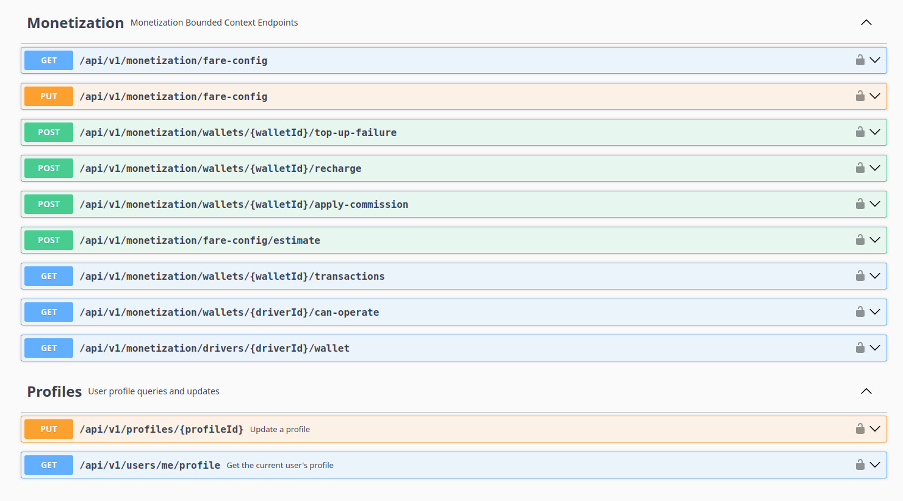
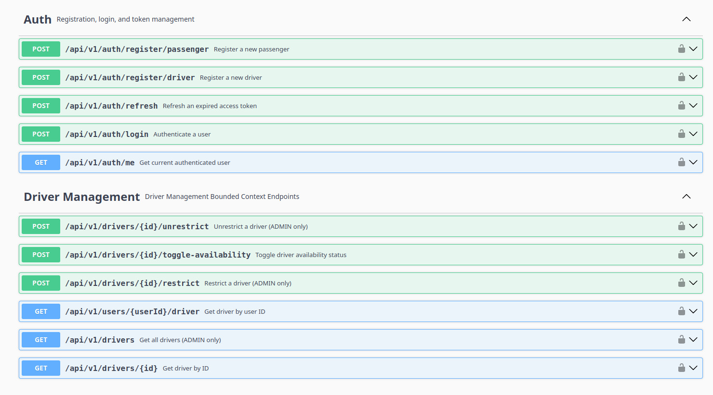

#### 5.2.3.6. Services Documentation Evidence for Sprint Review

Durante este sprint se completó el diseño e implementación completa del frontend además de agregar el backend y poder conectarlo .

**Descripción del Logro:**

- Completar en su totalidad el frontend page.
- Deployar el backend.

**Recursos del Sprint:**

| Recurso      | Acción implementada   | Método HTTP | URL / Endpoint                                                                                                            | Link de repositorio                                                                          |
| ------------ | --------------------- | ----------- | ------------------------------------------------------------------------------------------------------------------------- | -------------------------------------------------------------------------------------------- |
| Backend Page | Visualización inicial | GET         | [https://backend-webapplication-production.up.railway.app/swagger-ui/index.html](https://backend-webapplication-production.up.railway.app/swagger-ui/index.html) | [https://github.com/Startup-x-upc/Backend-WebApplication.git](https://github.com/Startup-x-upc/Backend-WebApplication.git) |

#### 5.2.3.7. Software Deployment Evidence for Sprint Review

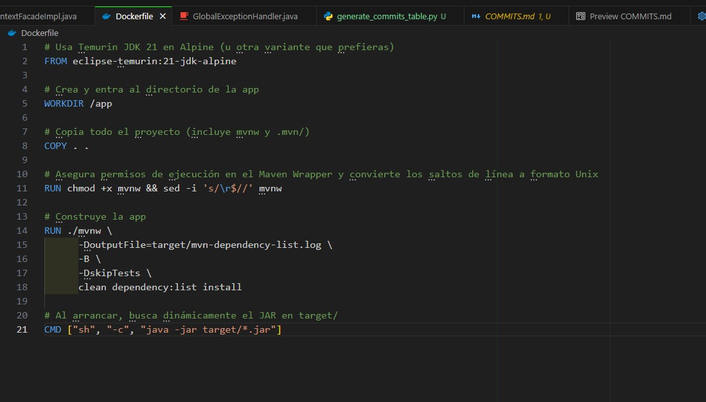
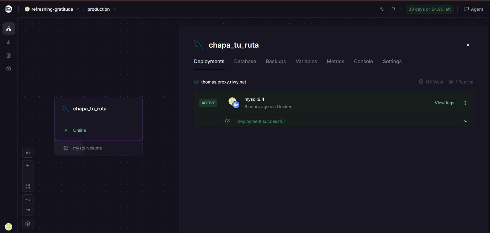
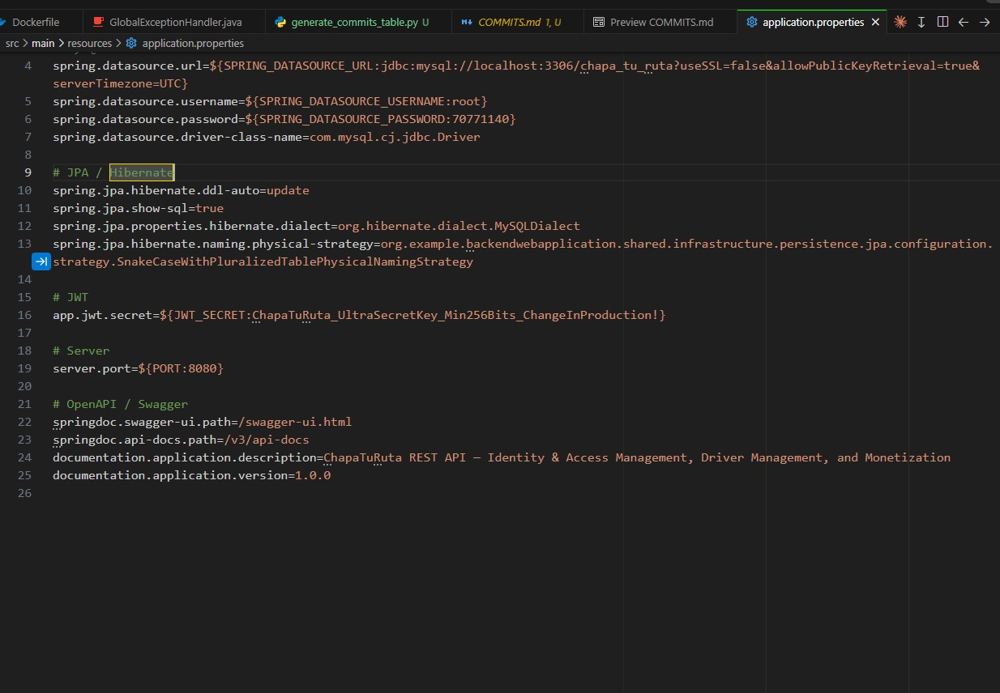
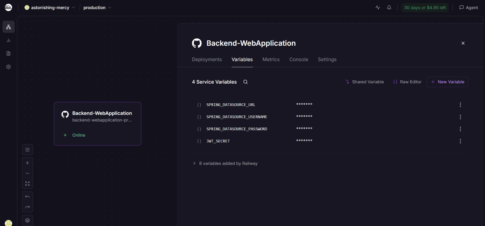
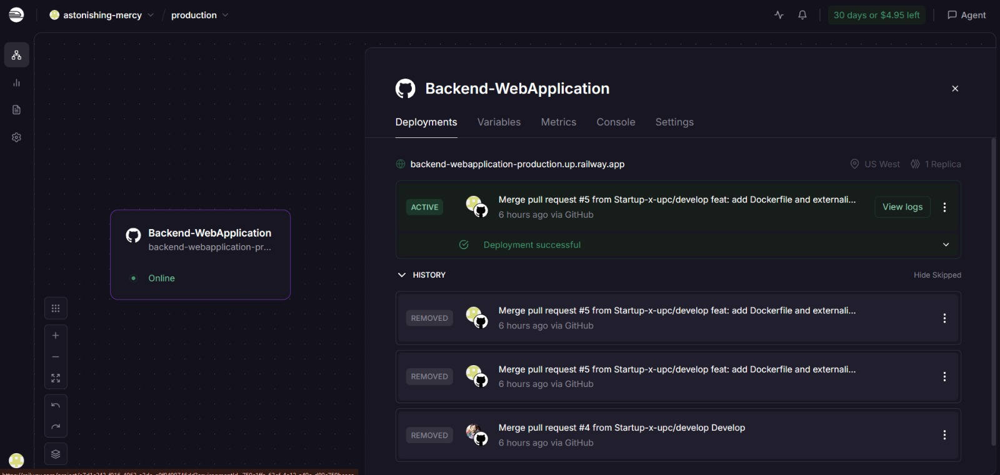

#### 5.2.3.8. Team Collaboration Insights during Sprint

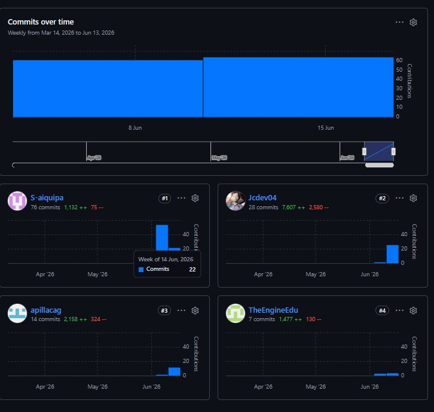

### 5.2.4. Sprint 4

#### 5.2.4.1. Sprint Planning 4
<table>
  <tbody>
    <tr>
      <td><b>Sprint #</b></td>
      <td>Sprint 4</td>
    </tr>
    <tr>
      <td colspan="2"><b>Sprint Planning Background</b></td>
    </tr>
    <tr>
      <td><b>Date</b></td>
      <td>2026-07-07</td>
    </tr>
    <tr>
      <td><b>Time</b></td>
      <td>19:37 PM (GMT-5)</td>
    </tr>
    <tr>
      <td><b>Location</b></td>
      <td>Modalidad remota mediante la plataforma Discord</td>
    </tr>
    <tr>
      <td><b>Prepared By</b></td>
      <td>Aguirre Ramos, Eduardo Manuel</td>
    </tr>
    <tr>
      <td><b>Attendees (to planning meeting)</b></td>
      <td>Castillo Vidal, Jesus Ivan / Torres Sanchez, Dalila Victoria / Aguirre Ramos, Eduardo Manuel / Pillaca Gonzales, Andy Saúl / Delgado Perez, James Caleb / Aiquipa Poma, Sebastian Andres</td>
    </tr>
    <tr>
      <td><b>Sprint 3 Review Summary</b></td>
      <td>Durante el Sprint 3 se logró implementar la mayoria de las funcionalidades del sistema ChapaTuRuta, desarrollando las secciones faltantes con respecto al avance anterior, corrigiendo videos, agregando más detalle a las historias de usuarios faltantes. El equipo cumplió con todas las tareas establecidas siguiendo los patrones DDD y hexagonal.</td>
    </tr>
    <tr>
      <td><b>Sprint 3 Retrospective Summary</b></td>
      <td>Durante el Sprint 3, el equipo logró avanzar de forma efectiva en el desarrollo del backend. Hubo contratiempos al momento de la entrega pero fue manejable. Como mejora para el siguiente sprint, se identifico correcciones al documento propio sobre links y ademas de agregar ciertas partes del desactualizadas del documento.</td>
    </tr>
    <tr>
      <td colspan="2"><b>Sprint Goal & User Stories</b></td>
    </tr>
    <tr>
      <td><b>Sprint 4 Goal</b></td>
      <td><b>Nuestro propósito es</b> tener la conexión forntend con backend al 100% y su correcto despligue para su posible presentación al público. <b>Creemos que esto aportará</b> un gran cambio a las personas que utilizan el producto satisfaciendo las necesidades del público objetivo. <b>Esto se confirmará cuando</b> obtengamos un mejor alcance y podamos identificar su eficiencia en nuestra audiencia.</td>
    </tr>
    <tr>
      <td><b>Sprint 4 Velocity</b></td>
      <td> 35 puntos</td>
    </tr>
    <tr>
      <td><b>Sum of Story Points</b></td>
      <td> 35 puntos</td>
    </tr>
  </tbody>
</table>

#### 5.2.4.2. Aspect Leaders and Collaborators
En esta sección se presenta la Leadership-and-Collaboration Matrix (LACX) correspondiente al Sprint 4. Cada aspecto se relaciona con tareas clave del sprint, asignando un líder (L) responsable principal y colaboradores (C) que apoyan en su ejecución.

<table>
  <tbody>
    <tr>
      <th>Team Member (Last Name, First Name)</th>
      <th>GitHub Username</th>
      <th> Real-Time & Geolocation Aspect (L/C)</th>
      <th> Transaction & Payment Aspect (L/C)</th>
      <th> Service Status & State Aspect (L/C)</th>
      <th> Route Logic & Map Aspect (L/C)</th>
      <th> User Experience & Flow Aspect (L/C)</th>
    </tr>
    <tr>
      <td>Castillo Vidal, Jesus Ivan</td>
      <td>Jcdev04</td>
      <td>L</td>
      <td>C</td>
      <td>C</td>
      <td>C</td>
      <td>L</td>
    </tr>
    <tr>
      <td>Torres Sanchez, Dalila Victoria</td>
      <td>DalilaTorres</td>
      <td>C</td>
      <td>C</td>
      <td>C</td>
      <td>C</td>
      <td>L</td>
    </tr>
    <tr>
      <td>Aguirre Ramos, Eduardo Manuel</td>
      <td>TheEngineEdu</td>
      <td>C</td>
      <td>C</td>
      <td>L</td>
      <td>C</td>
      <td>L</td>
    </tr>
    <tr>
      <td>Pillaca Gonzales, Andy Saúl</td>
      <td>apillacag</td>
      <td>C</td>
      <td>L</td>
      <td>C</td>
      <td>L</td>
      <td>C</td>
    </tr>
    <tr>
      <td>Aiquipa Poma, Sebastian Andres</td>
      <td>S-aiquipa</td>
      <td>L</td>
      <td>L</td>
      <td>C</td>
      <td>C</td>
      <td>L</td>
    </tr>
  </tbody>
</table>

#### 5.2.4.3. Sprint Backlog 4
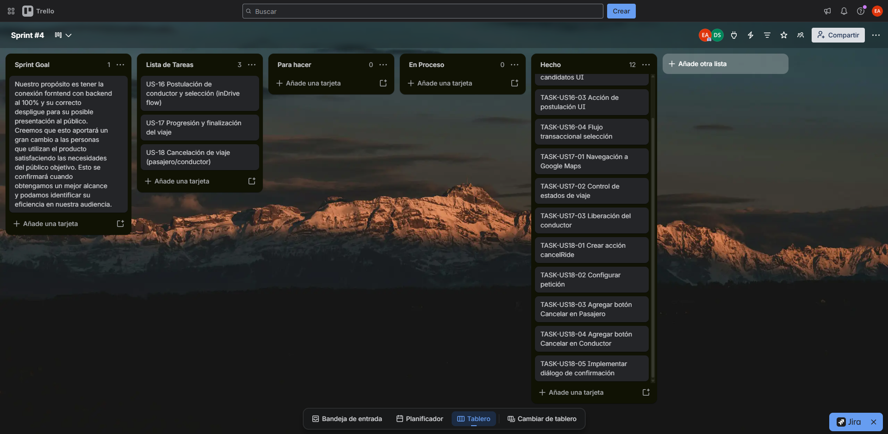

<table>
  <thead>
    <tr>
      <th>Sprint #</th>
      <th colspan="7">Sprint 4</th>
    </tr>
    <tr>
      <th colspan="2">User Story</th>
      <th colspan="6">Work-Item / Task</th>
    </tr>
    <tr>
      <th>Id</th>
      <th>Title</th>
      <th>Id</th>
      <th>Title</th>
      <th>Description</th>
      <th>Estimation (Hours)</th>
      <th>Assigned To</th>
      <th>Status (To-do / In-Process / To-Review / Done)</th>
    </tr>
  </thead>
  <tbody>
    
<tr>
      <td rowspan="4">US-16</td>
      <td rowspan="4">Postulación de conductor y selección (inDrive flow)</td>
      <td>TASK-US16-01</td>
      <td>Colección rideCandidates json</td>
      <td>Implementar colección `rideCandidates` en `db.json`.</td>
      <td>0.4</td>
      <td>Castillo Vidal, Jesus Ivan</td>
      <td>Done</td>
    </tr>
    <tr>
      <td>TASK-US16-02</td>
      <td>Lista de candidatos UI</td>
      <td>Diseñar pantalla de selección de candidatos en la UI del pasajero (`app-ride-candidates-list`).</td>
      <td>0.8</td>
      <td>Aguirre Ramos, Eduardo Manuel</td>
      <td>Done</td>
    </tr>
    <tr>
      <td>TASK-US16-03</td>
      <td>Acción de postulación UI</td>
      <td>Crear acción de postulación para el conductor en el dashboard.</td>
      <td>0.6</td>
      <td>Pillaca Gonzales, Andy Saúl</td>
      <td>Done</td>
    </tr>
    <tr>
      <td>TASK-US16-04</td>
      <td>Flujo transaccional selección</td>
      <td>Implementar flujo transaccional de selección: confirmación de solicitud + aceptación de candidato + rechazo de competidores + creación de viaje.</td>
      <td>0.9</td>
      <td>Castillo Vidal, Jesus Ivan</td>
      <td>Done</td>
    </tr>


  <tr>
      <td rowspan="3">US-17</td>
      <td rowspan="3">Progresión y finalización del viaje</td>
      <td>TASK-US17-01</td>
      <td>Navegación a Google Maps</td>
      <td>Implementar botones de navegación a Google Maps para el conductor.</td>
      <td>0.6</td>
      <td>Castillo Vidal, Jesus Ivan</td>
      <td>Done</td>
    </tr>
    <tr>
      <td>TASK-US17-02</td>
      <td>Control de estados de viaje</td>
      <td>Controlar los estados intermedios del viaje: `DRIVER_ON_THE_WAY`, `DRIVER_ARRIVED`, `STARTED`, `COMPLETED`.</td>
      <td>0.7</td>
      <td>Aiquipa Poma, Sebastian Andres</td>
      <td>Done</td>
    </tr>
    <tr>
      <td>TASK-US17-03</td>
      <td>Liberación del conductor</td>
      <td>Asegurar la liberación del conductor (`isBusy = false`) tras la finalización.</td>
      <td>0.4</td>
      <td>Castillo Vidal, Jesus Ivan</td>
      <td>Done</td>
    </tr>


<tr>
  <td rowspan="6">US-18</td>
  <td rowspan="6">Cancelación de viaje (pasajero/conductor)</td>
  <td>TASK-US18-01</td>
  <td>Crear acción cancelRide</td>
  <td>Crear acción `cancelRide(rideId, cancelledBy)` en `RideDispatchStore`.</td>
  <td>0.6</td>
  <td>Castillo Vidal, Jesus Ivan</td>
  <td>Done</td>
</tr>
<tr>
  <td>TASK-US18-02</td>
  <td>Configurar petición PATCH /rides/{id}</td>
  <td>Configurar petición `PATCH /rides/{id}` para actualizar el estado del viaje.</td>
  <td>0.5</td>
  <td>Castillo Vidal, Jesus Ivan</td>
  <td>Done</td>
</tr>
<tr>
  <td>TASK-US18-03</td>
  <td>Agregar botón Cancelar en Pasajero</td>
  <td>Agregar botón "Cancelar viaje" en la UI del pasajero al tener conductor asignado.</td>
  <td>0.4</td>
  <td>Castillo Vidal, Jesus Ivan</td>
  <td>Done</td>
</tr>
<tr>
  <td>TASK-US18-04</td>
  <td>Agregar botón Cancelar en Conductor</td>
  <td>Agregar botón "Cancelar viaje" en el dashboard del conductor durante la etapa de asignación.</td>
  <td>0.5</td>
  <td>Castillo Vidal, Jesus Ivan</td>
  <td>Done</td>
</tr>
<tr>
  <td>TASK-US18-05</td>
  <td>Implementar diálogo de confirmación</td>
  <td>Implementar diálogo de confirmación emergente.</td>
  <td>0.5</td>
  <td>Castillo Vidal, Jesus Ivan</td>
  <td>Done</td>
</tr>
<tr>
  <td>TASK-US18-06</td>
  <td>Actualizar las vistas reactivamente</td>
  <td>Actualizar las vistas correspondientes reactivamente al cancelar.</td>
  <td>0.4</td>
  <td>Castillo Vidal, Jesus Ivan</td>
  <td>Done</td>
</tr>
    </tbody>
</table>


#### 5.2.4.4. Development Evidence for Sprint Review
| Repository | Branch | Commit Id | Commit Message | Commit Message Body | Author | Commited on (Date) |
| ---------- | ------ | --------- | -------------- | ------------------- | ------ | ------------------ |
| Startup-x-upc/Backend-WebApplication | master | 234d414 | docs: update COMMITS.md and fix script encoding for special characters | Se actualizó la documentación: docs: update COMMITS.md and fix script encoding for special characters | Jesús Castillo Vidal | 08/07/2026 |
| Startup-x-upc/Backend-WebApplication | master | fcae21f | merge: merge develop into master | Se integraron los cambios de la rama: merge: merge develop into master | DalilaTorres | 08/07/2026 |
| Startup-x-upc/Backend-WebApplication | master | ff917d1 | docs: document parameterized constructor in wallet | Se actualizó la documentación: docs: document parameterized constructor in wallet | DalilaTorres | 08/07/2026 |
| Startup-x-upc/Backend-WebApplication | master | cb26e22 | docs: document default constructor in wallet | Se actualizó la documentación: docs: document default constructor in wallet | DalilaTorres | 08/07/2026 |
| Startup-x-upc/Backend-WebApplication | master | 4ec8165 | docs: add class-level javadoc to wallet aggregate | Se actualizó la documentación: docs: add class-level javadoc to wallet aggregate | DalilaTorres | 08/07/2026 |
| Startup-x-upc/Backend-WebApplication | master | 3a2c46e | docs: document calculatecommission method in farepolicy | Se actualizó la documentación: docs: document calculatecommission method in farepolicy | DalilaTorres | 08/07/2026 |
| Startup-x-upc/Backend-WebApplication | master | 55441f8 | docs: document calculate method in farepolicy | Se actualizó la documentación: docs: document calculate method in farepolicy | DalilaTorres | 08/07/2026 |
| Startup-x-upc/Backend-WebApplication | master | f92919a | docs: document configure method in farepolicy | Se actualizó la documentación: docs: document configure method in farepolicy | DalilaTorres | 08/07/2026 |
| Startup-x-upc/Backend-WebApplication | master | b3bc3f8 | docs: document parameterized constructor in farepolicy | Se actualizó la documentación: docs: document parameterized constructor in farepolicy | DalilaTorres | 08/07/2026 |
| Startup-x-upc/Backend-WebApplication | master | 0d8d59f | docs: add javadoc comments to farepolicy constructor and methods | Se actualizó la documentación: docs: add javadoc comments to farepolicy constructor and methods | DalilaTorres | 08/07/2026 |
| Startup-x-upc/Backend-WebApplication | master | a2ef9a0 | docs: add javadoc comments to farepolicy aggregate root | Se actualizó la documentación: docs: add javadoc comments to farepolicy aggregate root | DalilaTorres | 08/07/2026 |
| Startup-x-upc/Backend-WebApplication | master | 0340f7f | docs: add javadoc comments to monetizationcontextfacadeimpl | Se actualizó la documentación: docs: add javadoc comments to monetizationcontextfacadeimpl | DalilaTorres | 08/07/2026 |
| Startup-x-upc/Backend-WebApplication | master | 2e6bbf9 | fix:Solving Applications Errors | Se corrigió el error: fix:Solving Applications Errors | TheEngineEdu | 08/07/2026 |
| Startup-x-upc/Backend-WebApplication | master | b4adc0b | fix:Solving problem with cancelled ride | Se corrigió el error: fix:Solving problem with cancelled ride | TheEngineEdu | 08/07/2026 |
| Startup-x-upc/Backend-WebApplication | master | 6a69f59 | feat:Added SecurityConfig | Se implementó la funcionalidad: feat:Added SecurityConfig | TheEngineEdu | 07/07/2026 |
| Startup-x-upc/Backend-WebApplication | master | 44597f9 | feat:Added refreshTokenRepository | Se implementó la funcionalidad: feat:Added refreshTokenRepository | TheEngineEdu | 07/07/2026 |
| Startup-x-upc/Backend-WebApplication | master | 5c2c8c7 | feat:Added refreshToken | Se implementó la funcionalidad: feat:Added refreshToken | TheEngineEdu | 07/07/2026 |
| Startup-x-upc/Backend-WebApplication | master | 9b68f84 | fix: Find and resolve issues in JwtService | Se corrigió el error: fix: Find and resolve issues in JwtService | TheEngineEdu | 07/07/2026 |
| Startup-x-upc/Backend-WebApplication | master | ba0c8b7 | feat:Added JwtAthentication | Se implementó la funcionalidad: feat:Added JwtAthentication | TheEngineEdu | 07/07/2026 |
| Startup-x-upc/Backend-WebApplication | master | 20b0f9f | modify and improve handleIllegalArgumentException | Se actualizó el repositorio: modify and improve handleIllegalArgumentException | apillacag | 07/07/2026 |
| Startup-x-upc/Backend-WebApplication | master | 3321948 | fix problems in GlobalExceptionHandler | Se actualizó el repositorio: fix problems in GlobalExceptionHandler | apillacag | 07/07/2026 |
| Startup-x-upc/Backend-WebApplication | master | 5dbdef0 | add comments for documentation | Se actualizó el repositorio: add comments for documentation | apillacag | 07/07/2026 |
| Startup-x-upc/Backend-WebApplication | master | ab7f574 | fix module in GlobalExceptionHandler | Se actualizó el repositorio: fix module in GlobalExceptionHandler | apillacag | 07/07/2026 |
| Startup-x-upc/Backend-WebApplication | master | 402c665 | add resolveMessageorDefault | Se actualizó el repositorio: add resolveMessageorDefault | apillacag | 07/07/2026 |
| Startup-x-upc/Backend-WebApplication | master | b5e173c | remove and ignore innecesary module | Se actualizó el repositorio: remove and ignore innecesary module | apillacag | 07/07/2026 |
| Startup-x-upc/Backend-WebApplication | master | e6398c5 | add toLocalizedMessageWithFallback in ErrorResponseAssembler | Se actualizó el repositorio: add toLocalizedMessageWithFallback in ErrorResponseAssembler | apillacag | 07/07/2026 |
| Startup-x-upc/Backend-WebApplication | master | 7a8032d | remove an innecesary module | Se actualizó el repositorio: remove an innecesary module | apillacag | 07/07/2026 |
| Startup-x-upc/Backend-WebApplication | master | 0d796b0 | add new comments | Se actualizó el repositorio: add new comments | apillacag | 07/07/2026 |
| Startup-x-upc/Backend-WebApplication | master | 1f2ab13 | remove unnecessary comments | Se actualizó el repositorio: remove unnecessary comments | apillacag | 07/07/2026 |
| Startup-x-upc/Backend-WebApplication | master | b16d541 | Merge branch 'master' of https://github.com/Startup-x-upc/Backend-WebApplication | Se integraron los cambios de la rama: Merge branch 'master' of https://github.com/Startup-x-upc/Backend-WebApplication | Jesús Castillo Vidal | 07/07/2026 |
| Startup-x-upc/Backend-WebApplication | master | d80596f | feat: audit driver restrictions, add real-time disabled notification, and update OpenAPI server URL | Se implementó la funcionalidad: feat: audit driver restrictions, add real-time disabled notification, and update OpenAPI server URL | Jesús Castillo Vidal | 07/07/2026 |
| Startup-x-upc/Backend-WebApplication | master | e649379 | Merge pull request #7 from Startup-x-upc/develop | Se integraron los cambios de la rama: Merge pull request #7 from Startup-x-upc/develop | Jesus Ivan Castillo Vidal | 06/07/2026 |
| Startup-x-upc/Backend-WebApplication | master | 5d2686f | Merge branch 'feature/ride-dispatch' into develop | Se integraron los cambios de la rama: Merge branch 'feature/ride-dispatch' into develop | Jesús Castillo Vidal | 06/07/2026 |
| Startup-x-upc/Backend-WebApplication | master | cd50b6a | feat: broadcast request lifecycle and reputation events via Ably | Se implementó la funcionalidad: feat: broadcast request lifecycle and reputation events via Ably | Jesús Castillo Vidal | 06/07/2026 |
| Startup-x-upc/Backend-WebApplication | master | 71db601 | feat: implement ride dispatch core functionality including ride request creation, candidate application, and selection services | Se implementó la funcionalidad: feat: implement ride dispatch core functionality including ride request creation, candidate application, and selection services | Jesús Castillo Vidal | 06/07/2026 |
| Startup-x-upc/Backend-WebApplication | master | 76ff202 | feat: implement JWT authentication filter and REST controllers for ride management and documentation | Se implementó la funcionalidad: feat: implement JWT authentication filter and REST controllers for ride management and documentation | Jesús Castillo Vidal | 05/07/2026 |
| Startup-x-upc/Backend-WebApplication | master | 44474f8 | fix: add role guards to MonetizationController and map FORBIDDEN/UNAUTHORIZED to correct HTTP status | Se corrigió el error: fix: add role guards to MonetizationController and map FORBIDDEN/UNAUTHORIZED to correct HTTP status | Jesús Castillo Vidal | 04/07/2026 |
| Startup-x-upc/Backend-WebApplication | master | 3ccd55f | feat: implement Ride and RideRequest aggregates and integrate Ably for real-time event publishing | Se implementó la funcionalidad: feat: implement Ride and RideRequest aggregates and integrate Ably for real-time event publishing | Jesús Castillo Vidal | 04/07/2026 |
| Startup-x-upc/Backend-WebApplication | master | e9f1e72 | feat: implement Ably integration for real-time event broadcasting using domain events | Se implementó la funcionalidad: feat: implement Ably integration for real-time event broadcasting using domain events | Jesús Castillo Vidal | 04/07/2026 |
| Startup-x-upc/Backend-WebApplication | master | 9ab962d | feat: implement trust and reputation module with rating management, query services, and domain event handling | Se implementó la funcionalidad: feat: implement trust and reputation module with rating management, query services, and domain event handling | Jesús Castillo Vidal | 26/06/2026 |
| Startup-x-upc/Backend-WebApplication | master | f36c872 | fix: implement MonetizationQueryServiceImpl to handle fare calculations, wallet retrieval, and operational checks | Se corrigió el error: fix: implement MonetizationQueryServiceImpl to handle fare calculations, wallet retrieval, and operational checks | Jesús Castillo Vidal | 26/06/2026 |
| Startup-x-upc/Backend-WebApplication | master | 543566a | Merge pull request #6 from Startup-x-upc/develop | Se integraron los cambios de la rama: Merge pull request #6 from Startup-x-upc/develop | Jesus Ivan Castillo Vidal | 19/06/2026 |
| Startup-x-upc/Backend-WebApplication | master | f1f267d | feat: include author information in generated commit tables | Se implementó la funcionalidad: feat: include author information in generated commit tables | Jesús Castillo Vidal | 19/06/2026 |
| Startup-x-upc/Backend-WebApplication | master | 486b219 | chore: add automated commit history tracking and generation script | Se realizó una tarea de mantenimiento: chore: add automated commit history tracking and generation script | Jesús Castillo Vidal | 19/06/2026 |
| Startup-x-upc/Backend-WebApplication | master | 90efdc4 | hotfix:Change the userQueryService | Se actualizó el repositorio: hotfix:Change the userQueryService | TheEngineEdu | 19/06/2026 |
| Startup-x-upc/Backend-WebApplication | master | 972ab56 | feat:Added UserCommandService | Se implementó la funcionalidad: feat:Added UserCommandService | TheEngineEdu | 19/06/2026 |
| Startup-x-upc/Backend-WebApplication | master | 344969b | feat:Added IAMContextFacade | Se implementó la funcionalidad: feat:Added IAMContextFacade | TheEngineEdu | 19/06/2026 |
| Startup-x-upc/Backend-WebApplication | master | 3b30889 | feat:Added domainAggregate | Se implementó la funcionalidad: feat:Added domainAggregate | TheEngineEdu | 19/06/2026 |
| Startup-x-upc/Backend-WebApplication | master | 4176e1b | feat: add resolvemessagedeafult in globalexceptionhandler | Se implementó la funcionalidad: feat: add resolvemessagedeafult in globalexceptionhandler | apillacag | 19/06/2026 |
| Startup-x-upc/Backend-WebApplication | master | 69160f3 | fix: correct a thing in GlobalExceptionHandler | Se corrigió el error: fix: correct a thing in GlobalExceptionHandler | apillacag | 19/06/2026 |
| Startup-x-upc/Backend-WebApplication | master | 58a32a5 | feat: add validationError. Important | Se implementó la funcionalidad: feat: add validationError. Important | apillacag | 19/06/2026 |
| Startup-x-upc/Backend-WebApplication | master | eab31f0 | fix: fix fatal error in shared | Se corrigió el error: fix: fix fatal error in shared | apillacag | 19/06/2026 |
| Startup-x-upc/Backend-WebApplication | master | 12edec2 | feat: add unexpected in shared | Se implementó la funcionalidad: feat: add unexpected in shared | apillacag | 19/06/2026 |
| Startup-x-upc/Backend-WebApplication | master | cc7ab56 | fix: eliminate a method in shared | Se corrigió el error: fix: eliminate a method in shared | apillacag | 19/06/2026 |
| Startup-x-upc/Backend-WebApplication | master | ffd2c14 | feat: implement conflict error in shared | Se implementó la funcionalidad: feat: implement conflict error in shared | apillacag | 18/06/2026 |
| Startup-x-upc/Backend-WebApplication | master | b52f273 | fix: improve ApplicationError | Se corrigió el error: fix: improve ApplicationError | apillacag | 18/06/2026 |
| Startup-x-upc/Backend-WebApplication | master | 9f4458c | feat: add getfullnamebyuserid | Se implementó la funcionalidad: feat: add getfullnamebyuserid | apillacag | 18/06/2026 |
| Startup-x-upc/Backend-WebApplication | master | eb30618 | fix: erase a litle problem in IAM | Se corrigió el error: fix: erase a litle problem in IAM | apillacag | 18/06/2026 |
| Startup-x-upc/Backend-WebApplication | master | a0c0f82 | feat: add more funtionalities to IAM | Se implementó la funcionalidad: feat: add more funtionalities to IAM | apillacag | 18/06/2026 |
| Startup-x-upc/Backend-WebApplication | master | 1433ef1 | fix: correct fatal error in iam | Se corrigió el error: fix: correct fatal error in iam | apillacag | 18/06/2026 |
| Startup-x-upc/Backend-WebApplication | master | 3ea0e63 | Merge pull request #5 from Startup-x-upc/develop | Se integraron los cambios de la rama: Merge pull request #5 from Startup-x-upc/develop | tindivo | 18/06/2026 |
| Startup-x-upc/Backend-WebApplication | master | f6410eb | feat: add Dockerfile and externalized database configuration properties for backend service | Se implementó la funcionalidad: feat: add Dockerfile and externalized database configuration properties for backend service | Jesús Castillo Vidal | 18/06/2026 |
| Startup-x-upc/Backend-WebApplication | master | 83507f2 | Merge pull request #4 from Startup-x-upc/develop | Se integraron los cambios de la rama: Merge pull request #4 from Startup-x-upc/develop | Jesus Ivan Castillo Vidal | 18/06/2026 |
| Startup-x-upc/Backend-WebApplication | master | 63bba7d | fix(ridedispatch): fix SelectCandidateCommand parameter order | Se corrigió el error: fix(ridedispatch): fix SelectCandidateCommand parameter order | Jesús Castillo Vidal | 18/06/2026 |
| Startup-x-upc/Backend-WebApplication | master | c532e77 | test(ridedispatch): add RideCommandServiceImplTest unit tests | Se agregaron/modificaron pruebas: test(ridedispatch): add RideCommandServiceImplTest unit tests | Jesús Castillo Vidal | 18/06/2026 |
| Startup-x-upc/Backend-WebApplication | master | d23c672 | feat(ridedispatch): add DriverAvailabilityChangedEventListener to synchronize driver availability status | Se implementó la funcionalidad: feat(ridedispatch): add DriverAvailabilityChangedEventListener to synchronize driver availability status | Jesús Castillo Vidal | 18/06/2026 |
| Startup-x-upc/Backend-WebApplication | master | 4095156 | feat(ridedispatch): implement REST controller, resource DTOs, and resource assembler | Se implementó la funcionalidad: feat(ridedispatch): implement REST controller, resource DTOs, and resource assembler | Jesús Castillo Vidal | 18/06/2026 |
| Startup-x-upc/Backend-WebApplication | master | c1f7f70 | feat(iam): expose getPhotoUrlByUserId via facade | Se implementó la funcionalidad: feat(iam): expose getPhotoUrlByUserId via facade | Jesús Castillo Vidal | 18/06/2026 |
| Startup-x-upc/Backend-WebApplication | master | a11bbd3 | feat(ridedispatch): add domain aggregates, command/query services, and integration listeners | Se implementó la funcionalidad: feat(ridedispatch): add domain aggregates, command/query services, and integration listeners | Jesús Castillo Vidal | 18/06/2026 |
| Startup-x-upc/Backend-WebApplication | master | e415954 | feat(drivermanagement): expose getDriverIdByUserId via facade | Se implementó la funcionalidad: feat(drivermanagement): expose getDriverIdByUserId via facade | Jesús Castillo Vidal | 18/06/2026 |
| Startup-x-upc/Backend-WebApplication | master | 1864890 | feat(ridedispatch): implement repository adapters | Se implementó la funcionalidad: feat(ridedispatch): implement repository adapters | Jesús Castillo Vidal | 18/06/2026 |
| Startup-x-upc/Backend-WebApplication | master | e517441 | feat(ridedispatch): add Spring Data JPA repositories | Se implementó la funcionalidad: feat(ridedispatch): add Spring Data JPA repositories | Jesús Castillo Vidal | 18/06/2026 |
| Startup-x-upc/Backend-WebApplication | master | 8fb1e20 | feat(ridedispatch): implement JPA entities and persistence assemblers | Se implementó la funcionalidad: feat(ridedispatch): implement JPA entities and persistence assemblers | Jesús Castillo Vidal | 18/06/2026 |
| Startup-x-upc/Backend-WebApplication | master | 20b0762 | refactor(drivermanagement): remove currentLocation and simplify availability toggle response | Se refactorizó el código: refactor(drivermanagement): remove currentLocation and simplify availability toggle response | Jesús Castillo Vidal | 18/06/2026 |
| Startup-x-upc/Backend-WebApplication | master | 3ad5339 | feat(shared): map new drivermanagement error codes to corresponding HTTP statuses | Se implementó la funcionalidad: feat(shared): map new drivermanagement error codes to corresponding HTTP statuses | Jesús Castillo Vidal | 18/06/2026 |
| Startup-x-upc/Backend-WebApplication | master | 2b9b330 | feat(drivermanagement): implement drivermanagement bounded context and availability checks | Se implementó la funcionalidad: feat(drivermanagement): implement drivermanagement bounded context and availability checks | Jesús Castillo Vidal | 18/06/2026 |
| Startup-x-upc/Backend-WebApplication | master | f70fc19 | refactor(monetization): cleanup block/unblock endpoints, move event generation to domain | Se refactorizó el código: refactor(monetization): cleanup block/unblock endpoints, move event generation to domain | Jesús Castillo Vidal | 18/06/2026 |
| Startup-x-upc/Backend-WebApplication | master | dc4e5de | fix(monetization): query wallet by walletId instead of driverId in transaction history query | Se corrigió el error: fix(monetization): query wallet by walletId instead of driverId in transaction history query | Jesús Castillo Vidal | 18/06/2026 |
| Startup-x-upc/Backend-WebApplication | master | 54dcd3c | refactor(iam): prefix auth and profile REST endpoints with /api/v1 and update security path matchers | Se refactorizó el código: refactor(iam): prefix auth and profile REST endpoints with /api/v1 and update security path matchers | Jesús Castillo Vidal | 18/06/2026 |
| Startup-x-upc/Backend-WebApplication | master | 2229d89 | fix(monetization): retrieve existing entity ID before saving to prevent duplicate key constraint on update | Se corrigió el error: fix(monetization): retrieve existing entity ID before saving to prevent duplicate key constraint on update | Jesús Castillo Vidal | 18/06/2026 |
| Startup-x-upc/Backend-WebApplication | master | d9f4c4a | refactor(monetization): make persistence assemblers null-safe for legacy database records | Se refactorizó el código: refactor(monetization): make persistence assemblers null-safe for legacy database records | Jesús Castillo Vidal | 18/06/2026 |
| Startup-x-upc/Backend-WebApplication | master | 9541998 | refactor(monetization): split application services into interfaces and internal implementations | Se refactorizó el código: refactor(monetization): split application services into interfaces and internal implementations | Jesús Castillo Vidal | 18/06/2026 |
| Startup-x-upc/Backend-WebApplication | master | 7461ff0 | refactor(monetization): move JPA repository implementations to adapters package | Se refactorizó el código: refactor(monetization): move JPA repository implementations to adapters package | Jesús Castillo Vidal | 18/06/2026 |
| Startup-x-upc/Backend-WebApplication | master | f06cf56 | refactor(monetization): rename and move REST response assemblers to transform package | Se refactorizó el código: refactor(monetization): rename and move REST response assemblers to transform package | Jesús Castillo Vidal | 18/06/2026 |
| Startup-x-upc/Backend-WebApplication | master | 42ad1e6 | feat(monetization): update controller endpoints to align with frontend resource models and estimated fare check | Se implementó la funcionalidad: feat(monetization): update controller endpoints to align with frontend resource models and estimated fare check | Jesús Castillo Vidal | 18/06/2026 |
| Startup-x-upc/Backend-WebApplication | master | 6590eed | feat(monetization): implement ACL integration for driver registration | Se implementó la funcionalidad: feat(monetization): implement ACL integration for driver registration | Jesús Castillo Vidal | 18/06/2026 |
| Startup-x-upc/Backend-WebApplication | master | f00b0a7 | feat: implement monetization domain services, entities, and persistence layer for fare policies and wallet transactions | Se implementó la funcionalidad: feat: implement monetization domain services, entities, and persistence layer for fare policies and wallet transactions | Jesús Castillo Vidal | 18/06/2026 |
| Startup-x-upc/Backend-WebApplication | master | c8ef2c6 | refactor: Updating monetization's name | Se refactorizó el código: refactor: Updating monetization's name | Jesús Castillo Vidal | 18/06/2026 |
| Startup-x-upc/Backend-WebApplication | master | 86b178a | fix(iam): migrate UUID columns to VARCHAR(36), fix UPDATE vs INSERT, and polish Swagger docs   Persistence:   - Change all UUID columns to VARCHAR(36) across IAM and Monetization     entities to prevent BINARY(16) padding issues in MySQL   - Update JPA repositories, assemblers, and adapters with String conversion   - Fix save() in UserRepositoryImpl and ProfileRepositoryImpl to preserve     the internal Long id from existing entities so JPA issues UPDATE     instead of INSERT on subsequent saves   - Publish domain events explicitly via ApplicationEventPublisher in     UserRepositoryImpl and WalletRepositoryImpl | Se corrigió el error: fix(iam): migrate UUID columns to VARCHAR(36), fix UPDATE vs INSERT, and polish Swagger docs   Persistence:   - Change all UUID columns to VARCHAR(36) across IAM and Monetization     entities to prevent BINARY(16) padding issues in MySQL   - Update JPA repositories, assemblers, and adapters with String conversion   - Fix save() in UserRepositoryImpl and ProfileRepositoryImpl to preserve     the internal Long id from existing entities so JPA issues UPDATE     instead of INSERT on subsequent saves   - Publish domain events explicitly via ApplicationEventPublisher in     UserRepositoryImpl and WalletRepositoryImpl | Jesús Castillo Vidal | 16/06/2026 |
| Startup-x-upc/Backend-WebApplication | master | e996159 | fix(iam): resolving inconsistency with UUID from JPA to MYSQL | Se corrigió el error: fix(iam): resolving inconsistency with UUID from JPA to MYSQL | Jesús Castillo Vidal | 16/06/2026 |
| Startup-x-upc/Backend-WebApplication | master | 32b46ab | fix(iam): add Swagger JWT auth scheme and remove redundant check-email endpoint | Se corrigió el error: fix(iam): add Swagger JWT auth scheme and remove redundant check-email endpoint | Jesús Castillo Vidal | 16/06/2026 |
| Startup-x-upc/Backend-WebApplication | master | 67a930e | feat(iam): implement Anti-Corruption Layer facade for IAM bounded context access | Se implementó la funcionalidad: feat(iam): implement Anti-Corruption Layer facade for IAM bounded context access | Jesús Castillo Vidal | 16/06/2026 |
| Startup-x-upc/Backend-WebApplication | master | e705806 | feat: implement JPA repository adapters for Wallet and User aggregates with explicit domain event publishing | Se implementó la funcionalidad: feat: implement JPA repository adapters for Wallet and User aggregates with explicit domain event publishing | Jesús Castillo Vidal | 16/06/2026 |
| Startup-x-upc/Backend-WebApplication | master | cdc1326 | feat(iam): The user wants me to suggest a good commit message for all the work done so far. Let me summarize what was accomplished: 1. Deleted all existing IAM code   - ProfilesController: GET /users/me/profile, PUT /profiles/{profileId}   - Immutable record resources with Jakarta Validation + OpenAPI @Schema | Se implementó la funcionalidad: feat(iam): The user wants me to suggest a good commit message for all the work done so far. Let me summarize what was accomplished: 1. Deleted all existing IAM code   - ProfilesController: GET /users/me/profile, PUT /profiles/{profileId}   - Immutable record resources with Jakarta Validation + OpenAPI @Schema | Jesús Castillo Vidal | 16/06/2026 |
| Startup-x-upc/Backend-WebApplication | master | f07327c | feat: implement Identity and Access Management (IAM) bounded context with domain models, repositories, and persistence infrastructure. | Se implementó la funcionalidad: feat: implement Identity and Access Management (IAM) bounded context with domain models, repositories, and persistence infrastructure. | Jesús Castillo Vidal | 16/06/2026 |
| Startup-x-upc/Backend-WebApplication | master | a15065a | docs: add architecture analysis guide and update project dependencies in pom.xml | Se actualizó la documentación: docs: add architecture analysis guide and update project dependencies in pom.xml | Jesús Castillo Vidal | 16/06/2026 |
| Startup-x-upc/Backend-WebApplication | master | 9d31a68 | feat: update monetization bounded context with commissionRate and API spec alignment | Se implementó la funcionalidad: feat: update monetization bounded context with commissionRate and API spec alignment | S-aiquipa | 16/06/2026 |
| Startup-x-upc/Backend-WebApplication | master | 0eb7fc2 | refactor(monetization): map walletId field in WalletPersistenceAssembler | Se refactorizó el código: refactor(monetization): map walletId field in WalletPersistenceAssembler | sebastian | 16/06/2026 |
| Startup-x-upc/Backend-WebApplication | master | 04ef111 | feat(monetization): add walletId field to WalletPersistenceEntity with unique constraint | Se implementó la funcionalidad: feat(monetization): add walletId field to WalletPersistenceEntity with unique constraint | sebastian | 16/06/2026 |
| Startup-x-upc/Backend-WebApplication | master | a3aeec2 | refactor(monetization): remove unused driverId field from ApplyCommissionResource | Se refactorizó el código: refactor(monetization): remove unused driverId field from ApplyCommissionResource | sebastian | 16/06/2026 |
| Startup-x-upc/Backend-WebApplication | master | 1a00eeb | refactor(monetization): remove unused driverId field from TopUpFailureResource | Se refactorizó el código: refactor(monetization): remove unused driverId field from TopUpFailureResource | sebastian | 16/06/2026 |
| Startup-x-upc/Backend-WebApplication | master | 25243dc | refactor(monetization): remove unused driverId field from TopUpWalletResource | Se refactorizó el código: refactor(monetization): remove unused driverId field from TopUpWalletResource | sebastian | 16/06/2026 |
| Startup-x-upc/Backend-WebApplication | master | 1d9809e | feat(monetization): add findByWalletId method to WalletRepositoryImpl | Se implementó la funcionalidad: feat(monetization): add findByWalletId method to WalletRepositoryImpl | sebastian | 16/06/2026 |
| Startup-x-upc/Backend-WebApplication | master | 24537bf | feat(monetization): add findByWalletId method to WalletJpaRepository | Se implementó la funcionalidad: feat(monetization): add findByWalletId method to WalletJpaRepository | sebastian | 16/06/2026 |
| Startup-x-upc/Backend-WebApplication | master | 4381afe | feat(monetization): add findByWalletId method to WalletRepository | Se implementó la funcionalidad: feat(monetization): add findByWalletId method to WalletRepository | sebastian | 16/06/2026 |
| Startup-x-upc/Backend-WebApplication | master | 9061233 | refactor(monetization): improve wallet balance calculations, enforce rounding policies, and add @Transactional to wallet operations | Se refactorizó el código: refactor(monetization): improve wallet balance calculations, enforce rounding policies, and add @Transactional to wallet operations | sebastian | 16/06/2026 |
| Startup-x-upc/Backend-WebApplication | master | 74cd0a7 | refactor(monetization): rename driverId to walletId in ApplyRideCommissionCommand | Se refactorizó el código: refactor(monetization): rename driverId to walletId in ApplyRideCommissionCommand | sebastian | 16/06/2026 |
| Startup-x-upc/Backend-WebApplication | master | 96a1c02 | refactor(monetization): rename driverId to walletId in RegisterTopUpFailureCommand | Se refactorizó el código: refactor(monetization): rename driverId to walletId in RegisterTopUpFailureCommand | sebastian | 16/06/2026 |
| Startup-x-upc/Backend-WebApplication | master | 8219beb | refactor(monetization): rename driverId to walletId in TopUpWalletCommand | Se refactorizó el código: refactor(monetization): rename driverId to walletId in TopUpWalletCommand | sebastian | 16/06/2026 |
| Startup-x-upc/Backend-WebApplication | master | d4deddf | refactor(monetization): update API endpoints for Fare Config and Wallet management | Se refactorizó el código: refactor(monetization): update API endpoints for Fare Config and Wallet management | sebastian | 16/06/2026 |
| Startup-x-upc/Backend-WebApplication | master | 40cf696 | feat(monetization): pass commissionRate to ConfigureFarePolicyCommand | Se implementó la funcionalidad: feat(monetization): pass commissionRate to ConfigureFarePolicyCommand | sebastian | 16/06/2026 |
| Startup-x-upc/Backend-WebApplication | master | b28c52e | feat(monetization): update FarePolicy configuration to handle commissionRate | Se implementó la funcionalidad: feat(monetization): update FarePolicy configuration to handle commissionRate | sebastian | 16/06/2026 |
| Startup-x-upc/Backend-WebApplication | master | 2077cd6 | feat(monetization): add commissionRate field to ConfigureFarePolicyResource | Se implementó la funcionalidad: feat(monetization): add commissionRate field to ConfigureFarePolicyResource | sebastian | 16/06/2026 |
| Startup-x-upc/Backend-WebApplication | master | 89b9eb2 | feat(monetization): add commissionRate field to ConfigureFarePolicyCommand | Se implementó la funcionalidad: feat(monetization): add commissionRate field to ConfigureFarePolicyCommand | sebastian | 16/06/2026 |
| Startup-x-upc/Backend-WebApplication | master | bb503cd | feat(monetization): map commissionRate in FarePolicyResponseAssembler | Se implementó la funcionalidad: feat(monetization): map commissionRate in FarePolicyResponseAssembler | sebastian | 16/06/2026 |
| Startup-x-upc/Backend-WebApplication | master | 300542d | feat(monetization): add commissionRate field to FarePolicyResponse | Se implementó la funcionalidad: feat(monetization): add commissionRate field to FarePolicyResponse | sebastian | 16/06/2026 |
| Startup-x-upc/Backend-WebApplication | master | 31bdc0a | feat(monetization): map commissionRate in FarePolicyPersistenceAssembler | Se implementó la funcionalidad: feat(monetization): map commissionRate in FarePolicyPersistenceAssembler | sebastian | 16/06/2026 |
| Startup-x-upc/Backend-WebApplication | master | 7df410a | feat(monetization): add commissionRate field to FarePolicyPersistenceEntity with setter method | Se implementó la funcionalidad: feat(monetization): add commissionRate field to FarePolicyPersistenceEntity with setter method | sebastian | 16/06/2026 |
| Startup-x-upc/Backend-WebApplication | master | d917131 | feat(monetization): add commission rate to FarePolicy and calculateCommission method | Se implementó la funcionalidad: feat(monetization): add commission rate to FarePolicy and calculateCommission method | sebastian | 16/06/2026 |
| Startup-x-upc/Backend-WebApplication | master | f4c621b | Merge pull request #2 from Startup-x-upc/feat/monetization | Se integraron los cambios de la rama: Merge pull request #2 from Startup-x-upc/feat/monetization | S-aiquipa | 13/06/2026 |
| Startup-x-upc/Backend-WebApplication | master | 04552e0 | feat(monetization): add package declaration to Wallet aggregate | Se implementó la funcionalidad: feat(monetization): add package declaration to Wallet aggregate | sebastian | 13/06/2026 |
| Startup-x-upc/Backend-WebApplication | master | ca97f2e | feat(monetization): extend WalletTransactionPersistenceEntity from AuditableAbstractPersistenceEntity and add Lombok @Getter | Se implementó la funcionalidad: feat(monetization): extend WalletTransactionPersistenceEntity from AuditableAbstractPersistenceEntity and add Lombok @Getter | sebastian | 13/06/2026 |
| Startup-x-upc/Backend-WebApplication | master | 25f2d1d | feat(monetization): extend WalletPersistenceEntity from AuditableAbstractPersistenceEntity and add Lombok @Getter | Se implementó la funcionalidad: feat(monetization): extend WalletPersistenceEntity from AuditableAbstractPersistenceEntity and add Lombok @Getter | sebastian | 13/06/2026 |
| Startup-x-upc/Backend-WebApplication | master | ef222f4 | feat(monetization): extend FarePolicyPersistenceEntity from AuditableAbstractPersistenceEntity and add Lombok @Getter | Se implementó la funcionalidad: feat(monetization): extend FarePolicyPersistenceEntity from AuditableAbstractPersistenceEntity and add Lombok @Getter | sebastian | 13/06/2026 |
| Startup-x-upc/Backend-WebApplication | master | 9320667 | Merge remote-tracking branch 'origin/develop' into feat/monetization | Se integraron los cambios de la rama: Merge remote-tracking branch 'origin/develop' into feat/monetization | sebastian | 13/06/2026 |
| Startup-x-upc/Backend-WebApplication | master | ae41218 | feat(monetization): extend FarePolicy from AbstractDomainAggregateRoot | Se implementó la funcionalidad: feat(monetization): extend FarePolicy from AbstractDomainAggregateRoot | sebastian | 13/06/2026 |
| Startup-x-upc/Backend-WebApplication | master | cd9b58b | feat(monetization): add MonetizationController to expose REST endpoints for fare policy and wallet operations | Se implementó la funcionalidad: feat(monetization): add MonetizationController to expose REST endpoints for fare policy and wallet operations | sebastian | 13/06/2026 |
| Startup-x-upc/Backend-WebApplication | master | 703771a | feat(monetization): add WalletTransactionResponseAssembler for assembling wallet transaction responses | Se implementó la funcionalidad: feat(monetization): add WalletTransactionResponseAssembler for assembling wallet transaction responses | sebastian | 13/06/2026 |
| Startup-x-upc/Backend-WebApplication | master | 9a96443 | feat(monetization): add WalletResponseAssembler for assembling wallet response data | Se implementó la funcionalidad: feat(monetization): add WalletResponseAssembler for assembling wallet response data | sebastian | 13/06/2026 |
| Startup-x-upc/Backend-WebApplication | master | 4452a63 | feat(monetization): add FarePolicyResponseAssembler for assembling fare policy and quote responses | Se implementó la funcionalidad: feat(monetization): add FarePolicyResponseAssembler for assembling fare policy and quote responses | sebastian | 13/06/2026 |
| Startup-x-upc/Backend-WebApplication | master | c5cdc73 | feat(monetization): add CanOperateResponse for representing driver's operation eligibility | Se implementó la funcionalidad: feat(monetization): add CanOperateResponse for representing driver's operation eligibility | sebastian | 13/06/2026 |
| Startup-x-upc/Backend-WebApplication | master | 4dd603b | feat(monetization): add WalletTransactionResponse for representing wallet transaction data | Se implementó la funcionalidad: feat(monetization): add WalletTransactionResponse for representing wallet transaction data | sebastian | 13/06/2026 |
| Startup-x-upc/Backend-WebApplication | master | ee4553a | feat(monetization): add WalletResponse for representing wallet response data | Se implementó la funcionalidad: feat(monetization): add WalletResponse for representing wallet response data | sebastian | 13/06/2026 |
| Startup-x-upc/Backend-WebApplication | master | 27e0262 | feat(monetization): add FareQuoteResponse for representing fare quote response data | Se implementó la funcionalidad: feat(monetization): add FareQuoteResponse for representing fare quote response data | sebastian | 13/06/2026 |
| Startup-x-upc/Backend-WebApplication | master | f7061a1 | feat(monetization): add FarePolicyResponse for representing fare policy response data | Se implementó la funcionalidad: feat(monetization): add FarePolicyResponse for representing fare policy response data | sebastian | 13/06/2026 |
| Startup-x-upc/Backend-WebApplication | master | affa3c5 | feat(monetization): add ApplyCommissionResource for handling commission application data | Se implementó la funcionalidad: feat(monetization): add ApplyCommissionResource for handling commission application data | sebastian | 13/06/2026 |
| Startup-x-upc/Backend-WebApplication | master | 2c3d7a1 | feat(monetization): add TopUpFailureResource for handling top-up failure data | Se implementó la funcionalidad: feat(monetization): add TopUpFailureResource for handling top-up failure data | sebastian | 13/06/2026 |
| Startup-x-upc/Backend-WebApplication | master | 1605fbe | feat(monetization): add TopUpWalletResource for wallet top-up data | Se implementó la funcionalidad: feat(monetization): add TopUpWalletResource for wallet top-up data | sebastian | 13/06/2026 |
| Startup-x-upc/Backend-WebApplication | master | 107a452 | feat(monetization): add EstimatedFareResource for fare estimation data | Se implementó la funcionalidad: feat(monetization): add EstimatedFareResource for fare estimation data | sebastian | 13/06/2026 |
| Startup-x-upc/Backend-WebApplication | master | 31f5e7c | feat(monetization): add ConfigureFarePolicyResource for fare policy configuration data | Se implementó la funcionalidad: feat(monetization): add ConfigureFarePolicyResource for fare policy configuration data | sebastian | 13/06/2026 |
| Startup-x-upc/Backend-WebApplication | master | 0786159 | feat(monetization): implement WalletTransactionRepositoryImpl for transaction persistence operations | Se implementó la funcionalidad: feat(monetization): implement WalletTransactionRepositoryImpl for transaction persistence operations | sebastian | 13/06/2026 |
| Startup-x-upc/Backend-WebApplication | master | 13a1c7d | feat(monetization): implement WalletRepositoryImpl for wallet persistence operations | Se implementó la funcionalidad: feat(monetization): implement WalletRepositoryImpl for wallet persistence operations | sebastian | 13/06/2026 |
| Startup-x-upc/Backend-WebApplication | master | 6db8293 | feat(monetization): implement FarePolicyRepositoryImpl for fare policy persistence operations | Se implementó la funcionalidad: feat(monetization): implement FarePolicyRepositoryImpl for fare policy persistence operations | sebastian | 13/06/2026 |
| Startup-x-upc/Backend-WebApplication | master | 706be45 | feat(monetization): implement MonetizationQueryServiceImpl for handling monetization queries | Se implementó la funcionalidad: feat(monetization): implement MonetizationQueryServiceImpl for handling monetization queries | sebastian | 13/06/2026 |
| Startup-x-upc/Backend-WebApplication | master | 19c9789 | feat(monetization): implement MonetizationCommandServiceImpl for handling monetization commands | Se implementó la funcionalidad: feat(monetization): implement MonetizationCommandServiceImpl for handling monetization commands | sebastian | 13/06/2026 |
| Startup-x-upc/Backend-WebApplication | master | d5ee94c | feat(monetization): add WalletTransactionPersistenceAssembler for entity-domain mapping | Se implementó la funcionalidad: feat(monetization): add WalletTransactionPersistenceAssembler for entity-domain mapping | sebastian | 13/06/2026 |
| Startup-x-upc/Backend-WebApplication | master | 48098f8 | feat(monetization): add WalletPersistenceAssembler for entity-domain mapping | Se implementó la funcionalidad: feat(monetization): add WalletPersistenceAssembler for entity-domain mapping | sebastian | 13/06/2026 |
| Startup-x-upc/Backend-WebApplication | master | 7849be8 | feat(monetization): add FarePolicyPersistenceAssembler for entity-domain mapping | Se implementó la funcionalidad: feat(monetization): add FarePolicyPersistenceAssembler for entity-domain mapping | sebastian | 13/06/2026 |
| Startup-x-upc/Backend-WebApplication | master | 3730c96 | feat(monetization): add WalletTransactionJpaRepository for JPA operations | Se implementó la funcionalidad: feat(monetization): add WalletTransactionJpaRepository for JPA operations | sebastian | 13/06/2026 |
| Startup-x-upc/Backend-WebApplication | master | 367272c | feat(monetization): add WalletJpaRepository for JPA operations | Se implementó la funcionalidad: feat(monetization): add WalletJpaRepository for JPA operations | sebastian | 13/06/2026 |
| Startup-x-upc/Backend-WebApplication | master | 5e92027 | feat(monetization): add FarePolicyJpaRepository for JPA operations | Se implementó la funcionalidad: feat(monetization): add FarePolicyJpaRepository for JPA operations | sebastian | 13/06/2026 |
| Startup-x-upc/Backend-WebApplication | master | e83595c | feat(monetization): add WalletTransactionPersistenceEntity for JPA mapping | Se implementó la funcionalidad: feat(monetization): add WalletTransactionPersistenceEntity for JPA mapping | sebastian | 13/06/2026 |
| Startup-x-upc/Backend-WebApplication | master | 1427c6e | feat(monetization): add WalletPersistenceEntity for JPA mapping | Se implementó la funcionalidad: feat(monetization): add WalletPersistenceEntity for JPA mapping | sebastian | 13/06/2026 |
| Startup-x-upc/Backend-WebApplication | master | 6f81346 | feat(monetization): add FarePolicyPersistenceEntity for JPA mapping | Se implementó la funcionalidad: feat(monetization): add FarePolicyPersistenceEntity for JPA mapping | sebastian | 13/06/2026 |
| Startup-x-upc/Backend-WebApplication | master | 4881220 | feat(monetization): add TransactionTypeConverter for TransactionType persistence | Se implementó la funcionalidad: feat(monetization): add TransactionTypeConverter for TransactionType persistence | sebastian | 13/06/2026 |
| Startup-x-upc/Backend-WebApplication | master | 73f4bd3 | feat: add WalletStatusConverter to handle WalletStatus persistence | Se implementó la funcionalidad: feat: add WalletStatusConverter to handle WalletStatus persistence | sebastian | 13/06/2026 |
| Startup-x-upc/Backend-WebApplication | master | a730644 | feat: add Wallet and FarePolicy domain aggregate models for monetization module | Se implementó la funcionalidad: feat: add Wallet and FarePolicy domain aggregate models for monetization module | Jesús Castillo Vidal | 13/06/2026 |
| Startup-x-upc/Backend-WebApplication | master | bee66f3 | docs: add backend architectural analysis and DDD pattern documentation | Se actualizó la documentación: docs: add backend architectural analysis and DDD pattern documentation | Jesús Castillo Vidal | 13/06/2026 |
| Startup-x-upc/Backend-WebApplication | master | 7250227 | Merge branch 'develop' into feat/monetization | Se integraron los cambios de la rama: Merge branch 'develop' into feat/monetization | Jesús Castillo Vidal | 13/06/2026 |
| Startup-x-upc/Backend-WebApplication | master | 38000ac | Merge pull request #1 from Startup-x-upc/feature/shared | Se integraron los cambios de la rama: Merge pull request #1 from Startup-x-upc/feature/shared | apillacag | 10/06/2026 |
| Startup-x-upc/Backend-WebApplication | master | 732c074 | feat: add iam to the project | Se implementó la funcionalidad: feat: add iam to the project | apillacag | 10/06/2026 |
| Startup-x-upc/Backend-WebApplication | master | 816c3b4 | feat: add shared to the project | Se implementó la funcionalidad: feat: add shared to the project | apillacag | 10/06/2026 |
| Startup-x-upc/Backend-WebApplication | master | 4e64d3f | docs:Instructions to create the project | Se actualizó la documentación: docs:Instructions to create the project | TheEngineEdu | 09/06/2026 |
| Startup-x-upc/Backend-WebApplication | master | f6c4a77 | feat: add WalletTransactionRepository interface | Se implementó la funcionalidad: feat: add WalletTransactionRepository interface | sebastian | 09/06/2026 |
| Startup-x-upc/Backend-WebApplication | master | 2d06301 | feat: add WalletRepository interface | Se implementó la funcionalidad: feat: add WalletRepository interface | sebastian | 09/06/2026 |
| Startup-x-upc/Backend-WebApplication | master | f3b1526 | feat: add FarePolicyRepository interface | Se implementó la funcionalidad: feat: add FarePolicyRepository interface | sebastian | 09/06/2026 |
| Startup-x-upc/Backend-WebApplication | master | 36ed239 | feat: add WalletTransaction entity | Se implementó la funcionalidad: feat: add WalletTransaction entity | sebastian | 09/06/2026 |
| Startup-x-upc/Backend-WebApplication | master | 93bdfae | feat: add Wallet aggregate | Se implementó la funcionalidad: feat: add Wallet aggregate | sebastian | 09/06/2026 |
| Startup-x-upc/Backend-WebApplication | master | ab33b45 | feat: add FarePolicy aggregate | Se implementó la funcionalidad: feat: add FarePolicy aggregate | sebastian | 09/06/2026 |
| Startup-x-upc/Backend-WebApplication | master | e0a6e60 | feat: add CanDriverOperateQuery | Se implementó la funcionalidad: feat: add CanDriverOperateQuery | sebastian | 09/06/2026 |
| Startup-x-upc/Backend-WebApplication | master | e7531a3 | feat: add GetWalletTransactionHistoryQuery | Se implementó la funcionalidad: feat: add GetWalletTransactionHistoryQuery | sebastian | 09/06/2026 |
| Startup-x-upc/Backend-WebApplication | master | f63a38f | feat: add GetWalletByDriverIdQuery | Se implementó la funcionalidad: feat: add GetWalletByDriverIdQuery | sebastian | 09/06/2026 |
| Startup-x-upc/Backend-WebApplication | master | c733fcf | feat: add GetEstimatedFareQuery | Se implementó la funcionalidad: feat: add GetEstimatedFareQuery | sebastian | 09/06/2026 |
| Startup-x-upc/Backend-WebApplication | master | a00dac6 | feat: add GetCurrentFarePolicyQuery | Se implementó la funcionalidad: feat: add GetCurrentFarePolicyQuery | sebastian | 09/06/2026 |
| Startup-x-upc/Backend-WebApplication | master | a627f5d | feat: add UnblockDriverWalletCommand | Se implementó la funcionalidad: feat: add UnblockDriverWalletCommand | sebastian | 09/06/2026 |
| Startup-x-upc/Backend-WebApplication | master | a627f5d | feat: add UnblockDriverWalletCommand | Se implementó la funcionalidad: feat: add UnblockDriverWalletCommand | sebastian | 09/06/2026 |
| Startup-x-upc/Backend-WebApplication | master | d71620c | feat: add BlockDriverWalletCommand | Se implementó la funcionalidad: feat: add BlockDriverWalletCommand | sebastian | 09/06/2026 |
| Startup-x-upc/Backend-WebApplication | master | d55d5e3 | feat: add ApplyRideCommissionCommand | Se implementó la funcionalidad: feat: add ApplyRideCommissionCommand | sebastian | 09/06/2026 |
| Startup-x-upc/Backend-WebApplication | master | 06e1ebd | feat: add RegisterTopUpFailureCommand | Se implementó la funcionalidad: feat: add RegisterTopUpFailureCommand | sebastian | 09/06/2026 |
| Startup-x-upc/Backend-WebApplication | master | 5dc11b3 | feat: add TopUpWalletCommand | Se implementó la funcionalidad: feat: add TopUpWalletCommand | sebastian | 09/06/2026 |
| Startup-x-upc/Backend-WebApplication | master | 21072f1 | feat: add ConfigureFarePolicyCommand | Se implementó la funcionalidad: feat: add ConfigureFarePolicyCommand | sebastian | 09/06/2026 |
| Startup-x-upc/Backend-WebApplication | master | d08f882 | feat: add TransactionType value object | Se implementó la funcionalidad: feat: add TransactionType value object | sebastian | 09/06/2026 |
| Startup-x-upc/Backend-WebApplication | master | 3fef3a3 | feat: add WalletStatus value object | Se implementó la funcionalidad: feat: add WalletStatus value object | sebastian | 09/06/2026 |
| Startup-x-upc/Backend-WebApplication | master | 6abd5ce | fix:added dependencies | Se corrigió el error: fix:added dependencies | Eduardo | 08/06/2026 |
| Startup-x-upc/Backend-WebApplication | master | 1f42603 | feature:Template for the backend | Se actualizó el repositorio: feature:Template for the backend | Eduardo | 08/06/2026 |

#### 5.2.4.5. Execution Evidence for Sprint Review


#### 5.2.4.6. Services Documentation Evidence for Sprint Review
Durante este sprint se completó en su totalidad las historias de usuarios establecidos para la aplicación .

**Descripción del Logro:**

- Completar en su totalidad el frontend y backend page.

**Recursos del Sprint:**

| Recurso      | Acción implementada   | Método HTTP | URL / Endpoint                                                                                                            | Link de repositorio                                                                          |
| ------------ | --------------------- | ----------- | ------------------------------------------------------------------------------------------------------------------------- | -------------------------------------------------------------------------------------------- |
| Backend Page | Visualización inicial | GET         | [https://backend-webapplication-production.up.railway.app/swagger-ui/index.html](https://backend-webapplication-production.up.railway.app/swagger-ui/index.html) | [https://github.com/Startup-x-upc/Backend-WebApplication.git](https://github.com/Startup-x-upc/Backend-WebApplication.git) |
| Frontend Page | Visualización inicial | GET         | [https://chapaturuta-e7d2e.web.app/login](https://chapaturuta-e7d2e.web.app/login) | [https://github.com/Startup-x-upc/FrontEnd-WebApplication.git](https://github.com/Startup-x-upc/FrontEnd-WebApplication.git) |

#### 5.2.4.7. Software Deployment Evidence for Sprint Review


#### 5.2.4.8. Team Collaboration Insights during Sprint

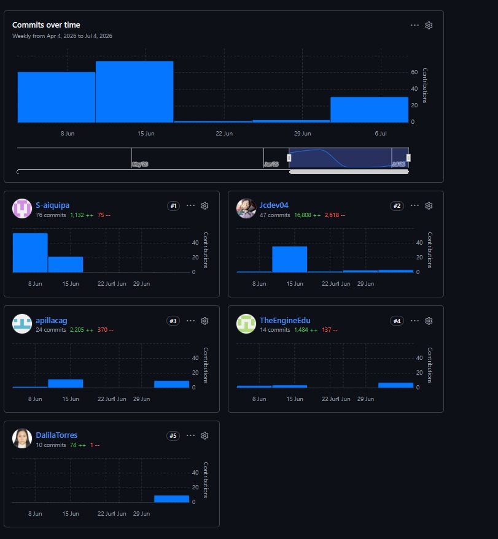

## 5.3. Validation Interviews

### 5.3.1. Diseño de Entrevistas

**Objetivo**

Validar la usabilidad, utilidad percibida y aceptación de la aplicación Chapa Tu Ruta por parte de los segmentos objetivo, mediante la interacción directa con la versión funcional desplegada, identificando problemas de usabilidad, funcionalidades faltantes y oportunidades de mejora.

**Público Objetivo**

Se entrevistarán los mismos dos segmentos de las entrevistas de needfinding:

- Pasajeros frecuentes de mototaxis en provincias
- Conductores de motos lineales y mototaxis

**Características:**

- Edad: 18 a 60 años
- Uso frecuente de transporte informal
- Acceso a un smartphone
- Haber participado en las entrevistas iniciales de needfinding

**Tipo de entrevistas:**

Se utilizarán entrevistas de validación estructuradas, combinando la observación directa del usuario interactuando con la aplicación y preguntas posteriores orientadas a recoger su percepción sobre la experiencia.

**Metodología:**

- Modalidad: Virtual
- Duración: 15 a 20 min por entrevista
- Herramienta: Se compartirá la URL pública de la aplicación desplegada para que el usuario la explore desde su propio dispositivo
- Registro: Video de la sesión subido a Microsoft Stream, con notas escritas en el informe

**Dinámica de la sesión:**

Cada sesión se divide en dos partes. En la primera, se le pide al entrevistado que realice una serie de tareas dentro de la aplicación sin intervención del equipo, mientras se observa su comportamiento. En la segunda, se realizan las preguntas de validación basadas en lo observado y en la experiencia del usuario.

**User flows a evaluar durante la sesión**

_Para pasajeros:_

1. Registrarse e iniciar sesión en la aplicación
2. Solicitar un viaje ingresando origen y destino
3. Revisar la tarifa estimada antes de confirmar el viaje
4. Confirmar el viaje y monitorear su estado en tiempo real
5. Calificar al conductor al finalizar el viaje

_Para conductores:_

1. Registrarse e iniciar sesión como conductor
2. Visualizar y aceptar una solicitud de viaje entrante
3. Consultar el historial de viajes y ganancias
4. Revisar calificaciones y comentarios recibidos de pasajeros

**Preguntas para pasajeros:**

1. Al ver la pantalla de inicio, ¿qué fue lo primero que entendiste que podías hacer con la aplicación?
2. Al solicitar tu viaje, ¿la tarifa estimada que te mostró la app te pareció justa o razonable? ¿Por qué?
3. ¿Hubo algún paso durante la solicitud del viaje en que no supiste qué hacer o te confundiste?
4. Comparando con cómo acordabas el precio antes, ¿sientes que esta forma es mejor, igual o peor? ¿Por qué?
5. ¿La información que ves del conductor (nombre, calificación, entre otros) te genera más confianza que tomar una moto en la calle? ¿Qué le agregarías o quitarías?
6. ¿Qué tan fácil o difícil fue calificar al conductor al finalizar el viaje? ¿Lo harías en la vida real?
7. ¿Hay alguna función que esperabas encontrar y no encontraste?
8. ¿Usarías esta aplicación en lugar de buscar mototaxis de la manera en que lo haces ahora? ¿Qué te lo impediría?

**Preguntas para conductores:**

1. Al registrarte como conductor, ¿el proceso te pareció claro? ¿Qué fue lo más complicado?
2. Cuando te llegó una solicitud de viaje, ¿la información que te mostraba (destino, tarifa, distancia) fue suficiente para decidir si aceptarla?
3. ¿Sientes que la tarifa que calcula la app es justa para ti como conductor? ¿Cambiarías algo?
4. ¿El historial de viajes y ganancias te muestra lo que necesitas para saber cómo te está yendo?
5. ¿Ver tus calificaciones y comentarios te motivaría a mejorar tu servicio? ¿O no le darías importancia?
6. ¿Hubo alguna pantalla o función que no entendiste a la primera?
7. ¿Qué tan probable es que recomiendes esta aplicación a otros conductores de tu zona? ¿Qué mejorarías primero?

**Pregunta de cierre (ambos segmentos):**

- En una sola frase, ¿cómo describirías esta aplicación a alguien de tu ciudad que aún no la conoce?

**Consideraciones éticas:**

- Se solicitará al entrevistado el consentimiento para la grabación de la sesión y el uso de su información
- Se garantizará la confidencialidad de la información proporcionada
- Los datos obtenidos serán utilizados únicamente con fines académicos

---

### 5.3.2. Registro de Entrevistas

#### Entrevista 1: Conductor

- **Nombre y Apellido:** Fabio Vallejo
- **Edad:** 25 años
- **Distrito de Residencia:** Chincha, Ica
- **Ocupación:** Conductor de mototaxi
- **Fecha:** 18 de junio de 2026
- **Inicio de la Entrevista:** 00:04
- **Duración:** 11:49

**URL del Video (Microsoft Stream):**
[Ver video](https://upcedupe-my.sharepoint.com/:v:/g/personal/u202322952_upc_edu_pe/IQDu9ivbUyt2Q6sr6kdyYCmqAT1TSRhacx8Ytc7hfTxvbPc?e=zAZ7ig&nav=eyJyZWZlcnJhbEluZm8iOnsicmVmZXJyYWxBcHAiOiJTdHJlYW1XZWJBcHAiLCJyZWZlcnJhbFZpZXciOiJTaGFyZURpYWxvZy1MaW5rIiwicmVmZXJyYWxBcHBQbGF0Zm9ybSI6IldlYiIsInJlZmVycmFsTW9kZSI6InZpZXcifX0%3D)

<p style="text-align: justify;">
Durante la demostración, comprendió adecuadamente el funcionamiento de la billetera virtual (Wallet), la activación de disponibilidad para recibir solicitudes y el flujo completo de un viaje, desde la postulación a una solicitud hasta la finalización y calificación del servicio. Asimismo, identificó que la información mostrada en las solicitudes, especialmente el destino y la tarifa, es suficiente para decidir si aceptar o no un viaje.

Respecto al sistema de tarifas, manifestó que el monto calculado le parece adecuado siempre que el algoritmo considere correctamente factores como la distancia y el tiempo estimado del recorrido. Además, valoró positivamente la visualización del historial de viajes, ya que le permite llevar un control de las carreras realizadas, las comisiones cobradas por la plataforma y las ganancias obtenidas.

En relación con el sistema de calificaciones, indicó que las valoraciones de los pasajeros pueden contribuir a mejorar la calidad del servicio brindado. Como sugerencia, recomendó complementar las calificaciones por estrellas con comentarios escritos que permitan recibir retroalimentación más detallada por parte de los usuarios.

El entrevistado señaló que la interfaz es intuitiva y que logró comprender el funcionamiento general de la plataforma sin dificultades. Finalmente, manifestó que recomendaría la aplicación a otros conductores de su zona debido a que facilita la captación de clientes y la organización de ingresos, destacando como principal mejora la necesidad de mantener un sistema de cálculo de tarifas preciso y justo tanto para conductores como para pasajeros. Asimismo, describió la solución como una plataforma que conecta pasajeros y conductores de mototaxi de manera más segura, organizada y eficiente.

</p>

**Evidencia:** <br><br>
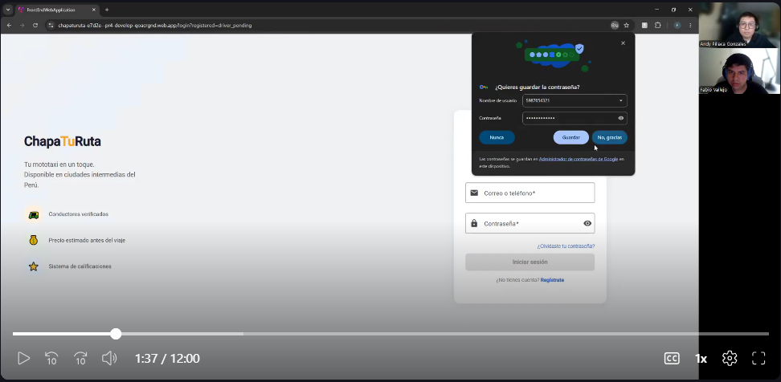

#### Entrevista 2: Conductor

- Nombre y Apellido: Carlos Sánchez
- Edad: 48 años
- Distrito de Residencia: Villa El Salvador, Lima
- Ocupación: Conductor de mototaxi
- Fecha: [18 de junio de 2026]
- Inicio de la Entrevista: [1:00]
- Duración: [08:15]
  URL del Video (Microsoft Stream): [Ver video](https://upcedupe-my.sharepoint.com/:v:/g/personal/u202322952_upc_edu_pe/IQAfyi2sAmeKR4tqBiDg1zelAcAcYnYbiWdTAaaqoSeF7nY?e=UhtVrf&nav=eyJyZWZlcnJhbEluZm8iOnsicmVmZXJyYWxBcHAiOiJTdHJlYW1XZWJBcHAiLCJyZWZlcnJhbFZpZXciOiJTaGFyZURpYWxvZy1MaW5rIiwicmVmZXJyYWxBcHBQbGF0Zm9ybSI6IldlYiIsInJlZmVycmFsTW9kZSI6InZpZXcifX0%3D)

Durante la sesión de validación, Carlos interactuó con la versión funcional de Chapa Tu Ruta a través de la URL pública desplegada, completando sin dificultad el registro como conductor y comprendiendo de forma clara cada paso del flujo solicitado. Indicó que el proceso de registro fue intuitivo y no presentó ninguna confusión al completarlo.

Al recibir una solicitud de viaje, señaló que la información mostrada —destino, tarifa y distancia— le resultó suficiente para decidir si aceptarla, sin necesidad de datos adicionales. Sobre el sistema de tarifas, manifestó que el monto calculado por la aplicación le pareció justo y adecuado para su trabajo como conductor.

Respecto al historial de viajes y ganancias, valoró positivamente que la información mostrada le permite saber cómo le está yendo en su jornada de trabajo. En cuanto al sistema de calificaciones, indicó que ver sus propias calificaciones y comentarios sí lo motivaría a mejorar su servicio.

Carlos no identificó ninguna pantalla o función que le generara confusión durante la navegación, calificando la interfaz como fácil de usar en su totalidad. Finalmente, expresó que recomendaría la aplicación a otros conductores de su zona sin reservas, y describió Chapa Tu Ruta como una herramienta que le permite conseguir pasajeros de forma más rápida y organizada que su método actual.

**Evidencia:** <br><br>
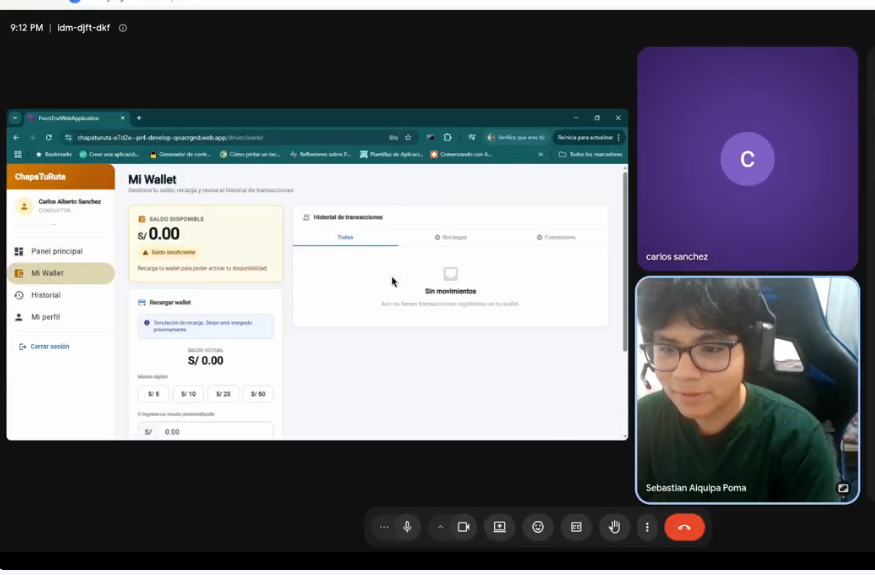

#### Entrevista 3: Conductor de Mototaxi

- Nombre: Yoni Jesús Ramos Sandoval
- Edad: No especificada
- Residencia: No especificada
- Ocupación: Conductor de Mototaxi
- Fecha: 18 de junio de 2026
- Inicio: 00:12
- Duración: 22:27

Link: [Ver video](https://upcedupe-my.sharepoint.com/personal/u202322952_upc_edu_pe/_layouts/15/stream.aspx?id=%2Fpersonal%2Fu202322952%5Fupc%5Fedu%5Fpe%2FDocuments%2FChapa%20Tu%20Ruta%2FU20241A911%5FValidacion%5FMototaxista%5FJhonny%2Emp4&referrer=StreamWebApp%2EWeb&referrerScenario=AddressBarCopied%2Eview%2E44a65b99%2D58a6%2D4b4a%2Db454%2D4e213e79deee)
Ver video

Resumen:

Respecto al proceso de registro, indicó que la experiencia fue clara y comprensible. Sin embargo, señaló que podría resultar necesario tener a la mano información relevante como el número de licencia de conducir y los datos del SOAT para completar el registro de manera eficiente. Asimismo, mencionó que algunos usuarios podrían experimentar dificultades técnicas menores relacionadas con el ingreso de información en determinados dispositivos.

Durante la simulación de solicitud de viajes, destacó que la información proporcionada por la plataforma, especialmente la distancia, el destino y la tarifa estimada, resulta suficiente para que un conductor pueda evaluar y decidir si acepta una carrera. Además, consideró que el cálculo de tarifas es adecuado siempre que refleje correctamente el recorrido y el tiempo estimado del servicio.

El entrevistado valoró positivamente el módulo de historial de viajes y ganancias, ya que le permite conocer los recorridos realizados, los pagos obtenidos y llevar un mejor control de sus actividades diarias. Consideró que esta información contribuye a una gestión más organizada de sus ingresos y facilita el seguimiento de su desempeño como conductor.

Respecto al sistema de reputación, señaló que las calificaciones representan un elemento importante de motivación para brindar un mejor servicio. Asimismo, sugirió incorporar comentarios escritos junto con las valoraciones por estrellas, permitiendo que los pasajeros expliquen los motivos de sus evaluaciones y proporcionando una retroalimentación más útil para los conductores.

Como observación de mejora, indicó que la funcionalidad denominada "Wallet" no fue completamente intuitiva debido al uso de terminología poco familiar para algunos usuarios. Por ello, recomendó emplear nombres más descriptivos o adaptados al contexto local para facilitar la comprensión de la interfaz.

Finalmente, manifestó que recomendaría la aplicación a otros conductores de mototaxi debido a que facilita la identificación de pasajeros disponibles, reduce el tiempo invertido en la búsqueda de clientes y contribuye a optimizar el uso de combustible. En una sola frase, describió la solución como una herramienta que genera beneficios económicos tanto para conductores como para pasajeros, permitiendo una conexión más eficiente, organizada y accesible entre ambos segmentos.

Evidencia:
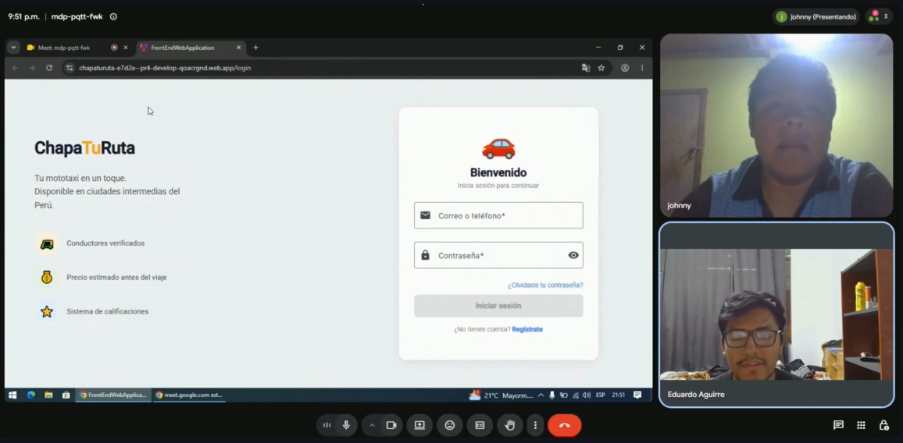

---

#### Entrevista 4: Pasajera

- Nombre: Karen Guio Gonzales
- Edad: 22 años
- Residencia: No especificada
- Ocupación: Estudiante de Administración
- Fecha: 19 de junio de 2026
- Inicio de la Entrevista: 00:12
- Duración: 22:27

Link: [Ver video](https://upcedupe-my.sharepoint.com/personal/u202322952_upc_edu_pe/_layouts/15/stream.aspx?id=%2Fpersonal%2Fu202322952%5Fupc%5Fedu%5Fpe%2FDocuments%2FChapa%20Tu%20Ruta%2Fu202322952%5FValidaci%C3%B3n%5FPasajera%5FKaren%2Emp4&referrer=StreamWebApp%2EWeb&referrerScenario=AddressBarCopied%2Eview%2Ea0a900c4%2Db3c8%2D429a%2Dbb49%2Ddab72bb0fa68)

Resumen:

Respecto al proceso de registro, indicó que la experiencia fue sumamente intuitiva y clara para una usuaria de su perfil. Mencionó que la interfaz es limpia y fácil de navegar desde el primer contacto.

Durante la simulación de solicitud de viajes, Karen enfatizó que la plataforma debería parecerse más al modelo de negocio de **inDrive**, donde la negociación directa de las tarifas sea la característica principal y el pasajero tenga la capacidad de proponer un precio menor o negociar un precio de partida justo con el conductor. Para ella, tener la opción de bajar la tarifa y llegar a un acuerdo mutuo es el aspecto primordial del servicio de mototaxis.

Asimismo, recomendó mejorar y potenciar las funcionalidades en tiempo real, sugiriendo un seguimiento de geolocalización más dinámico en el mapa interactivo para visualizar con precisión la trayectoria del conductor antes y durante el viaje, lo cual incrementaría significativamente la percepción de seguridad de los usuarios.

Finalmente, concluyó que la aplicación es de gran utilidad práctica para su vida estudiantil y diaria, recomendándola para viajes rápidos y económicos en zonas urbanas periféricas.

Evidencia:
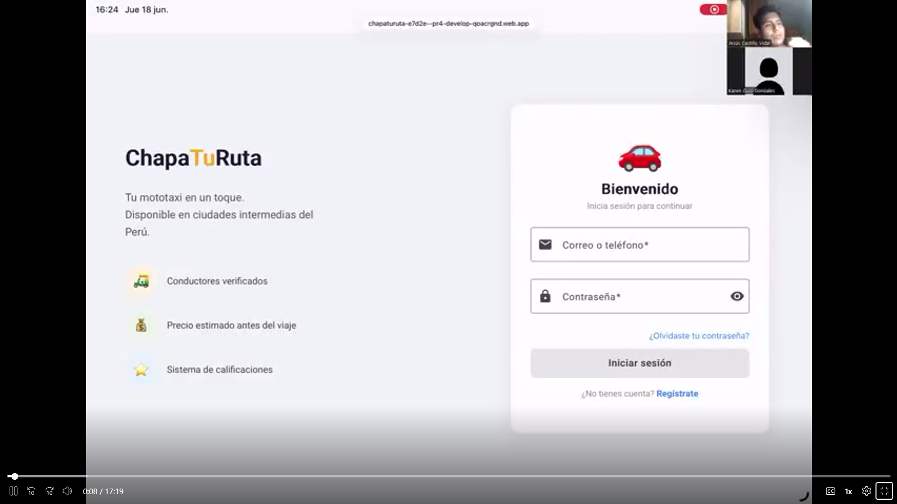


#### Entrevista 5: Pasajero

- Nombre: Eddo Su Caletti
- Edad: 21 años
- Residencia: No especificada
- Ocupación: Estudiante de Ingeniería de Sistemas
- Fecha: 07 de julio de 2026
- Inicio de la Entrevista: 00:01
- Duración: 22:27

Link: [Ver video](https://upcedupe-my.sharepoint.com/:v:/g/personal/u202322952_upc_edu_pe/IQAsm2DxIV3UQLuC4tSSsPlgAcmlgNzP1D7VU6ue7kxotEs?e=pHESsO)
<br>https://upcedupe-my.sharepoint.com/:v:/g/personal/u202322952_upc_edu_pe/IQAsm2DxIV3UQLuC4tSSsPlgAcmlgNzP1D7VU6ue7kxotEs?e=pHESsO

Resumen:

El usuario comentó que la aplicación le pareció fácil de usar y con un diseño atractivo. Sobre la solicitud de viajes, le resultó intuitiva y valoró poder ver los mototaxistas disponibles con sus tarifas. Destacó como muy útil el seguimiento del conductor en el mapa en tiempo real. También mencionó que calificar al final del viaje fue sencillo. En general, el usuario se mostró muy satisfecho, mencionando que recomendaría la aplicación y que la volvería a usar sin dudarlo.

Evidencia:
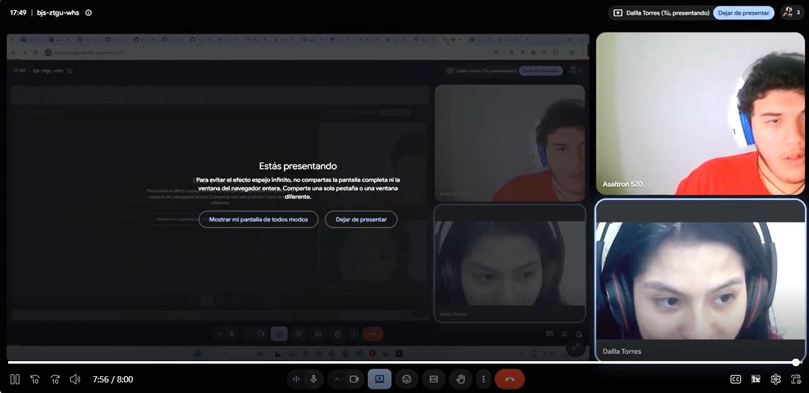


---

## 5.3.3. Evaluaciones según heurísticas.

**UX Heuristics & Principles Evaluation**
_Usability – Inclusive Design – Information Architecture_

**SITE o APP A EVALUAR:**
Chapa Tu Ruta – Aplicación web de mototaxi booking (vistas de pasajero y conductor).

**TAREAS A EVALUAR:**
El alcance de esta evaluación incluye la revisión de la usabilidad de las siguientes tareas:

_Segmento Pasajero:_

1. Registrarse e iniciar sesión en la aplicación
2. Solicitar un viaje ingresando origen y destino
3. Revisar la tarifa estimada antes de confirmar el viaje
4. Confirmar el viaje y monitorear su estado en tiempo real
5. Calificar al conductor al finalizar el viaje

_Segmento Conductor:_ 6. Registrarse e iniciar sesión como conductor 7. Visualizar y aceptar una solicitud de viaje entrante 8. Consultar el historial de viajes y ganancias 9. Revisar calificaciones y comentarios recibidos de pasajeros

No están incluidas en esta versión de la evaluación las siguientes tareas:

1. Comunicación directa (chat) entre conductor y pasajero
2. Gestión de métodos de pago digitales
3. Reportes históricos de ganancias por mes o año
4. Configuración de zonas de trabajo preferidas
5. Edición avanzada de perfil de pasajero
6. Programa de fidelización o puntos

**ESCALA DE SEVERIDAD:**

| Nivel | Descripción                                                                                                                                                                          |
| ----- | ------------------------------------------------------------------------------------------------------------------------------------------------------------------------------------ |
| 1     | Problema superficial: puede ser fácilmente superado por el usuario o ocurre con muy poca frecuencia. No necesita ser arreglado a no ser que exista disponibilidad de tiempo.         |
| 2     | Problema menor: puede ocurrir un poco más frecuentemente o es un poco más difícil de superar para el usuario. Se le debería asignar una prioridad baja de cara al siguiente release. |
| 3     | Problema mayor: ocurre frecuentemente o los usuarios no son capaces de resolverlo. Es importante que sea corregido y se le debe asignar prioridad alta.                              |
| 4     | Problema muy grave: un error de gran impacto que impide al usuario continuar con el uso de la herramienta. Es imperativo que sea corregido antes del lanzamiento.                    |

**TABLA RESUMEN:**

| #   | Problema                                                                                       | Segmento  | Escala de severidad | Heurística/Principio violada(o)               |
| --- | ---------------------------------------------------------------------------------------------- | --------- | ------------------- | --------------------------------------------- |
| 1   | No se ofrecen diferentes medios de pago, solo la opción actual disponible                      | Pasajero  | 2                   | Usability: Flexibilidad y eficiencia de uso   |
| 2   | No se permite ingresar la dirección de forma escrita; solo se puede marcar un punto en el mapa | Pasajero  | 2                   | Usability: Flexibilidad y eficiencia de uso   |
| 3   | El diseño visual de la aplicación es percibido como simple, sin elementos llamativos           | Pasajero  | 1                   | Usability: Estética y diseño visual           |
| 4   | No se indica claramente cuáles campos del perfil de conductor son obligatorios                 | Conductor | 2                   | Usability: Prevención de errores              |
| 5   | Dificultad para ubicar y adjuntar el documento del brevete durante el registro                 | Conductor | 2                   | Usability: Ayuda y documentación              |
| 6   | No se muestra información de seguridad de la zona de destino al recibir una solicitud de viaje | Conductor | 3                   | Information Architecture: Is it useful?       |
| 7   | La tarifa calculada es fija, sin posibilidad de ajuste en zonas de difícil acceso              | Conductor | 2                   | Usability: Flexibilidad y eficiencia de uso   |
| 8   | El historial de ganancias no permite comparar periodos (semana actual vs. anterior)            | Conductor | 1                   | Information Architecture: Is it useful?       |
| 9   | Las calificaciones muestran solo el puntaje, sin el motivo o comentario del pasajero           | Conductor | 2                   | Usability: Visibilidad del estado del sistema |

**DESCRIPCIÓN DE PROBLEMAS:**

**PROBLEMA #1: No se ofrecen diferentes medios de pago**
Severidad: 2
Heurística violada: Usability – Flexibilidad y eficiencia de uso
Problema: La pasajera indicó que la aplicación solo permite un único método de pago, sin alternativas como tarjeta, billetera digital o efectivo configurable. Esto limita la flexibilidad para distintos perfiles de usuario y puede ser una barrera de adopción para quienes prefieren otro medio.
_(Incluir captura de pantalla de la sección de pago)_
Recomendación: Incorporar al menos una segunda opción de pago (ej. efectivo y billetera digital), permitiendo al usuario elegir su preferencia antes de confirmar el viaje.

**PROBLEMA #2: No se permite ingresar la dirección de forma escrita**
Severidad: 2
Heurística violada: Usability – Flexibilidad y eficiencia de uso
Problema: Actualmente, la selección de origen y destino se realiza únicamente marcando un punto en el mapa. La pasajera mencionó que preferiría poder escribir la dirección exacta, ya que en algunos casos resulta más rápido o preciso que ubicar el punto manualmente, especialmente en zonas con poca referencia visual en el mapa.
_(Incluir captura de pantalla de la pantalla de selección de origen/destino)_
Recomendación: Agregar un campo de búsqueda de direcciones (autocompletado) como alternativa al marcado manual en el mapa, manteniendo ambas opciones disponibles.

**PROBLEMA #3: Diseño visual percibido como simple**
Severidad: 1
Heurística violada: Usability – Estética y diseño visual
Problema: La pasajera comentó que el diseño actual de la aplicación le pareció simple y que esperaría una interfaz más llamativa visualmente. Si bien esto no afecta la funcionalidad ni la comprensión de las tareas, impacta en la percepción general y el atractivo de la app frente a otras alternativas del mercado.
Recomendación: Revisar la paleta de colores, tipografía e iconografía para reforzar la identidad visual de la marca, sin comprometer la claridad ni la usabilidad existente.

**PROBLEMA #4: No se indica claramente cuáles campos del perfil de conductor son obligatorios**
Severidad: 2
Heurística violada: Usability – Prevención de errores
Problema: Al completar la pantalla de perfil completo, el conductor no logró identificar a la primera cuáles campos eran obligatorios y cuáles opcionales, ya que no había ningún indicador visual (como un asterisco) que lo señalara. Esto generó incertidumbre sobre si podía continuar sin llenarlos todos.
_(Incluir captura de pantalla de la sección de perfil del conductor)_
Recomendación: Marcar los campos obligatorios con un asterisco (\*) junto al label, y mostrar un mensaje de validación inline antes de permitir avanzar.

**PROBLEMA #5: Dificultad para ubicar y adjuntar el documento del brevete durante el registro**
Severidad: 2
Heurística violada: Usability – Ayuda y documentación
Problema: Durante el registro, al solicitar la foto del brevete, el conductor tardó entre dos y tres minutos en encontrar el archivo en su celular, ya que no tenía claro en qué formato o desde dónde debía adjuntarlo. El flujo no ofrece ninguna guía adicional (ej. "puedes tomar una foto ahora" o "selecciona desde galería").
_(Incluir captura de pantalla del paso de carga de documentos)_
Recomendación: Agregar un texto de ayuda breve junto al campo de carga (ej. "Toma una foto clara de tu brevete o selecciona una imagen existente") y ofrecer la opción de cámara directa además de la galería.

**PROBLEMA #6: No se muestra información de seguridad de la zona de destino al recibir una solicitud de viaje**
Severidad: 3
Heurística violada: Information Architecture – Is it useful?
Problema: En la pantalla de solicitud entrante, el conductor cuenta con destino, tarifa y distancia, pero no con ninguna referencia sobre el nivel de seguridad de la zona. El entrevistado señaló explícitamente que esto es relevante para su decisión, especialmente en viajes nocturnos, lo cual afecta directamente su disposición a aceptar ciertos viajes.
_(Incluir captura de pantalla de la solicitud de viaje entrante)_
Recomendación: Incorporar un indicador visual de la zona (por ejemplo, basado en reportes previos de incidentes o en zonas validadas por la comunidad de conductores) dentro de la tarjeta de solicitud.

**PROBLEMA #7: La tarifa calculada es fija, sin posibilidad de ajuste en zonas de difícil acceso**
Severidad: 2
Heurística violada: Usability – Flexibilidad y eficiencia de uso
Problema: El conductor indicó que la tarifa automática le parece razonable para viajes estándar, pero que en su experiencia actual (fuera de la app) tiene margen de negociación para zonas de difícil acceso, algo que la aplicación no contempla. Esto reduce su percepción de control sobre sus ingresos en casos específicos.
Recomendación: Evaluar un mecanismo de recargo opcional y transparente para zonas o condiciones específicas, visible también para el pasajero antes de confirmar.

**PROBLEMA #8: El historial de ganancias no permite comparar periodos**
Severidad: 1
Heurística violada: Information Architecture – Is it useful?
Problema: El historial muestra el número de viajes y las ganancias del día, pero no ofrece una comparación con periodos anteriores (semana actual vs. semana pasada), lo cual el conductor consideró útil para evaluar su desempeño a lo largo del tiempo.
_(Incluir captura de pantalla del historial de ganancias)_
Recomendación: Añadir una vista resumen semanal/mensual con comparación porcentual respecto al periodo anterior.

**PROBLEMA #9: Las calificaciones muestran solo el puntaje, sin el motivo o comentario del pasajero**
Severidad: 2
Heurística violada: Usability – Visibilidad del estado del sistema
Problema: El conductor mencionó que, ante una calificación baja, le gustaría entender el motivo específico para poder mejorar, pero la app únicamente muestra la cantidad de estrellas sin contexto adicional cuando el pasajero no deja comentario.
Recomendación: Incentivar o solicitar un comentario breve obligatorio cuando la calificación sea baja (1-2 estrellas), y mostrarlo en el historial del conductor.

## 5.4 About-the-Product

<p align="justify">
En esta sección se presenta el video promocional About the Product, cuyo objetivo es mostrar de manera general la propuesta de valor del proyecto, destacando su modelo de negocio, principales funcionalidades y beneficios para los usuarios. Asimismo, el video incluye demostraciones de interacción con el producto y testimonios obtenidos de los segmentos objetivo, que permiten evidenciar la utilidad y aceptación de la solución desarrollada. Como parte de las actividades de difusión y validación, el material audiovisual fue publicado en Microsoft Stream y YouTube, además de ser integrado en la Landing Page del proyecto para facilitar su acceso y visualización.
</p>

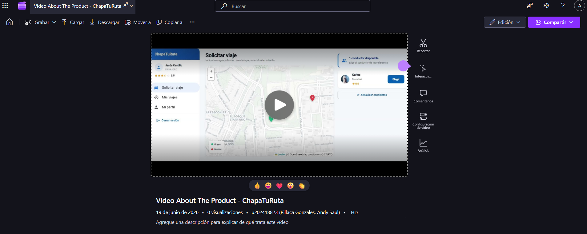 
<a href="https://upcedupe-my.sharepoint.com/:v:/g/personal/u202418823_upc_edu_pe/IQCO1kWxNJvXTIEGb549DweIAafZ09jFJtPep1_Gi_WR7SQ?e=fj2mXZ&nav=eyJyZWZlcnJhbEluZm8iOnsicmVmZXJyYWxBcHAiOiJTdHJlYW1XZWJBcHAiLCJyZWZlcnJhbFZpZXciOiJTaGFyZURpYWxvZy1MaW5rIiwicmVmZXJyYWxBcHBQbGF0Zm9ybSI6IldlYiIsInJlZmVycmFsTW9kZSI6InZpZXcifX0%3D" target="_blank">About the product - microsoft</a><br><br>

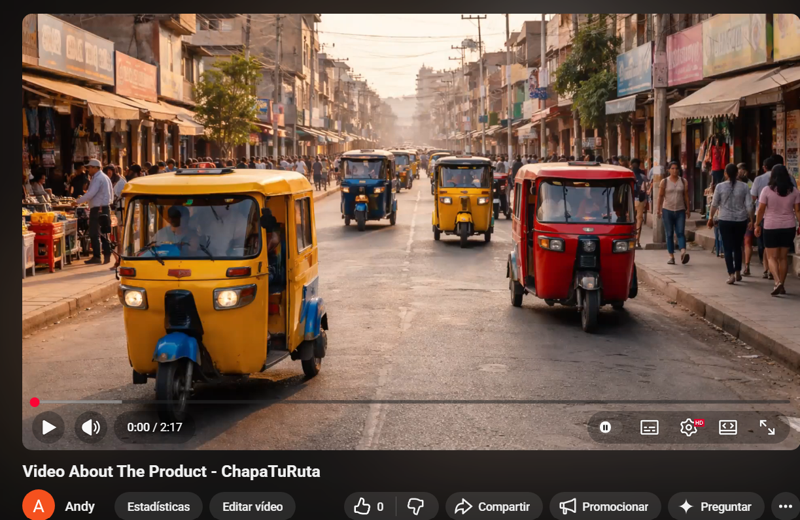 
<a href="https://www.youtube.com/watch?v=VIuDAmngaiI" target="_blank">About the product - youtube</a><br><br>


---

# Conclusiones

## Conclusiones y recomendaciones

1. Validación del Problem Statement principal:
   El equipo identificó que en zonas rurales y periurbanas del Perú, la ausencia de una herramienta digital accesible genera una desconexión estructural entre la oferta y demanda de mototaxis, afectando tanto la economía de los conductores como la calidad de vida de los pasajeros. Las entrevistas realizadas a usuarios en Chincha, Huaraz, Carhuaz y Villa El Salvador confirmaron esta problemática de forma consistente: los tres pasajeros entrevistados reportaron inseguridad, regateo de tarifas e incertidumbre sobre la disponibilidad del servicio, mientras que los tres conductores señalaron recorridos en vacío, alta competencia en paraderos y jornadas de baja
   rentabilidad. Estos hallazgos validan que el problema identificado en el Lean UX Process
   corresponde a una necesidad real y no a una suposición del equipo.

2. Contraste de Assumptions de negocio con la realidad del segmento:
   El equipo asumió que los pasajeros en zonas periféricas requerirían una forma accesible de solicitar mototaxis sin depender de disponibilidad física en la calle, y que los conductores estarían dispuestos a adoptar una plataforma digital si esta era sencilla, tenía comisiones bajas
   y garantizaba mayor seguridad. Ambos supuestos fueron respaldados por las entrevistas: los pasajeros priorizaron la visibilidad del perfil del conductor como mecanismo de reducción del riesgo percibido, y los conductores manifestaron interés en funciones de negociación de tarifas,
   visualización de zonas de demanda y sistemas de calificación. Sin embargo, también se identificó como assumption crítica la resistencia al cambio por parte de conductores informales, lo cual deberá abordarse en fases posteriores mediante onboarding simplificado y alianzas con
   asociaciones locales.

3. Validación parcial de los Hypothesis Statements:
   El equipo formuló cuatro hipótesis principales en el Lean UX Canvas. La hipótesis sobre la negociación de tarifas (60% de viajes concretados mediante negociación) y la hipótesis sobre la reducción del abandono (30% al ofrecer interfaz ligera) no pudieron validarse cuantitativamente
   en esta etapa dado que el producto aún no cuenta con usuarios reales. No obstante, el desarrollo del Sprint 2 implementó los flujos de solicitud, aceptación y negociación de viajes en el frontend, sentando las bases técnicas para medir estas hipótesis en iteraciones futuras con usuarios piloto en las ciudades objetivo.

4. Avance en los criterios de éxito del Lean UX:
   Los criterios de éxito definidos incluían alcanzar 500 usuarios activos en tres meses, superar el 80% de valoraciones positivas, reducir el tiempo de aceptación de viajes a menos de 30 segundos y lograr que al menos el 50% de usuarios revisaran su historial. Aunque estos indicadores aún no son medibles en producción, el diseño del sistema los tuvo como eje central: el flujo de calificaciones, el historial de viajes, las notificaciones en tiempo real vía Ably y la visualización del perfil del conductor fueron implementados directamente en respuesta a estos criterios, lo que demuestra coherencia entre el proceso de Lean UX y las decisiones de desarrollo.

5. Definición clara de segmentos objetivo y su impacto en el diseño:
   Se identificaron dos segmentos diferenciados: pasajeros de 15 a 60 años que valoran la verificación de conductores, la disponibilidad constante y la trazabilidad del viaje; y mototaxistas formales de 20 a 50 años que buscan optimizar su tiempo activo, aumentar ingresos y reducir la
   incertidumbre de la demanda. Esta segmentación tuvo impacto directo en la arquitectura de información, el sistema de etiquetado, los wireflows y los User Stories priorizados en el Product Backlog, garantizando que cada funcionalidad desarrollada respondiera a una necesidad concreta
   de alguno de los dos perfiles.

6. Solidez de la arquitectura bajo Domain-Driven Design:
   La aplicación de DDD permitió estructurar el sistema en cinco Bounded Contexts bien delimitados: Identidad y Acceso, Gestión de Viajes, Geolocalización y Notificaciones, Tarifas y Calificaciones, e Historial y Administración. Esta decisión arquitectónica, respaldada por el Design-Level Event Storming y los diagramas C4, garantiza que ChapaTuRuta pueda escalar a nuevas ciudades y funcionalidades sin comprometer la integridad del sistema existente, lo cual es coherente con la visión de convertirse en la plataforma de referencia para el transporte en mototaxi en ciudades intermedias de Latinoamérica.

7. Implementación funcional del frontend en el Sprint 2:
   Durante el Sprint 2 se desarrolló la aplicación web en Angular con una fake API (json-server), implementando los flujos principales de ambos perfiles: solicitud de viaje con geolocalización mediante la Geolocation API, mapa interactivo con Leaflet, sistema de candidatos al estilo
   inDrive, gestión de disponibilidad del conductor con validación de saldo en wallet, visualización de estados del viaje y notificaciones. Este avance representa la transición del proyecto desde la documentación hacia un producto tangible y demostrable, lo que constituye una base sólida para el desarrollo del backend en iteraciones siguientes.

8. Aplicación consistente de metodologías ágiles y buenas prácticas de ingeniería:
   El equipo adoptó GitFlow con Conventional Commits, Pull Requests estructurados y versionado semántico a lo largo de ambos sprints, acumulando más de 160 commits en el repositorio del informe y decenas adicionales en el frontend. El uso de Gherkin para los criterios de aceptación
   de las User Stories y Technical Stories mejoró la claridad y trazabilidad de los requerimientos. Estas prácticas no solo evidencian competencia técnica del equipo sino que también reflejan la capacidad de comunicar decisiones de desarrollo de forma escrita, clara y organizada, cumpliendo con el Student Outcome 3 establecido para el curso.

9. Integración y despliegue del Frontend con la API Backend:
   El desarrollo técnico culminó en la transición exitosa de una arquitectura inicial basada en Fake API hacia un sistema completamente conectado y funcional. Se integró la aplicación web frontend en Angular con los servicios del backend desarrollados en Spring Boot, logrando una comunicación fluida a través de peticiones HTTP REST y el mapeo estructurado de datos. El despliegue final en producción (tanto de la interfaz web como de la API documentada con Swagger) demuestra la interoperabilidad del sistema y la viabilidad técnica para soportar flujos en tiempo real y persistencia real en base de datos.

10. Validación y optimización de la experiencia de usuario (UX):
    Las entrevistas de validación con los usuarios finales (conductores y pasajeros) y la evaluación heurística detallada permitieron contrastar la usabilidad de la plataforma frente a necesidades reales y estándares de diseño. Se identificaron oportunidades clave de mejora en la visibilidad del estado del sistema, consistencia de la navegación y prevención de errores en los flujos de registro y solicitud de viajes. La retroalimentación cualitativa obtenida valida la propuesta de valor del producto, demostrando que Chapa Tu Ruta es percibida como una solución segura e intuitiva, a la vez que orienta el roadmap de optimización continua del software.

## Video About-the-Team


Esta sección contiene el video de presentación del equipo ("About-the-Team"), el cual resume nuestro proceso de trabajo colaborativo, la metodología aplicada y las contribuciones individuales durante el desarrollo del proyecto "Chapa Tu Ruta".

### Introducción al proceso y logros del equipo

A lo largo de los Sprints del proyecto, el equipo de CTR Technologies ha trabajado de manera altamente coordinada utilizando metodologías ágiles. Partiendo de la fase de descubrimiento con Lean UX y _Needfinding_, logramos validar de primera mano las problemáticas de transporte informal y la inseguridad percibida en zonas periféricas mediante entrevistas estructuradas a pasajeros y conductores.
En la fase de diseño y arquitectura, el equipo aplicó de manera rigurosa la metodología **Domain-Driven Design (DDD)**, estructurando la plataforma en dos segmentos (conductores y pasajeros) y cinco contextos delimitados (_Bounded Contexts_) que garantizan la modularidad y escalabilidad del sistema.
Durante los entregables finales (AV2), nos enfocamos en el desarrollo técnico, implementando el frontend interactivo en Angular con geolocalización, Leaflet para mapas en tiempo real, un sistema dinámico de negociación de tarifas y la integración de notificaciones. Los logros alcanzados demuestran un alto nivel de madurez técnica, trabajo colaborativo y la consecución del **Student Outcome 3 (ABET)** de comunicación efectiva a través de reportes técnicos claros y sustentaciones profesionales.

### Enlaces del Video

- **Video en YouTube:** [https://youtu.be/HDYLQ8mfSgA](https://youtu.be/HDYLQ8mfSgA)
- **Video en Microsoft Stream:** [Enlace al Video en Microsoft Stream](https://stream.microsoft.com/) _(Colocar aquí la URL del video subido a Microsoft Stream)_

### Código de Inserción para el Landing Page

Para integrar el video en la sección "Nosotros" o "About Us" del Landing Page del producto, se puede utilizar el siguiente fragmento de código HTML estándar:

```html
<section
  class="about-team-video"
  id="about-team-video"
  style="padding: 50px 0; text-align: center; background-color: #f9f9f9;"
>
  <div class="container" style="max-width: 800px; margin: 0 auto;">
    <h2 style="font-size: 2.5rem; margin-bottom: 20px; color: #333;">
      About our Team
    </h2>
    <p style="font-size: 1.1rem; color: #666; margin-bottom: 30px;">
      Conoce a los integrantes de CTR Technologies y descubre cómo diseñamos y
      desarrollamos <strong>Chapa Tu Ruta</strong>, nuestra plataforma
      inteligente para el transporte en mototaxi.
    </p>
    <div
      class="video-wrapper"
      style="position: relative; padding-bottom: 56.25%; height: 0; overflow: hidden; border-radius: 8px; box-shadow: 0 4px 15px rgba(0,0,0,0.1);"
    >
      <iframe
        style="position: absolute; top: 0; left: 0; width: 100%; height: 100%; border: 0;"
        src="https://www.youtube.com/embed/VIDEO_ID"
        title="Chapa Tu Ruta - About the Team"
        allow="accelerometer; autoplay; clipboard-write; encrypted-media; gyroscope; picture-in-picture"
        allowfullscreen
      >
      </iframe>
    </div>
  </div>
</section>
```

# Bibliografía

1. Dato de 1.6 millones de mototaxis registrados (MTC, 2021) y 3 millones de conductores (Federación Nacional de Mototaxistas):
   https://www.infobae.com/peru/2024/09/22/nueva-ley-del-mototaxista-creara-un-registro-universal-de-los-transportistas-que-brindan-este-servicio/
2. Dato de población INEI 2024 (34 millones / 60% en ciudades +100k hab.):
   https://www.infobae.com/peru/2024/07/12/peru-aumento-el-numero-de-habitantes-en-el-2024-estudio-de-inei-revela-la-nueva-cifra/
3. Ley N.° 31917 y requisitos del MTC (licencia B-IIc, SOAT, inspección técnica):
   https://larepublica.pe/sociedad/2024/09/21/el-nuevo-reglamento-del-mtc-que-regira-para-el-servicio-de-mototaxi-en-peru-conoce-requisitos-y-sanciones-1765596
4. Reglamento MTC 2024 y contexto regulatorio:
   https://eltiempo.pe/nacional/nuevo-reglamento-mototaxi-2024-cuales-son-los-nuevos-cambios-que-implemento-el-mtc-en-peru/

# Anexos

En esta sección se presentan los enlaces a los recursos de diseño, presentaciones de equipo y entornos desplegados para el proyecto "Chapa Tu Ruta":

- **Diseño del Prototipo en Figma:** [https://www.figma.com/design/XB9QCFVfSKHug7qbvAIjFw/Open-Source?node-id=151-2853&t=ji2FxuuNBFc7GAFY-1](https://www.figma.com/design/XB9QCFVfSKHug7qbvAIjFw/Open-Source?node-id=151-2853&t=ji2FxuuNBFc7GAFY-1)
- **Presentación "About the Team":** [https://youtu.be/HDYLQ8mfSgA](https://youtu.be/HDYLQ8mfSgA)
- **Presentación "About the product":** [https://www.youtube.com/watch?v=VIuDAmngaiI](https://www.youtube.com/watch?v=VIuDAmngaiI)
- **Presentación de la Exposición:** [https://canva.link/8784xk57e4h00eh](https://canva.link/8784xk57e4h00eh)
- **Despliegue de la Aplicación Frontend:** [https://chapaturuta-e7d2e.web.app/login](https://chapaturuta-e7d2e.web.app/login)
- **Despliegue de la API Backend (Swagger UI):** [https://backend-webapplication-production.up.railway.app/swagger-ui/index.html](https://backend-webapplication-production.up.railway.app/swagger-ui/index.html)
